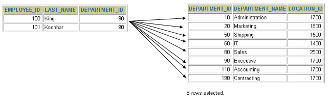
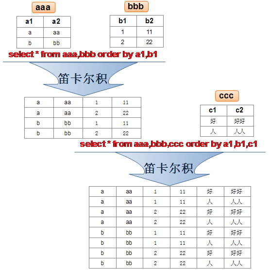
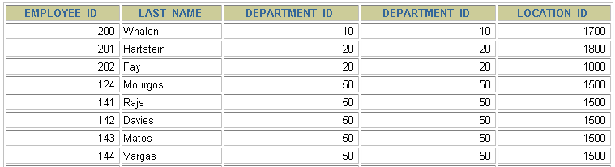
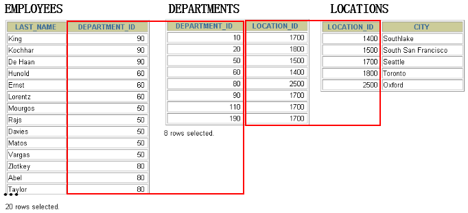
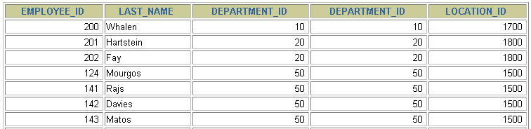

# 第06章_多表查询

讲师：尚硅谷-宋红康（江湖人称：康师傅）

官网：[http://www.atguigu.com](http://www.atguigu.com/)

***

多表查询，也称为关联查询，指两个或更多个表一起完成查询操作。

前提条件：这些一起查询的表之间是有关系的（一对一、一对多），它们之间一定是有关联字段，这个关联字段可能建立了外键，也可能没有建立外键。比如：员工表和部门表，这两个表依靠“部门编号”进行关联。

## 1. 一个案例引发的多表连接

### 1.1 案例说明


从多个表中获取数据：


```mysql
#案例：查询员工的姓名及其部门名称
SELECT last_name, department_name
FROM employees, departments;
```



查询结果：

```mysql
+-----------+----------------------+
| last_name | department_name      |
+-----------+----------------------+
| King      | Administration       |
| King      | Marketing            |
| King      | Purchasing           |
| King      | Human Resources      |
| King      | Shipping             |
| King      | IT                   |
| King      | Public Relations     |
| King      | Sales                |
| King      | Executive            |
| King      | Finance              |
| King      | Accounting           |
| King      | Treasury             |
...
| Gietz     | IT Support           |
| Gietz     | NOC                  |
| Gietz     | IT Helpdesk          |
| Gietz     | Government Sales     |
| Gietz     | Retail Sales         |
| Gietz     | Recruiting           |
| Gietz     | Payroll              |
+-----------+----------------------+
2889 rows in set (0.01 sec)
```

**分析错误情况：**

```sql
SELECT COUNT(employee_id) FROM employees;
#输出107行

SELECT COUNT(department_id)FROM departments;
#输出27行

SELECT 107*27 FROM dual;
```

我们把上述多表查询中出现的问题称为：笛卡尔积的错误。

### 1.2 笛卡尔积（或交叉连接）的理解

> 笛卡尔积（Cartesian Product）是 SQL 中的一个概念，指的是 **两个表在没有任何连接条件（JOIN 条件）的情况下进行组合**，会生成 **所有可能的行组合**。



#### 1.2.1. 笛卡尔积的基本概念

当我们对两个表 `A` 和 `B` 进行笛卡尔积运算时，SQL 会将 **A 表的每一行与 B 表的每一行相组合**，最终得到的结果集大小为：

$$
行数 = A\ 表的行数 \times B\ 表的行数
$$

**示例: 假设有两个表**

`employees` 表：
| id | name   |
|----|--------|
| 1  | Alice  |
| 2  | Bob    |

`departments` 表：
| dept_id | dept_name    |
|---------|-------------|
| 101     | HR          |
| 102     | IT          |

如果我们执行以下 SQL：
```sql
SELECT * FROM employees, departments;
```
那么得到的结果是：

| id | name  | dept_id | dept_name  |
|----|-------|---------|-----------|
| 1  | Alice | 101     | HR        |
| 1  | Alice | 102     | IT        |
| 2  | Bob   | 101     | HR        |
| 2  | Bob   | 102     | IT        |

可以看到，`employees` 表的每一行都与 `departments` 表的每一行组合在一起，形成了 **笛卡尔积**。

---

#### 1.2.2. 笛卡尔积的 SQL 语法
在 SQL 里，笛卡尔积可以通过以下两种方式生成：

**方式 1：使用 `CROSS JOIN`**
```sql
SELECT * FROM employees CROSS JOIN departments;
```
`CROSS JOIN` 会 **直接** 生成笛卡尔积，结果与 `employees, departments` 的写法相同。

**方式 2：使用 `FROM` 但不加 `JOIN` 条件**
```sql
SELECT * FROM employees, departments;
```
如果没有 `ON` 或 `WHERE` 过滤条件，MySQL 也会生成笛卡尔积。

---

#### 1.2.3. 何时使用笛卡尔积？
虽然笛卡尔积通常是不必要的，但在某些场景下，它仍然有用，例如：
1. **生成所有可能的组合**
   - 比如，你有一个颜色表（`colors`）和一个尺寸表（`sizes`），可以使用笛卡尔积生成所有可能的产品组合。
   
2. **数据填充**
   - 在数据分析中，可能需要创建一个完整的匹配数据集，比如所有用户和所有时间段的组合。

3. **测试 SQL 逻辑**
   - 通过笛卡尔积可以检查查询是否正确组合了所有数据。

---


### 1.3 案例分析与问题解决

- **笛卡尔积的错误会在下面条件下产生**：

  - 省略多个表的连接条件（或关联条件）
  - 连接条件（或关联条件）无效
  - 所有表中的所有行互相连接

- 为了避免笛卡尔积， 可以**在 WHERE 加入有效的连接条件。**

- 加入连接条件后，查询语法：

  ```sql
  SELECT	table1.column, table2.column
  FROM	table1, table2
  WHERE	table1.column1 = table2.column2;  #连接条件
  ```

  - **在 WHERE子句中写入连接条件。**

- 正确写法：

  ```sql
  #案例：查询员工的姓名及其部门名称
  SELECT
    e.last_name,
    d.department_name
  FROM
    atguigudb.employees e,
    atguigudb.departments d
  WHERE
    e.department_id = d.department_id;
  ```
  
- **在表中有相同列时，在列名之前加上表名前缀。**

## 2. 多表查询分类讲解

### 分类1：等值连接 vs 非等值连接

#### 等值连接


```sql
SELECT
	e.employee_id,
	e.last_name,
	e.department_id,
	d.department_id,
	d.location_id
FROM
	employees e,
	departments d
WHERE
	e.department_id = d.department_id;
```




**拓展1：多个连接条件与 AND 操作符** 

假设你有以下两个表：

**表 `orders`（订单表）**
| order_id | customer_id | product_id | quantity |
|----------|------------|------------|----------|
| 1        | 101        | 2001       | 2        |
| 2        | 102        | 2002       | 1        |
| 3        | 101        | 2003       | 3        |

**表 `customers`（客户表）**
| customer_id | name    | region  |
|------------|--------|--------|
| 101        | Alice  | East   |
| 102        | Bob    | West   |
| 103        | Charlie| North  |

假设 `orders` 表中不仅 `customer_id` 需要匹配 `customers` 表，还需要匹配 `region` 才能真正确定连接关系（例如，一个客户在不同地区的订单需要单独区分）。

如果 `customers` 表也有 `region`，那么可以添加一个额外的连接条件：

```sql
SELECT
	orders.order_id,
	customers.name,
	customers.region,
	orders.product_id,
	orders.quantity
FROM
	orders,
	customers 
WHERE 
	orders.customer_id = customers.customer_id
	AND customers.region = 'East'; -- 仅选择 East 区域的客户
```
- **解释**

  1. `ON orders.customer_id = customers.customer_id` 确保订单与客户的 `customer_id` 匹配。
  2. `AND customers.region = 'East'` 进一步筛选，确保匹配的客户必须属于 `East` 区域。

- **结果**

  | order_id | name  | region | product_id | quantity |
  |----------|------|--------|------------|----------|
  | 1        | Alice | East   | 2001       | 2        |
  | 3        | Alice | East   | 2003       | 3        |

如果去掉 `AND customers.region = 'East'`，则所有匹配的客户都会被连接进来。

**拓展2：区分重复的列名**

- **多个表中有相同列时，必须在列名之前加上表名前缀。**
- 在不同表中具有相同列名的列可以用`表名`加以区分。

```sql
SELECT
	employees.last_name,
	departments.department_name,
	employees.department_id
FROM
	employees,
	departments
WHERE
	employees.department_id = departments.department_id;
```

**拓展3：表的别名**

- 使用别名可以简化查询。

- 列名前使用表名前缀可以提高查询效率。

```sql
SELECT
	e.employee_id,
	e.last_name,
	e.department_id,
	d.department_id,
	d.location_id
FROM
	employees e ,
	departments d
WHERE
	e.department_id = d.department_id;
```

> 需要注意的是，如果我们使用了表的别名，在查询字段中、过滤条件中就只能使用别名进行代替，不能使用原有的表名，否则就会报错。

> `阿里开发规范`：
>
> 【`强制`】对于数据库中表记录的查询和变更，只要涉及多个表，都需要在列名前加表的别名（或 表名）进行限定。 
>
> `说明`：对多表进行查询记录、更新记录、删除记录时，如果对操作列没有限定表的别名（或表名），并且操作列在多个表中存在时，就会抛异常。 
>
> `正例`：SELECT t1.name FROM table_first AS t1 , table_second AS t2 WHERE t1.id = t2.id; 
>
> `反例`：在某业务中，由于多表关联查询语句没有加表的别名（或表名）的限制，正常运行两年后，最近在 某个表中增加一个同名字段，在预发布环境做数据库变更后，线上查询语句出现出 1052 异常：Column  'name' in field list is ambiguous。

**拓展4：连接多个表**



**总结：连接 n个表,至少需要n-1个连接条件。** 比如，连接三个表，至少需要两个连接条件。

**练习：查询出公司员工的 last_name,department_name, city** 

```sql
SELECT 
	e.last_name,
	d.department_name,
	l.city
FROM 
	employees e,
	departments d,
	locations l
WHERE 
	e.department_id = d.department_id 
	AND d.location_id = l.location_id;
```

#### 非等值连接


```sql
SELECT
	e.last_name,
	e.salary,
	j.grade_level
FROM
	employees e,
	job_grades j
WHERE
	e.salary BETWEEN j.lowest_sal AND j.highest_sal;
```


### 分类2：自连接 vs 非自连接


- 当table1和table2本质上是同一张表，只是用取别名的方式虚拟成两张表以代表不同的意义。然后两个表再进行内连接，外连接等查询。

**题目：查询employees表，返回“Xxx  works for Xxx”**

```sql
SELECT
	CONCAT(worker.last_name , ' works for ' 
       , manager.last_name)
FROM
	employees worker,
	employees manager
WHERE
	worker.manager_id = manager.employee_id ;
```


**练习：查询出last_name为 ‘Chen’ 的员工的 manager 的信息。**

```sql
SELECT 
	worker.last_name AS "Worker Name",
	manager.last_name AS "Manager Name"
FROM 
	employees worker,
	employees manager
WHERE 
	worker.manager_id = manager.employee_id
	AND worker.last_name LIKE '%Chen%';
```

### 分类3：内连接 vs 外连接

除了查询满足条件的记录以外，外连接还可以查询某一方不满足条件的记录。


- 内连接: 合并具有同一列的两个以上的表的行, **结果集中不包含一个表与另一个表不匹配的行**
  - 只返回兩表中連接條件匹配的記錄。

- 外连接: 两个表在连接过程中除了返回满足连接条件的行以外**还返回左（或右）表中不满足条件的行** **，这种连接称为左（或右） 外连接**。没有匹配的行时, 结果表中相应的列为空(NULL)。
  - 返回匹配的記錄及一側（左或右）的所有記錄，其中左外連接和右外連接較常用，完全外連接需要 UNION 模擬。

  - 如果是左外连接，则连接条件中左边的表也称为`主表`，右边的表称为`从表`。

  - 如果是右外连接，则连接条件中右边的表也称为`主表`，左边的表称为`从表`。

#### **範例**  
  假設有兩個表：  
  **顧客表（customers）**
  ```
  +-------------+---------+
  | customer_id | name    |
  +-------------+---------+
  | 1           | Alice   |
  | 2           | Bob     |
  | 3           | Charlie |
  +-------------+---------+
  ```  
  **訂單表（orders）**
  ```
  +----------+-------------+--------+
  | order_id | customer_id | amount |
  +----------+-------------+--------+
  | 101      | 1           | 250.00 |
  | 102      | 2           | 150.00 |
  | 103      | 1           | 300.00 |
  +----------+-------------+--------+
  ```

  若我們想查詢每個有訂單的顧客及其訂單，可以使用以下 SQL：
  ```sql
  SELECT c.customer_id, c.name, o.order_id, o.amount
  FROM customers c
  INNER JOIN orders o ON c.customer_id = o.customer_id;
  ```
  **結果：**
  ```
  +-------------+-------+----------+--------+
  | customer_id | name  | order_id | amount |
  +-------------+-------+----------+--------+
  | 1           | Alice | 101      | 250.00 |
  | 1           | Alice | 103      | 300.00 |
  | 2           | Bob   | 102      | 150.00 |
  +-------------+-------+----------+--------+
  ```
  如上所示，因為顧客 Charlie 沒有訂單記錄，所以不會顯示在結果中。

---

#### 左外連接（LEFT JOIN）

- **定義**  
  左外連接返回左邊表的所有記錄，即使右邊表沒有匹配的記錄。如果右邊表無對應數據，則顯示為 `NULL`。

- **範例**  
  使用前面的 `customers` 和 `orders` 表，查詢所有顧客及其訂單（若無訂單則顯示 NULL）：
  ```sql
  SELECT
    c.customer_id,
    c.name,
    o.order_id,
    o.amount
  FROM
    customers c
  LEFT JOIN orders o ON
    c.customer_id = o.customer_id;
  ```
  **結果：**
  ```
  +-------------+---------+----------+--------+
  | customer_id | name    | order_id | amount |
  +-------------+---------+----------+--------+
  | 1           | Alice   | 101      | 250.00 |
  | 1           | Alice   | 103      | 300.00 |
  | 2           | Bob     | 102      | 150.00 |
  | 3           | Charlie | NULL     | NULL   |
  +-------------+---------+----------+--------+
  ```

---

#### 右外連接（RIGHT JOIN）

- **定義**  
  右外連接返回右邊表的所有記錄，即使左邊表沒有匹配。如果左邊表無對應數據，則顯示為 `NULL`。

- **範例**  
  假設我們反過來想查詢所有訂單及其顧客信息（若某筆訂單無對應的顧客，則顯示 NULL）：
  ```sql
  SELECT
    c.customer_id,
    c.name,
    o.order_id,
    o.amount
  FROM
    customers c
  RIGHT JOIN orders o ON
    c.customer_id = o.customer_id;
  ```
  在這個例子中，如果有訂單沒有對應的顧客，那麼顧客信息會顯示為 `NULL`。

---

#### 模擬完全外連接（FULL OUTER JOIN）

- **說明**  
  MySQL 不直接支持 FULL OUTER JOIN，但可以通過將左外連接和右外連接的結果合併來模擬：
  ```sql
  SELECT
    c.customer_id,
    c.name,
    o.order_id,
    o.amount
  FROM
    customers c
  LEFT JOIN orders o ON
    c.customer_id = o.customer_id
  UNION
    SELECT
    c.customer_id,
    c.name,
    o.order_id,
    o.amount
  FROM
    customers c
  RIGHT JOIN orders o ON
    c.customer_id = o.customer_id;
  ```

---

#### SQL92：使用(+)创建连接

- 在 SQL92 中采用（+）代表从表所在的位置。即左或右外连接中，(+) 表示哪个是从表。

- Oracle 对 SQL92 支持较好，而 MySQL 则不支持 SQL92 的外连接。

  ```sql
  #左外连接
    SELECT
    last_name,
    department_name
  FROM
    employees ,
    departments
  WHERE
    employees.department_id = departments.department_id(+);

  #右外连接
    SELECT
    last_name,
    department_name
  FROM
    employees ,
    departments
  WHERE
    employees.department_id(+) = departments.department_id;
  ```

- 而且在 SQL92 中，只有左外连接和右外连接，没有满（或全）外连接。

## 3. SQL99语法实现多表查询

### 3.1 基本语法

- 使用JOIN...ON子句创建连接的语法结构：

  ```mysql
  SELECT 
    table1.column, 
    table2.column,
    table3.column
  FROM table1
      JOIN table2 ON table1 和 table2 的连接条件
          JOIN table3 ON table2 和 table3 的连接条件
  ```

  它的嵌套逻辑类似我们使用的 FOR 循环：

  ```mysql
  for t1 in table1:
      for t2 in table2:
         if condition1:
             for t3 in table3:
                if condition2:
                    output t1 + t2 + t3
  ```

  SQL99 采用的这种嵌套结构非常清爽、层次性更强、可读性更强，即使再多的表进行连接也都清晰可见。如果你采用 SQL92，可读性就会大打折扣。

- 语法说明：
  - **可以使用** **ON** **子句指定额外的连接条件**。
  - 这个连接条件是与其它条件分开的。
  - **ON** **子句使语句具有更高的易读性**。
  - 关键字 JOIN、INNER JOIN 的含义是一样的，都表示内连接

### 3.2 内连接(INNER JOIN)的实现

- 语法：

```mysql
SELECT 字段列表
FROM A表 INNER JOIN B表
ON 关联条件
WHERE 等其他子句;
```

题目1：

```sql
SELECT
	e.employee_id,
	e.last_name,
	e.department_id,
	d.department_id,
	d.location_id
FROM
	employees e
JOIN departments d
ON
	(e.department_id = d.department_id);
```




题目2：

```sql
SELECT
	employee_id,
	city,
	department_name
FROM
	employees e
JOIN departments d
ON
	d.department_id = e.department_id
JOIN locations l
ON
	d.location_id = l.location_id;
```


### 3.3 外连接(OUTER JOIN)的实现

#### 3.3.1 左外连接(LEFT OUTER JOIN)

- 语法：

  ```sql
  #实现查询结果是A

  SELECT 字段列表
  FROM A表 LEFT JOIN B表
  ON 关联条件
  WHERE 等其他子句;
  ```

- 举例：

  ```sql
  SELECT
    e.last_name,
    e.department_id,
    d.department_name
  FROM
    employees e
  LEFT OUTER JOIN departments d
  ON
    (e.department_id = d.department_id) ;
  ```

  

#### 3.3.2 右外连接(RIGHT OUTER JOIN)

- 语法：

  ```sql
  #实现查询结果是B

  SELECT 字段列表
  FROM A表 RIGHT JOIN B表
  ON 关联条件
  WHERE 等其他子句;
  ```

- 举例：

  ```sql
  SELECT
    e.last_name,
    e.department_id,
    d.department_name
  FROM
    employees e
  RIGHT OUTER JOIN departments d
  ON
    (e.department_id = d.department_id) ;
  ```

  

> 需要注意的是，LEFT JOIN 和 RIGHT JOIN 只存在于 SQL99 及以后的标准中，在 SQL92 中不存在，只能用 (+) 表示。

#### 3.3.3 满外连接(FULL OUTER JOIN)

- 满外连接的结果 = 左右表匹配的数据 + 左表没有匹配到的数据 + 右表没有匹配到的数据。
- SQL99是支持满外连接的，使用FULL JOIN 或 FULL OUTER JOIN来实现。
- 需要注意的是，MySQL 不支持 FULL JOIN，但是可以用 **LEFT JOIN UNION RIGHT join** 代替。

## 4. UNION的使用

> 在 MySQL 中，UNION 用於合併兩個或多個 SELECT 查詢的結果，並會自動去除重複的行（類似 DISTINCT）。如果希望保留所有的重複行，可以使用 UNION ALL。使用 UNION 可以將多條 SELECT 查詢的結果合併為單個結果集。合併時，各個 SELECT 語句之間需使用 UNION 或 UNION ALL 關鍵字分隔。此外，所有查詢的結果集必須具有相同的列數和相對應的數據類型。

### 🔹 `UNION` 基本語法：
> UNION 操作符返回两个查询的结果集的并集，去除重复记录。


```sql
SELECT column_name(s) FROM table1
UNION
SELECT column_name(s) FROM table2;
```
> **注意事項：**
> - 每個 `SELECT` 查詢的列數和數據類型必須相同。
> - `UNION` 會自動去重，若要保留所有結果（包括重複值），則使用 `UNION ALL`。

---

### 🔹 `UNION` 使用範例：
假設我們有兩個表：
```sql
CREATE TABLE employees (
    id INT PRIMARY KEY,
    name VARCHAR(50),
    department VARCHAR(50)
);

CREATE TABLE managers (
    id INT PRIMARY KEY,
    name VARCHAR(50),
    department VARCHAR(50)
);

INSERT INTO employees VALUES
(1, 'Alice', 'IT'),
(2, 'Bob', 'HR'),
(3, 'Charlie', 'Finance');

INSERT INTO managers VALUES
(10, 'David', 'IT'),
(11, 'Emma', 'HR'),
(12, 'Alice', 'IT');  -- Alice 既是員工又是經理
```

#### 1️⃣ 使用 `UNION`（去重）
```sql
SELECT name, department FROM employees
UNION
SELECT name, department FROM managers;
```
✅ **結果：**
```
name      | department
----------------------
Alice     | IT
Bob       | HR
Charlie   | Finance
David     | IT
Emma      | HR
```
**Alice 只出現一次，因為 `UNION` 會自動去重！**

---

#### 2️⃣ 使用 `UNION ALL`（保留重複值）
> UNION ALL操作符返回两个查询的结果集的并集。对于两个结果集的重复部分，不去重。


> 注意：执行UNION ALL语句时所需要的资源比UNION语句少。如果明确知道合并数据后的结果数据不存在重复数据，或者不需要去除重复的数据，则尽量使用UNION ALL语句，以提高数据查询的效率。

```sql
SELECT name, department FROM employees
UNION ALL
SELECT name, department FROM managers;
```
✅ **結果：**
```
name      | department
----------------------
Alice     | IT
Bob       | HR
Charlie   | Finance
David     | IT
Emma      | HR
Alice     | IT  -- Alice 這次出現兩次
```
**這次 Alice 出現兩次，因為 `UNION ALL` 不會去重！**

---

### 🔹 `ORDER BY` 在 `UNION` 中的使用
如果要對結果排序，**必須在最後一個 `SELECT` 之後加 `ORDER BY`**：
```sql
SELECT name, department FROM employees
UNION
SELECT name, department FROM managers
ORDER BY name;
```

✅ **結果：**
```
name      | department
----------------------
Alice     | IT
Bob       | HR
Charlie   | Finance
David     | IT
Emma      | HR
```

---

### 🔹 `UNION` 搭配 `WHERE` 條件
你可以對個別 `SELECT` 加 `WHERE` 來過濾數據：
```sql
SELECT name, department FROM employees WHERE department = 'IT'
UNION
SELECT name, department FROM managers WHERE department = 'IT';
```
✅ **結果：**
```
name      | department
----------------------
Alice     | IT
David     | IT
```

---

### `UNION` 去重原理
假設我們有兩個表：
```sql
CREATE TABLE employees (
    id INT PRIMARY KEY,
    name VARCHAR(50),
    department VARCHAR(50)
);

CREATE TABLE managers (
    id INT PRIMARY KEY,
    name VARCHAR(50),
    department VARCHAR(50)
);

INSERT INTO employees VALUES
(1, 'Alice', 'IT'),
(2, 'Bob', 'HR'),
(3, 'Charlie', 'Finance');

INSERT INTO managers VALUES
(10, 'David', 'IT'),
(11, 'Emma', 'HR'),
(12, 'Alice', 'IT');  -- Alice 既是員工又是經理
```

在 MySQL 中，`UNION` 會去重，去重的標準如下：

##### 🔹 **`UNION` 的去重標準**
1. **完整行匹配**：`UNION` 會根據所有選取的列來判斷是否為相同的行，而不只是某一列相同。例如，在你的查詢中：
   ```sql
   SELECT name, department FROM employees
   UNION
   SELECT name, department FROM managers;
   ```
   `UNION` 會去重 `(name, department)` **整組數據**，如果兩個表的某一行完全相同，就會合併成一條記錄。

2. **NULL 值的處理**：如果某行的某個欄位是 `NULL`，則 `NULL` 也作為比較的一部分。例如：
   ```sql
   SELECT 'Alice', NULL
   UNION
   SELECT 'Alice', NULL;
   ```
   這樣的結果仍然只會出現 **一行**，因為兩行的內容完全一致，即使 `NULL` 存在。

3. **`DISTINCT` 的作用**：`UNION` 的行為等同於 `UNION DISTINCT`，這與 `SELECT DISTINCT` 的機制類似，MySQL 會在內部對結果集進行排序並去重。

##### 🔹 **為何 Alice 只出現一次？**
在 `employees` 表和 `managers` 表中，`Alice` 在 `IT` 部門的記錄同時出現在兩個表中：
```sql
(1, 'Alice', 'IT') -- 來自 employees
(12, 'Alice', 'IT') -- 來自 managers
```
雖然 `id` 不同，但 `UNION` 查詢的選取列是 `(name, department)`，這兩行的 `(name, department)` 是完全相同的：
```
('Alice', 'IT')
('Alice', 'IT')
```
因此，`UNION` 只保留一個結果。

---

##### 🔹 **如果想保留重複的值？**
可以使用 `UNION ALL`：
```sql
SELECT name, department FROM employees
UNION ALL
SELECT name, department FROM managers;
```
✅ **結果：**
```
name      | department
----------------------
Alice     | IT
Bob       | HR
Charlie   | Finance
David     | IT
Emma      | HR
Alice     | IT  -- Alice 在 managers 表中的重複出現
```
這樣 Alice 會出現兩次，因為 `UNION ALL` **不會去重**，直接合併結果。

---

##### 🔹 **如何找出重複的值？**
如果你想找出 **哪些名字和部門在兩個表中都出現過**，可以使用 `INTERSECT`（但 MySQL 不支持）或 `INNER JOIN`：
```sql
SELECT e.name, e.department
FROM employees e
INNER JOIN managers m
ON e.name = m.name AND e.department = m.department;
```
✅ **結果：**
```
name   | department
-------------------
Alice  | IT
```
這樣你可以看到 `Alice` 在 `IT` 部門中同時是員工和經理。

---

##### 🔹 **結論**
- `UNION` **去重的標準** 是所有選取的列值必須完全相同。
- `UNION ALL` **不去重**，會保留所有記錄。
- `UNION` 內部會進行隱式排序，以確保結果唯一。
- 如果想找出哪些記錄同時出現在兩個表中，可以使用 `INNER JOIN`。

這樣的去重機制在處理數據時很重要，尤其是合併不同來源的數據時，是否去重會影響查詢結果！ 🚀


### 🚀 `UNION` 使用技巧
1. **確保每個 `SELECT` 查詢的列數和數據類型一致**
2. **使用 `UNION ALL` 可提高性能**（避免去重計算）
3. **可以搭配 `ORDER BY` 來排序**
4. **可以搭配 `WHERE` 過濾數據**
5. **可以使用 `LIMIT` 限制結果數量**
   ```sql
   SELECT name FROM employees
   UNION
   SELECT name FROM managers
   LIMIT 3;
   ```

---

### 練習

- 举例：查询部门编号>90或邮箱包含a的员工信息

  ```sql
  #方式1
  SELECT * FROM employees WHERE email LIKE '%a%' OR department_id>90;
  ```

  ```sql
  #方式2
  SELECT * FROM employees  WHERE email LIKE '%a%'
  UNION
  SELECT * FROM employees  WHERE department_id>90;
  ```

- 举例：查询中国用户中男性的信息以及美国用户中年男性的用户信息

  ```sql
  SELECT id,cname FROM t_chinamale WHERE csex='男'
  UNION ALL
  SELECT id,tname FROM t_usmale WHERE tGender='male';
  ```

## 5. 7种SQL JOINS的实现


### 5.7.1 代码实现

```sql
#中图：内连接 A∩B
SELECT
	employee_id,
	last_name,
	department_name
FROM
	employees e
JOIN departments d
ON
	e.`department_id` = d.`department_id`;
```

```sql
#左上图：左外连接
SELECT
	employee_id,
	last_name,
	department_name
FROM
	employees e
LEFT JOIN departments d
ON
	e.`department_id` = d.`department_id`;
```

```sql
#右上图：右外连接
SELECT
	employee_id,
	last_name,
	department_name
FROM
	employees e
RIGHT JOIN departments d
ON
	e.`department_id` = d.`department_id`;
```

```sql
#左中图：A - A∩B
SELECT
	employee_id,
	last_name,
	department_name
FROM
	employees e
LEFT JOIN departments d
ON
	e.`department_id` = d.`department_id`
WHERE
	d.`department_id` IS NULL
```

```sql
#右中图：B-A∩B
SELECT
	employee_id,
	last_name,
	department_name
FROM
	employees e
RIGHT JOIN departments d
ON
	e.`department_id` = d.`department_id`
WHERE
	e.`department_id` IS NULL
```

```sql
#左下图：满外连接
# 左中图 + 右上图  A∪B
SELECT
	employee_id,
	last_name,
	department_name
FROM
	employees e
LEFT JOIN departments d
ON
	e.`department_id` = d.`department_id`
WHERE
	d.`department_id` IS NULL
UNION ALL
#没有去重操作，效率高
SELECT
	employee_id,
	last_name,
	department_name
FROM
	employees e
RIGHT JOIN departments d
ON
	e.`department_id` = d.`department_id`;
```

```sql
#右下图
#左中图 + 右中图  A ∪B- A∩B 或者 (A -  A∩B) ∪ （B - A∩B）
SELECT
	employee_id,
	last_name,
	department_name
FROM
	employees e
LEFT JOIN departments d
ON
	e.`department_id` = d.`department_id`
WHERE
	d.`department_id` IS NULL
UNION ALL
SELECT
	employee_id,
	last_name,
	department_name
FROM
	employees e
RIGHT JOIN departments d
ON
	e.`department_id` = d.`department_id`
WHERE
	e.`department_id` IS NULL
```

### 5.7.2 语法格式小结

- 左中图

  ```sql
  #实现A -  A∩B
  select 字段列表
  from A表 left join B表
  on 关联条件
  where 从表关联字段 is null and 等其他子句;
  ```

- 右中图

  ```sql
  #实现B -  A∩B
  select 字段列表
  from A表 right join B表
  on 关联条件
  where 从表关联字段 is null and 等其他子句;
  ```

- 左下图

  ```sql
  #实现查询结果是A∪B
  #用左外的A，union 右外的B
  select 字段列表
  from A表 left join B表
  on 关联条件
  where 等其他子句

  union 

  select 字段列表
  from A表 right join B表
  on 关联条件
  where 等其他子句;
  ```

- 右下图

  ```sql
  #实现A∪B -  A∩B  或   (A -  A∩B) ∪ （B - A∩B）
  #使用左外的 (A -  A∩B)  union 右外的（B - A∩B）
  select 字段列表
  from A表 left join B表
  on 关联条件
  where 从表关联字段 is null and 等其他子句

  union

  select 字段列表
  from A表 right join B表
  on 关联条件
  where 从表关联字段 is null and 等其他子句
  ```


## 6. SQL99语法新特性

### 6.1 自然连接

SQL99 在 SQL92 的基础上提供了一些特殊语法，比如 `NATURAL JOIN` 用来表示自然连接。我们可以把自然连接理解为 SQL92 中的等值连接。它会帮你自动查询两张连接表中`所有相同的字段`，然后进行`等值连接`。

在SQL92标准中：

```sql
SELECT
	employee_id,
	last_name,
	department_name
FROM
	employees e
JOIN departments d
ON
	e.`department_id` = d.`department_id`
	AND e.`manager_id` = d.`manager_id`;
```

在 SQL99 中你可以写成：

```sql
SELECT
	employee_id,
	last_name,
	department_name
FROM
	employees e
NATURAL JOIN departments d;
```

### 6.2 USING连接

当我们进行连接的时候，SQL99还支持使用 USING 指定数据表里的`同名字段`进行等值连接。但是只能配合JOIN一起使用。比如：

```sql
SELECT
	employee_id,
	last_name,
	department_name
FROM
	employees e
JOIN departments d
		USING (department_id);
```

你能看出与自然连接 NATURAL JOIN 不同的是，USING 指定了具体的相同的字段名称，你需要在 USING 的括号 () 中填入要指定的同名字段。同时使用 `JOIN...USING` 可以简化 JOIN ON 的等值连接。它与下面的 SQL 查询结果是相同的：

```sql
SELECT
	employee_id,
	last_name,
	department_name
FROM
	employees e ,
	departments d
WHERE
	e.department_id = d.department_id;
```

## 7. 章节小结

表连接的约束条件可以有三种方式：WHERE, ON, USING

- WHERE：适用于所有关联查询

- `ON`：只能和JOIN一起使用，只能写关联条件。虽然关联条件可以并到WHERE中和其他条件一起写，但分开写可读性更好。

- USING：只能和JOIN一起使用，而且要求**两个**关联字段在关联表中名称一致，而且只能表示关联字段值相等

```sql
#关联条件
#把关联条件写在where后面
SELECT
	last_name,
	department_name
FROM
	employees,
	departments
WHERE
	employees.department_id = departments.department_id;

#把关联条件写在on后面，只能和JOIN一起使用
SELECT
	last_name,
	department_name
FROM
	employees
INNER JOIN departments 
ON
	employees.department_id = departments.department_id;

SELECT
	last_name,
	department_name
FROM
	employees
JOIN departments 
ON
	employees.department_id = departments.department_id;

#把关联字段写在using()中，只能和JOIN一起使用
#而且两个表中的关联字段必须名称相同，而且只能表示=
#查询员工姓名与基本工资
SELECT
	last_name,
	job_title
FROM
	employees
INNER JOIN jobs
		USING(job_id);

#n张表关联，需要n-1个关联条件
#查询员工姓名，基本工资，部门名称
SELECT
	last_name,
	job_title,
	department_name
FROM
	employees,
	departments,
	jobs
WHERE
	employees.department_id = departments.department_id
	AND employees.job_id = jobs.job_id;

SELECT
	last_name,
	job_title,
	department_name
FROM
	employees
INNER JOIN departments
INNER JOIN jobs 
ON
	employees.department_id = departments.department_id
	AND employees.job_id = jobs.job_id;
```

**注意：**

我们要`控制连接表的数量`。多表连接就相当于嵌套 for 循环一样，非常消耗资源，会让 SQL 查询性能下降得很严重，因此不要连接不必要的表。在许多 DBMS 中，也都会有最大连接表的限制。

> 【强制】超过三个表禁止 join。需要 join 的字段，数据类型保持绝对一致；多表关联查询时， 保证被关联的字段需要有索引。 
>
> 说明：即使双表 join 也要注意表索引、SQL 性能。
>
> 来源：阿里巴巴《Java开发手册》

## 附录：常用的 SQL 标准有哪些

在正式开始讲连接表的种类时，我们首先需要知道 SQL 存在不同版本的标准规范，因为不同规范下的表连接操作是有区别的。

SQL 有两个主要的标准，分别是 `SQL92` 和 `SQL99`。92 和 99 代表了标准提出的时间，SQL92 就是 92 年提出的标准规范。当然除了 SQL92 和 SQL99 以外，还存在 SQL-86、SQL-89、SQL:2003、SQL:2008、SQL:2011 和 SQL:2016 等其他的标准。

这么多标准，到底该学习哪个呢？**实际上最重要的 SQL 标准就是 SQL92 和 SQL99**。一般来说 SQL92 的形式更简单，但是写的 SQL 语句会比较长，可读性较差。而 SQL99 相比于 SQL92 来说，语法更加复杂，但可读性更强。我们从这两个标准发布的页数也能看出，SQL92 的标准有 500 页，而 SQL99 标准超过了 1000 页。实际上从 SQL99 之后，很少有人能掌握所有内容，因为确实太多了。就好比我们使用 Windows、Linux 和 Office 的时候，很少有人能掌握全部内容一样。我们只需要掌握一些核心的功能，满足日常工作的需求即可。

**SQL92 和 SQL99 是经典的 SQL 标准，也分别叫做 SQL-2 和 SQL-3 标准。** 也正是在这两个标准发布之后，SQL 影响力越来越大，甚至超越了数据库领域。现如今 SQL 已经不仅仅是数据库领域的主流语言，还是信息领域中信息处理的主流语言。在图形检索、图像检索以及语音检索中都能看到 SQL 语言的使用。

