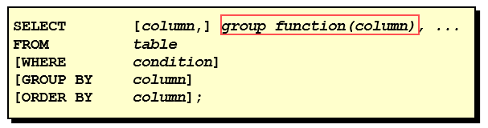
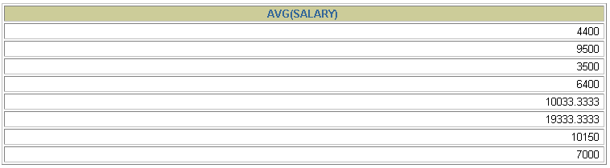
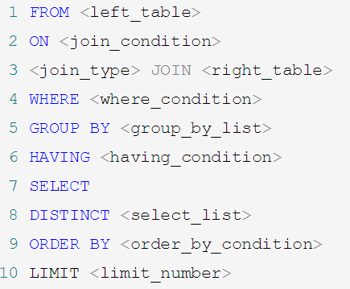

# 第08章_聚合函数

讲师：尚硅谷-宋红康（江湖人称：康师傅）

官网：[http://www.atguigu.com](http://www.atguigu.com/)

***

我们上一章讲到了 SQL 单行函数。实际上 SQL 函数还有一类，叫做聚合（或聚集、分组）函数，它是对一组数据进行汇总的函数，输入的是一组数据的集合，输出的是单个值。

## 1. 聚合函数介绍

- **什么是聚合函数**

  聚合函数作用于一组数据，并对一组数据返回一个值。

  

- **聚合函数类型**
  - **AVG()** 
  - **SUM()**
  - **MAX()** 
  - **MIN()** 
  - **COUNT()**

- 聚合函数语法

  

- 聚合函数不能嵌套调用。比如不能出现类似 `AVG(SUM(字段名称))` 形式的调用。

### 1.1 AVG和SUM函数

可以对**数值型数据**使用AVG 和 SUM 函数。

```sql
SELECT AVG(salary), MAX(salary),MIN(salary), SUM(salary)
FROM   employees
WHERE  job_id LIKE '%REP%';
```


### 1.2 MIN和MAX函数

可以对**任意数据类型**的数据使用 MIN 和 MAX 函数。

```sql
SELECT MIN(hire_date), MAX(hire_date)
FROM	  employees;
```


### 1.3 COUNT函数

- `COUNT(*)` 返回表中记录总数，适用于**任意数据类型**。


```sql
SELECT COUNT(*)
FROM	 employees
WHERE  department_id = 50;
```


- `COUNT(expr)` 返回**expr不为空**的记录总数。


```sql
SELECT COUNT(commission_pct)
FROM   employees
WHERE  department_id = 50;
```


- **问题：用count(*)，count(1)，count(列名)谁好呢?**

  其实，对于MyISAM引擎的表是没有区别的。这种引擎内部有一计数器在维护着行数。

  Innodb引擎的表用 `count(*)`，`count(1)` 直接读行数，复杂度是 `O(n)`，因为 innodb 真的要去数一遍。但好于具体的 `count(列名)`。
  
- **问题：能不能使用count(列名)替换count(*)?**

  不要使用 `count(列名)` 来替代 `count(*)`，`count(*)`是 SQL92 定义的标准统计行数的语法，跟数据库无关，跟 NULL 和非 NULL 无关。 

  说明：`count(*)` 会统计值为 NULL 的行，而 `count(列名)` 不会统计此列为 NULL 值的行。

## 2. GROUP BY

### 2.1 `GROUP BY` 的基本語法
> `GROUP BY` 用於將數據按某個或多個列進行分組，並且通常與**聚合函數**（`COUNT()`、`SUM()`、`AVG()`、`MAX()`、`MIN()`）一起使用，對每個分組的數據進行計算。


#### **1. `GROUP BY` 的基本語法**
```sql
SELECT column_name, aggregate_function(column_name)
FROM table_name
GROUP BY column_name;
```
- `column_name`：要分組的列。
- `aggregate_function(column_name)`：對每組數據執行聚合計算，如 `COUNT()`、`SUM()` 等。

> **在SELECT列表中所有未包含在组函数中的列都应该包含在 GROUP BY子句中**
>  ```sql
>  SELECT   department_id, AVG(salary)
>  FROM     employees
>  GROUP BY department_id ;
>  ```
>  
>  

> **包含在 GROUP BY 子句中的列不必包含在SELECT 列表中**
>  ```sql
>  SELECT   AVG(salary)
>  FROM     employees
>  GROUP BY department_id ;
>  ```
>  

---

#### **2. 基本範例**
##### **範例 1：統計每個類別的產品數量**
假設有一個 `products` 表：
| id | name  | category  | price |
|----|-------|----------|-------|
| 1  | Apple | Fruit    | 10    |
| 2  | Orange| Fruit    | 15    |
| 3  | Carrot| Vegetable| 5     |
| 4  | Tomato| Vegetable| 8     |
| 5  | Beef  | Meat     | 30    |

我們想**按類別 (`category`) 分組**，計算每個類別內的產品數量：
```sql
SELECT category, COUNT(*) AS product_count
FROM products
GROUP BY category;
```
**結果：**
| category  | product_count |
|-----------|--------------|
| Fruit     | 2            |
| Vegetable | 2            |
| Meat      | 1            |

📌 **解釋**
- `GROUP BY category`：將數據按 `category` 分組。
- `COUNT(*)`：計算每組內的產品數量。

---

##### **範例 2：計算每個類別的平均價格**
```sql
SELECT category, AVG(price) AS avg_price
FROM products
GROUP BY category;
```
**結果：**
| category  | avg_price |
|-----------|----------|
| Fruit     | 12.5     |
| Vegetable | 6.5      |
| Meat      | 30       |

📌 **解釋**
- `AVG(price)` 計算該類別內的平均價格。

---

##### **範例 3：計算每個類別的最高價格**
```sql
SELECT category, MAX(price) AS max_price
FROM products
GROUP BY category;
```
**結果：**
| category  | max_price |
|-----------|----------|
| Fruit     | 15       |
| Vegetable | 8        |
| Meat      | 30       |

📌 **解釋**
- `MAX(price)` 計算該類別內的最高價格。

---

##### **3. `GROUP BY` 搭配 `HAVING` 篩選**
如果要篩選出**平均價格大於 10 的類別**：
```sql
SELECT category, AVG(price) AS avg_price
FROM products
GROUP BY category
HAVING avg_price > 10;
```
**結果：**
| category  | avg_price |
|-----------|----------|
| Fruit     | 12.5     |
| Meat      | 30       |

> 📌 **`HAVING` vs `WHERE`**
> - `WHERE` 在 `GROUP BY` 之前使用，不能用來篩選聚合函數結果。
> - `HAVING` 在 `GROUP BY` 之後使用，可用於篩選聚合函數結果。

---

#### **4. `GROUP BY` 多個列**
如果 `GROUP BY` 兩個欄位，則會先按第一個欄位分組，在第一組內再按第二個欄位分組。

##### **範例 4：計算每個業務員在不同區域的銷售額**
假設有 `sales` 表：
| id | salesman | region  | revenue |
|----|---------|--------|---------|
| 1  | Alice   | North  | 5000    |
| 2  | Bob     | North  | 3000    |
| 3  | Alice   | North  | 2800    |
| 4  | Bob     | South  | 1600    |
| 5  | Alice   | South  | 6000    |

計算 **每個業務員 (`salesman`) 在不同區域 (`region`) 的總銷售額**：
```sql
SELECT salesman, region, SUM(revenue) AS total_revenue
FROM sales
GROUP BY salesman, region;
```
**結果：**
| salesman | region | total_revenue |
|---------|--------|--------------|
| Alice   | North  | 7800         |
| Alice   | South  | 6000         |
| Bob     | North  | 3000         |
| Bob     | South  | 1600         |

📌 **解釋**
- `GROUP BY salesman, region` 先按 `salesman` 分組，在每個 `salesman` 分組內再按 `region` 分組。
- `SUM(revenue)` 計算該分組的銷售總額。

---

#### **5. `ORDER BY` 搭配 `GROUP BY` 排序**
##### **範例 5：按 `category` 分組後，按產品數量降序排序**
```sql
SELECT category, COUNT(*) AS product_count
FROM products
GROUP BY category
ORDER BY product_count DESC;
```
**結果：**
| category  | product_count |
|-----------|--------------|
| Fruit     | 2            |
| Vegetable | 2            |
| Meat      | 1            |

📌 **解釋**
- `ORDER BY product_count DESC` 讓產品數量最多的類別排在前面。

---

#### **總結**
> ✅ `GROUP BY` 基本概念
> 1. `GROUP BY column` 將結果按該列分組。
> 2. `GROUP BY column1, column2` 先按 `column1` 分組，再在該組內按 `column2` 分組。
> 3. 必須搭配 **聚合函數**（如 `COUNT()`、`SUM()`、`AVG()` 等）。

> ✅ 搭配 `HAVING`
> - 用於篩選 `GROUP BY` 之後的分組結果。

> ✅ 搭配 `ORDER BY`
> - 讓分組後的結果按照某個值排序。

---

### 2.2 `GROUP BY` 多列分组

> 當 `GROUP BY` 包含多個列時，MySQL 會先按照第一個列進行分組，然後在第一個分組內進一步按照第二個列進行分組。這樣可以實現更細粒度的統計。


```sql
SELECT
	department_id dept_id,
	job_id,
	SUM(salary)
FROM
	employees
GROUP BY
	department_id,
	job_id ;
```


#### **1. `GROUP BY` 多列的基本用法**
##### **示例表 `sales`（銷售數據）**
| id | salesman | region  | product  | quantity | revenue |
|----|---------|--------|---------|---------|---------|
| 1  | Alice   | North  | Laptop  | 5       | 5000    |
| 2  | Bob     | North  | Laptop  | 3       | 3000    |
| 3  | Alice   | North  | Phone   | 7       | 2800    |
| 4  | Bob     | South  | Phone   | 4       | 1600    |
| 5  | Alice   | South  | Laptop  | 6       | 6000    |
| 6  | Bob     | North  | Phone   | 5       | 2000    |

---

#### **2. `GROUP BY` 多個列的例子**
##### **(1) 按 `region` 和 `salesman` 進行分組，計算銷售總額**
```sql
SELECT region, salesman, SUM(revenue) AS total_revenue
FROM sales
GROUP BY region, salesman;
```
**結果：**
| region | salesman | total_revenue |
|--------|---------|--------------|
| North  | Alice   | 7800         |
| North  | Bob     | 5000         |
| South  | Alice   | 6000         |
| South  | Bob     | 1600         |

📌 **解釋**：
1. 先按照 `region` 分組。
2. 在每個 `region` 分組內，進一步按照 `salesman` 分組。
3. 計算每個分組的 `SUM(revenue)`。

---

##### **(2) 按 `salesman` 和 `product` 進行分組，計算每種產品的總銷量**
```sql
SELECT salesman, product, SUM(quantity) AS total_quantity
FROM sales
GROUP BY salesman, product;
```
**結果：**
| salesman | product | total_quantity |
|---------|--------|---------------|
| Alice   | Laptop | 11            |
| Alice   | Phone  | 7             |
| Bob     | Laptop | 3             |
| Bob     | Phone  | 9             |

📌 **解釋**：
1. 先按 `salesman` 分組。
2. 在每個 `salesman` 分組內，再按 `product` 分組。
3. 計算該 `salesman` 銷售的該 `product` 總數量 (`SUM(quantity)`)。

---

##### **(3) `GROUP BY` + `HAVING` 過濾分組結果**
如果我們想篩選 **總銷售額大於 5000** 的分組：
```sql
SELECT region, salesman, SUM(revenue) AS total_revenue
FROM sales
GROUP BY region, salesman
HAVING total_revenue > 5000;
```
**結果：**
| region | salesman | total_revenue |
|--------|---------|--------------|
| North  | Alice   | 7800         |
| South  | Alice   | 6000         |

📌 **解釋**：
- `HAVING` 過濾掉 `total_revenue <= 5000` 的分組。

---

##### **(4) `GROUP BY` 多列 + `ORDER BY` 排序**
如果我們要 **統計每個地區 (`region`) 和業務員 (`salesman`) 的銷售額，並按銷售額降序排序**：
```sql
SELECT region, salesman, SUM(revenue) AS total_revenue
FROM sales
GROUP BY region, salesman
ORDER BY total_revenue DESC;
```
**結果：**
| region | salesman | total_revenue |
|--------|---------|--------------|
| North  | Alice   | 7800         |
| South  | Alice   | 6000         |
| North  | Bob     | 5000         |
| South  | Bob     | 1600         |

📌 **解釋**：
- `ORDER BY total_revenue DESC` 讓總銷售額最高的分組排在最前面。

---

##### **(5) `GROUP BY` 與 `COUNT()` 計算筆數**
如果我們想 **統計每個地區 (`region`) 和業務員 (`salesman`) 處理的訂單數**：
```sql
SELECT region, salesman, COUNT(*) AS total_orders
FROM sales
GROUP BY region, salesman;
```
**結果：**
| region | salesman | total_orders |
|--------|---------|-------------|
| North  | Alice   | 2           |
| North  | Bob     | 2           |
| South  | Alice   | 1           |
| South  | Bob     | 1           |

📌 **解釋**：
- `COUNT(*)` 計算每個分組內的訂單數。

---

#### **總結**
1. **多列分組原則**：
   - `GROUP BY col1, col2` 先按 `col1` 分組，在每個 `col1` 分組內再按 `col2` 分組。
   
2. **與聚合函數配合使用**：
   - `SUM()` 計算總和，例如總銷售額。
   - `COUNT()` 計算筆數，例如訂單數量。
   - `AVG()` 計算平均值，例如平均銷售額。

3. **`HAVING` 過濾分組結果**：
   - 不能使用 `WHERE` 過濾 `SUM()`、`COUNT()` 等聚合結果，必須用 `HAVING`。

4. **`ORDER BY` 排序**：
   - 可搭配 `ORDER BY` 按聚合結果 (`SUM()`, `COUNT()`) 排序。

### 2.3 GROUP BY中使用WITH ROLLUP

在 MySQL 中，WITH ROLLUP 是 GROUP BY 的擴展功能，用於在分組匯總的基礎上生成額外的總計行（小計或總計）。這對於報表和數據分析特別有用，因為它可以自動計算每個分組的統計數據以及整體數據的總計。

當使用 WITH ROLLUP 關鍵字時，除了原本的分組結果外，查詢結果中還會額外增加一行，表示所有查詢結果的總和（如總數量、總金額等）。

---

#### **1. `WITH ROLLUP` 的語法**
```sql
SELECT 列1, 列2, 聚合函數(列3)
FROM 表名
GROUP BY 列1, 列2 WITH ROLLUP;
```
- `WITH ROLLUP` 會在最後附加額外的匯總行。
- 它的作用是 **對 GROUP BY 中的列依次進行彙總**，最終計算出總合計。

```sql
# 範例
SELECT
	department_id,
	AVG(salary)
FROM
	employees
WHERE
	department_id > 80
GROUP BY
	department_id WITH ROLLUP;
```

> 注意：
>
> 当使用ROLLUP时，不能同时使用ORDER BY子句进行结果排序，即ROLLUP和ORDER BY是互相排斥的。

---

#### **2. `WITH ROLLUP` 示例**
##### **(1) 基本示例**
假設有一個 `sales`（銷售數據表），記錄了不同地區 (`region`)、不同產品 (`product`) 的銷售額 (`amount`)。

```sql
CREATE TABLE sales (
    id INT PRIMARY KEY AUTO_INCREMENT,
    region VARCHAR(50),
    product VARCHAR(50),
    amount DECIMAL(10,2)
);

INSERT INTO sales (region, product, amount) VALUES
('North', 'A', 100),
('North', 'B', 150),
('South', 'A', 200),
('South', 'B', 250);
```

現在我們想統計 **每個地區、每種產品的銷售額**，同時還希望獲取 **每個地區的總銷售額** 以及 **整體銷售額**，可以使用 `WITH ROLLUP`。

```sql
SELECT region, product, SUM(amount) AS total_sales
FROM sales
GROUP BY region, product WITH ROLLUP;
```

##### **(2) 結果解釋**
| region  | product | total_sales |
|---------|--------|------------|
| North   | A      | 100        |
| North   | B      | 150        |
| North   | NULL   | 250 (North的總計) |
| South   | A      | 200        |
| South   | B      | 250        |
| South   | NULL   | 450 (South的總計) |
| NULL    | NULL   | 700 (所有數據的總計) |

> **解釋**
> - `region = NULL` 且 `product = NULL` 的那一行代表所有數據的總和。
> - `product = NULL` 的行代表該 `region` 內的總銷售額。

---

#### **3. `WITH ROLLUP` 使用 `COALESCE()` 處理 NULL**
在 `WITH ROLLUP` 的結果中，MySQL 會用 `NULL` 來表示彙總行，這在某些情況下不直觀，我們可以使用 `COALESCE()` 來改進輸出。

```sql
SELECT 
    COALESCE(region, '總計') AS region, 
    COALESCE(product, '小計') AS product, 
    SUM(amount) AS total_sales
FROM sales
GROUP BY region, product WITH ROLLUP;
```

這樣 `NULL` 會被替換成 **「總計」** 或 **「小計」**。

---

## 3. HAVING

>📌 **`HAVING` vs `WHERE`**
> - `WHERE` 在 `GROUP BY` 之前使用，不能用來篩選聚合函數結果。
> - `HAVING` 在 `GROUP BY` 之後使用，可用於篩選聚合函數結果。

### 3.1 基本使用


**过滤分组：HAVING子句**

1. 行已经被分组。
2. 使用了聚合函数。
3. 满足HAVING 子句中条件的分组将被显示。
4. HAVING 不能单独使用，必须要跟 GROUP BY 一起使用。


```sql
SELECT
	department_id,
	MAX(salary)
FROM
	employees
GROUP BY
	department_id
HAVING
	MAX(salary)>10000 ;
```


- **非法使用聚合函数 ： 不能在 WHERE 子句中使用聚合函数。** 如下：

```sql
SELECT
	department_id,
	AVG(salary)
FROM
	employees
WHERE
	AVG(salary) > 8000
GROUP BY
	department_id;
```

 

### 3.2 WHERE和HAVING的对比

**区别1：WHERE 可以直接使用表中的字段作为筛选条件，但不能使用分组中的计算函数作为筛选条件；HAVING 必须要与 GROUP BY 配合使用，可以把分组计算的函数和分组字段作为筛选条件。** 

这决定了，在需要对数据进行分组统计的时候，HAVING 可以完成 WHERE 不能完成的任务。这是因为，在查询语法结构中，WHERE 在 GROUP BY 之前，所以无法对分组结果进行筛选。HAVING 在 GROUP BY 之后，可以使用分组字段和分组中的计算函数，对分组的结果集进行筛选，这个功能是 WHERE 无法完成的。另外，WHERE排除的记录不再包括在分组中。

**区别2：如果需要通过连接从关联表中获取需要的数据，WHERE 是先筛选后连接，而 HAVING 是先连接后筛选。** 这一点，就决定了在关联查询中，WHERE 比 HAVING 更高效。因为 WHERE 可以先筛选，用一个筛选后的较小数据集和关联表进行连接，这样占用的资源比较少，执行效率也比较高。HAVING 则需要先把结果集准备好，也就是用未被筛选的数据集进行关联，然后对这个大的数据集进行筛选，这样占用的资源就比较多，执行效率也较低。 

小结如下：

|        | 优点                         | 缺点                                   |
| ------ | ---------------------------- | -------------------------------------- |
| WHERE  | 先筛选数据再关联，执行效率高 | 不能使用分组中的计算函数进行筛选       |
| HAVING | 可以使用分组中的计算函数     | 在最后的结果集中进行筛选，执行效率较低 |

**开发中的选择：**

WHERE 和 HAVING 也不是互相排斥的，我们可以在一个查询里面同时使用 WHERE 和 HAVING。包含分组统计函数的条件用 HAVING，普通条件用 WHERE。这样，我们就既利用了 WHERE 条件的高效快速，又发挥了 HAVING 可以使用包含分组统计函数的查询条件的优点。当数据量特别大的时候，运行效率会有很大的差别。

---

## 4. SELECT的执行过程

### 4.1 查询的结构

```sql
#方式1：
SELECT ...,....,...
FROM ...,...,....
WHERE 多表的连接条件
AND 不包含组函数的过滤条件
GROUP BY ...,...
HAVING 包含组函数的过滤条件
ORDER BY ... ASC/DESC
LIMIT ...,...

#方式2：
SELECT ...,....,...
FROM ... JOIN ... 
ON 多表的连接条件
JOIN ...
ON ...
WHERE 不包含组函数的过滤条件
AND/OR 不包含组函数的过滤条件
GROUP BY ...,...
HAVING 包含组函数的过滤条件
ORDER BY ... ASC/DESC
LIMIT ...,...

#其中：
#（1）from：从哪些表中筛选
#（2）on：关联多表查询时，去除笛卡尔积
#（3）where：从表中筛选的条件
#（4）group by：分组依据
#（5）having：在统计结果中再次筛选
#（6）order by：排序
#（7）limit：分页
```

### 4.2 SELECT执行顺序

你需要记住 SELECT 查询时的两个顺序：

**1. 关键字的顺序是不能颠倒的：**

```
SELECT ... FROM ... WHERE ... GROUP BY ... HAVING ... ORDER BY ... LIMIT...
```

**2.SELECT 语句的执行顺序**（在 MySQL 和 Oracle 中，SELECT 执行顺序基本相同）：

```
FROM -> WHERE -> GROUP BY -> HAVING -> SELECT 的字段 -> DISTINCT -> ORDER BY -> LIMIT
```



比如你写了一个 SQL 语句，那么它的关键字顺序和执行顺序是下面这样的：

```sql
SELECT 
  DISTINCT player_id, 
  player_name, count(*) as num # 顺序 5
FROM player JOIN team ON player.team_id = team.team_id # 顺序 1
WHERE height > 1.80 # 顺序 2
GROUP BY player.team_id # 顺序 3
HAVING num > 2 # 顺序 4
ORDER BY num DESC # 顺序 6
LIMIT 2 # 顺序 7
```

> 在 SELECT 语句执行这些步骤的时候，每个步骤都会产生一个`虚拟表`，然后将这个虚拟表传入下一个步骤中作为输入。需要注意的是，这些步骤隐含在 SQL 的执行过程中，对于我们来说是不可见的。

### **4.3 SQL 查询的执行顺序与虚拟表演变**
在 MySQL 查询执行过程中，SQL 语句的执行顺序与书写顺序不同，每个阶段都会产生一个「虚拟表（Virtual Table，简称 VT）」，这个虚拟表会在每个步骤中不断被修改、筛选和转换，直到最终返回结果集。

---

#### **1. SQL 查询的执行顺序**
SQL 语句的执行是按照以下顺序进行的：

| **执行顺序** | **SQL 关键字** | **作用** | **产生的虚拟表** |
|-------------|---------------|--------|---------------|
| 1️⃣ | **FROM** | 确定主表，获取原始数据 | `VT1` |
| 2️⃣ | **JOIN (ON)** | 计算笛卡尔积，并进行 `ON` 过滤；对于外连接，还会增加外部行 | `VT1-1`, `VT1-2`, `VT1-3` |
| 3️⃣ | **WHERE** | 过滤不符合条件的行 | `VT2` |
| 4️⃣ | **GROUP BY** | 按指定字段分组 | `VT3` |
| 5️⃣ | **HAVING** | 对分组后的数据进行筛选 | `VT4` |
| 6️⃣ | **SELECT** | 选取需要返回的字段 | `VT5-1` |
| 7️⃣ | **DISTINCT** | 去除重复数据 | `VT5-2` |
| 8️⃣ | **ORDER BY** | 对结果集进行排序 | `VT6` |
| 9️⃣ | **LIMIT** | 限制返回行数，最终得到查询结果 | `VT7` |

---

#### **2. SQL 查询各阶段的执行细节**

> **1️⃣ FROM 阶段（获取初始数据）**
> - 从指定表中获取所有数据，形成**初始虚拟表 VT1**。
> - 如果是多表查询，执行 `JOIN` 操作：
>   1. **笛卡尔积**：先计算所有表的笛卡尔积，形成 `VT1-1`。
>   2. **ON 过滤**：按照 `ON` 条件进行筛选，形成 `VT1-2`。
>   3. **外部行补充**（LEFT JOIN、RIGHT JOIN、FULL JOIN）：如果是外连接，会添加匹配不到的外部行，形成 `VT1-3`。
>   4. 多表联查时，上述步骤会重复，直到所有表都处理完成，最终得到 `VT1`。

> **2️⃣ WHERE 阶段（行过滤）**
> - 在 `VT1` 的基础上，按照 `WHERE` 条件进行数据筛选，形成 `VT2`。
> - 该阶段仅对单个数据行进行过滤，不涉及分组数据。

> **3️⃣ GROUP BY 阶段（数据分组）**
> - 将 `VT2` 按照 `GROUP BY` 进行分组，形成 `VT3`。
> - 这个阶段仅是分组，不会进行数据筛选，结果是**每个分组变成一行**。

> **4️⃣ HAVING 阶段（分组后筛选）**
> - 在 `VT3` 的基础上，执行 `HAVING` 过滤，得到 `VT4`。
> - `HAVING` 和 `WHERE` 的区别：
>   - `WHERE` 过滤的是**原始数据（单行级别）**，作用于 `GROUP BY` 之前。
>   - `HAVING` 过滤的是**分组后的数据（聚合级别）**，作用于 `GROUP BY` 之后。

> **5️⃣ SELECT 阶段（字段提取）**
> - 选取 `VT4` 中需要的字段，得到 `VT5-1`。

> **6️⃣ DISTINCT 阶段（去重）**
> - 若查询包含 `DISTINCT`，则会对 `VT5-1` 进行去重，形成 `VT5-2`。

> **7️⃣ ORDER BY 阶段（排序）**
> - 对 `VT5-2` 进行排序，形成 `VT6`。

> **8️⃣ LIMIT 阶段（限制返回行数）**
> - 在 `VT6` 的基础上，限制返回的行数，最终得到 `VT7`，即最终结果集。

---

#### **3. SQL 执行示例**
**示例数据**

假设有一个 `orders` 表：
| order_id | customer_id | total_price | order_date  |
|----------|------------|-------------|------------|
| 1        | 101        | 1000        | 2024-01-01 |
| 2        | 102        | 1500        | 2024-01-02 |
| 3        | 101        | 500         | 2024-01-03 |
| 4        | 103        | 2000        | 2024-01-04 |

**示例查询**

```sql
SELECT customer_id, SUM(total_price) AS total_spent
FROM orders
WHERE total_price > 800
GROUP BY customer_id
HAVING SUM(total_price) > 2000
ORDER BY total_spent DESC
LIMIT 2;
```

##### **执行顺序与虚拟表变化**
1️⃣ **FROM orders**（获取表的全部数据）  
→ 形成 `VT1`（即 `orders` 表的全部数据）。

2️⃣ **WHERE total_price > 800**（行过滤）  
→ 只保留 `total_price > 800` 的记录，形成 `VT2`：
| order_id | customer_id | total_price |
|----------|------------|-------------|
| 1        | 101        | 1000        |
| 2        | 102        | 1500        |
| 4        | 103        | 2000        |

3️⃣ **GROUP BY customer_id**（分组）  
→ 形成 `VT3`：
| customer_id | SUM(total_price) |
|------------|----------------|
| 101        | 1000           |
| 102        | 1500           |
| 103        | 2000           |

4️⃣ **HAVING SUM(total_price) > 2000**（过滤分组数据）  
→ `HAVING` 过滤掉 `SUM(total_price) <= 2000` 的分组，形成 `VT4`：
| customer_id | total_spent |
|------------|------------|
| (无匹配数据) | (无匹配数据) |

5️⃣ **SELECT customer_id, SUM(total_price) AS total_spent**  
→ 形成 `VT5-1`（与 `VT4` 相同）。

6️⃣ **DISTINCT（无去重，跳过）**

7️⃣ **ORDER BY total_spent DESC**（无数据，跳过排序）

8️⃣ **LIMIT 2**（无数据，跳过）

> **最终结果：空结果集**
> 此查询没有符合 `HAVING SUM(total_price) > 2000` 条件的数据，因此返回空集。

---

#### **外连接（OUTER JOIN）SQL 执行顺序示例**
外连接（`LEFT JOIN`、`RIGHT JOIN`、`FULL JOIN`）的执行顺序和普通 `INNER JOIN` 略有不同，主要涉及**外部行的添加**。

---

##### **1. 示例数据**
假设有两张表：`customers`（客户表） 和 `orders`（订单表）。

**customers（客户表）**
| customer_id | customer_name |
|------------|--------------|
| 1          | Alice        |
| 2          | Bob          |
| 3          | Charlie      |
| 4          | David        |

**orders（订单表）**
| order_id | customer_id | total_price |
|----------|------------|-------------|
| 101      | 1          | 1000        |
| 102      | 1          | 500         |
| 103      | 2          | 1500        |
| 104      | 5          | 2000        |

---

##### **2. 示例 SQL**
假设我们要查询**所有客户的信息**，包括他们的订单总金额。如果某个客户没有订单，也应该显示该客户的信息，订单金额显示为 `NULL`。

```sql
SELECT c.customer_id, c.customer_name, SUM(o.total_price) AS total_spent
FROM customers c
LEFT JOIN orders o ON c.customer_id = o.customer_id
GROUP BY c.customer_id, c.customer_name
ORDER BY total_spent DESC;
```

---

##### **3. SQL 执行顺序解析**
以下是该 SQL 语句的**实际执行顺序**以及每一步的虚拟表（VT）演变。

**1️⃣ FROM customers**
首先，查询 `customers` 表，形成**虚拟表 `VT1`**：
| customer_id | customer_name |
|------------|--------------|
| 1          | Alice        |
| 2          | Bob          |
| 3          | Charlie      |
| 4          | David        |

---

**2️⃣ LEFT JOIN（ON 连接）**
- **计算笛卡尔积**（CROSS JOIN）：
  - 连接 `customers` 和 `orders`，计算所有可能的组合，形成 `VT1-1`。
- **应用 `ON` 过滤**：
  - `ON c.customer_id = o.customer_id`，只保留匹配的行，形成 `VT1-2`。
- **外部行添加**：
  - `LEFT JOIN` 保证 `customers` 表的所有记录都保留，未匹配的行 `orders` 相关列填充 `NULL`，形成**最终的 `VT1-3`**。

| customer_id | customer_name | order_id | total_price |
|------------|--------------|----------|-------------|
| 1          | Alice        | 101      | 1000        |
| 1          | Alice        | 102      | 500         |
| 2          | Bob          | 103      | 1500        |
| 3          | Charlie      | NULL     | NULL        |
| 4          | David        | NULL     | NULL        |

---

**3️⃣ GROUP BY customer_id, customer_name**
按照 `customer_id` 和 `customer_name` 进行分组，形成 **`VT3`**：
| customer_id | customer_name | SUM(total_price) |
|------------|--------------|----------------|
| 1          | Alice        | 1500           |
| 2          | Bob          | 1500           |
| 3          | Charlie      | NULL           |
| 4          | David        | NULL           |

---

**4️⃣ SELECT 选取字段**
提取 `customer_id, customer_name, SUM(total_price) AS total_spent`，形成 **`VT5-1`**：
| customer_id | customer_name | total_spent |
|------------|--------------|------------|
| 1          | Alice        | 1500       |
| 2          | Bob          | 1500       |
| 3          | Charlie      | NULL       |
| 4          | David        | NULL       |

---

**5️⃣ ORDER BY total_spent DESC**
按照 `total_spent` 进行降序排序，`NULL` 默认会排在最后：
| customer_id | customer_name | total_spent |
|------------|--------------|------------|
| 1          | Alice        | 1500       |
| 2          | Bob          | 1500       |
| 3          | Charlie      | NULL       |
| 4          | David        | NULL       |

---

##### **4. 关键点总结**
1. **`LEFT JOIN` 的外部行处理**
   - `customers` 中的 `Charlie` 和 `David` 没有匹配的 `orders` 数据，`total_price` 变为 `NULL`。
   - 这种情况下，如果执行 `SUM(total_price)`，`NULL` 会被当作 `0` 处理。
   
2. **`GROUP BY` 在 `LEFT JOIN` 之后执行**
   - `GROUP BY` 之前，数据是 **多行重复的（如果客户有多个订单）**。
   - `GROUP BY` 之后，`SUM(total_price)` 计算每个客户的订单总金额。

3. **`ORDER BY` 在最后执行**
   - 排序是在**所有数据处理完毕后**进行的，因此可以使用 `total_spent` 进行排序，即使它是计算字段。

---

##### **5. 变体：使用 `RIGHT JOIN`**
如果改成 `RIGHT JOIN`：
```sql
SELECT c.customer_id, c.customer_name, SUM(o.total_price) AS total_spent
FROM customers c
RIGHT JOIN orders o ON c.customer_id = o.customer_id
GROUP BY c.customer_id, c.customer_name
ORDER BY total_spent DESC;
```
**执行效果：**
- `RIGHT JOIN` 以 `orders` 为基准，保证 `orders` 中所有数据都保留，即使 `customers` 没有匹配的行。
- 在原数据中，`orders` 的 `customer_id = 5` 在 `customers` 表中不存在，因此 `customer_name` 变为 `NULL`。

**最终结果：**
| customer_id | customer_name | total_spent |
|------------|--------------|------------|
| 5          | NULL         | 2000       |
| 1          | Alice        | 1500       |
| 2          | Bob          | 1500       |

---

##### **6. 结论**
- **`LEFT JOIN`**：以 **左表（主表）** 为基准，保留所有行，右表匹配不到的部分填充 `NULL`。
- **`RIGHT JOIN`**：以 **右表（副表）** 为基准，保留所有行，左表匹配不到的部分填充 `NULL`。
- **`FULL JOIN`**（MySQL 不支持，但可以用 `UNION` 代替）：同时保留左右表的所有数据，匹配不到的部分填充 `NULL`。

---