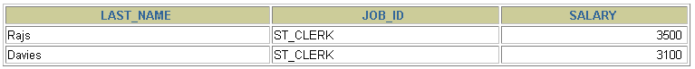
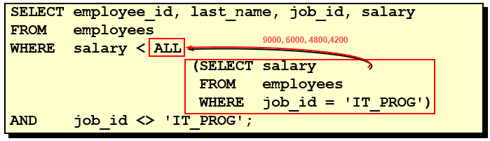

# 第09章_子查询

讲师：尚硅谷-宋红康（江湖人称：康师傅）

官网：[http://www.atguigu.com](http://www.atguigu.com/)

***

子查询指一个查询语句嵌套在另一个查询语句内部的查询，这个特性从MySQL 4.1开始引入。

SQL 中子查询的使用大大增强了 SELECT 查询的能力，因为很多时候查询需要从结果集中获取数据，或者需要从同一个表中先计算得出一个数据结果，然后与这个数据结果（可能是某个标量，也可能是某个集合）进行比较。

## 1. 需求分析与问题解决

### 1.1 实际问题


现有解决方式：

```sql
#方式一：
SELECT
	salary
FROM
	employees
WHERE
	last_name = 'Abel';

SELECT
	last_name,
	salary
FROM
	employees
WHERE
	salary > 11000;
```

```sql
#方式二：自连接
SELECT
	e2.last_name,
	e2.salary
FROM
	employees e1,
	employees e2
WHERE
	e1.last_name = 'Abel'
	AND e1.`salary` < e2.`salary`
```

```sql
#方式三：子查询
SELECT
	last_name,
	salary
FROM
	employees
WHERE
	salary > (
		SELECT
			salary
		FROM
			employees
		WHERE
			last_name = 'Abel'
	);
```

 

### 1.2 子查询的基本使用

- 子查询的基本语法结构：  
  

- 子查询（内查询）在主查询之前一次执行完成。
- 子查询的结果被主查询（外查询）使用 。

> **注意事项**
> - 子查询要包含在括号内
> - 将子查询放在比较条件的右侧
> - 单行操作符对应单行子查询，多行操作符对应多行子查询

### 1.3 子查询的分类

#### **分类方式1：**

我们按内查询的结果返回一条还是多条记录，将子查询分为`标量子查询`、`列子查询`、`行子查询`、`表子查询`。

| 子查询类型   | 返回结果           | 典型应用场景 |
|------------|----------------|------------|
| **标量子查询** | **1 行 1 列**  | `=`、`<>`、`>`、`<`、`>=`、`<=` 比较 |
| **列子查询** | **多行 1 列**  | `IN`、`NOT IN` |
| **行子查询** | **1 行 多列**  | `(col1, col2) = (SELECT col1, col2 FROM …)` |
| **表子查询** | **多行 多列**  | `FROM` 子句（派生表） |

##### 1. **标量子查询（Scalar Subquery）**
**特点：**
- 只返回 **一行一列** 的结果
- 可以用在 `SELECT`、`WHERE`、`HAVING` 以及 `SET` 语句中
- 结果可以直接用于计算或与其他值进行比较

**示例：**
假设我们有一个 `employees` 表：
```sql
CREATE TABLE employees (
    id INT PRIMARY KEY AUTO_INCREMENT,
    name VARCHAR(50),
    department_id INT,
    salary DECIMAL(10,2)
);

INSERT INTO employees (name, department_id, salary) VALUES
('Alice', 1, 5000),
('Bob', 2, 7000),
('Charlie', 1, 5500),
('David', 2, 7200);
```

**查询最高薪资：**
```sql
SELECT name, salary 
FROM employees 
WHERE salary = (SELECT MAX(salary) FROM employees);
```
**解释：**
- 内部子查询 `SELECT MAX(salary) FROM employees` 返回 **单个值**（标量），即 7200。
- 外部查询获取薪资等于 7200 的员工。

**结果**
| name  | salary |
|-------|--------|
| David | 7200.00 |

---

##### 2. **列子查询（Column Subquery）**
**特点：**
- 只返回 **一列多行**
- 通常用于 `IN` 或 `NOT IN` 条件中
- 可用于 `WHERE` 或 `HAVING` 进行匹配

**示例：**
假设我们有 `departments` 表：
```sql
CREATE TABLE departments (
    id INT PRIMARY KEY AUTO_INCREMENT,
    name VARCHAR(50)
);

INSERT INTO departments (id, name) VALUES
(1, 'HR'),
(2, 'IT'),
(3, 'Sales');
```

**查询所有在 IT 或 HR 部门的员工：**
```sql
SELECT name, department_id 
FROM employees 
WHERE department_id IN (SELECT id FROM departments WHERE name IN ('IT', 'HR'));
```

**解释：**
- 内部子查询 `SELECT id FROM departments WHERE name IN ('IT', 'HR')` 返回 `1, 2`（两行一列）。
- 外部查询查找 `department_id` 为 `1` 或 `2` 的员工。

**结果**
| name    | department_id |
|---------|--------------|
| Alice   | 1            |
| Bob     | 2            |
| Charlie | 1            |
| David   | 2            |

---

##### 3. **行子查询（Row Subquery）**
**特点：**
- **返回一行多列**
- 需要使用 `=`、`!=`、`<`、`>`、`IN` 等 **行比较运算符**
- 可以用于 `WHERE` 子句进行匹配

**示例：**
**查询薪资最高的员工的姓名和部门ID**
```sql
SELECT name, department_id
FROM employees
WHERE (salary, department_id) = (SELECT MAX(salary), department_id FROM employees);
```

**解释：**
- 子查询 `SELECT MAX(salary), department_id FROM employees` 返回 `(7200, 2)`。
- 外部查询匹配 `(salary, department_id) = (7200, 2)` 的员工。

**结果**
| name  | department_id |
|-------|--------------|
| David | 2            |

---

##### 4. **表子查询（Table Subquery）**
**特点：**
- 返回 **多行多列**
- 通常用在 `FROM` 子句中，作为**派生表（Derived Table）**
- 必须为子查询提供别名，否则会报错

**示例：**
**查询部门中平均薪资大于 6000 的员工**
```sql
SELECT e.name, e.salary, e.department_id
FROM employees e
JOIN (SELECT department_id, AVG(salary) AS avg_salary 
      FROM employees 
      GROUP BY department_id) AS dept_avg
ON e.department_id = dept_avg.department_id
WHERE e.salary > dept_avg.avg_salary;
```

**解释：**
- 内部子查询 `SELECT department_id, AVG(salary) AS avg_salary FROM employees GROUP BY department_id` 计算每个部门的平均薪资。
- 外部查询将 `employees` 表与该子查询结果进行 `JOIN`，找出薪资高于部门平均值的员工。

**结果**
| name  | salary | department_id |
|-------|--------|--------------|
| Bob   | 7000   | 2            |
| David | 7200   | 2            |

##### **总结**
子查询分类是根据其**返回的结果**（行数、列数）来区分的：

| 子查询类型 | 结果集 | 适用场景 |
|-----------|--------|---------|
| **标量子查询** | 1 行 1 列 | `WHERE` 条件、赋值运算 (`=`) |
| **列子查询** | N 行 1 列 | `IN`、`NOT IN` |
| **行子查询** | 1 行 N 列 | `(col1, col2) = (SELECT col1, col2 FROM ...)` |
| **表子查询** | N 行 N 列 | `FROM` 子句，创建派生表 |

---

#### **分类方式2：**

在 MySQL 中，子查询的分类可以通过 **是否多次执行** 来区分为 **不相关子查询** 和 **相关子查询**。以下是详细的解释和示例：

---

##### **1. 不相关子查询 (Non-Correlated Subquery)**
**特点：**
- **子查询只执行一次**，然后将结果传递给主查询使用。
- **子查询独立于主查询**，不依赖外部查询的数据。

**示例：查询工资高于平均工资的员工**
```sql
SELECT emp_name, salary
FROM employees
WHERE salary > (SELECT AVG(salary) FROM employees);
```
**解释：**
- `SELECT AVG(salary) FROM employees` 计算整个表的平均工资，这个子查询**只执行一次**。
- 其结果用于主查询的 `WHERE salary > ...` 过滤条件。

✅ **这个子查询不会随着主查询的每一行变化，而是一次性执行。**

---

##### **2. 相关子查询 (Correlated Subquery)**
**特点：**
- **子查询依赖于主查询的数据，每次都会根据主查询的某一行数据进行查询**。
- **子查询多次执行**，通常出现在 `WHERE` 或 `SELECT` 语句中。

**示例：查询比同一部门的平均工资高的员工**
```sql
SELECT emp_name, salary, dept_id
FROM employees e1
WHERE salary > (
    SELECT AVG(salary)
    FROM employees e2
    WHERE e1.dept_id = e2.dept_id
);
```
**解释：**
- **主查询：** 选取 `employees` 表中的所有员工。
- **子查询：** 计算当前 `dept_id`（由外部查询 `e1.dept_id` 传递）的平均工资。
- **关联点：** `e1.dept_id = e2.dept_id`，子查询每次都会根据不同的 `dept_id` 重新计算。

✅ **这个子查询需要针对每个 `dept_id` 执行一次，而不是一次性计算出所有部门的平均值，因此是相关子查询。**

---

##### **总结**
| 类型 | 依赖主查询 | 执行次数 | 适用场景 |
|------|----------|---------|---------|
| **不相关子查询** | ❌ 否 | ✅ 仅执行一次 | 计算固定值，如最大值、最小值、平均值、某个 ID 对应的数据 |
| **相关子查询** | ✅ 是 | 🔄 需要多次执行 | 依赖外部查询的每一行数据，如部门内排名、同一类数据的比较 |

## 2. 单行子查询

### 2.1 单行比较操作符

| 操作符 | 含义                     |
| ------ | ------------------------ |
| =      | equal to                 |
| >      | greater than             |
| >=     | greater than or equal to |
| <      | less than                |
| <=     | less than or equal to    |
| <>     | not equal to             |

### 2.2 代码示例

**题目：查询工资大于149号员工工资的员工的信息**

 

 

**题目：返回job_id与141号员工相同，salary比143号员工多的员工姓名，job_id和工资**

```sql
SELECT last_name, job_id, salary
FROM   employees
WHERE  job_id =  
                (SELECT job_id
                 FROM   employees
                 WHERE  employee_id = 141)
AND    salary >
                (SELECT salary
                 FROM   employees
                 WHERE  employee_id = 143);
```



**题目：返回公司工资最少的员工的last_name,job_id和salary**

```sql
SELECT last_name, job_id, salary
FROM   employees
WHERE  salary = 
                (SELECT MIN(salary)
                 FROM   employees);
```


### 2.3 成对比较和不成对比较

在 MySQL 中，**成对比较**（pairwise comparison）和**不成对比较**（non-pairwise comparison）是指如何进行子查询时多个列的比较方式。我们通过这两个范例来理解它们的区别。

#### 1. 不成对比较（Non-pairwise Comparison）

不成对比较是指将每个列单独进行比较。例如：

```sql
# 题目：查询与141号或174号员工的manager_id和department_id相同的其他员工的employee_id，manager_id，department_id

SELECT employee_id, manager_id, department_id
FROM employees
WHERE manager_id IN
      (SELECT manager_id
       FROM employees
       WHERE employee_id IN (174, 141))
AND department_id IN 
      (SELECT department_id
       FROM employees
       WHERE employee_id IN (174, 141))
AND employee_id NOT IN(174, 141);
```

这里的比较是对 **`manager_id`**和**`department_id`** 进行单独的 **`IN`** 比较。换句话说：

- 我们查询了员工 ID 为 174 和 141 的 `manager_id`，然后在外部查询中，查找那些 **`manager_id`** 与这两个员工相同的所有员工。
- 同时，我们查询了员工 ID 为 174 和 141 的 `department_id`，然后在外部查询中，查找那些 **`department_id`** 与这两个员工相同的所有员工。

这种方式是将每一列的条件单独检查，而不是同时检查 `manager_id` 和 `department_id` 的组合。

#### 2. 成对比较（Pairwise Comparison）

成对比较是指将多个列作为一组一起进行比较：

```sql
# 题目：查询与141号或174号员工的manager_id和department_id相同的其他员工的employee_id，manager_id，department_id

SELECT employee_id, manager_id, department_id
FROM employees
WHERE (manager_id, department_id) IN
              (SELECT manager_id, department_id
               FROM employees
               WHERE employee_id IN (141, 174))
AND employee_id NOT IN (141, 174);
```

在这个查询中，`manager_id` 和 `department_id` 被当作一对进行比较。换句话说，查询内部和外部查询中的两列（`manager_id` 和 `department_id`）是作为一个整体来进行比较的：

- 我们从员工 ID 为 141 和 174 的记录中选取了 **`manager_id` 和 `department_id`** 的组合。
- 然后，在外部查询中，查找那些 **`manager_id` 和 `department_id`** 组合相同的其他员工。

这种方法是同时比较多个列的组合，确保两者配对时才匹配。

#### 3. 区别总结：

- **不成对比较**：每列单独比较。比如，首先比较 `manager_id`，然后比较 `department_id`，但它们是独立的条件。
- **成对比较**：多个列作为一组一起比较，只有两个列的组合都匹配时才返回结果。

---


### 2.4 HAVING 中的子查询

- 首先执行子查询。
- 向主查询中的HAVING 子句返回结果。

```sql
# 题目：查询最低工资大于50号部门最低工资的部门id和其最低工资

SELECT   department_id, MIN(salary)
FROM     employees
GROUP BY department_id
HAVING   MIN(salary) >
                       (SELECT MIN(salary)
                        FROM   employees
                        WHERE  department_id = 50);
```

### 2.5 CASE中的子查询

在 CASE 表达式中使用单列子查询：

```sql
# 题目：显式员工的employee_id,last_name和location。其中，若员工department_id与location_id为1800的department_id相同，则location为’Canada’，其余则为’USA’。 
SELECT employee_id, last_name,
       (CASE department_id
        	WHEN
             ( 
             	SELECT department_id FROM departments
	      		WHERE location_id = 1800
	      	 )           
        	THEN 'Canada' ELSE 'USA' END
        ) location
FROM   employees;
```

### 2.6 子查询中的空值问题

```sql
SELECT last_name, job_id
FROM   employees
WHERE  job_id =
                (SELECT job_id
                 FROM   employees
                 WHERE  last_name = 'Haas');
```


> **子查询不返回任何行**

### 2.7 非法使用子查询

```sql
SELECT employee_id, last_name
FROM   employees
WHERE  salary =
                (SELECT   MIN(salary)
                 FROM     employees
                 GROUP BY department_id);
```


> **多行子查询使用单行比较符**

## 3. 多行子查询

- 也称为集合比较子查询
- 内查询返回多行
- 使用多行比较操作符

### 3.1 多行比较操作符

| 操作符 | 含义                                                         |
| ------ | ------------------------------------------------------------ |
| IN     | 等于列表中的**任意一个**                                     |
| ANY    | 需要和单行比较操作符一起使用，和子查询返回的**某一个**值比较 |
| ALL    | 需要和单行比较操作符一起使用，和子查询返回的**所有**值比较   |
| SOME   | 实际上是ANY的别名，作用相同，一般常使用ANY                   |

> 体会 ANY 和 ALL 的区别

### 3.2 代码示例

**题目：返回其它job_id中比job_id为‘IT_PROG’部门任一工资低的员工的员工号、姓名、job_id 以及salary**


**题目：返回其它job_id中比job_id为‘IT_PROG’部门所有工资都低的员工的员工号、姓名、job_id以及salary**




**题目：查询平均工资最低的部门id**

```sql
#方式1：
SELECT department_id
FROM employees
GROUP BY department_id
HAVING AVG(salary) = (
				SELECT MIN(avg_sal)
				FROM (
					SELECT AVG(salary) avg_sal
					FROM employees
					GROUP BY department_id
				) dept_avg_sal
			)
```

```sql
#方式2：
SELECT department_id
FROM employees
GROUP BY department_id
HAVING AVG(salary) <= ALL (
				SELECT AVG(salary) avg_sal
				FROM employees
				GROUP BY department_id
)
```

### 3.3 空值问题

```sql
SELECT last_name
FROM employees
WHERE employee_id NOT IN (
			SELECT manager_id
			FROM employees
			);
```

 

## 4. 相关子查询

### 4.1 相关子查询执行流程

如果子查询的执行依赖于外部查询，通常情况下都是因为子查询中的表用到了外部的表，并进行了条件关联，因此每执行一次外部查询，子查询都要重新计算一次，这样的子查询就称之为`关联子查询`。

相关子查询按照一行接一行的顺序执行，主查询的每一行都执行一次子查询。


说明：**子查询中使用主查询中的列**

### 4.2 代码示例

##### 4.2.1 相關子查詢的基本使用
**题目：查询员工中工资大于本部门平均工资的员工的last_name,salary和其department_id**

**方式一：相关子查询**


**方式二：在 FROM 中使用子查询**

```sql
SELECT
	last_name,
	salary,
	e1.department_id
FROM
	employees e1,
	(
		SELECT
			department_id,
			AVG(salary) dept_avg_sal
		FROM
			employees
		GROUP BY
			department_id
	) e2
WHERE
	e1.`department_id` = e2.department_id
	AND e2.dept_avg_sal < e1.`salary`;
```

> from型的子查询：子查询是作为from的一部分，子查询要用()引起来，并且要给这个子查询取别名，
> 把它当成一张“临时的虚拟的表”来使用。

##### 4.2.2 在 ORDER BY 子句中使用相關子查詢

**题目：查询员工的id,salary,按照department_name 排序**

```sql
SELECT employee_id,salary
FROM employees e
ORDER BY (
	  SELECT department_name
	  FROM departments d
	  WHERE e.`department_id` = d.`department_id`
	);
```
這裡的 **子查詢 (`SELECT department_name FROM departments d WHERE e.department_id = d.department_id`)** 對於 **每一行 `employees` 記錄** 都會返回 **一個單獨的值**。

**為什麼子查詢的結果能用在 `ORDER BY` 中？**
`ORDER BY` 允許我們使用一個表達式，而這個子查詢在 SQL 執行時，對於每一行 `employees` 記錄都會返回一個對應的 `department_name`，這使得 SQL 引擎可以根據這個值進行排序。

**執行流程：**
1. **查詢 `employees` 表中的數據**（先獲取 `employee_id` 和 `salary`）。
2. **對於 `employees` 表的每一行，執行子查詢，獲取該員工的 `department_name`**。
   - 例如：
     ```
     +-------------+--------+--------------+
     | employee_id | salary | department_name |
     +-------------+--------+--------------+
     | 101         | 5000   | HR           |
     | 102         | 7000   | Sales        |
     | 103         | 6000   | IT           |
     | 104         | 6500   | HR           |
     | 105         | 5800   | IT           |
     +-------------+--------+--------------+
     ```
3. **根據 `department_name` 進行排序**。
   - SQL 會對 `department_name` 進行 **字典順序** 排序，例如：
     ```
     +-------------+--------+--------------+
     | employee_id | salary | department_name |
     +-------------+--------+--------------+
     | 103         | 6000   | IT           |
     | 105         | 5800   | IT           |
     | 101         | 5000   | HR           |
     | 104         | 6500   | HR           |
     | 102         | 7000   | Sales        |
     +-------------+--------+--------------+
     ```


**為什麼可以這樣排序？**
SQL 會先計算 `ORDER BY` 子查詢的結果，把結果當作 **一個臨時列** 來對查詢結果進行排序。

- **等價於這樣的過程（僅供理解，SQL 其實不會這樣寫）：**
  ```sql
  SELECT employee_id, salary,
         (SELECT department_name FROM departments d WHERE e.department_id = d.department_id) AS dept_name
  FROM employees e
  ORDER BY dept_name;
  ```
- **SQL 內部實際執行方式：**
  - SQL 會對 `employees` 表的每一行執行子查詢，獲取對應 `department_name`。
  - 然後根據這些 `department_name` 值進行排序。

---

##### 4.2.3 在 WHERE 子句中使用相關子查詢

**题目：若employees表中employee_id与job_history表中employee_id相同的数目不小于2，输出这些相同id的员工的employee_id,last_name和其job_id**

```sql
SELECT 
	e.employee_id, 
	e.last_name,
	e.job_id
FROM   employees e 
WHERE  2 <= (SELECT COUNT(*)
             FROM   job_history 
             WHERE  employee_id = e.employee_id);
```

### 4.3 EXISTS 与 NOT EXISTS关键字

#### 4.3.1 基本概念
在 MySQL 中，`EXISTS` 和 `NOT EXISTS` 关键字用于**关联子查询（correlated subquery）**，它们的作用是判断子查询是否返回任何结果。

##### 1. `EXISTS`
- `EXISTS` 用于检查子查询是否返回**至少一行**数据。
- 如果子查询返回数据，`EXISTS` 评估结果为 `TRUE`，那么主查询将执行。
- 如果子查询没有返回数据，`EXISTS` 评估结果为 `FALSE`，那么主查询不会返回任何结果。

**✅ `EXISTS` 示例：**

假设我们有两张表：
- `customers`（客户表）
- `orders`（订单表）

```sql
CREATE TABLE customers (
    id INT PRIMARY KEY,
    name VARCHAR(50)
);

CREATE TABLE orders (
    id INT PRIMARY KEY,
    customer_id INT,
    total_amount DECIMAL(10,2),
    FOREIGN KEY (customer_id) REFERENCES customers(id)
);
```

现在，我们想要查询 **至少有下单记录的客户**，可以使用 `EXISTS`：

```sql
SELECT name
FROM customers c
WHERE EXISTS (
    SELECT 1 FROM orders o WHERE o.customer_id = c.id
);
```

**解释：**
- 对于 `customers` 表的每一行，子查询都会检查该客户是否在 `orders` 表中有订单。
- `SELECT 1` 只是用于检查是否有数据返回（返回 `1` 只是为了提高查询效率）。
- 只要 `orders` 表中存在 `customer_id = c.id` 的记录，该行就会包含在结果中。

---

##### 2. `NOT EXISTS`
- `NOT EXISTS` 用于检查子查询是否**没有返回任何行**。
- 如果子查询没有返回数据，`NOT EXISTS` 评估结果为 `TRUE`，那么主查询会执行。
- 如果子查询返回数据，`NOT EXISTS` 评估结果为 `FALSE`，那么主查询不会返回任何结果。

**✅ `NOT EXISTS` 示例：**

如果我们想要查询 **没有下过订单的客户**，可以使用 `NOT EXISTS`：

```sql
SELECT name
FROM customers c
WHERE NOT EXISTS (
    SELECT 1 FROM orders o WHERE o.customer_id = c.id
);
```

**解释：**
- 这里的 `NOT EXISTS` 反转了逻辑，仅返回那些没有下过订单的客户。

---

##### 3.总结：
| 关键字 | 作用 |
|--------|------|
| `EXISTS` | 只要子查询返回**至少一行**数据，就会返回 `TRUE`，主查询包含该行。 |
| `NOT EXISTS` | 只要子查询**不返回**任何数据，就会返回 `TRUE`，主查询包含该行。 |

这两者在查询**有关联关系的数据**时非常有用，特别是在**过滤数据**的情况下。

如果你有更具体的使用场景，可以告诉我，我可以帮你优化查询语句！ 😊

#### 4.3.2 代碼示例

**题目：查询公司管理者的employee_id，last_name，job_id，department_id信息**

方式一：
```sql
SELECT employee_id, last_name, job_id, department_id
FROM   employees e1
WHERE  EXISTS ( SELECT *
                 FROM   employees e2
                 WHERE  e2.manager_id = 
                        e1.employee_id);
```

方式二：自连接
```sql
SELECT
	DISTINCT e1.employee_id,
	e1.last_name,
	e1.job_id,
	e1.department_id
FROM
	employees e1
JOIN employees e2
WHERE
	e1.employee_id = e2.manager_id;
```

方式三：
```sql
SELECT 
	employee_id,
	last_name,
	job_id,
	department_id
FROM employees
WHERE employee_id IN (
				SELECT DISTINCT manager_id
				FROM employees
		     );
```

---

**题目：查询departments表中，不存在于employees表中的部门的department_id和department_name**

```sql
SELECT 
	department_id, 
	department_name
FROM departments d
WHERE NOT EXISTS (
					SELECT 'X'
                  	FROM   employees
                  	WHERE  department_id = d.department_id
				 );
```

### 4.4 相关更新
> 相關更新是指在 UPDATE 語句中使用相關子查詢（correlated subquery）

```sql
UPDATE table1 alias1
SET	column = (
				SELECT expression
                FROM   table2 alias2
                WHERE  alias1.column = alias2.column
			 );
```

#### **範例：更新每個員工的薪資**
假設我們有兩個表：
- `employees`（員工表）：包含 `id`、`name` 和 `salary`
- `departments`（部門表）：包含 `id`、`name` 和 `avg_salary`（部門的平均薪資）

現在我們想要將 `employees` 表中每個員工的薪資調整為 **該員工所在部門的平均薪資**。

```sql
UPDATE employees e
SET e.salary = (
    SELECT d.avg_salary
    FROM departments d
    WHERE e.department_id = d.id
);
```

**解釋**
- `UPDATE employees e`：更新 `employees` 表。
- `SET e.salary = (...)`：將 `salary` 設置為子查詢的結果。
- **子查詢**：
  - 從 `departments` 表中選取對應 `department_id` 的 `avg_salary`。
  - 這個子查詢依賴於主查詢的 `e.department_id`，因此是 **相關子查詢（correlated subquery）**。

---

### 4.4 相关删除

> 相關刪除是指在 DELETE 語句中使用相關子查詢（correlated subquery）

```sql
DELETE FROM table1 alias1
WHERE column operator (
						SELECT expression
						FROM   table2 alias2
						WHERE  alias1.column = alias2.column
					  );
```

#### **範例：刪除沒有訂單的客戶**
假設我們有：
- `customers`（客戶表）：包含 `id`、`name`
- `orders`（訂單表）：包含 `id`、`customer_id`

我們想要刪除 `customers` 表中 **沒有訂單的客戶**。

```sql
DELETE FROM customers c
WHERE NOT EXISTS (
    SELECT 1 FROM orders o
    WHERE o.customer_id = c.id
);
```

**解釋**
- `DELETE FROM customers c`：從 `customers` 表刪除資料。
- `WHERE NOT EXISTS (...)`：篩選出 **沒有對應訂單的客戶**。
- **子查詢**：
  - 在 `orders` 表中查找是否存在 `customer_id` 對應 `customers` 表的 `id`。
  - `NOT EXISTS` 表示 **如果這個客戶沒有訂單，則刪除該行**。
  - 子查詢依賴於 `c.id`，所以這也是 **相關子查詢（correlated subquery）**。

---

## 5. 抛一个思考题

**问题：**谁的工资比Abel的高？

**解答：**

```sql
#方式1：自连接
SELECT
	e2.last_name,
	e2.salary
FROM
	employees e1,
	employees e2
WHERE
	e1.last_name = 'Abel'
	AND e1.`salary` < e2.`salary`
```

```sql
#方式2：子查询
SELECT 
	last_name,
	salary
FROM employees
WHERE salary > (
			SELECT salary
			FROM employees
			WHERE last_name = 'Abel'
		);
```

**问题：**以上两种方式有好坏之分吗？

**解答：**自连接方式好！

题目中可以使用子查询，也可以使用自连接。一般情况建议你使用自连接，因为在许多 DBMS 的处理过程中，对于自连接的处理速度要比子查询快得多。

可以这样理解：子查询实际上是通过未知表进行查询后的条件判断，而自连接是通过已知的自身数据表进行条件判断，因此在大部分 DBMS 中都对自连接处理进行了优化。