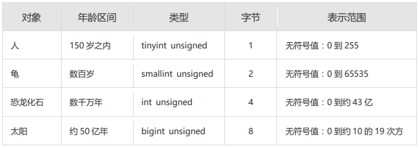

# 1. 基础知识

## 1.1 一条数据存储的过程

`存储数据是处理数据的第一步`。只有正确地把数据存储起来，我们才能进行有效的处理和分析。否则，只能是一团乱麻，无从下手。

那么，怎样才能把用户各种经营相关的、纷繁复杂的数据，有序、高效地存储起来呢？ 在 MySQL 中，一个完整的数据存储过程总共有 4 步，分别是创建数据库、确认字段、创建数据表、插入数据。


我们要先创建一个数据库，而不是直接创建数据表呢？ 

因为从系统架构的层次上看，MySQL 数据库系统从大到小依次是`数据库服务器`、`数据库`、`数据表`、数据表的`行与列`。 

MySQL 数据库服务器之前已经安装。所以，我们就从创建数据库开始。

## 1.2 标识符命名规则

- 数据库名、表名不得超过30个字符，变量名限制为29个
- 必须只能包含 A–Z, a–z, 0–9, _共63个字符
- 数据库名、表名、字段名等对象名中间不要包含空格
- 同一个MySQL软件中，数据库不能同名；同一个库中，表不能重名；同一个表中，字段不能重名
- 必须保证你的字段没有和保留字、数据库系统或常用方法冲突。如果坚持使用，请在SQL语句中使用`（着重号）引起来
- 保持字段名和类型的一致性：在命名字段并为其指定数据类型的时候一定要保证一致性，假如数据类型在一个表里是整数，那在另一个表里可就别变成字符型了

## 1.3 MySQL中的数据类型

| 类型             | 类型举例                                                     |
| ---------------- | ------------------------------------------------------------ |
| 整数类型         | TINYINT、SMALLINT、MEDIUMINT、**INT(或INTEGER)**、BIGINT     |
| 浮点类型         | FLOAT、DOUBLE                                                |
| 定点数类型       | **DECIMAL**                                                  |
| 位类型           | BIT                                                          |
| 日期时间类型     | YEAR、TIME、**DATE**、DATETIME、TIMESTAMP                    |
| 文本字符串类型   | CHAR、**VARCHAR**、TINYTEXT、TEXT、MEDIUMTEXT、LONGTEXT      |
| 枚举类型         | ENUM                                                         |
| 集合类型         | SET                                                          |
| 二进制字符串类型 | BINARY、VARBINARY、TINYBLOB、BLOB、MEDIUMBLOB、LONGBLOB      |
| JSON类型         | JSON对象、JSON数组                                           |
| 空间数据类型     | 单值：GEOMETRY、POINT、LINESTRING、POLYGON；<br/>集合：MULTIPOINT、MULTILINESTRING、MULTIPOLYGON、GEOMETRYCOLLECTION |

其中，常用的几类类型介绍如下：

| 数据类型      | 描述                                                         |
| ------------- | ------------------------------------------------------------ |
| INT           | 从-2^31到2^31-1的整型数据。存储大小为 4个字节                |
| CHAR(size)    | 定长字符数据。若未指定，默认为1个字符，最大长度255           |
| VARCHAR(size) | 可变长字符数据，根据字符串实际长度保存，**必须指定长度**     |
| FLOAT(M,D)    | 单精度，占用4个字节，M=整数位+小数位，D=小数位。 D<=M<=255,0<=D<=30，默认M+D<=6 |
| DOUBLE(M,D)   | 双精度，占用8个字节，D<=M<=255,0<=D<=30，默认M+D<=15         |
| DECIMAL(M,D)  | 高精度小数，占用M+2个字节，D<=M<=65，0<=D<=30，最大取值范围与DOUBLE相同。 |
| DATE          | 日期型数据，格式'YYYY-MM-DD'                                 |
| BLOB          | 二进制形式的长文本数据，最大可达4G                           |
| TEXT          | 长文本数据，最大可达4G                                       |

# 2. 创建和管理数据库

## 2.1 创建数据库

- 方式1：创建数据库

  ```sql
  CREATE DATABASE 数据库名; 
  ```

- 方式2：创建数据库并指定字符集

  ```sql
  CREATE DATABASE 数据库名 CHARACTER SET 字符集;
  ```

- 方式3：判断数据库是否已经存在，不存在则创建数据库（`推荐`）
  - 如果MySQL中已经存在相关的数据库，则忽略创建语句，不再创建数据库。

  ```sql
  CREATE DATABASE IF NOT EXISTS 数据库名; 
  ```

> 注意：DATABASE 不能改名。一些可视化工具可以改名，它是建新库，把所有表复制到新库，再删旧库完成的。

## 2.2 使用数据库

- 查看当前所有的数据库

  ```sql
  SHOW DATABASES; #有一个S，代表多个数据库
  ```

- 查看当前正在使用的数据库

  ```sql
  SELECT DATABASE();  #使用的一个 mysql 中的全局函数
  ```

- 查看指定库下所有的表

  ```sql
  SHOW TABLES FROM 数据库名;
  ```

- 查看数据库的创建信息

  ```sql
  SHOW CREATE DATABASE 数据库名;
  或者：
  SHOW CREATE DATABASE 数据库名\G
  ```

- 使用/切换数据库

  ```sql
  USE 数据库名;
  ```

> 注意：要操作表格和数据之前必须先说明是对哪个数据库进行操作，否则就要对所有对象加上 `数据库名.`。

## 2.3 修改数据库

- 更改数据库字符集

  ```sql
  ALTER DATABASE 数据库名 CHARACTER SET 字符集;  #比如：gbk、utf8等
  ```

## 2.4 删除数据库

- 方式1：删除指定的数据库

  ```sql
  DROP DATABASE 数据库名;
  ```

- 方式2：删除指定的数据库（`推荐`）

  ```sql
  DROP DATABASE IF EXISTS 数据库名;
  ```

# 3. 创建表

## 3.1 创建方式1

- **必须具备：**
  - CREATE TABLE权限
  - 存储空间
- **语法格式：**

```sql
CREATE TABLE [IF NOT EXISTS] 表名(
	字段1, 数据类型 [约束条件] [默认值],
	字段2, 数据类型 [约束条件] [默认值],
	字段3, 数据类型 [约束条件] [默认值],
	……
	[表约束条件]
);
```

> 加上了IF NOT EXISTS关键字，则表示：如果当前数据库中不存在要创建的数据表，则创建数据表；如果当前数据库中已经存在要创建的数据表，则忽略建表语句，不再创建数据表。

- **必须指定：**
  - 表名
  - 列名(或字段名)，数据类型，**长度**
- **可选指定：**
  - 约束条件
  - 默认值

- 创建表举例1：

  ```sql
  -- 创建表
  CREATE TABLE emp (
    -- int类型
    emp_id INT,
    -- 最多保存20个中英文字符
    emp_name VARCHAR(20),
    -- 总位数不超过15位
    salary DOUBLE,
    -- 日期类型
    birthday DATE
  );
  ```

  ```sql
  DESC emp;
  ```

  

  > MySQL在执行建表语句时，将id字段的类型设置为int(11)，这里的11实际上是int类型指定的显示宽度，默认的显示宽度为11。也可以在创建数据表的时候指定数据的显示宽度。

- 创建表举例2：

  ```sql
  CREATE TABLE dept(
      -- int类型，自增
    deptno INT(2) AUTO_INCREMENT,
    dname VARCHAR(14),
    loc VARCHAR(13),
      -- 主键
      PRIMARY KEY (deptno)
  );
  ```

  ```sql
  DESCRIBE dept;
  ```

  

  > 在MySQL 8.x版本中，不再推荐为INT类型指定显示长度，并在未来的版本中可能去掉这样的语法。

## 3.2 创建方式2

- 使用 AS subquery 选项，**将创建表和插入数据结合起来**

  

- 指定的列和子查询中的列要一一对应

- 通过列名和默认值定义列

- 创建表举例1：
  ```sql
  CREATE TABLE emp1 AS SELECT * FROM employees;

  CREATE TABLE emp2 AS SELECT * FROM employees WHERE 1=2; -- 创建的emp2是空表
  ```

- 创建表举例2：
  ```sql
  CREATE TABLE dept80
  AS 
  SELECT  employee_id, last_name, salary*12 ANNSAL, hire_date
  FROM    employees
  WHERE   department_id = 80;

  ```

  ```sql
  DESCRIBE dept80;
  ```

  

  

## 3.3 查看数据表结构

在MySQL中创建好数据表之后，可以查看数据表的结构。MySQL支持使用`DESCRIBE/DESC`语句查看数据表结构，也支持使用`SHOW CREATE TABLE`语句查看数据表结构。

语法格式如下：

```sql
SHOW CREATE TABLE 表名\G
```

使用SHOW CREATE TABLE语句不仅可以查看表创建时的详细语句，还可以查看存储引擎和字符编码。

# 4. 修改表

> 修改表指的是修改数据库中已经存在的数据表的结构。

**使用 ALTER TABLE 语句可以实现：**

- 向已有的表中添加列

- 修改现有表中的列

- 删除现有表中的列

- 重命名现有表中的列

## 4.1 追加一个列

语法格式如下：

```sql
ALTER TABLE 表名 ADD 【COLUMN】 字段名 字段类型 【FIRST|AFTER 字段名】;
```

### 1. **在表中新增一個欄位**
```sql
ALTER TABLE users ADD COLUMN age INT;
```
📌 **解釋**：  
在 `users` 表中新增 `age` 欄位，類型為 `INT`（整數）。

---

### 2. **在表的第一個位置新增欄位**
```sql
ALTER TABLE users ADD COLUMN created_at DATETIME FIRST;
```
📌 **解釋**：  
在 `users` 表中新增 `created_at` 欄位（`DATETIME` 類型），並將它放在表的第一個位置。

---

### 3. **在特定欄位之後新增欄位**
```sql
ALTER TABLE users ADD COLUMN email VARCHAR(255) AFTER name;
```
📌 **解釋**：  
在 `users` 表中新增 `email` 欄位（`VARCHAR(255)`），並將它放在 `name` 欄位的後面。

---

### **綜合範例**
假設有一個 `employees` 表：
```sql
CREATE TABLE employees (
    id INT PRIMARY KEY AUTO_INCREMENT,
    name VARCHAR(100),
    department VARCHAR(50)
);
```
現在你希望：
1. **新增 `salary` 欄位（`DECIMAL(10,2)`）放在 `department` 後面**
2. **新增 `hire_date` 欄位（`DATE`）放在表的第一個位置**
```sql
ALTER TABLE employees ADD COLUMN salary DECIMAL(10,2) AFTER department;
ALTER TABLE employees ADD COLUMN hire_date DATE FIRST;
```

---

## 4.2 修改一个列

- 可以修改列的数据类型，长度、默认值和位置

- 修改字段数据类型、长度、默认值、位置的语法格式如下：

```sql
ALTER TABLE 表名 MODIFY 【COLUMN】 字段名1 字段类型 【DEFAULT 默认值】【FIRST|AFTER 字段名2】;
```

### 1. 修改字段的数据类型
假设我们有一个表 `users`，其中的 `age` 字段类型是 `INT`，我们想要修改它为 `BIGINT`：
```sql
ALTER TABLE users MODIFY COLUMN age BIGINT;
```

---

### 2. 修改字段的数据类型并设置默认值
如果我们希望 `age` 字段变为 `BIGINT`，并且默认值为 `18`，可以这样写：
```sql
ALTER TABLE users MODIFY COLUMN age BIGINT DEFAULT 18;
```
> 对默认值的修改只影响今后对表的修改

---

### 3. 修改字段的位置：放在第一列
如果想把 `age` 字段移动到表的第一列：
```sql
ALTER TABLE users MODIFY COLUMN age BIGINT FIRST;
```

---

### 4. 修改字段的位置：放在某个字段之后
假设我们有一个 `email` 字段，我们希望 `age` 字段排在 `email` 之后：
```sql
ALTER TABLE users MODIFY COLUMN age BIGINT AFTER email;
```

---

### 5. 结合多种修改
如果你想同时更改数据类型、默认值，并调整位置，例如：
- 把 `age` 改为 `BIGINT`
- 默认值设为 `18`
- 放在 `email` 之后

可以这样写：
```sql
ALTER TABLE users MODIFY COLUMN age BIGINT DEFAULT 18 AFTER email;
```

---

## 4.3 重命名一个列

使用 CHANGE old_column  new_column  dataType子句重命名列。语法格式如下：

```sql
ALTER TABLE 表名 CHANGE 【column】列名 新列名 新数据类型;
```

### **示例 1：修改列名和数据类型**
#### 假设有一个 `users` 表：
```sql
CREATE TABLE users (
    id INT PRIMARY KEY AUTO_INCREMENT,
    username VARCHAR(50),
    age INT
);
```
现在，我们想要：
1. **把 `username` 改名为 `user_name`**  
2. **同时保持数据类型 `VARCHAR(50)` 不变**

```sql
ALTER TABLE users CHANGE username user_name VARCHAR(50);
```

---

### **示例 2：修改列名并更改数据类型**
#### 假设 `age` 列原本是 `INT` 类型，现在要：
1. **把 `age` 改名为 `user_age`**
2. **并修改数据类型为 `TINYINT`（假设年龄不会超过255）**

```sql
ALTER TABLE users CHANGE age user_age TINYINT;
```

---

### **示例 3：修改 `NOT NULL` 约束**
假设 `user_age` 不能为空，我们可以这样修改：

```sql
ALTER TABLE users CHANGE user_age user_age TINYINT NOT NULL;
```

---

### **示例 4：修改 `DEFAULT` 默认值**
如果要修改 `user_age`，同时设置默认值为 `18`：

```sql
ALTER TABLE users CHANGE user_age user_age TINYINT NOT NULL DEFAULT 18;
```

---

### **注意事项**
1. `CHANGE` 关键字需要 **提供旧列名和新列名**，即使不改列名，也要重复写一次。
2. 修改 `NULL` / `NOT NULL`、`DEFAULT` 值时，需要 **同时指定数据类型**，否则会报错。

---

## 4.4 删除一个列

删除表中某个字段的语法格式如下：

```sql
ALTER TABLE 表名 DROP 【COLUMN】字段名
```

### 🔹 **範例 1：刪除單一欄位**
假設有一個 `users` 表，結構如下：

```sql
CREATE TABLE users (
    id INT PRIMARY KEY AUTO_INCREMENT,
    name VARCHAR(50),
    age INT,
    email VARCHAR(100)
);
```
如果我們要刪除 `age` 欄位，則可以使用以下語句：

```sql
ALTER TABLE users DROP COLUMN age;
```
執行後，`age` 欄位將從 `users` 表中移除。

---

### 🔹 **範例 2：刪除多個欄位**
如果你想同時刪除多個欄位，例如 `age` 和 `email`，你可以這樣寫：

```sql
ALTER TABLE users 
DROP COLUMN age, 
DROP COLUMN email;
```

📌 **注意：**
- 每次 `DROP COLUMN` 只能刪除一個欄位，因此如果刪除多個欄位，需要多次 `DROP COLUMN`。
- 如果表中仍有依賴於該欄位的索引或外鍵約束，則需要先刪除索引或解除外鍵約束。

---

### 🔹 **範例 3：刪除有外鍵約束的欄位**
假設 `orders` 表中 `user_id` 是外鍵：

```sql
CREATE TABLE orders (
    id INT PRIMARY KEY AUTO_INCREMENT,
    order_number VARCHAR(50),
    user_id INT,
    FOREIGN KEY (user_id) REFERENCES users(id)
);
```
若要刪除 `user_id` 欄位，需要先移除外鍵約束：

```sql
ALTER TABLE orders DROP FOREIGN KEY orders_ibfk_1;  -- 先刪除外鍵
ALTER TABLE orders DROP COLUMN user_id;            -- 然後刪除欄位
```
⚠️ **外鍵名稱 (`orders_ibfk_1`) 需要透過 `SHOW CREATE TABLE orders;` 查詢獲取。

---

### 🔹 **範例 4：刪除時避免錯誤**
有些情況下，欄位可能已經不存在，因此可以使用 `IF EXISTS` 來避免錯誤（但 MySQL 不支援 `DROP COLUMN IF EXISTS`，需自己檢查）：

```sql
SELECT COLUMN_NAME 
FROM INFORMATION_SCHEMA.COLUMNS 
WHERE TABLE_NAME = 'users' AND COLUMN_NAME = 'age';

ALTER TABLE users DROP COLUMN age;  -- 若查詢結果顯示 age 存在，才執行
```

---

### ✅ **結論**
- `ALTER TABLE 表名 DROP COLUMN 欄位名;` 來刪除欄位。
- 刪除前請確認該欄位是否仍被其他索引或外鍵參考。
- MySQL 不支援 `DROP COLUMN IF EXISTS`，但可以先查詢是否存在該欄位再刪除。

---

# 5. 重命名表

在 MySQL 中，重命名表（Rename Table）有兩種主要方法：`RENAME TABLE` 和 `ALTER TABLE ... RENAME`。以下是這兩種方式的補充說明，以及適用的場景與範例。

---

## **方式一：使用 `RENAME TABLE`**
`RENAME TABLE` 允許一次重命名 **一個或多個表**，它的語法如下：

```sql
RENAME TABLE old_table_name TO new_table_name;
```

### **特點：**
1. **可重命名多個表**：
   - 可以同時重命名多個表，適合需要批量變更表名的情境。
2. **會改變表的順序**：
   - MySQL 會先刪除舊表名，然後新增新表名，因此如果出錯，可能會影響部分表的名稱變更。
3. **不會影響表內的數據與結構**：
   - 只會變更名稱，表內的數據、索引、約束都會保留。

### **範例：**
#### **1. 重命名單個表**
```sql
RENAME TABLE emp TO myemp;
```

#### **2. 同時重命名多個表**
```sql
RENAME TABLE emp TO myemp, dept TO department;
```

---

## **方式二：使用 `ALTER TABLE ... RENAME`**
這種方法只能 **一次修改一個表的名稱**，語法如下：

```sql
ALTER TABLE old_table_name RENAME [TO] new_table_name;
```

### **特點：**
1. **只能一次重命名一個表**：
   - 不能同時對多個表進行重命名。
2. **與其他 `ALTER TABLE` 語句結合使用**：
   - 如果需要同時修改表結構，例如增加欄位或索引，可以在同一條 `ALTER TABLE` 語句中完成。
3. **兼容性較好**：
   - 在不同的 MySQL 版本中都支援，部分資料庫（如 MariaDB）也適用。

### **範例：**
#### **1. 單獨重命名表**
```sql
ALTER TABLE dept RENAME TO detail_dept;
```
或省略 `TO`：
```sql
ALTER TABLE dept RENAME detail_dept;
```

#### **2. 同時修改表結構**
如果你想在重命名表的同時添加新的欄位：
```sql
ALTER TABLE dept 
RENAME TO detail_dept,
ADD COLUMN location VARCHAR(255);
```

---

## **哪種方式比較好？**
| 方法 | 支援批量重命名 | 可與其他 `ALTER TABLE` 語句一起使用 | 兼容性 |
|------|-------------|--------------------|--------|
| `RENAME TABLE` | ✅ 是 | ❌ 否 | 需要 MySQL 5.1+ |
| `ALTER TABLE ... RENAME` | ❌ 否 | ✅ 是 | 兼容性較好 |

### **使用建議**
- **如果要一次重命名多個表，使用 `RENAME TABLE`**。
- **如果需要同時修改表結構，使用 `ALTER TABLE ... RENAME`**。
- **若涉及事務（TRANSACTION），應特別注意 `RENAME TABLE` 因為它不支援回滾（ROLLBACK）**。

---

# 6. 删除表

> 在MySQL中，当一张数据表`没有与其他任何数据表形成关联关系`时，可以将当前数据表直接删除。

### 6.1 **語法**
```sql
DROP TABLE [IF EXISTS] 数据表1 [, 数据表2, …, 数据表n];
```
- `IF EXISTS`的含义为：如果当前数据库中存在相应的数据表，则删除数据表；如果当前数据库中不存在相应的数据表，则忽略删除语句，不再执行删除数据表的操作。

### 6.2 **特性**
- **刪除表結構和數據**：`DROP TABLE` 會**完全刪除表**，包括表結構、數據、索引、約束、觸發器等。
- **不可回滾**：`DROP` 屬於 DDL（Data Definition Language），一旦執行，**數據無法恢復**（即使使用 `ROLLBACK`）。
- **會影響外鍵**：如果有其他表的外鍵依賴這個表，則 `DROP TABLE` 可能會失敗，或者需要先刪除外鍵約束。
- **刪除後必須重新創建**：如果想再次使用該表，需要手動 `CREATE TABLE`。

### 6.3 **示例**
```sql
DROP TABLE employees;
```
**結果：**
- `employees` 表**被永久刪除**，無法恢復。

---


# 7. 清空表

## 7.1 基本概念

### **語法**
```sql
TRUNCATE TABLE table_name;
```
### **特性**
- **僅刪除數據，不刪除表結構**：`TRUNCATE` 會清空表內所有數據，但表的結構、索引、約束仍然存在。
- **不可回滾**：`TRUNCATE` 通常**不能被回滾**（因為它是 DDL 操作，而不是 DML 操作），而使用 DELETE 语句删除数据，可以回滚。
- **重置 `AUTO_INCREMENT` 計數**：如果表有 `AUTO_INCREMENT` 的主鍵，`TRUNCATE` 會將計數**重置為 1**。
- **執行速度比 `DELETE` 快**：因為 `TRUNCATE` **不會逐行刪除數據，而是直接釋放存儲空間**，所以通常比 `DELETE FROM table_name;` 更快。

### **示例**
```sql
TRUNCATE TABLE employees;
```
**結果：**
- `employees` 表內的**所有數據被清空**，但表結構仍然存在。
- 若有 `AUTO_INCREMENT` 主鍵，則計數會被重置。

---

## 7.2 DELETE FROM(刪除表內數據)
> `DELETE` 也經常用來刪除數據，所以一併說明。

### **語法**
```sql
DELETE FROM table_name;
```
### **特性**
- **僅刪除數據，不刪除表結構**：`DELETE` 只刪除行數據，表的結構、索引、約束仍然存在。
- **可以回滾（受事務控制）**：`DELETE` 是 DML（Data Manipulation Language），如果在 `BEGIN TRANSACTION` 內執行，可以用 `ROLLBACK` 還原。
- **不會重置 `AUTO_INCREMENT`**：如果表有 `AUTO_INCREMENT`，刪除數據後插入新數據時，自增主鍵**不會重置**。
- **執行速度比 `TRUNCATE` 慢**：因為 `DELETE` 會**逐行刪除數據**，並觸發 `DELETE` 觸發器（如果有的話）。

### **示例**
```sql
DELETE FROM employees;
```
**結果：**
- `employees` 表內的數據**被刪除**，但表結構還在。
- 若有 `AUTO_INCREMENT` 主鍵，數據刪除後，自增計數**不會重置**。

---


## 7.3 DELETE 和 TRUNCATE 的对比：
```sql
SET autocommit = FALSE;
  
DELETE FROM emp2;
#TRUNCATE TABLE emp2;
  
SELECT * FROM emp2;
  
ROLLBACK;
  
SELECT * FROM emp2;
```

### **代碼解析**
1. **關閉自動提交**
   ```sql
   SET autocommit = FALSE;
   ```
   - MySQL 默認會自動提交每條 SQL 語句的更改 (`autocommit = TRUE`)。
   - `SET autocommit = FALSE;` 會將當前會話的自動提交關閉，使 `DELETE` 和 `TRUNCATE` 操作成為**可回滾的事務**的一部分。

2. **刪除 `emp2` 表的所有數據**
   ```sql
   DELETE FROM emp2;
   ```
   - `DELETE` 會逐行刪除 `emp2` 表中的數據，但**不會重置自增 ID** (如果 `emp2` 有 `AUTO_INCREMENT` 的主鍵)。
   - `DELETE` 是一個 DML (Data Manipulation Language) 操作，受事務 (`ROLLBACK`) 影響，可以被回滾。

3. **（被註解的 `TRUNCATE`）**
   ```sql
   #TRUNCATE TABLE emp2;
   ```
   - 如果取消註解並執行 `TRUNCATE TABLE emp2;`，則 `emp2` 會**完全清空**，並且會**重置 `AUTO_INCREMENT`**。
   - `TRUNCATE` 是 DDL (Data Definition Language) 操作，通常**無法回滾**，即使 `autocommit = FALSE`。

4. **查看 `emp2` 表的數據**
   ```sql
   SELECT * FROM emp2;
   ```
   - 在 `DELETE FROM emp2;` 執行後，這裡會顯示 `emp2` 表是空的。

5. **回滾 (`ROLLBACK`)**
   ```sql
   ROLLBACK;
   ```
   - 由於 `DELETE` 是可回滾的 DML 操作，`ROLLBACK` 會將 `emp2` 中的數據恢復。

6. **再次查看 `emp2`**
   ```sql
   SELECT * FROM emp2;
   ```
   - 如果用的是 `DELETE FROM emp2;`，這時候 `emp2` 的數據會被恢復。
   - 但如果用的是 `TRUNCATE TABLE emp2;`，那麼 `ROLLBACK` **無法恢復數據**，`emp2` 仍然是空的，因為 `TRUNCATE` 屬於 DDL，不受事務控制。

---

### **結論**
| 操作 | 可回滾 (`ROLLBACK`) | 影響 `AUTO_INCREMENT` | 操作類型 |
|------|----------------|----------------|---------|
| `DELETE FROM emp2;` | ✅ 可以回滾 | ❌ 不會重置 | DML（數據操作語言） |
| `TRUNCATE TABLE emp2;` | ❌ 不能回滾 | ✅ 會重置 | DDL（數據定義語言） |

如果你執行 `DELETE FROM emp2;`，然後 `ROLLBACK;`，數據會被恢復。

但如果你執行 `TRUNCATE TABLE emp2;`，然後 `ROLLBACK;`，數據不會恢復，因為 `TRUNCATE` 直接影響表結構，通常不受事務控制。

### 阿里开发规范：
> 阿里开发规范：
>
> 【参考】TRUNCATE TABLE 比 DELETE 速度快，且使用的系统和事务日志资源少，但 TRUNCATE 无事务且不触发 TRIGGER，有可能造成事故，故不建议在开发代码中使用此语句。 
>
> 说明：TRUNCATE TABLE 在功能上与不带 WHERE 子句的 DELETE 语句相同。

---

## 7.4 DROP vs. TRUNCATE vs. DELETE 對比
| 操作 | 是否刪除表結構 | 是否刪除數據 | 是否可回滾（ROLLBACK） | 是否重置 `AUTO_INCREMENT` | 速度 |
|------|--------------|--------------|----------------|------------------|------|
| `DROP TABLE` | ✅ 是 | ✅ 是 | ❌ 否 | ✅ 是（表刪除後重建才會生效） | 🚀 非常快（直接刪除整個表） |
| `TRUNCATE TABLE` | ❌ 否 | ✅ 是 | ❌ 否 | ✅ 是 | 🚀 非常快（直接釋放空間） |
| `DELETE FROM` | ❌ 否 | ✅ 是 | ✅ 是（若有事務） | ❌ 否 | 🐢 慢（逐行刪除數據） |

---

## 7.5 何時使用？
1. **使用 `DROP TABLE`**
   - 當**確定不再需要該表**時，或者想要重新創建一個新的表。
   - 例如：
     ```sql
     DROP TABLE logs;
     ```

2. **使用 `TRUNCATE TABLE`**
   - 當**只想清空表內數據，但保留表結構**時，特別是當有 `AUTO_INCREMENT` 需要重置時。
   - 例如：
     ```sql
     TRUNCATE TABLE users;
     ```

3. **使用 `DELETE FROM`**
   - 當**想刪除部分數據**，或者**希望保留 `AUTO_INCREMENT` 計數**時。
   - 例如：
     ```sql
     DELETE FROM orders WHERE order_date < '2023-01-01';
     ```

---

# 8. 内容拓展

## 拓展1：阿里巴巴《Java开发手册》之MySQL字段命名

- 【`强制`】表名、字段名必须使用小写字母或数字，禁止出现数字开头，禁止两个下划线中间只出现数字。数据库字段名的修改代价很大，因为无法进行预发布，所以字段名称需要慎重考虑。
  - 正例：aliyun_admin，rdc_config，level3_name 
  - 反例：AliyunAdmin，rdcConfig，level_3_name

- 【`强制`】禁用保留字，如 desc、range、match、delayed 等，请参考 MySQL 官方保留字。

- 【`强制`】表必备三字段：id, gmt_create, gmt_modified。 
  - 其中 id 必为主键，类型为BIGINT UNSIGNED、单表时自增、步长为 1。
  - gmt_create, gmt_modified 的类型均为 DATETIME 类型，前者现在时表示主动式创建，后者过去分词表示被动式更新

- 【`推荐`】表的命名最好是遵循 “业务名称_表的作用”。 
  - 正例：alipay_task 、 force_project、 trade_config

- 【`推荐`】库名与应用名称尽量一致。

- 【参考】合适的字符存储长度，不但节约数据库表空间、节约索引存储，更重要的是提升检索速度。 

  - 正例：无符号值可以避免误存负数，且扩大了表示范围。

  

## 拓展2：如何理解清空表、删除表等操作需谨慎？！

`表删除`操作将把表的定义和表中的数据一起删除，并且MySQL在执行删除操作时，不会有任何的确认信息提示，因此执行删除操时应当慎重。在删除表前，最好对表中的数据进行`备份`，这样当操作失误时可以对数据进行恢复，以免造成无法挽回的后果。

同样的，在使用 `ALTER TABLE` 进行表的基本修改操作时，在执行操作过程之前，也应该确保对数据进行完整的`备份`，因为数据库的改变是`无法撤销`的，如果添加了一个不需要的字段，可以将其删除；相同的，如果删除了一个需要的列，该列下面的所有数据都将会丢失。

## 拓展3：MySQL8新特性—DDL的原子化

在MySQL 8.0版本中，InnoDB表的DDL支持事务完整性，即`DDL操作要么成功要么回滚`。DDL操作回滚日志写入到data dictionary数据字典表mysql.innodb_ddl_log（该表是隐藏的表，通过show tables无法看到）中，用于回滚操作。通过设置参数，可将DDL操作日志打印输出到MySQL错误日志中。

分别在MySQL 5.7版本和MySQL 8.0版本中创建数据库和数据表，结果如下：

```sql
CREATE DATABASE mytest;

USE mytest;

CREATE TABLE book1(
  book_id INT ,
  book_name VARCHAR(255)
);

SHOW TABLES;
```

（1）在MySQL 5.7版本中，测试步骤如下：
删除数据表book1和数据表book2，结果如下：

```sql
mysql> DROP TABLE book1,book2;
ERROR 1051 (42S02): Unknown table 'mytest.book2'
```

再次查询数据库中的数据表名称，结果如下：

```sql
mysql> SHOW TABLES;
Empty set (0.00 sec)
```

从结果可以看出，虽然删除操作时报错了，但是仍然删除了数据表book1。

（2）在MySQL 8.0版本中，测试步骤如下：
删除数据表book1和数据表book2，结果如下：

```sql
mysql> DROP TABLE book1,book2;
ERROR 1051 (42S02): Unknown table 'mytest.book2'
```

再次查询数据库中的数据表名称，结果如下：

```sql
mysql> show tables;
+------------------+
| Tables_in_mytest |
+------------------+
| book1            |
+------------------+
1 row in set (0.00 sec)
```

从结果可以看出，数据表book1并没有被删除。


