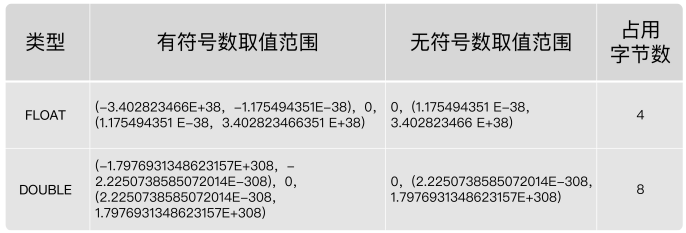

# 1. MySQL中的数据类型

| 类型             | 类型举例                                                     |
| ---------------- | ------------------------------------------------------------ |
| 整数类型         | TINYINT、SMALLINT、MEDIUMINT、INT(或INTEGER)、BIGINT         |
| 浮点类型         | FLOAT、DOUBLE                                                |
| 定点数类型       | DECIMAL                                                      |
| 位类型           | BIT                                                          |
| 日期时间类型     | YEAR、TIME、DATE、DATETIME、TIMESTAMP                        |
| 文本字符串类型   | CHAR、VARCHAR、TINYTEXT、TEXT、MEDIUMTEXT、LONGTEXT          |
| 枚举类型         | ENUM                                                         |
| 集合类型         | SET                                                          |
| 二进制字符串类型 | BINARY、VARBINARY、TINYBLOB、BLOB、MEDIUMBLOB、LONGBLOB      |
| JSON类型         | JSON对象、JSON数组                                           |
| 空间数据类型     | 单值类型：GEOMETRY、POINT、LINESTRING、POLYGON；<br/>集合类型：MULTIPOINT、MULTILINESTRING、MULTIPOLYGON、GEOMETRYCOLLECTION |

常见数据类型的属性，如下：

| MySQL关键字        | 含义                     |
| ------------------ | ------------------------ |
| NULL               | 数据列可包含NULL值       |
| NOT NULL           | 数据列不允许包含NULL值   |
| DEFAULT            | 默认值                   |
| PRIMARY KEY        | 主键                     |
| AUTO_INCREMENT     | 自动递增，适用于整数类型 |
| UNSIGNED           | 无符号                   |
| CHARACTER SET name | 指定一个字符集           |

#  2. 整数类型

## 2.1 类型介绍

在 MySQL 中，整数类型一共有 **5 种**，它们的主要区别是 **存储大小** 和 **取值范围**：

| 数据类型    | 存储大小（字节） | 有符号范围（SIGNED） | 无符号范围（UNSIGNED） |
|------------|----------------|--------------------|--------------------|
| **TINYINT**  | 1              | -128 ~ 127        | 0 ~ 255           |
| **SMALLINT** | 2              | -32,768 ~ 32,767  | 0 ~ 65,535        |
| **MEDIUMINT**| 3              | -8,388,608 ~ 8,388,607 | 0 ~ 16,777,215 |
| **INT（INTEGER）** | 4        | -2,147,483,648 ~ 2,147,483,647 | 0 ~ 4,294,967,295 |
| **BIGINT**   | 8              | -9,223,372,036,854,775,808 ~ 9,223,372,036,854,775,807 | 0 ~ 18,446,744,073,709,551,615 |

**示例：创建不同整数类型的表**
```sql
CREATE TABLE test_integers (
    tiny_val TINYINT,
    small_val SMALLINT,
    medium_val MEDIUMINT,
    int_val INT,
    big_val BIGINT
);
```
---

## 2.2 可选属性

**整数类型的可选属性有三个：**

### 2.2.1 **M 的作用**
- `M` 只是指定了**显示宽度**，但对存储数据的范围 **没有影响**。
- **只有在使用 ZEROFILL 时，M 才会影响输出格式**，否则没有实际用途。
- `M` 不控制可以存储的最大或最小整数值，数值范围仍然取决于数据类型本身。

#### **2. 例子**
##### **(1) 不使用 ZEROFILL**
```sql
CREATE TABLE test1 (
    id INT(5)  -- INT(5) 这里的 5 不会限制 id 的范围
);

INSERT INTO test1 (id) VALUES (123), (12345), (123456);

SELECT * FROM test1;
```
**输出结果**：
```
+--------+
| id     |
+--------+
| 123    |
| 12345  |
| 123456 |
+--------+
```
- 这里 `INT(5)` **不会限制数据的位数**，也不会影响数据的存储或显示方式。

##### **(2) 使用 ZEROFILL**
```sql
CREATE TABLE test2 (
    id INT(5) ZEROFILL  -- 指定 5 位宽度，并使用 ZEROFILL
);

INSERT INTO test2 (id) VALUES (1), (23), (456);

SELECT * FROM test2;
```
**输出结果**：
```
+-------+
| id    |
+-------+
| 00001 |
| 00023 |
| 00456 |
+-------+
```
- 这里 `ZEROFILL` 会用前导零填充，使数据在查询时按照 `M` 指定的宽度显示。
- **实际存储的值仍然是原始整数**，只是查询时的显示方式不同。

---

#### **3. 重要注意事项**
1. **MySQL 8.0.17 之后，M（显示宽度）对整数类型已经被废弃**，不再有任何效果。
2. `M` **不会限制整数存储的实际范围**，比如：
   - `INT(5)` 的范围仍然是 `-2147483648` 到 `2147483647`（与 `INT` 相同）。
3. 只有 `ZEROFILL` 搭配 `M` 才会影响查询结果的格式，但 `ZEROFILL` 也在 MySQL 8.0.17 之后被废弃。

#### **4. 结论**
- `M` 只影响 **显示宽度**，不影响存储范围或数据类型。
- **不要依赖 `M` 来限制数据长度**，如果要限制输入长度，应该使用 `CHECK` 约束或 `VARCHAR`。
- **如果不使用 `ZEROFILL`，`M` 完全无效**，在 MySQL 8.0.17 之后 `M` 已被移除，建议不再使用。

#### **5. 如果设置了显示宽度，那么插入的数据宽度超过显示宽度限制，会不会截断或插入失败？**
在 MySQL 中，**整数类型的显示宽度 (`M`) 并不会影响数据的存储范围**，即使插入的数据超过 `M` 指定的长度，也**不会被截断或导致插入失败**。

##### **1. 结论**
- `M` **不会限制整数的长度**，它只是影响 `ZEROFILL` 时的**显示格式**，但不会影响数据的存储或插入。
- **插入的数值仍然按照该数据类型的范围存储**，与 `M` 无关。

---

##### **2. 例子**
**(1) 创建一个 `INT(3)` 列（不使用 `ZEROFILL`）**
```sql
CREATE TABLE test1 (
    id INT(3)  -- `3` 只是显示宽度，不限制存储范围
);

INSERT INTO test1 (id) VALUES (1), (12), (123), (1234), (12345);
SELECT * FROM test1;
```
**输出结果**：
```
+-------+
| id    |
+-------+
| 1     |
| 12    |
| 123   |
| 1234  |
| 12345 |
+-------+
```
- 即使 `M=3`，仍然可以插入 `1234` 和 `12345`，数据不会被截断或插入失败。
- `M` 只是一个**显示属性**（在 MySQL 8.0.17 之后已经被移除）。

---

**(2) 创建 `INT(3) ZEROFILL`**
```sql
CREATE TABLE test2 (
    id INT(3) ZEROFILL  -- 3 位宽度，但仅影响查询显示
);

INSERT INTO test2 (id) VALUES (1), (12), (123), (1234), (12345);
SELECT * FROM test2;
```
**输出结果**：
```
+------+
| id   |
+------+
| 001  |
| 012  |
| 123  |
| 1234 |
| 12345|
+------+
```
- `ZEROFILL` 仅影响**小于 `M` 的数值**，不足 `3` 位的会补 0（如 `1 → 001`，`12 → 012`）。
- **超过 `M`（如 `1234`、`12345`）仍然正常存储，没有被截断**。

---

**(3) 插入更大范围的数**
```sql
INSERT INTO test2 (id) VALUES (999999999);
SELECT * FROM test2;
```
**结果**：
```
+-----------+
| id        |
+-----------+
| 999999999 |
+-----------+
```
- `999999999` 超过了 `M=3`，但仍然能成功插入，因为 `M` **不会限制存储范围**。

**(4) 插入超出 `INT` 类型范围的数**
```sql
INSERT INTO test2 (id) VALUES (2147483648);  -- 超出 INT 的最大范围
```
**错误**：
```
ERROR 1264 (22003): Out of range value for column 'id'
```
- **MySQL 只会根据 `数据类型范围` 检查是否超出，而不会考虑 `M`**。
- `INT` 的范围是 `-2147483648` 到 `2147483647`，所以 `2147483648` 超出范围，导致插入失败。

---

##### **3. 结论**
- **`M`（显示宽度）不会影响数据存储，超过 `M` 也不会截断或插入失败。**
- **`M` 只有在 `ZEROFILL` 选项时才会影响查询时的显示格式。**
- **真正影响数据插入是否失败的，是整数类型本身的存储范围，而不是 `M`。**

---

### 2.2.2 UNSIGNED

在 MySQL 中，`UNSIGNED` 是一个可选属性，可以应用于整数类型（如 `TINYINT`、`SMALLINT`、`MEDIUMINT`、`INT`、`BIGINT`），表示该列的值**只能存储非负整数（0 或正数）**。

#### 🔹 `UNSIGNED` 的作用：
- **去掉负数范围**，使整数类型的存储范围变成**从 0 开始**，从而扩展正整数的最大值。
- **提高存储效率**，对于不需要负数的字段，可以利用 `UNSIGNED` 提供更大的正数范围，而不增加存储空间。

---

#### 1️⃣ `UNSIGNED` 与 `SIGNED` 的范围对比：
假设我们使用 `INT` 类型（占 **4 字节 = 32 位**），默认是 `SIGNED` 类型，范围如下：

| 数据类型  | `SIGNED` (默认) | `UNSIGNED` |
|---------|------------------|------------|
| `TINYINT`  (1字节) | -128 ~ 127 | 0 ~ 255 |
| `SMALLINT` (2字节) | -32,768 ~ 32,767 | 0 ~ 65,535 |
| `MEDIUMINT` (3字节) | -8,388,608 ~ 8,388,607 | 0 ~ 16,777,215 |
| `INT` (4字节) | -2,147,483,648 ~ 2,147,483,647 | 0 ~ 4,294,967,295 |
| `BIGINT` (8字节) | -9,223,372,036,854,775,808 ~ 9,223,372,036,854,775,807 | 0 ~ 18,446,744,073,709,551,615 |

**注意：**
- `SIGNED`（默认）允许存储负数，范围是负最大值到正最大值。
- `UNSIGNED` **不能存储负数**，但可以存储更大的正整数。

---

#### 2️⃣ `UNSIGNED` 的实际使用示例：
##### ① 创建 `SIGNED` 和 `UNSIGNED` 字段：
```sql
CREATE TABLE test_unsigned (
    id INT PRIMARY KEY AUTO_INCREMENT,
    signed_col INT,           -- 默认是 SIGNED
    unsigned_col INT UNSIGNED -- 只能存储非负整数
);
```

##### ② 插入数据：
```sql
INSERT INTO test_unsigned (signed_col, unsigned_col) VALUES (-100, 100); -- ✅ 正常
INSERT INTO test_unsigned (signed_col, unsigned_col) VALUES (200, 200);  -- ✅ 正常
INSERT INTO test_unsigned (signed_col, unsigned_col) VALUES (-50, -50);  -- ❌ 错误，UNSIGNED 列不能存储负数！
```
🚨 **错误示例**：
```
ERROR 1264 (22003): Out of range value for column 'unsigned_col' at row 1
```
因为 `unsigned_col` 是 `UNSIGNED`，不能存储负数。

---

#### 3️⃣ 什么时候使用 `UNSIGNED`？
- **计数类字段**（例如 `id`、`views`、`likes`、`age`）：这些字段只会存储正数，没有必要支持负数。
- **存储容量较大但不需要负数的字段**（如库存 `stock`、订单编号 `order_id`）。
- **减少存储负担，提高数据范围**，让 `INT` 变成 `0~4,294,967,295`，而不是 `-2,147,483,648~2,147,483,647`。

**示例：**
```sql
CREATE TABLE users (
    user_id INT UNSIGNED AUTO_INCREMENT PRIMARY KEY, -- 用户ID不会是负数
    age TINYINT UNSIGNED CHECK (age >= 0 AND age <= 120), -- 年龄不会是负数
    followers_count INT UNSIGNED -- 关注人数不可能是负数
);
```

---

#### 4️⃣ 如何查看 `UNSIGNED` 属性？
可以用 `SHOW CREATE TABLE` 查看表结构：
```sql
SHOW CREATE TABLE test_unsigned;
```
会显示：
```sql
CREATE TABLE `test_unsigned` (
  `id` int NOT NULL AUTO_INCREMENT,
  `signed_col` int DEFAULT NULL,
  `unsigned_col` int UNSIGNED DEFAULT NULL,
  PRIMARY KEY (`id`)
);
```
---

#### 🔥 总结：
1. **`UNSIGNED` 让整数类型** 不能存负数，但能存更大的正数。
2. **适用于 ID、计数类字段、年龄等** 只需要非负数的场景。
3. **错误示范**：尝试向 `UNSIGNED` 列插入负数会报错。

### 2.2.3 ZEROFILL
#### **`ZEROFILL` 特性**
1. **自动填充零**  
   - 当 `ZEROFILL` 被指定时，MySQL 会自动在数值前填充零，以匹配列的定义宽度。例如，`INT(5) ZEROFILL`，如果存入 `42`，则 MySQL 会显示为 `00042`。
   
2. **自动转换为 `UNSIGNED`**  
   - 任何带有 `ZEROFILL` 的整数类型都会 **自动** 转换为 `UNSIGNED`，即 **不能存储负数**。例如，`INT(5) ZEROFILL` 实际上等同于 `UNSIGNED INT(5) ZEROFILL`。

3. **影响的是显示效果，不影响存储大小**  
   - `ZEROFILL` 只影响 **查询结果的显示**，并不会影响数据的实际存储大小。
   - `INT(5)` 中的 **5** 也只是一个 **显示宽度**，而不是存储的字节数。

#### **示例**

##### **创建表**
```sql
CREATE TABLE orders (
    id INT(5) ZEROFILL PRIMARY KEY AUTO_INCREMENT,
    amount DECIMAL(10,2) NOT NULL
);
```

#### 3 **插入数据**

```sql
INSERT INTO orders (amount) VALUES (100.50), (25.75), (300.00);
```

##### **查询数据**
```sql
SELECT * FROM orders;
```
##### **查询结果**
```
+-------+--------+
| id    | amount |
+-------+--------+
| 00001 | 100.50 |
| 00002 |  25.75 |
| 00003 | 300.00 |
+-------+--------+
```
可以看到，`id` 字段的值是 **用零填充到5位** 的形式，例如 `00001`、`00002`。

#### **几点注意事项**
1. **`ZEROFILL` 仅影响数值的显示，不影响计算**
   ```sql
   SELECT id + 0 FROM orders;
   ```
   结果：
   ```
   +------+
   | id   |
   +------+
   |    1 |
   |    2 |
   |    3 |
   +------+
   ```
   这里 `id` 依然是整数，计算时 `00001` 仍然视为 `1`。

2. **`ZEROFILL` 不适用于 `BIGINT UNSIGNED` 以外的 `AUTO_INCREMENT`**
   - `AUTO_INCREMENT` 默认不支持负数，因此 `ZEROFILL` 主要用于 `UNSIGNED` 类型。

3. **`ZEROFILL` 未来可能被废弃**（MySQL 8.0 已不推荐）
   - 在 **MySQL 8.0.17** 之后，`ZEROFILL` 已被废弃，官方建议在应用层处理前导零的格式化，例如：
     ```sql
     SELECT LPAD(id, 5, '0') FROM orders;
     ```
   - `LPAD()` 函数会用 `'0'` 在左侧填充，使数字达到 5 位宽度。

#### **结论**
- `ZEROFILL` 只影响 **查询结果的显示**，并不影响存储或计算。
- 该属性 **自动使整数变为 `UNSIGNED`**，即不能存储负数。
- MySQL 8.0.17 之后已不推荐 `ZEROFILL`，建议用 `LPAD()` 处理前导零。

---

## 2.3 适用场景

`TINYINT`：一般用于枚举数据，比如系统设定取值范围很小且固定的场景。

`SMALLINT`：可以用于较小范围的统计数据，比如统计工厂的固定资产库存数量等。

`MEDIUMINT`：用于较大整数的计算，比如车站每日的客流量等。

`INT、INTEGER`：取值范围足够大，一般情况下不用考虑超限问题，用得最多。比如商品编号。

`BIGINT`：只有当你处理特别巨大的整数时才会用到。比如双十一的交易量、大型门户网站点击量、证券公司衍生产品持仓等。

## 2.4 如何选择？

在评估用哪种整数类型的时候，你需要考虑`存储空间`和`可靠性`的平衡问题：一方面，用占用字节数少的整数类型可以节省存储空间；另一方面，要是为了节省存储空间， 使用的整数类型取值范围太小，一旦遇到超出取值范围的情况，就可能引起`系统错误`，影响可靠性。 

举个例子，商品编号采用的数据类型是 INT。原因就在于，客户门店中流通的商品种类较多，而且，每天都有旧商品下架，新商品上架，这样不断迭代，日积月累。

如果使用 SMALLINT 类型，虽然占用字节数比 INT 类型的整数少，但是却不能保证数据不会超出范围 65535。相反，使用 INT，就能确保有足够大的取值范围，不用担心数据超出范围影响可靠性的问题。 

你要注意的是，在实际工作中，**系统故障产生的成本远远超过增加几个字段存储空间所产生的成本**。因此，我建议你首先确保数据不会超过取值范围，在这个前提之下，再去考虑如何节省存储空间。

# 3. 浮点类型

## 3.1 类型介绍

ㄕ和定点数类型的特点是可以`处理小数`，你可以把整数看成小数的一个特例。因此，浮点数和定点数的使用场景，比整数大多了。 MySQL支持的浮点数类型，分别是 FLOAT、DOUBLE、REAL。


- FLOAT 表示单精度浮点数；
- DOUBLE 表示双精度浮点数；

- REAL默认就是 DOUBLE。如果你把 SQL 模式设定为启用 `REAL_AS_FLOAT`，那 么，MySQL 就认为 REAL 是 FLOAT。如果要启用 `REAL_AS_FLOAT`，可以通过以下 SQL 语句实现：

  ```sql
  SET sql_mode = “REAL_AS_FLOAT”;
  ```

### **问题1：FLOAT 和 DOUBLE 的区别**

在 MySQL 中，`FLOAT` 和 `DOUBLE` 都是用于存储浮点数的，但它们的**存储空间、精度和取值范围**不同：

| 数据类型 | 存储字节数 | 精度 (大约) | 取值范围 |
|----------|----------|----------|----------|
| FLOAT | 4 字节 | 约 7 位十进制数 | ±1.5 × 10⁻⁴⁵ ~ ±3.4 × 10³⁸ |
| DOUBLE | 8 字节 | 约 16 位十进制数 | ±5.0 × 10⁻³²⁴ ~ ±1.8 × 10³⁰⁸ |

#### **示例 1：FLOAT 和 DOUBLE 的精度差异**
```sql
CREATE TABLE float_double_test (
    num_float FLOAT,
    num_double DOUBLE
);

INSERT INTO float_double_test (num_float, num_double)
VALUES (12345.6789012345, 12345.6789012345);

SELECT * FROM float_double_test;
```
**结果：**
```
+------------+--------------+
| num_float  | num_double   |
+------------+--------------+
| 12345.6787 | 12345.678901 |
+------------+--------------+
```
🔹 **解释：**  
- `FLOAT` 只能精确到**大约 7 位小数**，后面的数据会被**四舍五入或截断**。  
- `DOUBLE` 则可以精确到 **大约 16 位小数**，因此数值更加精准。

#### **示例 2：存储相同的数值，FLOAT 可能会导致精度丢失**
```sql
SELECT 
    CAST(123456.789123456 AS FLOAT) AS float_value, 
    CAST(123456.789123456 AS DOUBLE) AS double_value;
```
**结果：**
```
+-------------+--------------+
| float_value | double_value |
+-------------+--------------+
| 123456.789  | 123456.789123 |
+-------------+--------------+
```
🔹 **结论：** 如果数据需要高精度计算（如金融、科学计算等），应该使用 `DOUBLE`，而 `FLOAT` 适合需要节省存储空间但不要求高精度的场景（如传感器数据、统计数据等）。


### **问题2：为什么无符号浮点数的取值范围只是有符号数的一半？**

MySQL 中的浮点数存储格式如下：
```
S | EEEEEEEE | MMMMMMMMMMMMMMMMMMMMMMM
```
- `S`（1 位）：**符号位**，0 表示正数，1 表示负数。
- `E`（8 或 11 位）：**指数位**，决定数值的大小范围。
- `M`（23 或 52 位）：**尾数位**，决定精度。

> ⚠️ **重点：** 即使声明 `FLOAT UNSIGNED` 或 `DOUBLE UNSIGNED`，MySQL **仍然会存储符号位**，只是不会使用负数部分。

**示例 3：对比有符号和无符号的取值范围**
```sql
CREATE TABLE signed_unsigned_test (
    signed_float FLOAT,
    unsigned_float FLOAT UNSIGNED
);

INSERT INTO signed_unsigned_test (signed_float, unsigned_float)
VALUES (-3.4E38, 3.4E38);  -- 无符号 FLOAT 不能存储负数

SELECT * FROM signed_unsigned_test;
```
**可能的结果：**
```
+--------------+---------------+
| signed_float | unsigned_float|
+--------------+---------------+
| -3.4E38      | 3.4E38        |
+--------------+---------------+
```
如果尝试插入 `-1` 到 `FLOAT UNSIGNED` 类型的列：
```sql
INSERT INTO signed_unsigned_test (unsigned_float) VALUES (-1);
```
会报错：
```
ERROR 1264 (22003): Out of range value for column 'unsigned_float' at row 1
```
🔹 **解释：**
- **有符号浮点数** 取值范围是 `-3.4E38 ~ +3.4E38`（假设 `FLOAT`）。
- **无符号浮点数** 不能存储负数，因此范围变成 `0 ~ 3.4E38`，**正好是有符号数的一半**。

### **总结**
1. **FLOAT vs. DOUBLE**
   - `FLOAT` 占 4 字节，精度大约 7 位，适用于节省存储但不要求高精度的场景。
   - `DOUBLE` 占 8 字节，精度大约 16 位，适用于需要高精度的计算（金融、科学计算等）。

2. **无符号浮点数的取值范围**
   - 由于浮点数存储结构包含**符号位**，即使声明为 `UNSIGNED`，符号位仍然存在。
   - 因此，`FLOAT UNSIGNED` 的取值范围只是 `FLOAT SIGNED` **非负部分的一半**。

---

## 3.2 MySQL 浮点数数据精度详解

在 MySQL 中，`FLOAT` 和 `DOUBLE` 是两种用于存储**浮点数**的数据类型，它们的主要区别在于存储大小和精度：

- `FLOAT`（单精度）：占 **4** 字节，精度大约 **7** 位十进制数。
- `DOUBLE`（双精度）：占 **8** 字节，精度大约 **15**-**16** 位十进制数。

### **(M,D) 的含义**
在 MySQL 允许的**非标准语法**中，`FLOAT(M,D)` 和 `DOUBLE(M,D)` 是一种特殊格式：
- **M**（精度）：**整数位 + 小数位** 的总位数，最大为 **255**。
- **D**（标度）：**小数位** 的个数，最大为 **30**，且 `D ≤ M`。

#### **示例**
```sql
CREATE TABLE test_float (
    num1 FLOAT(5,2),
    num2 DOUBLE(8,3)
);
```
这个表有两个字段：
- `num1 FLOAT(5,2)`：最多 **5 位数，其中 2 位小数**，即 **整数部分最多 3 位**，范围 `-999.99` ~ `999.99`。
- `num2 DOUBLE(8,3)`：最多 **8 位数，其中 3 位小数**，即 **整数部分最多 5 位**，范围 `-99999.999` ~ `99999.999`。

### **数据存储时的规则**
MySQL 处理浮点数时，会根据 **(M,D) 约束**来判断数据是否合法。

##3# **(1) 整数部分超出范围**
如果 **整数部分的位数超出允许范围**，MySQL **会报错**，不允许存储。

##### **示例**
```sql
INSERT INTO test_float (num1) VALUES (1234.56);
```
**错误！**
因为 `FLOAT(5,2)` 允许的最大整数部分是 `999`，但 `1234.56` 的整数部分是 `1234`，超出范围。

#### **(2) 小数部分超出范围**
如果 **小数部分超出 D 的范围**，MySQL **会四舍五入**，并给出警告。

##### **示例**
```sql
INSERT INTO test_float (num1) VALUES (999.999);
```
**插入成功，结果变成 `999.99`（四舍五入）**：
```sql
SELECT num1 FROM test_float;
```
```plaintext
+--------+
| num1   |
+--------+
| 999.99 |
+--------+
```
⚠️ **但如果四舍五入后导致整数部分超出范围，则会报错！**

##### **示例**
```sql
INSERT INTO test_float (num1) VALUES (999.995);
```
**错误！** 因为 `999.995` **四舍五入后变成 `1000.00`**，超出了 `FLOAT(5,2)` 允许的最大值 `999.99`。

### **UNSIGNED 对范围的影响**
浮点数类型可以加 `UNSIGNED`（无符号），但 **不会影响其最大范围**，只是去掉负数。

##### **示例**
```sql
CREATE TABLE test_float_unsigned (
    num3 FLOAT(3,2) UNSIGNED
);
```
- `FLOAT(3,2) UNSIGNED` 的范围是 `0.00` ~ `9.99`。
- **如果插入负数**，MySQL **会报错！**

##### **插入数据**
```sql
INSERT INTO test_float_unsigned (num3) VALUES (-3.14);
```
**错误！因为 `UNSIGNED` 不允许负数。**

### **为什么不推荐使用 FLOAT(M,D)？**
从 **MySQL 8.0.17** 开始，官方**不推荐使用 `FLOAT(M,D)` 和 `DOUBLE(M,D)`**，原因是：
1. **与其他数据库不兼容**，会影响数据迁移。
2. **四舍五入的精度问题**，可能导致数据不准确。
3. **误导性**，因为 `M` 只是一个显示宽度，并不能真正控制浮点数的存储精度。

#### **建议**
- **如果需要精确的小数存储，应该使用 `DECIMAL(M,D)` 而不是 `FLOAT(M,D)`！**
- 例如：
  ```sql
  CREATE TABLE test_decimal (
      price DECIMAL(10,2)
  );
  ```
  这样可以**精确存储小数**，避免浮点数的四舍五入问题。


### **总结**
| **类型**       | **存储大小** | **精度** (大约) | **是否推荐 `FLOAT(M,D)` 语法** |
|--------------|-----------|-------------|--------------------------|
| `FLOAT` (单精度)  | 4 字节     | 7 位          | ❌ **不推荐** |
| `DOUBLE` (双精度) | 8 字节     | 15-16 位      | ❌ **不推荐** |
| `DECIMAL(M,D)` | 变长     | **精确存储** | ✅ **推荐用于精确计算** |

✔ **如果不指定 `(M,D)`，MySQL 会使用默认的精度，避免 M、D 约束的问题。**

---

## 3.3 浮点数精度误差的解释

在 MySQL（以及大多数编程语言）中，**浮点数（FLOAT 和 DOUBLE）无法精确存储某些小数**，这是因为计算机存储浮点数时使用 **IEEE 754** 浮点数标准，该标准采用 **二进制表示法** 来存储数值，而某些十进制小数在二进制中是**无法精确表示的**。

### 1. 为什么浮点数会有误差？

- 计算机使用 **二进制** 来存储数据，而有些十进制数在二进制中是**无限循环小数**，只能近似存储。例如：
  - **十进制** `0.1` 在二进制中表示为：  
    ```
    0.0001100110011001100110011001100110011001100110011...(无限循环)
    ```
    计算机只能存储一定精度的位数，超出的部分会**被截断或四舍五入**，导致**误差**。

- **FLOAT 和 DOUBLE 使用不同的字节存储数据**：
  - `FLOAT`（单精度浮点数）使用 **4 字节（32 位）**
  - `DOUBLE`（双精度浮点数）使用 **8 字节（64 位）**
  - DOUBLE 比 FLOAT **精度更高**，但仍然无法完全避免误差。

### 2. MySQL 浮点数精度误差的示例

你提供的示例中，计算 `0.47 + 0.44 + 0.19` 的期望结果是 `1.1`，但查询后却得到 **1.0999999999999999**，这是因为 MySQL 在存储这些浮点数时存在精度误差。

✅ **测试代码**
```sql
CREATE TABLE test_double2(
    f1 DOUBLE
);

INSERT INTO test_double2
VALUES(0.47), (0.44), (0.19);

SELECT SUM(f1) FROM test_double2;
```
📌 **查询结果**
```
+--------------------+
| SUM(f1)           |
+--------------------+
| 1.0999999999999999 |
+--------------------+
```
可以看到，理论上 `0.47 + 0.44 + 0.19 = 1.1`，但计算机存储的是 `1.0999999999999999`。

✅ **再试试 FLOAT**
```sql
CREATE TABLE test_float(
    f1 FLOAT
);

INSERT INTO test_float
VALUES(0.47), (0.44), (0.19);

SELECT SUM(f1) FROM test_float;
```
📌 **查询结果**
```
+--------------------+
| SUM(f1)           |
+--------------------+
| 1.0999999940395355 |
+--------------------+
```
FLOAT 由于存储的精度更低，误差更大。

### 3. 为什么 `SUM(f1) = 1.1` 结果是 `FALSE`？

```sql
SELECT SUM(f1) = 1.1, 1.1 = 1.1 FROM test_double2;
```
📌 **查询结果**
```
+---------------+-----------+
| SUM(f1) = 1.1 | 1.1 = 1.1 |
+---------------+-----------+
|             0 |         1 |
+---------------+-----------+
```
- `1.1 = 1.1` 结果是 `TRUE`，因为两个 **整数相等**。
- 但 `SUM(f1) = 1.1` 结果是 `FALSE`，因为 `SUM(f1)` 实际上是 `1.0999999999999999`，与 `1.1` **不完全相等**，所以返回 `FALSE`。

❌ **不推荐**
```sql
SELECT SUM(f1) = 1.1 FROM test_double2;
```
✅ **推荐**
```sql
SELECT ABS(SUM(f1) - 1.1) < 0.000001 FROM test_double2;
```
**解释**：
- `ABS(SUM(f1) - 1.1) < 0.000001` 检查**两个浮点数是否近似相等**，允许微小误差。

### 4. 如何避免浮点数误差？

对于**需要高精度计算**的场景，如**财务计算、金额存储**等，应该**避免使用 FLOAT 和 DOUBLE**，改用 **DECIMAL** 类型。

#### ✅ 使用 DECIMAL 解决浮点误差问题

DECIMAL 是 **定点数**，它不会像 FLOAT 和 DOUBLE 那样转换为二进制存储，而是以**字符串形式存储**，所以不会产生浮点精度误差。

```sql
CREATE TABLE test_decimal(
    f1 DECIMAL(10,2)
);

INSERT INTO test_decimal
VALUES(0.47), (0.44), (0.19);

SELECT SUM(f1) FROM test_decimal;
```
📌 **查询结果**
```
+--------+
| SUM(f1) |
+--------+
| 1.10   |
+--------+
```
可以看到，DECIMAL **能正确存储和计算**，不会出现 `1.0999999999999999` 这样的误差。

### 5. 结论与最佳实践

1️⃣ **浮点数 (FLOAT / DOUBLE) 不适用于精确计算**：
   - 浮点数使用 **IEEE 754** 标准，某些十进制数无法用二进制精确表示。
   - 计算时可能会出现 **1.0999999999999999** 这样的误差。

2️⃣ **不能使用 `=` 判断浮点数相等**：
   - 改用 `ABS(a - b) < 允许误差值`。

3️⃣ **财务计算应使用 DECIMAL，而不是 FLOAT / DOUBLE**：
   - DECIMAL **不会丢失精度**，适合存储**金额、会计数据、交易数据**等。

### 6. 🏆 总结：什么时候用 FLOAT、DOUBLE 和 DECIMAL？

| 类型      | 存储方式    | 适用场景 | 精度 |
|----------|-----------|---------|-----|
| `FLOAT`  | 4 字节    | 科学计算，非精确计算（如物理模拟） | 低 |
| `DOUBLE` | 8 字节    | 需要更高精度的科学计算 | 中 |
| `DECIMAL` | 变长存储 | 财务、金额计算（银行、电商） | 高 |

---

# 4. 定点数类型

MySQL 的 **DECIMAL(M, D)** 类型是一种 **定点数类型**，主要用于存储**高精度小数**，通常用于**货币、财务计算**等对数值精度要求较高的场景。

## **1. DECIMAL(M, D) 的基本概念**
- **M（精度，Precision）**：表示**总共的数字个数**（不包括小数点）。
- **D（标度，Scale）**：表示**小数点后的位数**。
- **M 必须大于 D**，即整数部分至少要有一位。

📌 **默认值**：
- **如果 M 和 D 都没有指定**，默认是 **DECIMAL(10,0)**（即只能存整数）。
- **存储空间**：DECIMAL 类型的存储空间大约是 **M+2** 字节，但它是以 **字符串** 形式存储的，因此数值是**精准**的。

## **2. 示例解释**
### **示例 1：DECIMAL(5,2)**
```sql
CREATE TABLE test_decimal (
    amount DECIMAL(5,2)
);
```
- 允许的取值范围是：`-999.99 ~ 999.99`
- 例如：
  ```sql
  INSERT INTO test_decimal VALUES (123.45), (999.99), (-999.99);
  ```
- **错误示例**
  ```sql
  INSERT INTO test_decimal VALUES (1000.00); -- 超出范围，报错
  ```

### **示例 2：DECIMAL(10,4)**
```sql
CREATE TABLE salary (
    monthly_salary DECIMAL(10,4)
);
```
- **最大值**：999999.9999（因为整数部分有 `10 - 4 = 6` 位）
- **最小值**：-999999.9999
- **插入示例**
  ```sql
  INSERT INTO salary VALUES (123456.7890), (999999.9999);
  ```
- **存储结果**
  ```plaintext
  | monthly_salary |
  |---------------|
  | 123456.7890   |
  | 999999.9999   |
  ```

## **3. DECIMAL vs. FLOAT/DOUBLE**
| 类型 | 精度 | 取值范围 | 适用场景 |
|------|------|---------|---------|
| **DECIMAL** | 精确 | 取值范围小（受 M 影响） | 货币、财务计算 |
| **FLOAT** | 不精确（浮点误差） | 取值范围大 | 科学计算、统计数据 |
| **DOUBLE** | 不精确（浮点误差） | 取值范围更大 | 更高精度的科学计算 |

### **示例 3：浮点数 vs 定点数**
```sql
CREATE TABLE compare_numbers (
    decimal_value DECIMAL(10,2),
    float_value FLOAT(10,2),
    double_value DOUBLE(10,2)
);

INSERT INTO compare_numbers VALUES (123.456, 123.456, 123.456);
SELECT * FROM compare_numbers;
```
**输出可能是**
```plaintext
| decimal_value | float_value | double_value |
|--------------|------------|-------------|
| 123.46      | 123.46      | 123.46      |
```
- **DECIMAL** 是**精准的**，值**不会发生误差**。
- **FLOAT/DOUBLE** 在某些情况下可能会出现**浮点误差**（例如 0.1 + 0.2 可能不等于 0.3）。

## **4. DECIMAL 自动四舍五入**
当超出 `D` 的位数时，**MySQL 会进行四舍五入**：
```sql
CREATE TABLE rounding_test (
    value DECIMAL(5,2)
);
INSERT INTO rounding_test VALUES (123.456), (98.999);
SELECT * FROM rounding_test;
```
**结果**
```plaintext
| value |
|-------|
| 123.46 |
| 99.00  |
```
- `123.456` 被四舍五入为 `123.46`
- `98.999` 被四舍五入为 `99.00`

## **5. 结论**
- **DECIMAL 适用于精准计算**，如**财务数据**（金额）。
- **FLOAT/DOUBLE 适用于科学计算**，但可能会有浮点误差。
- **DECIMAL 的存储空间由 M 决定**，但它的计算方式比浮点数慢，因为它是**以字符串存储**的。

> 📌 **最佳实践**
> - **金额计算：使用 DECIMAL**
> - **科学计算：使用 FLOAT 或 DOUBLE**
> - **不需要小数的整数：可以使用 INT 或 BIGINT**

> 📌 **开发中经验**
> “由于 DECIMAL 数据类型的精准性，在我们的项目中，除了极少数（比如商品编号）用到整数类型外，其他的数值都用的是 DECIMAL，原因就是这个项目所处的零售行业，要求精准，一分钱也不能差。 ” ——来自某项目经理

---

# 5. 位类型：BIT

`BIT` 类型用于存储**二进制位**（0 和 1），主要用于表示**布尔值或位标志**，类似于布尔数组。由于 MySQL 不直接支持布尔类型（`BOOLEAN` 实际上是 `TINYINT(1)`），`BIT` 类型可以用于高效存储多个布尔值。

## **BIT 类型的存储**
| 类型      | 长度 (M) | 长度范围      | 存储空间               |
|----------|---------|-------------|----------------------|
| BIT(M)  | M       | 1 ≤ M ≤ 64  | ⌈M / 8⌉ 个字节 |

- `M` 指定位数，可以存储 `1` 到 `64` 位。
- **占用空间计算**：
  - `BIT(1)` 占用 1 位，存储在 **1 字节**（实际会填充）。
  - `BIT(5)` 占用 5 位，存储在 **1 字节**（5/8 向上取整）。
  - `BIT(64)` 占用 64 位，存储在 **8 字节**（64/8）。
  
## **示例讲解**
### **1. 创建 `BIT` 类型的表**
```sql
CREATE TABLE test_bit (
    f1 BIT,        -- 相当于 BIT(1)，默认 1 位
    f2 BIT(5),     -- 5 位
    f3 BIT(64)     -- 64 位
);
```

### **2. 插入数据**
```sql
INSERT INTO test_bit (f1) VALUES (1);
```
✅ **成功**，`BIT(1)` 只能存 `0` 或 `1`，`1` 在二进制中为 `1`。

```sql
INSERT INTO test_bit (f1) VALUES (2);
```
❌ **报错**：`Data too long for column 'f1'`  
`BIT(1)` 只能存 `0` 或 `1`，`2` 超出了 `1` 位能表示的范围。


### **3. 插入 `BIT(5)` 数据**
```sql
INSERT INTO test_bit (f2) VALUES (23);
```
✅ **成功**，`23` 的二进制是 `10111`，`BIT(5)` 恰好可以存储 5 位。

```sql
INSERT INTO test_bit (f2) VALUES (32);
```
❌ **报错**，因为 `32` 的二进制是 `100000`，超出了 `BIT(5)` 可存储的最大值（`11111` = `31`）。

### **4. 查询 `BIT` 类型数据**
- 直接查询时，MySQL 不会直观显示 `BIT` 数据：
```sql
SELECT f1, f2, f3 FROM test_bit;
```
结果可能显示乱码（因为 `BIT` 直接存储二进制数据）。

- **使用 `BIN()` 以二进制格式显示**
```sql
SELECT BIN(f1), BIN(f2) FROM test_bit;
```
示例输出：
```
+--------+--------+
| BIN(f1)| BIN(f2)|
+--------+--------+
| 1      | 10111  |
+--------+--------+
```

- **使用 `HEX()` 以十六进制格式显示**
```sql
SELECT HEX(f1), HEX(f2) FROM test_bit;
```
示例输出：
```
+--------+--------+
| HEX(f1)| HEX(f2)|
+--------+--------+
| 1      | 17     |
+--------+--------+
```
其中：
- `BIN(f2) = 10111`（`23` 的二进制）
- `HEX(f2) = 17`（`23` 转换为十六进制）

## **应用场景**
1. **布尔值存储**：使用 `BIT(1)` 代替 `BOOLEAN`。
2. **位标志（Flags）**：
   - `BIT(8)` 可以存储 8 个布尔值，适用于权限管理。
   - `BIT(64)` 可用于标记多个状态，例如日志或事件标志。
3. **节省存储空间**：相比 `TINYINT`、`SMALLINT` 等类型，`BIT` 更节省空间。

## **总结**
- `BIT(M)` 存储二进制位数，`M` 范围 `1~64`。
- 存储空间按 `⌈M/8⌉` 字节计算。
- **查询时** 使用 `BIN()` 或 `HEX()` 转换以查看可读格式。
- `BIT(1)` 适用于**布尔值**，`BIT(n)` 适用于**位标志存储**。

---

# 6. 日期与时间类型

日期与时间是重要的信息，在我们的系统中，几乎所有的数据表都用得到。原因是客户需要知道数据的时间标签，从而进行数据查询、统计和处理。 

MySQL有多种表示日期和时间的数据类型，不同的版本可能有所差异，MySQL8.0版本支持的日期和时间类型主要有：YEAR类型、TIME类型、DATE类型、DATETIME类型和TIMESTAMP类型。

- `YEAR`类型通常用来表示年
- `DATE`类型通常用来表示年、月、日
- `TIME`类型通常用来表示时、分、秒
- `DATETIME`类型通常用来表示年、月、日、时、分、秒
- `TIMESTAMP`类型通常用来表示带时区的年、月、日、时、分、秒

| 类型      | 名称     | 字节 | 日期格式            | 最小值                  | 最大值                 |
| --------- | -------- | ---- | ------------------- | ----------------------- | ---------------------- |
| YEAR      | 年       | 1    | YYYY或YY            | 1901                    | 2155                   |
| TIME      | 时间     | 3    | HH:MM:SS            | -838:59:59              | 838:59:59              |
| DATE      | 日期     | 3    | YYYY-MM-DD          | 1000-01-01              | 9999-12-03             |
| DATETIME  | 日期时间 | 8    | YYYY-MM-DD HH:MM:SS | 1000-01-01 00:00:00     | 9999-12-31 23:59:59    |
| TIMESTAMP | 日期时间 | 4    | YYYY-MM-DD HH:MM:SS | 1970-01-01 00:00:00 UTC | 2038-01-19 03:14:07UTC |

可以看到，不同数据类型表示的时间内容不同、取值范围不同，而且占用的字节数也不一样，你要根据实际需要灵活选取。

为什么时间类型 TIME 的取值范围不是 -23:59:59～23:59:59 呢？原因是 MySQL 设计的 TIME 类型，不光表示一天之内的时间，而且可以用来表示一个时间间隔，这个时间间隔可以超过 24 小时。

## 6.1 YEAR类型

在 MySQL 中，`YEAR` 类型用于存储年份数据，占用 **1 个字节**，是所有日期时间类型中占用空间最小的。

### 📌 **YEAR 类型的特点**
1. 以 **4 位数（YYYY）** 存储，例如：`2023`、`1995`。
2. 存储范围是 **1901 到 2155**（此外，`0000` 也是有效的值）。
3. **2 位数表示法（不推荐）**：
   - `00` ~ `69` ➝ 解释为 **2000 ~ 2069**
   - `70` ~ `99` ➝ 解释为 **1970 ~ 1999**
   - `0` 或 `'0'` 的特殊情况：
     - 直接存 `0` 或 `00` ➝ **存储 `0000`**
     - 作为 **字符串 `'0'` 插入** ➝ **存储 `2000`**
4. **默认格式是 `YYYY`，从 MySQL 8.0.19 开始，不推荐使用 `YEAR(4)`**。YEAR默认格式就是“YYYY”，没必要写成YEAR(4)，从MySQL 8.0.19开始，不推荐使用指定显示宽度的YEAR(4)数据类型。
  ```sql
  CREATE TABLE test_year(
    f1 YEAR,
    f2 YEAR(4)
  );
  ```

### 📝 **示例**
#### 1️⃣ 创建一个包含 `YEAR` 字段的表
```sql
CREATE TABLE year_example (
    id INT AUTO_INCREMENT PRIMARY KEY,
    year_col YEAR NOT NULL
);
```

#### 2️⃣ 插入数据（4 位数）
```sql
INSERT INTO year_example (year_col) VALUES (2023), (1999), (1901), (2155);
```
✅ 存储结果：
| id | year_col |
|----|---------|
| 1  | 2023    |
| 2  | 1999    |
| 3  | 1901    |
| 4  | 2155    |

#### 3️⃣ 插入 2 位数（不推荐）
```sql
INSERT INTO year_example (year_col) VALUES (70), (99), (00), (69);
```
✅ 存储结果：
| id | year_col |
|----|---------|
| 5  | 1970    |
| 6  | 1999    |
| 7  | 0000    |
| 8  | 2069    |

#### 4️⃣ 特殊情况：`0` 和 `'0'`
```sql
INSERT INTO year_example (year_col) VALUES (0), ('0');
```
✅ 存储结果：
| id | year_col |
|----|---------|
| 9  | 0000    |
| 10 | 2000    |

📌 **区别：**
- `0` ➝ 存储 **0000**
- `'0'`（字符串 `0`）➝ 存储 **2000**

### 🎯 **查询数据**
```sql
SELECT * FROM year_example;
```

### 🚀 **总结**
- **推荐** 使用 **4 位数 `YYYY`**，例如 `2024`、`1999`。
- **不推荐** 使用 2 位数，因为它的转换规则可能导致混淆（例如 `70` 变成 `1970`）。
- 特殊情况：
  - **`0` 存 0000**
  - **`'0'`（字符串）存 2000**
- **`YEAR(4)` 语法已废弃**，直接使用 `YEAR`。

---

## 6.2 DATE类型

`DATE` 类型用于存储**日期信息**，不包含时间部分。它的存储格式是 `YYYY-MM-DD`，占 **3 个字节**。它的取值范围是 `1000-01-01` 到 `9999-12-31`。

### **主要特点**
1. **标准格式**：`YYYY-MM-DD`（例如 `2025-03-07`）
2. **无时间部分**：只包含日期，不包含时分秒
3. **存储空间小**：比 `DATETIME`（8 字节）和 `TIMESTAMP`（4 字节）更节省空间
4. **可接受的输入格式**：
   - `YYYY-MM-DD`（标准格式，如 `'2025-03-07'`）
   - `YYYYMMDD`（无分隔符，如 `'20250307'`，MySQL 会自动转换成 `'2025-03-07'`）
   - `YY-MM-DD`（两位年份，如 `'25-03-07'`，会转换为 `2025-03-07`）
   - `YYMMDD`（无分隔符两位年份，如 `'250307'`，转换为 `2025-03-07`）

5. **两位年份 (`YY-MM-DD`) 处理**
   - `00-69` → 转换为 `2000-2069`
   - `70-99` → 转换为 `1970-1999`

### **示例**
#### **1. 创建数据表**
```sql
CREATE TABLE test_date1 (
    f1 DATE
);
```

#### **2. 插入数据**
```sql
INSERT INTO test_date1 (f1) VALUES ('2025-03-07');  -- 标准格式
INSERT INTO test_date1 (f1) VALUES ('20250307');    -- 无分隔符
INSERT INTO test_date1 (f1) VALUES ('25-03-07');    -- 两位数年份 → 2025-03-07
INSERT INTO test_date1 (f1) VALUES ('250307');      -- 两位数年份无分隔符 → 2025-03-07
INSERT INTO test_date1 (f1) VALUES ('69-12-31');    -- 2069-12-31
INSERT INTO test_date1 (f1) VALUES ('70-01-01');    -- 1970-01-01
```

**执行 `SELECT * FROM test_date1;` 结果：**
```
+------------+
| f1         |
+------------+
| 2025-03-07 |
| 2025-03-07 |
| 2025-03-07 |
| 2025-03-07 |
| 2069-12-31 |
| 1970-01-01 |
+------------+
```

#### **3. 使用 `CURRENT_DATE()` 和 `NOW()`**
```sql
INSERT INTO test_date1 (f1) VALUES (CURRENT_DATE());
INSERT INTO test_date1 (f1) VALUES (NOW());  -- NOW() 也可用，但会忽略时间部分
```

`CURRENT_DATE()` 返回 **当前日期**，格式为 `YYYY-MM-DD`，例如：
```
+------------+
| f1         |
+------------+
| 2025-03-07 |  -- 假设今天是 2025-03-07
+------------+
```

#### **4. 取出数据并转换格式**
```sql
SELECT f1, DATE_FORMAT(f1, '%d/%m/%Y') AS formatted_date FROM test_date1;
```

**输出示例：**
```
+------------+---------------+
| f1         | formatted_date|
+------------+---------------+
| 2025-03-07 | 07/03/2025    |
| 2069-12-31 | 31/12/2069    |
| 1970-01-01 | 01/01/1970    |
+------------+---------------+
```

#### **5. 进行日期计算**
```sql
SELECT f1, DATE_ADD(f1, INTERVAL 10 DAY) AS after_10_days FROM test_date1;
```

**结果示例：**
```
+------------+--------------+
| f1         | after_10_days|
+------------+--------------+
| 2025-03-07 | 2025-03-17   |
| 2069-12-31 | 2070-01-10   |
| 1970-01-01 | 1970-01-11   |
+------------+--------------+
```

#### **6. 过滤特定日期范围**
获取 `2025-01-01` 之后的日期：
```sql
SELECT * FROM test_date1 WHERE f1 > '2025-01-01';
```

### **总结**
- `DATE` 仅存储 **日期**，格式 `YYYY-MM-DD`，占 **3 字节**
- 支持 `YYYY-MM-DD`、`YYYYMMDD`、`YY-MM-DD`、`YYMMDD`
- 两位年份：
  - `00-69` → `2000-2069`
  - `70-99` → `1970-1999`
- 可使用 `CURRENT_DATE()` 和 `NOW()` 插入当前日期
- 支持日期运算（如 `DATE_ADD()`）

---

## 6.3 TIME类型

### **1. `TIME` 类型的特点**
- **`TIME` 类型只表示时间（小时、分钟、秒），不包含日期部分。**
- **存储占用 3 个字节**。
- **表示格式：**`'HH:MM:SS'`（小时:分钟:秒）。
- **可以存储的范围：**`'-838:59:59'` 到 `'838:59:59'`（超过 24 小时）。

### **2. 向 `TIME` 字段插入数据的不同方式**

#### **方式 1：带冒号的字符串**
你可以使用以下格式：
- `'HH:MM:SS'`  (标准格式)
- `'D HH:MM:SS'`  (天 + 时间，MySQL 会自动转换天数)
- `'HH:MM'`  (自动补充秒数)
- `'D HH:MM'` (天 + 小时:分钟)
- `'D HH'` (天 + 小时)
- `'SS'` (仅秒)

##### **示例**
```sql
INSERT INTO test_time1 (f1) VALUES ('12:30:45');  -- 12小时30分钟45秒
INSERT INTO test_time1 (f1) VALUES ('2 14:30:00'); -- 2天14小时30分，等于62:30:00
INSERT INTO test_time1 (f1) VALUES ('10:15');      -- 10小时15分钟，等价于 '10:15:00'
INSERT INTO test_time1 (f1) VALUES ('3 8');       -- 3天8小时 = 80:00:00
INSERT INTO test_time1 (f1) VALUES ('45');        -- 仅秒数，存储为 '00:00:45'
```

#### **方式 2：不带冒号的字符串或数字**
你可以使用 `HHMMSS` 或 `HHMM` 形式：
- `121045` → `'12:10:45'`
- `1210` → `'00:12:10'`（这里的 `10` 被当作秒）
- `73015` → `'07:30:15'`
- `59` → `'00:00:59'`

##### **示例**
```sql
INSERT INTO test_time1 (f1) VALUES (121045);  -- 存储为 '12:10:45'
INSERT INTO test_time1 (f1) VALUES (1210);    -- 存储为 '00:12:10'
INSERT INTO test_time1 (f1) VALUES (73015);   -- 存储为 '07:30:15'
INSERT INTO test_time1 (f1) VALUES (59);      -- 存储为 '00:00:59'
```

> **⚠ 注意**：如果插入的数据格式不正确，MySQL 会存储 `00:00:00`。

#### **方式 3：使用 `CURRENT_TIME()` 或 `NOW()`**
- `CURRENT_TIME()` 返回当前时间 (`HH:MM:SS`)。
- `NOW()` 返回当前日期和时间 (`YYYY-MM-DD HH:MM:SS`)，但插入 `TIME` 字段时，只会存储时间部分。

##### **示例**
```sql
INSERT INTO test_time1 (f1) VALUES (CURRENT_TIME());  -- 插入当前系统时间
INSERT INTO test_time1 (f1) VALUES (NOW());           -- 只存储当前时间部分
```

### **3. 查询 `TIME` 字段的数据**
执行以下 SQL 查询，查看插入的数据：
```sql
SELECT * FROM test_time1;
```
假设你插入了这些数据，查询结果可能是：
```
+----------+
| f1       |
+----------+
| 12:30:45 |
| 62:30:00 |
| 10:15:00 |
| 80:00:00 |
| 00:00:45 |
| 12:10:45 |
| 00:12:10 |
| 07:30:15 |
| 00:00:59 |
| 14:05:30 |  -- (假设 `CURRENT_TIME()` 返回这个)
+----------+
```

### **4. `TIME` 类型的数学运算**
你可以对 `TIME` 进行加法或减法：
```sql
SELECT TIME('12:30:00') + INTERVAL 1 HOUR;  -- 结果: '13:30:00'
SELECT TIME('12:30:00') - INTERVAL 30 MINUTE;  -- 结果: '12:00:00'
```

你也可以计算 `TIME` 之间的差值：
```sql
SELECT TIMEDIFF('14:30:00', '12:15:00');  -- 结果: '02:15:00'
```

### **5. 总结**
1. `TIME` 类型用于存储时间（时:分:秒），但不包含日期。
2. 你可以使用不同格式插入 `TIME` 数据：
   - **带冒号的字符串格式** (`'HH:MM:SS'`、`'D HH:MM:SS'` 等)。
   - **不带冒号的数字格式** (`HHMMSS` 或 `HHMM`，但解析方式不同)。
   - **系统当前时间** (`CURRENT_TIME()` 或 `NOW()`)。
3. **MySQL 允许 `TIME` 进行数学运算和时间间隔计算**。

---

## 6.4 DATETIME类型

在 MySQL 中，`DATETIME` 类型用于存储日期和时间的组合，格式为 `YYYY-MM-DD HH:MM:SS`，占用 8 个字节的存储空间。让我们通过一些示例来更深入地理解它。

### 1️⃣ 创建一个 `DATETIME` 类型的表
首先，我们创建一个包含 `DATETIME` 类型字段的表：

```sql
CREATE TABLE test_datetime1 (
    dt DATETIME
);
```

### 2️⃣ 插入数据
#### ✅ 正确的插入方式：
1. 使用标准格式 `YYYY-MM-DD HH:MM:SS` 插入：
   ```sql
   INSERT INTO test_datetime1 (dt) VALUES ('2025-03-07 14:30:00');
   ```
2. 使用 `YYYYMMDDHHMMSS` 数字格式：
   ```sql
   INSERT INTO test_datetime1 (dt) VALUES (20250307143000);
   ```
   📌 这个值会被自动转换为 `2025-03-07 14:30:00`。

3. 使用 `CURRENT_TIMESTAMP()` 或 `NOW()` 以插入当前系统时间：
   ```sql
   INSERT INTO test_datetime1 (dt) VALUES (NOW());
   ```
   假设当前时间是 `2025-03-07 15:45:22`，那么插入的值就是 `2025-03-07 15:45:22`。

### 3️⃣ 插入两位数年份的情况
当使用 `YY-MM-DD HH:MM:SS` 或 `YYMMDDHHMMSS` 格式时，两位数的年份会按照 MySQL 规则转换：
- `00~69` 会被解析为 `2000~2069`
- `70~99` 会被解析为 `1970~1999`

示例：
```sql
INSERT INTO test_datetime1 (dt) VALUES ('25-03-07 14:30:00'); 
```
📌 这里 `25` 会被解析为 `2025`，最终存储的是 `2025-03-07 14:30:00`。

```sql
INSERT INTO test_datetime1 (dt) VALUES ('85-03-07 14:30:00'); 
```
📌 这里 `85` 会被解析为 `1985`，最终存储的是 `1985-03-07 14:30:00`。

### 4️⃣ 取出数据
我们可以查询表中的所有数据：
```sql
SELECT * FROM test_datetime1;
```
假设表中的数据如下：
```
+---------------------+
| dt                  |
+---------------------+
| 2025-03-07 14:30:00 |
| 2025-03-07 14:30:00 |
| 2025-03-07 15:45:22 |
| 2025-03-07 14:30:00 |
| 1985-03-07 14:30:00 |
+---------------------+
```

### 5️⃣ 其他操作

#### 🕒 获取当前日期时间：
```sql
SELECT NOW();
```
示例返回：
```
2025-03-07 16:00:00
```

#### ⏳ 计算时间差：
计算当前时间与某个 `DATETIME` 之间的时间差（秒）：
```sql
SELECT TIMESTAMPDIFF(SECOND, dt, NOW()) FROM test_datetime1;
```

#### 📆 格式化 `DATETIME`：
```sql
SELECT DATE_FORMAT(dt, '%Y年%m月%d日 %H:%i:%s') FROM test_datetime1;
```
示例返回：
```
2025年03月07日 14:30:00
```

### 6️⃣ 无效数据的情况
**错误示例**
```sql
INSERT INTO test_datetime1 (dt) VALUES ('2025-02-30 12:00:00');
```
📌 **错误**：2025 年 2 月没有 30 号，会导致 `ERROR 1292 (22007): Incorrect datetime value`。

```sql
INSERT INTO test_datetime1 (dt) VALUES ('99-03-07 14:30:00');
```
📌 **错误**：`99` 既可能是 `1999` 也可能是 `2099`，但 MySQL 规则会解析为 `1999`。

#### 总结：
- `DATETIME` 占 **8 字节**，格式为 `YYYY-MM-DD HH:MM:SS`。
- 可以用标准格式 `YYYY-MM-DD HH:MM:SS` 或数字格式 `YYYYMMDDHHMMSS` 进行插入。
- `CURRENT_TIMESTAMP()` 和 `NOW()` 可插入当前时间。
- `YY` 年份格式根据 **00~69 → 2000~2069，70~99 → 1970~1999** 规则转换。
- 需要保证输入的日期是 **合法的日期**（不能是 `2025-02-30`）。

---

## 6.5 TIMESTAMP类型

### **6.5.1 TIMESTAMP 类型详解**
TIMESTAMP 和 DATETIME 都可以表示日期时间，格式相同（`YYYY-MM-DD HH:MM:SS`），但 TIMESTAMP 有以下特点：
1. **存储空间**：TIMESTAMP 只需要 **4 个字节**，而 DATETIME 需要 **8 个字节**。
2. **存储范围**：TIMESTAMP 只能存储 **1970-01-01 00:00:01 UTC** 到 **2038-01-19 03:14:07 UTC**，比 DATETIME 的范围（`1000-01-01` ~ `9999-12-31`）要小。
3. **时区转换**：TIMESTAMP **会自动进行时区转换**，而 DATETIME 只是简单存储字符串格式的时间，不涉及时区转换。
4. **默认值行为**：
   - 如果 TIMESTAMP 字段没有显式赋值，它默认存储当前时间（`CURRENT_TIMESTAMP`）。
   - 如果 TIMESTAMP 字段的 `DEFAULT` 和 `ON UPDATE` 属性未定义，插入 NULL 值时会存储 `0000-00-00 00:00:00`（如果 `sql_mode` 允许）。

#### **示例 1：创建表并插入数据**
```sql
CREATE TABLE test_timestamp1 (
    ts TIMESTAMP
);
```

插入当前时间：
```sql
INSERT INTO test_timestamp1 VALUES (DEFAULT);
```
或者：
```sql
INSERT INTO test_timestamp1 VALUES (NOW());
```
查询：
```sql
SELECT * FROM test_timestamp1;
```
**输出示例（假设当前时间为 `2025-03-07 12:30:00`，系统时区为 `Asia/Shanghai`）：**
```
+---------------------+
| ts                  |
+---------------------+
| 2025-03-07 12:30:00 |
+---------------------+
```

#### **示例 2：时区影响**
假设服务器的时区是 `UTC`，但查询时你的时区是 `Asia/Shanghai`（东八区，UTC+8）。
```sql
SET time_zone = 'Asia/Shanghai';
SELECT * FROM test_timestamp1;
```
**可能输出（假设插入的是 UTC 时间 `2025-03-07 04:30:00`）：**
```
+---------------------+
| ts                  |
+---------------------+
| 2025-03-07 12:30:00 |
+---------------------+
```
但如果你把时区改回 `UTC`：
```sql
SET time_zone = 'UTC';
SELECT * FROM test_timestamp1;
```
**输出：**
```
+---------------------+
| ts                  |
+---------------------+
| 2025-03-07 04:30:00 |
+---------------------+
```
👉 **说明**：TIMESTAMP 类型存储的是 UTC 时间，但查询时会转换为当前时区显示。

#### **示例 3：TIMESTAMP 超出范围**
如果尝试插入超出 TIMESTAMP 范围的时间：
```sql
INSERT INTO test_timestamp1 VALUES ('2039-01-01 12:00:00');
```
会报错：
```
ERROR 1264 (22003): Out of range value for column 'ts' at row 1
```
因为 `2039-01-01` 已超出 TIMESTAMP 允许的范围（2038-01-19 03:14:07）。

#### **示例 4：TIMESTAMP 自动更新**
TIMESTAMP 可以设置在 **插入和更新时自动更新**：
```sql
CREATE TABLE test_timestamp2 (
    id INT AUTO_INCREMENT PRIMARY KEY,
    created_at TIMESTAMP DEFAULT CURRENT_TIMESTAMP,
    updated_at TIMESTAMP DEFAULT CURRENT_TIMESTAMP ON UPDATE CURRENT_TIMESTAMP
);
```
插入数据：
```sql
INSERT INTO test_timestamp2 VALUES (NULL, DEFAULT, DEFAULT);
```
查询：
```sql
SELECT * FROM test_timestamp2;
```
**输出示例：**
```
+----+---------------------+---------------------+
| id | created_at         | updated_at         |
+----+---------------------+---------------------+
|  1 | 2025-03-07 12:30:00 | 2025-03-07 12:30:00 |
+----+---------------------+---------------------+
```
然后更新数据：
```sql
UPDATE test_timestamp2 SET id = 2 WHERE id = 1;
```
再次查询：
```
+----+---------------------+---------------------+
| id | created_at         | updated_at         |
+----+---------------------+---------------------+
|  2 | 2025-03-07 12:30:00 | 2025-03-07 12:35:00 |  <-- updated_at 自动更新
+----+---------------------+---------------------+
```
👉 **说明**：
- `created_at` 记录插入时间，不变。
- `updated_at` 记录最后一次更新时间，每次 `UPDATE` 时自动更新。

#### **总结**
1. **TIMESTAMP 占 4 字节，比 DATETIME（8 字节）更节省空间。**
2. **TIMESTAMP 会进行时区转换，在不同时区查询时可能会看到不同的时间。**
3. **TIMESTAMP 的存储范围较小（1970 ~ 2038）。**
4. **TIMESTAMP 可自动存储当前时间 (`CURRENT_TIMESTAMP`) 并支持 `ON UPDATE` 自动更新。**
5. **超出范围的时间会报错，存储时要注意范围限制。**

💡 **建议**：
- 如果你需要 **存储全局时间**，适合使用 `TIMESTAMP`，因为它会自动适应时区。
- 如果你不想受时区影响，推荐使用 `DATETIME`，它存的是固定时间字符串，不会被转换。

---

### **6.5.2 IMESTAMP vs DATETIME 的区别**
TIMESTAMP 和 DATETIME 在 MySQL 中都用于存储日期和时间，它们的显示格式相同（`YYYY-MM-DD HH:MM:SS`），但它们在存储方式、范围、时区转换等方面存在显著区别。以下是它们的核心区别：

| **对比项**         | **TIMESTAMP**  | **DATETIME**  |
|--------------------|---------------|--------------|
| **存储空间**      | 4 字节         | 8 字节       |
| **存储范围**      | `1970-01-01 00:00:01` ~ `2038-01-19 03:14:07` | `1000-01-01 00:00:00` ~ `9999-12-31 23:59:59` |
| **时区转换**      | **会进行时区转换**（存储 UTC，查询时转换为本地时间） | **不会进行时区转换**（存储和查询的值始终一致） |
| **默认值行为**    | 可使用 `CURRENT_TIMESTAMP` 作为默认值 | `DEFAULT CURRENT_TIMESTAMP` 需要 MySQL 5.6+ |
| **自动更新**      | `ON UPDATE CURRENT_TIMESTAMP` 自动更新 | 需要手动设置触发器或应用程序控制 |
| **适用场景**      | 需要存储 **当前时间**，且数据可能在不同时区查询的情况 | 需要存储 **历史时间或不变时间**，不希望受时区影响 |

#### **详细区别解析**
##### **1️⃣ 存储方式**
- **TIMESTAMP**: 以 **UTC 时间存储**，查询时根据服务器或会话的时区转换为本地时间显示。
- **DATETIME**: 直接存储输入的时间值，不进行任何时区转换，查询时显示的是存储的原始值。

**示例**
**假设时区设置为 `Asia/Shanghai`（UTC+8）**
```sql
CREATE TABLE test_time (
    ts TIMESTAMP,
    dt DATETIME
);
```
插入相同的时间：
```sql
INSERT INTO test_time VALUES ('2025-03-07 12:30:00', '2025-03-07 12:30:00');
```
然后更改时区：
```sql
SET time_zone = 'UTC';
SELECT * FROM test_time;
```
**结果：**
```
+---------------------+---------------------+
| ts                 | dt                  |
+---------------------+---------------------+
| 2025-03-07 04:30:00 | 2025-03-07 12:30:00 |
+---------------------+---------------------+
```
- **TIMESTAMP** (`ts`) 由于存储的是 UTC 时间 `2025-03-07 04:30:00`，在 UTC 查询时仍然显示 `04:30:00`。
- **DATETIME** (`dt`) 始终存储 `2025-03-07 12:30:00`，无论时区如何更改，查询结果都不会变。

##### **2️⃣ 存储范围**
| 类型        | 最小值                     | 最大值                     |
|------------|--------------------------|--------------------------|
| TIMESTAMP  | `1970-01-01 00:00:01`     | `2038-01-19 03:14:07`    |
| DATETIME   | `1000-01-01 00:00:00`     | `9999-12-31 23:59:59`    |

如果插入超出 TIMESTAMP 范围的值：
```sql
INSERT INTO test_time VALUES ('2040-01-01 12:00:00', '2040-01-01 12:00:00');
```
**错误信息：**
```
ERROR 1264 (22003): Out of range value for column 'ts' at row 1
```
但 DATETIME 可以存储 `2040-01-01`，因为它的范围更大。

##### **3️⃣ 自动更新时间**
**TIMESTAMP 可以自动更新**，DATETIME 需要手动处理。

```sql
CREATE TABLE test_auto (
    id INT AUTO_INCREMENT PRIMARY KEY,
    created_at TIMESTAMP DEFAULT CURRENT_TIMESTAMP,
    updated_at TIMESTAMP DEFAULT CURRENT_TIMESTAMP ON UPDATE CURRENT_TIMESTAMP
);
```
插入数据：
```sql
INSERT INTO test_auto (id) VALUES (NULL);
```
查询：
```
+----+---------------------+---------------------+
| id | created_at         | updated_at         |
+----+---------------------+---------------------+
|  1 | 2025-03-07 12:30:00 | 2025-03-07 12:30:00 |
+----+---------------------+---------------------+
```
然后更新：
```sql
UPDATE test_auto SET id = 2 WHERE id = 1;
```
再次查询：
```
+----+---------------------+---------------------+
| id | created_at         | updated_at         |
+----+---------------------+---------------------+
|  2 | 2025-03-07 12:30:00 | 2025-03-07 12:35:00 |  <-- updated_at 自动更新
+----+---------------------+---------------------+
```
如果是 `DATETIME`，`updated_at` 需要手动更新：
```sql
CREATE TABLE test_datetime (
    id INT AUTO_INCREMENT PRIMARY KEY,
    created_at DATETIME DEFAULT CURRENT_TIMESTAMP,
    updated_at DATETIME DEFAULT CURRENT_TIMESTAMP
);
```
更新时 `updated_at` 不会自动变化：
```sql
UPDATE test_datetime SET id = 2 WHERE id = 1;
```

##### **4️⃣ 适用场景**
**什么时候用 TIMESTAMP？**
✔ 当你需要存储**当前时间**，并希望时间值根据时区自动调整（如日志、用户活动记录）。  
✔ 适用于 Web 应用，需要跨多个时区的情况（如全球用户系统）。  

**什么时候用 DATETIME？**
✔ 当你需要存储**固定的时间点**，不希望受时区影响（如生日、预订时间）。  
✔ 适用于历史数据，避免未来因时区变化导致数据混乱。  

#### **总结**
| **对比项**        | **TIMESTAMP**  | **DATETIME**  |
|-------------------|---------------|--------------|
| **存储空间**      | 4 字节         | 8 字节       |
| **存储范围**      | 1970~2038      | 1000~9999    |
| **时区转换**      | **受时区影响** | **不受时区影响** |
| **默认值行为**    | `CURRENT_TIMESTAMP` 可默认 | 需要 MySQL 5.6+ |
| **自动更新时间**  | 可用 `ON UPDATE` | 需要手动管理 |
| **适用场景**      | **日志、记录事件（动态）** | **存储固定时间（静态）** |

**结论**：
- 如果数据涉及 **时区转换**，使用 `TIMESTAMP`。
- 如果数据 **不想受时区影响**，使用 `DATETIME`。

---

## 6.6 开发中经验

在開發中，`DATETIME` 是使用最廣泛的日期時間類型。雖然 MySQL 也支持 `YEAR`（年）、`TIME`（時間）、`DATE`（日期），以及 `TIMESTAMP`，但在實際項目中，應根據具體需求選擇合適的類型。

✅ **當需要存儲固定的時間點且不受時區影響時，應使用 `DATETIME`**。  
`DATETIME` 包含完整的日期和時間信息，取值範圍大（`1000-01-01` 至 `9999-12-31`），不管在哪個時區查詢，存儲的值都是一致的。例如：
- **商品發布時間 (`product_published_at`)**
- **訂單創建時間 (`order_created_at`)**
- **會議時間 (`meeting_time`)**
- **生日 (`birthday`)**

✅ **當存儲的時間可能受時區影響，或者需要自動更新時，應使用 `TIMESTAMP`**。  
`TIMESTAMP` 以 UTC 存儲時間，查詢時根據當前時區轉換顯示。適用場景：
- **用戶註冊時間 (`user_registered_at`)**  
- **最後登錄時間 (`last_login`)**  
- **日誌記錄 (`log_created_at`)**  
- **數據更新時間 (`updated_at`)（可使用 `ON UPDATE CURRENT_TIMESTAMP` 自動更新）**  

此外，如果需要頻繁進行時間計算，`TIMESTAMP` 也是更好的選擇，因為它實際上存儲的是 Unix 時間戳（秒級），計算效率更高：
```sql
SELECT TIMESTAMPDIFF(SECOND, start_time, end_time) FROM events;
```

### **示例：獲取當前 Unix 時間戳**
```sql
SELECT UNIX_TIMESTAMP();
```
輸出：
```
+------------------+
| UNIX_TIMESTAMP() |
+------------------+
|       1635932762 |
+------------------+
```

### **總結**
- `DATETIME` 適用於存儲固定的時間，不受時區影響，適合商品發布、訂單創建、生日等。
- `TIMESTAMP` 適用於需要跨時區處理的時間（如用戶註冊、登錄記錄）或需要自動更新的時間戳字段（如 `updated_at`）。
- 若需計算時間差，`TIMESTAMP` 由於存儲 Unix 時間戳，計算更高效。

---

# 7. 文本字符串类型

在实际的项目中，我们还经常遇到一种数据，就是字符串数据。

MySQL中，文本字符串总体上分为`CHAR`、`VARCHAR`、`TINYTEXT`、`TEXT`、`MEDIUMTEXT`、`LONGTEXT`、`ENUM`、`SET`等类型。


## 7.1 CHAR与VARCHAR类型

在 MySQL 中，`CHAR` 和 `VARCHAR` 是兩種不同的字串類型，它們的主要區別在於存儲方式和性能。

### **1. `CHAR`**
- `CHAR(n)` 是**固定長度**的字串類型，長度 `n` 最大可達 255。
- **存儲時會自動填充空格** 來補滿指定的長度。
- **檢索時會自動去掉末尾的空格**（但索引時仍然會考慮）。
- **適用場景**：適合存儲固定長度的字串，如**國家代碼 (`US`, `CN`)、郵政編碼、身份證號碼等**。

🔹 **範例**
```sql
CREATE TABLE char_example (
    id INT PRIMARY KEY AUTO_INCREMENT,
    code CHAR(5) -- 固定長度5
);

INSERT INTO char_example (code) VALUES ('ABC'); -- 會存成 'ABC  ' (補空格)
SELECT LENGTH(code) FROM char_example; -- 會顯示 5
```
即使插入的字串只有 3 個字符，MySQL 仍然會補足空格，使其長度達到 5。

#### 檢索 CHAR 值時，末尾的空格會被去掉
當你查詢 CHAR 欄位的值時，MySQL 會自動去掉結尾的空格，所以你在 SELECT 結果中看不到這些空格。
但是，在內部存儲時，這些空格仍然存在。

🔹 範例
```sql
CREATE TABLE char_example (
    id INT PRIMARY KEY AUTO_INCREMENT,
    code CHAR(5)  -- 固定長度為 5
);

INSERT INTO char_example (code) VALUES ('A'); -- 會自動填充空格，實際存儲為 'A    '
```

📌 查詢時
```sql
SELECT code, LENGTH(code) FROM char_example;
```

結果

```less
code | LENGTH(code)
-----|------------
A    | 1
```

雖然 CHAR(5) 實際存儲的是 'A '（A + 4 個空格），但查詢時 MySQL 會自動去掉這些末尾空格，所以 LENGTH(code) 只顯示 1。

#### 在索引比較時，CHAR 仍然考慮末尾的空格
在索引查詢或比對時，MySQL 仍然會考慮這些補足的空格，這可能影響查詢結果。
🔹 範例
```sql
CREATE TABLE char_index_test (
    id INT PRIMARY KEY AUTO_INCREMENT,
    code CHAR(5) UNIQUE -- 建立索引
);

INSERT INTO char_index_test (code) VALUES ('A    '); -- 插入 'A' + 4 個空格
INSERT INTO char_index_test (code) VALUES ('A');    -- 這條語句會發生錯誤！
```

錯誤：
```rust
Duplicate entry 'A' for key 'code'
```
即使你插入 'A'，但由於 CHAR(5) 會補滿空格，MySQL 視為與 'A ' 相同，因此違反了唯一性約束。

🔹 再來看比對

```sql
SELECT * FROM char_index_test WHERE code = 'A';
```
這條查詢可以匹配到 'A '，因為 CHAR 在比對時會將 A 自動補足空格，使其與 'A ' 一致。

### **2. `VARCHAR`**
- `VARCHAR(n)` 是**可變長度**的字串類型，長度 `n` 最大可達 65535（但受限於行大小的 65,535 字節）。
- **不會自動填充空格**，只存儲實際輸入的字符。
- **適用場景**：適合存儲**長度不固定的字串**，如姓名、電子郵件、地址等。
- MySQL4.0版本以下，varchar(20)：指的是20字节，如果存放UTF8汉字时，只能存6个（每个汉字3字节）。
- MySQL5.0版本以上，varchar(20)：指的是20字符。
- 检索VARCHAR类型的字段数据时，会保留数据尾部的空格。VARCHAR类型的字段所占用的存储空间为字符串实际长度加1个字节。

🔹 **範例**
```sql
CREATE TABLE varchar_example (
    id INT PRIMARY KEY AUTO_INCREMENT,
    name VARCHAR(10) -- 可變長度最多10
);

INSERT INTO varchar_example (name) VALUES ('Tom');
SELECT LENGTH(name) FROM varchar_example; -- 會顯示 3
```
不像 `CHAR(5)`，這裡 `VARCHAR(10)` 只存 `Tom`，並不會補空格。

#### **檢索 `VARCHAR` 類型的字段時，會保留數據尾部的空格**
- 當你插入帶有空格的 `VARCHAR` 值時，**MySQL 會保留這些空格**，而不會像 `CHAR` 那樣自動去除。
- 這意味著，當你查詢 `VARCHAR` 欄位時，它存儲的是**原始輸入的字串**，包括末尾的空格。

🔹 **範例**
```sql
CREATE TABLE varchar_test (
    name VARCHAR(10)
);

INSERT INTO varchar_test (name) VALUES ('Tom  '); -- 插入 "Tom" + 兩個空格
SELECT name, LENGTH(name) FROM varchar_test;
```
**結果：**
```
name   | LENGTH(name)
-------|------------
Tom    | 5
```
可以看到，`VARCHAR` **保留了末尾的空格**，長度顯示為 `5`（3 個字母 + 2 個空格）。

而如果這是 `CHAR(10)`，查詢結果的 `LENGTH(name)` 會變成 `10`，因為 MySQL 會填充到固定長度。

#### **`VARCHAR` 存儲的空間 = 字符串實際長度 + 1 個額外字節**
- `VARCHAR(n)` 會根據實際存儲的字串長度來決定所需的存儲空間，而不是固定大小。
- **它需要額外的 1 個字節來存儲字串的長度**（如果 `n > 255`，則會用 2 個字節）。
- 這與 `CHAR(n)` 不同，`CHAR(n)` 總是佔用 `n` 個字節。

🔹 **範例**
```sql
CREATE TABLE varchar_storage (
    name VARCHAR(10)
);

INSERT INTO varchar_storage (name) VALUES ('Tom'); -- 實際存儲 "Tom"（3 個字符）
```
這條記錄的存儲空間計算方式：
- **實際字串長度** = 3 (`Tom`)
- **額外的 1 個字節** = 記錄長度
- **總存儲空間** = `3 + 1 = 4` 個字節

如果我們插入 `'HelloWorld'`（10 個字符），則：
- **實際字串長度** = 10
- **額外的 1 個字節** = 記錄長度
- **總存儲空間** = `10 + 1 = 11` 個字節

但如果 `VARCHAR(n)` 的 `n > 255`，則需要 **2 個字節來存儲長度資訊**：
```sql
CREATE TABLE varchar_large (
    description VARCHAR(300)
);
```
這樣，每條記錄會有 `實際字串長度 + 2` 的存儲大小。


### **3. `CHAR` vs `VARCHAR` 性能比較**
| 特性           | `CHAR(n)`                         | `VARCHAR(n)`                       |
|--------------|--------------------------------|--------------------------------|
| 長度        | 固定 (`n`)，即使數據較短也會補滿 | 可變 (`0` ~ `n`)，只存實際長度 |
| 存儲空間    | 佔用固定的字節數               | 佔用變動的字節數 (`1` 或 `2` 額外字節) |
| 讀取速度    | 更快，因為長度固定易於檢索       | 可能較慢，因為長度不同需額外計算 |
| 適用場景    | 固定長度數據，如國家代碼、郵編等 | 可變長度數據，如姓名、地址等 |

情况1：存储很短的信息。比如门牌号码101，201……这样很短的信息应该用char，因为varchar还要占个byte用于存储信息长度，本来打算节约存储的，结果得不偿失。

情况2：固定长度的。比如使用uuid作为主键，那用char应该更合适。因为他固定长度，varchar动态根据长度的特性就消失了，而且还要占个长度信息。

情况3：十分频繁改变的column。因为varchar每次存储都要有额外的计算，得到长度等工作，如果一个非常频繁改变的，那就要有很多的精力用于计算，而这些对于char来说是不需要的。

情况4：具体存储引擎中的情况：

- `MyISAM` 数据存储引擎和数据列：MyISAM数据表，最好使用固定长度(CHAR)的数据列代替可变长度(VARCHAR)的数据列。这样使得整个表静态化，从而使`数据检索更快`，用空间换时间。

- `MEMORY` 存储引擎和数据列：MEMORY数据表目前都使用固定长度的数据行存储，因此无论使用CHAR或VARCHAR列都没有关系，两者都是作为CHAR类型处理的。
- `InnoDB`存储引擎，建议使用VARCHAR类型。因为对于InnoDB数据表，内部的行存储格式并没有区分固定长度和可变长度列（所有数据行都使用指向数据列值的头指针），而且**主要影响性能的因素是数据行使用的存储总量**，由于char平均占用的空间多于varchar，所以除了简短并且固定长度的，其他考虑varchar。这样节省空间，对磁盘I/O和数据存储总量比较好。

### **4. `CHAR` 與 `VARCHAR` 的選擇建議**
- **如果字串長度固定（或變動極小）** → **使用 `CHAR`**（如性別代碼、國家代碼）。
- **如果字串長度變化較大** → **使用 `VARCHAR`**（如產品描述、姓名）。
- **索引效率考量**：
  - `CHAR` 適合索引，因為長度固定，索引計算更快。
  - `VARCHAR` 的索引較佔空間，查詢稍慢。

---

## 7.2 TEXT类型
在 MySQL 中，`TEXT` 类型用于存储较大的文本数据，比如文章内容、日志、评论等。与 `VARCHAR` 不同，`TEXT` 字段的长度不需要预先定义，数据库会根据实际存储的数据长度动态调整占用的空间。

### **四种 `TEXT` 类型及其区别**
| 类型        | 最大长度       | 存储空间 (L = 实际存储数据长度) |
|------------|--------------|-------------------------------|
| `TINYTEXT`  | 255 字符      | `L + 1` 字节                 |
| `TEXT`      | 65,535 字符   | `L + 2` 字节                 |
| `MEDIUMTEXT`| 16,777,215 字符 | `L + 3` 字节                 |
| `LONGTEXT`  | 4,294,967,295 字符 (4GB) | `L + 4` 字节 |

- `TINYTEXT` 适用于存储小段文本，例如短消息或标签。
- `TEXT` 适用于普通文章内容。
- `MEDIUMTEXT` 适用于大型文档，如长篇博客、新闻内容。
- `LONGTEXT` 适用于超大文本，例如书籍或日志数据。

### **`TEXT` 类型与 `VARCHAR` 的区别**
1. **存储方式不同**：
   - `VARCHAR` 存储在 **行内**（InnoDB 物理存储方式）。
   - `TEXT` 存储在 **单独的表空间**，仅存储一个指针指向实际数据位置。

2. **索引限制**：
   - `VARCHAR` 可以作为 **主键** 或 **索引**。
   - `TEXT` 不能作为 **主键**，且创建索引时需要指定前缀长度，如：
     ```sql
     CREATE INDEX idx_text ON test_text(tx(255));
     ```
   - 遇到这种情况，只能采用 CHAR(M)，或者 VARCHAR(M)。 

3. **默认值限制**：
   - `TEXT` 类型不能有 **默认值** (`DEFAULT`)，即 `DEFAULT 'some_value'` 会报错。

4. **尾部空格**：
   - `VARCHAR` **会** 删除存储的尾部空格。
   - `TEXT` **不会** 删除尾部空格。

### **`TEXT` 类型示例**
#### **1. 创建表**
```sql
CREATE TABLE articles (
    id INT AUTO_INCREMENT PRIMARY KEY,
    title VARCHAR(255) NOT NULL,
    content TEXT NOT NULL
);
```
该表用于存储文章，`title` 存储文章标题，`content` 存储文章正文。

#### **2. 插入数据**
```sql
INSERT INTO articles (title, content)
VALUES 
('MySQL TEXT 示例', 'TEXT 类型允许存储大段文本。');
```

#### **3. 查询数据**
```sql
SELECT id, title, CHAR_LENGTH(content) AS length FROM articles;
```
**解释：**
- `CHAR_LENGTH(content)` 返回 `content` 字段的 **字符长度**。

### **注意事项**
1. **性能问题**：
   - `TEXT` 查询时速度比 `VARCHAR` 慢，尤其是 `LIKE '%xxx%'` 之类的查询。
   - 建议对于 **大文本存储**，使用单独的表存储 `TEXT` 类型字段。

2. **全文索引 (`FULLTEXT`)**：
   - `TEXT` 类型适合使用 `FULLTEXT` 索引进行全文搜索：
     ```sql
     ALTER TABLE articles ADD FULLTEXT(content);
     ```
   - 然后可以使用：
     ```sql
     SELECT * FROM articles WHERE MATCH(content) AGAINST('MySQL');
     ```
   - 适用于搜索 **文章、博客、评论** 等文本数据。

### **结论**
- `TEXT` 适合存储 **较大文本**，但 **不适合高频查询**。
- 若文本长度可预测，建议使用 **`VARCHAR`** 以提高性能。
- `TEXT` 不能做主键，且查询性能较 `VARCHAR` 低。
- `FULLTEXT` 索引可用于 `TEXT` 搜索，提升效率。

**建议**：如果文本内容较大（如 1000+ 字符），可考虑 `TEXT`；否则优先 `VARCHAR`。

---

# 8. ENUM类型

**ENUM（枚举）** 是 MySQL 提供的一种特殊数据类型，适用于字段值只能在有限选项中选择的情况。它可以提高存储效率，并且在存储时使用整数表示，而不是存储完整的字符串。

## **8.1 ENUM 的基本特点**
1. **只能从预定义的选项中选择一个值**  
   - 例如，`season ENUM('春', '夏', '秋', '冬', 'unknow')` 只能存储 `'春'`、`'夏'`、`'秋'`、`'冬'` 或 `'unknow'`。
   - 不能存储 `'雨季'` 这样的值，因为它不在 ENUM 预定义的列表中。

2. **存储时使用整数索引**（从 1 开始计算）  
   - 例如：
     - `'春'` 存储为 **1**
     - `'夏'` 存储为 **2**
     - `'秋'` 存储为 **3**
     - `'冬'` 存储为 **4**
     - `'unknow'` 存储为 **5**
   - 但查询时仍然返回字符串。

3. **存储空间优化**  
   - **1 个字节**：如果 ENUM 成员数 ≤ 255 个
   - **2 个字节**：如果 ENUM 成员数介于 256 ~ 65535 个

## **8.2 ENUM 类型的示例**
### **示例 1：创建表并插入数据**
```sql
CREATE TABLE test_enum (
    id INT AUTO_INCREMENT PRIMARY KEY,
    season ENUM('春', '夏', '秋', '冬', 'unknow')
);
```

插入一些数据：
```sql
INSERT INTO test_enum (season) VALUES ('春'), ('夏'), ('秋'), ('冬'), ('unknow');
```

### **示例 2：查询数据**
```sql
SELECT * FROM test_enum;
```
输出：
| id | season |
|----|--------|
| 1  | 春     |
| 2  | 夏     |
| 3  | 秋     |
| 4  | 冬     |
| 5  | unknow |

---

## **8.3 ENUM 的索引存储方式**
如果我们用 **数值查询** ENUM 存储的内部索引：
```sql
SELECT season + 0 AS season_index FROM test_enum;
```
输出：
| season_index |
|-------------|
| 1           |
| 2           |
| 3           |
| 4           |
| 5           |

你会发现：
- `'春'` 存储为 **1**
- `'夏'` 存储为 **2**
- `'秋'` 存储为 **3**
- `'冬'` 存储为 **4**
- `'unknow'` 存储为 **5**

## **8.4 ENUM 的应用场景**
1. **状态管理**
   ```sql
   CREATE TABLE orders (
       id INT PRIMARY KEY AUTO_INCREMENT,
       status ENUM('待付款', '已付款', '已发货', '已完成', '已取消') NOT NULL
   );
   ```
   适用于订单状态，只允许存储固定的值。

2. **分类字段**
   ```sql
   CREATE TABLE users (
       id INT PRIMARY KEY AUTO_INCREMENT,
       gender ENUM('男', '女', '未知') NOT NULL
   );
   ```
   适用于性别字段，避免字符串存储浪费空间。

## **8.5 ENUM 的优缺点**
### **✅ 优点**
- **节省存储空间**：相比存储字符串，ENUM 只需 1-2 个字节。
- **查询优化**：MySQL 可以更快地查找 ENUM 数据。
- **数据完整性**：防止用户插入非法值。

### **❌ 缺点**
- **不容易修改**：如果要修改 ENUM 选项，需要 `ALTER TABLE`，可能影响已有数据。
- **不能存储多个值**：无法像 `SET` 类型那样存储多个选项。
- **索引规则特殊**：`ORDER BY` 时 ENUM 默认按索引排序，而不是按字符串字母顺序。

## **8.6 如何修改 ENUM 类型**
### **添加新选项**
```sql
ALTER TABLE test_enum MODIFY season ENUM('春', '夏', '秋', '冬', 'unknow', '雨季');
```

### **删除 ENUM 选项**
无法直接删除 ENUM 的某个选项，只能 **重新定义 ENUM**：
```sql
ALTER TABLE test_enum MODIFY season ENUM('春', '夏', '秋', '冬');
```
> ⚠ **注意**：如果表里有 `'unknow'` 这个值，删除它的 ENUM 选项后，查询会返回空字符串 `''`，但不会报错！

## **8.7 ENUM vs. SET 的区别**
| 特性  | ENUM | SET |
|------|------|------|
| **单个字段可存多个值？** | ❌ 否 | ✅ 是 |
| **存储方式** | 整数索引（1-2 字节） | 位图（1-8 字节） |
| **排序方式** | 按索引排序 | 按位值排序 |
| **适用于** | 只能选一个值的字段（如状态、性别） | 允许多选的字段（如兴趣爱好） |

## **8.8 总结**
1. **ENUM 适用于字段值固定且数量较少的情况**（如状态、性别、季节）。
2. **ENUM 存储为整数索引，但查询时返回字符串**。
3. **ENUM 只能存储一个值**，如果需要存储多个值，应使用 `SET`。
4. **修改 ENUM 选项比较麻烦**，慎重设计 ENUM 内容。

---

# 9. SET类型

在 MySQL 中，`SET` 是一种特殊的字符串数据类型，它允许存储 **多个预定义值的组合**。这与 `ENUM` 不同，`ENUM` 只能存储一个值，而 `SET` 可以存储多个值。

## **特点**
1. **存储多个值**：可以存储 `0` 个或多个成员，但 **最多只能有 64 个成员**。
2. **存储方式**：底层以 **二进制位（bit）** 进行存储，每个成员对应一个二进制位。
3. **自动去重**：插入时，如果有重复值，MySQL 会自动去掉重复项。
4. **插入非法值时会报错**。

## **存储空间**
| 成员个数范围（L 表示实际成员个数） | 占用的存储空间 |
| -------------------------------- | ------------ |
| 1 ≤ L ≤ 8                        | 1 字节      |
| 9 ≤ L ≤ 16                       | 2 字节      |
| 17 ≤ L ≤ 24                      | 3 字节      |
| 25 ≤ L ≤ 32                      | 4 字节      |
| 33 ≤ L ≤ 64                      | 8 字节      |

**解释：**
- 如果 `SET` 定义了 `1~8` 个成员，则占 `1` 个字节。
- 如果 `SET` 定义了 `9~16` 个成员，则占 `2` 个字节。
- 以此类推，最多 `64` 个成员，最多占 `8` 个字节。

## **示例 1：创建 `SET` 字段**
```sql
CREATE TABLE test_set (
    s SET ('A', 'B', 'C')
);
```
此时：
- `A` 占第 1 位（0001）
- `B` 占第 2 位（0010）
- `C` 占第 3 位（0100）

## **示例 2：插入数据**
```sql
INSERT INTO test_set (s) VALUES ('A');     -- 存储为 0001 (1)
INSERT INTO test_set (s) VALUES ('A,B');   -- 存储为 0011 (3)
INSERT INTO test_set (s) VALUES ('A,B,C'); -- 存储为 0111 (7)
INSERT INTO test_set (s) VALUES ('A,B,C,A'); -- 重复的A会被去掉，存储 0111 (7)
```

如果插入 `D`（未定义），则报错：
```sql
INSERT INTO test_set (s) VALUES ('A,B,C,D'); -- 报错
```

## **示例 3：查询数据**
```sql
SELECT * FROM test_set;
```
结果：
| s    |
|------|
| A    |
| A,B  |
| A,B,C |

## **示例 4：`SET` 在 `WHERE` 条件中**
MySQL 允许使用 `FIND_IN_SET()` 来查询 `SET` 字段：
```sql
SELECT * FROM test_set WHERE FIND_IN_SET('B', s);
```
这个查询会返回包含 `B` 的所有行，例如：
| s    |
|------|
| A,B  |
| A,B,C |

## **示例 5：`SET` 结合 `ENUM`**
```sql
CREATE TABLE temp_mul (
    gender ENUM('男', '女'),
    hobby SET('吃饭', '睡觉', '打豆豆', '写代码')
);
```

### **插入数据**
```sql
INSERT INTO temp_mul VALUES ('男', '睡觉,打豆豆');  -- ✅ 成功
INSERT INTO temp_mul VALUES ('男,女', '睡觉,写代码'); -- ❌ 失败（ENUM 只能选一个值）
INSERT INTO temp_mul VALUES ('妖', '睡觉,写代码');   -- ❌ 失败（ENUM 只能是 '男' 或 '女'）
INSERT INTO temp_mul VALUES ('男', '睡觉,写代码,吃饭'); -- ✅ 成功
```

## **底层存储方式（理解 `SET` 如何存储）**
假设 `hobby` 是：
```sql
SET('吃饭', '睡觉', '打豆豆', '写代码')
```
每个选项对应二进制位：
- `吃饭` → `0001`
- `睡觉` → `0010`
- `打豆豆` → `0100`
- `写代码` → `1000`

如果存储 `'睡觉,打豆豆'`：
- **二进制表示**：`0010 | 0100` = `0110`
- **十进制存储**：6

如果存储 `'吃饭,写代码'`：
- **二进制表示**：`0001 | 1000` = `1001`
- **十进制存储**：9

这意味着 MySQL 实际上是以 **整数位操作** 来存储 `SET` 的值，而不是直接存储字符串。

## **总结**
- `SET` 适合存储 **多个可选值**（如兴趣、权限等）。
- `SET` 使用 **二进制位存储多个值**，比存储多个字符串高效。
- **查询时可用 `FIND_IN_SET()`** 来检查特定值是否存在。
- **避免滥用**，如果 `SET` 选项经常变化，使用 **关联表** 更合适。

---

# 10. 二进制字符串类型

MySQL中的二进制字符串类型主要存储一些二进制数据，比如可以存储图片、音频和视频等二进制数据。

MySQL中支持的二进制字符串类型主要包括BINARY、VARBINARY、TINYBLOB、BLOB、MEDIUMBLOB 和 LONGBLOB类型。

## BINARY与VARBINARY类型

`BINARY` 和 `VARBINARY` 类型类似于 `CHAR` 和 `VARCHAR`，但它们存储的是**二进制字符串**，主要用于存储非文本数据，如**图片、加密数据、哈希值**等。

| **类型**        | **特点**       | **值的长度**          | **占用空间** |
|---------------|--------------|----------------------|------------|
| `BINARY(M)`   | 固定长度     | `M`（0 ≤ M ≤ 255）  | `M` 个字节 |
| `VARBINARY(M)` | 可变长度     | `M`（0 ≤ M ≤ 65535） | `M+1` 个字节 |

### **1. BINARY (M)**
- **存储固定长度的二进制字符串**。
- 如果存储的内容**不足 M 个字节**，会自动在**右侧补 `\0`（null 字节）**，而不会像 `CHAR` 那样补空格。
- 若未指定 `M`，默认为 `1`。

**示例：**
```sql
CREATE TABLE test_binary(
    f1 BINARY(5)
);
INSERT INTO test_binary(f1) VALUES ('a'); -- 仅存储 1 个字符，但 MySQL 补 `\0` 到 5 字节
```
**查询并查看 HEX 编码：**
```sql
SELECT HEX(f1), LENGTH(f1) FROM test_binary;
```
**结果：**
```
+--------+------------+
| HEX(f1) | LENGTH(f1) |
+--------+------------+
| 6100000000 | 5 |
+--------+------------+
```
`6100000000` 表示：
- `61` 是 `'a'` 的 ASCII 十六进制表示
- `00000000` 是 `\0` 填充的字节

### **2. VARBINARY (M)**
- **存储可变长度的二进制字符串**。
- `M` 代表最大字节数，不能省略。
- 只存储实际数据，不会补 `\0`。
- 需要额外的 1-2 个字节来存储实际长度（`M ≤ 255` 时占 1 个字节，`M > 255` 时占 2 个字节）。

**示例：**
```sql
CREATE TABLE test_varbinary(
    f2 VARBINARY(5)
);
INSERT INTO test_varbinary(f2) VALUES ('a'), ('abc');
```
**查询并查看 HEX 编码：**
```sql
SELECT HEX(f2), LENGTH(f2) FROM test_varbinary;
```
**结果：**
```
+------+------------+
| HEX(f2) | LENGTH(f2) |
+------+------------+
| 61   | 1          |
| 616263 | 3        |
+------+------------+
```
`VARBINARY` 只存储实际数据，不会像 `BINARY` 那样补 `\0`。

### **3. BINARY vs VARBINARY 示例**
```sql
CREATE TABLE test_binary_varbinary(
    col1 BINARY(5),
    col2 VARBINARY(5)
);
INSERT INTO test_binary_varbinary (col1, col2) VALUES ('abc', 'abc');

SELECT HEX(col1), LENGTH(col1), HEX(col2), LENGTH(col2) FROM test_binary_varbinary;
```
**结果：**
```
+------------+------------+------------+------------+
| HEX(col1)  | LENGTH(col1) | HEX(col2)  | LENGTH(col2) |
+------------+------------+------------+------------+
| 6162630000 | 5          | 616263     | 3          |
+------------+------------+------------+------------+
```
- `BINARY(5)` **补充 `\0`，长度始终为 5**。
- `VARBINARY(5)` **只存储实际数据，长度为 3**。

### **4. 不能存储中文**
二进制数据不涉及字符集，所以 **不能存储多字节的 Unicode 字符**（如中文）。
```sql
INSERT INTO test_binary_varbinary (col1, col2) VALUES ('尚', '尚');
```
会**报错**，因为 `尚` 需要 **3 字节**，但 `BINARY(5)` 只能逐字节存储，不解析字符编码。

### **5. 什么时候用 BINARY 和 VARBINARY？**
- **`BINARY(M)` 适用于：**
  - 需要**固定长度**的二进制数据，如加密哈希 (`MD5`，`SHA256`)
  - 需要存储**UUID**（固定 16 字节）
  
- **`VARBINARY(M)` 适用于：**
  - 存储长度不固定的**二进制数据**（如可变长 token、文件数据）
  - 不想浪费存储空间

### **6. 适用场景**
- **存储密码哈希（BINARY）**
  ```sql
  CREATE TABLE users (
      id INT PRIMARY KEY AUTO_INCREMENT,
      password_hash BINARY(32) -- 存储 SHA-256 哈希（32 字节）
  );
  ```
- **存储图片缩略图（VARBINARY）**
  ```sql
  CREATE TABLE images (
      id INT PRIMARY KEY AUTO_INCREMENT,
      thumbnail VARBINARY(1024) -- 存储小型图片数据
  );
  ```

### **总结**
| **类型**        | **特点** | **是否补 `\0`** | **是否节省空间** |
|--------------|----------|-------------|-------------|
| `BINARY(M)`   | 固定长度 | 是           | 否          |
| `VARBINARY(M)` | 可变长度 | 否           | 是          |

**如果数据长度固定，用 `BINARY(M)`，如果数据长度不确定，用 `VARBINARY(M)`！**

---

## BLOB类型

BLOB（Binary Large Object，二进制大对象）是一种存储**二进制数据**的类型，适用于存储**图片、音频、视频、PDF、ZIP 文件等**。BLOB 主要用于存储非文本格式的数据。

### **BLOB 类型的区别**
| BLOB 类型     | 最大存储大小          | 额外的存储字节（表示长度） |
|--------------|----------------------|----------------------|
| TINYBLOB     | 255 字节（约 0.25 KB）| 1 字节               |
| BLOB         | 65,535 字节（约 64 KB）| 2 字节               |
| MEDIUMBLOB   | 16,777,215 字节（约 16 MB）| 3 字节               |
| LONGBLOB     | 4,294,967,295 字节（约 4 GB）| 4 字节               |

### **为什么通常不把图片、音频、视频存入数据库？**
1. **数据库存储 BLOB 会影响性能**  
   - 直接存储**大对象**（如图片、视频）会**增大数据库大小**，影响查询性能。
   - 当你 `SELECT *` 时，BLOB 数据会消耗大量的数据库 I/O 资源和网络带宽。

2. **存储 BLOB 影响索引和查询效率**  
   - BLOB 不能直接被索引，查询时会消耗更多的资源。

3. **推荐做法：存路径，而不是存文件**  
   - **存储方式 1**（不推荐）：直接存 BLOB 数据
   - **存储方式 2**（推荐）：把图片、视频存储到服务器磁盘，并在数据库中存储其**文件路径**。

### **创建 BLOB 数据表**
#### **1. 直接存储图片（二进制数据，不推荐）**
```sql
CREATE TABLE images (
    id INT PRIMARY KEY AUTO_INCREMENT,
    img MEDIUMBLOB
);
```

#### **2. 存储图片的文件路径（推荐）**
```sql
CREATE TABLE images (
    id INT PRIMARY KEY AUTO_INCREMENT,
    img_path VARCHAR(255) -- 存储图片的路径
);
```
> **存储路径的好处**
> - 可以利用**CDN** 或 **静态文件服务器** 加速访问
> - 只存储路径，减少数据库负担，提高查询效率

### **示例 1：插入和查询 BLOB 数据**
假设我们要存储一张图片到数据库中，我们可以使用 **`LOAD_FILE()`** 来读取图片文件并存入数据库。

```sql
INSERT INTO images (img)
VALUES (LOAD_FILE('/path/to/image.jpg'));
```
> **注意**
> - `LOAD_FILE()` 需要 MySQL 服务器有权限访问该文件路径。
> - MySQL 的 `secure_file_priv` 需要配置，允许 `LOAD_FILE()` 访问文件系统。

#### **查询 BLOB**
```sql
SELECT img FROM images WHERE id = 1;
```
这个查询会返回**二进制数据**，一般需要在程序（如 Python、JavaScript、PHP）中处理。

### **示例 2：存储图片路径（推荐方式）**
```sql
INSERT INTO images (img_path)
VALUES ('/uploads/image1.jpg');
```

#### **查询图片路径**
```sql
SELECT img_path FROM images WHERE id = 1;
```
在前端（如 Vue、React、HTML）中，我们可以直接用这个路径显示图片：
```html

```

### **BLOB 相关优化**
#### **1. `OPTIMIZE TABLE` 清理 BLOB 数据碎片**
当表中有大量 **删除** 和 **更新** 操作时，数据库可能会出现**碎片化**，影响性能。可以使用 `OPTIMIZE TABLE` 进行整理：
```sql
OPTIMIZE TABLE images;
```

#### **2. BLOB 索引优化**
MySQL **不允许** 直接对 BLOB 列创建索引，但可以用**前缀索引**：
```sql
ALTER TABLE images ADD INDEX idx_img_path (img_path(100));
```
这样可以提高 `img_path` 的查询效率，而不会索引整个字符串。

### **📌 为什么会产生碎片化？**
**数据库碎片化（Fragmentation）** 是指由于 **删除（DELETE）、更新（UPDATE）和插入（INSERT）** 操作导致的数据存储空间被**不规则地占用**，使数据库的性能下降。

1. **删除数据（DELETE）**  
   - 数据删除后，原来的存储空间不会立即释放，而是留在表中，可能形成“空洞”。
2. **更新数据（UPDATE）**  
   - 如果新数据比原数据**大**，可能需要新空间存储，导致**原有空间未充分利用**。
3. **插入数据（INSERT）**  
   - 由于索引或表结构的变化，新数据可能不会紧凑存储，而是被插入到不同位置。

#### **📌 碎片化的示例**
假设我们有一个表 `images` 存储了 5 条 BLOB 数据，如下：
```
[  图片1  ][  图片2  ][  图片3  ][  图片4  ][  图片5  ]
```
如果我们执行：
```sql
DELETE FROM images WHERE id = 2;
DELETE FROM images WHERE id = 4;
```
表的存储状态变成：
```
[  图片1  ][  空  ][  图片3  ][  空  ][  图片5  ]
```
这些 **"空"** 并不会被数据库立即回收，它们仍然占据着存储空间。

如果我们插入一个新的图片 `图片6`，数据库可能不会直接填补空缺，而是把它放在表的**末尾**：
```
[  图片1  ][  空  ][  图片3  ][  空  ][  图片5  ][  图片6  ]
```
在数据库中，这些**空洞不会被自动填充**，而是可能**继续增长**，导致：
- **查询性能降低**（数据不连续，读取时需要更多磁盘 I/O）。
- **磁盘空间浪费**（即使删除了数据，数据库文件仍然很大）。

#### **📌 如何修复碎片化？**
##### **1️⃣ 使用 `OPTIMIZE TABLE` 清理碎片**
```sql
OPTIMIZE TABLE images;
```
**效果**：
- 重新整理存储，填补空洞，使数据连续存储，提高查询效率。

##### **2️⃣ 把 BLOB 列分离到独立表**
如果存储大量的 BLOB 数据，可以创建一个**单独的表**，避免影响主表：
```sql
CREATE TABLE images_data (
    id INT PRIMARY KEY,
    img MEDIUMBLOB
);
```
这样可以**减少主表的碎片**，提高查询效率。

#### **📌 总结**
- **碎片化**：由于删除、更新数据，导致数据库存储不连续，占用额外的存储空间，影响查询速度。
- **解决方法**：
  1. 定期使用 `OPTIMIZE TABLE` 整理数据表。
  2. **避免直接存 BLOB**，推荐存储文件路径，提高数据库性能。

---

### **总结**
| 方式          | 优势 | 劣势 |
|--------------|------|------|
| **直接存 BLOB** | 数据和数据库绑定，不易丢失 | 查询慢、占用存储、影响索引 |
| **存储文件路径**（推荐） | 轻量级、性能高、易于 CDN 加速 | 需要管理文件存储 |

#### **最佳实践**
- **如果数据量小**（例如头像、Logo），可以存 BLOB，但要**定期优化数据库**。
- **如果数据量大**（如照片墙、视频），建议存储在**文件服务器或云存储**，数据库存路径。

---

# 11. JSON 类型

> MySQL 的 `JSON` 数据类型允许存储和查询 JSON 格式的数据，使得数据库可以更方便地处理结构化或半结构化的数据。你可以把 JSON 视为一种特殊的字符串存储，但 MySQL 允许你对 JSON 进行解析、查询和操作，而不像普通字符串那样仅能存取完整数据。

JSON（JavaScript Object Notation）是一种轻量级的`数据交换格式`。简洁和清晰的层次结构使得 JSON 成为理想的数据交换语言。它易于人阅读和编写，同时也易于机器解析和生成，并有效地提升网络传输效率。**JSON 可以将 JavaScript 对象中表示的一组数据转换为字符串，然后就可以在网络或者程序之间轻松地传递这个字符串，并在需要的时候将它还原为各编程语言所支持的数据格式。**

在MySQL 5.7中，就已经支持JSON数据类型。在MySQL 8.x版本中，JSON类型提供了可以进行自动验证的JSON文档和优化的存储结构，使得在MySQL中存储和读取JSON类型的数据更加方便和高效。

## 🔹 **MySQL JSON 详解**
1. **创建包含 JSON 类型字段的表**
   ```sql
   CREATE TABLE test_json (
       id INT AUTO_INCREMENT PRIMARY KEY,
       js JSON
   );
   ```
   - 这里 `js` 字段使用 `JSON` 类型，可以存储 JSON 数据。

2. **插入 JSON 数据**
   ```sql
   INSERT INTO test_json (js) 
   VALUES ('{"name":"Alice", "age":25, "address":{"province":"Shanghai", "city":"Shanghai"}}');
   ```
   - 这里的 `js` 字段存储了一个 JSON 对象，其中包含 `name`、`age` 和 `address` 这几个键值对。
   - 其中 `address` 本身又是一个 JSON 对象，包含 `province` 和 `city`。

3. **查询整个 JSON 字段**
   ```sql
   SELECT * FROM test_json;
   ```
   - 你会看到 `js` 字段存储了完整的 JSON 数据。

## 🔹 **JSON 提取数据**
在 MySQL 中，你可以使用 `->` 和 `->>` 访问 JSON 数据：
- `->` **返回 JSON 格式**
- `->>` **返回普通字符串格式**

### **示例：查询 JSON 内的某个值**
```sql
SELECT 
    js -> '$.name' AS name_json,  -- 返回 JSON 格式
    js ->> '$.name' AS name_str,  -- 返回普通字符串
    js -> '$.address.city' AS city_json,
    js ->> '$.address.city' AS city_str
FROM test_json;
```
✅ **查询结果**
```
+-----------+----------+------------+---------+
| name_json | name_str | city_json  | city_str |
+-----------+----------+------------+---------+
| "Alice"   | Alice    | "Shanghai" | Shanghai |
+-----------+----------+------------+---------+
```
- `->` 仍然保持 JSON 格式，因此结果带有 **双引号**。
- `->>` 提取的是纯文本，因此没有双引号。

## 🔹 **JSON 数据操作**
### **更新 JSON 字段**
你可以使用 `JSON_SET()` 来更新 JSON 数据：
```sql
UPDATE test_json 
SET js = JSON_SET(js, '$.age', 26);
```
- 这条语句会把 `age` 的值从 `25` 更新为 `26`。

## 🔹 **JSON 相关函数**
| 函数 | 作用 |
|------|------|
| `JSON_SET(json, path, value)` | 设置 JSON 对象中的某个键的值 |
| `JSON_INSERT(json, path, value)` | 插入一个键值对（如果键已存在，不会覆盖） |
| `JSON_REMOVE(json, path)` | 删除 JSON 对象中的某个键 |
| `JSON_CONTAINS(json, value, path)` | 判断 JSON 是否包含某个值 |
| `JSON_ARRAYAGG(column)` | 将列中的值聚合为 JSON 数组 |
| `JSON_OBJECT(key1, value1, key2, value2, ...)` | 构造 JSON 对象 |

## **示例：增加 JSON 数据的 `gender`**
```sql
UPDATE test_json 
SET js = JSON_SET(js, '$.gender', 'female');
```
- 这会在 JSON 数据中增加 `"gender": "female"`。

## **示例：删除 JSON 字段的 `age`**
```sql
UPDATE test_json 
SET js = JSON_REMOVE(js, '$.age');
```
- 这会删除 JSON 对象中的 `age` 键。

## **示例：判断 JSON 是否包含某个值**
```sql
SELECT JSON_CONTAINS(js, '{"city": "Shanghai"}', '$.address') 
FROM test_json;
```
- 如果 `address` 内包含 `"city": "Shanghai"`，返回 `1`，否则返回 `0`。

## **总结**
- **`JSON` 是 MySQL 5.7+ 支持的数据类型，可存储 JSON 格式的数据。**
- **`->` 提取 JSON 值，仍然保持 JSON 格式（带双引号）。**
- **`->>` 提取 JSON 值，以字符串格式返回（去除双引号）。**
- **`JSON_SET()`、`JSON_REMOVE()` 等函数可以修改 JSON 数据。**
- **`JSON_CONTAINS()` 用于检查 JSON 数据中是否包含某个值。**

---

# 12. 空间类型
MySQL 的 **空间类型（Spatial Data Types）** 允许存储和操作地理数据，如点、线、面等。这个功能特别适用于 **地理信息系统（GIS）**，可用于存储地图上的坐标、路线、多边形区域等。

下面展示几种常见的几何图形元素：


- MultiPoint、MultiLineString、MultiPolygon、GeometryCollection 这4种类型都是集合类，是多个Point、LineString或Polygon组合而成。

下面展示的是多个同类或异类几何图形元素的组合：


## **1. MySQL 空间类型概述**
MySQL 使用 `Geometry` 作为所有空间类型的基类，派生出多种几何类型：
- **`Point`（点）**：表示单个位置（如：一个商店的坐标）。
- **`LineString`（线）**：由多个点组成的路径（如：一条河流或道路）。
- **`Polygon`（多边形）**：由一系列连接的点构成的封闭区域（如：一个公园或城市边界）。
- **`MultiPoint`（点集合）**：多个点的集合。
- **`MultiLineString`（多线段集合）**：多个 `LineString` 组成的集合。
- **`MultiPolygon`（多多边形集合）**：多个 `Polygon` 组成的集合。
- **`GeometryCollection`（几何集合）**：可以包含上述所有类型的混合几何图形。

## **2. 创建支持空间类型的表**
在 MySQL 中，你可以使用 `GEOMETRY` 或特定的空间类型（`POINT`、`LINESTRING`、`POLYGON`）来创建表的字段。例如：

```sql
CREATE TABLE locations (
    id INT AUTO_INCREMENT PRIMARY KEY,
    name VARCHAR(100),
    location POINT NOT NULL,
    SPATIAL INDEX(location)  -- 为 location 字段创建空间索引
);
```

## **3. 插入数据**
使用 `ST_GeomFromText()` 或 `ST_PointFromText()` 以 WKT（Well-Known Text）格式插入空间数据。例如：

```sql
INSERT INTO locations (name, location)
VALUES ('商店A', ST_GeomFromText('POINT(121.213342 31.234532)'));
```
这里：
- `POINT(121.213342 31.234532)` 代表 **经度 121.213342，纬度 31.234532** 的地理位置。

## **4. 查询和检索数据**
你可以用 `ST_AsText()` 把二进制存储的空间数据转换为可读的文本格式：

```sql
SELECT id, name, ST_AsText(location) FROM locations;
```
输出示例：
```
+----+--------+-----------------------------+
| id | name   | ST_AsText(location)         |
+----+--------+-----------------------------+
|  1 | 商店A  | POINT(121.213342 31.234532) |
+----+--------+-----------------------------+
```

## **5. 线（LineString）示例**
假设我们要存储一条从 **(10, 20) → (30, 40) → (50, 60)** 的路径，可以这样做：

```sql
CREATE TABLE roads (
    id INT AUTO_INCREMENT PRIMARY KEY,
    name VARCHAR(100),
    path LINESTRING NOT NULL,
    SPATIAL INDEX(path)
);

INSERT INTO roads (name, path)
VALUES ('道路A', ST_GeomFromText('LINESTRING(10 20, 30 40, 50 60)'));
```

查询：
```sql
SELECT id, name, ST_AsText(path) FROM roads;
```
输出：
```
+----+--------+----------------------------------+
| id | name   | ST_AsText(path)                 |
+----+--------+----------------------------------+
|  1 | 道路A  | LINESTRING(10 20,30 40,50 60)   |
+----+--------+----------------------------------+
```

## **6. 多边形（Polygon）示例**
多边形的定义通常用于存储 **区域**（如：城市边界、湖泊、公园等）。例如：

```sql
CREATE TABLE areas (
    id INT AUTO_INCREMENT PRIMARY KEY,
    name VARCHAR(100),
    boundary POLYGON NOT NULL,
    SPATIAL INDEX(boundary)
);

INSERT INTO areas (name, boundary)
VALUES ('公园A', ST_GeomFromText('POLYGON((0 0, 10 0, 10 10, 0 10, 0 0))'));
```
这里的 `POLYGON((0 0, 10 0, 10 10, 0 10, 0 0))` 代表一个封闭的四边形区域（从 `(0,0)` 开始，顺时针围绕 `10x10` 的区域，最后回到 `(0,0)`）。

查询：
```sql
SELECT id, name, ST_AsText(boundary) FROM areas;
```
输出：
```
+----+--------+------------------------------------------+
| id | name   | ST_AsText(boundary)                     |
+----+--------+------------------------------------------+
|  1 | 公园A  | POLYGON((0 0,10 0,10 10,0 10,0 0))      |
+----+--------+------------------------------------------+
```

## **7. 计算点之间的距离**
你可以使用 `ST_Distance()` 计算两个 `POINT` 之间的距离：

```sql
SELECT ST_Distance(
    ST_GeomFromText('POINT(121.213342 31.234532)'),
    ST_GeomFromText('POINT(121.223342 31.244532)')
) AS distance;
```
> **注意**：默认单位是 **相对单位**，不是地理距离（公里或米）。若要计算实际地球上的距离，通常需要 **投影坐标系**（如 SRID 4326）。

## **8. 判断点是否在多边形内**
如果你想检查某个点是否在某个多边形区域内，可以使用 `ST_Contains()`：

```sql
SELECT ST_Contains(
    ST_GeomFromText('POLYGON((0 0,10 0,10 10,0 10,0 0))'), 
    ST_GeomFromText('POINT(5 5)')
) AS is_inside;
```
返回：
```
+-----------+
| is_inside |
+-----------+
|         1 |  (表示 POINT(5 5) 在 POLYGON 内)
+-----------+
```
如果点在多边形外，会返回 `0`。

## **总结**
- MySQL 提供了 **空间类型** 来存储 **点、线、面** 等几何数据。
- `POINT` 适用于存储单个位置坐标，如 **商店、站点、信标**。
- `LINESTRING` 适用于存储路径，如 **公路、河流**。
- `POLYGON` 适用于存储区域，如 **公园、城市边界**。
- 你可以使用 `ST_GeomFromText()` 进行插入，并使用 `ST_AsText()` 进行查询。
- 还可以使用 `ST_Distance()` 计算距离，使用 `ST_Contains()` 判断某点是否在某个区域内。

这些功能在 **地理信息系统（GIS）** 应用中非常重要，比如：
- **地图服务**（如 Google Maps）
- **物流路径规划**（计算最短路线）
- **地理围栏**（检测用户是否进入某个区域）

---

# 13. 小结及选择建议

在定义数据类型时，如果确定是`整数`，就用 `INT`； 如果是`小数`，一定用定点数类型 `DECIMAL(M,D)`； 如果是日期与时间，就用 `DATETIME`。 

这样做的好处是，首先确保你的系统不会因为数据类型定义出错。不过，凡事都是有两面的，可靠性好，并不意味着高效。比如，TEXT 虽然使用方便，但是效率不如 CHAR(M) 和 VARCHAR(M)。

关于字符串的选择，建议参考如下阿里巴巴的《Java开发手册》规范：

**阿里巴巴《Java开发手册》之MySQL数据库：**

- 任何字段如果为非负数，必须是 UNSIGNED
- 【`强制`】小数类型为 DECIMAL，禁止使用 FLOAT 和 DOUBLE。 
  - 说明：在存储的时候，FLOAT 和 DOUBLE 都存在精度损失的问题，很可能在比较值的时候，得到不正确的结果。如果存储的数据范围超过 DECIMAL 的范围，建议将数据拆成整数和小数并分开存储。
- 【`强制`】如果存储的字符串长度几乎相等，使用 CHAR 定长字符串类型。 
- 【`强制`】VARCHAR 是可变长字符串，不预先分配存储空间，长度不要超过 5000。如果存储长度大于此值，定义字段类型为 TEXT，独立出来一张表，用主键来对应，避免影响其它字段索引效率。


