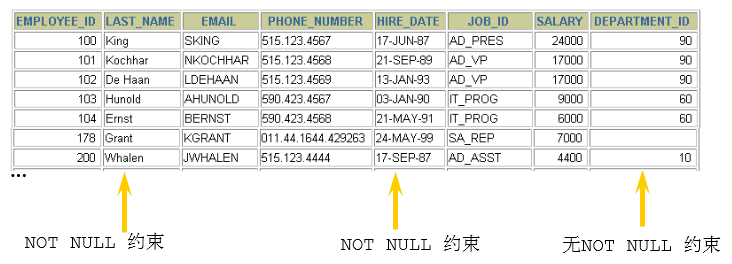
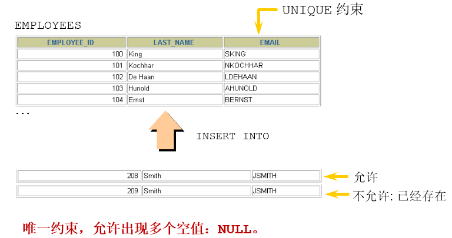
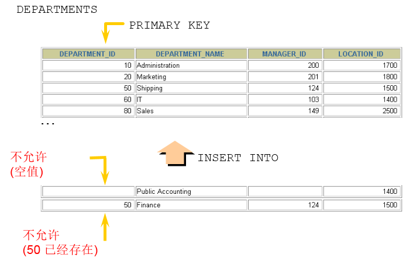

# 1. 约束(constraint)概述
> 在 MySQL 中，**约束（Constraints）** 是用来保证数据库中的数据完整性和一致性的规则。它们可以防止插入无效数据，提高数据库的可靠性。

## **1.1 为什么需要约束？**

为了确保数据库中的数据符合业务逻辑并保持高效管理，SQL 规范提供了 **约束（Constraints）** 来对表数据施加额外的条件限制。主要作用如下：

##### **1. 保证数据完整性**
- 防止插入错误数据，例如年龄字段不能为负数。
- 确保数据符合预期，避免因输入不合理的数据导致逻辑错误。

##### **2. 保证数据一致性**
- 确保数据符合业务规则，例如订单表中的 `user_id` 必须在用户表中存在。
- 避免数据因人为错误或并发操作而不匹配。

##### **3. 提高查询性能**
- 约束（如 `PRIMARY KEY`、`UNIQUE`）可以优化索引，提高查询和检索效率。
- 通过限制数据范围，可以减少数据扫描的开销。

##### **4. 避免异常数据**
- 防止重复数据（如 `UNIQUE` 约束）。
- 限制 `NULL` 值的存在（如 `NOT NULL` 约束）。
- 避免无效的外键引用，保持表间关系的正确性。

### **从完整性角度看约束**
为了保证数据完整性，SQL 规范从以下四个方面定义了 **完整性约束**：

| **完整性类型** | **定义** | **示例** |
|---------------|---------|---------|
| **实体完整性（Entity Integrity）** | 确保表中的每条记录都是唯一且可区分的 | **主键约束**（`PRIMARY KEY`），防止出现重复的记录 |
| **域完整性（Domain Integrity）** | 限制列的数据范围，保证数据合法性 | **检查约束**（`CHECK`），例如 `age BETWEEN 0 AND 120`，性别只能是“男/女” |
| **引用完整性（Referential Integrity）** | 确保表之间的关系一致性 | **外键约束**（`FOREIGN KEY`），例如订单的 `user_id` 必须在用户表中存在 |
| **用户自定义完整性（User-defined Integrity）** | 根据业务逻辑定义特殊的约束 | **唯一性约束（`UNIQUE`）**，例如用户名唯一；或自定义规则，例如部门经理的工资不得高于本部门员工平均工资的 5 倍 |

这些完整性约束帮助数据库维持数据的正确性和一致性，避免数据异常，提高数据管理的可靠性。

## **1.2 什么是约束？**
约束是数据库在创建表时，针对某些字段施加的规则，以限制数据的输入和修改，使数据符合预期要求。

## 1.3 约束的分类
在 MySQL 中，约束用于限制表中的数据，以确保数据完整性和一致性。约束可以根据不同的分类方式进行划分。

### **1. 根据约束数据列的限制**
- **单列约束**：每个约束仅作用于一列，例如 `NOT NULL`、`UNIQUE`。
- **多列约束**：约束可以作用于多个列，例如**复合主键**（`PRIMARY KEY (col1, col2)`）。

### **2. 根据约束的作用范围**
在 MySQL 中，约束（Constraints）可以根据 **作用范围** 分为：
1. **列级约束（Column-Level Constraint）**：作用于单个列，在定义列时直接添加约束。
2. **表级约束（Table-Level Constraint）**：作用于一个或多个列，例如**复合主键**（`PRIMARY KEY (col1, col2)`），通常在 `CREATE TABLE` 语句的 **最后** 统一定义。

| **位置** | **支持的约束类型** | **是否可以起约束名** |
|----------|-----------------|-----------------|
| **列级约束** | 适用于 `NOT NULL`、`UNIQUE`、`PRIMARY KEY`、`CHECK`（外键无效） | 不可以 |
| **表级约束** | 适用于 `UNIQUE`、`PRIMARY KEY`、`FOREIGN KEY`（`DEFAULT`、`NOT NULL` 无效） | 可以（主键无效） |

#### **1. 列级约束（Column-Level Constraint）**
**作用范围：** 仅影响**单个**列。  
**定义方式：** 直接跟在列名和数据类型之后。

##### **列级约束的特点**
- 只能约束 **定义它的那一列**，不能作用于多个列。
- 适用于：
  - `NOT NULL`
  - `UNIQUE`
  - `PRIMARY KEY`
  - `DEFAULT`
  - `CHECK`（MySQL 8.0.16+）
- **不支持** 外键（`FOREIGN KEY`）。

##### **示例**
```sql
CREATE TABLE users (
    id INT PRIMARY KEY AUTO_INCREMENT,   -- 主键列（列级约束）
    username VARCHAR(50) UNIQUE NOT NULL, -- 唯一+非空（列级约束）
    email VARCHAR(100) UNIQUE,  -- 唯一约束
    age INT CHECK (age > 0),    -- 检查约束（MySQL 8.0.16+）
    country VARCHAR(50) DEFAULT 'Unknown' -- 默认值约束
);
```
这里：
- `id PRIMARY KEY AUTO_INCREMENT` 是 **列级约束**，因为它直接在 `id` 列后面定义。
- `username UNIQUE NOT NULL` 也是 **列级约束**，作用于 `username` 列。

#### **2. 表级约束（Table-Level Constraint）**
**作用范围：** 作用于**一个或多个列**，通常用于 **联合约束**（如复合主键、外键）。  
**定义方式：** 在 `CREATE TABLE` 的 **最后** 统一定义。

##### **表级约束的特点**
- 适用于：
  - `PRIMARY KEY`
  - `UNIQUE`
  - `FOREIGN KEY`
  - `CHECK`（MySQL 8.0.16+）
- 适用于 **多个列** 的约束（如复合主键）。
- **不能用于 `NOT NULL` 和 `DEFAULT`**，这些必须是列级约束。

##### **示例**
```sql
CREATE TABLE orders (
    order_id INT,
    user_id INT,
    product_id INT,
    PRIMARY KEY (order_id, user_id),  -- 复合主键（表级约束）
    UNIQUE (product_id),              -- 唯一约束（表级）
    FOREIGN KEY (user_id) REFERENCES users(id) ON DELETE CASCADE -- 外键约束（表级）
);
```
这里：
- `PRIMARY KEY (order_id, user_id)` 作用于 **多个列**，只能作为 **表级约束**。
- `UNIQUE (product_id)` 也是 **表级约束**，可以单独放在表结构的最后。
- `FOREIGN KEY (user_id) REFERENCES users(id)` 作为 **外键**，**必须**是表级约束。

#### **3. 列级约束 vs 表级约束**
| **对比项** | **列级约束（Column-Level）** | **表级约束（Table-Level）** |
|------------|-----------------|-----------------|
| **定义位置** | 紧跟在列定义后 | `CREATE TABLE` 语句的 **最后** |
| **作用范围** | 仅作用于该列 | 可作用于**单列或多列** |
| **适用约束** | `NOT NULL`、`UNIQUE`、`PRIMARY KEY`、`CHECK`、`DEFAULT` | `PRIMARY KEY`、`UNIQUE`、`FOREIGN KEY`、`CHECK` |
| **是否支持多列** | ❌ 不支持 | ✅ 支持（如复合主键） |
| **外键是否可用** | ❌ 不能用于外键 | ✅ 适用于外键 |
| **适用场景** | 单个字段的限制，如 `NOT NULL`、`DEFAULT` | 适用于多个字段的约束，如 **复合主键、外键** |

#### **4. 结合列级和表级约束的示例**
```sql
CREATE TABLE employees (
    emp_id INT NOT NULL,               -- 非空（列级约束）
    name VARCHAR(100) NOT NULL,         -- 非空（列级约束）
    department_id INT,
    salary DECIMAL(10,2) CHECK (salary > 0),  -- 检查约束（列级）
    PRIMARY KEY (emp_id),               -- 主键（表级约束）
    FOREIGN KEY (department_id) REFERENCES departments(id)  -- 外键（表级约束）
);
```
在这个例子中：
- `NOT NULL` 和 `CHECK` 约束是 **列级约束**，只能应用于单列。
- `PRIMARY KEY (emp_id)` 和 `FOREIGN KEY (department_id)` 是 **表级约束**，因为 `FOREIGN KEY` 只能作为 **表级约束**，而 `PRIMARY KEY` 也可以放在表级以增强可读性。

#### **5. 什么时候用列级约束 vs. 表级约束？**
✅ **使用列级约束的情况**
- **单列必须满足某些规则**，如 `NOT NULL`、`DEFAULT`、`CHECK`。
- **单列作为主键或唯一键** 时，`PRIMARY KEY` 或 `UNIQUE` 可在列级定义。

✅ **使用表级约束的情况**
- **复合主键**（主键包含多个列）。
- **外键约束**（必须是表级）。
- **多个列需要满足唯一性**（如 `UNIQUE (col1, col2)`）。

#### **总结**
| **分类** | **列级约束** | **表级约束** |
|----------|------------|------------|
| **作用范围** | 单列 | 一个或多个列 |
| **定义位置** | 直接在列定义后 | `CREATE TABLE` 语句的最后 |
| **支持的约束** | `NOT NULL`、`DEFAULT`、`UNIQUE`、`PRIMARY KEY`（单列） | `PRIMARY KEY`（多列）、`UNIQUE`（多列）、`FOREIGN KEY` |
| **适用场景** | **单个字段** 的限制，如 `NOT NULL`、`DEFAULT` | **多个字段** 相关的约束，如 **复合主键、外键** |

---

### **3. 根据约束的作用**
MySQL 约束的主要类型如下：

| **约束类型** | **关键字** | **作用** |
|-------------|-----------|---------|
| **非空约束** | `NOT NULL` | 限制列不能存储 `NULL` 值，确保字段必须有值。 |
| **唯一约束** | `UNIQUE` | 限制列的值不能重复，可用于保证数据唯一性。 |
| **主键约束** | `PRIMARY KEY` | 结合 `NOT NULL` 和 `UNIQUE`，唯一标识表中的每一行数据。 |
| **外键约束** | `FOREIGN KEY` | 维护表与表之间的关系，确保子表中的值必须在父表存在（参照完整性）。 |
| **默认值约束** | `DEFAULT` | 为列设置默认值，若插入数据时未指定该列的值，则使用默认值。 |
| **检查约束**（MySQL 8.0.16+） | `CHECK` | 限制列值必须满足某个表达式条件，例如 `age > 0`。（但在 MySQL 中无效） |
| **自动递增约束** | `AUTO_INCREMENT` | 让数值型列的值自动递增，通常用于主键。 |

> **注意**：MySQL **不支持** `CHECK` 约束，即使定义了 `CHECK` 语句，也不会生效。

### **4. 查看某个表已有的约束**
可以通过 `information_schema.table_constraints` 来查询表的约束：
```sql
SELECT * FROM information_schema.table_constraints 
WHERE table_name = '表名称';
```

### **5. 约束示例**
#### **创建 `users` 表，包含多个约束**
```sql
CREATE TABLE users (
    id INT PRIMARY KEY AUTO_INCREMENT,  -- 主键 + 自动递增
    username VARCHAR(50) UNIQUE NOT NULL, -- 唯一约束 + 非空约束
    email VARCHAR(100) UNIQUE,  -- 唯一约束
    age INT CHECK (age > 0),    -- 检查约束（MySQL 8.0.16+ 才支持，但无效）
    country VARCHAR(50) DEFAULT 'Unknown' -- 默认值约束
);
```

#### **创建 `orders` 表，包含外键约束**
```sql
CREATE TABLE orders (
    order_id INT PRIMARY KEY AUTO_INCREMENT,
    user_id INT,
    FOREIGN KEY (user_id) REFERENCES users(id) ON DELETE CASCADE -- 外键约束
);
```
- `ON DELETE CASCADE`：当 `users` 表中的某个 `id` 被删除时，`orders` 表中所有相关的 `user_id` 也会自动删除。

### **总结**
MySQL 约束可以根据 **作用列数**（单列、多列）、**作用范围**（列级、表级）和 **功能** 进行分类。合理使用 `NOT NULL`、`UNIQUE`、`PRIMARY KEY`、`FOREIGN KEY`、`DEFAULT`、`AUTO_INCREMENT` 等约束，可以提升数据库的完整性和效率。

---

# 2. 非空约束

## 2.1 作用

限定某个字段/某列的值不允许为空



## 2.2 关键字

NOT NULL

## 2.3 特点

- 默认，所有的类型的值都可以是 NULL，包括 INT、FLOAT 等数据类型
- 非空约束只能出现在表对象的列上，只能某个列单独限定非空，不能组合非空
- 一个表可以有很多列都分别限定了非空
- 空字符串 `''` 不等于 NULL，0 也不等于 NULL

## 2.4 添加非空约束

（1）建表时

```sql
CREATE TABLE 表名称(
	字段名  数据类型,
    字段名  数据类型 NOT NULL,  
    字段名  数据类型 NOT NULL
);
```

举例：

```sql
CREATE TABLE emp(
    id INT(10) NOT NULL,
    NAME VARCHAR(20) NOT NULL,
    sex CHAR NULL
);
```

```sql
CREATE TABLE student(
	sid int,
    sname varchar(20) not null,
    tel char(11) ,
    cardid char(18) not null
);
```

```sql
INSERT INTO student VALUES(1,'张三','13710011002','110222198912032545'); #成功

INSERT INTO student VALUES(2,'李四','13710011002',null);#身份证号为空
ERROR 1048 (23000): Column 'cardid' cannot be null

INSERT INTO student VALUES(2,'李四',null,'110222198912032546');#成功，tel允许为空

INSERT INTO student VALUES(3,null,null,'110222198912032547');#失败
ERROR 1048 (23000): Column 'sname' cannot be null
```

（2）建表后

```sql
alter table 表名称 modify 字段名 数据类型 not null;
```

举例：

```sql
ALTER TABLE emp
MODIFY sex VARCHAR(30) NOT NULL;
```

```sql
ALTER TABLE student MODIFY sname VARCHAR(20) NOT NULL;
```

## 2.5 删除非空约束

```sql
alter table 表名称 modify 字段名 数据类型 NULL; #去掉not null，相当于修改某个非注解字段，该字段允许为空

或 

alter table 表名称 modify 字段名 数据类型; #去掉not null，相当于修改某个非注解字段，该字段允许为空
```

举例：

```sql
ALTER TABLE emp
MODIFY sex VARCHAR(30) NULL;
```

```sql
ALTER TABLE emp
MODIFY NAME VARCHAR(15) DEFAULT 'abc' NULL;
```

# 3. 唯一性约束

## 3.1 作用

用来限制某个字段/某列的值不能重复。

 

## 3.2 关键字

UNIQUE

## 3.3 特点

- 同一个表可以有多个唯一约束。
- 唯一约束可以是某一个列的值唯一，也可以多个列组合的值唯一。
- 唯一性约束允许列值为空。
- 在创建唯一约束的时候，如果不给唯一约束命名，就默认和列名相同。
- **MySQL会给唯一约束的列上默认创建一个唯一索引。**

## 3.4 添加唯一约束

（1）建表时

```sql
create table 表名称(
	字段名  数据类型,
    字段名  数据类型  unique,  
    字段名  数据类型  unique key,
    字段名  数据类型
);
create table 表名称(
	字段名  数据类型,
    字段名  数据类型,  
    字段名  数据类型,
    [constraint 约束名] unique key(字段名)
);
```

举例：

```sql
create table student(
	sid int,
    sname varchar(20),
    tel char(11) unique,
    cardid char(18) unique key
);
```

```sql
CREATE TABLE t_course(
	cid INT UNIQUE,
	cname VARCHAR(100) UNIQUE,
	description VARCHAR(200)
);
```

```sql
CREATE TABLE USER(
    id INT NOT NULL,
    NAME VARCHAR(25),
    PASSWORD VARCHAR(16),
    -- 使用表级约束语法
    CONSTRAINT uk_name_pwd UNIQUE(NAME,PASSWORD)
);
```

> 表示用户名和密码组合不能重复

```sql
insert into student values(1,'张三','13710011002','101223199012015623');
insert into student values(2,'李四','13710011003','101223199012015624');
```

```sql
mysql> select * from student;
+-----+-------+-------------+--------------------+
| sid | sname | tel         | cardid             |
+-----+-------+-------------+--------------------+
|   1 | 张三  | 13710011002 | 101223199012015623 |
|   2 | 李四  | 13710011003 | 101223199012015624 |
+-----+-------+-------------+--------------------+
2 rows in set (0.00 sec)
```

```sql
insert into student values(3,'王五','13710011004','101223199012015624'); #身份证号重复
ERROR 1062 (23000): Duplicate entry '101223199012015624' for key 'cardid'

insert into student values(3,'王五','13710011003','101223199012015625'); 
ERROR 1062 (23000): Duplicate entry '13710011003' for key 'tel'
```

（2）建表后指定唯一键约束

```sql
#字段列表中如果是一个字段，表示该列的值唯一。如果是两个或更多个字段，那么复合唯一，即多个字段的组合是唯一的
#方式1：
alter table 表名称 add unique key(字段列表); 
```

```sql
#方式2：
alter table 表名称 modify 字段名 字段类型 unique;
```

举例：

```sql
ALTER TABLE USER 
ADD UNIQUE(NAME,PASSWORD);
```

```sql
ALTER TABLE USER 
ADD CONSTRAINT uk_name_pwd UNIQUE(NAME,PASSWORD);
```

```sql
ALTER TABLE USER 
MODIFY NAME VARCHAR(20) UNIQUE;
```

举例：

```sql
create table student(
	sid int primary key,
    sname varchar(20),
    tel char(11) ,
    cardid char(18) 
);
```

```sql
alter table student add unique key(tel);
alter table student add unique key(cardid);
```

## 3.5 关于复合唯一约束

```sql
create table 表名称(
	字段名  数据类型,
    字段名  数据类型,  
    字段名  数据类型,
    unique key(字段列表) #字段列表中写的是多个字段名，多个字段名用逗号分隔，表示那么是复合唯一，即多个字段的组合是唯一的
);
```

```sql
#学生表
create table student(
	sid int,	#学号
    sname varchar(20),			#姓名
    tel char(11) unique key,  #电话
    cardid char(18) unique key #身份证号
);

#课程表
create table course(
	cid int,  #课程编号
    cname varchar(20)     #课程名称
);

#选课表
create table student_course(
    id int,
	sid int,
    cid int,
    score int,
    unique key(sid,cid)  #复合唯一
);
```

```sql
insert into student values(1,'张三','13710011002','101223199012015623');#成功
insert into student values(2,'李四','13710011003','101223199012015624');#成功
insert into course values(1001,'Java'),(1002,'MySQL');#成功
```

```sql
mysql> select * from student;
+-----+-------+-------------+--------------------+
| sid | sname | tel         | cardid             |
+-----+-------+-------------+--------------------+
|   1 | 张三  | 13710011002 | 101223199012015623 |
|   2 | 李四  | 13710011003 | 101223199012015624 |
+-----+-------+-------------+--------------------+
2 rows in set (0.00 sec)

mysql> select * from course;
+------+-------+
| cid  | cname |
+------+-------+
| 1001 | Java  |
| 1002 | MySQL |
+------+-------+
2 rows in set (0.00 sec)
```

```sql
insert into student_course values
(1, 1, 1001, 89),
(2, 1, 1002, 90),
(3, 2, 1001, 88),
(4, 2, 1002, 56);#成功
```

```sql
mysql> select * from student_course;
+----+------+------+-------+
| id | sid  | cid  | score |
+----+------+------+-------+
|  1 |    1 | 1001 |    89 |
|  2 |    1 | 1002 |    90 |
|  3 |    2 | 1001 |    88 |
|  4 |    2 | 1002 |    56 |
+----+------+------+-------+
4 rows in set (0.00 sec)
```

```sql
insert into student_course values (5, 1, 1001, 88);#失败

#ERROR 1062 (23000): Duplicate entry '1-1001' for key 'sid'   违反sid-cid的复合唯一
```

## 3.5 删除唯一约束

- 添加唯一性约束的列上也会自动创建唯一索引。
- 删除唯一约束只能通过删除唯一索引的方式删除。
- 删除时需要指定唯一索引名，唯一索引名就和唯一约束名一样。
- 如果创建唯一约束时未指定名称，如果是单列，就默认和列名相同；如果是组合列，那么默认和()中排在第一个的列名相同。也可以自定义唯一性约束名。

```sql
SELECT * FROM information_schema.table_constraints WHERE table_name = '表名'; #查看都有哪些约束
```

```sql
ALTER TABLE USER 
DROP INDEX uk_name_pwd;
```

> 注意：可以通过 `show index from 表名称; `查看表的索引

# 4. PRIMARY KEY 约束

## 4.1 作用

用来唯一标识表中的一行记录。

## 4.2 关键字

primary key

## 4.3 特点

- 主键约束相当于**唯一约束+非空约束的组合**，主键约束列不允许重复，也不允许出现空值。

    

- 一个表最多只能有一个主键约束，建立主键约束可以在列级别创建，也可以在表级别上创建。


- 主键约束对应着表中的一列或者多列（复合主键）
- 如果是多列组合的复合主键约束，那么这些列都不允许为空值，并且组合的值不允许重复。
- **MySQL的主键名总是PRIMARY**，就算自己命名了主键约束名也没用。

- 当创建主键约束时，系统默认会在所在的列或列组合上建立对应的**主键索引**（能够根据主键查询的，就根据主键查询，效率更高）。如果删除主键约束了，主键约束对应的索引就自动删除了。


- 需要注意的一点是，不要修改主键字段的值。因为主键是数据记录的唯一标识，如果修改了主键的值，就有可能会破坏数据的完整性。

## 4.4 添加主键约束

### (1) 建表时指定主键约束

```sql
create table 表名称(
	字段名  数据类型  primary key, #列级模式
    字段名  数据类型,  
    字段名  数据类型  
);
create table 表名称(
	字段名  数据类型,
    字段名  数据类型,  
    字段名  数据类型,
    [constraint 约束名] primary key(字段名) #表级模式
);
```

##### 举例：

```sql
create table temp(
	id int primary key,
    name varchar(20)
);
```

```sql
mysql> desc temp;
+-------+-------------+------+-----+---------+-------+
| Field | Type        | Null | Key | Default | Extra |
+-------+-------------+------+-----+---------+-------+
| id    | int(11)     | NO   | PRI | NULL    |       |
| name  | varchar(20) | YES  |     | NULL    |       |
+-------+-------------+------+-----+---------+-------+
2 rows in set (0.00 sec)
```

```sql
insert into temp values(1,'张三');#成功
insert into temp values(2,'李四');#成功
```

```sql
mysql> select * from temp;
+----+------+
| id | name |
+----+------+
|  1 | 张三 |
|  2 | 李四 |
+----+------+
2 rows in set (0.00 sec)
```

```sql
insert into temp values(1,'张三');#失败
ERROR 1062 (23000): Duplicate（重复） entry（键入，输入） '1' for key 'PRIMARY'


insert into temp values(1,'王五');#失败
ERROR 1062 (23000): Duplicate entry '1' for key 'PRIMARY'

insert into temp values(3,'张三');#成功
```

```sql
mysql> select * from temp;
+----+------+
| id | name |
+----+------+
|  1 | 张三 |
|  2 | 李四 |
|  3 | 张三 |
+----+------+
3 rows in set (0.00 sec)
```

```sql
insert into temp values(4,null);#成功


insert into temp values(null,'李琦');#失败
ERROR 1048 (23000): Column 'id' cannot be null
```

```sql
mysql> select * from temp;
+----+------+
| id | name |
+----+------+
|  1 | 张三 |
|  2 | 李四 |
|  3 | 张三 |
|  4 | NULL |
+----+------+
4 rows in set (0.00 sec)
```

```sql
#演示一个表建立两个主键约束
create table temp(
	id int primary key,
    name varchar(20) primary key
);
ERROR 1068 (42000): Multiple（多重的） primary key defined（定义）
```

##### 再举例：

- 列级约束

```sql
CREATE TABLE emp4(
    id INT PRIMARY KEY AUTO_INCREMENT ,
    NAME VARCHAR(20)
);
```

- 表级约束

```sql
CREATE TABLE emp5(
    id INT NOT NULL AUTO_INCREMENT,
    NAME VARCHAR(20),
    pwd VARCHAR(15),
    CONSTRAINT emp5_id_pk PRIMARY KEY(id)
);
```

### (2) 建表后增加主键约束

```sql
ALTER TABLE 表名称 ADD PRIMARY KEY(字段列表); #字段列表可以是一个字段，也可以是多个字段，如果是多个字段的话，是复合主键
```

```sql
ALTER TABLE student ADD PRIMARY KEY (sid);
```

```sql
ALTER TABLE emp5 ADD PRIMARY KEY(NAME,pwd);
```

## 4.5 关于复合主键

```sql
create table 表名称(
	字段名  数据类型,
    字段名  数据类型,  
    字段名  数据类型,
    primary key(字段名1,字段名2)  #表示字段1和字段2的组合是唯一的，也可以有更多个字段
);
```

```sql
#学生表
create table student(
	sid int primary key,  #学号
    sname varchar(20)     #学生姓名
);

#课程表
create table course(
	cid int primary key,  #课程编号
    cname varchar(20)     #课程名称
);

#选课表
create table student_course(
	sid int,
    cid int,
    score int,
    primary key(sid,cid)  #复合主键
);
```

```sql
insert into student values(1,'张三'),(2,'李四');
insert into course values(1001,'Java'),(1002,'MySQL');
```

```sql
mysql> select * from student;
+-----+-------+
| sid | sname |
+-----+-------+
|   1 | 张三  |
|   2 | 李四  |
+-----+-------+
2 rows in set (0.00 sec)

mysql> select * from course;
+------+-------+
| cid  | cname |
+------+-------+
| 1001 | Java  |
| 1002 | MySQL |
+------+-------+
2 rows in set (0.00 sec)
```

```sql
insert into student_course values(1, 1001, 89),(1,1002,90),(2,1001,88),(2,1002,56);
```

```sql
mysql> select * from student_course;
+-----+------+-------+
| sid | cid  | score |
+-----+------+-------+
|   1 | 1001 |    89 |
|   1 | 1002 |    90 |
|   2 | 1001 |    88 |
|   2 | 1002 |    56 |
+-----+------+-------+
4 rows in set (0.00 sec)
```

```sql
insert into student_course values(1, 1001, 100);
ERROR 1062 (23000): Duplicate entry '1-1001' for key 'PRIMARY'
```

```sql
mysql> desc student_course;
+-------+---------+------+-----+---------+-------+
| Field | Type    | Null | Key | Default | Extra |
+-------+---------+------+-----+---------+-------+
| sid   | int(11) | NO   | PRI | NULL    |       |
| cid   | int(11) | NO   | PRI | NULL    |       |
| score | int(11) | YES  |     | NULL    |       |
+-------+---------+------+-----+---------+-------+
3 rows in set (0.00 sec)
```

- 再举例

```sql
CREATE TABLE emp6(
    id INT NOT NULL,
    NAME VARCHAR(20),
    pwd VARCHAR(15),
    CONSTRAINT emp7_pk PRIMARY KEY(NAME,pwd)
);
```

## 4.6 删除主键约束

```sql
alter table 表名称 drop primary key;
```

举例：

```sql
ALTER TABLE student DROP PRIMARY KEY;
```

```sql
ALTER TABLE emp5 DROP PRIMARY KEY;
```

> 说明：删除主键约束，不需要指定主键名，因为一个表只有一个主键，删除主键约束后，非空还存在。

# 5. 自增列：AUTO_INCREMENT

## 5.1 作用

某个字段的值自增

## 5.2 关键字

auto_increment

## 5.3 特点和要求

（1）一个表最多只能有一个自增长列

（2）当需要产生唯一标识符或顺序值时，可设置自增长

（3）自增长列约束的列必须是键列（主键列，唯一键列）

（4）自增约束的列的数据类型必须是整数类型

### 错误演示：

```sql
create table employee(
	eid int auto_increment,
    ename varchar(20)
);
# ERROR 1075 (42000): Incorrect table definition; there can be only one auto column and it must be defined as a key   
```
> 錯誤原因： 在 MySQL 中，AUTO_INCREMENT 屬性只能用於 **主鍵（PRIMARY KEY）或唯一鍵（UNIQUE KEY）** 的列。但是你的 eid 沒有設為 PRIMARY KEY 或 UNIQUE KEY，所以報錯。

```sql
create table employee(
	eid int primary key,
    ename varchar(20) unique key auto_increment
);
# ERROR 1063 (42000): Incorrect column specifier for column 'ename'  因为ename不是整数类型
```

> 錯誤原因：
> - AUTO_INCREMENT 只能用於 INT 或 BIGINT 等數值類型，但 ename 是 VARCHAR(20)，所以報錯。
> - AUTO_INCREMENT 不能用於非數值類型，即不能用在 VARCHAR 上。

### 如果自增列指定了 0 和 null，会在当前最大值的基础上自增；如果自增列手动指定了具体值，直接赋值为具体值。
1. **创建表**
   ```sql
   CREATE TABLE test1 (
       id INT PRIMARY KEY AUTO_INCREMENT
   );
   ```
   - `id` 列是 `AUTO_INCREMENT`，表示如果插入 `NULL` 或 `0`，MySQL 会自动分配递增的 ID。

2. **插入 4 行 `(0)`**
   ```sql
   INSERT INTO test1 VALUES (0), (0), (0), (0);
   ```
   - 每个 `(0)` 让 MySQL **自动分配** `AUTO_INCREMENT` 值。
   - 由于表是空的，`AUTO_INCREMENT` 计数器从 `1` 开始。

3. **MySQL 实际插入的过程**
   - 第一行 `(0)` → `id = 1`
   - 第二行 `(0)` → `id = 2`
   - 第三行 `(0)` → `id = 3`
   - 第四行 `(0)` → `id = 4`

4. **查询数据**
   ```sql
   SELECT * FROM test1;
   ```
   **结果**
   ```
   +----+
   | id |
   +----+
   |  1 |
   |  2 |
   |  3 |
   |  4 |
   +----+
   ```
   - 说明 `AUTO_INCREMENT` 正确地从 `1` 递增到 `4`。
 
> **🔹 MySQL `AUTO_INCREMENT` 的行为规则**
> 1. **插入 `NULL` 或 `0`，MySQL 自动分配自增值。**
> 2. **自增值基于 `AUTO_INCREMENT` 计数器，而不是 `MAX(id)`。**
> 3. **即使删除某些行，自增值不会回退（除非重启 MySQL 5.7 及之前的版本）。**
> 4. **MySQL 8.0 之后，自增值持久化，不受重启影响。**

## 5.4 如何指定自增约束

### (1) 建表时

```sql
create table 表名称(
	字段名  数据类型  primary key auto_increment,
    字段名  数据类型  unique key not null,  
    字段名  数据类型  unique key,
    字段名  数据类型  not null default 默认值, 
);
create table 表名称(
	字段名  数据类型 default 默认值 ,
    字段名  数据类型 unique key auto_increment,  
    字段名  数据类型 not null default 默认值,,
    primary key(字段名)
);
```

```sql
create table employee(
	eid int primary key auto_increment,
    ename varchar(20)
);
```

```sql
mysql> desc employee;
+-------+-------------+------+-----+---------+----------------+
| Field | Type        | Null | Key | Default | Extra          |
+-------+-------------+------+-----+---------+----------------+
| eid   | int(11)     | NO   | PRI | NULL    | auto_increment |
| ename | varchar(20) | YES  |     | NULL    |                |
+-------+-------------+------+-----+---------+----------------+
2 rows in set (0.00 sec)
```

### (2) 建表后

```sql
alter table 表名称 modify 字段名 数据类型 auto_increment;
```

例如：

```sql
create table employee(
	eid int primary key ,
    ename varchar(20)
);
```

```sql
alter table employee modify eid int auto_increment;
```

```sql
mysql> desc employee;
+-------+-------------+------+-----+---------+----------------+
| Field | Type        | Null | Key | Default | Extra          |
+-------+-------------+------+-----+---------+----------------+
| eid   | int(11)     | NO   | PRI | NULL    | auto_increment |
| ename | varchar(20) | YES  |     | NULL    |                |
+-------+-------------+------+-----+---------+----------------+
2 rows in set (0.00 sec)
```

## 5.5 如何删除自增约束

```sql
alter table 表名称 modify 字段名 数据类型 auto_increment; #给这个字段增加自增约束

alter table 表名称 modify 字段名 数据类型; #去掉auto_increment相当于删除
```

```sql
alter table employee modify eid int;
```

```sql
mysql> desc employee;
+-------+-------------+------+-----+---------+-------+
| Field | Type        | Null | Key | Default | Extra |
+-------+-------------+------+-----+---------+-------+
| eid   | int(11)     | NO   | PRI | NULL    |       |
| ename | varchar(20) | YES  |     | NULL    |       |
+-------+-------------+------+-----+---------+-------+
2 rows in set (0.00 sec)
```

## 5.5 插入數據
```sql
CREATE TABLE users (
    id INT AUTO_INCREMENT PRIMARY KEY,
    name VARCHAR(50) NOT NULL
);
```

- `id INT AUTO_INCREMENT PRIMARY KEY`：
  - `AUTO_INCREMENT` 讓 `id` 欄位的值自動增加
  - `PRIMARY KEY` 表示該欄位是主鍵，確保唯一性
- `name VARCHAR(50) NOT NULL`：儲存使用者名稱

即使 `INSERT` 時不提供 `id`，MySQL 也會自動生成：

```sql
INSERT INTO users (name) VALUES ('Alice');
INSERT INTO users (name) VALUES ('Bob');
INSERT INTO users (name) VALUES ('Charlie');
```

#### **查看數據**
```sql
SELECT * FROM users;
```
結果：
| id | name    |
|----|--------|
| 1  | Alice  |
| 2  | Bob    |
| 3  | Charlie |

## 5.6  手動設定 AUTO_INCREMENT 起始值
你可以修改 `AUTO_INCREMENT` 起始值：
```sql
ALTER TABLE users AUTO_INCREMENT = 100;
```
之後插入的數據 `id` 會從 `100` 開始：
```sql
INSERT INTO users (name) VALUES ('David');
```
結果：
| id  | name   |
|-----|-------|
| 1   | Alice |
| 2   | Bob   |
| 3   | Charlie |
| 100 | David |

## 5.7 刪除資料後的影響
假設我們刪除了 `id = 3` 的 `Charlie`：
```sql
DELETE FROM users WHERE id = 3;
```
然後插入新的數據：
```sql
INSERT INTO users (name) VALUES ('Eve');
```
結果：
| id  | name   |
|-----|-------|
| 1   | Alice |
| 2   | Bob   |
| 100 | David |
| 101 | Eve   |

❌ **注意**：
刪除 `id=3` 不會導致新的 `id` 再次使用 `3`，而是繼續遞增。

## 5.8 重置 AUTO_INCREMENT
如果你想讓 `AUTO_INCREMENT` 從 1 開始（假設表是空的），可以使用：
```sql
TRUNCATE TABLE users;
```
這會刪除所有數據並將 `AUTO_INCREMENT` 重設為 `1`。

或者，手動設定 `AUTO_INCREMENT`：
```sql
ALTER TABLE users AUTO_INCREMENT = 1;
```
> **⚠️ 注意**：如果表內仍有數據，設置的 `AUTO_INCREMENT` 值必須大於現有最大 `id` 值，否則會發生主鍵重複錯誤。

## 5.9 MySQL 8.0新特性—自增变量的持久化

在 **MySQL 5.7 及之前的版本**，`AUTO_INCREMENT` 自增主键的值仅存储在 **内存** 中，不会被持久化到磁盘。  
如果数据库重启，自增计数器会被重置，通常会设置为 `MAX(id) + 1`。这种行为可能会导致主键重复或数据插入异常。

而 **MySQL 8.0** 之后，**自增计数器的值被存储在重做日志（redo log）中**，即使数据库重启后，`AUTO_INCREMENT` 也能保持之前的状态，不会回退到 `MAX(id) + 1`，确保了数据一致性。

### 🔍 **MySQL 5.7 vs 8.0 示例**

#### **在 MySQL 5.7 中**
我们执行以下步骤：
```sql
CREATE TABLE test1 (
    id INT PRIMARY KEY AUTO_INCREMENT
);
```

插入 4 行数据：
```sql
INSERT INTO test1 VALUES (0), (0), (0), (0);
```
查询：
```sql
SELECT * FROM test1;
```
得到：
```
+----+
| id |
+----+
|  1 |
|  2 |
|  3 |
|  4 |
+----+
```

删除 `id=4`：
```sql
DELETE FROM test1 WHERE id = 4;
```

再次插入一行：
```sql
INSERT INTO test1 VALUES (0);
```
查询：
```
+----+
| id |
+----+
|  1 |
|  2 |
|  3 |
|  5 |
+----+
```
这里 MySQL **不会重用 4，而是继续自增到 5**。

接着，我们删除 `id=5`：
```sql
DELETE FROM test1 WHERE id = 5;
```

然后 **重启 MySQL 服务器**，再插入：
```sql
INSERT INTO test1 VALUES (0);
```

**在 MySQL 5.7 中，查询结果是：**
```
+----+
| id |
+----+
|  1 |
|  2 |
|  3 |
|  4 |  -- ⚠️ 回到了 4
+----+
```
**重启后，`AUTO_INCREMENT` 计数器被重置为 `MAX(id) + 1 = 4`，而不是 6**。  
**原因：MySQL 5.7 只在内存中维护计数器，重启后计数器丢失。**

#### **在 MySQL 8.0 中**
如果执行相同的操作（删除 `id=5` 并重启后再插入）：

**查询结果：**
```
+----+
| id |
+----+
|  1 |
|  2 |
|  3 |
|  6 |  -- ✅ 仍然按照正确的自增顺序继续
+----+
```
**MySQL 8.0 的行为不同：**
- **`AUTO_INCREMENT` 的值被持久化**（记录在 redo log 中）。
- 即使重启，也不会丢失当前的计数，而是继续 `6`，不会回退到 `4`。

### 🎯 **MySQL 8.0 如何做到持久化？**
1. **在 MySQL 8.0 中，每次 `AUTO_INCREMENT` 值变化时，都会被写入重做日志（redo log）。**
2. **当 MySQL 服务器重启时，InnoDB 从 redo log 读取并恢复 `AUTO_INCREMENT` 计数器，而不是仅从 `MAX(id) + 1` 计算。**

这样就避免了：
- **主键 ID 发生回退**（导致重复插入问题）。
- **业务逻辑异常**（某些系统依赖递增 ID，回退会导致冲突）。

### ✅ **总结**
| 版本 | `AUTO_INCREMENT` 计数器存储方式 | 服务器重启后行为 |
|------|--------------------------------|----------------|
| MySQL 5.7 及之前 | 仅存储在内存 | 重新计算 `MAX(id) + 1`，可能导致 ID 回退 |
| MySQL 8.0 | 记录在 redo log | 读取 redo log，继续递增，不会回退 |

**💡 结论：MySQL 8.0 避免了 ID 值的回退问题，使自增变量更可靠，防止潜在的主键冲突问题！** 🚀

---

# 6. FOREIGN KEY 约束

## 6.1 作用

限定某个表的某个字段的引用完整性。

比如：员工表的员工所在部门的选择，必须在部门表能找到对应的部分。


## 6.2 关键字

FOREIGN KEY

## 6.3 主表和从表/父表和子表

主表（父表）：被引用的表，被参考的表

从表（子表）：引用别人的表，参考别人的表

例如：员工表的员工所在部门这个字段的值要参考部门表：部门表是主表，员工表是从表。

例如：学生表、课程表、选课表：选课表的学生和课程要分别参考学生表和课程表，学生表和课程表是主表，选课表是从表。

## 6.4 特点

- (1) 从表的外键列，必须引用/参考主表的主键或唯一约束的列
    - 为什么？因为被依赖/被参考的值必须是唯一的

- (2) 在创建外键约束时，如果不给外键约束命名，**默认名不是列名，而是自动产生一个外键名**（例如 student_ibfk_1;），也可以指定外键约束名。

- (3) 创建(CREATE)表时就指定外键约束的话，先创建主表，再创建从表

- (4) 删表时，先删从表（或先删除外键约束），再删除主表

- (5) 当主表的记录被从表参照时，主表的记录将不允许删除，如果要删除数据，需要先删除从表中依赖该记录的数据，然后才可以删除主表的数据

- (6) 在`从表`中指定外键约束，并且一个表可以建立多个外键约束

- (7) 从表的外键列与主表被参照的列名字可以不相同，但是数据类型必须一样，逻辑意义一致。
    - 如果类型不一样，创建子表时，就会出现错误 `ERROR 1005 (HY000): Can't create table'database.tablename'(errno: 150)`。
    - 例如：都是表示部门编号，都是int类型。

- (8) **当创建外键约束时，系统默认会在所在的列上建立对应的普通索引**。但是索引名是外键的约束名。（根据外键查询效率很高）

- (9) 删除外键约束后，必须`手动`删除对应的索引

## 6.5 添加外键约束

### (1) 建表时

```sql
create table 主表名称(
	字段1  数据类型  primary key,
    字段2  数据类型
);

CREATE TABLE 从表名称 (
    列名 数据类型 [约束],
    ...
    FOREIGN KEY (从表的字段) REFERENCES 主表名(被引用字段) [ON UPDATE 行为] [ON DELETE 行为]
);

# 或者，通過 `CONSTRAINT` 方式明確命名外鍵：

```sql
CREATE TABLE 从表名称 (
    列名 数据类型 [约束],
    ...
    CONSTRAINT 外键约束名 FOREIGN KEY (从表的字段) REFERENCES 主表名(被引用字段) [ON UPDATE 行为] [ON DELETE 行为]
);

#(从表的某个字段)的数据类型必须与主表名(被参考字段)的数据类型一致，逻辑意义也一样
#(从表的某个字段)的字段名可以与主表名(被参考字段)的字段名一样，也可以不一样

# FOREIGN KEY: 在表级指定子表中的列
# REFERENCES: 标示在父表中的列
```

#### **ON UPDATE / ON DELETE 參數選擇**
這兩個參數可以設定以下行為：

| 選項             | 說明 |
|-----------------|--------------------------------------------------|
| `CASCADE`       | **主表更新/刪除時，從表對應數據也自動更新/刪除** |
| `SET NULL`      | **主表更新/刪除時，從表對應字段設為 NULL**（從表的該列必須允許 NULL） |
| `SET DEFAULT`   | **主表更新/刪除時，從表對應字段設為預設值**（但 MySQL 通常不支持） |
| `RESTRICT`      | **如果從表有關聯記錄，則拒絕主表的更新/刪除操作** |
| `NO ACTION`     | **與 `RESTRICT` 相似，在 InnoDB 行為相同** |

#### **範例**
假設我們有一個 **`users`** 表，作為 **主表**，`orders` 表作為 **從表**，`orders` 表的 `user_id` 是 `users` 表 `id` 的外鍵。

```sql
# 主表
CREATE TABLE users (
    id INT PRIMARY KEY AUTO_INCREMENT,
    name VARCHAR(50) NOT NULL
);
```

然後，在創建 `orders` 表時，**同時定義外鍵約束**：
```sql
# 從表 
CREATE TABLE orders (
    id INT PRIMARY KEY AUTO_INCREMENT,
    user_id INT,
    order_date DATE NOT NULL,
    CONSTRAINT fk_user_order FOREIGN KEY (user_id) REFERENCES users(id) 
    ON DELETE SET NULL 
    ON UPDATE CASCADE
);
```

> 说明：
> 1. 主表users必须先创建成功，然后才能创建orders表，指定外键成功。
> 2. 删除表时，先删除从表orders，再删除主表users

#### **測試外鍵效果**

**插入測試數據**

```sql
INSERT INTO users (name) VALUES ('Alice');  -- id = 1
INSERT INTO users (name) VALUES ('Bob');    -- id = 2

INSERT INTO orders (user_id, order_date) VALUES (1, '2024-03-08');
INSERT INTO orders (user_id, order_date) VALUES (2, '2024-03-08');

SELECT * FROM users;
SELECT * FROM orders;
```

#### **測試 `ON DELETE SET NULL`**
刪除 `users` 表中的 `id=1`：
```sql
DELETE FROM users WHERE id = 1;
```
- `orders` 表中 `user_id = 1` 的記錄不會被刪除，但 `user_id` 變為 `NULL`。

#### **測試 `ON UPDATE CASCADE`**
更新 `users` 表中的 `id=2` 變成 `id=10`：
```sql
UPDATE users SET id = 10 WHERE id = 2;
```
- `orders` 表中 `user_id = 2` 的記錄也會變成 `user_id = 10`。

### (2) 建表后

一般情况下，表与表的关联都是提前设计好了的，因此，会在创建表的时候就把外键约束定义好。不过，如果需要修改表的设计（比如添加新的字段，增加新的关联关系），但没有预先定义外键约束，那么，就要用修改表的方式来补充定义。

格式：

```sql
ALTER TABLE 從表名 
ADD [CONSTRAINT 约束名] 
FOREIGN KEY (從表的字段) 
REFERENCES 主表名(被引用字段) 
[ON UPDATE 行為] 
[ON DELETE 行為];
```

#### 語法解析：
1. `ALTER TABLE 从表名`：修改指定的表（即“從表”）。
2. `ADD CONSTRAINT 约束名`：添加外鍵約束（可選，若不指定，系統會自動生成）。
3. `FOREIGN KEY (从表的字段)`：指定“從表”中作為外鍵的字段。
4. `REFERENCES 主表名(被引用字段)`：指定該外鍵所參考的“主表”及其字段。
5. `[ON UPDATE 行為]`：當主表的對應字段更新時，從表中的數據如何處理。
6. `[ON DELETE 行為]`：當主表的對應字段刪除時，從表中的數據如何處理。

#### **ON UPDATE / ON DELETE 參數選擇**
這兩個參數可以設定以下行為：

| 選項             | 說明 |
|-----------------|--------------------------------------------------|
| `CASCADE`       | **主表更新/刪除時，從表對應數據也自動更新/刪除** |
| `SET NULL`      | **主表更新/刪除時，從表對應字段設為 NULL**（從表的該列必須允許 NULL） |
| `SET DEFAULT`   | **主表更新/刪除時，從表對應字段設為預設值**（但 MySQL 通常不支持） |
| `RESTRICT`      | **如果從表有關聯記錄，則拒絕主表的更新/刪除操作** |
| `NO ACTION`     | **與 `RESTRICT` 相似，在 InnoDB 行為相同** |

#### **範例**
##### 1. 建立主表（`users`）
```sql
CREATE TABLE users (
    id INT PRIMARY KEY AUTO_INCREMENT,
    name VARCHAR(50) NOT NULL
);
```

##### 2. 建立從表（`orders`），並設置 `user_id` 為外鍵，當 `users` 表的 `id` 被刪除時，從表的 `user_id` 會設為 `NULL`
```sql
CREATE TABLE orders (
    id INT PRIMARY KEY AUTO_INCREMENT,
    user_id INT,
    order_date DATE NOT NULL,
    FOREIGN KEY (user_id) REFERENCES users(id) ON DELETE SET NULL ON UPDATE CASCADE
);
```
- `ON DELETE SET NULL`：當 `users` 表的 `id` 被刪除時，`orders` 表中對應的 `user_id` 變為 `NULL`。
- `ON UPDATE CASCADE`：當 `users` 表的 `id` 變更時，`orders` 表的 `user_id` 也會自動更新。

##### **3. 如果表已存在，可使用 `ALTER TABLE` 添加外鍵**
假設 `orders` 表原本沒有外鍵，我們可以用 `ALTER TABLE` 添加：
```sql
ALTER TABLE orders 
ADD CONSTRAINT fk_user_order 
FOREIGN KEY (user_id) REFERENCES users(id) 
ON DELETE SET NULL 
ON UPDATE CASCADE;
```

#### **測試外鍵效果**
##### **插入測試數據**
```sql
INSERT INTO users (name) VALUES ('Alice');
INSERT INTO users (name) VALUES ('Bob');

INSERT INTO orders (user_id, order_date) VALUES (1, '2024-03-08');
INSERT INTO orders (user_id, order_date) VALUES (2, '2024-03-08');

SELECT * FROM users;
SELECT * FROM orders;
```

##### **測試 `ON DELETE SET NULL`**
刪除 `users` 表中的 `id=1`：
```sql
DELETE FROM users WHERE id = 1;
```
- `orders` 表中 `user_id = 1` 的記錄不會被刪除，但 `user_id` 變為 `NULL`。

##### **測試 `ON UPDATE CASCADE`**
更新 `users` 表中的 `id=2` 變成 `id=10`：
```sql
UPDATE users SET id = 10 WHERE id = 2;
```
- `orders` 表中 `user_id = 2` 的記錄也會變成 `user_id = 10`。

## 6.6 外键约束失败的原因及示例解析

在 MySQL 中，外键约束 (`FOREIGN KEY`) 用于确保数据的完整性，保证从表 (`child table`) 的外键值必须对应主表 (`parent table`) 的主键值或唯一索引值。如果违反外键约束规则，就会导致 `ERROR 1215` 或 `ERROR 1451`、`ERROR 1452`。

### **(1) 失败：不是键列**
```sql
create table dept(
    did int,              -- 部门编号
    dname varchar(50)     -- 部门名称
);
```
**错误原因**：  
- `dept` 表的 `did` 不是 **主键**（`PRIMARY KEY`）或 **唯一索引**（`UNIQUE`）。
- MySQL 规定外键必须指向主表中的主键或唯一列，否则会导致 `ERROR 1215`。

**正确做法**：
```sql
create table dept(
    did int PRIMARY KEY,  -- 设为主键
    dname varchar(50)
);
```

### **(2) 失败：数据类型不一致**
```sql
create table dept(
    did int PRIMARY KEY
);

create table emp(
    eid int PRIMARY KEY,
    ename varchar(5),
    deptid char,  -- 定义为 char（错误）
    FOREIGN KEY (deptid) REFERENCES dept(did)
);
```
**错误原因**：
- `deptid` 是 `char` 类型，而 `dept.did` 是 `int`，数据类型不一致。
- MySQL 要求外键和主键的数据类型必须匹配，否则会报 `ERROR 1215`。

**正确做法**：
```sql
create table emp(
    eid int PRIMARY KEY,
    ename varchar(5),
    deptid int,  -- 改为 int，匹配主表的 did 类型
    FOREIGN KEY (deptid) REFERENCES dept(did)
);
```

### **(3) 成功：两个表字段名相同**
```sql
create table dept(
    did int PRIMARY KEY,
    dname varchar(50)
);

create table emp(
    eid int PRIMARY KEY,
    ename varchar(5),
    did int,  -- 这里字段名和 dept 表的主键 did 相同
    FOREIGN KEY (did) REFERENCES dept(did)
);
```
**为什么成功？**
- `emp.did` 和 `dept.did` 数据类型一致 (`int`)。
- `dept.did` 是主键，符合外键要求。
- `emp.did` 只是**字段名相同**，但它们在不同的表中，不会冲突。

### **(4) 添加、删除、修改数据时的约束**
**初始数据**：
```sql
insert into dept values(1001, '教学部');
insert into dept values(1003, '财务部');

insert into emp values(1, '张三', 1001); -- 成功（1001 在主表存在）
insert into emp values(2, '李四', 1005); -- 失败（1005 在主表不存在）
```
**失败的原因**：
- `deptid = 1005` 在 `dept` 表中不存在，所以 `emp` 表不能插入 `1005`。

#### **(4.1) 更新失败**
```sql
update emp set deptid = 1002 where eid = 1;
```
- **失败**，因为 `dept` 表中 **没有 `did = 1002`**。
- **解决方案**：
  - 先在 `dept` 表中插入 `1002`：
    ```sql
    insert into dept values(1002, '人事部');
    ```
  - 然后再更新：
    ```sql
    update emp set deptid = 1002 where eid = 1;
    ```

#### **(4.2) 更新 `dept.did` 失败**
```sql
update dept set did = 1002 where did = 1001;
```
- **失败**，因为 `1001` 在 `emp` 表中被引用，不能修改 `did`。

#### **(4.3) 更新 `dept.did` 成功**
```sql
update dept set did = 1002 where did = 1003;
```
- **成功**，因为 `1003` **没有被 `emp` 引用**。

### **(5) 删除 `dept` 失败**
```sql
delete from dept where did = 1001;
```
- **失败**，因为 `1001` 在 `emp` 表中被 `deptid` 作为外键引用。

**解决方案：**
1. **先删除 `emp` 表中引用 `1001` 的数据**
    ```sql
    delete from emp where deptid = 1001;
    ```
2. **再删除 `dept` 中 `1001`**
    ```sql
    delete from dept where did = 1001;
    ```

### **总结**
#### **外键约束的规则**
1. **外键必须引用主键或唯一列**：
   - 不能引用非主键列。
   - 如果 `dept.did` 不是 `PRIMARY KEY` 或 `UNIQUE`，则无法作为外键的参照列。
   
2. **外键和主键的数据类型必须一致**：
   - `deptid char` 无法关联 `did int`。

3. **数据完整性约束**：
   - **插入**：`emp` 的 `deptid` 必须存在于 `dept.did`。
   - **更新**：
     - 不能将 `emp` 的 `deptid` 更新为 `dept` 中不存在的 `did`。
     - `dept` 中已有外键引用的 `did` 不能修改。
   - **删除**：
     - `dept` 不能删除被 `emp` 引用的 `did`，除非先删除 `emp` 中的相关数据。

### **(6) 允许级联删除 (`ON DELETE CASCADE`)**
**如果希望删除 `dept` 时自动删除 `emp` 相关记录，可以使用 `ON DELETE CASCADE`**
```sql
create table emp(
    eid int PRIMARY KEY,
    ename varchar(5),
    deptid int,
    FOREIGN KEY (deptid) REFERENCES dept(did) ON DELETE CASCADE
);
```
**行为：**
- 当 `dept` 表的 `did` 被删除时，`emp` 表中 `deptid` 相同的记录也会被自动删除。

**示例：**
```sql
delete from dept where did = 1001;  -- 成功，emp 表中 deptid = 1001 的记录也会被删除
```

### **最终建议**
1. **确保外键指向主键或唯一列**
2. **确保外键和主键的数据类型一致**
3. **先添加主表数据，再添加从表数据**
4. **先删除从表数据，再删除主表数据**
5. **需要自动删除关联数据时，可以使用 `ON DELETE CASCADE`**

---


## 6.7 约束等级
> 外鍵約束（Foreign Key Constraints）用於確保數據的一致性，特別是在處理多張相關聯的表時，避免數據異常。MySQL 提供了多種外鍵約束的等級，影響當父表（Parent Table）中的數據被 `UPDATE` 或 `DELETE` 時，子表（Child Table）中的相應記錄如何處理。

### **1. CASCADE（級聯）**
當 **父表的數據發生變化（更新或刪除）** 時，**子表的相應數據也會自動變更**。

#### **範例**
假設我們有兩張表：

- `departments`（部門表）：部門 `id` 是主鍵
- `employees`（員工表）：`department_id` 是外鍵

```sql
CREATE TABLE departments (
    id INT PRIMARY KEY,
    name VARCHAR(50) NOT NULL
);

CREATE TABLE employees (
    id INT PRIMARY KEY,
    name VARCHAR(50) NOT NULL,
    department_id INT,
    FOREIGN KEY (department_id) REFERENCES departments(id)
    ON UPDATE CASCADE
    ON DELETE CASCADE
);
```

#### **效果**
- **當 `departments` 的 `id` 被更新時**，`employees` 表內的 `department_id` 會同步更新。
- **當 `departments` 的某個 `id` 被刪除時**，對應的員工記錄也會刪除。

##### **測試**
```sql
INSERT INTO departments (id, name) VALUES (1, 'HR'), (2, 'IT');
INSERT INTO employees (id, name, department_id) VALUES (1, 'Alice', 1), (2, 'Bob', 2);

-- 更新部門ID，員工表會同步更新
UPDATE departments SET id = 3 WHERE id = 1;

-- 刪除部門，員工表的對應記錄也會被刪除
DELETE FROM departments WHERE id = 2;
```

### **2. SET NULL（設為 NULL）**
當 **父表的記錄被刪除或更新時**，**子表的外鍵欄位設為 NULL**，但子表的該列必須允許 `NULL`。

#### **範例**
```sql
CREATE TABLE employees (
    id INT PRIMARY KEY,
    name VARCHAR(50) NOT NULL,
    department_id INT,
    FOREIGN KEY (department_id) REFERENCES departments(id)
    ON DELETE SET NULL
    ON UPDATE SET NULL
);
```

#### **效果**
- **當 `departments` 表中的某個 `id` 被刪除時**，對應的 `employees` 表的 `department_id` 會變為 `NULL`。
- **當 `departments` 的 `id` 更新時**，`employees` 的 `department_id` 也會變為 `NULL`。

##### **測試**
```sql
DELETE FROM departments WHERE id = 1;
-- `employees` 表中 `department_id` 為 `1` 的記錄將變為 `NULL`
```

### **3. NO ACTION（不執行動作）**
如果 **子表中仍有引用的記錄**，則 **不允許刪除或更新** 父表中的對應記錄。這通常與 `Restrict` 相同，但 `NO ACTION` 允許在 `DELETE` 或 `UPDATE` 後執行其他操作（如觸發器）。

#### **範例**
```sql
CREATE TABLE employees (
    id INT PRIMARY KEY,
    name VARCHAR(50) NOT NULL,
    department_id INT NOT NULL,
    FOREIGN KEY (department_id) REFERENCES departments(id)
    ON DELETE NO ACTION
    ON UPDATE NO ACTION
);
```

#### **效果**
- **如果 `employees` 表內仍有 `department_id = 1` 的員工記錄**，則 **無法刪除 `departments` 表內 `id = 1` 的記錄**。
- **如果 `employees` 表內仍有 `department_id = 1` 的員工記錄**，則 **無法更新 `departments` 表內 `id = 1`**。

##### **測試**
```sql
DELETE FROM departments WHERE id = 1;
-- 會報錯，因為 `employees` 表中仍然有 `department_id = 1` 的記錄
```

### **4. RESTRICT（限制刪除/更新）**
與 `NO ACTION` 類似，**如果子表有關聯的記錄，則不允許對父表的外鍵欄位進行 `DELETE` 或 `UPDATE` 操作**。

#### **範例**
```sql
CREATE TABLE employees (
    id INT PRIMARY KEY,
    name VARCHAR(50) NOT NULL,
    department_id INT NOT NULL,
    FOREIGN KEY (department_id) REFERENCES departments(id)
    ON DELETE RESTRICT
    ON UPDATE RESTRICT
);
```

#### **效果**
- **當 `employees` 表內仍有 `department_id = 1` 的記錄時**，無法刪除 `departments` 表內 `id = 1` 的部門。
- **當 `employees` 表內仍有 `department_id = 1` 的記錄時**，無法更改 `departments` 表內 `id = 1`。

##### **測試**
```sql
DELETE FROM departments WHERE id = 1;
-- 會報錯，因為仍有員工屬於該部門
```

### **5. SET DEFAULT（設定預設值）**
**當父表的 `id` 被刪除或更新時，子表的外鍵欄位會被設為預設值**。但 **InnoDB 不支持此功能**。

#### **範例**
```sql
CREATE TABLE employees (
    id INT PRIMARY KEY,
    name VARCHAR(50) NOT NULL,
    department_id INT DEFAULT 1,
    FOREIGN KEY (department_id) REFERENCES departments(id)
    ON DELETE SET DEFAULT
    ON UPDATE SET DEFAULT
);
```

**⚠ 注意：MySQL 的 `InnoDB` 不支持 `SET DEFAULT`，但某些資料庫如 `PostgreSQL` 支持。**

### **推薦的外鍵約束設置**
一般來說，推薦使用：
```sql
ON UPDATE CASCADE ON DELETE RESTRICT
```
#### **原因**
1. **ON UPDATE CASCADE**：當 `departments.id` 更新時，`employees.department_id` 會同步變更，避免資料不一致。
2. **ON DELETE RESTRICT**：當 `departments.id` 在 `employees` 表中仍然被引用時，不允許刪除，防止數據丟失。

#### **最佳實踐**
```sql
CREATE TABLE employees (
    id INT PRIMARY KEY,
    name VARCHAR(50) NOT NULL,
    department_id INT NOT NULL,
    FOREIGN KEY (department_id) REFERENCES departments(id)
    ON UPDATE CASCADE
    ON DELETE RESTRICT
);
```

這樣的設計可以 **防止意外刪除父記錄**，但仍允許父表的 `id` 變更時同步更新子表。

### **總結**
| 外鍵約束 | `UPDATE` 行為 | `DELETE` 行為 | 典型用途 |
|----------|--------------|--------------|---------|
| CASCADE | 父表更新時子表同步更新 | 父表刪除時子表同步刪除 | 維護數據一致性，如訂單-訂單詳情 |
| SET NULL | 父表更新時設為 NULL | 父表刪除時設為 NULL | 子表允許 NULL，如員工沒有部門時 |
| NO ACTION | 不允許更新 | 不允許刪除 | 需先手動刪除子表記錄 |
| RESTRICT | 不允許更新 | 不允許刪除 | 強制完整性約束 |
| SET DEFAULT | 設為預設值 | 設為預設值 | **InnoDB 不支持** |

---

## 6.8 删除外键约束
在 MySQL 中，删除 **外键约束（FOREIGN KEY）** 需要分两步：

### **第一步：删除外键约束**
MySQL 需要 **先找到外键约束的名称**，然后才能删除它。

#### **1.1 查看外键约束的名称**
```sql
SELECT * FROM information_schema.table_constraints WHERE table_name = 'emp';
```
- `information_schema.table_constraints` 是 MySQL 的系统表，存储了表的约束信息。
- `table_name = 'emp'` 表示我们只查看 `emp` 表的约束信息。

#### **1.2 删除外键**
```sql
ALTER TABLE emp DROP FOREIGN KEY emp_ibfk_1;
```
- `emp_ibfk_1` 是前面查询到的外键约束名。
- `ALTER TABLE emp DROP FOREIGN KEY` 命令用于删除外键约束。

### **第二步：删除索引**
在 MySQL 中，**外键约束通常会自动创建一个索引**，但删除外键后，这个索引**不会自动删除**，需要手动删除。

#### **2.1 查看索引**
```sql
SHOW INDEX FROM emp;
```
- 这条语句可以查看 `emp` 表中的所有索引。

#### **2.2 删除索引**
```sql
ALTER TABLE emp DROP INDEX deptid;
```
- `deptid` 是索引名称（这个索引可能是外键列的索引）。
- `DROP INDEX` 用于删除索引。

### **完整示例**
假设我们有两个表 `dept`（部门表）和 `emp`（员工表），其中 `emp` 表的 `dept_id` 列是 `dept` 表的外键。

#### **1. 创建表**
```sql
CREATE TABLE dept (
    id INT PRIMARY KEY,
    name VARCHAR(100) NOT NULL
);

CREATE TABLE emp (
    id INT PRIMARY KEY,
    name VARCHAR(100) NOT NULL,
    dept_id INT,
    CONSTRAINT emp_ibfk_1 FOREIGN KEY (dept_id) REFERENCES dept(id) ON DELETE CASCADE
);
```
> 这里 `emp_ibfk_1` 是外键的名称，`dept_id` 是外键列，引用了 `dept(id)`。

#### **2. 查找外键名称**
```sql
SELECT * FROM information_schema.table_constraints WHERE table_name = 'emp';
```
- 这将列出 `emp` 表的所有约束，其中包括 `emp_ibfk_1`（外键约束）。

#### **3. 删除外键**
```sql
ALTER TABLE emp DROP FOREIGN KEY emp_ibfk_1;
```
- 这样 `dept_id` 列就不再是外键了，但它的索引可能还在。

#### **4. 查看索引**
```sql
SHOW INDEX FROM emp;
```
- 这将显示 `emp` 表中的索引，其中可能仍然有 `dept_id` 的索引。

#### **5. 删除索引**
```sql
ALTER TABLE emp DROP INDEX dept_id;
```
- 这样就完全删除了 `dept_id` 列上的索引。

### **总结**
1. **删除外键不会删除索引**，需要手动删除索引。
2. **查询外键的名称** 后，使用 `ALTER TABLE emp DROP FOREIGN KEY 外键名;` 删除外键。
3. **查询索引的名称** 后，使用 `ALTER TABLE emp DROP INDEX 索引名;` 删除索引。

---

## 6.9 外键约束及其開發場景

在 MySQL 中，**外键约束（FOREIGN KEY CONSTRAINT）** 用於確保兩個表之間的關聯性和數據一致性，但它並不是必須的。讓我們來解析這三個問題，並搭配範例幫助理解。

### **問題1：員工表和部門表之間是否一定要建立外鍵約束？**
答：**不是的**，即使員工表 (`employees`) 和 部門表 (`departments`) 之間存在**一對多**的關係（即一個部門可以有多個員工），你**不一定**要使用外鍵約束。

📌 **關鍵點**
- **建立外鍵約束** 可以保證數據一致性，防止員工被指派到一個不存在的部門。
- **不建立外鍵約束**，則數據一致性需要程序員自己去維護，可能需要在應用層（例如 Java、Python、Node.js 等後端代碼）進行驗證。

### **問題2：建和不建外鍵約束的區別**
我們來看兩種不同的情況：

#### **✅ 建立外鍵約束**
```sql
CREATE TABLE departments (
    dept_id INT PRIMARY KEY AUTO_INCREMENT,
    dept_name VARCHAR(100) NOT NULL
);

CREATE TABLE employees (
    emp_id INT PRIMARY KEY AUTO_INCREMENT,
    emp_name VARCHAR(100) NOT NULL,
    dept_id INT,
    FOREIGN KEY (dept_id) REFERENCES departments(dept_id) ON DELETE CASCADE
);
```
🔹 **影響**
1. **數據一致性**：不能插入 `dept_id` 不存在的員工資料，例如：
   ```sql
   INSERT INTO employees (emp_name, dept_id) VALUES ('Alice', 999);
   ```
   **會報錯**：`Cannot add or update a child row: a foreign key constraint fails`，因為 `999` 這個部門不存在。

2. **自動級聯刪除（ON DELETE CASCADE）**：
   ```sql
   DELETE FROM departments WHERE dept_id = 1;
   ```
   **這會導致** `employees` 表內所有 `dept_id = 1` 的員工記錄**自動刪除**。

---

#### **❌ 不建立外鍵約束**
```sql
CREATE TABLE departments (
    dept_id INT PRIMARY KEY AUTO_INCREMENT,
    dept_name VARCHAR(100) NOT NULL
);

CREATE TABLE employees (
    emp_id INT PRIMARY KEY AUTO_INCREMENT,
    emp_name VARCHAR(100) NOT NULL,
    dept_id INT -- 這裡沒有 FOREIGN KEY
);
```
🔹 **影響**
1. **沒有約束**，允許添加一個 `dept_id` 不存在的員工：
   ```sql
   INSERT INTO employees (emp_name, dept_id) VALUES ('Bob', 999);
   ```
   **不會報錯**，但這可能會導致錯誤的數據。

2. **刪除部門時，不影響員工表**：
   ```sql
   DELETE FROM departments WHERE dept_id = 1;
   ```
   **不會影響 `employees` 表**，即使 `dept_id = 1` 的員工仍然存在。

📌 **總結**
- **使用外鍵** → 數據一致性由 MySQL 保證，防止無效 `dept_id`，但可能影響性能。
- **不使用外鍵** → 數據一致性要由應用程式處理（例如在 Java 代碼中檢查 `dept_id` 是否有效）。

### **問題3：建立外鍵約束和查詢是否有關係？**
答：**沒有直接關係**。

外鍵**不影響查詢語句**，但可能影響性能，因為在涉及 `JOIN` 或 `DELETE` 操作時，MySQL 需要確保關聯完整性。

#### **查詢示例**
即使沒有外鍵，我們仍然可以使用 `JOIN` 查詢員工和部門的關係：
```sql
SELECT e.emp_id, e.emp_name, d.dept_name
FROM employees e
LEFT JOIN departments d ON e.dept_id = d.dept_id;
```
這樣即使 `employees` 表中的 `dept_id` 沒有對應的 `departments` 記錄，查詢仍然會返回數據。

### **是否應該使用外鍵？**
#### **📌 什麼時候使用外鍵？**
1. **數據一致性很重要的情況**
   - 確保數據正確，防止錯誤的外鍵值
   - 例如銀行系統、ERP 系統等
2. **中小型應用，並發不高**
   - 適用於小型或企業內部應用，MySQL 負荷不大

#### **📌 什麼時候不使用外鍵？**
1. **高併發的應用，如大型網站**
   - 外鍵可能導致寫入延遲
   - 例如電商平台、社交網站等
2. **微服務架構，數據庫拆分**
   - 例如 `departments` 和 `employees` 在不同的資料庫中

**解決方案**
- **應用層面維護數據一致性**
  - 例如在 Java/PHP/Python 應用程式中檢查 `dept_id` 是否有效

### **總結**
|  | **建立外鍵** | **不建立外鍵** |
|----|-------------|---------------|
| **數據一致性** | 由 MySQL 保證，防止無效數據 | 需要應用程式自己檢查 |
| **刪除影響** | `ON DELETE CASCADE` 可自動刪除關聯數據 | 可能會有孤立數據 |
| **靈活性** | 受到 MySQL 內建約束影響 | 允許不合法的 `dept_id` |
| **性能** | 影響寫入、刪除性能（大併發時影響較大） | 寫入、刪除操作更快 |
| **適用場景** | 內部管理系統、數據一致性要求高的應用 | 高併發網站、分佈式架構 |

如果你的 MySQL 主要用於內部管理系統（如 ERP、OA），**建議使用外鍵**。但如果是高併發系統，則考慮**在應用層面**維護數據一致性，而不使用外鍵。

---

## 6.10 阿里开发规范

>【`强制`】不得使用外键与级联，一切外键概念必须在应用层解决。 
> - 说明：（概念解释）学生表中的 student_id 是主键，那么成绩表中的 student_id 则为外键。如果更新学生表中的 student_id，同时触发成绩表中的 student_id 更新，即为级联更新。外键与级联更新适用于`单机低并发`，不适合`分布式`、`高并发集群`；级联更新是强阻塞，存在数据库`更新风暴`的风险；外键影响数据库的`插入速度`。

### **阿里开发规范中关于外键约束的禁用**
阿里巴巴的《Java 开发手册》中建议 **不得使用外键与级联**，原因如下：

1. **外键约束在高并发分布式环境下的性能问题**
   - 外键会导致数据库的 **写入、更新、删除操作变慢**，因为数据库需要确保数据的完整性并执行额外的检查。
   - 在高并发环境下，外键可能会 **导致锁冲突**，影响数据库的吞吐量。

2. **级联更新/删除的风险**
   - **级联更新**（CASCADE UPDATE）：当主表的数据变更时，关联表的数据也会自动更新。
   - **级联删除**（CASCADE DELETE）：当主表的数据删除时，关联表的数据也会自动删除。
   - 这两种情况在高并发下可能导致 **更新风暴**（Update Storm），即：
     - 一次更新操作触发大量关联数据的更新，数据库负载暴增，影响系统性能。

3. **影响插入性能**
   - 由于外键约束需要数据库在插入数据时检查关联性，这会 **降低插入速度**，影响大批量数据导入的效率。

### **如何理解外键约束与级联操作**
#### **示例 1：使用外键约束**
```sql
CREATE TABLE student (
    student_id INT PRIMARY KEY,
    name VARCHAR(50)
);

CREATE TABLE score (
    score_id INT PRIMARY KEY,
    student_id INT,
    score INT,
    FOREIGN KEY (student_id) REFERENCES student(student_id) ON UPDATE CASCADE ON DELETE CASCADE
);
```
- 这里 `score` 表中的 `student_id` 作为外键，关联 `student` 表的 `student_id`。
- 级联操作：
  - **如果更新 `student` 表的 `student_id`，那么 `score` 表中所有匹配的 `student_id` 也会更新（ON UPDATE CASCADE）**。
  - **如果删除 `student` 表中的一行数据，`score` 表中所有匹配的行也会被删除（ON DELETE CASCADE）**。

#### **问题**
- 在 **高并发环境下**，如果 `student` 表中的 `student_id` 发生更新，所有 `score` 表的关联记录都要更新，可能会导致 **数据库负载激增**，甚至锁表。
- `DELETE CASCADE` 可能会导致误删数据，影响数据安全性。

### **推荐方案：在应用层管理外键关系**
阿里规范建议 **不使用外键约束，而是在应用层（代码逻辑）处理关联关系**，通常做法是 **手动管理数据的一致性**。

#### **示例 2：不使用外键，应用层维护数据完整性**
```sql
CREATE TABLE student (
    student_id INT PRIMARY KEY,
    name VARCHAR(50)
);

CREATE TABLE score (
    score_id INT PRIMARY KEY,
    student_id INT NOT NULL,
    score INT,
    INDEX idx_student_id (student_id)  -- 创建索引，但不设置外键约束
);
```
- `score` 表仍然包含 `student_id`，但 **没有外键约束**。
- **在应用层实现外键逻辑**：
  - **插入数据前，检查 `student_id` 是否存在**：
    ```sql
    SELECT COUNT(*) FROM student WHERE student_id = ?;
    ```
    - 如果存在，则允许插入，否则返回错误。
  - **删除 `student` 时，同时删除 `score` 记录**：
    ```sql
    DELETE FROM score WHERE student_id = ?;
    DELETE FROM student WHERE student_id = ?;
    ```
  - **更新 `student_id` 时，同步更新 `score`**：
    ```sql
    UPDATE score SET student_id = ? WHERE student_id = ?;
    UPDATE student SET student_id = ? WHERE student_id = ?;
    ```

### **总结**
| 方案 | 优势 | 劣势 |
|------|------|------|
| **使用外键约束** | 由数据库自动管理数据完整性 | 性能损耗大，影响高并发，可能导致锁表 |
| **应用层维护数据完整性（推荐）** | 控制灵活，性能更高，适用于分布式环境 | 需要开发者手动编写逻辑，管理数据一致性 |

**结论：**
- **对于小型、低并发项目**，可以使用外键约束，减少代码逻辑的复杂性。
- **对于高并发、大规模分布式系统**，建议 **禁用外键约束**，在应用层通过 **代码逻辑** 维护数据完整性。

---

# 7. CHECK 约束
## **1. 作用**
`CHECK` 约束用于限制某个字段的值，确保其符合特定的条件。例如，限制 `age` 只能大于 20，或者 `gender` 只能是 "男" 或 "女"。

## **2. 关键字**
使用 `CHECK` 关键字在 `CREATE TABLE` 或 `ALTER TABLE` 语句中定义约束。

## **3. MySQL 版本支持**
- **MySQL 5.7 及更早版本**：支持 `CHECK` 语法，但**不会生效**，数据插入时不会进行检查。
- **MySQL 8.0 及更新版本**：`CHECK` 约束正式生效，数据插入时会进行检查，不符合条件的数据无法插入。

## **示例讲解**

### **示例 1：错误的 `CHECK` 语法**
你的示例中，以下 SQL 语句会**报错**：
```sql
CREATE TABLE employee(
    eid INT PRIMARY KEY,
    ename VARCHAR(5),
    gender CHAR CHECK ('男' OR '女')
);
```
#### **错误分析**
`CHECK ('男' OR '女')` 这个写法是**错误的**，因为 `CHECK` 约束的条件必须是一个**布尔表达式**，即 `gender` 必须等于某些值。

#### **正确写法**
```sql
CREATE TABLE employee(
    eid INT PRIMARY KEY,
    ename VARCHAR(5),
    gender CHAR(1) CHECK (gender IN ('男', '女'))
);
```
这里 `CHECK (gender IN ('男', '女'))` 规定 `gender` 字段只能是 **'男'** 或 **'女'**，否则插入数据时会报错。

**测试**
```sql
INSERT INTO employee VALUES (1, '张三', '男');  -- ✅ 插入成功
INSERT INTO employee VALUES (2, '李四', '妖');  -- ❌ 失败：违反 CHECK 约束
```

### **示例 2：对年龄的约束**
```sql
CREATE TABLE temp(
    id INT AUTO_INCREMENT PRIMARY KEY,
    name VARCHAR(20),
    age INT CHECK(age > 20)
);
```
**解析**
- 这里 `CHECK(age > 20)` 规定 `age` 只能大于 20。
- 如果 `age <= 20`，插入时就会失败。

**测试**
```sql
INSERT INTO temp (name, age) VALUES ('Alice', 25);  -- ✅ 插入成功
INSERT INTO temp (name, age) VALUES ('Bob', 18);   -- ❌ 失败：违反 CHECK 约束
```

### **示例 3：`CHECK` 约束多个条件**
```sql
CREATE TABLE person(
    id INT PRIMARY KEY AUTO_INCREMENT,
    name VARCHAR(20),
    age TINYINT CHECK(age > 20),
    sex CHAR(2) CHECK(sex IN ('男', '女'))
);
```
**解析**
- `age > 20`：限制 `age` 必须大于 20。
- `sex IN ('男', '女')`：性别只能是 **'男'** 或 **'女'**。

**测试**
```sql
INSERT INTO person (name, age, sex) VALUES ('小明', 25, '男'); -- ✅ 插入成功
INSERT INTO person (name, age, sex) VALUES ('小红', 18, '女'); -- ❌ 失败：age <= 20
INSERT INTO person (name, age, sex) VALUES ('张三', 22, '妖'); -- ❌ 失败：sex 不是 '男' 或 '女'
```

### **示例 4：对身高设置约束**
```sql
CREATE TABLE human(
    id INT PRIMARY KEY AUTO_INCREMENT,
    name VARCHAR(50),
    height DECIMAL(3,2) CHECK(height >= 0 AND height < 3)
);
```
**解析**
- `height >= 0`：身高不能是负数。
- `height < 3`：身高不能超过 3 米。

**测试**
```sql
INSERT INTO human (name, height) VALUES ('Tom', 1.75);  -- ✅ 插入成功
INSERT INTO human (name, height) VALUES ('Jerry', -0.5); -- ❌ 失败：height 不能是负数
INSERT INTO human (name, height) VALUES ('John', 3.2);  -- ❌ 失败：height 超过 3
```

## **总结**
| 约束 | 作用 | 例子 |
|------|------|------|
| `CHECK (column > value)` | 限制数值字段必须大于某个值 | `CHECK(age > 18)` |
| `CHECK (column < value)` | 限制数值字段必须小于某个值 | `CHECK(salary < 100000)` |
| `CHECK (column IN (value1, value2))` | 限制字段只能取特定值 | `CHECK(gender IN ('男', '女'))` |
| `CHECK (column BETWEEN value1 AND value2)` | 限制字段值在某个范围内 | `CHECK(height BETWEEN 1.5 AND 2.0)` |
| `CHECK (column >= value AND column < value2)` | 复合条件约束 | `CHECK(height >= 0 AND height < 3)` |

**MySQL 8.0** 才支持 `CHECK` 约束，**MySQL 5.7 以前的版本不会生效**。你可以通过 `SHOW CREATE TABLE table_name;` 查看 `CHECK` 是否真正生效。

---

# 8. DEFAULT约束

在 MySQL 中，`DEFAULT` 约束用于在创建表时为某个列指定默认值。当插入新记录时，如果该列未提供值，则会自动填充默认值。

## **8.1 📌 如何给字段加默认值 ?**
```sql
CREATE TABLE table_name (
    column_name data_type DEFAULT default_value
);
```
或者在**修改已有表**时使用：
```sql
ALTER TABLE table_name 
MODIFY column_name data_type DEFAULT default_value;
```

### **📌 例子 1：创建表时使用 `DEFAULT`**
假设我们有一个用户表 (`users`)，其中 `status` 表示用户状态，默认为 `"active"`：
```sql
CREATE TABLE users (
    id INT PRIMARY KEY AUTO_INCREMENT,
    name VARCHAR(50) NOT NULL,
    status VARCHAR(10) DEFAULT 'active'
);
```
- `status` 列默认值为 `'active'`，如果插入新用户时不指定 `status`，它会自动填充为 `'active'`。

📌 **插入数据**
```sql
INSERT INTO users (name) VALUES ('Alice');
INSERT INTO users (name, status) VALUES ('Bob', 'inactive');
```
📌 **查询表**
```sql
SELECT * FROM users;
```
📌 **输出**
```
+----+-------+--------+
| id | name  | status |
+----+-------+--------+
|  1 | Alice | active |
|  2 | Bob   | inactive |
+----+-------+--------+
```
可以看到，`Alice` 的 `status` 自动填充为 `'active'`，因为插入时没有指定 `status`。

### **📌 例子 2：在 `DATETIME` 类型上使用 `DEFAULT`**
对于 `DATETIME` 或 `TIMESTAMP` 类型，`DEFAULT CURRENT_TIMESTAMP` 可以自动填充当前时间。

```sql
CREATE TABLE orders (
    id INT PRIMARY KEY AUTO_INCREMENT,
    order_name VARCHAR(50) NOT NULL,
    created_at DATETIME DEFAULT CURRENT_TIMESTAMP
);
```
📌 **插入数据**
```sql
INSERT INTO orders (order_name) VALUES ('Order A');
```
📌 **查询表**
```sql
SELECT * FROM orders;
```
📌 **输出**
```
+----+-----------+---------------------+
| id | order_name | created_at         |
+----+-----------+---------------------+
|  1 | Order A  | 2025-03-09 14:30:00 |
+----+-----------+---------------------+
```
`created_at` 列自动填充了当前时间。


### **📌 例子 3：修改已有列的 `DEFAULT` 值**
如果表已创建，但需要修改默认值，可以使用 `ALTER TABLE`：
```sql
ALTER TABLE users 
MODIFY status VARCHAR(10) DEFAULT 'pending';
```
- 这样，之后插入的记录如果不指定 `status`，它的默认值就变成 `'pending'`。

📌 **测试修改后的效果**
```sql
INSERT INTO users (name) VALUES ('Charlie');
SELECT * FROM users;
```
📌 **输出**
```
+----+---------+---------+
| id | name    | status  |
+----+---------+---------+
|  1 | Alice   | active  |
|  2 | Bob     | inactive |
|  3 | Charlie | pending |
+----+---------+---------+
```
- 之前的记录不变，新插入的 `Charlie` 采用了新的默认值 `'pending'`。


### **📌 例子 4：移除 `DEFAULT` 约束**
如果想要删除某列的 `DEFAULT` 约束：
```sql
ALTER TABLE users 
MODIFY status VARCHAR(10);
```
- 这样 `status` 列的默认值会被移除，以后插入数据时，`status` 不能为空（如果 `NOT NULL` 约束存在）。


### **💡 总结**
- `DEFAULT` 约束用于在插入数据时为某个列提供默认值。
- 适用于 `VARCHAR`、`INT`、`DATETIME` 等数据类型。
- `CURRENT_TIMESTAMP` 适用于 `DATETIME`/`TIMESTAMP` 类型，表示插入时自动填充当前时间。
- `ALTER TABLE` 可用于修改或删除 `DEFAULT` 约束。

--- 

## 8.4 如何删除默认值约束

在 MySQL 中，`DEFAULT` 约束用于为某个字段指定默认值。如果你希望删除某个字段的默认值约束，你需要使用 `MODIFY` 语句重新定义该字段，但不指定 `DEFAULT` 关键字。  

```sql
alter table 表名称 modify 字段名 数据类型 ;#删除默认值约束，也不保留非空约束

alter table 表名称 modify 字段名 数据类型  not null; #删除默认值约束，保留非空约束

#如果这个字段原来有非空约束，你还保留非空约束，那么在加默认值约束时，还得保留非空约束，否则非空约束就被删除了
#同理，在给某个字段加非空约束也一样，如果这个字段原来有默认值约束，你想保留，也要在modify语句中保留默认值约束，否则就删除了
alter table 表名称 modify 字段名 数据类型 default 默认值 not null;
```

不过需要注意的是，`MODIFY` 语句会 **覆盖** 该字段的所有约束。因此，如果字段原本 **有 `NOT NULL` 约束**，你希望 **仅删除 `DEFAULT` 约束但保留 `NOT NULL`**，你必须在 `MODIFY` 语句中 **显式添加 `NOT NULL`**，否则 `NOT NULL` 约束也会被删除。

### 🔹 示例 1：删除 `gender` 字段的默认值约束
```sql
ALTER TABLE employee MODIFY gender CHAR(1);
```
- 这条语句会 **删除 `gender` 字段的默认值**。
- 如果 `gender` 原本 **有 `NOT NULL` 约束**，它 **也会被删除**，意味着 `gender` 变为可为空 (`NULL` 可用)。

### 🔹 示例 2：删除 `tel` 字段的默认值约束，但保留 `NOT NULL`
```sql
ALTER TABLE employee MODIFY tel CHAR(11) NOT NULL;
```
- 这条语句会 **删除 `tel` 字段的默认值**，但仍然 **要求 `tel` 字段不能为空**（保留 `NOT NULL` 约束）。

### 🔹 示例 3：同时添加 `DEFAULT` 和 `NOT NULL`
假设 `gender` 字段原本 **没有** `DEFAULT` 值，但你想要设定一个默认值 `'M'`，同时要求它不能为空：
```sql
ALTER TABLE employee MODIFY gender CHAR(1) DEFAULT 'M' NOT NULL;
```
- `DEFAULT 'M'`：设置默认值 `'M'`。
- `NOT NULL`：保留或新增非空约束。

### 🔹 示例 4：如果 `gender` 字段原本 **有默认值**，但你只想删除 `DEFAULT` 并保留 `NOT NULL`
假设 `gender` 目前有 `DEFAULT 'M'` 和 `NOT NULL` 约束，你只想删除 `DEFAULT`：
```sql
ALTER TABLE employee MODIFY gender CHAR(1) NOT NULL;
```
- 这条语句 **删除了 `DEFAULT 'M'`**，但 **仍然要求 `gender` 不能为空**。

### 🔹 `DESC` 结果验证
修改后，你可以使用 `DESC employee;` 查看表结构：
```sql
mysql> DESC employee;
+--------+-------------+------+-----+---------+-------+
| Field  | Type        | Null | Key | Default | Extra |
+--------+-------------+------+-----+---------+-------+
| eid    | int(11)     | NO   | PRI | NULL    |       |
| ename  | varchar(20) | YES  |     | NULL    |       |
| gender | char(1)     | NO   |     | NULL    |       |  -- 这里 DEFAULT 被删除了，但 NOT NULL 仍然存在
| tel    | char(11)    | NO   |     | NULL    |       |  -- tel 仍然是 NOT NULL，且 DEFAULT 被删除
+--------+-------------+------+-----+---------+-------+
```

### 📌 总结：
1. **删除 `DEFAULT` 约束的方法**：  
   - `ALTER TABLE employee MODIFY column_name 数据类型;` → 仅删除 `DEFAULT`（同时可能会删除 `NOT NULL`）。
   - `ALTER TABLE employee MODIFY column_name 数据类型 NOT NULL;` → 删除 `DEFAULT`，但保留 `NOT NULL` 约束。
   
2. **添加 `DEFAULT` 约束**：
   - `ALTER TABLE employee MODIFY column_name 数据类型 DEFAULT 值;`
   - `ALTER TABLE employee MODIFY column_name 数据类型 DEFAULT 值 NOT NULL;`（同时要求非空）

3. **如果字段原本有 `NOT NULL`，修改时必须显式保留**，否则会被删除。

---

# 9. 面试

## **1. 為什麼建表時加 `NOT NULL DEFAULT ''` 或 `DEFAULT 0`？**
### **原因：不想讓表中出現 `NULL` 值**
- 在 MySQL 中，`NULL` 是一個特殊的值，不等於任何值，包括它自己 (`NULL != NULL`)。
- `NULL` 會導致比較操作變得困難，比如 `WHERE column_name = '某值'` 無法匹配 `NULL`，只能用 `IS NULL` 或 `IS NOT NULL`。
- `NULL` 影響索引的性能，因為索引通常針對具體的值來做優化，而 `NULL` 可能會導致索引不夠高效。

### **範例**
```sql
CREATE TABLE users (
    id INT AUTO_INCREMENT PRIMARY KEY,
    username VARCHAR(50) NOT NULL DEFAULT '',
    age INT NOT NULL DEFAULT 0
);
```
這裡 `username` 預設為 `''`（空字串），`age` 預設為 `0`，這樣在插入資料時，即使沒有提供這些欄位的值，系統也會自動填充它們，避免 `NULL` 值的影響。

### **實驗：插入數據**
```sql
INSERT INTO users (username) VALUES ('Alice');
SELECT * FROM users;
```
結果：
| id | username | age |
|----|----------|----|
| 1  | Alice    | 0  |

如果沒有 `DEFAULT 0`，`age` 可能會變成 `NULL`，這樣在進行計算時會有問題。

## **2. 為什麼不想要 `NULL` 值？**
### **(1) `NULL` 比較問題**
```sql
SELECT * FROM users WHERE age = NULL;  -- 這樣不會查到任何記錄
SELECT * FROM users WHERE age IS NULL; -- 必須這樣寫才會查到 NULL
```
由於 `NULL` 不是具體的值，而是一種狀態，常規的比較運算 (`=, !=, >, <`) 對 `NULL` 無效，這會導致數據查詢時容易出錯。

### **(2) `NULL` 影響索引性能**
- MySQL 在索引時，`NULL` 會影響 B-Tree 的結構，使索引查詢的優化效果降低。
- 如果一個索引列含有大量 `NULL`，索引的選擇性（Selectivity）會降低，可能導致索引查詢性能變差。

## **3. `AUTO_INCREMENT` 的值從 1 開始嗎？**
### **是的，默認情況下 `AUTO_INCREMENT` 從 1 開始**
```sql
CREATE TABLE products (
    id INT AUTO_INCREMENT PRIMARY KEY,
    name VARCHAR(50) NOT NULL
);
```
插入數據：
```sql
INSERT INTO products (name) VALUES ('Laptop'), ('Phone');
SELECT * FROM products;
```
結果：
| id | name   |
|----|--------|
| 1  | Laptop |
| 2  | Phone  |

### **如何改變 `AUTO_INCREMENT` 的起始值？**
如果想讓 `AUTO_INCREMENT` 從 `1000` 開始：
```sql
ALTER TABLE products AUTO_INCREMENT = 1000;
```
插入新數據：
```sql
INSERT INTO products (name) VALUES ('Tablet');
SELECT * FROM products;
```
結果：
| id   | name   |
|------|--------|
| 1    | Laptop |
| 2    | Phone  |
| 1000 | Tablet |

### **特別情況**
- 如果手動指定 `AUTO_INCREMENT` 字段的值，比如 `INSERT INTO products (id, name) VALUES (500, 'Monitor');`，則之後的 `AUTO_INCREMENT` 會從 `501` 開始。

## **4. 不是每個表都可以任意選擇存儲引擎**
### **關鍵點：`FOREIGN KEY` 不能跨存儲引擎使用**
MySQL 支持多種存儲引擎，如：
- `InnoDB`（支援外鍵）
- `MyISAM`（不支援外鍵）

### **外鍵不能跨存儲引擎**
```sql
CREATE TABLE customers (
    id INT AUTO_INCREMENT PRIMARY KEY,
    name VARCHAR(50) NOT NULL
) ENGINE=InnoDB;

CREATE TABLE orders (
    id INT AUTO_INCREMENT PRIMARY KEY,
    customer_id INT NOT NULL,
    FOREIGN KEY (customer_id) REFERENCES customers(id)
) ENGINE=MyISAM;  -- ❌ 會報錯，因為 MyISAM 不支援外鍵
```
## **正確的方式**
```sql
CREATE TABLE orders (
    id INT AUTO_INCREMENT PRIMARY KEY,
    customer_id INT NOT NULL,
    FOREIGN KEY (customer_id) REFERENCES customers(id)
) ENGINE=InnoDB;  -- ✅ 兩個表都使用 InnoDB
```
### **為什麼 `FOREIGN KEY` 不能跨存儲引擎？**
- `InnoDB` 支持**事務（Transactions）**，而 `MyISAM` 不支持。
- `MyISAM` 不會檢查外鍵約束，導致數據可能不一致。
- 如果兩個表的存儲引擎不同，外鍵約束無法生效，因此 MySQL 禁止這種操作。

## **總結**
| 問題 | 主要原因 |
|------|---------|
| 為什麼加 `NOT NULL DEFAULT ''` 或 `DEFAULT 0`？ | 避免 `NULL` 影響索引性能、查詢操作 |
| 為什麼不想要 `NULL` 值？ | `NULL` 不能用 `=` 比較、影響索引 |
| `AUTO_INCREMENT` 的值從 1 開始嗎？ | 是的，但可以通過 `ALTER TABLE` 修改 |
| 不是每個表都能任意選擇存儲引擎？ | `FOREIGN KEY` 只能在 `InnoDB` 中使用 |

---