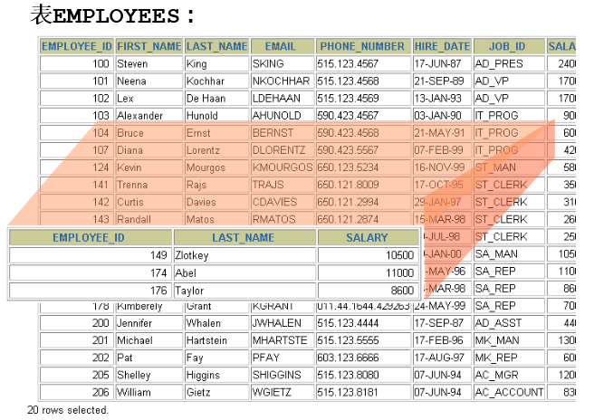
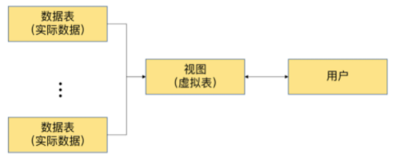

# 1. 常见的数据库对象

| 对象                | 描述                                                         |
| ------------------- | ------------------------------------------------------------ |
| 表(TABLE)           | 表是存储数据的逻辑单元，以行和列的形式存在，列就是字段，行就是记录 |
| 数据字典            | 就是系统表，存放数据库相关信息的表。系统表的数据通常由数据库系统维护，程序员通常不应该修改，只可查看 |
| 约束(CONSTRAINT)    | 执行数据校验的规则，用于保证数据完整性的规则                 |
| 视图(VIEW)          | 一个或者多个数据表里的数据的逻辑显示，视图并不存储数据       |
| 索引(INDEX)         | 用于提高查询性能，相当于书的目录                             |
| 存储过程(PROCEDURE) | 用于完成一次完整的业务处理，没有返回值，但可通过传出参数将多个值传给调用环境 |
| 存储函数(FUNCTION)  | 用于完成一次特定的计算，具有一个返回值                       |
| 触发器(TRIGGER)     | 相当于一个事件监听器，当数据库发生特定事件后，触发器被触发，完成相应的处理 |

# 2. 视图概述



## 2.1 为什么使用视图？
視圖（View）是一種虛擬表，它本質上是一個 SQL 查詢的結果集，但不存儲實際數據，而是從基礎表動態獲取數據。使用視圖的主要原因如下：

### **為什麼使用視圖？**
1. **數據安全**：  
   - 控制不同用戶可見的數據，防止敏感信息洩露。  
   - 例如，不同角色的員工可以透過不同的視圖獲取不同的信息。  

2. **簡化查詢**：  
   - 視圖可以封裝複雜的 SQL 查詢，使查詢變得更簡單。  
   - 例如，一個常用的聯表查詢可以封裝成視圖，讓使用者只需 `SELECT * FROM` 來獲取結果，而不需要寫繁瑣的 SQL。  

3. **增強可讀性和可維護性**：  
   - 透過視圖為數據庫建立邏輯層，減少應用端直接操作原始表的需求。  

4. **提高重用性**：  
   - 不同的查詢邏輯可以用視圖統一管理，避免重複寫 SQL。  

5. **提高數據抽象性**：  
   - 允許開發者關注業務邏輯，而不是數據表的具體結構。  

### **範例 1：控制可見數據**
假設我們有一個員工表 `employees`，包含以下欄位：
```sql
CREATE TABLE employees (
    id INT PRIMARY KEY,
    name VARCHAR(50),
    department VARCHAR(50),
    salary DECIMAL(10,2)
);
```
假設我們只想讓一般員工查詢 `id`, `name`, `department`，但不允許查詢薪資 (`salary`)。

可以創建一個視圖，隱藏薪資欄位：
```sql
CREATE VIEW employee_public_view AS
SELECT id, name, department
FROM employees;
```
一般員工可以使用：
```sql
SELECT * FROM employee_public_view;
```
但無法查看 `salary`。

### **範例 2：簡化查詢**
假設我們有兩張表：`orders` (訂單) 和 `customers` (客戶)：
```sql
CREATE TABLE customers (
    id INT PRIMARY KEY,
    name VARCHAR(100)
);

CREATE TABLE orders (
    id INT PRIMARY KEY,
    customer_id INT,
    amount DECIMAL(10,2),
    FOREIGN KEY (customer_id) REFERENCES customers(id)
);
```
如果我們經常需要查詢客戶的訂單金額，我們可以創建一個視圖：
```sql
CREATE VIEW customer_orders AS
SELECT c.id AS customer_id, c.name, o.amount
FROM customers c
JOIN orders o ON c.id = o.customer_id;
```
查詢時只需：
```sql
SELECT * FROM customer_orders;
```
比起每次都寫 `JOIN`，視圖讓查詢更簡潔。

### **範例 3：不同角色使用不同的視圖**
假設公司有兩種角色：
- **銷售人員** 只能看到客戶名稱與訂單金額。  
- **財務人員** 可以看到詳細資訊（包含 `customer_id` 和 `amount`）。

為銷售人員建立視圖：
```sql
CREATE VIEW sales_view AS
SELECT name, amount
FROM customer_orders;
```
為財務人員建立視圖：
```sql
CREATE VIEW finance_view AS
SELECT * FROM customer_orders;
```
如此一來，銷售人員只能查詢：
```sql
SELECT * FROM sales_view;
```
財務人員則能查詢：
```sql
SELECT * FROM finance_view;
```
這樣能確保數據安全，根據不同角色展示不同的數據。

### **總結**
視圖的優勢：
1. **提高數據安全性**：限制不同用戶對數據的訪問權限。
2. **簡化查詢**：將複雜查詢封裝為簡單的 `SELECT`。
3. **增強可維護性**：當表結構改變時，只需更新視圖，而不需修改所有查詢語句。
4. **提高重用性**：相同的查詢邏輯可以在不同地方復用。

--- 

## 2.2 视图（View）理解与示例

### 1. **什么是视图？**
视图（View）是 **SQL 中的一种虚拟表**，它并不存储数据，而是基于一个或多个 **基表（实际存储数据的表）** 生成的查询结果。

- 视图本身 **不占用存储空间**（除了视图的定义）。
- 它是一个 **存储起来的 `SELECT` 语句**，每次查询视图时，都会动态从基表中获取数据。

### 2. **创建视图**
假设我们有一张 **`employees`（员工表）**，包含如下数据：

```sql
CREATE TABLE employees (
    id INT PRIMARY KEY,
    name VARCHAR(50),
    department VARCHAR(50),
    salary DECIMAL(10,2)
);

INSERT INTO employees (id, name, department, salary) VALUES
(1, 'Alice', 'HR', 5000),
(2, 'Bob', 'IT', 7000),
(3, 'Charlie', 'Finance', 6500),
(4, 'David', 'IT', 7200),
(5, 'Eve', 'HR', 4800);
```

### 3. **基于 `employees` 表创建视图**
假设我们希望 **只查询 IT 部门的员工信息**，可以创建一个 `it_employees` 视图：

```sql
CREATE VIEW it_employees AS
SELECT id, name, salary
FROM employees
WHERE department = 'IT';
```

**执行 `SELECT * FROM it_employees;` 视图查询时，得到的结果如下：**

| id  | name  | salary  |
|-----|-------|--------|
| 2   | Bob   | 7000   |
| 4   | David | 7200   |

可以看到，**视图是基于 `employees` 表筛选出来的，它不会额外存储数据，只是一个查询的别名**。

### 4. **视图与基表的关系**
#### ✅ **视图与基表的数据是同步的**
如果 `employees` 表中的数据发生变化，视图 `it_employees` 也会随之更新。

例如，删除 `Bob` 之后：

```sql
DELETE FROM employees WHERE id = 2;
```

再查询 `it_employees` 视图：

```sql
SELECT * FROM it_employees;
```

| id  | name  | salary  |
|-----|-------|--------|
| 4   | David | 7200   |

可以看到，视图中的 `Bob` 也消失了。

#### ✅ **可以通过视图更新基表**
```sql
UPDATE it_employees SET salary = 7500 WHERE name = 'David';
```

再查询 `employees` 表：

```sql
SELECT * FROM employees WHERE name = 'David';
```

| id  | name  | department | salary |
|----|------|------------|--------|
| 4  | David | IT         | 7500   |

**更新视图中的数据，也会影响基表的数据！**

### 5. **视图的优点**
- **简化查询**：避免重复写复杂 `SELECT` 语句
- **提升可读性**：让查询逻辑更清晰
- **提高安全性**：可以创建一个只包含部分字段的视图，限制用户访问敏感数据

### 6. **删除视图**
```sql
DROP VIEW it_employees;
```
> **删除视图** 只会影响视图本身，不影响基表的数据。

### 总结
- **视图是 SQL 中的虚拟表，不存储数据**
- **视图是基于 `SELECT` 语句的存储，查询视图就像查询普通表一样**
- **视图的变更会影响基表，基表的变更也会影响视图**
- **视图适用于简化查询、提高安全性和封装复杂逻辑**

---

# 3. 创建视图

## 3.1 語法解析
在 MySQL 中，`CREATE VIEW` 語句用於創建視圖（View），視圖本質上是基於查詢結果的虛擬表。視圖不像物理表那樣存儲數據，而是對底層表的查詢結果提供一個抽象層。

```sql
CREATE [OR REPLACE] 
[ALGORITHM = {UNDEFINED | MERGE | TEMPTABLE}] 
VIEW 视图名称 [(字段列表)]
AS 查询语句
[WITH [CASCADED|LOCAL] CHECK OPTION]
```

精简版：
```sql
CREATE VIEW 视图名称 
AS 查询语句
```

### 1. `CREATE [OR REPLACE]`
- `CREATE VIEW 视图名称`：創建新的視圖。
- `OR REPLACE`：如果視圖已存在，則替換原視圖，而不需要先刪除舊視圖。

### 2. `ALGORITHM = {UNDEFINED | MERGE | TEMPTABLE}`
用來指定視圖的處理方式：
- `UNDEFINED`（默認值）：由 MySQL 自行決定使用哪種算法。
- `MERGE`：將視圖的 SQL 查詢直接合併到使用視圖的 SQL 查詢中，提升查詢效率。
- `TEMPTABLE`：將視圖的結果存儲在臨時表中，當視圖涉及 `GROUP BY` 或 `DISTINCT` 時可能會使用。

### 3. `视图名称 [(字段列表)]`
- `视图名称`：視圖的名稱。
- `字段列表`（可選）：指定視圖的列名稱，如果省略，則會自動從查詢語句中的列名推斷。

### 4. `AS 查询语句`
- 指定視圖的查詢邏輯，這部分是視圖的核心，即基於某些表的查詢結果創建虛擬表。

### 5. `WITH [CASCADED | LOCAL] CHECK OPTION`
用於限制對視圖的 `INSERT` 或 `UPDATE` 操作，使其符合視圖的查詢條件：
- `WITH CHECK OPTION`：確保插入或更新後的數據仍符合視圖的條件。
- `CASCADED`（默認）：應用到所有嵌套視圖。
- `LOCAL`：僅應用到當前視圖，不影響嵌套視圖。

### 示例 1：基礎視圖
假設我們有一個 `employees`（員工）表：
```sql
CREATE TABLE employees (
    id INT PRIMARY KEY AUTO_INCREMENT,
    name VARCHAR(50),
    department VARCHAR(50),
    salary DECIMAL(10,2)
);

INSERT INTO employees (name, department, salary) VALUES
('Alice', 'HR', 60000),
('Bob', 'Engineering', 80000),
('Charlie', 'Engineering', 75000),
('David', 'Marketing', 65000);
```

#### 創建一個顯示工程部員工的視圖：
```sql
CREATE VIEW engineering_employees AS
SELECT id, name, salary FROM employees WHERE department = 'Engineering';
```
#### 測試視圖：
```sql
SELECT * FROM engineering_employees;
```
結果：
```
id | name  | salary
-------------------
2  | Bob   | 80000
3  | Charlie | 75000
```
該視圖允許我們更方便地查詢 `Engineering` 部門的員工。

### 示例 2：使用 `WITH CHECK OPTION`
#### 核心問題
如果我們希望視圖內的 `INSERT` 或 `UPDATE` 操作符合視圖的條件，可以使用 `WITH CHECK OPTION`。

```sql
CREATE VIEW engineering_employees AS
SELECT id, name, salary FROM employees WHERE department = 'Engineering'
WITH CHECK OPTION;
```
- `engineering_employees` 視圖中 **沒有 `department` 欄位**。
- `WITH CHECK OPTION` 要求視圖內的數據 **必須符合 `department = 'Engineering'`**。

當執行：
```sql
INSERT INTO engineering_employees (id, name, salary) 
VALUES (5, 'Eve', 70000);
```
MySQL 會嘗試向 `employees` 表插入：
```sql
INSERT INTO employees (id, name, salary) 
VALUES (5, 'Eve', 70000);
```
此時：
1. `department` **沒有被指定值**（因為視圖中看不到 `department`）。
2. `employees` 表的 `department` **允許 NULL**，所以 `department` 會被插入 `NULL`。
3. **但視圖 `WITH CHECK OPTION` 要求 `department = 'Engineering'`，導致插入失敗**。

#### **解決方案**
##### **方法 1：顯式插入 `employees` 表**
由於 `engineering_employees` 只是 `employees` 的一個篩選結果，應該直接插入 `employees`，並手動指定 `department`：
```sql
INSERT INTO employees (id, name, department, salary) 
VALUES (5, 'Eve', 'Engineering', 70000);
```
這樣 `department` 符合 `'Engineering'`，並且 `engineering_employees` 會自動顯示 `Eve`。
然後查詢視圖：
```sql
SELECT * FROM engineering_employees;
```
我們會看到：
```
id | name  | salary
-------------------
2  | Bob   | 80000
3  | Charlie | 75000
5  | Eve   | 70000
```
##### **方法 2：修改視圖，使 `department` 可見**
如果希望可以直接對視圖進行 `INSERT`，那麼視圖應該顯式包含 `department` 欄位：
```sql
CREATE OR REPLACE VIEW engineering_employees AS
SELECT id, name, department, salary FROM employees WHERE department = 'Engineering'
WITH CHECK OPTION;
```
這樣，在插入時可以明確指定 `department`：
```sql
INSERT INTO engineering_employees (id, name, department, salary) 
VALUES (5, 'Eve', 'Engineering', 70000);
```
這樣就不會發生錯誤，因為 `department` 值滿足 `WITH CHECK OPTION` 的條件。

#### **結論**
即使 `department` **允許 `NULL`**，`INSERT` **仍然會失敗**，因為：
1. **視圖中沒有 `department` 欄位**，導致 `INSERT` 時 `department` 被插入為 `NULL`。
2. **`WITH CHECK OPTION` 要求 `department = 'Engineering'`**，而 `NULL != 'Engineering'`，導致違反約束。

##### **最佳解法**
- **如果可以修改視圖**，那就顯式包含 `department` 欄位，並在 `INSERT` 時指定 `department`。
- **如果不想改視圖**，那就直接往 `employees` 表插入數據，而不是往視圖插入。

---

### 示例 3：使用 `ALGORITHM`
- 🔰 語法格式：
  ```sql
  CREATE ALGORITHM = {MERGE | TEMPTABLE | UNDEFINED} VIEW view_name AS ...
  ```
##### 🔹 MERGE 模式

- ✅ 定義：將視圖的 SQL 查詢「合併（Merge）」到主查詢中一起執行，像是在查原始資料表一樣。

> **⚙️ 原理：**
> - 不建立中間結果。
> - 外部查詢條件（如 `WHERE`）可直接套用到原始表。
> - 效率高，可使用原始表的索引。

- 📌 使用情況：當視圖內的 SQL 結構 **簡單、無聚合/排序/去重限制**，MySQL 可直接整合查詢時。

- ✅ 範例：
  ```sql
  -- 建立視圖：
  CREATE ALGORITHM = MERGE VIEW emp_view AS
  SELECT id, name, salary FROM employees;

  -- 使用視圖的查詢：
  SELECT id, name, salary FROM emp_view WHERE salary > 50000;

  -- MySQL 實際執行時會「合併」成：
  SELECT id, name, salary FROM employees WHERE salary > 50000;
  ```

> **🚫 不適用 MERGE 的情況：**
> - 視圖中含 `GROUP BY`
> - `DISTINCT`
> - `UNION / UNION ALL`
> - `LIMIT`
> - 特定子查詢或變數

---

##### 🔸 TEMPTABLE 模式

- ✅ 定義：先執行視圖 SQL，結果暫存在臨時表，再對這個結果表做後續查詢。

> **⚙️ 原理：**
> - 建立臨時表（Temp Table）存放中間結果。
> - 外部查詢條件是作用在「結果表」而非原始表。
> - 效率較低，無法使用原始表索引。

> **📌 使用情況：視圖中包含需要中間計算的語法，例如：**
> - `GROUP BY`
> - `DISTINCT`
> - `UNION`
> - `LIMIT`
> - 其他無法合併查詢的邏輯

- ✅ 範例：
  ```sql
  -- 建立 TEMPTABLE 視圖：
  CREATE ALGORITHM = TEMPTABLE VIEW avg_salary AS
  SELECT department_id, AVG(salary) AS avg_salary
  FROM employees
  GROUP BY department_id;

  -- 使用視圖的查詢語句：
  SELECT department_id, avg_salary FROM avg_salary WHERE avg_salary > 60000;

  -- MySQL 執行流程為：
  -- Step 1: 先執行視圖的 SELECT，產生一個暫存表 temp_table
  -- Step 2: 再對 temp_table 執行 WHERE avg_salary > 60000 的篩選
  ```

---

##### 🔁 MERGE vs TEMPTABLE 比較表

| 項目               | MERGE                                | TEMPTABLE                                |
|--------------------|----------------------------------------|-------------------------------------------|
| 處理方式           | 合併查詢語句                          | 建立臨時表後查詢                         |
| 可否條件下推       | ✅ 可以下推至原始表（效率高）          | ❌ 不可下推（只針對結果表操作）         |
| 查詢效率           | 較高                                   | 較低                                     |
| 可使用原始表索引   | ✅ 是                                   | ❌ 否                                     |
| 支援聚合操作       | ❌ 否                                   | ✅ 是（如 GROUP BY, DISTINCT）           |
| 適用場景           | 簡單 SELECT、JOIN、WHERE               | 有統計、聚合、複雜查詢                   |

---

#### 🛠️ ALGORITHM = UNDEFINED（補充）

- 預設值，如果未指定，MySQL 會自動判斷使用 MERGE 或 TEMPTABLE。
- 建議平常可以省略，交給系統優化處理。

---

#### ✅ 實務建議

- **優先使用 MERGE**：如果你寫的視圖內容簡單（無聚合、無排序等），建議用 MERGE，可取得最佳效能。
- **必須聚合就用 TEMPTABLE**：如果要用 `GROUP BY`、`DISTINCT` 等，MySQL 自然會轉為 TEMPTABLE，這是正常行為。
- **查詢效能要顧**：可搭配 `EXPLAIN` 或 `SHOW CREATE VIEW` 觀察實際使用哪種模式。
- **用 UNDEFINED 就好？** 一般開發中其實可以不指定 ALGORITHM，讓 MySQL 自動選擇。

---

### 總結
- **視圖** 是基於查詢結果的虛擬表，可簡化複雜的 SQL 查詢，提高可讀性。
- **`OR REPLACE`** 允許替換已有視圖，無需手動刪除。
- **`ALGORITHM`** 指定視圖的處理方式（`MERGE` 提高效率，`TEMPTABLE` 使用臨時表）。
- **`WITH CHECK OPTION`** 限制對視圖的修改，確保數據符合視圖條件。

---

## 3.2 创建单表视图

> 视图（View）是基于 SQL 查询结果的 虚拟表，它本质上并不存储数据，而是对数据库中表的数据提供了一种简化的访问方式。使用视图可以提高查询的 可读性、可维护性，并且可以 限制用户对特定数据的访问。

### **示例 1：创建 `empvu80` 视图**
```sql
CREATE VIEW empvu80
AS 
SELECT  employee_id, last_name, salary
FROM    employees
WHERE   department_id = 80;
```
**解析**：
- 这个视图 `empvu80` 选取了 `employees` 表中 **`department_id = 80`** 的员工信息。
- 视图中包含 **`employee_id`（员工ID）、`last_name`（姓氏）、`salary`（薪水）** 三个字段。
- 视图创建后，可以像查询普通表一样使用它：
  ```sql
  SELECT * FROM empvu80;
  ```

**作用**：
- 方便查询 **部门 80** 的员工数据，而无需每次写 `WHERE department_id = 80`。

### **示例 2：计算员工的年薪**
```sql
CREATE VIEW emp_year_salary (ename, year_salary)
AS 
SELECT ename, salary * 12 * (1 + IFNULL(commission_pct, 0))
FROM t_employee;
```
**解析**：
- 这个视图 **计算每个员工的年薪**，年薪计算公式：
  ```
  salary * 12 * (1 + commission_pct)
  ```
  `commission_pct`（提成比例）可能是 `NULL`，所以用 `IFNULL(commission_pct, 0)` 确保 `NULL` 被替换为 `0`。
- 视图中的字段名称被指定为：
  - `ename`（员工姓名）
  - `year_salary`（年薪）

**作用**：
- 这样用户只需查询 `emp_year_salary` 视图，就能直接获取员工的年薪，而不需要每次手写计算公式：
  ```sql
  SELECT * FROM emp_year_salary;
  ```

### **示例 3：创建 `salvu50` 视图**
```sql
CREATE VIEW salvu50
AS 
SELECT  employee_id ID_NUMBER, last_name NAME, salary * 12 ANN_SALARY
FROM    employees
WHERE   department_id = 50;
```
**解析**：
- 这个视图 **选取部门 50 的员工信息**，并重新命名字段：
  - `employee_id` → `ID_NUMBER`（编号）
  - `last_name` → `NAME`（姓名）
  - `salary * 12` → `ANN_SALARY`（年薪）

- 视图创建后，可以查询：
  ```sql
  SELECT * FROM salvu50;
  ```

**作用**：
- 让查询结果 **字段名更直观**，用户无需记住 `employee_id`、`last_name` 等字段名称，而是使用更符合业务逻辑的 `ID_NUMBER`、`NAME`。

### **视图特点**
1. **视图是虚拟表**
   - 视图不存储数据，而是 **动态从原始表查询数据**。
2. **视图可以简化查询**
   - 例如，我们可以创建一个 **计算年薪** 的视图，每次查询时就不必重复写 `salary * 12` 计算。
3. **视图可以限制数据访问**
   - 例如，只给某些用户权限访问 `empvu80` 视图，而不允许他们查看 `employees` 表的完整数据。
4. **视图可以起别名**
   - 通过 `AS` 指定新的字段名称，方便查询和理解。

### **总结**
**创建视图的核心作用**
- **封装 SQL 查询**，减少重复代码
- **提高查询可读性**，起更直观的字段名
- **限制用户访问权限**，只暴露需要的数据
- **动态更新**，数据变更时视图会自动反映最新数据

---

## 3.3 创建多表联合视图

視圖（`VIEW`）是基於查詢的虛擬表，它不存儲數據，但可以用來簡化查詢、提高可讀性，或限制訪問某些數據。當我們需要從多個表中獲取數據並將其呈現為一個統一的結構時，就可以使用 **多表聯合視圖**。

### **🔹 基本概念**
1. **視圖的作用**
   - 簡化複雜的 SQL 查詢
   - 提高可讀性
   - 增強安全性（可限制用戶訪問部分數據）
   - 允許數據格式化

2. **多表聯合視圖**：使用 `JOIN`（如 `INNER JOIN`、`LEFT JOIN`）來合併來自不同表的數據，使其看起來像一個單獨的表。

### **📝 示例講解**
#### **1️⃣ 內連結 (INNER JOIN) 视图**
##### **📌 需求：**
我們想要創建一個視圖，顯示所有員工的 `employee_id`、`last_name` 和他們所屬的 `department_name`。

##### **📌 SQL:**
```sql
CREATE VIEW empview 
AS 
SELECT e.employee_id AS emp_id, e.last_name AS NAME, d.department_name
FROM employees e
INNER JOIN departments d
ON e.department_id = d.department_id;
```
##### **📌 解釋：**
- `INNER JOIN` 只返回在 **`employees`** 和 **`departments`** 兩張表中 **都有匹配數據** 的行。
- 這樣的視圖讓我們可以像查詢單個表一樣，獲取員工姓名及其所屬部門。

##### **📌 查詢視圖的方式**
```sql
SELECT * FROM empview;
```

#### **2️⃣ 左連結 (LEFT JOIN) 视图**
##### **📌 需求：**
我們希望獲取所有員工 (`t_employee`)，即使該員工 **沒有部門**，我們仍然要顯示員工名稱 (`ename`)，但部門 (`dname`) 可能為 `NULL`。

##### **📌 SQL:**
```sql
CREATE VIEW emp_dept
AS 
SELECT e.ename, d.dname
FROM t_employee e
LEFT JOIN t_department d
ON e.did = d.did;
```
##### **📌 解釋：**
- `LEFT JOIN` 確保了 **所有 `t_employee` 表中的記錄都會顯示**，即使對應的 `t_department.did` 為 `NULL`。
- 這樣能夠確保即使沒有分配部門的員工，他們的信息仍然能夠查詢到。

##### **📌 查詢視圖的方式**
```sql
SELECT * FROM emp_dept;
```

#### **3️⃣ 聚合函數 (GROUP BY) 视图**
##### **📌 需求：**
我們希望查詢 **每個部門** 的 `最低薪資 (minsal)`、`最高薪資 (maxsal)` 和 `平均薪資 (avgsal)`。

##### **📌 SQL:**
```sql
CREATE VIEW dept_sum_vu
(name, minsal, maxsal, avgsal)
AS 
SELECT d.department_name, 
       MIN(e.salary), 
       MAX(e.salary), 
       AVG(e.salary)
FROM employees e
INNER JOIN departments d
ON e.department_id = d.department_id 
GROUP BY d.department_name;
```
##### **📌 解釋：**
- `GROUP BY d.department_name` 讓我們 **根據部門名稱分組**。
- `MIN(e.salary)`, `MAX(e.salary)`, `AVG(e.salary)` 分別計算 **該部門內的最低、最高和平均薪資**。

##### **📌 查詢視圖的方式**
```sql
SELECT * FROM dept_sum_vu;
```

#### **4️⃣ 利用視圖進行數據格式化**
##### **📌 需求：**
希望將員工姓名和部門名稱格式化顯示，如 `王五(技术部)`。

##### **📌 SQL:**
```sql
CREATE VIEW emp_depart
AS
SELECT CONCAT(e.last_name, '(', d.department_name, ')') AS emp_dept
FROM employees e 
JOIN departments d
ON e.department_id = d.department_id;
```
##### **📌 解釋：**
- `CONCAT()` 將 `last_name` 和 `department_name` 拼接在一起，並加上 `()` 符號，使輸出格式更直觀。

##### **📌 查詢視圖的方式**
```sql
SELECT * FROM emp_depart;
```
📌 **範例輸出：**
```
+-------------------+
| emp_dept         |
+-------------------+
| 王五(技术部)     |
| 李四(财务部)     |
| 张三(人事部)     |
+-------------------+
```

### **📝 小結**
1️⃣ **內連結 (`INNER JOIN`)**：只返回匹配的記錄。  
2️⃣ **左連結 (`LEFT JOIN`)**：即使右表沒有匹配數據，也會顯示左表的所有記錄。  
3️⃣ **聚合函數 (`GROUP BY`)**：可用來計算某個組的 `最小/最大/平均值`。  
4️⃣ **格式化數據 (`CONCAT`)**：可用視圖對數據進行格式化輸出。

---

## 3.4 基于视图创建视图

在 MySQL 中，**视图（View）** 是一个虚拟表，它本质上是一个 SQL 查询的结果集。**基于视图创建视图** 意味着我们可以用已有的视图作为数据源，再次创建新的视图。这种做法的优势包括：
1. **提高可读性和复用性**：复杂查询可以分解成多个小视图，降低查询的复杂度。
2. **提高安全性**：只暴露必要的数据，而不是整个表。
3. **简化查询**：避免重复书写复杂 SQL 语句。

### **示例讲解**
假设我们有两个视图：
1. `emp_dept`：包含员工姓名 (`ename`) 和其所属的部门 (`dname`)。
2. `emp_year_salary`：包含员工姓名 (`ename`) 和年薪 (`year_salary`)。

然后，我们要创建一个新的视图 `emp_dept_ysalary`，它基于 `emp_dept` 和 `emp_year_salary` 这两个视图，将员工姓名、部门名称、年薪信息整合在一起。

#### **假设的原始数据**
假设我们有以下两张原始表：

**`employees` 表**
| emp_id | ename   | dept_id |
|--------|--------|--------|
| 1      | Alice  | 101    |
| 2      | Bob    | 102    |
| 3      | Charlie| 103    |

**`departments` 表**
| dept_id | dname       |
|---------|------------|
| 101     | HR         |
| 102     | IT         |
| 103     | Marketing  |

**`salaries` 表**
| emp_id | year_salary |
|--------|------------|
| 1      | 50000      |
| 2      | 70000      |
| 3      | 60000      |

#### **第一步：创建 `emp_dept` 视图**
```sql
CREATE VIEW emp_dept AS
SELECT employees.ename, departments.dname
FROM employees
JOIN departments ON employees.dept_id = departments.dept_id;
```
该视图 `emp_dept` 产生的结果：
| ename   | dname      |
|---------|-----------|
| Alice   | HR        |
| Bob     | IT        |
| Charlie | Marketing |

#### **第二步：创建 `emp_year_salary` 视图**
```sql
CREATE VIEW emp_year_salary AS
SELECT employees.ename, salaries.year_salary
FROM employees
JOIN salaries ON employees.emp_id = salaries.emp_id;
```
该视图 `emp_year_salary` 产生的结果：
| ename   | year_salary |
|---------|------------|
| Alice   | 50000      |
| Bob     | 70000      |
| Charlie | 60000      |

#### **第三步：基于前面两个视图创建 `emp_dept_ysalary` 视图**
```sql
CREATE VIEW emp_dept_ysalary AS 
SELECT emp_dept.ename, emp_dept.dname, emp_year_salary.year_salary
FROM emp_dept 
INNER JOIN emp_year_salary ON emp_dept.ename = emp_year_salary.ename;
```
这个视图 `emp_dept_ysalary` 产生的最终结果：
| ename   | dname      | year_salary |
|---------|-----------|------------|
| Alice   | HR        | 50000      |
| Bob     | IT        | 70000      |
| Charlie | Marketing | 60000      |

### **总结**
1. **`emp_dept` 视图** 负责员工和部门的关联。
2. **`emp_year_salary` 视图** 负责员工和年薪的关联。
3. **`emp_dept_ysalary` 视图** 结合前两个视图，最终得到完整的员工、部门和薪资信息。

这样，我们就通过 **基于视图创建视图** 的方式，逐步构建了一个复杂查询，并且让代码更加模块化和易读。

---

# 4. 查看视图

在 MySQL 中，**视图（View）** 是一种虚拟表，它本身不存储数据，而是基于 SQL 查询结果的逻辑视图。你可以像查询普通表一样查询视图，但它实际上是在后台执行定义视图的 SQL 语句。

### 📌 **1. `SHOW TABLES;` - 查看数据库的表对象、视图对象**
`SHOW TABLES;` 命令用于查看当前数据库中所有的 **表（Tables）** 和 **视图（Views）**，它不会区分表和视图，都会一起列出来。

✅ **示例**
```sql
SHOW TABLES;
```
✅ **示例执行结果**
假设数据库 `test_db` 里有两个表 (`users` 和 `orders`)，还有一个视图 (`view_orders`)，执行 `SHOW TABLES;` 会返回：
```
+------------------+
| Tables_in_test_db |
+------------------+
| users            |
| orders           |
| view_orders      |  -- 这是一个视图
+------------------+
```

### 📌 **2. `DESC 视图名称;` 或 `DESCRIBE 视图名称;` - 查看视图的结构**
`DESC` 或 `DESCRIBE` 命令用于查看**视图的字段结构**，和查询表的字段结构类似。

✅ **示例**
```sql
DESC view_orders;
```
✅ **示例执行结果**
假设 `view_orders` 视图是基于 `orders` 表创建的：
```sql
CREATE VIEW view_orders AS
SELECT order_id, customer_id, total_price FROM orders;
```
执行 `DESC view_orders;` 会返回：
```
+-------------+-------------+------+-----+---------+-------+
| Field       | Type        | Null | Key | Default | Extra |
+-------------+-------------+------+-----+---------+-------+
| order_id    | INT         | NO   |     | NULL    |       |
| customer_id | INT         | NO   |     | NULL    |       |
| total_price | DECIMAL(10,2) | NO  |     | NULL    |       |
+-------------+-------------+------+-----+---------+-------+
```
📌 **和普通表不同**：视图不会有 `Key`（主键、外键）或者 `Extra`（如 `AUTO_INCREMENT`），因为它不是物理存储的表，而是 SQL 查询的结果。

### 📌 **3. `SHOW TABLE STATUS LIKE '视图名称'\G` - 查看视图的属性信息**
这个命令用于**查询视图的元数据**，例如存储引擎、数据行数等。但由于**视图是虚拟表，不存储数据**，它的 `Comment` 会标记为 `VIEW`，其他信息大多为 `NULL`。

✅ **示例**
```sql
SHOW TABLE STATUS LIKE 'view_orders'\G
```
✅ **示例执行结果**
```
*************************** 1. row ***************************
           Name: view_orders
         Engine: NULL
        Version: NULL
     Row_format: NULL
           Rows: NULL
 Avg_row_length: NULL
    Data_length: NULL
Max_data_length: NULL
   Index_length: NULL
      Data_free: NULL
 Auto_increment: NULL
    Create_time: NULL
    Update_time: NULL
     Check_time: NULL
      Collation: utf8mb4_general_ci
       Checksum: NULL
 Create_options: 
        Comment: VIEW   -- 这个表是一个视图
```
📌 **重点**
- `Engine` 为 `NULL`，因为视图**不是物理表**，没有存储引擎。
- `Rows` 和 `Data_length` 等字段也是 `NULL`，因为**视图本身不存储数据**。
- `Comment` 显示 `VIEW`，确认这是一个视图。

### 📌 **4. `SHOW CREATE VIEW 视图名称;` - 查看视图的详细定义信息**
`SHOW CREATE VIEW` 可以查看创建视图的**完整 SQL 语句**，包括 `SELECT` 语句、视图的安全性属性等。

✅ **示例**
```sql
SHOW CREATE VIEW view_orders;
```
✅ **示例执行结果**
```
+-------------+------------------------------------------------------------+
| View        | Create View                                                |
+-------------+------------------------------------------------------------+
| view_orders | CREATE ALGORITHM=UNDEFINED DEFINER=`root`@`localhost` SQL SECURITY DEFINER VIEW `view_orders` AS SELECT `orders`.`order_id` AS `order_id`, `orders`.`customer_id` AS `customer_id`, `orders`.`total_price` AS `total_price` FROM `orders` |
+-------------+------------------------------------------------------------+
```
📌 **解析**
- **`CREATE ALGORITHM=UNDEFINED`**：视图的执行方式，默认 `UNDEFINED`（系统决定）。
- **`DEFINER='root'@'localhost'`**：表示视图是由 `root` 用户创建的。
- **`SQL SECURITY DEFINER`**：表示视图按照**创建者的权限**执行（另一种方式是 `INVOKER`，表示按照调用者的权限执行）。
- **视图的 `SELECT` 语句**：可以看到视图的数据来源。

## **📌 总结**
| SQL 语法 | 作用 |
|----------|------|
| `SHOW TABLES;` | 显示数据库中的所有表和视图 |
| `DESC 视图名称;` | 查看视图的字段结构 |
| `SHOW TABLE STATUS LIKE '视图名称'\G` | 查看视图的元数据信息（存储引擎、注释等） |
| `SHOW CREATE VIEW 视图名称;` | 查看视图的创建 SQL 语句 |

你可以通过 `SHOW CREATE VIEW` 获取视图的定义，通过 `DESC` 了解视图的结构。最重要的是要理解**视图是虚拟表，不存储数据**，它只是封装 SQL 查询以方便使用。

---

# 5. 更新视图的数据

## **5.1 一般情況**
視圖（View）是基於資料表創建的虛擬表，當你對視圖進行 `INSERT`、`UPDATE` 或 `DELETE` 操作時，這些變更會直接影響其所基於的原始資料表（base table）。

視圖本身並不存儲數據，它只是對基礎表的查詢結果。因此，當你修改視圖中的數據時，實際上是修改了基礎表中的數據。反之，如果你直接修改基礎表的數據，那麼視圖的內容也會同步變更。

### **範例**
#### **1. 創建一個基礎表**
首先，我們建立一個 `t_employee` 資料表，並插入一些數據：

```sql
CREATE TABLE t_employee (
    id INT PRIMARY KEY AUTO_INCREMENT,
    ename VARCHAR(50),
    tel VARCHAR(15)
);

INSERT INTO t_employee (ename, tel) VALUES 
('孙洪亮', '13789098765'),
('张三', '13900001234');
```

現在，我們查詢 `t_employee` 的數據：

```sql
SELECT * FROM t_employee;
```

結果：
```
+----+---------+-------------+
| id | ename   | tel         |
+----+---------+-------------+
|  1 | 孙洪亮  | 13789098765 |
|  2 | 张三    | 13900001234 |
+----+---------+-------------+
```

#### **2. 創建一個視圖**
我們基於 `t_employee` 表創建一個只顯示 `ename` 和 `tel` 欄位的視圖 `emp_tel`：

```sql
CREATE VIEW emp_tel AS
SELECT ename, tel FROM t_employee;
```

現在，我們查詢 `emp_tel` 視圖的數據：

```sql
SELECT * FROM emp_tel;
```

結果：
```
+---------+-------------+
| ename   | tel         |
+---------+-------------+
| 孙洪亮  | 13789098765 |
| 张三    | 13900001234 |
+---------+-------------+
```

#### **3. 更新視圖中的數據**
我們嘗試更新 `emp_tel` 視圖中的 `tel` 值：

```sql
UPDATE emp_tel 
SET tel = '13789091234' 
WHERE ename = '孙洪亮';
```

執行這個 `UPDATE` 語句後，我們重新查詢 `emp_tel`：

```sql
SELECT * FROM emp_tel;
```

結果：
```
+---------+-------------+
| ename   | tel         |
+---------+-------------+
| 孙洪亮  | 13789091234 |
| 张三    | 13900001234 |
+---------+-------------+
```

同時，我們查詢 `t_employee` 基礎表的數據：

```sql
SELECT * FROM t_employee;
```

結果：
```
+----+---------+-------------+
| id | ename   | tel         |
+----+---------+-------------+
|  1 | 孙洪亮  | 13789091234 |
|  2 | 张三    | 13900001234 |
+----+---------+-------------+
```

可以看到，修改視圖的數據後，基礎表的數據也隨之更新了。

#### **4. 刪除視圖中的數據**
接下來，我們從 `emp_tel` 視圖刪除一條記錄：

```sql
DELETE FROM emp_tel WHERE ename = '孙洪亮';
```

查詢 `emp_tel` 視圖：

```sql
SELECT * FROM emp_tel;
```

結果：
```
+---------+-------------+
| ename   | tel         |
+---------+-------------+
| 张三    | 13900001234 |
+---------+-------------+
```

查詢 `t_employee` 表：

```sql
SELECT * FROM t_employee;
```

結果：
```
+----+---------+-------------+
| id | ename   | tel         |
+----+---------+-------------+
|  2 | 张三    | 13900001234 |
+----+---------+-------------+
```

可以看到，當我們從視圖 `emp_tel` 刪除數據時，`t_employee` 表中的數據也同步被刪除了。

### **結論**
- **視圖並不存儲數據，它只是基於基礎表的查詢結果。**
- **對視圖進行 `INSERT`、`UPDATE` 或 `DELETE` 操作，實際上是對基礎表執行相應的操作。**
- **當基礎表的數據發生變化時，視圖的內容也會隨之變更。**
- **某些視圖可能無法更新，例如包含 `JOIN`、`GROUP BY`、`DISTINCT` 等操作的視圖，這種情況下視圖通常是「只讀」的，不能直接修改數據。**

---

## **5.2 不可更新的视图**
在 MySQL 中，视图（VIEW）可以用来简化查询、增强安全性或提高代码可读性。但并不是所有视图都支持 `INSERT`、`UPDATE` 和 `DELETE` 操作。  
当视图中的行与底层表的行无法形成**一对一**关系，或者视图的查询结构过于复杂时，视图就会变成**不可更新视图**，即不支持某些数据修改操作。

### **📌 详细解读每种不可更新情况**

#### **1. `ALGORITHM = TEMPTABLE` 使视图不可更新**
**原因**：当使用 `TEMPTABLE` 算法创建视图时，MySQL 会将视图的数据存储在临时表中，而不是直接映射到基表。这使得 `INSERT` 和 `DELETE` 操作无法进行。

**示例**
```sql
CREATE ALGORITHM = TEMPTABLE VIEW v_temp AS
SELECT id, name FROM users;
```
**不可执行**
```sql
INSERT INTO v_temp (id, name) VALUES (3, 'Tom');  -- ❌ 错误
DELETE FROM v_temp WHERE id = 1;  -- ❌ 错误
```

#### **2. 视图缺少 `NOT NULL` 但无默认值的列**
**原因**：如果基表中的某个字段是 `NOT NULL` 且没有默认值，而视图没有包含这个字段，则 `INSERT` 语句无法提供必需的值。

**示例**
```sql
CREATE TABLE users (
    id INT PRIMARY KEY,
    name VARCHAR(50) NOT NULL,
    email VARCHAR(100) NOT NULL
);
```
```sql
CREATE VIEW v_users AS
SELECT id, name FROM users;
```
**不可执行**
```sql
INSERT INTO v_users (id, name) VALUES (3, 'Alice'); -- ❌ 无法插入，email 没有值
```

#### **3. 视图基于 `JOIN`，不支持 `INSERT` 和 `DELETE`**
**原因**：`JOIN` 使得视图中的一行可能对应多个基表的行，因此 MySQL 无法明确知道应该在哪个表中插入或删除数据。

**示例**
```sql
CREATE TABLE orders (
    order_id INT PRIMARY KEY,
    user_id INT,
    amount DECIMAL(10,2),
    FOREIGN KEY (user_id) REFERENCES users(id)
);
```
```sql
CREATE VIEW v_orders_users AS
SELECT users.id, users.name, orders.amount
FROM users
JOIN orders ON users.id = orders.user_id;
```
**不可执行**
```sql
INSERT INTO v_orders_users (id, name, amount) VALUES (4, 'John', 200.00); -- ❌ 错误
DELETE FROM v_orders_users WHERE id = 2; -- ❌ 错误
```

#### **4. 视图包含数学表达式或子查询**
**原因**：当视图的列是数学计算结果或子查询时，MySQL 无法直接将修改后的值映射回原始表。

**示例**
```sql
CREATE VIEW v_salary AS
SELECT id, salary * 1.1 AS increased_salary FROM employees;
```
**不可执行**
```sql
UPDATE v_salary SET increased_salary = 5000; -- ❌ 不能更新数学计算字段
```

#### **5. `DISTINCT`、聚合函数、`GROUP BY`、`HAVING`、`UNION` 使视图不可更新**
**原因**：这些操作会对数据进行分组或去重，导致视图中的行无法唯一映射到基表的某一行，因此不支持 `INSERT`、`UPDATE`、`DELETE`。

**示例**
```sql
CREATE VIEW v_grouped AS
SELECT user_id, SUM(amount) AS total_spent FROM orders GROUP BY user_id;
```
**不可执行**
```sql
UPDATE v_grouped SET total_spent = 1000 WHERE user_id = 1; -- ❌ 错误
DELETE FROM v_grouped WHERE user_id = 2; -- ❌ 错误
```

#### **6. 视图包含引用自身表的子查询**
**原因**：如果视图中包含子查询，并且子查询引用了 `FROM` 语句中的表，会导致 MySQL 无法解析数据修改的逻辑。

**示例**
```sql
CREATE VIEW v_self_ref AS
SELECT id, name, 
       (SELECT COUNT(*) FROM users WHERE users.id < u.id) AS rank
FROM users u;
```
**不可执行**
```sql
UPDATE v_self_ref SET rank = 5 WHERE id = 3; -- ❌ 不能修改子查询字段
```

#### **7. 视图基于不可更新的视图**
**原因**：如果一个视图是基于一个已经不可更新的视图创建的，那么它同样不可更新。

**示例**
```sql
CREATE VIEW v_non_updatable AS
SELECT user_id, SUM(amount) FROM orders GROUP BY user_id; -- 不可更新
```
```sql
CREATE VIEW v_nested AS
SELECT * FROM v_non_updatable; -- 依赖不可更新视图
```
**不可执行**
```sql
UPDATE v_nested SET SUM(amount) = 500; -- ❌ 仍然不可更新
```

#### **8. 纯常量视图**
**原因**：如果视图的内容是固定值，而不是来自基表的数据，那么自然无法更新。

**示例**
```sql
CREATE VIEW v_constant AS
SELECT 'Hello' AS greeting, 100 AS number;
```
**不可执行**
```sql
UPDATE v_constant SET number = 200; -- ❌ 纯常量视图，无法更新
```

### **✅ 视图可更新的示例**
如果想让视图支持 `INSERT`、`UPDATE` 和 `DELETE`，应确保：
- **视图的行能唯一映射到底层表**
- **不包含复杂的 SQL 操作**

**示例：**
```sql
CREATE VIEW v_simple AS
SELECT id, name FROM users;
```
**可以执行**
```sql
UPDATE v_simple SET name = 'David' WHERE id = 1; -- ✅ 可以更新
DELETE FROM v_simple WHERE id = 2; -- ✅ 可以删除
INSERT INTO v_simple (id, name) VALUES (4, 'Eve'); -- ✅ 可以插入
```

### **📌 总结**
- **可更新视图**：视图的行必须和基表的行形成一对一的映射，并且避免使用 `JOIN`、子查询、数学运算、聚合等操作。
- **不可更新视图**：包括 `JOIN`、`GROUP BY`、`HAVING`、`UNION`、`DISTINCT`、数学计算、子查询、基于不可更新视图的视图、`ALGORITHM = TEMPTABLE` 视图、以及纯常量视图。

从上面的SQL执行结果可以看出，在定义视图的SELECT语句中使用了JOIN联合查询，视图将不支持更新操作。

> 虽然可以更新视图数据，但总的来说，视图作为`虚拟表`，主要用于`方便查询`，不建议更新视图的数据。**对视图数据的更改，都是通过对实际数据表里数据的操作来完成的。**

---

# 6. 修改、删除视图

## 6.1 修改视图
在 MySQL 中，**修改视图**（View）的方法主要有两种：  
1. **`CREATE OR REPLACE VIEW`**  
2. **`ALTER VIEW`**

### 📝 **方式1：使用 `CREATE OR REPLACE VIEW` 修改视图**
這種方式的作用是：
- **如果視圖已存在**，則**替換**它。
- **如果視圖不存在**，則**創建**它。

🔹 **語法**：
```sql
CREATE OR REPLACE VIEW 視圖名稱 (列1, 列2, ...)
AS
SELECT 查詢內容;
```

💡 **範例**：
假設我們有一個 `employees` 表，內容如下：
| employee_id | first_name | last_name | salary | department_id |
|------------|------------|------------|--------|--------------|
| 101        | Alice      | Smith      | 6000   | 80           |
| 102        | Bob        | Johnson    | 7500   | 90           |
| 103        | Charlie    | Brown      | 5000   | 80           |

現在，我們創建一個視圖 `empvu80`，用來選取 **`department_id = 80`** 的員工：
```sql
CREATE VIEW empvu80
(id_number, name, sal, department_id)
AS 
SELECT employee_id, first_name || ' ' || last_name, salary, department_id
FROM employees
WHERE department_id = 80;
```

🔹 **視圖 `empvu80` 內容（查詢後的結果）：**
| id_number | name        | sal  | department_id |
|-----------|------------|------|--------------|
| 101       | Alice Smith | 6000 | 80           |
| 103       | Charlie Brown | 5000 | 80         |

📌 **現在，假設我們想修改此視圖，使其只顯示員工的 ID、全名和薪資，不包含 `department_id`**，我們可以使用 `CREATE OR REPLACE VIEW`：
```sql
CREATE OR REPLACE VIEW empvu80
(id_number, name, sal)
AS 
SELECT employee_id, first_name || ' ' || last_name, salary
FROM employees
WHERE department_id = 80;
```
這樣，`empvu80` 的結構就變更了，不再包含 `department_id`。

### 📝 **方式2：使用 `ALTER VIEW` 修改視圖**
- `ALTER VIEW` 用於修改已存在的視圖的 SQL 查詢語句。
- 但 **MySQL 的 `ALTER VIEW` 本質上和 `CREATE OR REPLACE VIEW` 一樣**，都是**重建視圖**，所以它的作用和 `CREATE OR REPLACE VIEW` 非常相似。

🔹 **語法**：
```sql
ALTER VIEW empvu80 
AS 
SELECT employee_id, first_name || ' ' || last_name, salary
FROM employees;
```
這樣就改變了 `empvu80` 視圖的 SQL 查詢，使其不再篩選 `department_id = 80`，而是選取所有員工。

### 🔍 **`CREATE OR REPLACE VIEW` vs `ALTER VIEW` 的比較**
| 方法                    | 用途與特點 |
|-------------------------|-----------------------------|
| `CREATE OR REPLACE VIEW` | **如果視圖已存在則替換**，不存在則創建。 |
| `ALTER VIEW`            | **修改視圖的 SQL 查詢**，但本質上和 `CREATE OR REPLACE VIEW` 一樣，會**重建視圖**。 |

📌 **哪種方式更好？**
- **如果你希望能夠創建新視圖或修改現有視圖，使用 `CREATE OR REPLACE VIEW`**。
- **如果確保視圖已存在，只需要修改 SQL 查詢，則使用 `ALTER VIEW`**。

---

## 6.2 删除视图

- 视图（`VIEW`）是基于基表（`TABLE`）创建的虚拟表，本质上是存储了一个 SQL 查询的定义，并不会存储实际数据。
- 因此，当你 `DROP VIEW` 删除视图时，只是移除了视图的定义，而基表的数据不会受到影响。

### **2. 视图删除语法**
```sql
DROP VIEW IF EXISTS 视图名称;
```
- `IF EXISTS` 选项是可选的，表示如果视图存在则删除，不存在则不会报错。
- 你也可以一次删除多个视图：
```sql
DROP VIEW IF EXISTS 视图名称1, 视图名称2, 视图名称3;
```

### **3. 示例：创建视图并删除**

#### **3.1 准备基表**
先创建一个基表 `employees` 并插入一些数据：
```sql
CREATE TABLE employees (
    emp_id INT PRIMARY KEY,
    emp_name VARCHAR(50),
    salary DECIMAL(10,2),
    department VARCHAR(50)
);

INSERT INTO employees VALUES 
(101, 'Alice', 5000, 'HR'),
(102, 'Bob', 7000, 'IT'),
(103, 'Charlie', 6000, 'Finance'),
(104, 'David', 8000, 'IT');
```

#### **3.2 创建视图**
创建一个只包含 `IT` 部门员工的视图：
```sql
CREATE VIEW it_employees AS
SELECT emp_id, emp_name, salary FROM employees WHERE department = 'IT';
```

现在，我们可以查询 `it_employees` 视图：
```sql
SELECT * FROM it_employees;
```
**输出结果：**
```
+--------+---------+--------+
| emp_id | emp_name | salary |
+--------+---------+--------+
|  102   |   Bob   | 7000.00 |
|  104   | David   | 8000.00 |
+--------+---------+--------+
```

### **4. 删除视图**
如果我们删除 `it_employees` 视图：
```sql
DROP VIEW IF EXISTS it_employees;
```
- 视图 `it_employees` 被删除，无法再查询。
- 但基表 `employees` 的数据仍然存在，我们可以继续查询：
```sql
SELECT * FROM employees;
```
**输出：**
```
+--------+---------+--------+------------+
| emp_id | emp_name | salary | department |
+--------+---------+--------+------------+
|  101   |  Alice  | 5000.00 |     HR     |
|  102   |   Bob   | 7000.00 |     IT     |
|  103   | Charlie | 6000.00 |  Finance   |
|  104   |  David  | 8000.00 |     IT     |
+--------+---------+--------+------------+
```
可见，**删除视图后，基表数据没有被删除**。

### **5. 视图之间的依赖关系**
如果一个视图是基于其他视图创建的，删除其中某个依赖视图会导致查询失败。

#### **5.1 创建多个视图**
创建 `high_salary` 视图，仅包含薪资大于 6000 的员工：
```sql
CREATE VIEW high_salary AS
SELECT emp_id, emp_name, salary FROM employees WHERE salary > 6000;
```

再创建 `it_high_salary` 视图，它是基于 `high_salary` 视图的：
```sql
CREATE VIEW it_high_salary AS
SELECT * FROM high_salary WHERE emp_id IN (SELECT emp_id FROM employees WHERE department = 'IT');
```

#### **5.2 删除依赖视图**
如果我们删除 `high_salary` 视图：
```sql
DROP VIEW IF EXISTS high_salary;
```
- `high_salary` 视图被删除。
- 但 `it_high_salary` 视图仍然存在，它依赖 `high_salary`，所以 **查询 `it_high_salary` 会失败**：
```sql
SELECT * FROM it_high_salary;
```
**报错：**
```
ERROR 1356 (HY000): View 'it_high_salary' references a non-existent view 'high_salary'
```
- 此时需要手动删除 `it_high_salary` 视图：
```sql
DROP VIEW IF EXISTS it_high_salary;
```

> 说明：基于视图a、b创建了新的视图c，如果将视图a或者视图b删除，会导致视图c的查询失败。这样的视图c需要手动删除或修改，否则影响使用。

### **6. 总结**
1. **删除视图不会影响基表数据**，只会删除视图的定义。
2. **删除视图的语法**：
   ```sql
   DROP VIEW IF EXISTS 视图名称;
   ```
   或删除多个：
   ```sql
   DROP VIEW IF EXISTS 视图1, 视图2, 视图3;
   ```
3. **如果一个视图依赖于其他视图**，删除其中一个可能导致查询失败，必须手动删除或修改依赖视图。
4. **示例**：
   - 创建基表 `employees`，创建 `it_employees` 视图并删除它。
   - 创建 `high_salary` 视图和依赖它的 `it_high_salary` 视图，删除 `high_salary` 后 `it_high_salary` 失效。

---

# 7. 总结

## 7.1 视图优点

**1. 操作简单**

将经常使用的查询操作定义为视图，可以使开发人员不需要关心视图对应的数据表的结构、表与表之间的关联关系，也不需要关心数据表之间的业务逻辑和查询条件，而只需要简单地操作视图即可，极大简化了开发人员对数据库的操作。

**2. 减少数据冗余**

视图跟实际数据表不一样，它存储的是查询语句。所以，在使用的时候，我们要通过定义视图的查询语句来获取结果集。而视图本身不存储数据，不占用数据存储的资源，减少了数据冗余。

**3. 数据安全**

MySQL将用户对数据的`访问限制`在某些数据的结果集上，而这些数据的结果集可以使用视图来实现。用户不必直接查询或操作数据表。这也可以理解为视图具有`隔离性`。视图相当于在用户和实际的数据表之间加了一层虚拟表。



同时，MySQL可以根据权限将用户对数据的访问限制在某些视图上，**用户不需要查询数据表，可以直接通过视图获取数据表中的信息**。这在一定程度上保障了数据表中数据的安全性。

**4. 适应灵活多变的需求**
当业务系统的需求发生变化后，如果需要改动数据表的结构，则工作量相对较大，可以使用视图来减少改动的工作量。这种方式在实际工作中使用得比较多。

**5. 能够分解复杂的查询逻辑**
数据库中如果存在复杂的查询逻辑，则可以将问题进行分解，创建多个视图获取数据，再将创建的多个视图结合起来，完成复杂的查询逻辑。

## 7.2 视图不足

如果我们在实际数据表的基础上创建了视图，那么，**如果实际数据表的结构变更了，我们就需要及时对相关的视图进行相应的维护**。特别是嵌套的视图（就是在视图的基础上创建视图），维护会变得比较复杂，`可读性不好`，容易变成系统的潜在隐患。因为创建视图的 SQL 查询可能会对字段重命名，也可能包含复杂的逻辑，这些都会增加维护的成本。

实际项目中，如果视图过多，会导致数据库维护成本的问题。

所以，在创建视图的时候，你要结合实际项目需求，综合考虑视图的优点和不足，这样才能正确使用视图，使系统整体达到最优。

# 8. 補充資料

## \G 的作用
`SHOW TABLE STATUS LIKE '视图名称'\G` 中的 `\G` **并不是表示 SQL 语句结束**，而是用于**改变查询结果的显示格式**。

### **📌 `\G` 的作用**
在 MySQL 终端（如 `mysql` 命令行工具）中，默认的查询结果是以**表格形式**显示的，比如：

```sql
SHOW TABLE STATUS LIKE 'view_orders';
```
执行结果（表格形式）：
```
+-------------+--------+----------+------------+----------+----------------+ ...
| Name        | Engine | Version  | Row_format | Rows     | Avg_row_length | ...
+-------------+--------+----------+------------+----------+----------------+ ...
| view_orders | NULL   | NULL     | NULL       | NULL     | NULL           | ...
+-------------+--------+----------+------------+----------+----------------+ ...
```

但如果你使用 `\G` 结尾：
```sql
SHOW TABLE STATUS LIKE 'view_orders'\G
```
执行结果（**纵向显示，更清晰**）：
```
*************************** 1. row ***************************
           Name: view_orders
         Engine: NULL
        Version: NULL
     Row_format: NULL
           Rows: NULL
 Avg_row_length: NULL
    Data_length: NULL
Max_data_length: NULL
   Index_length: NULL
      Data_free: NULL
 Auto_increment: NULL
    Create_time: NULL
    Update_time: NULL
     Check_time: NULL
      Collation: utf8mb4_general_ci
       Checksum: NULL
 Create_options: 
        Comment: VIEW
```

### **📌 `\G` 适用于哪些情况？**
`SHOW TABLE STATUS` 的结果包含很多列，使用 **表格格式** 可能会很难阅读，而 `\G` **改为纵向格式（行格式）显示，更适合查看详细信息**。

✅ **推荐使用 `\G` 的情况**
- `SHOW TABLE STATUS LIKE '某个表'`\G``
- `SHOW ENGINE INNODB STATUS`\G`
- `SHOW PROCESSLIST`\G`
- 其他包含**大量字段**的查询结果

❌ **不适合 `\G` 的情况**
- 当查询结果只有 **少量列**，比如：
  ```sql
  SHOW TABLES;
  ```
  `\G` 反而会让结果变得冗长，影响阅读。

### **📌 结论**
`SHOW TABLE STATUS LIKE '视图名称'\G` 中的 `\G` **不是 SQL 语句的结束符**，而是 **改变查询结果的显示格式**，使其纵向排列，方便阅读长列表的字段数据。

---