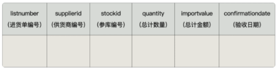
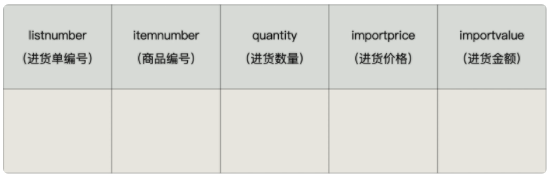

# 前言

在实际开发中，我们经常会遇到这样的情况：有 2 个或者多个相互关联的表，如`商品信息`和`库存信息`分别存放在 2 个不同的数据表中，我们在添加一条新商品记录的时候，为了保证数据的完整性，必须同时在库存表中添加一条库存记录。

这样一来，我们就必须把这两个关联的操作步骤写到程序里面，而且要用`事务`包裹起来，确保这两个操作成为一个`原子操作`，要么全部执行，要么全部不执行。要是遇到特殊情况，可能还需要对数据进行手动维护，这样就很`容易忘记其中的一步`，导致数据缺失。

这个时候，咱们可以使用触发器。 **你可以创建一个触发器，让商品信息数据的插入操作自动触发库存数据的插入操作。** 这样一来，就不用担心因为忘记添加库存数据而导致的数据缺失了。

# 1. 触发器概述

MySQL从`5.0.2`版本开始支持触发器。MySQL的触发器和存储过程一样，都是嵌入到MySQL服务器的一段程序。

触发器是由`事件来触发`某个操作，这些事件包括`INSERT`、`UPDATE`、`DELETE`事件。所谓事件就是指用户的动作或者触发某项行为。如果定义了触发程序，当数据库执行这些语句时候，就相当于事件发生了，就会`自动`激发触发器执行相应的操作。

当对数据表中的数据执行插入、更新和删除操作，需要自动执行一些数据库逻辑时，可以使用触发器来实现。

# 2. 触发器的创建
触发器（Trigger）是一种特殊的存储程序，在 `INSERT`、`UPDATE` 或 `DELETE` 事件发生时自动执行预定义的 SQL 语句。触发器通常用于数据验证、日志记录或自动更新其他表中的数据。


## 🔹 **触发器基本语法解析**
```sql
CREATE TRIGGER 触发器名称 
{BEFORE | AFTER} {INSERT | UPDATE | DELETE} ON 表名 
FOR EACH ROW 
触发器执行的语句块;
```
- **`CREATE TRIGGER 触发器名称`**：定义触发器的名称。
- **`{BEFORE | AFTER}`**：
  - `BEFORE`：在数据修改 **之前** 触发，常用于数据校验或自动填充字段。
  - `AFTER`：在数据修改 **之后** 触发，常用于日志记录或数据同步。
- **`{INSERT | UPDATE | DELETE}`**：
  - `INSERT`：当向表中插入数据时触发。
  - `UPDATE`：当更新数据时触发。
  - `DELETE`：当删除数据时触发。
- **`ON 表名`**：指定要监听的表。
- **`FOR EACH ROW`**：表示 **触发器对表中的每一行数据变化都会执行一次** 。
- **`触发器执行的语句块`**：
  - 可以是单个 SQL 语句
  - 也可以是 `BEGIN...END` 语句块（包含多个 SQL 语句）


## 🔹 **触发器中的特殊变量**
在触发器中，有两个特殊变量可用于访问 **旧数据** 和 **新数据**：
- `NEW`：表示 **新数据**（适用于 `INSERT` 和 `UPDATE`）。
- `OLD`：表示 **旧数据**（适用于 `UPDATE` 和 `DELETE`）。


## 🔹 **触发器实例解析**
### 1️⃣ **在插入数据时自动填充 `created_at` 时间**
**📝 需求：**
假设我们有一个 `users` 表，每次插入新用户时，我们希望自动填充 `created_at` 字段。

**📌 触发器代码：**
```sql
CREATE TRIGGER before_insert_user
BEFORE INSERT ON users
FOR EACH ROW
SET NEW.created_at = NOW();
```
**📌 解析：**
- 触发器名称：`before_insert_user`
- 触发时间：`BEFORE INSERT`
- 触发表：`users`
- `NEW.created_at = NOW();`：在插入数据 **之前** 自动设置 `created_at` 为当前时间。


### 2️⃣ **在更新 `salary` 时，记录历史修改**
**📝 需求：**
我们有一个 `employees` 表，包含员工的 `salary`。每当 `salary` 被修改时，我们希望将旧的薪资记录到 `salary_history` 表。

**📌 `employees` 表结构：**
```sql
CREATE TABLE employees (
    id INT PRIMARY KEY AUTO_INCREMENT,
    name VARCHAR(50),
    salary DECIMAL(10,2)
);
```

**📌 `salary_history` 表结构：**
```sql
CREATE TABLE salary_history (
    id INT PRIMARY KEY AUTO_INCREMENT,
    employee_id INT,
    old_salary DECIMAL(10,2),
    changed_at DATETIME DEFAULT NOW()
);
```

**📌 触发器代码：**
```sql
CREATE TRIGGER after_salary_update
AFTER UPDATE ON employees
FOR EACH ROW
BEGIN
    INSERT INTO salary_history (employee_id, old_salary, changed_at)
    VALUES (OLD.id, OLD.salary, NOW());
END;
```
**📌 解析：**
- 触发器名称：`after_salary_update`
- 触发时间：`AFTER UPDATE`
- 触发表：`employees`
- `OLD.salary`：表示更新前的 `salary`，用于插入 `salary_history` 表。


### 3️⃣ **防止删除 VIP 用户**
**📝 需求：**
`users` 表中包含一个 `is_vip` 字段，我们不希望删除 `is_vip = 1` 的 VIP 用户。

**📌 触发器代码：**
```sql
CREATE TRIGGER before_delete_vip
BEFORE DELETE ON users
FOR EACH ROW
BEGIN
    IF OLD.is_vip = 1 THEN
        SIGNAL SQLSTATE '45000'
        SET MESSAGE_TEXT = '禁止删除 VIP 用户';
    END IF;
END;
```
**📌 解析：**
- `BEFORE DELETE` 触发器：在删除 **之前** 检查是否是 VIP 用户。
- `IF OLD.is_vip = 1 THEN SIGNAL SQLSTATE '45000'`：
  - 如果 `is_vip` 是 1，则触发错误，阻止删除。


## 🔹 **总结**
| 触发器类型 | 适用事件 | 主要作用 |
|------------|---------|---------|
| `BEFORE INSERT` | `INSERT` | 在插入数据前执行，可用于数据校验或填充默认值 |
| `AFTER INSERT` | `INSERT` | 在插入数据后执行，可用于日志记录或数据同步 |
| `BEFORE UPDATE` | `UPDATE` | 在更新前执行，可用于校验数据 |
| `AFTER UPDATE` | `UPDATE` | 在更新后执行，可用于记录旧数据 |
| `BEFORE DELETE` | `DELETE` | 在删除前执行，可用于防止误删数据 |
| `AFTER DELETE` | `DELETE` | 在删除后执行，可用于记录已删除的数据 |

---

# 3. 查看、删除触发器

## 3.1 查看触发器
在 MySQL 中，**触发器（Trigger）** 是在特定的数据库事件（如 `INSERT`、`UPDATE` 或 `DELETE`）发生时自动执行的一组 SQL 语句。为了查看已经存在的触发器，我们可以使用以下几种方式。

### 📌 **方式1：查看当前数据库的所有触发器**
```sql
SHOW TRIGGERS\G
```
✅ **作用**：
- 查询当前数据库中的所有触发器。
- `\G` 作用是以 **纵向格式** 显示结果，方便阅读。

📌 **示例**
假设我们有一个数据库 `company_db`，其中有一个触发器 `before_salary_update`，用于在更新员工薪资之前检查数值。

```sql
SHOW TRIGGERS\G
```
📌 **输出示例**
```
*************************** 1. row ***************************
           Trigger: before_salary_update
           Event: UPDATE
           Table: employees
           Statement: BEGIN IF NEW.salary < 0 THEN SET NEW.salary = 0; END IF; END
           Timing: BEFORE
           Created: NULL
           sql_mode: STRICT_TRANS_TABLES,NO_ENGINE_SUBSTITUTION
           Definer: root@%
           character_set_client: utf8mb4
           collation_connection: utf8mb4_0900_ai_ci
           Database Collation: utf8mb4_0900_ai_ci
```

### 📌 **方式2：查看某个触发器的具体定义**
```sql
SHOW CREATE TRIGGER 触发器名;
```
✅ **作用**：
- 只查看 **某个特定触发器** 的 SQL 语法。

📌 **示例**
```sql
SHOW CREATE TRIGGER before_salary_update;
```
📌 **输出示例**
```
CREATE TRIGGER `before_salary_update` BEFORE UPDATE ON `employees`
FOR EACH ROW BEGIN
    IF NEW.salary < 0 THEN
        SET NEW.salary = 0;
    END IF;
END
```

### 📌 **方式3：从 `information_schema.TRIGGERS` 表中查询**
```sql
SELECT * FROM information_schema.TRIGGERS WHERE TRIGGER_NAME = 'salary_check_trigger';
```
✅ **作用**：
- `information_schema.TRIGGERS` 存储了 **所有数据库的触发器**，可以查询更详细的信息，例如触发的 `TABLE_NAME`、`ACTION_STATEMENT`、`CREATED` 等。

📌 **示例**
```sql
SELECT TRIGGER_NAME, EVENT_MANIPULATION, EVENT_OBJECT_TABLE, ACTION_STATEMENT, ACTION_TIMING 
FROM information_schema.TRIGGERS 
WHERE TRIGGER_NAME = 'before_salary_update';
```
📌 **输出示例**
```
+----------------------+-------------------+----------------+----------------------------------+--------------+
| TRIGGER_NAME        | EVENT_MANIPULATION | EVENT_OBJECT_TABLE | ACTION_STATEMENT              | ACTION_TIMING |
+----------------------+-------------------+----------------+----------------------------------+--------------+
| before_salary_update | UPDATE            | employees      | BEGIN IF NEW.salary < 0 THEN SET NEW.salary = 0; END IF; END | BEFORE        |
+----------------------+-------------------+----------------+----------------------------------+--------------+
```

### ✅ **总结**
| 方法 | 作用 |
|------|------|
| `SHOW TRIGGERS\G` | 查看 **当前数据库的所有触发器** |
| `SHOW CREATE TRIGGER 触发器名;` | 查看 **某个触发器的创建 SQL 语句** |
| `SELECT * FROM information_schema.TRIGGERS;` | **查询系统表**，获取更详细的触发器信息 |

---

## 3.2 删除触发器
在 MySQL 中，**触发器（Trigger）** 是数据库对象之一，如果某个触发器不再需要，可以使用 `DROP TRIGGER` 语句将其删除。

### **📌 删除触发器的语法**
```sql
DROP TRIGGER IF EXISTS 触发器名称;
```
✅ **语法解析**：
- `DROP TRIGGER`：用于删除触发器。
- `IF EXISTS`（可选）：如果触发器 **存在**，则删除；否则不会报错。
- `触发器名称`：指定要删除的触发器名称。


### **📝 示例 1：删除一个存在的触发器**
假设我们在 `company_db` 数据库中有一个触发器 `before_salary_update`，它用于在更新员工薪资之前检查数值：

#### **1️⃣ 查看当前触发器**
```sql
SHOW TRIGGERS\G
```
📌 **输出示例**
```
*************************** 1. row ***************************
           Trigger: before_salary_update
           Event: UPDATE
           Table: employees
           Statement: BEGIN IF NEW.salary < 0 THEN SET NEW.salary = 0; END IF; END
           Timing: BEFORE
```

#### **2️⃣ 删除触发器**
```sql
DROP TRIGGER IF EXISTS before_salary_update;
```
📌 **执行结果**
```
Query OK, 0 rows affected (0.01 sec)
```

#### **3️⃣ 再次检查触发器**
```sql
SHOW TRIGGERS\G
```
📌 **如果触发器已删除，则不会有该触发器的记录**


### **📝 示例 2：尝试删除不存在的触发器**
如果 `before_salary_update` 触发器已经被删除或从未创建，则执行：
```sql
DROP TRIGGER IF EXISTS before_salary_update;
```
✅ **由于 `IF EXISTS` 选项的存在，MySQL 不会报错**，而是简单地返回：
```
Query OK, 0 rows affected (0.00 sec)
```


### **📌 删除触发器的注意事项**
1. **触发器是基于表的**：
   - 不能直接对整个数据库删除触发器，而是针对具体的表。
2. **不能通过 `ALTER TABLE` 删除触发器**：
   - 触发器不像外键约束 (`FOREIGN KEY`) 或默认值 (`DEFAULT`) 可以通过 `ALTER TABLE` 删除。
3. **触发器的权限要求**：
   - 需要 `DROP` 权限才能删除触发器，否则会报权限不足的错误。
4. **删除触发器不会影响已有的数据**：
   - 触发器只影响数据操作（如 `INSERT`、`UPDATE`、`DELETE`），删除触发器不会更改表中的现有数据。


### **✅ 总结**
| 语法 | 作用 |
|------|------|
| `DROP TRIGGER 触发器名称;` | 删除指定的触发器（如果不存在则报错） |
| `DROP TRIGGER IF EXISTS 触发器名称;` | 删除触发器，**如果触发器不存在，则不会报错** |

✅ **一般推荐使用** `IF EXISTS` 选项，以避免误删或删除不存在的触发器时报错。

---

# 4. 触发器的优缺点

## 4.1 优点
### **触发器的优点及示例**

触发器（Trigger）是一种特殊的存储过程，在 **INSERT**、**UPDATE**、**DELETE** 操作触发时自动执行，主要用于数据完整性维护、日志记录和数据合法性检查。


### **1、触发器可以确保数据的完整性**
触发器的一个重要作用是 **自动维护数据一致性**，避免手动更新时数据出现错误。

#### **示例：保持进货单头表与进货明细表的数据一致**
假设有两张表：
- `importhead`（进货单头表）：记录整张订单的汇总信息（总进货数量、总金额）。
    

- `importdetails`（进货单明细表）：记录订单的具体商品信息（商品编号、进货数量、进货价格）。
    

每当 **新增、修改或删除** `importdetails` 中的记录时，我们都需要 **自动更新** `importhead` 表中的 `total_quantity` 和 `total_amount`，确保数据一致。

#### **触发器实现**
```sql
DELIMITER //

CREATE TRIGGER trg_update_importhead
AFTER INSERT ON demo.importdetails
FOR EACH ROW
BEGIN
    -- 更新进货单头表的合计数量和金额
    UPDATE demo.importhead
    SET total_quantity = (
        SELECT SUM(quantity) FROM demo.importdetails WHERE import_id = NEW.import_id
    ),
    total_amount = (
        SELECT SUM(amount) FROM demo.importdetails WHERE import_id = NEW.import_id
    )
    WHERE import_id = NEW.import_id;
END //

DELIMITER ;
```
#### **解释**
- 当 `importdetails` 有新数据插入时，该触发器会 **自动计算** 该 `import_id` 相关的 `quantity` 和 `amount` 的合计值，并更新 `importhead` 表中的 `total_quantity` 和 `total_amount`。
- 这样，`importhead` 表的 **合计数据始终保持正确**。


### **2、触发器可以帮助我们记录操作日志**
触发器可以 **自动记录数据库表的数据变化**，在发生增删改时，记录谁在何时做了什么更改，这对于数据恢复和追踪非常重要。

#### **示例：记录进货明细表的修改日志**
创建 `importdetails_log` 表来记录 `importdetails` 的修改情况：
```sql
CREATE TABLE demo.importdetails_log (
    log_id INT PRIMARY KEY AUTO_INCREMENT,
    import_id INT,
    product_id INT,
    old_quantity INT,
    new_quantity INT,
    old_amount DECIMAL(10,2),
    new_amount DECIMAL(10,2),
    change_time TIMESTAMP DEFAULT CURRENT_TIMESTAMP,
    action VARCHAR(10) -- 'UPDATE' 或 'DELETE'
);
```
创建触发器 **在更新进货明细时记录日志**：
```sql
DELIMITER //

CREATE TRIGGER trg_log_importdetails_update
BEFORE UPDATE ON demo.importdetails
FOR EACH ROW
BEGIN
    INSERT INTO demo.importdetails_log (import_id, product_id, old_quantity, new_quantity, old_amount, new_amount, action)
    VALUES (OLD.import_id, OLD.product_id, OLD.quantity, NEW.quantity, OLD.amount, NEW.amount, 'UPDATE');
END //

DELIMITER ;
```
#### **解释**
- 在 **更新 `importdetails` 之前**，触发器会把 **旧数据和新数据** 记录到 `importdetails_log` 表，方便追踪变化。


### **3、触发器可以用于数据合法性检查**
触发器还可以在 **数据写入前进行验证**，避免错误数据进入数据库。

#### **示例：限制进货价格不能高于零售价格**
假设 `products` 表中有 **商品零售价**：
```sql
CREATE TABLE demo.products (
    product_id INT PRIMARY KEY,
    product_name VARCHAR(100),
    retail_price DECIMAL(10,2) -- 零售价
);
```
我们希望在 `importdetails` 录入商品时，**不能录入高于零售价格的进货价格**：
```sql
DELIMITER //

CREATE TRIGGER trg_check_import_price
BEFORE INSERT ON demo.importdetails
FOR EACH ROW
BEGIN
    DECLARE retail DECIMAL(10,2);
    
    -- 获取商品的零售价
    SELECT retail_price INTO retail FROM demo.products WHERE product_id = NEW.product_id;
    
    -- 检查进货价格是否超出零售价
    IF NEW.price > retail THEN
        SIGNAL SQLSTATE '45000'
        SET MESSAGE_TEXT = '进货价格不能高于零售价';
    END IF;
END //

DELIMITER ;
```
#### **解释**
- `BEFORE INSERT` 触发器在 `importdetails` **插入前** 触发。
- 它会 **查找商品的零售价** 并检查进货价格是否超标。
- 如果进货价格高于零售价，则使用 `SIGNAL` 抛出错误，防止数据写入。


### **总结**
| 触发器功能 | 作用 | 示例 |
|-----------|------|------|
| **确保数据一致性** | 自动更新 `importhead` 总数量与总金额，避免手动更新遗漏 | `AFTER INSERT` 触发器自动更新总计数 |
| **记录操作日志** | 记录 `importdetails` 修改前后的数据 | `BEFORE UPDATE` 触发器记录旧值和新值 |
| **数据合法性检查** | 确保数据符合业务规则，如进货价不能超零售价 | `BEFORE INSERT` 触发器检查价格 |

触发器可以 **减少手动维护的工作量**，**防止错误数据**，**保持数据一致性**，在数据库管理中起着重要作用！ 🚀

---

## 4.2 缺点
### **触发器的缺点及示例**
虽然触发器可以 **自动维护数据完整性** 和 **减少应用层逻辑的复杂度**，但它们也有 **难以维护、调试困难、数据表变更影响等问题**。下面我们通过示例详细解释。


### **1、触发器的可读性差**
触发器 **存储在数据库中**，并且 **自动执行**，不像应用代码那样容易追踪。当触发器出现错误时，可能很难排查出问题的根本原因。

#### **示例：触发器导致的更新失败**
假设有一个 `membermaster`（会员表）：
```sql
CREATE TABLE demo.membermaster (
    memberid INT PRIMARY KEY,
    membername VARCHAR(100),
    memberdeposit DECIMAL(10,2) -- 会员储值金额
);
```
我们在 `membermaster` 表上创建一个 **BEFORE UPDATE** 触发器，用来 **记录会员余额变更**：
```sql
DELIMITER //

CREATE TRIGGER trg_update_memberdeposit
BEFORE UPDATE ON demo.membermaster
FOR EACH ROW
BEGIN
    -- 假设不小心写错了一个字段 'aa'，数据库表中不存在该字段
    INSERT INTO demo.memberlog (memberid, old_deposit, new_deposit, change_time, aa)
    VALUES (OLD.memberid, OLD.memberdeposit, NEW.memberdeposit, NOW(), 'test_value');
END //

DELIMITER ;
```
此时，当我们执行：
```sql
UPDATE demo.membermaster SET memberdeposit = 20 WHERE memberid = 2;
```
就会报错：
```
ERROR 1054 (42S22): Unknown column 'aa' in 'field list'
```
##### **问题分析**
- 触发器里 **写错了一个字段**（`aa`），但 **错误信息只会在 SQL 语句执行时报错**，应用层无法直接看到触发器的错误。
- 由于触发器是 **自动执行** 的，开发人员可能 **不知道触发器存在**，误以为是 `UPDATE` 语句的问题，可能会尝试各种错误的修复方式，比如：
  - 以为 `membermaster` 表缺少 `aa` 字段，并手动添加（但这个字段本不应该存在）。
  - 调试 `UPDATE` 语句，误以为 SQL 语法有问题，而不是触发器出错。
- **调试复杂度高**：因为触发器是数据库内部逻辑，而不是应用代码的一部分，无法通过 **日志** 或 **调试工具** 直接跟踪触发器执行的详细情况。

##### **改进方案**
1. 在创建触发器前，**仔细检查字段名是否正确**。
2. 在应用层 **先测试 SQL 语句**，再加入触发器逻辑。
3. **不要在触发器中进行过多的复杂操作**，可以考虑将记录日志的逻辑放到应用层代码中。


### **2、数据表结构的变更可能导致触发器失效**
触发器依赖于数据库表的结构，一旦表的字段发生变更，就可能导致触发器 **无法正确执行** 或 **影响其他 SQL 操作**。

#### **示例：字段变更导致触发器失效**
假设 `importdetails` 表原本有 `quantity`（进货数量）字段：
```sql
CREATE TABLE demo.importdetails (
    import_id INT,
    product_id INT,
    quantity INT,
    price DECIMAL(10,2),
    amount DECIMAL(10,2),
    PRIMARY KEY (import_id, product_id)
);
```
然后，我们有一个触发器，每次 `INSERT` 进货数据时，会更新 `importhead` 表：
```sql
DELIMITER //

CREATE TRIGGER trg_update_importhead
AFTER INSERT ON demo.importdetails
FOR EACH ROW
BEGIN
    UPDATE demo.importhead
    SET total_quantity = (
        SELECT SUM(quantity) FROM demo.importdetails WHERE import_id = NEW.import_id
    ),
    total_amount = (
        SELECT SUM(amount) FROM demo.importdetails WHERE import_id = NEW.import_id
    )
    WHERE import_id = NEW.import_id;
END //

DELIMITER ;
```
##### **问题出现**
如果 DBA **修改了 `quantity` 字段名称**（例如，改为 `purchase_quantity`）：
```sql
ALTER TABLE demo.importdetails CHANGE COLUMN quantity purchase_quantity INT;
```
然后，触发器仍然尝试 **使用 `quantity` 字段**，导致 SQL 执行失败：
```sql
ERROR 1054 (42S22): Unknown column 'quantity' in 'field list'
```
- 触发器依赖于 `quantity` 字段，现在 `quantity` 已被 `purchase_quantity` 替换，导致触发器报错。
- 在 **应用层代码** 中，**IDE** 和 **静态代码检查** 可以帮助我们发现变量名的变更，但触发器 **存储在数据库中**，**不会有任何警告**，只有在触发执行时才会发现错误。

##### **改进方案**
1. **避免直接修改表字段名**，若必须修改，应先检查是否有触发器依赖该字段：
   ```sql
   SHOW TRIGGERS WHERE Table = 'importdetails';
   ```
2. **使用存储过程** 代替触发器，可以通过应用层控制数据库逻辑。
3. **使用数据库文档** 记录表结构的所有依赖项，包括触发器、存储过程、视图等。


### **总结**
| 触发器缺点 | 问题 | 示例 |
|-----------|------|------|
| **可读性差** | 触发器存储在数据库中，应用层无法直接看到执行逻辑，排查问题困难 | `UPDATE` 会员余额时，触发器错误导致执行失败，开发者误以为 `UPDATE` 语句有问题 |
| **表结构变更可能导致触发器失效** | 触发器依赖字段名，一旦字段变更，触发器可能出错或影响数据更新 | `ALTER TABLE` 修改 `quantity` 字段名后，触发器 `SUM(quantity)` 报错 |

#### **建议**
- **在应用层处理复杂逻辑**，尽量避免在触发器里编写复杂业务逻辑。
- **使用存储过程代替触发器**，这样可以在应用代码中更好地管理和调用。
- **定期检查触发器** 是否依赖于即将变更的数据库字段，以避免因字段变更导致的错误。

尽管触发器有很多优点，但在 **大型系统** 或 **复杂业务逻辑** 中，建议 **减少触发器的使用**，改为 **存储过程或应用层逻辑** 进行替代，以提高可维护性和可读性。 🚀

---

## 4.3 **触发器的注意点：外键约束会影响触发器的触发**
在 **MySQL** 中，如果在 **子表** 中定义了外键约束，并且该外键 **使用了 `ON UPDATE CASCADE`、`ON DELETE CASCADE` 或 `ON DELETE SET NULL`**，那么 **父表** 的 `UPDATE` 或 `DELETE` 操作 **间接导致** 子表的变更时，**子表上的触发器不会被触发**。


### **示例分析**
假设有两个表：
1. **父表** `t_department`（部门表）：包含 `did`（部门编号）。
2. **子表** `t_employee`（员工表）：包含 `did`（部门编号），它是 `t_department.did` 的外键，并且使用了 `ON DELETE SET NULL`。

```sql
CREATE TABLE t_department (
    did INT PRIMARY KEY,
    department_name VARCHAR(100)
);

CREATE TABLE t_employee (
    eid INT PRIMARY KEY,
    ename VARCHAR(100),
    did INT,
    FOREIGN KEY (did) REFERENCES t_department(did) 
    ON DELETE SET NULL
);
```

#### **定义触发器：在 `t_employee` 上的 `DELETE` 触发器**
假设我们要记录 **员工被删除的日志**，在 `t_employee` 表上创建一个 `DELETE` 触发器：
```sql
CREATE TABLE t_employee_log (
    log_id INT PRIMARY KEY AUTO_INCREMENT,
    eid INT,
    ename VARCHAR(100),
    deleted_at TIMESTAMP DEFAULT CURRENT_TIMESTAMP
);

DELIMITER //

CREATE TRIGGER trg_delete_employee
AFTER DELETE ON t_employee
FOR EACH ROW
BEGIN
    INSERT INTO t_employee_log (eid, ename)
    VALUES (OLD.eid, OLD.ename);
END //

DELIMITER ;
```
#### **场景 1：直接删除 `t_employee` 的记录**
如果我们直接删除 `t_employee` 里的数据：
```sql
DELETE FROM t_employee WHERE did = 1;
```
**触发器 `trg_delete_employee` 会被激活**，并且会向 `t_employee_log` 记录被删除的员工。


#### **场景 2：删除 `t_department` 里的部门**
假设 `t_employee` 里有以下数据：
```sql
INSERT INTO t_department (did, department_name) VALUES (1, 'HR');

INSERT INTO t_employee (eid, ename, did) VALUES (101, 'Alice', 1);
```
此时，**`t_employee` 的 `did` 依赖于 `t_department.did`**。

如果我们删除 `t_department` 里的部门：
```sql
DELETE FROM t_department WHERE did = 1;
```
- 由于 `ON DELETE SET NULL` 约束，**MySQL 会自动把 `t_employee.did` 设为 NULL**。
- **但是 `DELETE` 触发器 `trg_delete_employee` 不会被触发**，因为 `t_employee` **并没有真正被 DELETE，只是 `did` 被更新为 NULL**。


### **为什么触发器不会被激活？**
- 触发器 **只会在 `DELETE` 语句直接作用于 `t_employee` 表时触发**。
- 由于 `ON DELETE SET NULL` 是 **外键约束的机制**，它 **不是由 `DELETE FROM t_employee` 直接导致的删除**，因此 **不会触发 `AFTER DELETE` 触发器**。


### **如何改进？**
如果我们想 **在 `t_department` 被删除时，也记录员工信息到日志**，可以使用 **`BEFORE DELETE` 触发器在 `t_department` 上执行**：
```sql
DELIMITER //

CREATE TRIGGER trg_delete_department
BEFORE DELETE ON t_department
FOR EACH ROW
BEGIN
    -- 先把受影响的员工信息记录到日志
    INSERT INTO t_employee_log (eid, ename)
    SELECT eid, ename FROM t_employee WHERE did = OLD.did;
END //

DELIMITER ;
```
#### **改进后的效果**
当我们执行：
```sql
DELETE FROM t_department WHERE did = 1;
```
- **先** 触发 `trg_delete_department`，在 `t_employee_log` 记录员工信息。
- **然后** `ON DELETE SET NULL` 机制会把 `t_employee.did` 设为 `NULL`。

这样，即使 `t_employee` 的 `DELETE` 触发器不会触发，我们仍然可以 **在 `t_department` 触发器里主动记录员工信息**，保证数据一致性。


### **总结**
| 触发器注意点 | 说明 | 解决方案 |
|-------------|------|---------|
| **外键 `ON DELETE CASCADE/SET NULL` 不会触发子表的 `DELETE` 触发器** | 如果 `t_department` 里的 `did` 被删除，`t_employee` 的 `did` 会变成 `NULL`，但不会触发 `t_employee` 的 `DELETE` 触发器 | 在 `t_department` 上创建 `BEFORE DELETE` 触发器，手动记录日志 |
| **外键 `ON UPDATE CASCADE` 也不会触发子表的 `UPDATE` 触发器** | `t_department.did` 变更时，`t_employee.did` 也会变更，但不会触发 `t_employee` 的 `UPDATE` 触发器 | 在 `t_department` 上创建 `BEFORE UPDATE` 触发器，手动执行额外逻辑 |
| **触发器仅在直接作用于表的 SQL 语句时才会触发** | 触发器不会被 `CASCADE` 或 `SET NULL` 机制间接触发 | 适当使用存储过程或应用层逻辑避免依赖触发器 |


### **最佳实践**
1. **避免对外键 `CASCADE` 依赖触发器**，如果要确保触发器执行，应该 **手动删除或更新数据**。
2. **如果确实需要记录级联删除的影响**，可以在 **父表的 `BEFORE DELETE` 触发器** 里记录相关数据。
3. **考虑使用存储过程** 代替 `CASCADE` 机制，这样可以更好地控制触发器的执行。

这种设计可以避免 `CASCADE` 影响数据一致性，并且能保证 **所有相关逻辑都在触发器或存储过程中得到执行**。🚀

---