# 1. 安装前说明
## 1.1 Linux 系统及工具的准备
- 安装并启动号俩台虚拟机：Centos 7

- 掌握克隆虚拟机的操作
    - mac 地址的修改
    - 主机名的修改
    - ip 地址的修改
    - uuid 的修改

- 安装 Xshell 和 Xftp 等访问 Centos 系统的工具
- Centos6 和 Centos7 在 MySql 的使用中的区别
    ```
    1、防火墙:6是iptables，7是firewalld
    2、启动服务的命令:6是service，7是systemctl
    ```

## 1.2 查看是否安装过 MySQL
##### 如果你是用rpm安装, 检查一下RPM PACKAGE：
```shell
rpm -qa | grep -i mysql # -i 忽略大小写
```

##### 检查mysql service：
```shell
systemctl status mysqld.service
```

##### 如果存在mysql-libs的旧版本包，显示如下：
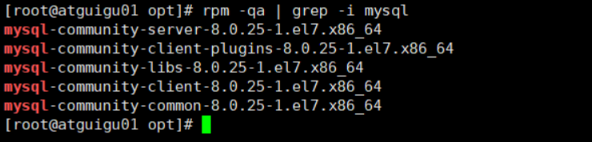

##### 如果不存在mysql-lib的版本，显示如下：


## 1.3 MySQL的卸载

##### 关闭 mysql 服务
```shell
systemctl stop mysqld.service
```

##### 查看当前 mysql 安装状况
```shell
rpm -qa | grep -i mysql
# 或
yum list installed | grep mysql
```

##### 卸载上述命令查询出的已安装程序
```shell
yum remove mysql-xxx mysql-xxx mysql-xxx mysqk-xxxx
```
> 务必卸载干净，反复执行rpm -qa | grep -i mysql确认是否有卸载残留

##### 删除 mysql 相关文件
- 查找相关文件
    ```shell
    find / -name mysql
    ```
- 删除上述命令查找出的相关文件
    ```shell
    rm -rf xxx
    ```

##### 删除 my.cnf
```shell
rm -rf /etc/my.cnf
```

# 2. MySQL的Linux版安装
## 2.1 MySQL的4大版本
> **4大版本**
> - **MySQL Community Server 社区版本:** 开源免费，自由下载，但不提供官方技术支持，适用于大多数普通用户。
> - **MySQL Enterprise Edition 企业版本:** 需付费，不能在线下载，可以试用30天。提供了更多的功能和更完备的技术支持，更适合于对数据库的功能和可靠性要求较高的企业客户。
> - **MySQL Cluster 集群版:** 开源免费。用于架设集群服务器，可将几个MySQL Server封装成一个Server。需要在社区版或企业版的基础上使用。
> - **MySQL Cluster CGE 高级集群版:** 需付费

> 此外，官方还提供了 MySQL Workbench （GUITOOL）一款专为 MySQL 设计的 ER/数据库建模工具 。它是著名的数据库设计工具DBDesigner4的继任者。MySQLWorkbench又分为两个版本，分别是 社区版（MySQL Workbench OSS）、 商用版 （MySQL WorkbenchSE）。

## 2.2 下载MySQL指定版本
> **下载地址:** 官网：https://www.mysql.com

### 2.2.1 Windows下安裝 MySQL

- 打开官网，点击DOWNLOADS，然后，点击 MySQL Community(GPL) Downloads
    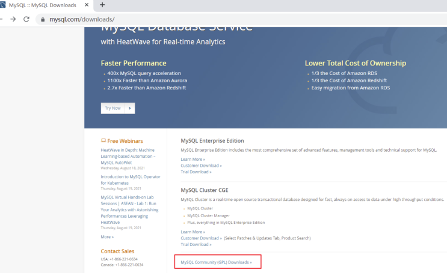

- 点击 MySQL Community Server
    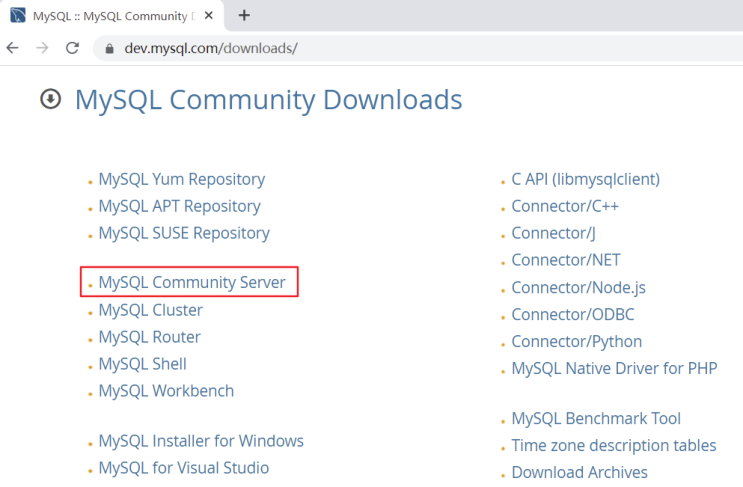

- 在General Availability(GA) Releases中选择适合的版本
    - 如果安装Windows 系统下MySQL ，推荐下载 MSI安装程序 ；点击 Go to Download Page 进行下载即可
    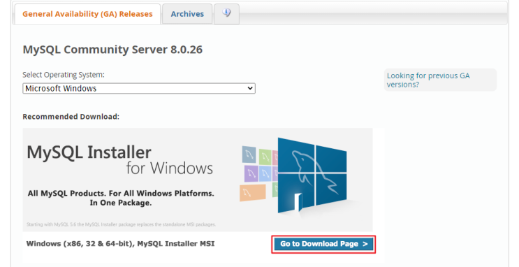

> **Windows下的MySQL安装有两种安装程序**
> - mysql-installer-web-community-8.0.25.0.msi 下载程序大小：2.4M；安装时需要联网安装组件。
> - mysql-installer-community-8.0.25.0.msi 下载程序大小：435.7M；安装时离线安装即可。推荐。

### 2.2.2 Linux系统下安装MySQL的几种方式
> Linux系统下安装软件的常用三种方式：

#### 方式1：rpm命令
> 使用 rpm 命令安装扩展名为 ".rpm" 的软件包。
> - .rpm 包的一般格式
> - 

#### 方式2：yum命令
> 需联网，从互联网获取的yum源，直接使用yum命令安装。

#### 方式3：编译安装源码包
> 针对 **tar.gz** 这样的压缩格式，要用tar命令来解压；如果是其它压缩格式，就使用其它命令。

#### Linux系统下安装MySQL，官方给出多种安装方式
- 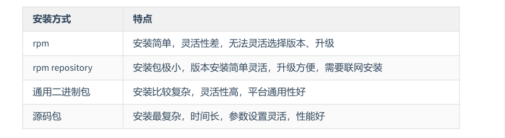
- 这里不能直接选择CentOS 7系统的版本，所以选择与之对应的 Red Hat Enterprise Linux
- https://downloads.mysql.com/archives/community/ 直接点Download下载RPM Bundle全量
包。包括了所有下面的组件。不需要一个一个下载了。
- 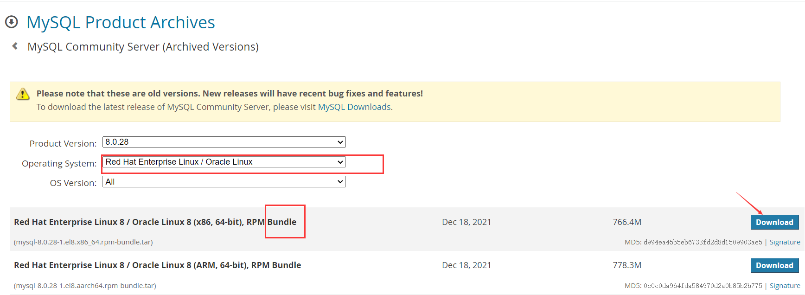

#### 下载的tar包，用压缩工具打开
- 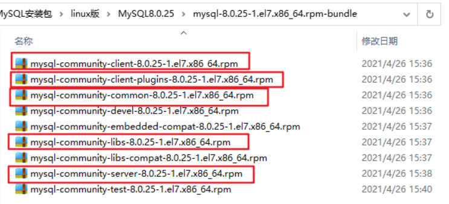

## 2.3 CentOS7下检查MySQL依赖
### 检查/tmp临时目录权限（必不可少）
> 由于mysql安装过程中，会通过mysql用户在/tmp目录下新建tmp_db文件，所以请给/tmp较大的权限。执行 ：

```shell
chmod -R 777 /tmp
```

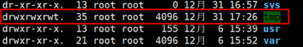

### 安装前，检查依赖
```shell
rpm -qa|grep libaio
rpm -qa|grep net-tools
```

- 如果存在libaio包如下：
    

- 如果存在net-tools包如下：
    

> 如果不存在需要到centos安装盘里进行rpm安装。安装linux如果带图形化界面，这些都是安装好的。

#### ✅ `rpm -qa | grep libaio`

這行的意思是：

- `rpm -qa`：列出所有已安裝的 RPM 套件（q = query，a = all）。
- `grep libaio`：過濾出名稱中包含 `libaio` 的套件。

##### 🔍 為什麼檢查 `libaio`？
MySQL（特別是使用 RPM 安裝的版本）在執行期間需要 **非同步 I/O 函式庫（`libaio`）** 來提高磁碟存取效能。如果系統沒有安裝 `libaio`，MySQL 安裝時會出錯，或啟動失敗。

👉 所以這個指令是「**確認是否已安裝 libaio**」的動作。  
若查無結果，通常會建議執行：
```bash
sudo yum install libaio
```

---

#### ✅ `rpm -qa | grep net-tools`

這行的意思是：

- `rpm -qa`：列出所有安裝的套件。
- `grep net-tools`：過濾出名稱中含有 `net-tools` 的套件。

##### 🔍 為什麼檢查 `net-tools`？
`net-tools` 是一組網路相關的工具套件，包含常見的指令像是：

- `ifconfig`：檢查網卡資訊
- `netstat`：查看連接埠、網路狀態
- `route`：查看路由表

這些工具對於伺服器管理者在設定、排錯 MySQL 網路連線時（例如：確認 MySQL 是否在監聽指定埠口）很有用。

👉 所以這個指令是「**確認是否具備網路工具**」。若沒有的話可以執行：
```bash
sudo yum install net-tools
```

---

#### ✅ 小結

| 指令 | 用途 | 重要原因 |
|------|------|-----------|
| `rpm -qa | grep libaio` | 檢查是否安裝 `libaio` 函式庫 | MySQL 執行依賴 |
| `rpm -qa | grep net-tools` | 檢查是否安裝網路工具套件 | 排查連線問題 |

## 2.4 CentOS7下MySQL安装过程

### 将安装程序拷贝到/opt目录下
> 在mysql的安装文件目录下执行：（必须按照顺序执行）
```shell
rpm -ivh mysql-community-common-8.0.25-1.el7.x86_64.rpm 
rpm -ivh mysql-community-client-plugins-8.0.25-1.el7.x86_64.rpm 
rpm -ivh mysql-community-libs-8.0.25-1.el7.x86_64.rpm 
rpm -ivh mysql-community-client-8.0.25-1.el7.x86_64.rpm 
rpm -ivh mysql-community-server-8.0.25-1.el7.x86_64.rpm
```

> ⚠️在安裝 `mysql-community-server` 前，**必須先確保系統上已安裝它所依賴的套件（依賴環境）**，否則會在安裝時發生錯誤，導致安裝失敗。

- rpm 是 Redhat Package Manage 缩写，通过 RPM 的管理，用户可以把源代码包装成以rpm为扩展名的文件形式，易于安装。
- **-i:** install 安装软件包
- **-v:** verbose 提供更多的详细信息输出
- **-h:** hash 软件包安装的时候列出哈希标记 (和 -v 一起使用效果更好)，展示进度条

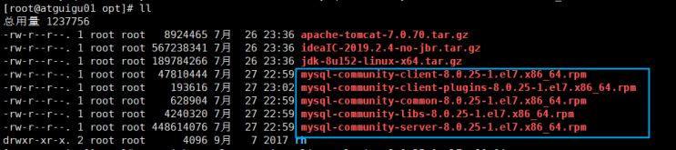

#### 在你安裝 `mysql-community-server` 前，**必須先確保系統上已安裝它所依賴的套件（依賴環境）**，否則會在安裝時發生錯誤，導致安裝失敗。
##### 更具體地說明：

MySQL 的 RPM 安裝方式，這幾個 `.rpm` 套件之間是有依賴關係的。舉例來說：

- `mysql-community-server` **依賴**：
  - `mysql-community-client`
  - `mysql-community-libs`
  - `mysql-community-client-plugins`
  - `mysql-community-common`

所以你必須先按順序安裝前面這些元件（common → plugins → libs → client），**才能**安裝 `mysql-community-server`。

如果你直接跳過前面的步驟去安裝 `mysql-community-server`，但系統缺少這些依賴元件，就會報出錯誤，例如：

```bash
error: Failed dependencies:
    mysql-community-client is needed by mysql-community-server-8.0.25-1.el7.x86_64
    mysql-community-common is needed by mysql-community-client...
```

---

##### 對應這句的重點：

| 原文 | 說明 |
|------|------|
| 没有检查mysql依赖环境 | 指的是沒有事先安裝好需要的依賴（common, libs, client等） |
| 安装mysql-community-server会报错 | 最終安裝 `server` 這個主套件時會因依賴缺失而失敗 |

---

##### 建議補充步驟：
在安裝前，可以執行下列指令來檢查相關依賴是否存在：

```bash
rpm -qa | grep mysql
```

或使用這些工具檢查系統依賴：

```bash
rpm -qpR mysql-community-server-8.0.25-1.el7.x86_64.rpm
```

這會列出這個套件所需要的依賴清單。

---


## 2.5 安装过程截图
- 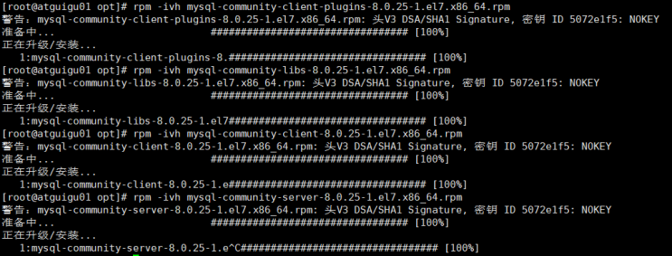

### 安装过程中可能的报错信息：
- 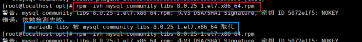
> 一个命令：`yum remove mysql-libs` 解决，清除之前安装过的依赖即可

###  查看MySQL版本
```shell
mysql --version 
#或
mysqladmin --version
```

### 服务的初始化
> 为了保证数据库目录与文件的所有者为 mysql 登录用户，如果你是以 root 身份运行 mysql 服务，需要执行下面的命令初始化：

```shell
mysqld --initialize --user=mysql
```

> 说明： --initialize 选项默认以 **安全** 模式来初始化，则会为 root 用户生成一个密码并将该密码标记为过期，登录后你需要设置一个新的密码。生成的临时密码会往日志中记录一份。

#### 查看密码：
```shell
cat /var/log/mysqld.log
```

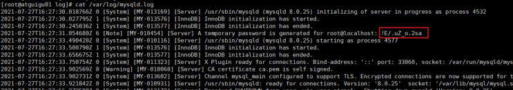

> root@localhost: 后面就是初始化的密码

### 启动MySQL，查看状态

```shell
#加不加.service后缀都可以 
启动：systemctl start mysqld.service 
关闭：systemctl stop mysqld.service 
重启：systemctl restart mysqld.service 
查看状态：systemctl status mysqld.service
```

> mysqld 这个可执行文件就代表着 MySQL 服务器程序，运行这个可执行文件就可以直接启动一个服务器进程。

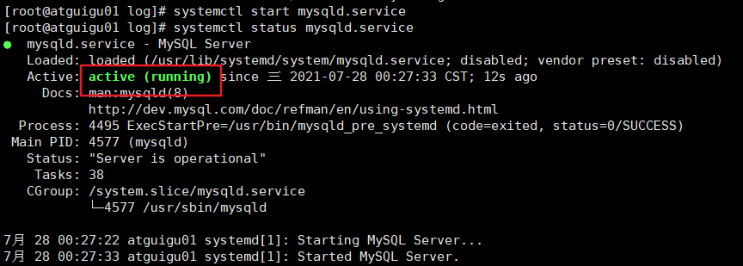

#### 查看进程:
```shell
ps -ef | grep -i mysql
```

### 查看MySQL服务是否自启动
```shell
systemctl list-unit-files|grep mysqld.service
```


> 默认是 enabled。

- 如不是enabled可以运行如下命令设置自启动
    ```shell
    systemctl enable mysqld.service
    ```
    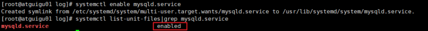

- 如果希望不进行自启动，运行如下命令设置
    ```shell
    systemctl disable mysqld.service
    ```
    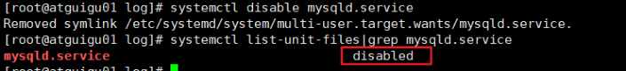

# 3. MySQL登录
## 3.1 首次登录
> 通过 `mysql -hlocalhost -P3306 -uroot -p` 进行登录，在Enter password：录入初始化密码

## 3.2 修改密码
- 当查看数据时show databases，报错;因为初始化密码默认是过期的，所以查看数据库会报错
- 修改密码：
    ```sql
    ALTER USER 'root'@'localhost' IDENTIFIED BY 'new_password';
    ```

- 5.7版本之后（不含5.7），mysql加入了全新的密码安全机制。设置新密码太简单会报错。
    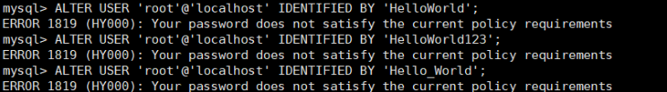

- 改为更复杂的密码规则之后，设置成功，可以正常使用数据库了
    

## 3.3 设置远程登录
> **当前问题:**
> - 在用SQLyog或Navicat中配置远程连接Mysql数据库时遇到如下报错信息，这是由于Mysql配置了不支持远程连接引起的。
> - 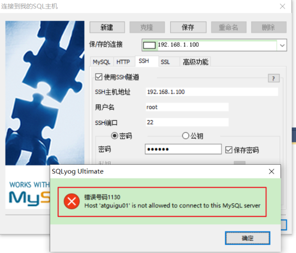
> - 要讓 MySQL 支援遠程連接，需完成以下幾個步驟來進行設定與授權。

### ✅ 1. 修改 MySQL 設定檔（`my.cnf` 或 `my.ini`）

##### Linux（通常為 `/etc/mysql/my.cnf` 或 `/etc/my.cnf`）

打開設定檔，找到以下段落：
```ini
[mysqld]
bind-address = 127.0.0.1
```

將 `127.0.0.1` 改為：
- `0.0.0.0` 表示允許所有 IP 連線
- 或填寫特定 IP 例如 `192.168.1.100` 表示只允許這個 IP 連線

範例：
```ini
[mysqld]
bind-address = 0.0.0.0
```

儲存並關閉。

##### Windows（通常為 `C:\ProgramData\MySQL\MySQL Server X.X\my.ini`）

做法一樣：找到 `bind-address`，設為 `0.0.0.0` 或指定 IP。

---

### ✅ 2. 開啟防火牆（或雲端安全群組）端口

MySQL 預設使用的 port 是 `3306`。

你需要在伺服器上：
- **開啟防火牆 port 3306**
- **雲端平台（如 AWS、GCP、阿里雲）需在安全群組中允許對應 IP 的 3306 port 通訊**

---

### ✅ 3. 建立允許遠端連接的 MySQL 使用者帳號

登入 MySQL：
```bash
mysql -u root -p
```

建立一個允許遠端的帳號或修改原有帳號授權：

##### 方法一：允許任意 IP 登入（不安全）
```sql
CREATE USER 'your_user'@'%' IDENTIFIED BY 'your_password';
GRANT ALL PRIVILEGES ON *.* TO 'your_user'@'%' WITH GRANT OPTION;
FLUSH PRIVILEGES;
```

##### 方法二：僅允許特定 IP
```sql
CREATE USER 'your_user'@'192.168.1.50' IDENTIFIED BY 'your_password';
GRANT ALL PRIVILEGES ON *.* TO 'your_user'@'192.168.1.50' WITH GRANT OPTION;
FLUSH PRIVILEGES;
```

---

### ✅ 4. 重新啟動 MySQL 服務

##### Linux：
```bash
sudo systemctl restart mysql
```
或
```bash
sudo service mysql restart
```

##### Windows：
可在「服務管理」中重新啟動 MySQL。

---

### ✅ 5. 測試連線（如使用 SQLyog、Navicat）

填寫連線資訊：
- 主機名（Host）：伺服器 IP
- 使用者名稱
- 密碼
- port：3306

---

### ✅ 附註安全提醒

- **不要將 root 使用者暴露給遠端**，請創建單獨的帳號。
- 若一定要允許 root 遠端連接，務必設定強密碼並限制 IP。
- 建議使用 VPN 或 SSH 隧道加密連線。

---

## 3.4 Linux下修改配置

### 在Linux系统MySQL下测试：
```sql
use mysql;
select Host,User from user;
```
- 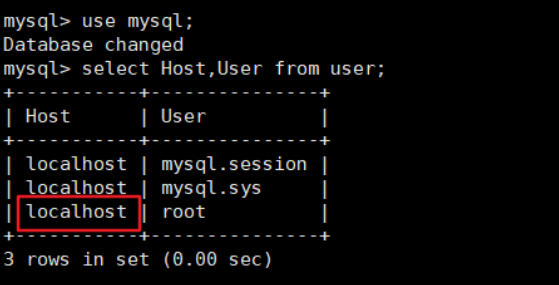
> 可以看到root用户的当前主机配置信息为localhost。

### 修改Host为通配符%
> Host列指定了允许用户登录所使用的IP，比如 user=root Host=192.168.1.1。这里的意思就是说root用户只能通过192.168.1.1的客户端去访问。 user=root Host=localhost，表示只能通过本机客户端去访问。而 % 是个通配符 ，如果Host=192.168.1.%，那么就表示只要是IP地址前缀为“192.168.1.”的客户端都可以连接。如果 Host=% ，表示所有IP都有连接权限。

> ⚠️在生产环境下不能为了省事将host设置为%，这样做会存在安全问题，具体的设置可以根据生|产环境的IP进行设置。

```sql
update user set host = '%' where user ='root';
```
Host 设置了 **%** 后便可以允许远程访问。

Host 修改完成后记得执行 **flush privileges**使配置立即生效：

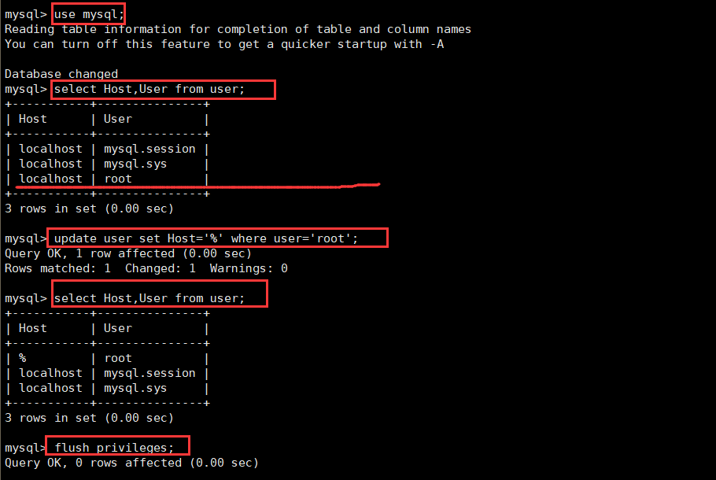

### 测试
- 如果是 MySQL5.7 版本，接下来就可以使用SQLyog或者Navicat成功连接至MySQL了。

##### 如果是 MySQL8 版本，连接时还会出现如下问题：
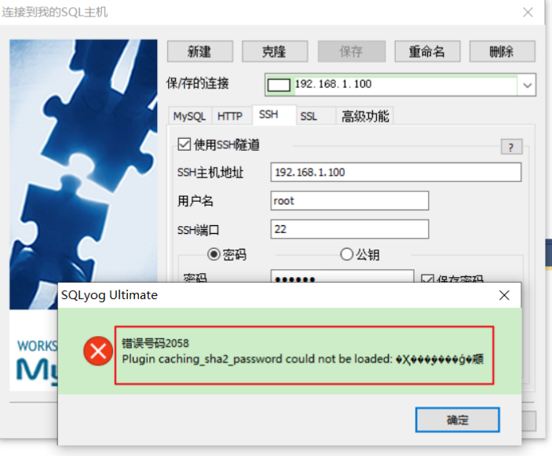

> 配置新连接报错：错误号码 2058，分析是 mysql 密码加密方法变了。

- **解决方法一：** 升级远程连接工具版本

- **解决方法二：**
    ```sql
    ALTER USER 'root'@'%' IDENTIFIED WITH mysql_native_password BY 'abc123';
    ```

# 4. MySQL8的密码强度评估（了解）
## 4.1 MySQL不同版本设置密码(可能出现)
> 當你在 **MySQL 不同版本中設定密碼** 時，會遇到一些差異，特別是在 **MySQL 8.0** 對密碼強度有更嚴格的要求。

### 4.1.1 MySQL5.7中：成功
```shell
mysql> alter user 'root' identified by 'abcd1234';
Query OK, 0 rows affected (0.00 sec)
```

#### 4.1.1.1 ✅ MySQL 5.7 成功原因：

在 **MySQL 5.7** 中，預設的密碼強度政策較寬鬆。如果沒有安裝 `validate_password` 插件，幾乎可以設定任意密碼格式。

若有安裝 `validate_password` 插件，密碼規則會受到以下變數影響：

```sql
SHOW VARIABLES LIKE 'validate_password%';
```

其中：
- `validate_password_policy`（0-2，LOW/MEDIUM/STRONG）
- `validate_password_length`
- `validate_password_mixed_case_count`
- `validate_password_number_count`
- `validate_password_special_char_count`

預設為 `MEDIUM`，要求密碼至少包含：
- 8 個字元
- 大小寫英文字母
- 數字

不過，可以手動調整這些設定來放寬限制。

### 4.3.2 MySQL8.0中：失败
```shell
mysql> alter user 'root' identified by 'abcd1234'; 
ERROR 1819 (HY000): Your password does not satisfy the current policy requirements
```

#### 4.3.2.1 ❌ MySQL 8.0 錯誤原因與解法：

在 **MySQL 8.0**，`validate_password` 插件會 **預設啟用**，而且密碼強度政策通常更嚴格，導致你使用的密碼如 `'abcd1234'` 無法通過驗證。

出現錯誤：

```sql
ERROR 1819 (HY000): Your password does not satisfy the current policy requirements
```

#### 4.3.2.2 ✅ 解法一：改用更強的密碼
建議使用符合 `MEDIUM` 或 `STRONG` 政策的密碼，例如：

```sql
ALTER USER 'root'@'localhost' IDENTIFIED BY 'HelloWorld_123';
```

這個密碼符合：
- 至少8個字元
- 有大小寫
- 含數字
- 含特殊符號（如 `_`）

#### 4.3.2.3 ✅ 解法二：暫時降低密碼強度要求（不推薦於正式環境）
若只是本機測試環境，你可以調整密碼政策來放寬限制：

```sql
-- 降低密碼策略為 LOW
SET GLOBAL validate_password.policy = LOW;

-- 降低最小密碼長度
SET GLOBAL validate_password.length = 6;
```

然後再執行：

```sql
ALTER USER 'root'@'localhost' IDENTIFIED BY 'abcd1234';
```

---

#### 4.3.2.4 🔍 查看密碼政策與插件狀態

- 查看插件是否啟用：

```sql
SHOW PLUGINS;
```

- 若想卸載密碼驗證插件（MySQL 8.0）：

```sql
UNINSTALL COMPONENT 'file://component_validate_password';
```

---

## 4.2 MySQL8之前的安全策略
> 當你在使用 MySQL 8.0（或更早版本）時，為了強化使用者帳號的密碼安全性，MySQL 提供了 `validate_password` 插件，來**檢查密碼強度是否符合安全策略**。以下我將從補充說明與實際操作範例，幫你完整解析這項功能。

### 4.2.1 🔐 為什麼使用 `validate_password` 插件？

使用者設定簡單密碼（如 `123456`）將容易被暴力破解。為了提升安全性，MySQL 提供 `validate_password` 插件，它可根據以下**策略檢查密碼強度**：

- **長度**（如最少8位）
- **複雜性**（是否包含大寫、小寫、數字、特殊字元）
- **是否為常見密碼**

### 4.2.2 🔧 方式一：修改參數檔（**較強制方式**）
在 MySQL 配置檔 `my.cnf` 或 `my.ini` 中加入以下內容：

```ini
[mysqld]
plugin-load-add=validate_password.so
validate-password=FORCE_PLUS_PERMANENT
```

#### 4.2.2.1 補充說明：

| 項目 | 說明 |
|------|------|
| `plugin-load-add` | 指定要載入的插件檔案（Linux是 `.so`，Windows 是 `.dll`） |
| `validate-password=FORCE_PLUS_PERMANENT` | 強制且永久使用該插件，参数FORCE_PLUS_PERMANENT是为了防止插件在MySQL运行时的时候被卸载。当你卸载插件时就会报错 |

> 修改完畢後需 **重啟 MySQL 服務** 才會生效。

```bash
# Linux 重啟方式（視作業系統而異）
sudo systemctl restart mysqld
```

#### 4.2.2.2 查看目前插件狀態：

```sql
SELECT PLUGIN_NAME, PLUGIN_LIBRARY, PLUGIN_STATUS, LOAD_OPTION
FROM INFORMATION_SCHEMA.PLUGINS
WHERE PLUGIN_NAME = 'validate_password';
```

🔒 若為 `FORCE_PLUS_PERMANENT`，嘗試卸載將出現錯誤：

```sql
UNINSTALL PLUGIN validate_password;
-- ERROR 1702 (HY000): Plugin 'validate_password' is force_plus_permanent and can not be unloaded
```

---

當你在 `my.cnf` 中設定 `validate-password=ON/OFF/FORCE/FORCE_PLUS_PERMANENT` 時，這個參數實際是控制 **MySQL 啟動時是否載入 `validate_password` 插件**，以及是否允許在運行中卸載該插件。下面我會逐一解釋這四個選項的差異，並附上例子方便理解。

---

#### 4.3.2.3 🔍 `validate-password` 的四種選項說明

| 選項 | 說明 | 是否可在執行中卸載 | 是否強制啟用 |
|------|------|------------------------|----------------|
| `OFF` | 不載入該插件（預設狀態） | 不適用 | 否 |
| `ON` | 啟用該插件，但可在執行中卸載 | ✅ 是 | 否 |
| `FORCE` | 啟用插件且強制使用，但可卸載 | ✅ 是 | ✅ 是 |
| `FORCE_PLUS_PERMANENT` | 啟用插件、強制使用，**不可卸載** | ❌ 否 | ✅ 是（最強制） |

---

##### 4.3.2.3.1 ✅ `OFF`（關閉）

- 不會載入 `validate_password` 插件
- 使用者可設定任意弱密碼
- 不進行任何密碼檢查

📌 適合在不需要密碼策略的開發環境使用。

---

##### 4.3.2.3.2 ✅ `ON`（啟用，但可卸載）

- 啟動時載入插件
- 運行中可用 `UNINSTALL PLUGIN` 卸載
- 密碼會根據預設策略檢查強度（可用 `SHOW VARIABLES LIKE 'validate_password%'` 查看）

📌 適合需要彈性測試或臨時開啟密碼檢查功能的環境。

---

##### 4.3.2.3.3 ✅ `FORCE`（強制啟用，但仍可卸載）

- 密碼策略啟用且強制執行
- 若密碼不合格，則無法建立或修改帳號
- **允許執行中卸載**

📌 適合安全性要求中等的環境，例如內部測試伺服器。

---

##### 4.3.2.3.4 🔒 `FORCE_PLUS_PERMANENT`（最強制，**不可卸載**）

- 啟用並永久強制執行密碼策略
- **不可被卸載**（會報錯 `ERROR 1702`）
- 用於高安全性環境，如線上伺服器

📌 建議實際部署生產環境使用。

---

##### 4.3.2.3.5 🔧 範例：my.cnf 設定方式

```ini
[mysqld]
plugin-load-add=validate_password.so
validate-password=FORCE_PLUS_PERMANENT
```

重啟 MySQL 後，驗證插件狀態：

```sql
SELECT PLUGIN_NAME, PLUGIN_STATUS, LOAD_OPTION
FROM INFORMATION_SCHEMA.PLUGINS
WHERE PLUGIN_NAME = 'validate_password';
```

結果應顯示：

```text
| validate_password | ACTIVE | FORCE_PLUS_PERMANENT |
```

若你嘗試卸載：

```sql
UNINSTALL PLUGIN validate_password;
-- ERROR 1702 (HY000): Plugin 'validate_password' is force_plus_permanent and can not be unloaded
```

---

##### 4.3.2.3.6 📘 總結比較

| 模式 | 是否啟用密碼驗證 | 可否卸載 | 適用情境 |
|------|-------------------|-----------|-----------|
| OFF | ❌ | - | 不需要驗證策略 |
| ON | ✅ | ✅ | 測試或開發環境 |
| FORCE | ✅（強制） | ✅ | 中等安全需求 |
| FORCE_PLUS_PERMANENT | ✅（強制） | ❌ | 嚴格生產環境 |

---

### 4.2.3 🧪 方式二：執行時安裝（**較彈性、推薦**）

不需修改設定檔，直接執行安裝命令：

```sql
INSTALL PLUGIN validate_password SONAME 'validate_password.so';
```

⚠️ **此方式也會寫入到 `mysql.plugin` 表中，因此重啟 MySQL 後仍會自動載入。**

> 若是 Windows，則將 `'validate_password.so'` 改為 `'validate_password.dll'`。

---

### 4.2.4 💡 實際範例：驗證密碼強度

假設目前啟用了 `validate_password` 插件。

#### 4.2.4.1 1️⃣ 嘗試設定弱密碼（失敗）

```sql
ALTER USER 'root'@'localhost' IDENTIFIED BY 'abcd1234';
-- ERROR 1819 (HY000): Your password does not satisfy the current policy requirements
```

#### 4.2.4.2 2️⃣ 改用強密碼（成功）

```sql
ALTER USER 'root'@'localhost' IDENTIFIED BY 'HelloWorld_123';
-- Query OK, 0 rows affected (0.00 sec)
```

這表示密碼至少包含：
- 大寫 + 小寫字母
- 數字
- 特殊字元（如 `_`）

---

### 4.2.5 🔧 可調整的策略參數

你也可以根據需要調整密碼策略，例如透過以下命令查詢預設設定：

```sql
SHOW VARIABLES LIKE 'validate_password%';
```

結果示例：

| 變數名稱 | 說明 | 預設值 |
|----------|------|--------|
| `validate_password.length` | 密碼最小長度 | 8 |
| `validate_password.mixed_case_count` | 大小寫字母個數 | 1 |
| `validate_password.number_count` | 至少幾個數字 | 1 |
| `validate_password.special_char_count` | 至少幾個特殊字元 | 1 |
| `validate_password.policy` | 安全策略等級（0: LOW, 1: MEDIUM, 2: STRONG） | 1 |

可透過以下方式修改，例如：

```sql
SET GLOBAL validate_password.length = 12;
SET GLOBAL validate_password.policy = 2;
```

> 注意：這些設定只在目前實例中有效，重啟後會還原，需寫入 `my.cnf` 內才會永久生效。

---

## 4.3 MySQL8的安全策略

### 4.3.1 validate_password说明
#### 4.3.1.1 MySQL 8.0 的改變重點
> MySQL 8.0 開始引入 **Component 組件架構** 後，`validate_password` 不再是傳統插件，而是以 **伺服器組件 (Server Component)** 的方式實現。

- **MySQL 5.7 以前**：
  - `validate_password` 是一個「插件 (Plugin)」，以 `validate_password.so` 或 `validate_password.dll` 存在。
  - 使用 `INSTALL PLUGIN validate_password SONAME 'validate_password.so';` 安裝。

- **MySQL 8.0 開始**（尤其 8.0.25 後）：
  - 改為使用「**Component**」機制來實作。
  - 新增 `mysql.component` 表來管理安裝的元件。
  - 透過 `INSTALL COMPONENT 'file://component_validate_password';` 安裝。

---

#### 4.3.1.2 📌 安裝前（未安裝組件）：
```sql
mysql> SHOW VARIABLES LIKE 'validate_password%';
-- ➜ Empty set，表示尚未啟用密碼強度策略

mysql> SELECT * FROM mysql.component;
-- ➜ 報錯：Table 'mysql.component' doesn't exist
```

- **說明**：此時組件系統尚未初始化（可能是舊版本或未啟用組件系統）。

---

#### 4.3.1.3 📌 安裝後：
```sql
mysql> INSTALL COMPONENT 'file://component_validate_password';
```

##### 安裝成功後結果：
```sql
mysql> SELECT * FROM mysql.component;
+--------------+--------------------+------------------------------------+
| component_id | component_group_id | component_urn                      |
+--------------+--------------------+------------------------------------+
|       1      |          1         | file://component_validate_password |
+--------------+--------------------+------------------------------------+
```

```sql
mysql> SHOW VARIABLES LIKE 'validate_password%';
+--------------------------------------+--------+
| Variable_name                        | Value  |
+--------------------------------------+--------+
| validate_password.check_user_name    | ON     |
| validate_password.dictionary_file    |        |
| validate_password.length             | 8      |
| validate_password.mixed_case_count   | 1      |
| validate_password.number_count       | 1      |
| validate_password.policy             | MEDIUM |
| validate_password.special_char_count | 1      |
+--------------------------------------+--------+
```

---

#### 4.3.1.4 常見設定說明（MySQL 8.0 組件版）

| 參數名稱                          | 功能說明 |
|-------------------------------|---------|
| `validate_password.length`             | 密碼最小長度（預設 8） |
| `validate_password.mixed_case_count`   | 大小寫字母至少各幾個（預設 1） |
| `validate_password.number_count`       | 至少幾個數字（預設 1） |
| `validate_password.special_char_count` | 至少幾個特殊符號（預設 1） |
| `validate_password.policy`             | 密碼強度級別：LOW、MEDIUM、STRONG |
| `validate_password.check_user_name`    | 是否禁止密碼與用戶名相似 |

> 提示：组件和插件的默认值可能有所不同。例如，MySQL 5.7. validate_password_check_user_name的默认值为OFF。

---

#### 4.3.1.5 密碼強度策略範例

若設定如下：
```ini
validate_password.length = 10
validate_password.policy = STRONG
```

則下面這些密碼的通過情況如下：

| 密碼             | 結果   | 原因                       |
|------------------|--------|----------------------------|
| `abc123`         | ❌     | 長度不足，缺特殊字元       |
| `Abc123@xyz`     | ✅     | 符合長度、大小寫、數字、特殊符號要求 |
| `Abcdefghij`     | ❌     | 無特殊符號與數字           |

---

### 4.3.2 🔐 修改安全策略
#### 4.3.2.1 🔐 密碼驗證安全強度設置（`validate_password_policy`）

`validate_password_policy` 控制密碼的強度政策，主要分為以下幾個等級：

| 數值 | 名稱    | 說明 |
|------|---------|------|
| 0    | LOW     | 只檢查密碼長度 |
| 1    | MEDIUM  | 檢查長度 + 數字 + 大寫/小寫字母 |
| 2    | STRONG  | 檢查長度 + 數字 + 大小寫字母 + 特殊符號 |

##### ✅ 設置範例：
```sql
-- 設為低安全性（僅要求長度）
SET GLOBAL validate_password_policy = LOW;

-- 設為中等安全性
SET GLOBAL validate_password_policy = MEDIUM;

-- 設為高安全性
SET GLOBAL validate_password_policy = STRONG;

-- 等價設置方式
SET GLOBAL validate_password_policy = 0;  -- LOW
SET GLOBAL validate_password_policy = 1;  -- MEDIUM
SET GLOBAL validate_password_policy = 2;  -- STRONG
```

##### 注意事項：
- 此參數**僅影響之後設定的新密碼**。
- 修改此參數需要具有 `SUPER` 或 `SYSTEM_VARIABLES_ADMIN` 權限。
- 預設值為 MEDIUM（中等強度）。

---

#### 4.3.2.2 🔢 密碼最小長度設定（`validate_password_length`）

此參數用來設定密碼的最小長度，預設為 **8 字元**。

##### ✅ 設置範例：
```sql
-- 設定密碼最少只需 1 字元（不建議）
SET GLOBAL validate_password_length = 1;

-- 建議設定為至少 8 字元
SET GLOBAL validate_password_length = 8;
```

---

#### 4.3.2.3 🧪 實測範例

1. 設定中等強度與長度為 8：
```sql
SET GLOBAL validate_password_policy = MEDIUM;
SET GLOBAL validate_password_length = 8;
```

2. 嘗試設定密碼：
```sql
ALTER USER 'root'@'localhost' IDENTIFIED BY 'abc';  
-- ❌ ERROR 1819: Your password does not satisfy the current policy requirements
```

3. 正確設定密碼：
```sql
ALTER USER 'root'@'localhost' IDENTIFIED BY 'Abcdef12';
-- ✅ 成功
```

---

#### 4.3.2.4 🔄 永久生效方式（設定於 `my.cnf`）

如果希望設定在 MySQL 重啟後仍然有效，可在 MySQL 配置檔中加入以下內容：

```ini
[mysqld]
validate-password.policy=STRONG
validate-password.length=10
```

---

### 4.3.3 密码强度测试
#### 4.3.3.1 ✅ **MySQL 密碼強度測試說明**

##### 密碼強度檢查函數：
```sql
SELECT VALIDATE_PASSWORD_STRENGTH('your_password');
```
此函數會回傳一個 0 ~ 100 的整數分數，代表密碼的安全強度。只有在安裝並啟用 `validate_password` 組件後，才會有效！

> 注意：如果没有安装validate_password组件或插件的话，那么这个函数永远都返回0。 关于密码复杂度对应的密码复杂度策略。

---

#### 4.3.3.2 🔐 密碼強度分數與策略對照表

| 密碼強度分數範圍 | 意義說明                        | 是否符合常見安全要求                     |
|------------------|-------------------------------|-----------------------------------------|
| 0                | 未啟用 `validate_password` 組件 | ✘ 無密碼檢查                           |
| 1 ~ 25           | 非常弱（可能只含英文小寫）       | ✘ 極易被破解                           |
| 26 ~ 49          | 弱（小寫+數字）                 | ✘ 不建議使用                           |
| 50 ~ 74          | 中等（小寫+數字+大寫）           | ⚠ 基本安全但不含特殊符號              |
| 75 ~ 99          | 強（含大寫、小寫、數字、部分特殊字符） | ✔ 建議使用                           |
| 100              | 非常強（大寫 + 小寫 + 數字 + 特殊字符，且長度 ≥ 8） | ✔ 最佳實務、符合 STRONG 規則 |

---

#### 4.3.3.3 🛠 建議密碼範例

| 密碼                         | 說明                      | 預期分數 |
|------------------------------|---------------------------|----------|
| `hello123`                   | 小寫+數字，太短           | 20~30    |
| `Hello123`                   | 大寫+小寫+數字             | 50~70    |
| `Hello123!`                  | 大寫+小寫+數字+特殊符號     | 90~100   |
| `K354*45jKd5`                | 高複雜度範例               | 100      |

---

#### 4.3.3.4 📌 小提醒

- `validate_password` 有三種等級設定：
  ```sql
  SET GLOBAL validate_password.policy = LOW | MEDIUM | STRONG;
  ```
- 當你設定為 STRONG 時，**密碼至少需 8 字元且同時包含大小寫、數字、特殊符號**，否則就會出現：
  ```
  ERROR 1819 (HY000): Your password does not satisfy the current policy requirements
  ```

---

## 4.4 卸载插件、组件(了解)
### 4.4.1 🔧 一、卸載插件（Plugin）

#### 指令：
```sql
UNINSTALL PLUGIN validate_password;
```

#### 🔍 說明：
這個指令會從 MySQL 中移除 **傳統型 plugin 插件 validate_password**。  
這種方式主要適用於 MySQL 5.7 或早期 8.0 版本仍使用 plugin 管理時。

- **注意事項：**
  - 插件被卸載後，相關的密碼策略設定（如密碼長度、強度等）將不再起作用。
  - 需確保該插件未被 `FORCE` 或 `FORCE_PLUS_PERMANENT` 強制加載（否則無法成功卸載）。

---

### 4.4.2 🧩 二、卸載組件（Component）

#### 指令：
```sql
UNINSTALL COMPONENT 'file://component_validate_password';
```

#### 🔍 說明：
這是 MySQL 8.0.25 之後的方式，因為 validate_password 已經被改寫為「組件」（Component）架構。

- 組件的 URI 是 `'file://component_xxx'` 格式。
- 組件的管理是透過 `mysql.component` 表來維護。

---

### 4.4.3 ✅ 小範例（完整流程）

1️⃣ 查看是否已安裝：

```sql
SHOW PLUGINS;
SELECT * FROM mysql.component;
```

2️⃣ 卸載：
```sql
UNINSTALL PLUGIN validate_password;
UNINSTALL COMPONENT 'file://component_validate_password';
```

3️⃣ 驗證卸載成功：
```sql
SHOW VARIABLES LIKE 'validate_password%';
-- 若查無資料，表示已卸載成功
```

---

如果你在啟用密碼策略後要關閉，記得也要重設這些變數，例如：

```sql
SET GLOBAL validate_password.length = 0;
SET GLOBAL validate_password_policy = 0;
```

---

# 5. 字符集的相关操作

## 5.1 修改MySQL5.7字符集
### 5.1.1. ✅ 查看 MySQL 默认使用的字符集

```sql
SHOW VARIABLES LIKE 'character%';
-- 或者
SHOW VARIABLES LIKE '%char%';
```

---

#### 5.1.1.1 ✅ MySQL 8.0 中執行：
從 MySQL 8.0 開始，**預設的字符集已經改為 `utf8mb4`**，支援完整的 Unicode 編碼（包括 Emoji 等特殊字符），避免舊版本中 `utf8`（實際為 utf8mb3）無法儲存 4-byte 字符的問題。

##### 📌 範例：
```sql
mysql> SHOW VARIABLES LIKE 'character%';
+--------------------------+----------+
| Variable_name            | Value    |
+--------------------------+----------+
| character_set_client     | utf8mb4  |
| character_set_connection | utf8mb4  |
| character_set_database   | utf8mb4  |
| character_set_filesystem | binary   |
| character_set_results    | utf8mb4  |
| character_set_server     | utf8mb4  |
| character_set_system     | utf8     |
| character_sets_dir       | /usr/share/mysql/charsets/ |
+--------------------------+----------+
```

✅ 表示整體都已統一為 `utf8mb4`，適合現代網站、中文與 Emoji 應用開發。

---

#### 5.1.1.2 ✅ MySQL 5.7 中執行：

在 MySQL 5.7 中，預設的字符集為 `latin1`，**這將導致無法正確儲存中文**，即便你在程式中送出 UTF-8 資料，MySQL 也會用 latin1 解碼，導致亂碼或報錯。

##### 📌 範例：
```sql
mysql> SHOW VARIABLES LIKE 'character%';
+--------------------------+---------+
| Variable_name            | Value   |
+--------------------------+---------+
| character_set_client     | latin1  |
| character_set_connection | latin1  |
| character_set_database   | latin1  |
| character_set_filesystem | binary   |
| character_set_results    | latin1  |
| character_set_server     | latin1  |
| character_set_system     | utf8    |
| character_sets_dir       | /usr/share/mysql/charsets/ |
+--------------------------+---------+
```

---

#### 5.1.1.3 ❌ 插入中文資料報錯情境（MySQL 5.7）：

若使用者嘗試插入中文資料，可能會遇到以下錯誤：

##### 📌 錯誤範例：
```sql
INSERT INTO user(name) VALUES('中文');
-- 錯誤訊息：
ERROR 1366 (HY000): Incorrect string value: '\xE4\xB8\xAD\xE6\x96\x87' for column 'name' at row 1
```

這是因為 `latin1` 字符集不支援中文，而你送出的字串實際是 UTF-8 編碼。

---

#### 5.1.1.4 ⚙️ 表預設使用 latin1：

若沒有顯式指定字符集，**創建的表預設也會使用 latin1**：

##### 📌 範例：
```sql
CREATE DATABASE testdb;
USE testdb;

CREATE TABLE user (
  id INT PRIMARY KEY AUTO_INCREMENT,
  name VARCHAR(50)
);

-- 查看表的字符集
SHOW CREATE TABLE user\G
```

```sql
-- 輸出：
CREATE TABLE `user` (
  `id` int(11) NOT NULL AUTO_INCREMENT,
  `name` varchar(50) DEFAULT NULL,
  PRIMARY KEY (`id`)
) ENGINE=InnoDB DEFAULT CHARSET=latin1;
```

---

#### 5.1.1.5 ✅ 解決方式（建議在 MySQL 5.7 時）

##### 🔧 方法一：修改資料庫與表的字符集為 utf8mb4
```sql
ALTER DATABASE testdb CHARACTER SET utf8mb4;
ALTER TABLE user CONVERT TO CHARACTER SET utf8mb4;
```

##### 🔧 方法二：連接資料庫時指定字符集
```bash
mysql -u root -p --default-character-set=utf8mb4
```

或者在你的程式碼中指定（例如 Java）：
```java
// 在 JDBC URL 中指定字符集
String url = "jdbc:mysql://localhost:3306/your_database?useUnicode=true&characterEncoding=utf8mb4";
String user = "root";
String password = "your_password";

Connection conn = DriverManager.getConnection(url, user, password);
```

---

#### 5.1.1.6 🔍 相關變數說明整理

| 變數名稱                  | 說明 |
|---------------------------|------|
| `character_set_server`     | 伺服器預設字符集（影響 CREATE DATABASE） |
| `character_set_database`   | 當前資料庫使用的字符集 |
| `character_set_client`     | 客戶端送入資料時的編碼 |
| `character_set_connection` | 客戶端送入資料在伺服器內部處理時的轉換編碼 |
| `character_set_results`    | 結果返回時的編碼 |
| `character_set_system`     | 系統用的字符集，通常為 utf8（不可更改） |
| `character_set_filesystem` | 用於處理資料表名稱、檔案名稱的編碼（預設為 binary，避免因系統字元集不同導致錯誤） |
| `character_sets_dir`       | 存放字符集定義檔的資料夾路徑，依安裝路徑不同通常為 `/usr/share/mysql/charsets/` |

---

### 5.1.2 ✅ 步驟說明：修改 MySQL 5.7 字符集設定
> 當要 **修改 MySQL 5.7 的字符集** 為 `utf8`（或建議使用的 `utf8mb4`）時，需要透過修改設定檔 `/etc/my.cnf`。以下是完整的操作說明與範例：

#### 1️⃣ 開啟設定檔 `/etc/my.cnf`

```bash
sudo vim /etc/my.cnf
```

> 若系統使用的是 CentOS、RHEL、Ubuntu，MySQL 的主設定檔通常位於 `/etc/my.cnf` 或 `/etc/mysql/my.cnf`，你可以用以下指令查找：
```bash
mysql --help | grep my.cnf
```

---

#### 2️⃣ 在設定檔中添加字符集設定

將以下內容新增到檔案中的相應區塊（建議加在 `[mysqld]` 區塊中）：

```ini
[mysqld]
character_set_server = utf8mb4
collation_server = utf8mb4_general_ci
init_connect='SET NAMES utf8mb4'
```

##### 📌 說明：
| 參數名稱             | 功能說明 |
|----------------------|---------|
| `character_set_server` | 設定伺服器預設的字符集 |
| `collation_server`     | 設定伺服器預設的校對規則（與字符集搭配） |
| `init_connect`         | 當每個客戶端連線時，預設執行的語句，用來強制指定字符集 |

---

#### 3️⃣ 重新啟動 MySQL 服務

儲存檔案後，重新啟動 MySQL 服務，使設定生效：

```bash
sudo systemctl restart mysqld
```

或者：

```bash
sudo service mysqld restart
```

---

#### 4️⃣ 驗證是否修改成功

進入 MySQL CLI：

```bash
mysql -u root -p
```

查詢字符集設定是否已變更：

```sql
SHOW VARIABLES LIKE 'character_set_%';
SHOW VARIABLES LIKE 'collation%';
```

##### ✅ 範例結果（修改為 utf8mb4 後應該看到類似）

| 變數名 | 值 |
|--------|----|
| character_set_server | utf8mb4 |
| character_set_database | utf8mb4 |
| character_set_client | utf8mb4 |
| character_set_connection | utf8mb4 |
| character_set_results | utf8mb4 |
| collation_server | utf8mb4_general_ci |

---

#### 📌 備註：為何使用 `utf8mb4` 而非 `utf8`

MySQL 的 `utf8` 實際上 **並不完全支援 Unicode**，最多只支援到 3 個位元組，無法正確儲存 emoji 等 4-byte 字元，建議使用 `utf8mb4` 才是真正的 Unicode 編碼。

---

### 5.1.3 ✅ 重新启动 MySQL 服务

```bash
systemctl restart mysqld
```

#### 📌 說明：
這條指令會**重新啟動 MySQL 服務**，使你剛才在 `/etc/my.cnf` 設定的字符集修改（如 `character_set_server=utf8mb4`）正式生效。

---

#### ⚠️ 注意：舊資料庫和舊資料表不會自動更改字符集

即使你改好了 `my.cnf` 設定，重新啟動 MySQL 後：

- ✅ **新建的資料庫與資料表**，會套用新的 `character_set_server` 設定（如 `utf8mb4`）
- ❌ **舊有的資料庫與資料表**，仍會維持當初建立時的字符集設定

---

### 5.1.4 ✅ 已有库&表字符集的变更（MySQL 5.7）

#### 🔍 背景說明
MySQL 5.7 版本中，如果在創建資料庫與資料表時沒有明確指定字符集，預設可能會是 `latin1`。因此需要手動調整已存在的資料庫、資料表的字符集為 `utf8` 或 `utf8mb4`。

---

#### 📌 步驟 1：查看表的字符集

使用 `SHOW CREATE TABLE` 可查看目前表的字符集設定，例如：

```sql
SHOW CREATE TABLE t_emp;
```

🧾 輸出可能如下（舉例）：

```sql
CREATE TABLE `t_emp` (
  `id` int(11) NOT NULL,
  `name` varchar(50) DEFAULT NULL
) ENGINE=InnoDB DEFAULT CHARSET=latin1;
```

🔎 說明：這表示表格目前的字符集為 `latin1`，需手動修改為 `utf8` 或 `utf8mb4`。

---

#### 📌 步驟 2：修改已有資料庫的字符集

```sql
ALTER DATABASE dbtest1 CHARACTER SET 'utf8';
```

或若要使用更完整的字符集（支援表情符號）：

```sql
ALTER DATABASE dbtest1 CHARACTER SET 'utf8mb4';
```

> 🔔 **注意**：這只會影響「後續建立的資料表」，**已存在的表不會被修改**！

---

#### 📌 步驟 3：修改已有資料表的字符集

將整張資料表轉換為 `utf8` 字符集：

```sql
ALTER TABLE t_emp CONVERT TO CHARACTER SET 'utf8';
```

或轉換為 `utf8mb4`：

```sql
ALTER TABLE t_emp CONVERT TO CHARACTER SET 'utf8mb4';
```

> ✅ 這會將表格中所有欄位轉換為新字符集（如果該欄位支援字符集轉換）。

---

#### ⚠️ 資料注意事項
##### 🔍 問題解釋：為什麼直接改表格字符集，資料不會變？

當你執行這種語句時：
```sql
ALTER TABLE my_table CONVERT TO CHARACTER SET utf8;
```

這個操作確實會把「**表格定義中的字符集**」改為 `utf8`，**但原本存在資料表中的資料**，如果是用 `latin1` 儲存的，**資料本身其實並沒有轉碼**，它只是被「當作 utf8 去解讀」，這樣會出現「亂碼」的情況。

---

##### ✅ 正確轉換資料的方式是：

你要「先用原本正確的編碼匯出」，然後「在匯入時以新的編碼匯入」，**這樣才能確保資料內容的實際編碼也正確轉換**。

---

##### 🧪 範例操作流程

假設：

- 你有一個叫 `dbtest1` 的資料庫
- 裡面有一個表格 `t_user`
- 裡面有資料是用 `latin1` 編碼儲存的中文（會變亂碼）

> 🧷 Step 1：先用正確編碼（latin1）匯出
> ```bash
> mysqldump -u root -p --default-character-set=latin1 dbtest1 > dump.sql
> ```
> 🔎 說明：
> - `--default-character-set=latin1`：告訴 mysqldump 用 `latin1` 解碼，這樣資料才不會在匯出時出錯。
> - 匯出的 `dump.sql` 裡面的字會是亂碼，但那是**正確的亂碼**，等等會修正。


> 🧷 Step 2：打開 `dump.sql`，將結尾的 `CHARSET=latin1` 改成 `CHARSET=utf8`
> 原本看起來可能像這樣：
> ```sql
> CREATE TABLE `t_user` (
>   `id` int(11) NOT NULL,
>   `name` varchar(255) DEFAULT NULL,
>   PRIMARY KEY (`id`)
> ) ENGINE=InnoDB DEFAULT CHARSET=latin1;
> ```
> 你要改成：
> ```sql
> CREATE TABLE `t_user` (
>   `id` int(11) NOT NULL,
>   `name` varchar(255) DEFAULT NULL,
>   PRIMARY KEY (`id`)
> ) ENGINE=InnoDB DEFAULT CHARSET=utf8;
> ```

> 🧷 Step 3：用 utf8 編碼重新匯入
> ```bash
> mysql -u root -p --default-character-set=utf8 dbtest1 < dump.sql
> ```
> 🔎 說明：
> - 匯入時使用 `utf8`，這時候 MySQL 會以 `latin1` 解碼的內容重新用 `utf8` 存進去，這樣就「真正完成轉碼」。


##### 🎯 小結

| 動作 | 說明 |
|------|------|
| `ALTER TABLE ... CONVERT TO CHARACTER SET utf8` | 改定義，不改資料內容（有可能產生亂碼） |
| 匯出 → 改 CHARSET → 匯入 | 資料實際轉碼，能修正亂碼問題 |

---

##### 🧪 補充驗證方式（用 SELECT 驗證）

你可以在轉換前後做比較：

```sql
SELECT HEX(name), name FROM t_user;
```

- 如果 `HEX(name)` 回傳的 hex 是 `E4BDA0E5A5BD`（對應「你好」），那就是 `utf8`
- 如果是 `C4E3BAC3` 這種，那就是 `latin1` 誤解讀成 utf8 的亂碼

---

#### 🧠 小結（重點整理）

| 動作 | 字符集使用邏輯 |
|------|----------------|
| 欄位未指定字符集時 | 使用表的字符集 |
| 表未指定字符集時   | 使用資料庫的字符集 |
| 資料庫未指定字符集時 | 使用伺服器的預設字符集（如 `my.cnf` 的 `character_set_server` 設定） |

---

## 5.2 各级别的字符集
### 5.2.1 ✅ MySQL 中字符集的 4 個層級

| 層級       | 說明 |
|------------|------|
| **伺服器級別** | MySQL 伺服器啟動時的預設字符集，會影響新建的資料庫。 |
| **資料庫級別** | 資料庫建立時可設定特定字符集，否則使用伺服器預設值。 |
| **資料表級別** | 資料表建立時可設定特定字符集，否則使用資料庫的預設值。 |
| **欄位（列）級別** | 單獨欄位也可設定字符集，否則使用資料表的預設值。 |

👉 繼承關係（預設傳承）：  
**伺服器 → 資料庫 → 表 → 列**

---

#### ✅ 二、SQL 指令 `SHOW VARIABLES LIKE 'character%';`

指令：

```sql
SHOW VARIABLES LIKE 'character%';
```

##### 範例執行結果（以 MySQL 5.7 為例）：

| Variable_name              | Value           |
|---------------------------|-----------------|
| character_set_client       | utf8mb4         |
| character_set_connection   | utf8mb4         |
| character_set_database     | utf8mb4         |
| character_set_filesystem   | binary          |
| character_set_results      | utf8mb4         |
| character_set_server       | utf8            |
| character_set_system       | utf8            |
| character_sets_dir         | /usr/share/mysql/charsets/ |

---

#### ✅ 三、各變數的說明與作用

| 變數名稱                 | 說明 |
|--------------------------|------|
| `character_set_server`   | MySQL 伺服器預設字符集（影響 `CREATE DATABASE`）。 |
| `character_set_database` | 當前資料庫使用的字符集（會變動）。 |
| `character_set_client`   | 客戶端送入資料時的編碼。 |
| `character_set_connection` | 客戶端送入資料在伺服器內部處理時的轉換編碼。 |
| `character_set_results`  | 結果返回給 client 時的編碼。 |
| `character_set_system`   | 系統級字符集，通常固定為 `utf8`。 |
| `character_set_filesystem` | 與檔案系統有關，預設是 `binary`。 |
| `character_sets_dir`     | 存放字符集定義檔案的目錄。 |

---

#### ✅ 四、補充：範例展示字符集層級的應用

```sql
-- 1. 設定資料庫字符集
CREATE DATABASE dbtest CHARACTER SET utf8mb4;

-- 2. 設定資料表字符集
CREATE TABLE t_user (
  id INT PRIMARY KEY,
  name VARCHAR(100)
) CHARACTER SET utf8mb4;

-- 3. 設定資料表欄位字符集
CREATE TABLE t_product (
  id INT PRIMARY KEY,
  description VARCHAR(200) CHARACTER SET latin1
) CHARACTER SET utf8mb4;
```

> 即使表格使用 utf8mb4，某個欄位也可以設定為 latin1，這是列級別的字符集設定。

--- 

### 5.2.2 ✅ 服務器級別
#### ✅ 一、什麼是「伺服器級別」的字符集設定？

- `character_set_server` 是 **整個 MySQL 伺服器啟動時的預設字符集**。
- `collation_server` 是這個字符集對應的 **預設排序與比較規則**。

這兩個設定會影響：

- 當你建立一個新資料庫時，若未指定字符集，就會使用 `character_set_server`
- 若未指定排序規則，就會使用 `collation_server`

---

#### ✅ 二、如何設定伺服器級別字符集？

你可以透過 **my.cnf (或 my.ini)** 配置文件設定（這是伺服器啟動時讀取的設定）：

##### 🛠 在配置檔中設定（Linux: `/etc/my.cnf` 或 `/etc/mysql/my.cnf`）

```ini
[server]
character_set_server=gbk
collation_server=gbk_chinese_ci
```

設定完後重新啟動 MySQL 服務：

```bash
sudo systemctl restart mysqld
```

---

#### ✅ 三、查詢伺服器級別字符集與比較規則

執行這段 SQL 指令：

```sql
SHOW VARIABLES LIKE 'character_set_server';
SHOW VARIABLES LIKE 'collation_server';
```

##### 範例結果（設定為 gbk）：

| Variable_name         | Value          |
|-----------------------|----------------|
| character_set_server  | gbk            |
| collation_server      | gbk_chinese_ci |

---

#### ✅ 四、範例：新建資料庫時預設使用 server 設定

如果你這樣創建一個資料庫，沒有指定字符集：

```sql
CREATE DATABASE mydb;
```

那麼這個 `mydb` 的字符集就會是 `gbk`，排序規則為 `gbk_chinese_ci`（根據伺服器設定）。

你可以確認它的設定：

```sql
SELECT SCHEMA_NAME, DEFAULT_CHARACTER_SET_NAME, DEFAULT_COLLATION_NAME
FROM INFORMATION_SCHEMA.SCHEMATA
WHERE SCHEMA_NAME = 'mydb';
```

##### 結果：

| SCHEMA_NAME | DEFAULT_CHARACTER_SET_NAME | DEFAULT_COLLATION_NAME |
|-------------|-----------------------------|--------------------------|
| mydb        | gbk                         | gbk_chinese_ci           |

---

#### ✅ 五、補充說明：SET 語句動態修改（暫時）

你也可以在伺服器啟動後 **臨時修改**（只影響當前 session 或 global）：

```sql
-- 修改全局（重啟後失效）
SET GLOBAL character_set_server = 'utf8mb4';
SET GLOBAL collation_server = 'utf8mb4_general_ci';

-- 修改目前 session（只影響當前連線）
SET character_set_server = 'utf8mb4';
SET collation_server = 'utf8mb4_general_ci';
```

> ⚠️ 注意：`SET` 語句改的是「變數值」，**不會自動改已存在的資料庫或資料表** 的字符集設定。

---

### 5.2.3 ✅ 數據庫級別
#### ✅ 一、什麼是 `character_set_database`？

- `character_set_database` 代表「目前使用中的資料庫的預設字符集」。
- 它影響：
  - 在這個資料庫中建立新 **資料表（table）** 時，若你沒有指定字符集，就會使用這個預設值。
  - 建立資料表的欄位若未指定字符集，也會沿用該資料表的預設字符集（而資料表又繼承自資料庫）。

---

#### ✅ 二、查詢目前選取的資料庫的字符集與比較規則

```sql
SELECT SCHEMA_NAME, DEFAULT_CHARACTER_SET_NAME, DEFAULT_COLLATION_NAME
FROM information_schema.SCHEMATA
WHERE SCHEMA_NAME = '你的資料庫名稱';
```

---

#### ✅ 三、建立資料庫時指定字符集與排序規則

##### 📌 語法：

```sql
CREATE DATABASE db_name
[DEFAULT] CHARACTER SET 字符集
[DEFAULT] COLLATE 比較規則;
```

##### ✅ 範例：

```sql
CREATE DATABASE mydb
DEFAULT CHARACTER SET utf8mb4
DEFAULT COLLATE utf8mb4_general_ci;
```

這會建立一個資料庫 `mydb`，其預設字符集是 `utf8mb4`，比較規則是 `utf8mb4_general_ci`。

你可以用這個查詢來檢查設定：

```sql
SELECT DEFAULT_CHARACTER_SET_NAME, DEFAULT_COLLATION_NAME
FROM information_schema.SCHEMATA
WHERE SCHEMA_NAME = 'mydb';
```

---

#### ✅ 四、修改已存在的資料庫的字符集與比較規則

##### 📌 語法：

```sql
ALTER DATABASE db_name
[DEFAULT] CHARACTER SET 字符集
[DEFAULT] COLLATE 比較規則;
```

##### ✅ 範例：

```sql
ALTER DATABASE mydb
DEFAULT CHARACTER SET gbk
DEFAULT COLLATE gbk_chinese_ci;
```

這會變更資料庫 `mydb` 的預設字符集與比較規則。  
但要注意，**這不會改變原本已建立的資料表和欄位**，它只會影響**未來新建的表格**。

---

#### ✅ 五、實際影響說明

##### 例子：不指定字符集建立資料表

```sql
USE mydb;

CREATE TABLE t_user (
  id INT PRIMARY KEY,
  name VARCHAR(100)
);
```

如果你在 `mydb` 中沒有特別指定字符集，那這個表格 `t_user` 的字符集就是繼承自 `mydb`，也就是 `gbk`。

你可以查詢表格的字符集：

```sql
SELECT TABLE_NAME, TABLE_COLLATION
FROM information_schema.TABLES
WHERE TABLE_SCHEMA = 'mydb' AND TABLE_NAME = 't_user';
```

如果想再查欄位的字符集：

```sql
SELECT COLUMN_NAME, CHARACTER_SET_NAME, COLLATION_NAME
FROM information_schema.COLUMNS
WHERE TABLE_SCHEMA = 'mydb' AND TABLE_NAME = 't_user';
```

---

#### ✅ 總結

| 操作                  | 影響對象                             |
|-----------------------|----------------------------------------|
| `character_set_server` | 新建資料庫（若未指定）                |
| `character_set_database` | 新建表格與欄位（若未指定）           |
| `character_set_table` | 表格欄位的預設（若未指定）             |
| `character_set_column` | 明確指定每個欄位的字符集與比較規則   |

---

### 5.2.4 ✅ 表級別
#### ✅ 一、什麼是表級別的字符集設定？

每個 MySQL 資料表都可以指定自己的：

- `DEFAULT CHARACTER SET`：欄位預設使用的編碼格式
- `COLLATE`：比較規則（主要影響排序與大小寫敏感與否）

如果沒指定，會繼承「資料庫」的設定（`character_set_database` 和 `collation_database`）。

---

#### ✅ 二、建立表格時指定字符集與比較規則

##### 📌 語法：

```sql
CREATE TABLE 表名 (
  欄位定義
)
[DEFAULT] CHARACTER SET 字符集名稱
[COLLATE 比較規則名稱];
```

##### ✅ 範例：

```sql
-- 建立一個使用 utf8mb4 編碼與 utf8mb4_unicode_ci 排序的表格
CREATE TABLE t_article (
  id INT PRIMARY KEY,
  title VARCHAR(255),
  content TEXT
)
DEFAULT CHARACTER SET utf8mb4
COLLATE utf8mb4_unicode_ci;
```

這樣定義後：
- 所有沒有明確指定字符集的欄位（如 `title`、`content`）都會使用 utf8mb4。
- 排序與比較會根據 `utf8mb4_unicode_ci` 來進行。

---

#### ✅ 三、查詢某個表格的字符集與比較規則

```sql
SELECT TABLE_NAME, TABLE_COLLATION
FROM information_schema.TABLES
WHERE TABLE_SCHEMA = '你的資料庫名' AND TABLE_NAME = '你的表格名';
```

---

#### ✅ 四、修改既有表格的字符集與比較規則

##### 📌 語法：

```sql
ALTER TABLE 表名
DEFAULT CHARACTER SET 字符集名稱
COLLATE 比較規則名稱;
```

##### ✅ 範例：

```sql
ALTER TABLE t_article
DEFAULT CHARACTER SET gbk
COLLATE gbk_chinese_ci;
```

這樣修改會改變表格 **預設字符集**，但：
> ❗ 不會自動改變欄位的編碼格式，除非你額外搭配 `CONVERT TO`。

---

#### ✅ 五、進階：修改整個表欄位的字符集（含內容轉換）

如果你想連欄位也跟著改（不是只有預設值），用下面這種方式：

```sql
ALTER TABLE t_article
CONVERT TO CHARACTER SET utf8mb4
COLLATE utf8mb4_general_ci;
```

這樣會：
- 把表的預設字符集與排序一起改掉
- 將**所有文字欄位的內容也轉換**為指定的編碼與排序規則

---

#### ✅ 六、搭配欄位級別使用（可覆蓋預設）

你也可以這樣指定欄位的字符集與排序：

```sql
CREATE TABLE t_user (
  id INT PRIMARY KEY,
  name VARCHAR(100) CHARACTER SET latin1 COLLATE latin1_swedish_ci
)
DEFAULT CHARACTER SET utf8mb4
COLLATE utf8mb4_general_ci;
```

- 表格預設是 utf8mb4
- 但 `name` 欄位指定用 latin1 → 它就不會用 utf8mb4，而會用 latin1！

---

#### ✅ 七、查詢欄位的字符集與排序規則

```sql
SELECT COLUMN_NAME, CHARACTER_SET_NAME, COLLATION_NAME
FROM information_schema.COLUMNS
WHERE TABLE_SCHEMA = '你的資料庫' AND TABLE_NAME = '你的表格';
```

---

#### ✅ 總結繼承關係（記憶順口訣）

```text
伺服器（Server）→ 資料庫（Database）→ 資料表（Table）→ 欄位（Column）
```

- 表格會預設繼承資料庫的字符集設定
- 欄位會預設繼承表格的字符集設定

但每一層都可以自行指定並覆蓋上一層。

---

### 5.2.5 ✅ 列級別
#### ✅ 一、什麼是「列級別」字符集？

- 每個 **儲存字串的欄位（如 `CHAR`、`VARCHAR`、`TEXT`）** 都可以單獨指定自己的：
  - `CHARACTER SET`（字符集）
  - `COLLATE`（比較/排序規則）

- 若沒有明確指定，則會**繼承該欄位所在資料表的預設值**。

---

#### ✅ 二、建立資料表時指定欄位字符集與比較規則

##### 📌 語法範例：

```sql
CREATE TABLE t_user (
  id INT PRIMARY KEY,
  name VARCHAR(100) CHARACTER SET utf8mb4 COLLATE utf8mb4_unicode_ci,
  email VARCHAR(100) -- 未指定，會繼承表的字符集
)
DEFAULT CHARACTER SET latin1
COLLATE latin1_swedish_ci;
```

##### 🔍 分析：

| 欄位    | 字符集 | 排序規則             |
|---------|--------|-----------------------|
| `name`  | utf8mb4 | utf8mb4_unicode_ci    |
| `email` | latin1  | latin1_swedish_ci（表預設） |

---

#### ✅ 三、修改欄位字符集（ALTER TABLE）

##### 📌 語法範例：

```sql
ALTER TABLE t_user
MODIFY name VARCHAR(100) CHARACTER SET gbk COLLATE gbk_chinese_ci;
```

這個語句的效果是：
- 把 `name` 欄位的字符集改成 `gbk`
- 並設定為中文排序（gbk_chinese_ci）

---

#### ⚠️ 四、注意事項：轉換錯誤

> 🔥 如果你強制把一個欄位改成 **不支援現有資料字符的字符集**，會發生錯誤！

##### 🚫 錯誤示例：

```sql
-- 原本是 utf8 欄位，存了中文字
ALTER TABLE t_user
MODIFY name VARCHAR(100) CHARACTER SET ascii;
```

- `ascii` 只能處理基本英文字符（0~127），無法儲存「中文、日文、Emoji 等非 ASCII 字元」
- 若你改成 ascii，會出現錯誤：**Illegal mix of collations**

---

#### ✅ 五、實戰小技巧：查詢欄位字符集與比較規則

##### 🧪 查看某個表的所有欄位編碼：

```sql
SELECT COLUMN_NAME, CHARACTER_SET_NAME, COLLATION_NAME
FROM information_schema.COLUMNS
WHERE TABLE_SCHEMA = '你的資料庫名'
  AND TABLE_NAME = '你的表名';
```

---

#### ✅ 六、總結繼承規則

| 層級        | 是否可單獨指定 | 若未指定則繼承自 |
|-------------|----------------|------------------|
| 伺服器       | ✅              | N/A              |
| 資料庫       | ✅              | 伺服器           |
| 表格         | ✅              | 資料庫           |
| 欄位（列）   | ✅              | 表格             |

---

#### ✅ 七、補充建議

在實際開發中建議：
- **盡量統一字符集**（例如：整個資料庫都使用 `utf8mb4`），這樣可以減少亂碼或比較錯誤
- **除非特別需求**（例如某欄位只存英文、只做比對優化），才指定欄位級別不同字符集
- **修改字符集前先備份資料！**

---

## 5.3 字符集与比较规则(了解)
### 5.3.1 utf8 與 utf8mb4
#### ✅ `utf8`（其實是 `utf8mb3` 的別名）
- 每個字元最多佔用 **3 個位元組（bytes）**
- 能表示大部分常見的 Unicode 字元（像英文、中文、日文...）
- **無法表示部分特殊符號**，例如：
  - Emoji（如：😊💡🚀）
  - 一些稀有的漢字、音樂符號、古文字等

#### ✅ `utf8mb4`（mb4 = most bytes 4）
- 真正完整的 UTF-8 編碼支援
- 每個字元最多可以使用 **4 個位元組**
- **能夠表示所有 Unicode 字元，包括 emoji**

> ✅ MySQL 從 5.5.3 開始支援 `utf8mb4`，新專案建議全部使用 `utf8mb4`

---

#### 💥 實際範例

##### 1️⃣ 建表使用 `utf8`
```sql
CREATE TABLE emoji_test_utf8 (
  id INT PRIMARY KEY,
  content VARCHAR(100) CHARACTER SET utf8
);
```
**然後嘗試插入 emoji：**
```sql
INSERT INTO emoji_test_utf8 VALUES (1, 'Hello 😊');
```

🧨 這會出錯：
```
ERROR 1366 (HY000): Incorrect string value: '\xF0\x9F\x98\x8A' for column 'content' at row 1
```
因為 `😊` 需要 4 個 bytes，`utf8`（實際是 `utf8mb3`）最多只能處理 3 bytes。

---

##### 2️⃣ 建表使用 `utf8mb4`
```sql
CREATE TABLE emoji_test_utf8mb4 (
  id INT PRIMARY KEY,
  content VARCHAR(100) CHARACTER SET utf8mb4
);
```

**再次插入：**
```sql
INSERT INTO emoji_test_utf8mb4 VALUES (1, 'Hello 😊');
```

✅ 成功！這樣才能儲存 emoji 👍

---

#### 🧠 小結

| 字符集    | 最大字節數 | 能否儲存 Emoji | 建議用途         |
|-----------|------------|----------------|------------------|
| utf8      | 3 bytes     | ❌ 無法儲存     | 舊系統或簡單用途 |
| utf8mb4   | 4 bytes     | ✅ 可儲存       | ✅ 強烈建議使用   |

---

如果你正在設計資料庫，有幾個建議：
- 表的預設字符集請使用 `utf8mb4`
- 與之搭配的排序規則可以用 `utf8mb4_general_ci` 或 `utf8mb4_unicode_ci`
- 若要完全支援 emoji、特殊符號，務必要避免使用 `utf8`

---

### 5.3.2 比較規則
```sql
SHOW charset;
```
#### ✅ 一、什麼是比較規則（Collation）？

- **字符集（Charset）**：定義有哪些字可以用、用幾個 bytes 表示一個字元（例如 utf8mb4 最多 4 bytes）
- **比較規則（Collation）**：定義字元怎麼比較與排序（是否區分大小寫、重音等）

舉例來說：
```sql
'café' = 'cafe'  -- 在某些比較規則下是相等的（不區分重音）
'ABC' < 'abc'   -- 在某些比較規則下，會視為相等或不同
```

---

#### ✅ 二、常見後綴說明（比較規則的命名方式）

以 `utf8mb4_0900_ai_ci` 這種名稱為例，拆解如下：

| 後綴     | 含義 |
|----------|------|
| `_ci`    | case-insensitive → **不區分大小寫**
| `_cs`    | case-sensitive → **區分大小寫**
| `_ai`    | accent-insensitive → **不區分重音**
| `_as`    | accent-sensitive → **區分重音**
| `_bin`   | binary → **按位元(binary)比較，區分大小寫和重音，最快但不直覺**
| `_unicode_ci` | 使用 Unicode 標準規則（不區分大小寫與重音）|

---

#### ✅ 三、比較規則差異範例

假設你有兩個值：

```sql
'A' 與 'a'
'é' 與 'e'
```

| 比較規則             | 說明                   | 結果                             |
|----------------------|------------------------|----------------------------------|
| `utf8mb4_general_ci` | 不區分大小寫與重音     | `'A' = 'a'`、`'é' = 'e'`         |
| `utf8mb4_general_cs` | 區分大小寫             | `'A' != 'a'`、`'é' = 'e'`        |
| `utf8mb4_unicode_ci` | 不區分大小寫與重音     | `'A' = 'a'`、`'é' = 'e'`         |
| `utf8mb4_unicode_as_cs` | 區分重音與大小寫   | `'A' != 'a'`、`'é' != 'e'`       |
| `utf8mb4_bin`        | 嚴格比對位元           | `'A' != 'a'`、`'é' != 'e'`       |

---

#### ✅ 四、查詢資料庫支援的比較規則（範例）

```sql
SHOW COLLATION LIKE 'utf8mb4%';
```

你會看到類似這些結果：

```sql
mysql> show charset;
+----------+---------------------------------+---------------------+--------+
| Charset  | Description                     | Default collation   | Maxlen |
+----------+---------------------------------+---------------------+--------+
| armscii8 | ARMSCII-8 Armenian              | armscii8_general_ci |      1 |
| ascii    | US ASCII                        | ascii_general_ci    |      1 |
| big5     | Big5 Traditional Chinese        | big5_chinese_ci     |      2 |
| binary   | Binary pseudo charset           | binary              |      1 |
| cp1250   | Windows Central European        | cp1250_general_ci   |      1 |
| cp1251   | Windows Cyrillic                | cp1251_general_ci   |      1 |
| cp1256   | Windows Arabic                  | cp1256_general_ci   |      1 |
| cp1257   | Windows Baltic                  | cp1257_general_ci   |      1 |
| cp850    | DOS West European               | cp850_general_ci    |      1 |
| cp852    | DOS Central European            | cp852_general_ci    |      1 |
| cp866    | DOS Russian                     | cp866_general_ci    |      1 |
| cp932    | SJIS for Windows Japanese       | cp932_japanese_ci   |      2 |
| dec8     | DEC West European               | dec8_swedish_ci     |      1 |
| eucjpms  | UJIS for Windows Japanese       | eucjpms_japanese_ci |      3 |
| euckr    | EUC-KR Korean                   | euckr_korean_ci     |      2 |
| gb18030  | China National Standard GB18030 | gb18030_chinese_ci  |      4 |
| gb2312   | GB2312 Simplified Chinese       | gb2312_chinese_ci   |      2 |
| gbk      | GBK Simplified Chinese          | gbk_chinese_ci      |      2 |
| geostd8  | GEOSTD8 Georgian                | geostd8_general_ci  |      1 |
| greek    | ISO 8859-7 Greek                | greek_general_ci    |      1 |
| hebrew   | ISO 8859-8 Hebrew               | hebrew_general_ci   |      1 |
| hp8      | HP West European                | hp8_english_ci      |      1 |
| keybcs2  | DOS Kamenicky Czech-Slovak      | keybcs2_general_ci  |      1 |
| koi8r    | KOI8-R Relcom Russian           | koi8r_general_ci    |      1 |
| koi8u    | KOI8-U Ukrainian                | koi8u_general_ci    |      1 |
| latin1   | cp1252 West European            | latin1_swedish_ci   |      1 |
| latin2   | ISO 8859-2 Central European     | latin2_general_ci   |      1 |
| latin5   | ISO 8859-9 Turkish              | latin5_turkish_ci   |      1 |
| latin7   | ISO 8859-13 Baltic              | latin7_general_ci   |      1 |
| macce    | Mac Central European            | macce_general_ci    |      1 |
| macroman | Mac West European               | macroman_general_ci |      1 |
| sjis     | Shift-JIS Japanese              | sjis_japanese_ci    |      2 |
| swe7     | 7bit Swedish                    | swe7_swedish_ci     |      1 |
| tis620   | TIS620 Thai                     | tis620_thai_ci      |      1 |
| ucs2     | UCS-2 Unicode                   | ucs2_general_ci     |      2 |
| ujis     | EUC-JP Japanese                 | ujis_japanese_ci    |      3 |
| utf16    | UTF-16 Unicode                  | utf16_general_ci    |      4 |
| utf16le  | UTF-16LE Unicode                | utf16le_general_ci  |      4 |
| utf32    | UTF-32 Unicode                  | utf32_general_ci    |      4 |
| utf8     | UTF-8 Unicode                   | utf8_general_ci     |      3 |
| utf8mb4  | UTF-8 Unicode                   | utf8mb4_0900_ai_ci  |      4 |
+----------+---------------------------------+---------------------+--------+
41 rows in set (0.00 sec)
```

> 最后一列 Maxlen，它代表该种字符集表示一个字符最多需要几个字节。

---

#### ✅ 五、實戰範例：比較規則影響查詢結果

##### 1️⃣ 建立資料表
```sql
CREATE TABLE test_collation (
  name VARCHAR(100) CHARACTER SET utf8mb4 COLLATE utf8mb4_general_ci
);
```

##### 2️⃣ 插入資料
```sql
INSERT INTO test_collation VALUES ('a'), ('A');
```

##### 3️⃣ 查詢與排序
```sql
SELECT * FROM test_collation ORDER BY name;
```

##### 🔍 結果：
- 在 `utf8mb4_general_ci` → **'a' 和 'A' 當成一樣，排序結果是隨機其中一個先**
- 如果你改用 `utf8mb4_bin`：
```sql
ALTER TABLE test_collation MODIFY name VARCHAR(100) CHARACTER SET utf8mb4 COLLATE utf8mb4_bin;
```
→ 就會嚴格依照 ASCII 排序，結果為 `'A'` 在 `'a'` 前面

---

#### ✅ 六、建議

| 使用場景             | 建議比較規則                 |
|----------------------|------------------------------|
| 通用系統             | `utf8mb4_unicode_ci`         |
| 精準排序（語言特定）| `utf8mb4_<language>_ci`      |
| 需要 Emoji 支援      | `utf8mb4_0900_ai_ci`（MySQL 8+） |
| 嚴格比對（如密碼）   | `utf8mb4_bin`                |

---

### 5.3.3 常用操作
#### 📘 常用操作 1：查詢字符集的比較規則（Collation）

| 目的 | 指令 |
|------|------|
| 查詢 GBK 字符集所有比較規則 | `SHOW COLLATION LIKE 'gbk%';` |
| 查詢 UTF-8（utf8）字符集所有比較規則 | `SHOW COLLATION LIKE 'utf8%';` |
| 查詢 UTF-8MB4 字符集所有比較規則（推薦） | `SHOW COLLATION LIKE 'utf8mb4%';` |

---

#### 📗 常用操作 2：查詢與修改 **資料庫層級** 的字符集與比較規則

| 目的 | 指令 |
|------|------|
| 查看伺服器預設的字符集與比較規則 | `SHOW VARIABLES LIKE '%_server';` |
| 查看當前使用的資料庫字符集與比較規則 | `SHOW VARIABLES LIKE '%_database';` |
| 查詢指定資料庫的創建語句（含字符集） | `SHOW CREATE DATABASE dbtest1;` |
| 修改指定資料庫的預設字符集與比較規則 | `ALTER DATABASE dbtest1 DEFAULT CHARACTER SET 'utf8' COLLATE 'utf8_general_ci';` |

---

#### 📙 常用操作 3：查詢與修改 **資料表層級** 的字符集與比較規則

| 目的 | 指令 |
|------|------|
| 查看資料表的創建語句（含字符集設定） | `SHOW CREATE TABLE employees;` |
| 查看資料表的比較規則與狀態 | `SHOW TABLE STATUS FROM atguigudb LIKE 'employees';` |
| 修改資料表的預設字符集與比較規則 | `ALTER TABLE emp1 DEFAULT CHARACTER SET 'utf8' COLLATE 'utf8_general_ci';` |

---

#### 📌 延伸補充（進階建議）

| 操作說明 | 指令 |
|----------|------|
| 查詢所有支援的字符集 | `SHOW CHARSET;` |
| 查詢某個欄位的字符集與 collation | `SHOW FULL COLUMNS FROM 表名;` |

---

📎 **建議：**
- 若你需要完整支援 Emoji 與 Unicode 字元，請統一使用：
  ```sql
  CHARACTER SET utf8mb4 COLLATE utf8mb4_unicode_ci
  ```

## 5.4 请求到响应过程中字符集的变化
### 5.4.1 編碼、解碼與亂碼的概念

- **編碼**：將人類語言（如文字）轉換為計算機可識別的二進位數據。

- **解碼**：將二進位數據根據特定的碼表還原為人類可讀的文字。

- **亂碼**：當編碼與解碼使用不同的碼表時，會導致文字無法正確還原，出現亂碼現象。

---

### 5.4.2 MySQL 中的請求處理流程

MySQL 採用客戶端-服務端（CS）架構，數據在傳輸過程中經過多次編碼與解碼：

1. **客戶端發起請求**：
   - 例如，在 Windows 的 CMD 窗口中，使用 `chcp` 命令可查看當前編碼（如 `936` 表示 GBK）。
   - 當用戶在 CMD 中輸入 SQL 查詢語句時，該語句會以 GBK 編碼轉換為二進位數據，然後通過網絡發送給 MySQL 服務端。

2. **服務端接收請求**：
   - MySQL 服務端接收到請求後，會根據系統變數 `character_set_client` 的設置（如 GBK）對接收到的二進位數據進行解碼，還原為 SQL 語句。

3. **再次進行編碼**：
   - 解碼後的 SQL 語句，服務端會根據 `character_set_client` 的設置再次進行編碼，以便進一步處理。

4. **返回結果**：
   - 查詢結果會根據數據表或字段的編碼設置進行解碼，然後通過 `character_set_results` 變數指定的編碼（如 GBK）進行編碼，準備返回給客戶端。

5. **客戶端展示**：
   - 客戶端接收到服務端返回的數據後，會根據自身的編碼設置（如 CMD 的 GBK）對數據進行解碼，最終在屏幕上正確顯示查詢結果。

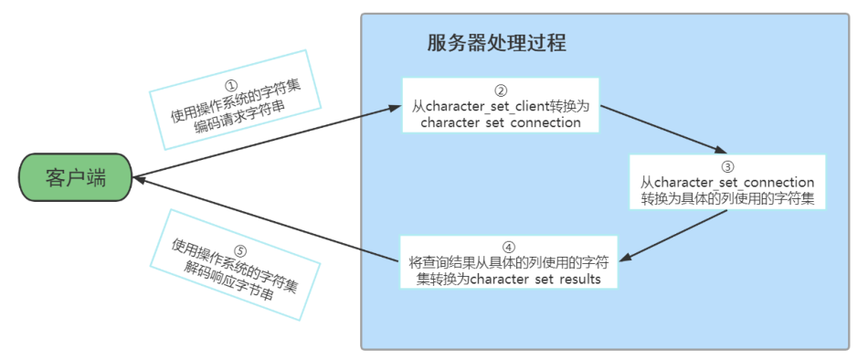

---

### 5.3.3 為什麼還要再次編碼？

#### 🎯 目的：資料在 MySQL 內部的「一致性處理」

當你從客戶端送出一條查詢語句，MySQL 會根據 `character_set_client` 來 **解碼** 這串二進位數據成為「原本的文字」SQL。

但在正式執行前，它還會**依據 `character_set_connection`** 進行「**再編碼**」，原因如下：

---

#### 🔄 原因：轉換成資料庫統一的內部編碼

##### 🚶‍♂️流程說明：

1. **接收客戶端請求**
   - 客戶端用 GBK 編碼傳送 SQL（假設 `character_set_client = gbk`）
   - MySQL 根據這個設置 **解碼為 SQL 語句**

2. **轉換內部格式（再次編碼）**
   - 接著用 `character_set_connection` 指定的編碼（可能是 UTF8）**將 SQL 再轉成內部標準格式**
   - 這樣所有 SQL 處理、儲存、分析都是使用一樣的內部編碼，**減少混亂與錯誤**

3. **執行查詢與處理資料**

---

#### 🧠 為什麼不直接用 `character_set_client` 就好？

因為：

- 客戶端可能五花八門（Windows 是 GBK、Mac 是 UTF8、瀏覽器是 ISO-8859...）
- 若資料庫內部也使用不同編碼來處理 SQL 解析，會導致混亂與安全問題

所以 **MySQL 將所有解碼完的語句**轉為一致的「`character_set_connection` 編碼」，然後才執行。這樣資料處理邏輯會乾淨俐落，執行結果也不會出錯。

---

#### 🧪 簡單比喻

像是：

- 你會講中文（客戶端）
- 我能聽中文（MySQL 根據 `character_set_client` 解碼）
- 但我所有的筆記都用英文寫（MySQL 的 `character_set_connection` 統一為 UTF8）
- 所以我要把你講的話「翻譯」成英文後，再記錄、處理，這就是「再編碼」。

---

#### ✅ 小結

| 階段 | 變數 | 功能 |
|------|------|------|
| 客戶端傳送 | `character_set_client` | 解碼收到的資料 |
| MySQL 內部處理 | `character_set_connection` | 將資料轉成統一格式以執行 |
| 結果回傳 | `character_set_results` | 結果轉碼發送回客戶端 |

--- 

### 5.3.4 查詢結果為什麼還要先解碼，再依 `character_set_results` 重新編碼

#### 🎯 背後邏輯：為了讓 **查詢結果能正確顯示在不同的客戶端**

##### ✳️ 概念總覽
- 資料庫內部資料是用某種 **儲存編碼**（如 `utf8mb4`）存的
- 查詢時會從資料表中取出「原始的編碼資料」
- 但每個客戶端（如 cmd、瀏覽器、Java 程式）使用的字元編碼不見得一樣（可能是 GBK、UTF8、Big5 等）
- 所以資料庫需要將這些資料 **轉成客戶端可以正確解讀的編碼**

這就需要透過：
```sql
character_set_results
```
來決定「**傳給客戶端前要用哪個編碼來重新編碼一次**」

---

#### 📦 具體流程拆解

1. **從資料表取出資料**
   - 資料原本是 `utf8mb4` 儲存（例如：中文字「蕭士麟」）

2. **解碼 → 還原成文字資料（內部編碼格式）**
   - 資料庫會先用欄位定義的編碼（如 utf8mb4）將資料解碼成文字（內部通用格式）

3. **重新編碼成 client 能理解的格式**
   - 根據 `character_set_results`（例如設定為 GBK），再把這些文字**轉回 GBK 編碼格式**
   - 這樣才能保證：**客戶端用 GBK 解碼時能正確顯示**

4. **傳送給客戶端**
   - 最終資料以 GBK 編碼傳送，客戶端（例如 Windows CMD）就能正確顯示資料了

---

#### 🧪 簡單比喻

假設資料表裡存的是英文「apple」跟中文「蘋果」，用 `utf8mb4` 儲存：

- 查出來後，MySQL 會把「蘋果」還原成文字
- 但你的螢幕只能讀懂 **Big5**
- 所以 MySQL 必須把「蘋果」這兩個字轉換為 Big5 格式，再發送回來
- 不然你看到的可能會是亂碼或問號（�）

---

#### ✅ 小結

| 步驟 | 動作 | 編碼參考變數 |
|------|------|----------------|
| 1 | 資料庫解碼欄位資料 | 資料欄位本身的 `CHARSET` |
| 2 | 轉為通用文字（MySQL 內部） | — |
| 3 | 根據客戶端需求再編碼 | `character_set_results` |
| 4 | 發送給客戶端顯示 | 客戶端再用對應編碼顯示 |

---

#### 📌 補充建議

為了**避免編碼不一致與亂碼**，建議：

```sql
SET character_set_client = utf8mb4;
SET character_set_connection = utf8mb4;
SET character_set_results = utf8mb4;
```

讓整個流程都走 UTF-8，避免不同碼表轉換問題。

---

# 6. SQL大小写规范
## 6.1 Windows和Linux平台区别
這段關於 MySQL 大小寫敏感性的說明其實關係到兩個層面：

1. **SQL 語法本身（邏輯層）**
2. **MySQL 實際儲存與查找資料（物理層）**

---

### ✅ 一、SQL 語法層級：大小寫規則

#### ✳️ **不區分大小寫的部分（不論系統）**
- **SQL 關鍵字**：如 `SELECT`、`FROM`、`WHERE`、`ORDER BY`
- **函數名稱**：如 `MAX()`、`ABS()`、`MOD()`、`ROUND()`

```sql
-- 以下三種寫法是等價的
SELECT MAX(salary) FROM employees;
select max(salary) from employees;
SeLeCt MaX(salary) From employees;
```

---

### ✅ 二、MySQL 物理層級（和作業系統有關）

#### 🔍 透過此指令查詢 MySQL 對表名大小寫是否敏感：
```sql
SHOW VARIABLES LIKE '%lower_case_table_names%';
```

---

### 🖥 Windows 系統下：

- 預設 `lower_case_table_names = 1`
- 👉 所有 **資料表與資料庫名稱** 都轉為小寫儲存與查找
- 👉 **不區分大小寫**

```sql
-- 以下兩個指令在 Windows 上都可以成功
SELECT * FROM EMPLOYEES;
SELECT * FROM employees;
```

---

### 🐧 Linux 系統下：

- 預設 `lower_case_table_names = 0`
- 👉 資料表與資料庫名稱 **大小寫敏感**
- 👉 表名或資料庫名要完全對應

```sql
-- 假設建立的表為 EMPLOYEES，大寫
CREATE TABLE EMPLOYEES (id INT);

-- 以下指令在 Linux 上會出錯（找不到小寫的 employees）
SELECT * FROM employees;  -- ❌

-- 必須這樣寫
SELECT * FROM EMPLOYEES;  -- ✅
```

---

### 🔧 lower_case_table_names 的三種設定

| 值 | 說明 |
|----|------|
| 0  | 默认为0，大小写敏感 |
| 1  | 设置1，大小写不敏感。创建的表，数据库都是以小写形式存放在磁盘上，对于sql语句都是转换为小写对表和数据库进行查找 |
| 2  | 设置2，创建的表和数据库依据语句上格式存放，凡是查找都是转换为小写进行 |

---

### ✅ Linux 與 Windows 大小寫規則比較總表

| 項目 | Linux | Windows |
|------|--------|---------|
| 資料庫名 | 敏感 | 不敏感 |
| 資料表名 | 敏感 | 不敏感 |
| 列名 / 欄位名 | 不敏感 | 不敏感 |
| 別名 | 敏感（表別名）<br>不敏感（欄位別名） | 不敏感 |
| 關鍵字 / 函數名 | 不敏感 | 不敏感 |

---

### 📌 建議

為了跨平台兼容性（開發在 Windows、部署在 Linux）：

1. **建立表和資料庫時，請用小寫**。
2. **SQL 查詢中統一使用小寫表名與欄位名**。
3. **開發團隊訂立命名規則，避免大小寫混用**。

---

## 6.2 Linux下大小写规则设置
### ✅ 為什麼要設定 `lower_case_table_names=1`

在 Linux 下，MySQL 預設 `lower_case_table_names=0`，也就是：
- **資料表與資料庫名稱大小寫敏感**
- `EMPLOYEES` 和 `employees` 是兩張不同的表

但有些開發人員習慣大小寫混用（例如在 Windows 寫 SQL），這在部署到 Linux 就會造成錯誤。因此，我們可能會想讓 Linux 上也變成「大小寫不敏感」。

---

### ✅ 修改 `lower_case_table_names` 為 1 的正確流程（MySQL 5.7）

> 適用於 **MySQL 5.7**

#### ✏️ 步驟：

1. 打開 MySQL 設定檔（通常為 `/etc/my.cnf`）
2. 在 `[mysqld]` 區塊中加上：
   ```ini
   lower_case_table_names=1
   ```
3. 確保所有的資料表和資料庫名稱已經轉為 **小寫**（否則會出錯）
4. 重啟 MySQL 服務
   ```bash
   sudo systemctl restart mysqld
   ```

---

### 🧨 注意：MySQL 8 更嚴格

> **MySQL 8.x 不允許啟動後再修改 `lower_case_table_names`。如果想設為 1，只能在初始化前就設好。**

#### ✅ 修改步驟如下（MySQL 8 專用）：

1. **停止 MySQL 服務**：
   ```bash
   sudo systemctl stop mysqld
   ```

2. **刪除原有資料資料夾**（⚠️會清空所有資料）：
   ```bash
   sudo rm -rf /var/lib/mysql
   ```

3. **編輯設定檔 `/etc/my.cnf`，新增參數**：
   ```ini
   [mysqld]
   lower_case_table_names=1
   ```

4. **重新初始化資料目錄**（可用 `mysqld --initialize` 或用套件自動建立）

5. **啟動 MySQL**：
   ```bash
   sudo systemctl start mysqld
   ```

---

### 📘 範例說明

#### 📌 預設大小寫敏感（Linux，MySQL 8，未設定 `lower_case_table_names`）

```sql
-- 建立表
CREATE TABLE Employees (id INT);

-- 查詢（大寫建立、小寫查詢）=> 錯誤
SELECT * FROM employees;
-- 錯誤訊息：Table 'test.employees' doesn't exist
```

---

#### ✅ 設為大小寫不敏感後（MySQL 8，設為 1）

```ini
[mysqld]
lower_case_table_names=1
```

刪除 `/var/lib/mysql` 後重新初始化 → 接著你就可以這樣使用：

```sql
-- 建立表（大小寫任意）
CREATE TABLE Employees (id INT);

-- 查詢（不管大小寫都可以）：
SELECT * FROM employees;
SELECT * FROM EMPLOYEES;
SELECT * FROM EmPlOyEeS;
-- 全部都能成功
```

---

### ⚠️ 重點提醒

- 一旦初始化過了，**MySQL 8 的 `lower_case_table_names` 就不能再改變**，不然啟動會錯。
- 如果已經有資料的情況下，**你不能直接修改該參數而不處理原有資料，否則查不到表**。

---

## 6.3 SQL编写建议
> **SQL 編寫風格建議**，目的在於避免錯誤並提高可讀性與跨平台（Linux / Windows）一致性。

### ✅ 一、SQL 命名與書寫風格建議

#### 🟩 建議 1：**關鍵字和函數名稱使用大寫**

**目的：**
- 可讀性好，讓語句邏輯部分一目了然
- 與表名、欄位名明確區分

**範例：**

```sql
-- ✅ 建議寫法
SELECT MAX(salary) AS max_salary
FROM employees
WHERE department_id = 90;

-- ⛔️ 不建議混合寫法
select max(Salary) as max_salary from Employees where Department_Id = 90;
```

---

#### 🟩 建議 2：**資料庫名、表名、欄位名、別名使用小寫**

**目的：**
- Linux 下 MySQL 是大小寫敏感的 → 減少錯誤機率
- 一致性好，方便維護

**範例：**

```sql
-- ✅ 建議寫法（欄位與別名都小寫）
SELECT last_name AS name, salary AS monthly_salary
FROM employees;

-- ⛔️ 不建議寫法（混用大小寫）
SELECT LastName AS Name, Salary AS MonthlySalary FROM Employees;
-- 在 Linux 環境可能會找不到表或欄位
```

---

#### 🟩 建議 3：**每條 SQL 結尾加上分號**

**目的：**
- 符合 SQL 語法習慣
- 在某些工具或批量執行環境下必須加分號

**範例：**

```sql
-- ✅ 正確寫法
SELECT * FROM employees;

-- ⛔️ 缺分號（可能造成錯誤或執行不完全）
SELECT * FROM employees
```

---

### 🐧 Linux MySQL 與命名敏感性的關係

在 Linux 上執行 MySQL 時，**表名和欄位名是大小寫敏感的**：

```sql
-- 假設表叫 employees
SELECT * FROM Employees;  -- ❌ 錯誤，找不到表
SELECT * FROM employees;  -- ✅ 正確
```

#### ✅ 建議統一命名風格：全部小寫，避免問題

---

### 🔁 總結建議（你可以當作團隊規範）

| 類型           | 命名範例       | 命名風格建議 |
|----------------|----------------|----------------|
| 關鍵字         | `SELECT`, `FROM` | **全部大寫** |
| 函數名稱       | `MAX()`, `ROUND()` | **全部大寫** |
| 資料庫/表名     | `employees`, `sales_db` | **全部小寫** |
| 欄位名稱 / 別名 | `last_name AS name` | **全部小寫** |
| 結尾           | `;` 結尾      | **強制加分號** |

---

### 🧪 延伸練習題

```sql
-- 請根據建議重寫以下 SQL，使其符合命名風格：

select Name, Salary from EMPLOYEES where Department_ID = 10

-- ✅ 建議寫法
SELECT name, salary
FROM employees
WHERE department_id = 10;
```

# 7. sql_mode的合理设置
## 7.1 介绍
### 7.1.1 🔍 一、什麼是 `sql_mode`？

`sql_mode` 是 MySQL 的一個系統變數，用來控制：

- 資料輸入的驗證方式（例如輸入不合法的資料該不該報錯）
- SQL 語法的容忍程度（例如 `GROUP BY` 是否允許隨意寫）

可以透過調整 `sql_mode`，來讓 MySQL 的運作更嚴格或更寬鬆。

---

### 7.1.2 🧱 二、不同 MySQL 版本的預設 `sql_mode`

| MySQL 版本 | 預設模式 | 說明 |
|------------|----------|------|
| MySQL 5.6  | `NO_ENGINE_SUBSTITUTION` | 寬鬆模式，不會對資料進行嚴格限制 |
| MySQL 5.7+ | `STRICT_TRANS_TABLES` 等 | 嚴格模式，對資料驗證更嚴格 |

---

### 7.1.3 📘 三、常見的 sql_mode 值解釋

| 模式名稱              | 說明 |
|----------------------|------|
| `STRICT_TRANS_TABLES` | 嚴格模式，針對 **支援交易的表格**，當資料不合法時會報錯並回滾 |
| `NO_ZERO_IN_DATE`     | 不允許日期中出現「00」作為月或日 |
| `NO_ZERO_DATE`        | 不允許 `0000-00-00` 這種日期被插入 |
| `ONLY_FULL_GROUP_BY`  | `GROUP BY` 中未出現的欄位不可在 `SELECT` 使用 |
| `NO_ENGINE_SUBSTITUTION` | 如果指定的儲存引擎不可用，報錯而不是自動轉成預設引擎 |

---

### 7.1.4 ✅ 四、用範例說明差異

#### ⚠ 寬鬆模式（如 MySQL 5.6）

```sql
SET sql_mode = '';
CREATE TABLE test (
  id INT,
  price DECIMAL(5,2)
);

-- 插入不合法資料
INSERT INTO test VALUES (1, 123456.78);
-- ✅ 在寬鬆模式下，這條語句會被截斷為 999.99 插入，不會報錯
```

#### ❌ 嚴格模式（如 MySQL 5.7）

```sql
SET sql_mode = 'STRICT_TRANS_TABLES';
INSERT INTO test VALUES (2, 123456.78);
-- ❌ 在嚴格模式下，這條語句會報錯：
-- ERROR 1264 (22003): Out of range value for column 'price'
```

#### ⛔ 日期驗證例子（NO_ZERO_DATE）

```sql
SET sql_mode = 'NO_ZERO_DATE';
INSERT INTO test_date VALUES ('0000-00-00');
-- ❌ 報錯：Invalid default value for 'date_column'
```

---

### 7.1.5 🛠 五、怎麼查看與設定 `sql_mode`？

#### 查看目前模式：

```sql
SELECT @@sql_mode;
```

#### 修改模式（只對目前連線有效）：

```sql
SET sql_mode = 'STRICT_TRANS_TABLES,NO_ZERO_IN_DATE,NO_ZERO_DATE';
```

#### 修改配置檔（永久設定）：
修改 `my.cnf` 或 `my.ini` 中加入：

```ini
[mysqld]
sql_mode=STRICT_TRANS_TABLES,NO_ZERO_IN_DATE,NO_ZERO_DATE
```

---

### 7.1.6 🧠 小結

- 如果你是開發或測試環境，**寬鬆模式方便快速測試**；
- 如果你是正式環境，**建議啟用嚴格模式**來保障資料的正確性；
- 設定正確的 `sql_mode` 是避免不合法資料混入資料庫的重要手段。

---

## 7.2 宽松模式 vs 严格模式
這段內容主要在說明 **MySQL 中的 `sql_mode` 合理設定**，以及為什麼「**寬鬆模式**」和「**嚴格模式**」會影響資料的驗證與資料遷移的可靠性。

---

### 7.2.1 🔹 一、寬鬆模式（寬容、不報錯）

#### 📖 解釋：

當 `sql_mode` 是空字串（或沒有 `STRICT_` 開頭的模式），這代表 MySQL 採用寬鬆模式。這種模式下，即使資料格式或長度**不完全符合資料表的設計規範**，MySQL 通常會**自動截斷或轉換**，**不報錯也不回滾**。

#### 📌 範例：

```sql
SET sql_mode = ''; -- 設定為寬鬆模式

CREATE TABLE demo (
  name CHAR(10)
);

INSERT INTO demo VALUES ('1234567890abc');
-- ✅ 成功插入：實際被截斷為 '1234567890'
```

#### ✅ 優點：

- 在系統資料遷移時（例如從 Oracle → MySQL），如果一些資料過長或格式有誤，不會造成中斷；
- 方便在開發早期快速測試資料。

#### ❌ 缺點：

- 資料容易「**靜悄悄地出錯**」，因為錯誤資料會被自動轉換、截斷而沒人發現；
- 不適合正式環境，會造成資料不一致或不完整。

---

### 7.2.2 🔸 二、嚴格模式（推薦用於開發與生產）

#### 📖 解釋：

從 MySQL 5.7 開始，預設啟用 `STRICT_TRANS_TABLES` 模式，也就是嚴格模式。在這個模式下，如果插入的資料不符合欄位設定（如長度、類型、空值等），會**直接報錯、拒絕寫入**，並且**在交易表格中會回滾整個交易**。

#### 📌 範例：

```sql
SET sql_mode = 'STRICT_TRANS_TABLES';

CREATE TABLE demo (
  name CHAR(10)
);

INSERT INTO demo VALUES ('1234567890abc');
-- ❌ 報錯：
-- ERROR 1406 (22001): Data too long for column 'name'
```

#### ✅ 優點：

- 嚴格控管資料格式，防止錯誤資料寫入；
- 開發階段就能提早發現資料錯誤；
- 提升未來跨資料庫系統遷移的準備度。

#### ❌ 缺點：

- 如果系統本來依賴寬鬆行為，可能需要修改部分 SQL 或程式邏輯；
- 對新手開發者而言，錯誤訊息較多。

---

### 7.2.3 🛠 三、常見嚴格模式錯誤例子

#### ❌ `NO_ZERO_DATE`：不允許零日期

```sql
SET sql_mode = 'STRICT_TRANS_TABLES,NO_ZERO_DATE';

CREATE TABLE log (
  created_at DATE
);

INSERT INTO log VALUES ('0000-00-00');
-- ❌ 錯誤：
-- ERROR 1292 (22007): Incorrect date value: '0000-00-00'
```

#### ✅ 修正方法：

- 使用 `NULL` 或明確有效日期：
```sql
INSERT INTO log VALUES (NULL);        -- OK
INSERT INTO log VALUES ('2025-01-01'); -- OK
```

---

### 7.2.4 🧠 四、開發實務建議

| 環境     | sql_mode 建議                             |
|----------|-------------------------------------------|
| 測試 / 開發 | 嚴格模式 `STRICT_TRANS_TABLES` 等         |
| 生產     | 同上，並搭配 `NO_ZERO_DATE`, `ONLY_FULL_GROUP_BY` 等強檢查 |
| 遷移     | 初期可用寬鬆模式，確保資料流暢移動，再逐步嚴格化設定 |

> 🚨 **重要觀念**：資料驗證最好 **在程式層做一次 + DB 層做一次**，前端/後端驗證雖然麻煩，但可提早發現問題，MySQL 嚴格模式作為**最後防線**。

---

#### ✅ 補充：如何永久設定 sql_mode？

在 MySQL 配置檔（如 `my.cnf` 或 `my.ini`）加上：

```ini
[mysqld]
sql_mode=STRICT_TRANS_TABLES,NO_ZERO_DATE,NO_ENGINE_SUBSTITUTION
```

---

## 7.3 模式查看和设置
> 這段內容主要介紹了 **如何檢查、臨時設置與永久配置 MySQL 中的 `sql_mode`**，讓你能夠根據實際情況（如測試、開發、線上環境）調整 MySQL 的行為模式。下面我會一段一段說明，並搭配範例幫你理解整體用途和差異：

---

### 7.3.1 🔍 一、如何查看當前的 `sql_mode`

你可以透過以下 SQL 語句查詢目前的設定：

```sql
-- 查詢目前這個連線（session）的 sql_mode
SELECT @@SESSION.sql_mode;

-- 查詢全局（global）的 sql_mode（所有新連線會套用）
SELECT @@GLOBAL.sql_mode;

-- 通用方式查看變數
SHOW VARIABLES LIKE 'sql_mode';
```

#### ✅ 範例說明：

假設你執行：

```sql
SELECT @@SESSION.sql_mode;
```

可能會看到結果：

```
STRICT_TRANS_TABLES,NO_ZERO_DATE,NO_ENGINE_SUBSTITUTION
```

這代表你目前這個連線會用這些「模式」進行 SQL 執行與資料校驗。

---

### 7.3.2 ⚙️ 二、臨時設定 `sql_mode`

#### 📌 用途：

- 用於 **短期調整**（如測試某段 SQL 在不同模式下會怎麼反應）
- **不會改變其他使用者或其他連線的行為**
- 重啟 MySQL 後就會 **失效**

#### 🧪 範例：

```sql
-- ✅ 僅針對目前這條連線生效
SET SESSION sql_mode='STRICT_TRANS_TABLES';

-- ✅ 改變全局（但重啟後失效），適用於目前 MySQL 執行階段
SET GLOBAL sql_mode='STRICT_TRANS_TABLES';
```

🔔 **注意：要改 GLOBAL 模式，你需要擁有 SUPER 或 SYSTEM_VARIABLES_ADMIN 權限**

---

### 7.3.3 🧾 三、永久設定 `sql_mode`（推薦正式環境使用）

#### 📌 方法：

編輯 MySQL 設定檔 `my.cnf`（Linux/macOS）或 `my.ini`（Windows），增加：

```ini
[mysqld]
sql_mode=ONLY_FULL_GROUP_BY,STRICT_TRANS_TABLES,NO_ZERO_IN_DATE,NO_ZERO_DATE,ERROR_FOR_DIVISION_BY_ZERO,NO_ENGINE_SUBSTITUTION
```

然後重啟 MySQL 服務即可生效。

```shell
sudo systemctl restart mysqld
```

#### ❗ 注意：

- 這種方式屬於「**永久有效**」
- 不過，在**線上生產環境**中禁止隨意重啟資料庫，因此可以：
  - 先用 `SET GLOBAL ...` 臨時設定立即生效
  - 再修改 `my.cnf`，等下次維護重啟時永久套用

---

### 7.3.4 📘 模式說明（你範例中的幾個 mode）

| 模式名稱 | 說明 |
|----------|------|
| `STRICT_TRANS_TABLES` | 嚴格模式，防止錯誤資料寫入 |
| `NO_ZERO_IN_DATE` | 不允許 `2025-00-01` 這類不完整的日期 |
| `NO_ZERO_DATE` | 不允許 `0000-00-00` 這種無效日期 |
| `ONLY_FULL_GROUP_BY` | `GROUP BY` 查詢時要求欄位必須符合 SQL 標準 |
| `ERROR_FOR_DIVISION_BY_ZERO` | 0 做除數會報錯（預設是警告） |
| `NO_ENGINE_SUBSTITUTION` | 若指定儲存引擎不可用，直接報錯，不使用替代引擎 |

---

### 7.3.5 🎯 小結對照表

| 類型     | 設定方式 | 是否永久 | 適用情境 |
|----------|-----------|-----------|------------|
| 臨時（會話） | `SET SESSION ...` | ❌ | 某人短期測試用 |
| 臨時（全域） | `SET GLOBAL ...` | ❌ | 緊急調整、臨時維運 |
| 永久       | 修改 `my.cnf` 後重啟 | ✅ | 正式/穩定環境部署 |

---

### 7.3.6 🧪 延伸練習範例

```sql
-- 練習設成寬鬆模式
SET SESSION sql_mode='';

CREATE TABLE demo (
  name CHAR(5)
);

INSERT INTO demo VALUES ('abcdef');  -- ✅ 寬鬆模式會截斷為 'abcde'

-- 改回嚴格模式
SET SESSION sql_mode='STRICT_TRANS_TABLES';

INSERT INTO demo VALUES ('abcdef');  -- ❌ 嚴格模式會報錯：Data too long
```

---

## 📘 7.4 sql_mode 常用值

> MySQL 提供了多種 SQL 模式來控制資料驗證、錯誤處理、語法規範等行為。以下是最常用、實務上最重要的三種模式：

---

### 7.5.1 ① `STRICT_TRANS_TABLES`（嚴格交易表模式）

#### ✅ 說明：

當插入的資料不符合欄位定義時（例如超過字元長度、NULL 約束等），系統會：

- 對於**支援交易的表**（如 InnoDB）：**直接報錯**並且**回滾整筆交易**
- 對於**非交易表**（如 MyISAM）：可能只報警告

#### 🧪 範例：

```sql
SET SESSION sql_mode='STRICT_TRANS_TABLES';

CREATE TABLE test1 (
  name CHAR(5)
);

INSERT INTO test1 VALUES ('abcdef');  
-- ❌ 報錯：Data too long for column 'name'
```

#### ✅ 適用場景：
- **正式環境必備**
- 防止不合法資料悄悄進入資料庫
- 開發階段能及早發現問題

---

### 7.5.2 ② `NO_ZERO_DATE`（禁止零日期）

#### ✅ 說明：

禁止插入 `0000-00-00` 這種不合法的日期，會直接報錯（而不是發出警告）。

#### 🧪 範例：

```sql
SET SESSION sql_mode='NO_ZERO_DATE';

CREATE TABLE test2 (
  created_date DATE
);

INSERT INTO test2 VALUES ('0000-00-00');
-- ❌ 報錯：Incorrect date value: '0000-00-00'
```

#### ✅ 適用場景：
- 日期型資料需符合嚴格標準
- 避免錯誤或預設時間值混入系統資料

---

### 7.5.3 ③ `ONLY_FULL_GROUP_BY`（全欄位分組）

#### ✅ 說明：

要求所有非聚合欄位必須在 `GROUP BY` 中出現。這是為了符合 SQL 標準。

#### 🧪 範例：

```sql
SET SESSION sql_mode='ONLY_FULL_GROUP_BY';

CREATE TABLE test3 (
  id INT,
  name VARCHAR(20)
);

-- 這裡僅 GROUP BY id，name 欄位沒有聚合或出現在 GROUP BY 中
SELECT id, name FROM test3 GROUP BY id;
-- ❌ 報錯：is not functionally dependent on columns in GROUP BY
```

#### ✅ 適用場景：
- 跨資料庫遷移（如從 PostgreSQL、Oracle 到 MySQL）
- 需要高度符合 SQL 標準的查詢環境

---

### 7.5.4 🧠 小結比較表：

| 模式名稱 | 功能重點 | 常見錯誤範例 | 適用環境 |
|----------|----------|--------------|-----------|
| `STRICT_TRANS_TABLES` | 嚴格資料驗證 | 插入超長資料 | 開發、測試、生產 |
| `NO_ZERO_DATE` | 禁止無效日期 | 插入 `0000-00-00` | 生產資料精度要求 |
| `ONLY_FULL_GROUP_BY` | 分組欄位嚴格規範 | 聚合查詢錯誤 | 高一致性需求環境 |

---