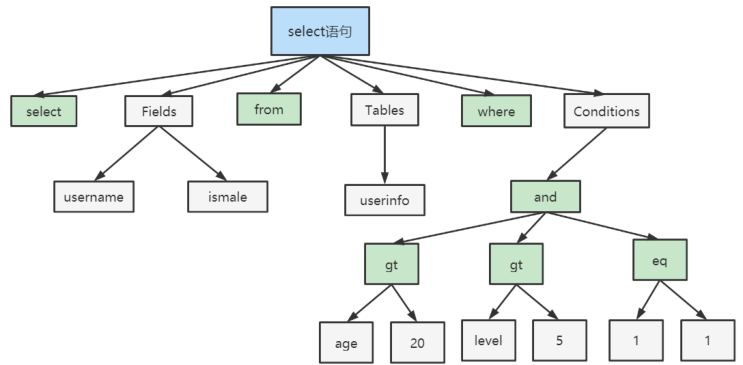
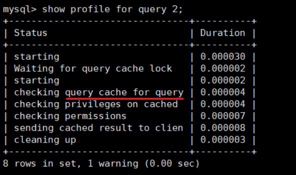

# 1. 逻辑架构剖析
## 1.1 服务器处理客户端请求
### 🔧 MySQL 的邏輯架構（Logical Architecture）

MySQL 整體邏輯架構可概括為以下三層：


#### **第一層：連接層（Connection Layer）**
- 負責接收客戶端連線請求，並進行身份驗證、權限檢查。
- 成功連接後會為每個連線建立一個對應的 **Thread 線程**。
- 同時負責管理一些快取（如查詢快取 Query Cache，MySQL 8.0 已移除）與 thread 資源。

🔸 **範例說明：**
```sql
-- 用戶透過 mysql 命令列連接資料庫
mysql -u root -p
```
系統會進行身份驗證，並為此用戶分配一個獨立線程。

---

#### **第二層：SQL 層（SQL Layer）**
這是 MySQL 的核心，處理各種 SQL 查詢語句的具體實作。

包含以下處理流程：

###### 1. **語法解析器（Parser）**
將 SQL 字串轉換為語法樹，若語法有誤就此結束。
```sql
SELECT * FROM employees WHERE id = 1;
```
會被解析成一棵抽象語法樹（AST）。

###### 2. **預處理（Preprocessor）**
驗證語法樹中的元素（表名、欄位名）是否存在，檢查用戶是否有權限等。

###### 3. **查詢優化器（Optimizer）**
針對語法樹進行查詢優化，例如：
- 選擇最佳的索引
- 決定表的連接順序（JOIN 的順序）

###### 4. **查詢執行計劃（Execution Plan）**
輸出優化後的執行策略，並交給執行器執行。

---

#### **第三層：存儲引擎層（Storage Engine Layer）**
- 負責實際的資料存取。
- MySQL 是一個 **插件式架構**，可支援多種儲存引擎（如 InnoDB、MyISAM、Memory 等）。
- 儲存引擎根據執行器傳來的指令，實際從磁碟或記憶體中取出資料。

🔸 **範例：** 儲存引擎 InnoDB 收到「讀取 id=1 的員工資料」請求，從資料頁中查找並返回資料給上層。

---

### 🎯 查詢請求範例說明

假設你執行：
```sql
SELECT name FROM employees WHERE id = 1;
```

MySQL 的處理流程如下：

1. **連線層處理：**
   - 驗證帳號密碼 → 通過 → 為此連線建立一個 Thread。

2. **SQL 層處理：**
   - **語法分析：** 確認語法正確。
   - **預處理：** 確認 `employees` 表存在且當前用戶可存取。
   - **優化：** 檢查是否有對 `id` 欄位的索引，若有，選用索引加速查詢。
   - **產生執行計劃：** 根據索引走查，快速定位到 `id=1` 的記錄。

3. **存儲引擎處理：**
   - **InnoDB** 接手，根據主鍵索引讀取磁碟資料頁，找出符合條件的記錄，返回 `name` 欄位資料。

4. **返回結果：**
   - 資料由儲存引擎 → 傳回 SQL 執行器 → 傳給連線層 → 最後回傳給使用者的 MySQL 客戶端。

---

### 🧠 小結

| 階層        | 功能                     | 重點模組             |
|-------------|--------------------------|----------------------|
| 連線層      | 管理用戶連線與身份驗證   | thread pool, auth   |
| SQL 層      | 分析、優化與執行查詢     | Parser, Optimizer   |
| 存儲引擎層  | 與實際資料進行交互       | InnoDB, MyISAM 等    |


這種清楚分層的架構，讓 MySQL 同時具備高彈性與高效能，也讓不同層級可以各自優化和擴充。

---

如果你想進一步了解某層具體的模組或 debug 一段 SQL 查詢的執行流程，我也可以幫你帶入 EXPLAIN 等實務工具來看！需要的話，隨時告訴我～

## 1.2 Connectors
### 🔌 Connectors 層（連接器層）

#### 📌 說明：
Connectors 是 MySQL 與不同程式語言之間進行互動的「橋樑」，它們透過 TCP/IP 與 MySQL Server 建立連線並進行資料交換。

你可以使用各種語言的 Connector 來操作 MySQL，包括：

- **Java** ➜ JDBC（Java Database Connectivity）
- **Python** ➜ mysql-connector-python、PyMySQL
- **PHP** ➜ PDO_MySQL、mysqli
- **C/C++** ➜ libmysqlclient
- **Node.js** ➜ `mysql2` 模組
- **ODBC** ➜ 支援資料來源整合，如 Excel、Power BI 等

無論哪一種，最終都是透過 **MySQL 協議在 TCP 之上通訊**。

---

#### 🧪 範例：

###### Java 程式與 MySQL 的連線流程（JDBC）

```java
// 匯入 JDBC 套件
import java.sql.*;

public class MySQLExample {
    public static void main(String[] args) {
        String url = "jdbc:mysql://localhost:3306/testdb"; // JDBC URL
        String user = "root";
        String password = "123456";

        try (Connection conn = DriverManager.getConnection(url, user, password);
             Statement stmt = conn.createStatement()) {

            ResultSet rs = stmt.executeQuery("SELECT name FROM employees WHERE id = 1");
            while (rs.next()) {
                System.out.println("姓名: " + rs.getString("name"));
            }

        } catch (SQLException e) {
            e.printStackTrace();
        }
    }
}
```

在這個例子中：
- JDBC 是 Java 語言的 Connector。
- 透過 JDBC，程式碼與 MySQL Server 建立 TCP 連線。
- 然後 MySQL Server 接收到 SQL 字串後進入邏輯架構的下一層進行處理。

---

### 🧱 MySQL Server 三層邏輯架構（完整補充）

從 Connectors 進入後，MySQL Server 可以邏輯上分為以下三層：

#### 1️⃣ **連接層（Connection Layer）**
- 管理客戶端連接。
- 驗證帳號密碼與權限。
- 建立 Session，對每個用戶維護一條獨立的執行緒。
- 可選擇啟用查詢快取（MySQL 8.0 已移除）。

#### 2️⃣ **服務層（SQL Layer）**
- 負責 SQL 處理邏輯：
  - SQL Parser：語法與語義分析。
  - Preprocessor：資料表與欄位合法性驗證。
  - Optimizer：選擇最佳查詢方式（是否使用索引？如何 Join？）
  - Executor：根據計劃執行 SQL 並組裝結果。

#### 3️⃣ **儲存引擎層（Storage Engine Layer）**
- 負責與磁碟進行實際資料存取。
- 多種儲存引擎（InnoDB、MyISAM、Memory...）
- 每個儲存引擎使用統一 API 與上層交互，但內部資料存取機制可完全不同。

---

#### 🖼️ 圖解理解（文字版本）

```text
+--------------------+
|      Connectors    |   ← 各語言的 SDK、ODBC、JDBC
+--------------------+
|   Connection Pool  |   ← 建立連線、驗證帳號、管理 session
|   Thread Handling  |
+--------------------+
|   SQL Parser       |   ← 語法分析器
|   Preprocessor     |   ← 權限、表/欄位驗證
|   Optimizer        |   ← 查詢優化器
|   Executor         |   ← 查詢執行器
+--------------------+
|   Storage Engine   |   ← 具體儲存與存取資料
+--------------------+
```

---

### 📌 小結與回顧

| 名稱 | 作用 | 範例 |
|------|------|------|
| **Connectors** | 與 MySQL Server 建立 TCP 連線並傳送 SQL 字串 | JDBC、ODBC、mysqlclient、PDO |
| **Connection Layer** | 驗證、建立 session、管理快取 | 驗證帳號密碼、thread pool |
| **SQL Layer** | SQL 分析、優化與執行 | 解析 `SELECT * FROM users` |
| **Storage Engine Layer** | 實際存取資料、索引操作 | InnoDB 根據主鍵索引取值 |

---

如你還想補上 MySQL 實體架構（比如檔案層、頁結構、緩衝池）或更進一步探討某層的 debug 工具（如 `EXPLAIN`, `SHOW PROFILE`），我也可以幫你整理～

## 1.3 第一層：連接層
> 當我們談到 **MySQL 邏輯架構的第 1 層：連接層（Connection Layer）** 時，重點是了解它如何處理「用戶端連線」這一最基礎但關鍵的步驟。以下是補充說明與範例，幫助你清楚理解這層的運作流程與作用。


---

### 🔐 第 1 層：連接層（Connection Layer）

這一層是整個 MySQL 架構的「第一道門檻」，用來管理來自用戶端的連線與驗證。

---

#### 🔄 處理流程詳解

1. **建立 TCP 連線（三次握手）**
   - 當客戶端（如 JDBC、MySQL CLI 工具）想要與 MySQL 溝通，首先會發起 TCP 連線。
   - 成功建立後，MySQL 就能接收來自該連線的 SQL 請求。

2. **身份認證（Authentication）**
   - 用戶端會發送帳號密碼資訊。
   - MySQL 根據 `mysql.user` 等系統表對帳號進行驗證。
   - ❌ 若失敗，會返回：
     ```
     ERROR 1045 (28000): Access denied for user 'test'@'localhost' (using password: YES)
     ```
   - ✅ 若通過，則會查出該帳號擁有的所有權限資訊並暫存於記憶體，後續 SQL 查詢都會根據這份權限來判斷能否執行。

3. **連線數與資源限制（連線池 + 線程池）**
   - 每個 TCP 連線對應一條執行緒，用於處理該連線的所有 SQL 指令。
   - 為了效能與資源優化：
     - **使用長連線（Keep-alive）**：避免頻繁建立與關閉連線。
     - **使用線程池（Thread Pool）**：避免每次新建線程造成高昂資源開銷。

4. **多客戶端連線**
   - MySQL 可同時處理大量連線。
   - 可配置最大連線數：`max_connections`（例如：151）
   - 可查詢目前連線數：`SHOW STATUS LIKE 'Threads_connected';`

---

### 📦 範例：MySQL 的連線與連線池概念模擬

#### 🧪 使用 MySQL CLI 嘗試連線：

```bash
mysql -u root -p
```

- 此時 MySQL 服務器將根據 TCP 連線建立會話（session），驗證 `root` 帳號。
- 若通過，即分配線程開始處理 SQL。

#### 🧪 觀察當前連線數與上限：

```sql
-- 查看當前連線數
SHOW STATUS LIKE 'Threads_connected';

-- 查看最大允許連線數
SHOW VARIABLES LIKE 'max_connections';
```

---

### 🧰 小補充：連線相關變數

| 系統變數 | 說明 |
|----------|------|
| `max_connections` | 最大允許的連線數 |
| `thread_cache_size` | 線程快取池的大小，可重複利用舊的線程 |
| `wait_timeout` | 客戶端非活躍連線在斷開前等待的秒數（預設8小時） |
| `interactive_timeout` | 對於互動式連線的 timeout 時間 |

---

### 🧠 小結

| 組件名稱     | 功能                                       |
|--------------|--------------------------------------------|
| TCP 連線     | 建立基本通訊通道                            |
| 認證驗證     | 驗證用戶身份、密碼                         |
| 權限綁定     | 綁定該連線使用者的權限集                   |
| 連線池       | 限制連線數、防止系統過載                   |
| 線程池       | 減少頻繁建立與銷毀線程的資源開銷           |

這層的運作就像是「接待大廳 + 保全系統」，先確保來的人有正確身份，然後幫他指派一位專屬客服（線程）處理後續所有事務。

---

若你有興趣，我可以進一步說明連線超時錯誤、如何設定最大連線數上限，以及如何針對高併發場景設計 MySQL 連線策略（如 ProxySQL 或連線池管理）！

## 1.4 第2层：服务层
### 🔌 1. SQL Interface（SQL 接口）

#### 📌 功能：
- 負責接收從連線層傳來的 SQL 指令（文字形式）。
- 支援多種 SQL 子語言：  
  - **DML**（Data Manipulation Language）：如 `SELECT`、`INSERT`、`UPDATE`、`DELETE`
  - **DDL**（Data Definition Language）：如 `CREATE`、`DROP`、`ALTER`
  - **DCL**（Data Control Language）：如 `GRANT`、`REVOKE`
  - **其他**：儲存程序、觸發器、函數、視圖...

#### 🧪 範例：
```sql
-- DML
SELECT name FROM student WHERE gender = '女';

-- DDL
CREATE TABLE product (
  id INT PRIMARY KEY,
  name VARCHAR(100),
  price DECIMAL(10,2)
);

-- 調用儲存程序
CALL calculate_discount(1000);
```
這些語句會先進入 SQL 接口，由它轉發給後續模組進行處理。

---

### 📖 2. Parser（解析器）

#### 📌 功能：
- 對 SQL 語句做 **語法與語義解析**。
- 建構 **語法樹（Syntax Tree）**。
- 根據資料字典（Data Dictionary）驗證表、欄位、函數是否存在。
- 檢查當前使用者是否有執行該指令的權限。
- 執行查詢重寫（如消除不必要的子查詢）。

#### 🧪 範例：
```sql
SELECT name, age FROM student WHERE age > 18;
```

- Parser 將語句解析成語法樹：
  ```
  SELECT → 投影列: name, age
         → 選取條件: age > 18
         → 資料來源: student
  ```
- 檢查 `student` 表是否存在、`name` 和 `age` 欄位是否存在。
- 確認使用者是否有 `SELECT` 權限。

---

### 🧠 3. Optimizer（查詢優化器）

#### 📌 功能：
- 負責產生最佳的 **執行計劃（Execution Plan）**。
- 決定是否使用索引、JOIN 順序、過濾條件的應用順序等。
- 使用 **選取（Selection）- 投影（Projection）- 連接（Join）** 策略優化查詢。

#### 🧪 範例：

```sql
SELECT id, name FROM student WHERE gender = '女';
```

- 優化器會評估：
  - `gender` 欄位是否有索引？若有，就走索引篩選。
  - 投影（只取 id 與 name，不取全部欄位）。
  - 不會做全表掃描（若有索引）。
- 執行計劃產生後，可以用 `EXPLAIN` 查看：
```sql
EXPLAIN SELECT id, name FROM student WHERE gender = '女';
```

---

### 🧠 4. Caches & Buffers（查詢快取機制）

#### 📌 功能：
- 當 SQL 查詢執行過，會把結果暫存於 Query Cache（在 MySQL 5.7.20 以前）。
- 若完全相同的 SQL 再次出現，直接回傳快取結果，不需重複經歷解析 → 優化 → 執行的步驟。

#### 🧠 快取種類包括：
| 快取 | 功能 |
|------|------|
| **Query Cache** | SELECT 結果快取（已移除於 8.0） |
| **Table Cache** | 表描述符快取 |
| **Key Cache** | MyISAM 的索引塊快取 |
| **Innodb Buffer Pool** | InnoDB 資料與索引緩衝池 |
| **Privilege Cache** | 權限資訊快取 |

#### 🧪 小故事例子：
```text
問你：「9+8×16-3×2×17」是多少？你算一次得出「35」。
下次再問同樣的題目，你會直接回答「35」而不是重算，這就是快取的概念。
```

#### 🧪 範例：
如果你在 MySQL 5.7 中執行以下語句多次：
```sql
SELECT COUNT(*) FROM student WHERE gender = '女';
```
第一次會執行整個查詢流程，第二次若快取開啟且資料未改變，就直接回傳查詢結果。

開啟查詢快取（MySQL 5.7）：
```sql
SET GLOBAL query_cache_size = 262144;
SET GLOBAL query_cache_type = 1;
```

---

### ✅ 小結總覽

| 模組名稱 | 功能說明 | 範例 |
|----------|----------|------|
| SQL Interface | 接收 SQL 並分類分派處理 | `SELECT`, `CREATE`, `CALL` 等 |
| Parser | 將 SQL 轉語法樹 + 權限與語法驗證 | 查表、查欄位、驗證權限 |
| Optimizer | 建立最佳執行計劃（索引、Join順序） | 使用 `EXPLAIN` 分析 |
| Caches | 查詢結果與結構快取，提升效能 | `Query Cache`、`Table Cache` |

---

如果你想進一步深入了解 Optimizer 如何決定執行計劃（例如 index merge、range scan、ref join 等），或 Buffer Pool 如何配置大小，我可以為你延伸說明，甚至搭配 `SHOW PROFILE` 做查詢性能分析都沒問題！

## 1.5 第3层：引擎层
> 你提到的是 MySQL 邏輯架構中的 **第3層：引擎層（Storage Engine Layer）**，這一層真正掌控了資料的**實際存取與操作邏輯**，是 MySQL 與其他資料庫系統很大不同的特色之一。以下是補充說明與範例解析，幫助你理解這一層的設計意圖與使用方式。

---

### 🧱 第3層：引擎層（Storage Engine Layer）

---

#### 🔍 核心特性：插件式儲存引擎架構

MySQL 採用**模組化設計**，將查詢邏輯與資料儲存分離，讓使用者可以根據場景選擇適合的儲存引擎來儲存資料。  
這種架構允許：

- 資料處理層（SQL 層）專注於語法、優化、執行計劃等邏輯處理。
- 儲存層（引擎層）專注於底層資料如何存取與儲存（記憶體、磁碟、索引結構、事務...）。
- 支援 **自定義儲存引擎**。

> 📌 MySQL 通過統一的儲存引擎 API（例如 `handler` 接口）與上層通訊。

---

#### ✅ 常見儲存引擎與特性對比

以下是 MySQL 8.0.25 預設支援的主要儲存引擎：

| 儲存引擎 | 支援事務 | 支援外鍵 | 鎖類型 | 特色用途 |
|-----------|-----------|-----------|--------|----------|
| **InnoDB** | ✅ 是 | ✅ 是 | 行級鎖 | 默認引擎，支援 ACID、崩潰恢復 |
| **MyISAM** | ❌ 否 | ❌ 否 | 表級鎖 | 查詢快，適合讀多寫少場景 |
| **Memory** | ❌ 否 | ❌ 否 | 表級鎖 | 資料存在 RAM 中，速度快但重啟會丟失 |
| **CSV** | ❌ 否 | ❌ 否 | 表級鎖 | 以 CSV 格式儲存，可用於資料匯出 |
| **Archive** | ❌ 否 | ❌ 否 | 表級鎖 | 適合長期儲存大量歷史資料 |
| **NDB (Cluster)** | ✅ 是 | ✅ 是 | 分布式架構 | 適合高可用、高擴展性集群場景 |
| **BLACKHOLE** | ❌ 否 | ❌ 否 | - | 所有寫入皆會被丟棄（用於複製架構） |

> 可用 `SHOW ENGINES;` 查看當前支援的所有儲存引擎。

---

#### 🧪 範例 1：指定儲存引擎建立資料表

```sql
CREATE TABLE test_innodb (
  id INT PRIMARY KEY,
  name VARCHAR(100)
) ENGINE = InnoDB;

CREATE TABLE test_myisam (
  id INT PRIMARY KEY,
  name VARCHAR(100)
) ENGINE = MyISAM;
```

- `test_innodb` 使用 InnoDB：支援事務與行級鎖。
- `test_myisam` 使用 MyISAM：不支援事務，但查詢效率快。

---

#### 🧪 範例 2：查看表的儲存引擎

```sql
SHOW TABLE STATUS LIKE 'test_innodb'\G
```

輸出中會看到 `Engine: InnoDB`

---

#### 🧠 插件式架構的好處

| 好處 | 說明 |
|------|------|
| **可插拔** | 不同引擎針對不同場景：如 OLTP 用 InnoDB、報表用 MyISAM |
| **維護性強** | 引擎升級不影響上層 SQL 層架構 |
| **支援開發自定儲存引擎** | MySQL 開源可讓開發者撰寫自訂儲存邏輯 |
| **功能擴充性** | 未來可整合如分散式、NoSQL、內存型引擎等 |

---

### 🧰 進階使用：變更現有表的儲存引擎

```sql
ALTER TABLE test_myisam ENGINE = InnoDB;
```

這會將 `test_myisam` 表轉換成使用 InnoDB 儲存引擎（若欄位定義允許的話）。

---

### ✅ 小結：三層架構中「引擎層」的角色

| 層級 | 功能重點 | 與儲存引擎的關係 |
|------|----------|------------------|
| **連線層** | 建立連線、權限管理 | 無直接關係 |
| **SQL 層** | 處理語法、優化查詢 | 通過統一接口與儲存引擎通訊 |
| **引擎層** | 實際操作磁碟資料 | 根據表指定的引擎進行存取與管理 |

---

如你有興趣，我可以帶你看看 InnoDB 的具體結構（例如：表空間、資料頁、UNDO、Redo log、Buffer Pool），進一步了解資料是怎麼「真正」存起來的！是否需要我幫你補上這一段？

## 1.6 第4層：存储层
### 🗂️ 第四層：**存儲層（Storage Layer）**

#### 📌 作用：
- 負責將資料「**寫入磁碟**」與「**從磁碟讀出**」。
- 包括表結構、欄位資料、索引、系統元資料（metadata）等所有實體資料。
- 與「儲存引擎層」合作，但再下一層處理的是實體文件與作業系統的檔案系統。

---

#### 🧱 資料如何存儲？

MySQL 中的資料，最終會被寫入作業系統上的檔案，這些檔案通常有以下幾種型態（以 InnoDB 為例）：

| 檔案類型 | 說明 | 預設副檔名 |
|----------|------|------------|
| 表定義檔 | 儲存表的 schema 結構 | `.frm`（MySQL 5.x）→ 8.0後整合到 `data dictionary` |
| 表資料檔 | 儲存表的實際資料（資料列） | `.ibd`（InnoDB 獨立表空間） |
| 共享表空間 | 儲存事務資料（UNDO、REDO）、系統頁等 | `ibdata1`, `ib_logfile0` |
| 日誌檔案 | 用於崩潰恢復（重做日誌 REDO）、事務撤銷（UNDO） | `ib_logfile*`, binlog |
| 索引檔案 | 儲存索引樹結構（如 B+ Tree） | 也在 `.ibd` 中（InnoDB） |

---

### 🧰 範例：建立表後的磁碟實體變化

假設我們在名為 `mydb` 的資料庫中建立一張表：

```sql
CREATE TABLE users (
  id INT PRIMARY KEY,
  name VARCHAR(100),
  age INT
) ENGINE = InnoDB;
```

如果你設定了獨立表空間（通常預設為 `innodb_file_per_table=ON`），MySQL 會在資料目錄中建立一個對應的檔案：

```text
/data/mysql/mydb/users.ibd  ← 儲存這張表的所有資料與索引
```

此外，InnoDB 還會持續使用以下檔案進行寫入與恢復：

- `/data/mysql/ibdata1` （共享表空間）
- `/data/mysql/ib_logfile0`、`ib_logfile1`（REDO 日誌）

---

#### 🧪 查詢資料目錄與表檔案

你可以這樣確認：

```sql
-- 確認資料目錄位置
SHOW VARIABLES LIKE 'datadir';
```

在 Linux 上，可以透過命令查看實體檔案：

```bash
ls -lh /var/lib/mysql/mydb/
# 可以看到 users.ibd 等檔案
```

---

#### 📦 儲存後端技術（補充）

MySQL 的資料最終會交給作業系統的 **檔案系統（File System）** 儲存，也可能搭配不同的底層硬體：

| 類型 | 說明 |
|------|------|
| **本地磁碟** | 常見於單機部署 |
| **DAS（Direct Attached Storage）** | 本地直連的外接磁碟設備 |
| **NAS（Network Attached Storage）** | 檔案級網路儲存，透過網路傳輸 |
| **SAN（Storage Area Network）** | 區塊級儲存裝置，效能高，多用於大型資料庫集群 |

InnoDB 曾支援「裸裝置（raw device）」直寫，但現代的檔案系統（如 XFS、EXT4）已非常高效，一般不再使用。

---

### 🔄 與上層的關係

MySQL 各層的互動流程（簡化）：

```
Client → SQL 層（解析器/優化器）→ 儲存引擎層（InnoDB）→ 檔案系統 → 磁碟
```

資料的「寫入與讀取」都是透過這樣一路下行與回傳的過程完成的。

---

### ✅ 小結

| 層級 | 負責處理 | 儲存位置 | 關鍵檔案舉例 |
|------|----------|----------|--------------|
| 引擎層 | 管理資料頁、索引、事務邏輯 | 還是交給 OS 處理 | `.ibd`, `ibdata1`, `ib_logfile0` |
| 存儲層 | 最終把資料寫入磁碟（OS層） | 檔案系統、磁碟 | `/var/lib/mysql/mydb/*.ibd` |

---

如果你想更進一步理解 InnoDB 資料頁的結構（如 Page Header、Page Directory、行格式），或事務崩潰恢復流程（通過 REDO/UNDO），我也可以為你進行延伸說明。是否需要？

## 1.7 小結
MySQL架构图本节开篇所示。下面为了熟悉SQL执行流程方便，我们可以简化如下：


- 简化为三层结构：
  - 连接层：客户端和服务器端建立连接，客户端发送 SQL 至服务器端；
  - SQL 层（服务层）：对 SQL 语句进行查询处理；与数据库文件的存储方式无关；
  - 存储引擎层：与数据库文件打交道，负责数据的存储和读取。

# 2. SQL执行流程
## 2.1 MySQL 中的 SQL执行流程

### 2.1.1 查詢緩存
#### 📈 查詢快取的運作流程：


當你執行一條 `SELECT` 查詢時，MySQL 的內部處理流程如下：

1. 用戶送出 SQL 查詢語句
2. MySQL 檢查 Query Cache，看是否有該語句的快取結果（以語句作為 key）
    - 有 → 直接從快取取出結果，回傳給客戶端（不經過語法分析/優化器/執行器）
    - 沒有 → 進入下一階段：語法解析器 → 優化器 → 執行器
3. 如果成功執行並生成結果，結果會被存入查詢快取
4. 若相關表格被更新（INSERT/UPDATE/DELETE），該表所有查詢快取都會被清除

---

#### 🧠 查詢快取（Query Cache）說明

- 查詢快取是 MySQL 在 5.7 以前的版本支援的一項功能（MySQL 8.0 **已移除**）。
- 查詢快取的本質：**將查詢語句與其結果綁定緩存下來**，下次有人發送相同的查詢語句時，直接回傳緩存結果，不再執行查詢流程。
- 要求查詢語句必須完全一致（包含空格、大小寫）。
- 查詢快取以 Key-Value 形式儲存：
    - Key：SQL 查詢語句（必須完全一致，包含空格、大小寫）
    - Value：查詢語句對應的結果集（Result Set）

#### ⚠️ 查詢快取的缺點

1. 若有更新操作（如 INSERT、UPDATE、DELETE）發生，與該表相關的快取會全部失效。
2. 快取命中率低，且維護成本高，容易成為瓶頸。
3. 因此 MySQL 8.0 正式 **移除了查詢快取機制**。

---

#### 🚫 命中率低的原因：非常「嚴格」的匹配條件
> MySQL 的查詢快取只在以下情況「完全一致」時才會命中：

| 條件  |   命中？  |
|-------|-----------|
| 語句大小寫相同	✅ 是
| 空格數量一致	✅ 是
| 有無註解、換行符相同	✅ 是
| SQL語法功能一樣但表達方式不同	❌ 否

🚫 以下這些都不會命中：
```sql
-- 原始快取語句：
SELECT * FROM employees WHERE salary > 5000;

-- 這些雖然邏輯一樣，但都不會命中快取：

select * from employees where salary > 5000;       -- 小寫
SELECT  *  FROM employees WHERE salary > 5000;     -- 多個空格
SELECT * FROM employees WHERE salary > 5000; --test -- 有註解
```
> 所以說它的「匹配非常脆弱」，命中率不高。

#### 🚫 不會快取的查詢條件包括：
> MySQL 雖然支援查詢快取，但不是所有查詢都會被快取。如果查詢中出現以下情況，MySQL 會直接跳過查詢快取機制：

**🚫 不會快取的查詢條件包括：**

- 使用某些系統函數（結果會隨時間變化）
    - 例如：NOW(), CURDATE(), RAND(), UUID(), USER(), CURRENT_USER(), CONNECTION_ID(), LAST_INSERT_ID() 等
    - ❗這些函數的輸出在每次查詢時都可能不同，若快取就可能造成錯誤結果
- 使用用戶自定義變數 / 函數
    - 如：@var_name, 自定義 function（例如 my_func()）
- 查詢系統庫中的表
    - mysql、information_schema、performance_schema、sys 這些庫的表資料通常會變動或不適合快取
- 查詢不使用可快取格式（例如：未設定可快取參數）

##### 🧪 實際範例說明
- ✅ 可被快取的查詢（符合條件）：
    ```sql
    SELECT * FROM employees WHERE salary > 6000;
    ```
    ✅ 同樣語句下次可命中快取（前提是沒有其他變更資料動作）

- ❌ 不會快取的查詢：使用時間函數 NOW()
    ```sql
    SELECT NOW();
    ```
    - 雖然你每次都打的是 SELECT NOW();，但返回的時間會根據當下時間改變
    - 因此 MySQL 不會快取這個查詢結果，每次都會重新執行

- ❌ 不會快取的查詢：使用系統變數
    ```sql
    SELECT @@version;
    -- 或
    SELECT USER();
    ```
    這些屬於系統資訊類查詢，也會被排除在快取之外。

- ❌ 不會快取的查詢：讀取 information_schema 或 mysql 表
    ```sql
    SELECT * FROM information_schema.tables;
    -- 或
    SELECT * FROM mysql.user;
    ```
    因為這些表內容經常被系統內部或用戶變更，若快取容易導致資訊不同步，因此 不會被快取。

- ✅ 若想要強制控制某查詢是否快取
    - 你可以使用 SQL_CACHE 或 SQL_NO_CACHE 指令（MySQL 5.7 之前有效）：
    ```sql
    -- 強制使用查詢快取（若符合條件）
    SELECT SQL_CACHE * FROM employees WHERE salary > 6000;

    -- 強制本次查詢不使用查詢快取
    SELECT SQL_NO_CACHE * FROM employees WHERE salary > 6000;
    ```
    > 📌 MySQL 8.0 已全面移除查詢快取與 SQL_CACHE 語法支援。

#### 🚫 快取失效的操作類型如下：

> 🔁 快取是可以重複利用的資料結果，但只要資料一有變動，這些快取就會「作廢」！
在 MySQL 中，查詢快取與資料表是綁定關係的，若表的內容或結構發生變化，則快取就會被清除。

| 操作類型	| SQL 指令	| 說明 |
|----|----|----|
| 修改資料	| INSERT, UPDATE, DELETE	| 改變了表的內容，與結果相關的快取需作廢 |
| 清空表格	| TRUNCATE TABLE	| 表資料清空，快取全部作廢 |
| 修改結構	| ALTER TABLE	| 表結構改變，快取需全部移除 |
| 移除表格	| DROP TABLE	| 該表相關快取不再有效 |
| 移除資料庫	DROP DATABASE	| 資料庫中所有表的快取將被移除|  

這些操作會觸發查詢快取中的所有相關條目「立即作廢並從記憶體中刪除」。

##### 🧪 實際範例
- ✅ 第一次查詢（會存入快取）：
  ```sql
  SELECT * FROM employees WHERE salary > 6000;
  ```
  結果會被放入查詢快取（假設快取開啟且沒有問題）

- ❌ 執行一次更新操作（導致快取失效）：
  ```sql
  UPDATE employees SET salary = 10000 WHERE id = 1;
  ```
  - 這會改變 employees 表的資料
  - 與 employees 表有關的所有快取結果將會失效

- ❌ 再次執行查詢（雖然語句一樣，但不再命中快取）：
  ```sql
  SELECT * FROM employees WHERE salary > 6000;
  ```
  - 雖然語句完全相同，但快取已被剛剛的 UPDATE 操作清除
  - 所以 MySQL 需要重新執行整個查詢流程（解析器 → 優化器 → 執行器）

#### 📊 可觀察快取命中與失效指標（僅限 MySQL 5.7）：
**✅ 使用指令監控 Query Cache 狀態**
```sql
SHOW STATUS LIKE 'Qcache%';
```

| 參數名稱 | 說明 | 理想狀況 |
|----------|------|----------|
| `Qcache_free_blocks` | 查詢快取中**相鄰空閒記憶體區塊的個數**。若值大，代表記憶體**碎片化嚴重**。 | 適中，太高要考慮碎片整理 |
| `Qcache_free_memory` | 剩餘的快取記憶體容量（bytes）。觀察是否記憶體已滿。 | 足夠即可；若不足，可考慮加大 `query_cache_size` |
| `Qcache_hits` | **命中快取的次數**，代表省略查詢計劃與執行的次數。 | 數字越大越好 |
| `Qcache_inserts` | 有多少查詢**未命中**，並**插入快取**的次數。 | 可搭配命中次數一起看 |
| `Qcache_lowmem_prunes` | 因記憶體不足而**強制刪除舊快取**的次數。 | 越小越好；頻繁發生代表空間太小或命中率差 |
| `Qcache_not_cached` | 有多少查詢被**排除快取**（如：包含不允許快取的函數、語句等）。 | 數字小為佳；觀察 query_cache_type 設定 |
| `Qcache_queries_in_cache` | 目前**查詢快取中儲存的 SQL 條數**。 | 越多代表快取中活躍查詢多 |
| `Qcache_total_blocks` | 查詢快取中**記憶體塊數量**（包括已使用與未使用）。 | 越多代表分割越多；結合碎片化情況判斷 |

##### 🧪 範例輸出（模擬）：

```sql
+-------------------------+---------+
| Variable_name           | Value   |
+-------------------------+---------+
| Qcache_free_blocks      | 32      |
| Qcache_free_memory      | 1048576 |
| Qcache_hits             | 15400   |
| Qcache_inserts          | 3800    |
| Qcache_lowmem_prunes    | 5       |
| Qcache_not_cached       | 720     |
| Qcache_queries_in_cache | 108     |
| Qcache_total_blocks     | 172     |
+-------------------------+---------+
```

##### 🔍 詮釋分析：

- ✅ 命中率 = `Qcache_hits / (Qcache_hits + Qcache_inserts)` = 15400 / (15400 + 3800) ≈ **80.2%** → 不錯！
- ❌ `Qcache_lowmem_prunes = 5` → 有些快取被刪除，可能快取空間不夠
- ❌ `Qcache_free_blocks = 32` → 快取中出現了些許碎片，可考慮重新整理快取（重啟 MySQL 或調整參數）
- ✅ `Qcache_queries_in_cache = 108` → 目前有一定數量的查詢在快取中，屬於正常狀況

---

#### ✅ 實際範例（MySQL 5.7 才支援）

##### 啟用查詢快取（如果尚未啟用）：
```sql
-- 開啟查詢快取功能
SET GLOBAL query_cache_type = 1;
SET GLOBAL query_cache_size = 1048576;  -- 1MB 快取空間
```

##### 建立一個示範資料表：
假設你有一個 `employees` 表：

```sql
CREATE TABLE employees (
  id INT PRIMARY KEY,
  name VARCHAR(100),
  salary DECIMAL(10, 2)
);
```

##### 第一次查詢（不會命中快取）：

```sql
SELECT * FROM employees WHERE salary > 5000;
```

- 如果開啟了 Query Cache，這條查詢結果會被快取。
- MySQL 沒有找到這條語句的快取，會正常執行查詢，然後把結果存進 Query Cache。

##### 第二次查詢（命中快取，直接回傳結果）：

```sql
SELECT * FROM employees WHERE salary > 5000;
```

- 因為語句完全一致，MySQL 可直接使用之前的快取結果。
- 此時會命中快取，跳過語法解析與執行，回傳上一次的查詢結果。

##### 第三次查詢（空格不同，不命中快取！）：
```sql
SELECT  *  FROM employees WHERE salary > 6000;
```
- 因為空格不同，會被視為「另一條 SQL」，所以快取失效，要重新執行。

##### 如果中間有人做了更新：

```sql
UPDATE employees SET salary = 8000 WHERE id = 1;
```

- 此更新會導致 employees 表的所有快取內容被清除。

---

#### ⚙️ 查詢快取相關參數（MySQL 5.7）

你可以透過以下指令查看是否開啟快取：

```sql
SHOW VARIABLES LIKE 'query_cache%';
```

##### ⚙️ Query Cache 的三種模式設定
> 可在 my.cnf 或執行階段設定 query_cache_type：

| 值	| 說明 |
| 0 (OFF)	| 完全關閉查詢快取功能 | 
| 1 (ON)	| 自動對所有符合條件的查詢使用快取（但容易快取過多）|
| 2 (DEMAND)	| 僅對使用 SQL_CACHE 指定的語句進行快取（推薦） ✅ | 

```sql
SET GLOBAL query_cache_type = 1;   -- 開啟查詢快取
SET GLOBAL query_cache_size = 1048576;  -- 設定快取大小（例如 1MB）
```

- ✅ 實際建議：使用 DEMAND 模式搭配 SQL_CACHE
  ```shell
  # my.cnf 中加入或修改
  query_cache_type = 2      # DEMAND 模式
  query_cache_size = 1048576  # 1MB
  ```

- ✅ 查詢語句中手動使用 SQL_CACHE
  ```sql
  -- 僅對這條語句進行快取，其它不快取
  SELECT SQL_CACHE * FROM dict_gender WHERE code = 'M';
  ```
  這條語句若命中快取，則從記憶

---

#### 🛑 MySQL 8.0 開始移除查詢快取
##### 🤯 快取命中率為何低？
1. 表內容一改就全部作廢 → 資料動態變化頻繁的應用（如社交平台、購物網站）難以快取
2. 查詢語句必須完全一致 → 命中條件過於嚴苛
3. 會造成鎖競爭（cache lock contention） → 多執行緒時可能拖慢效率
4. 快取太容易被清除 → 插入一筆資料，所有快取清空，反而浪費效能

##### 🧯 最終結果：MySQL 8.0 完全移除查詢快取功能
- 因為這個機制在高併發、更新頻繁的系統中幾乎無法有效發揮作用，甚至可能反而拖慢效能，因此 MySQL 開發團隊在 8.0 起徹底移除 Query Cache。

```bash
# 若你使用 MySQL 8.0，以下參數已經不再出現：
SHOW VARIABLES LIKE 'query_cache_size';  -- 無結果
```

#### 建議替代方案：
- ✅ 使用 InnoDB Buffer Pool 作為熱資料的讀取緩衝
- ✅ 在應用層加上 Redis 快取（例如快取熱門查詢結果）
- ✅ 使用 ProxySQL 作為中間層快取與路由器
- ✅ 利用查詢語句預處理（Prepared Statements）與資料索引最佳化

---

### 2.1.2 🧠 解析器
#### 一、詞法分析（Lexical Analysis）
- 將 SQL 字串分解成一組**有意義的記號（Token）**。
- 每個 token 是一個 SQL 語言中的基本單位，例如：
  - `SELECT` → 關鍵字
  - `department_id` → 欄位名
  - `FROM` → 關鍵字
  - `employees` → 表名

✅ **範例**：
```sql
SELECT department_id, job_id FROM employees;
```

詞法分析器會解析為以下 tokens：
- `SELECT`：查詢語句
- `department_id`：欄位
- `job_id`：欄位
- `FROM`：關鍵字
- `employees`：表名

---

#### 二、語法分析（Syntax Analysis）
- 使用像 **Bison** 或 **YACC** 這樣的語法分析器，根據 SQL 語法規則構建**語法樹（Syntax Tree）**。
- 語法分析器會檢查語句是否符合 SQL 語法。
  - 不合法 → 拋出錯誤。
  - 合法 → 生成語法樹，供後續模塊（優化器等）使用。

❌ **錯誤範例**：
```sql
SELECT department_id, job_id, AVG(salary) 
FROM employees 
GROUP BY department_id;
```

> 雖然這條語句在詞法上沒問題，但在語法分析時會報錯：

```
ERROR 1055 (42000): Expression #2 of SELECT list is not in GROUP BY clause and contains nonaggregated column 'job_id' which is not functionally dependent...
```

這是因為在 `GROUP BY department_id` 中沒有包含 `job_id`，而你卻想在 `SELECT` 中查詢它，又沒有聚合它（AVG、MAX等），這違反了 SQL 的語法規則。

✅ **修正語法後的範例**：
```sql
SELECT department_id, job_id, AVG(salary) 
FROM employees 
GROUP BY department_id, job_id;
```

此時語法分析會成功產出語法樹，例如：



---

#### 🧪 小結


| 步驟       | 功能                     | 結果             |
|------------|--------------------------|------------------|
| 詞法分析    | 將 SQL 字串分解為 Tokens | 識別關鍵字、欄位等 |
| 語法分析    | 根據語法規則建語法樹     | 檢查結構、產出語法樹 |

---

### 2.3.3 優化器
#### ✅ 什么是优化器？

在 MySQL 中，**优化器**就是一个**决定“如何做”的模块**。解析器已经知道我们要查询什么，但「*怎么查最有效率*」这件事，是由优化器负责。


> **目标：在多个可行的执行路径中，选择成本最低、性能最优的一种。**

---

#### 🧩 优化器主要做的事

##### 1. 使用哪种索引（Index）
- 若表上存在多个索引，优化器会分析：
  - 哪个索引选择性更好
  - 哪个索引扫描的代价更低
- 决定**是否走索引**，走哪个索引。

##### 2. 多表关联顺序（Join Order）
- 当一条语句涉及多表 JOIN，执行的顺序会影响性能：
  - 是先扫表 A 再连 B？
  - 还是先扫表 B 再连 A？
- 优化器会通过成本估算选出最佳连接顺序。

##### 3. 子查询重写（Subquery Rewrite）
- 比如：将**子查询转为 JOIN**，或是将某些嵌套结构做「扁平化」。

##### 4. 表达式简化（Expression Simplification）
- 將常量折疊（如 `1 + 2` → `3`）
- 消除不必要的條件（如 `WHERE 1=1`）

##### 5. 外连接转内连接（Outer Join to Inner Join）
- 如果逻辑等价且数据允许，优化器会将外连接转为更高效的内连接。

---

#### 🧠 查询优化分两个阶段

| 阶段 | 内容 | 举例 |
|------|------|------|
| **逻辑查询优化** | 不改变结果，改变结构 | 子查询转 JOIN、表达式合并、简化 WHERE 条件 |
| **物理查询优化** | 决定执行算法与路径 | 使用全表扫描或索引扫描？Nested Loop 还是 Hash Join？|

---

#### 🧪 实战示例讲解

##### 📌 查询语句：
```sql
SELECT * 
FROM test1 
JOIN test2 USING (id)
WHERE test1.name = 'zhangwei' 
  AND test2.name = 'mysql高级课程';
```

##### 优化器可能生成的执行路径（两种）：

###### 方案一（可能更高效）：
1. 使用 `test2.name = 'mysql高级课程'` 的索引先查出符合條件的 `id`
2. 根據 `id` 查找 `test1` 對應記錄
3. 檢查 `test1.name = 'zhangwei'`

###### 方案二（可行但可能較慢）：
1. 使用 `test1.name = 'zhangwei'` 的索引查出 `id`
2. 根據 `id` 去找 `test2`
3. 檢查 `test2.name = 'mysql高级课程'`

➡️ 雖然這兩個方案結果相同，但在資料量較大時，效能可能差非常多。

---

#### 🔍 如何查看 MySQL 的实际执行计划？

使用 `EXPLAIN` 或 `EXPLAIN FORMAT=JSON` 指令即可看到优化器选择的执行计划：

```sql
EXPLAIN 
SELECT * 
FROM test1 
JOIN test2 USING (id)
WHERE test1.name = 'zhangwei' 
  AND test2.name = 'mysql高级课程';
```

你會看到：
- 哪張表先查
- 是否使用索引
- 預估掃描多少筆資料（rows）
- join type（如：ALL、ref、eq_ref）

---

#### 🧮 简单示意图：优化器分析逻辑

```
SQL语句 → 解析器 → 优化器 → 生成执行计划 → 执行器
                 ↘
               多种执行路径
                 ↓
          计算每条路径代价
                 ↓
       选择“成本最小”的路径
```

---

#### ✅ 小结

| 优化器职责 | 示例 |
|------------|------|
| 选择索引   | 在多索引中选最快那个 |
| 设定 Join 顺序 | A join B 还是 B join A |
| 重写子查询 | 将子查询改为 JOIN |
| 转换连接类型 | OUTER JOIN → INNER JOIN |
| 简化表达式 | 1+2 → 3，`WHERE 1=1` 去除 |

---

### 2.3.4 執行器
當我們談到 **MySQL 查询流程中的「执行器（Executor）」**，這個階段就是**真正執行 SQL 的地方**。到這裡，前面所有準備工作都完成了（包括查詢解析與最佳執行計劃的選擇），現在要開始**實際動作**了！

---

#### ✅ 执行器的主要功能

1. **檢查權限**
   - 在真正執行 SQL 前，執行器會先檢查目前連線的用戶是否對指定資料表具有對應的操作權限（如：`SELECT`、`UPDATE` 等）。
   - 沒有權限：立即報錯 `ERROR 1045: Access denied...`
   - 有權限：進入下一步

2. **打開表、根據存儲引擎呼叫底層接口**
   - 執行器呼叫對應的存儲引擎（如 InnoDB、MyISAM）提供的 API，如：
     - `read_row()` 讀取行
     - `write_row()` 寫入行
     - `delete_row()` 刪除行

3. **按执行计划执行 SQL**
   - 根據優化器給的執行計劃，逐行檢查是否符合條件，組合結果集返回給用戶。

4. **查詢結果緩存（MySQL 8.0 以下）**
   - 若啟用了查詢快取（Query Cache），還會把執行結果快取起來，以便相同 SQL 下次可直接回傳。

---

#### 🧪 範例說明


##### 📌 查詢語句：
```sql
SELECT * FROM test WHERE id = 1;
```

---

##### 📍 情況一：沒有索引（全表掃描）

1. 執行器確認你有 `SELECT` 權限。
2. 表 `test` 的儲存引擎為 InnoDB。
3. 呼叫 InnoDB API：先從第一行開始讀。
4. 判斷這一行的 `id` 是否等於 `1`，不是就跳過，是的就加進結果集。
5. 持續呼叫 `next_row()` 一行一行讀，直到整個表都掃完。
6. 回傳符合條件的資料給客戶端。

🔁 **這就是所謂的“全表掃描”**

---

##### 📍 情況二：有索引（用索引快速定位）

如果 `id` 欄位有建立索引，執行流程如下：

1. 執行器仍會先做權限檢查。
2. 儲存引擎層的 InnoDB 會根據索引，**直接定位到 `id = 1` 的那筆資料位置**。
3. 一次就能找到對應行，不需要逐行比對。
4. 回傳資料給客戶端。

🚀 **效率提升非常大！這就是建立索引的價值**

---

#### 📊 整體流程總結：SQL 查詢流程全景


```text
SQL語句
   ↓
查詢快取（MySQL 8.0 以下）
   ↓
解析器（Parser）：詞法與語法分析 → 語法樹
   ↓
優化器（Optimizer）：決定最佳執行計劃
   ↓
執行器（Executor）：
  1. 檢查權限
  2. 根據執行計劃打開表
  3. 調用存儲引擎API
  4. 組合結果返回
```

---

#### ✅ 小結


| 階段 | 功能 | 範例說明 |
|------|------|----------|
| 權限檢查 | 確保用戶能執行此查詢 | 無權限會報錯 |
| 呼叫儲存引擎API | 真正的資料讀寫 | InnoDB 提供 `read_row()` 等函數 |
| 執行計劃 | 按優化器決定的方式走 | 是否使用索引、JOIN 順序等 |
| 回傳結果 | 返回給用戶端 | 結束這次查詢 |

---

## 2.2 MySQL8 中 SQL 执行原理

### 1. 确认profiling 是否开启
了解查询语句底层执行的过程: `select @@profiling;` 或者 `show variables like '%profiling%';` 查看是否开启计划。开启它可以让MySQL收集在SQL执行时所使用的资源情况，命令如下:

```sql
select @@profiling;
show variables like 'profiling';
```

profiling=0 代表关闭，我们需要把 profiling 打开，即设置为 1：
```sql
set profiling=1;
```


### 2. 多次执行相同SQL查询
然后我们执行一个 SQL 查询（你可以执行任何一个 SQL 查询）：

```sql
select * from employees;
```

### 3. 查看profiles
查看当前会话所产生的所有 profiles：

```sql
show profiles;  # 显示最近的几次查询
```


### 4. 查看profile
显示执行计划，查看程序的执行步骤：
```sql
show profile; -- 默认显示最后一次的查询记录，也就是上图的Query_ID=7那条记录
```


当然你也可以查询指定的 Query ID，比如：
```sql
show profile for query 7;
```
查询 SQL 的执行时间结果和上面是一样的。
此外，还可以查询更丰富的内容：
```sql
show profile cpu,block io for query 6;
```


继续：
```sql
show profile cpu,block io for query 7;
```


#### 除了查看cpu、io阻塞等参数情况。还可以查询下列参数的利用情况。


#### 发现两次查询当前情况都一致，说明没有缓存之说。
**8.0版本之后，MySQL 不再支持缓存的查询**。一旦数据表有更新，缓存都将清空，因此只有数据表是静态的时候，或者数据表很少发生变化时，使用缓存查询才有价值，否则如果数据表经常更新，反而增加了SQL的查询时间。

## 2.3 MySQL5.7 中 SQL 执行原理
> 上述操作在MySQL5.7中测试，发现前后两次相同的sql语句，执行的查询过程仍然是相同的。不是会使用缓存吗？这里我们需要 显式开启查询缓存模式 。在MySQL5.7中如下设置：

### 2.3.1 操作步驟
##### 1. 配置文件中开启查询缓存

在 **/etc/my.cnf** 中新增一行：
```shell
query_cache_type=1
```

##### 2. 重启mysql服务
```shell
systemctl restart mysqld
```

##### 3. 开启查询执行计划

由于重启过服务，需要重新执行如下指令，开启 profiling。
``` sql
set profiling=1;
```

##### 4. 执行语句两次：
```sql
select * from locations;
select * from locations;
```

##### 5. 查看profiles


##### 6. 查看profile
显示执行计划，查看程序的执行步骤：

```sql
show profile for query 1;
```


```sql
show profile for query 2;
```



##### 7. 小結
> 结论不言而喻。执行编号2时，比执行编号1时少了很多信息，从截图中可以看出查询语句直接从缓存中获取数据。

### 2.3.2 注意點

#### 注意1:
SQL必须是一致的,否则，不能命中缓存。例如：
```sql
#虽然查询结果一致,但并没有命中缓存。
select * from mydb .mytbl where id=2
select * from mydb.mytbl where id > 1 and id < 3;
#或者
select * from employees;
select *     from employees;
```

#### 注意2:
> 同样的在 **/etc/my.cnf** 配置开启缓存的配置信息，如果在MysQL8中添加。重启服务时会报错:


分别在MySQL5.7和MySQL8中执行如下命令:


## 2.4 SQL语法顺序
> 随着Mysql版本的更新换代，其优化器也在不断的升级，优化器会分析不同执行顺序产生的性能消耗不同而动态调整执行顺序。

- 需求：查询每个部门年龄高于20岁的人数且高于20岁人数不能少于2人，显示人数最多的第一名部门信息，下面是经常出现的查询顺序：


# 3. 数据库缓冲池(buffer pool)
