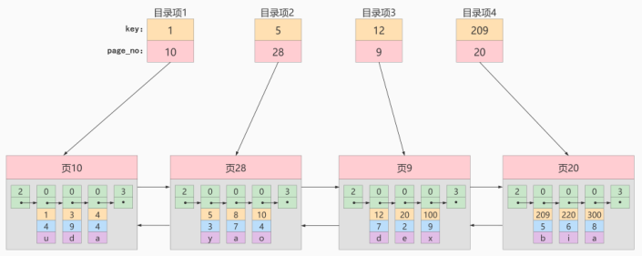
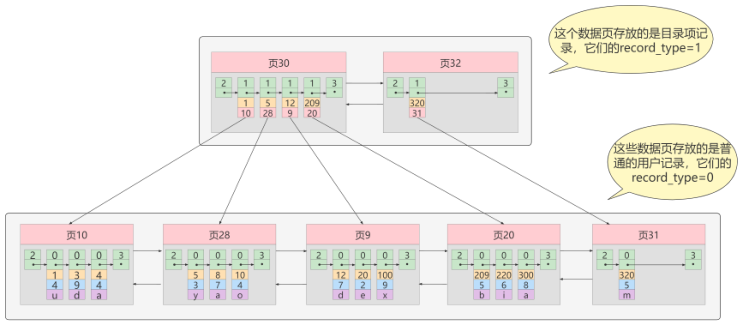

# 1. 为什么使用索引 ?
索引是存储引擎用于快速找到数据记录的一种数据结构，就好比一本教课书的目录部分，通过目录中找到对应文章的页码，便可快速定位到需要的文章。MySQL中也是一样的道理，进行数据查找时，首先查看查询条件是否命中某条索引，符合则通过索引查找相关数据，如果不符合则需要全表扫描，即需要一条一条地查找记录，直到找到与条件符合的记录。


如上图所示，数据库没有索引的情况下，数据分布在硬盘不同的位置上面，读取数据时，摆臂需要前后摆动查找数据，这样操作非常消耗时间。如果数据顺序摆放，那么也需要从1到6行按顺序读取，这样就相当于进行了6次IO操作，依旧非常耗时。如果我们不借助任何索引结构帮助我们快速定位数据的话，我们查找 **Col2=89** 这条记录，就要逐行去查找、去比较。从 **Col 2=34** 开始，进行比较，发现不是，继续下一行。我们当前的表只有不到10行数据，但如果表很大的话，有上千万条数据，就意味着要做很多很多次磁盘I/О才能找到。现在要查找 **Col2=89** 这条记录。CPU 必须先去磁盘查找这条记录，找到之后加载到内存，再对数据进行处理。这个过程最耗时间的就是磁盘I/O (涉及到磁盘的旋转时间（速度较快）、磁头的寻道时间(速度慢、费时))

假如给数据使用 二叉树 这样的数据结构进行存储，如下图所示


对字段 Col2 添加了索引，就相当于在硬盘上为 Col2 维护了一个索引的数据结构，即这个二叉搜索树。二叉搜索树的每个结点存储的是 (K，V) 结构，key 是 Col2， value是该 key 所在行的文件指针(地址)。比如:该二叉搜索树的根节点就是: **(34,0x07)**。现在对 Col2 添加了索引，这时再去查找 **Col2=89** 这条记录的时候会先去查找该二叉搜索树（二叉树的遍历查找）。读 34 到内存，**89 > 34**，继续右侧数据，读89到内存， **89 == 89**，找到数据返回。找到之后就根据当前结点的 value 快速定位到要查找的记录对应的地址。我们可以发现，只需要查找两次就可以定位到记录的地址，查询速度就提高了。

> 这就是我们为什么要建索引，目的就是为了减少磁盘工/0的次数，加快查询速率。

# 2. 索引及其优缺点

## 2.1 索引概述
- MySQL 官方对索引的定义为：索引（Index）是帮助 MySQL 高效获取数据的数据结构。

> 索引的本质：索引是数据结构。你可以简单理解为 **排好序的快速查找数据结构** ，满足特定查找算法。这些数据结构以某种方式指向数据， 这样就可以在这些数据结构的基础上实现高级查找算法。

索引是在存储引擎中实现的，因此每种存储引擎的索引不一定完全相同，并且每种存储引擎不一定支持所有索引类型。同时，存储引擎可以定义每个表的最大索引数和最大索引长度。所有存储引擎支持每个表 **至少16个索引** ，总索引长度至少为 256 字节。有些存储引擎支持更多的索引数和更大的索引长度。

## 2.2 优点
- 类似大学图书馆建书目索引，提高数据检索的效率，降低数据库的 I/O 成本，这也是创建索引最主要的原因。
- 通过创建唯一索引，可以保证数据库表中每一行数据的唯一性。
- 在实现数据的参考完整性方面，可以加速表和表之间的连接。换句话说，对于有依赖关系的子表和父表联合查询时，可以提高查询速度。
- 在使用分组和排序子句进行数据查询时，可以显著减少查询中分组和排序的时间，降低了 CPU 的消耗。

## 2.3 缺点
- 增加索引也有许多不利的方面，主要表现在如下几个方面:
    - 创建索引和维护索引要耗费时间，并且随着数据量的增加，所耗费的时间也会增加。
    - 索引需要占磁盘空间，除了数据表占数据空间之外，每一个索引还要占一定的物理空间存储在磁盘上，如果有大量的索引，索引文件就可能比数据文件更快达到最大文件尺寸。
    - 虽然索引大大提高了查询速度，同时却会降低更新表的速度。当对表中的数据进行增加、删除和修改的时候，索引也要动态地维护，这样就降低了数据的维护速度。

> 因此，选择使用索引时，需要综合考虑索引的优点和缺点。

> **提示:**
> - 索引可以提高查询的速度，但是会影响插入记录的速度。这种情况下，最好的办法是先删除表中的索引，然后插入数据，插入完成后再创建索引。

# 3. InnoDB中索引的推演
## 3.1 索引之前的查找
先来看一个精确匹配的例子：
```sql
SELECT [列名列表] FROM 表名 WHERE 列名 = xxx;
```

### 1.在一个页中的查找

> 假设目前表中的记录比较少，所有的记录都可以被存放在一个页中，在查找记录的时候可以根据搜索条件的不同分为两种情况：

- 以主键为搜索条件
    - 可以在页目录中使用 **二分法** 快速定位到对应的 **槽**，然后再遍历该 **槽** 对应分组中的记录即可快速找到指定的记录。
- 以其他列作为搜索条件
    - 因为在数据页中并没有对非主键建立所谓的 **页目录**，所以我们无法通过 **二分法** 快速定位相应的 **槽**。这种情况下只能从最小记录开始依次遍历单链表中的每条记录，然后对比每条记录是不是符合搜索条件。很显然，这种查找的效率是非常低的。

### 2.在很多页中查找

> **大部分情况下我们表中存放的记录都是非常多的，需要好多的数据页来存储这些记录。在很多页中查找记录的话可以分为两个步骤：**
> 1. 定位到记录所在的页。
> 2. 从所在的页内查找相应的记录。

> 在没有索引的情况下，不论是根据主键列或者其他列的值进行查找，由于我们并不能快速的定位到记录所在的页，所以只能从第一个页沿着 **双向链表** 一直往下找，在每一个页中根据我们上面的查找方式去查找指定的记录。因为要遍历所有的数据页，所以这种方式显然是超级耗时的。如果一个表有一亿条记录呢？此时索引应运而生

## 3.2 设计索引
### 3.2.1 建一个表：

```sql
CREATE TABLE index_demo(
    c1 INT,
    c2 INT,
    c3 CHAR(1),
    PRIMARY KEY(c1)
) ROW_FORMAT = Compact;
```

- 这个新建的 **index_demo** 表中有 2 个 INT 类型的列，1 个 CHAR(1) 类型的列，而且我们规定了 c1 列为主键。
- 这个表使用 **Compact行格式** 来实际存储记录的。这里我们简化了 **index_demo** 表的行格式示意图：


- **record_type：** 记录头信息的一项属性，表示记录的类型，0表示普通记录、1表示目录项记录、2表示最小记录、3表示最大记录。
- **next_record：** 记录头信息的一项属性，表示下一条地址相对于本条记录的地址偏移量，我们用箭头来表明下一条记录是谁。
- **各个列的值：** 这里只记录在index_demo表中的三个列，分别是c1、c2和c3。
- **其他信息：** 除了上述3种信息以外的所有信息，包括其他隐藏列的值以及记录的额外信息。

- 将记录格式示意图的其他信息项暂时去掉并把它竖起来的效果就是这样：
    - 

- 把一些记录放到页里的示意图就是：
    - 

### 3.2.2 一个简单的索引设计方案
> **我们在根据某个搜索条件查找一些记录时为什么要遍历所有的数据页呢？**
> - 因为各个页中的记录并没有规律，我们并不知道我们的搜索条件匹配哪些页中的记录，所以不得不依次遍历所有的数据页。
> - 所以如果我们想快速的定位到需要查找的记录在哪些数据页中该咋办？我们可以为快速定位记录所在的数据页而建立一个目录，建这个目录必须完成下边这些事：

#### 下一个数据页中用户记录的主键值必须大于上一个页中用户记录的主键值。
> 假设：每个数据页最多能存放 3 条记录(实际上一个数据页非常大，可以存放下好多记录)。有了这个假设之后我们向 **index_demo** 表插入3条记录:
```shell
mysql> INSERT INTO index_demo vALUES(1，4，‘u')，(3，9，'d')，(5， 3，‘y');
Query oK，3 rows affected (e.01 sec)
Records: 3 Duplicates: 8 Warnings : 8
```

- 那么这些记录已经按照主键值的大小串联成一个单向链表了，如图所示:
    - 

从图中可以看出来，index_demo 表中的3条记录都被插入到了编号为10的数据页中了。此时我们再来插入一条记录:
```shell
mysql> INSERT INTO index_demo VALUES(4，4，'a ' );
```

- 因为页10最多只能放3条记录，所以我们不得不再分配一个新页:
    - 

> **注意 !!**
> - 新分配的数据页编号可能并不是连续的。它们只是通过维护着上一个页和下一个页的编号而建立了链表关系。
> - 另外，页 10 中用户记录最大的主键值是 5，而页28中有一条记录的主键值是 4，因为 **5 > 4**，所以这就不符合下一个数据页中用户记录的主键值必须大于上一个页中用户记录的主键值的要求，所以在插入主键值为4的记录的时候需要伴随着一次记录移动，也就是把主键值为5的记录移动到页28中，然后再把主键值为4的记录插入到页10中，这个过程的示意图如下:
> - 
> 这个过程表明了在对页中的记录进行增删改操作的过程中，我们必须通过一些诸如记录移动的操作来始终保证这个状态一直成立:下一个数据页中用户记录的主键值必须大于上一个页中用户记录的主键值。这个过程我们称为 **页分裂**。

#### 给所有的页建立一个目录项。
- 由于数据页的编号可能是不连续的，所以在向 **index_demo** 表中插入许多条记录后，可能是这样的效果:
    - 

- 因为这些16KB的页在物理存储上是不连续的，所以如果想从这么多页中根据主键值快速定位某些记录所在的页，我们需要给它们做个目录，每个页对应一个目录项，每个目录项包括下边两个部分:
    - 页的用户记录中最小的主键值，我们用 **key**来 表示。
    - 页号，我们用 **page_no** 表示。

- 所以我们为上边几个页做好的目录就像这样子：
    - 

- 以页28为例，它对应目录项2，这个目录项中包含着该页的页号28以及该页中用户记录的最小主键值5。我们只需要把几个目录项在物理存储器上连续存储（比如：数组），就可以实现根据主键值快速查找某条记录的功能了。比如：查找主键值为20的记录，具体查找过程分两步：
    1. 先从目录项中根据二分法快速确定出主键值为20的记录在目录项3中（因为 12 < 20 < 209 ），它对应的页是页9。
    2. 再根据前边说的在页中查找记录的方式去页9中定位具体的记录。

> 至此，针对数据页做的简易目录就搞定了。这个目录有一个别名，称为 **索引**。

### 3.2.3 InnoDB中的索引方案
#### ① 迭代1次：目录项记录的页
> 上边称为一个简易的索引方案，是因为我们为了在根据主键值进行查找时使用 **二分法** 快速定位具体的目录项而假设所有目录项都可以在物理存储器上连续存储，但是这样做有几个问题:
> - InnoDB 是使用页来作为管理存储空间的基本单位，最多能保证 **16KB** 的连续存储空间，而随着表中记录数量的增多，需要非常大的连续的存储空间才能把所有的目录项都放下，这对记录数量非常多的表是不现实的。
> - 我们时常会对记录进行增删，假设我们把页28中的记录都删除了，那意味着目录项2也就没有存在的必要了，这就需要把目录项2后的目录项都向前移动一下，这样牵一发而动全身的操作效率很差。
> - 所以，我们需要一种可以灵活管理所有目录项的方式。我们发现目录项其实长得跟我们的用户记录差不多，只不过目录项中的两个列是主键和页号而已，为了和用户记录做一下区分，我们把这些用来表示目录项的记录称为 **目录项记录**。

- 那InnoDB怎么区分一条记录是普通的用户记录还是目录项记录呢?使用记录头信息里的 record_type 属性，它的各个取值代表的意思如下:
    - 0:普通的用户记录
    - 1:目录项记录
    - 2:最小记录
    - 3 :最大记录

- 我们把前边使用到的目录项放到数据页中的样子就是这样：
    - 

- 从图中可以看出来，我们新分配了一个编号为30的页来专门存储目录项记录。这里再次强调目录项记录和普通的用户记录的不同点：
    - 目录项记录的 **record_type** 值是1，而普通用户记录的 **record_type** 值是0。
    - 目录项记录只有主键值和页的编号两个列，而普通的用户记录的列是用户自己定义的，可能包含很多列，另外还有 InnoDB 自己添加的 **隐藏列**。
    - 了解：记录头信息里还有一个叫 **min_rec_mask** 的属性，只有在存储目录项记录的页中的主键值最小的目录项记录的 **min_rec_mask** 值为1，其他别的记录的**min_rec_mask** 值都是0。

#### ② 迭代2次：多个目录项纪录的页
> 虽然说目录项记录中只存储主键值和对应的页号，比用户记录需要的存储空间小多了，但是不论怎么说一个页只有 **16KB** 大小，能存放的目录项记录也是有限的，那如果表中的数据太多，以至于一个数据页不足以存放所有的目录项记录，如何处理呢?

- 这里我们假设一个存储目录项记录的页最多只能存放4条目录项记录，所以如果此时我们再向上图中插入一条主键值为320的用户记录的话，那就需要分配一个新的存储目录项记录的页:
    - 

- 从图中可以看出，我们插入了一条主键值为320的用户记录之后需要两个新的数据页：
    - 为存储该用户记录而新生成了页31。
    - 因为原先存储目录项记录的页30的容量已满（我们前边假设只能存储4条目录项记录），所以不得不需要一个新的页32来存放页31对应的目录项。

- 现在因为存储目录项记录的页不止一个，所以如果我们想根据主键值查找一条用户记录大致需要3个步骤，以查找主键值为20的记录为例：
    1. 确定目录项记录页
    2. 我们现在的存储目录项记录的页有两个，即页30和页32，又因为页30表示的目录项的主键值的范围是 [1, 320) ，页32表示的目录项的主键值不小于 320 ，所以主键值为20的记录对应的目录项记录在页30中。
    3. 通过目录项记录页确定用户记录真实所在的页。在一个存储目录项记录的页中通过主键值定位一条目录项记录的方式说过了。
    4. 在真实存储用户记录的页中定位到具体的记录。

#### ③ 迭代3次：目录项记录页的目录页
> 问题来了，在这个查询步骤的 **第1步** 中我们需要定位存储目录项记录的页，但是这些 **页是不连续的** ，如果我们表中的数据非常多则会 **产生很多存储目录项记录的页** ，那我们怎么根据主键值快速定位一个存储目录项记录的页呢 ? 
> - 那就为这些存储目录项记录的页再生成一个 更高级的目录 ，就像是一个多级目录一样，大目录里嵌套小目录 ，小目录里才是实际的数据，所以现在各个页的示意图就是这样子:
> - 
> -  如图，我们生成了一个存储更高级目录项的页33，这个页中的两条记录分别代表页30和页32，如果用户记录的主键值在[1, 320)之间，则到页30中查找更详细的目录项记录，如果主键值不小于320的话，就到页32中查找更详细的目录项记录。

- 随着表中记录的增加，这个目录的层级会继续增加，如果简化一下，那么我们可以用下边这个图来描述它:
    - 
    - 这个数据结构，它的名称是B+树。

#### ④ B+Tree
> 不论是存放用户记录的数据页，还是存放目录项记录的数据页，我们都把它们存放到B+树这个数据结构中了，所以我们也称这些数据页为 **节点**。从图中可以看出，我们的实际用户记录其实都存放在B+树的最底层的节点上，这些节点也被称为 **叶子节点** ，其余用来存放 **目录项** 的节点称为 **非叶子节点** 或者 **内节点** ，其中B+树最上边的那个节点也称为 **根节点** 。

- 一个B+树的节点其实可以分成好多层，规定最下边的那层，也就是存放我们用户记录的那层为第0层，之后依次往上加。之前我们做了一个非常极端的假设：存放用户记录的页最多存放3条记录，存放目录项记录的页最多存放4条记录。其实真实环境中一个页存放的记录数量是非常大的，假设所有存放用户记录的叶子节点代表的数据页可以存放100条用户记录，所有存放目录项记录的内节点代表的数据页可以存放1000条目录项记录，那么：
    - 如果B+树只有1层，也就是只有1个用于存放用户记录的节点，最多能存放100条记录。
    - 如果B+树有2层，最多能存放1000×100=10,0000条记录。
    - 如果B+树有3层，最多能存放1000×1000×100=1,0000,0000条记录。
    - 如果B+树有4层，最多能存放1000×1000×1000×100=1000,0000,0000条记录。相当多的记录！！！

> 你的表里能存放 100000000000 条记录吗？所以一般情况下，我们用到的 **B+树都不会超过4层** ，那我们通过主键值去查找某条记录最多只需要做4个页面内的查找（查找3个目录项页和一个用户记录页），又因为在 **每个页面** 内有所谓的 **Page Directory（页目录）**，所以在页面内也可以通过 **二分法** 实现快速定位记录。

## 3.3 常见索引概念
> 索引按照物理实现方式，索引可以分为 2 种：**聚簇（聚集）** 和 **非聚簇（非聚集）** 索引。我们也把非聚集索引称为二级索引或者辅助索引。

### 3.3.1 聚簇索引
> 聚簇索引 并不是一种单独的索引类型，而是一种数据存储方式(所有的用户记录都存储在了叶子节点)，也就是所谓的索引即数据，数据即索引 。

> 术语"聚簇"表示数据行和相邻的键值聚簇的存储在一起。

#### 特点：

- 使用记录主键值的大小 进行记录和页的排序，这包括三个方面的含义：
    1. 页内的记录是按照主键的大小顺序排成一个单向链表。
    2. 各个存放用户记录的页也是根据页中用户记录的主键大小顺序排成一个双向链表。
    3. 存放目录项记录的页分为不同的层次，在同一层次中的页也是根据页中目录项记录的主键大小顺序排成一个双向链表。

- B+树的叶子节点存储的是完整的用户记录。
    - 所谓完整的用户记录，就是指这个记录中存储了所有列的值（包括隐藏列）。

> 我们把具有这两种特性的B+树称为聚簇索引，所有完整的用户记录都存放在这个聚簇索引的叶子节点处。这种聚簇索引并不需要我们在 MySQL 语句中显式的使用 INDEX 语句去创建，InnoDB 存储引擎会自动的为我们创建聚簇索引。

> 在我们往数据表中添加数据时，InnoDB 会检查该表是否有用户创建的主键，没有主键会用唯一的非空索引作为聚簇索引，如果也没有唯一非空索引就会生成一个隐藏的主键（RowId）作为聚簇索引

#### 优点：
- 数据访问更快，因为聚簇索引将索引和数据保存在同一个B+树中，因此从聚簇索引中获取数据比非聚簇索引更快
- 聚簇索引对于主键的排序查找和范围查找速度非常快
- 按照聚簇索引排列顺序，查询显示一定范围数据的时候，由于数据都是紧密相连，数据库不用从多个数据块中提取数据，所以节省了大量的 I/O 操作。


#### 缺点：
- **插入速度严重依赖按照主键的顺序插入是最快的方式:** 否则将会出现页分裂，严重影响性能。因此，对于InnoDB表，我们一般都会定义一个自增ID列为主键
- **更新主键的代价很高:** 因为将会导致被更新的行移动。因此，对于InnoDB表，我们一般定义主键为不可更新
- **二级索引访问需要两次索引查找:** 第一次找到主键值，第二次根据主键值找到行数据

#### 限制：
- 对于 MySQL 数据库目前只有 InnoDB 数据引擎支持聚簇索引，而 MyISAM 并不支持聚簇索引。
- 由于数据物理存储排序方式只能有一种，所以每个 MySQL 的表只能有一个聚簇索引。一般情况下就是该表的主键。
- 如果没有定义主键，Innodb会选择非空的唯一索引代替。如果没有这样的索引，Innodb 会隐式的定义一个主键来作为聚簇索引。
- 为了充分利用聚簇索引的聚簇的特性，所以 Innodb 表的主键列尽量 选用有序的顺序 id ，而不建议用无序的 id，比如 UUID、MD5、HASH、字符串列作为主键无法保证数据的顺序增长。

### 3.3.2 二级索引（辅助索引、非聚簇索引）
> 在MySQL中，一个数据表只能有一个聚簇索引，但是可以有多个二级索引

- 上边介绍的聚簇索引只能在搜索条件是主键值时才能发挥作用，因为B+树中的数据都是按照主键进行排序的。那如果我们想以别的列作为搜索条件该怎么办呢?
    - 肯定不能是从头到尾沿着链表依次遍历记录一遍。
    - **答案:** 我们可以多建几棵B+树，不同的B+树中的数据采用不同的排序规则。
    - 比方说我们用 c2 列的大小作为数据页、页中记录的排序规则，再建一棵B+树，效果如下图所示:
    - 

- 这个B+树与上边介绍的 **聚簇索引** 有几处不同:
    - 使用记录 c2列的大小进行记录和页的排序，这包括三个方面的含义:
        1. 页内的记录是按照c2列的大小顺序排成一个 单向链表 。
        2. 各个存放 **用户记录的页** 也是根据页中记录的c2列大小顺序排成一个 **双向链表** 。
        3. 存放 **目录项记录的页** 分为不同的层次，在同一层次中的页也是根据页中目录项记录的c2列大小顺序排成一个 **双向链表**
    - B+树的叶子节点存储的并不是完整的用户记录，而只是 **c2列+主键** 这两个列的值。
    - 目录项记录中不再是 **主键+页号** 的搭配，而变成了 **c2列+页号** 的搭配。

- 所以如果我们现在想通过c2列的值查找某些记录的话就可以使用我们刚刚建好的这个B+树了。以查找c2列的值为4的记录为例，查找过程如下:
    1. 确定 **目录项记录页**
    2. 根据根页面，也就是页44，可以快速定位到目录项记录所在的页为页42(因为 `2 < 4 < 9` )。
    3. 通过 **目录项记录页** 确定用户记录真实所在的页。
    4. 在页42中可以快速定位到实际存储用户记录的页，但是由于c2列并没有唯一性约束，所以c2 列值为 4 的记录可能分布在多个数据页中，又因为 `2 < 4 ≤ 4`，所以确定实际存储用户记录的页在页34和页35中。
    5. 在真实存储用户记录的页中定位到具体的记录。
    6. 到页34和页35中定位到具体的记录。
    7. 但是这个B+树的叶子节点中的记录只存储了 c2 和 c1(也就是主键) 两个列，所以我们必须再根据 **主键值** 去 **聚簇索引** 中再查找—遍完整的用户记录。

#### 概念：回表 
> 我们根据这个以c2列大小排序的B+树只能确定我们要查找记录的主键值，所以如果我们想根据c2列的值查找到完整的用户记录的话，仍然需要到聚簇索引中再查一遍，这个过程称为 **回表** 。也就是根据c2列的值查询一条完整的用户记录需要使用到2棵B+树！

#### 问题：为什么我们还需要一次 `回表` 操作呢？直接把完整的用户记录放到叶子节点不OK吗？

- 如果把完整的用户记录放到叶子节点是可以不用回表。但是太占地方了，相当于每建立一棵B+树都需要把所有的用户记录再都拷贝一遍，这就有点太浪费存储空间了。

- 因为这种按照 **非主键列** 建立的B+树需要一次回表操作才可以定位到完整的用户记录，所以这种B+树也被称为 **二级索引(英文名secondary index )** ，或者 **辅助索引** 。由于我们使用的是 c2列 的大小作为B+树的排序规则，所以我们也称这个B+树是为c2列建立的索引。

- 非聚簇索引的存在不影响数据在聚簇索引中的组织，所以一张表可以有多个非聚簇索引。
    - 

#### 小结：聚簇索引与非聚簇索引的原理不同，在使用上也有一些区别:
- 聚簇索引的 **叶子节点** 存储的就是我们的 **数据记录**，非聚簇索引的叶子节点存储的是 *8数据位置** 。非聚簇索引不会影响数据表的物理存储顺序。
- 一个表只能有一个聚簇索引，因为只能有一种排序存储的方式，但可以有多个非聚簇索引，也就是多个索引目录提供数据检索。
- 使用聚簇索引的时候，数据的 **查询效率高** ，但如果对数据进行插入，删除，更新等操作，效率会比非聚簇索引低。

### 3.3.3 联合索引
- 我们也可以同时以多个列的大小作为排序规则，也就是同时为多个列建立索引，比方说我们想让 **B+树** 按照c2和c3列的大小进行排序，这个包含两层含义：
    1. 先把各个记录和页按照c2列进行排序。
    2. 在记录的c2列相同的情况下，采用c3列进行排序

- 为 c2 和 c3 列建立的索引的示意图如下:
    - 

- 如图所示，我们需要注意以下几点:
    - 每条 **目录项记录** 都由 c2、c3、页号 这三个部分组成，各条记录先按照c2列的值进行排序，如果记录的c2列相同，则按照c3列的值进行排序。
    - B+树 **叶子节点** 处的用户记录由 c2、c3和主键c1列组成。

- 注意一点，以c2和c3列的大小为排序规则建立的B+树称为 **联合索引**，本质上也是一个 **二级索引**。它的意思与分别为c2和c3列分别建立索引的表述是不同的，不同点如下：
    - 建立联合索引只会建立如上图一样的1棵B+树。
    - 为c2和c3列分别建立索引会分别以c2和c3列的大小为排序规则建立2棵B+树。

## 3.4 InnoDB的B+树索引的注意事项
### 3.4.1 根页面位置万年不动
> 我们前边介绍B+索引的时候，为了大家理解上的方便，先把存储用户记录的叶子节点都画出来，然后接着画存储目录项记录的内节点，实际上B+树的形成过程是这样的：
1.  每当为某个表创建一个B+树索引（聚簇索引不是人为创建的，默认就有）的时候，都会为这个索引创建一个 **根节点** 页面。最开始表中没有数据的时候，每个B+树索引对应的根节点中既没有用户记录，也没有目录项记录。
2. 随后向表中插入用户记录时，先把 **用户记录存储** 到这个 **根节点** 中。
3. 当根节点中的 **可用空间用完** 时继续插入记录，此时会将根节点中的所有记录复制到一个新分配的页，比如页a中，然后对这个新页进行 **页分裂** 的操作，得到另一个新页，比如页b。这时新插入的记录根据键值（也就是聚簇索引中的主键值，二级索引中对应的索引列的值）的大小就会被分配到页a或者页b中，而 **根节点便升级为存储目录项记录的页**。

> **这个过程特别注意的是：**
> - 一个B+树索引的根节点自诞生之日起，便不会再移动。这样只要我们对某个表建立一个索引，那么它的根节点的页号便会被记录到某个地方，然后凡是 InnoDB 存储引擎需要用到这个索引的时候，都会从那个固定的地方取出根节点的页号，从而来访问这个索引。

### 3.4.2 内节点中目录项记录的唯一性
> 我们知道B+树索引的内节点中目录项记录的内容是索引列+页号的搭配，但是这个搭配对于二级索引来说有点不严谨。还拿index_demo表为例，假设这个表中的数据是这样的：

| c1 | c2 | c3 |
| --- | --- | --- |
| 1	 | 1 | 'u' |
| 3	 | 1 | 'd' |
| 5	 | 1 | 'y' |
| 7	 | 1 | 'a' |

- 如果二级索引中目录项的内容只是 **索引号+页号** 的搭配的话，那么为c2列建立索引后的B+树应该长这样：
    - 
    - 如果我们想要新插入一行记录，其中 c1、c2、c3 的值分别是：9、1、c，那么在修改这个为c2 列建立的二级索引对应的B+树时便碰到了个大问题：
    - 由于页3中存储的目录项记录是由c2列+页号的值构成的，页3中的两条目录项记录对应的c2列的值都是1，那么我们这条新插入的记录到底应该放在页4中，还是应该放在页5中啊？答案是：对不起，懵了。

- 为了让新插入记录能找到自己在哪个页里，我们需要保证在B+树的同一层内节点的目录项记录除页号这个字段以外是唯一的。所以对于二级索引的内节点的目录项记录的内容实际上是由三个部分构成的：
    - 索引列的值
    - 主键值
    - 页号

- 也就是我们把主键值也添加到二级索引内节点中的目录项记录了，这样就能保证B+树每一层节点中各条目录项记录除页号这个字段外是唯一的，所以我们为c2列建立二级索引后的示意图实际上应该是这样子的：
    - 

> 这样我们再插入记录(9, 1, 'c')时，由于页3中存储的目录项记录是由 **c2列+主键+页号** 的值构成的，可以先把新记录的c2列的值和页3中各目录项记录的c2列的值作比较，如果c2列的值相同的话，可以接着比较主键值，因为B+树同一层中不同目录项记录的c2列+主键的值肯定是不一样的，所以最后肯定能定位唯一的一条目录项记录，在本例中最后确定新记录应该被插入到页5中。

### 3.4.3 一个页面最少可以存储2条记录
> 一个B+树只需要很少的层级就可以轻松存储数亿条记录，查询速度相当不错！这是因为B+树本质上就是一个大的多层级目录，每经过一个目录时都会过滤掉许多无效的子目录，直到最后访问的存储真实数据的目录。那如果一个大的目录中只存放一个子目录是个啥效果呢？那就是目录层级非常非常非常多，而且最后的那个存放真实数据的目录中存放一条记录。费了半天劲只能存放一条真实的用户记录？所以 **InnoDB的一个数据页至少可以存放两条记录**

# 4. MyISAM中的索引方案
B树索引适用存储引擎如表所示：

| 索引/存储引擎	| MyISAM | InnoDB | Memory |
|---|---|---|---|
| B-Tree索引 | 支持 | 支持 | 支持 |

> 即使多个存储引擎支持同一种类型的索引，但是他们的实现原理也是不同的。Innodb 和MyISAM 默认的索引是 B+tree索引；而 Memory 默认的索引是 Hash 索引。

> MyISAM 引擎使用B+Tree作为索引结构，叶子节点的data域存放的是数据记录的地址。

## 4.1 MyISAM索引的原理
> 在MyISAM引擎中，没有聚簇索引这一说法，只有二级索引

- 下图是MylSAM索引的原理图。
    - 

- 我们知道 InnoDB中索引即数据 ，也就是 **聚簇索引** 的那棵B+树的叶子节点中已经把所有完整的用户记录都包含了，而 MyISAM 的索引方案虽然也使用树形结构，但是却将 **索引和数据分开存储** :
    1. 将表中的记录 **按照记录的插入顺序** 单独存储在一个文件中，称之为 **数据文件** 。这个文件并不划分为若干个数据页，有多少记录就往这个文件中塞多少记录就成了。由于在插入数据的时候并 没有刻意按照主键大小排序 ，所以我们并不能在这些数据上使用二分法进行查找。
    2. 使用 **MyISAM 存储引擎的表会把索引信息另外存储到一个称为 索引文件** 的另一个文件中。MyISAM 会单独为表的主键创建一个索引，只不过在索引的叶子节点中存储的不是完整的用户记录，而是 **主键值＋数据记录地址的组合** 。

- 这里设表一共有三列，假设我们以 **col1** 为主键，上图是一个MyISAM表的主索引(Primary key)示意。可以看出 MyISAM 的索引文件仅仅保存数据记录的地址 。在MyISAM中，主键索引和二级索引(Secondary key)在结构上没有任何区别，只是主键索引要求key是唯一的，而二级索引的key可以重复。如果我们在col2上建立一个二级索引，则此索引的结构如下图所示:
    - 

## 4.2 MyISAM 与 InnoDB对比
> MyISAM的索引方式都是 **非聚簇** 的，与InnoDB包含1个聚簇索引是不同的。

### 小结两种引擎中索引的区别：
- ① 在InnoDB存储引擎中，我们只需要根据主键值对聚簇索引进行一次查找就能找到对应的记录，而在MyISAM中却需要进行一次回表操作，意味着MyISAM中建立的索引相当于全部都是二级索引。

- ② InnoDB的数据文件本身就是索引文件，而MyISAM索引文件和数据文件是分离的，索引文件仅保存数据记录的地址。

- ③ InnoDB的非聚簇索引data域存储相应记录主键的值，而MyISAM索引记录的是地址。换句话说，InnoDB的所有非聚簇索引都引用主键作为data域。

- ④ MyISAM的回表操作是十分快速的，因为是拿着地址偏移量直接到文件中取数据的，反观InnoDB是通过获取主键之后再去聚簇索引里找记录，虽然说也不慢，但还是比不上直接用地址去访问。

- ⑤ InnoDB要求表必须有主键（MyISAM可以没有）。如果没有显式指定，则MySQL系统会自动选择一个可以非空且唯一标识数据记录的列作为主键。如果不存在这种列，则MySQL自动为InnoDB表生成一个隐含字段作为主键，这个字段长度为6个字节，类型为长整型。

### 小结:
- 

- 了解不同存储引擎的索引实现方式对于正确使用和优化索引都非常有帮助。比如:

- 举例1:知道了InnoDB的索引实现后，就很容易明白 为什么不建议使用过长的字段作为主键 ，因为所有二级索引都引用主键索引，过长的主键索引会令二级索引变得过大。

- 举例2:用非单调的字段作为主键在InnoDB中不是个好主意，因为InnoDB数据文件本身是一棵B+Tree，非单调的主键会造成在插入新记录时，数据文件为了维持B+Tree的特性而频繁的分裂调整，十分低效，而使用 自增字段作为主键则是一个很好的选择。

# 5. 索引的代价
> 索引是个好东西，可不能乱建，它在空间和时间上都会有消耗：

### 空间上的代价
> 每建立一个索引都要为它建立一棵B+树，每一棵B+树的每一个节点都是一个数据页，一个页默认会占用16KB的存储空间，一棵很大的B+树由许多数据页组成，那就是很大的一片存储空间。

### 时间上的代价
> 每次对表中的数据进行增、删、改操作时，都需要去修改各个B+树索引。而且我们讲过，B+树每层节点都是按照索引列的值从小到大的顺序排序而组成了双向链表。不论是叶子节点中的记录，还是内节点中的记录（也就是不论是用户记录还是目录项记录）都是按照索引列的值从小到大的顺序而形成了一个单向链表。而增、删、改操作可能会对节点和记录的排序造成破坏，所以存储引擎需要额外的时间进行一些记录移位，页面分裂、页面回收等操作来维护好节点和记录的排序。如果我们建了许多索引，每个索引对应的B+树都要进行相关的维护操作，会给性能拖后腿。

> 一个表上索引建的越多，就会占用越多的存储空间，在增删改记录的时候性能就越差。为了能建立又好又少的索引，我们得学学这些索引在哪些条件下起作用的。