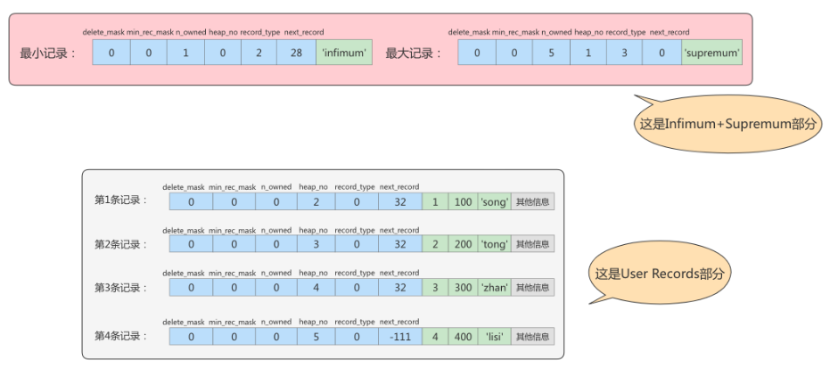
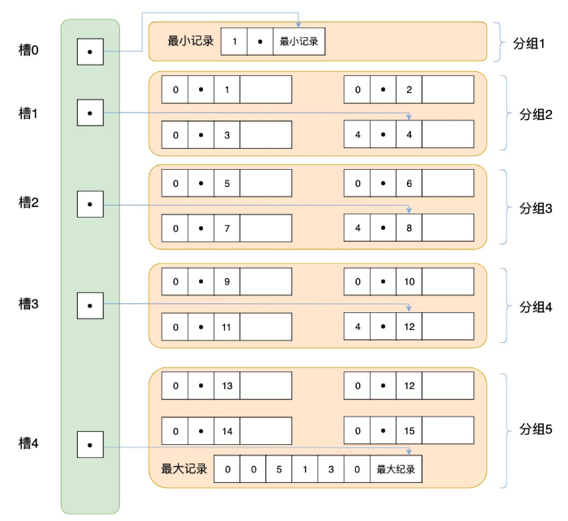

# 1. 数据库的存储结构：页

索引结构给我们提供了高效的索引方式，不过索引信息以及数据记录都保存在文件上的，确切说是存储在页结构中。另一方面，索引是在存储引擎中实现的，MySQL服务器上的`存储引擎`负责对表中数据的读取和写入工作。不同存储引擎中`存放的格式`一般不同的，甚至有的存储引擎比如Memory都不用磁盘来存储数据。

由于`InnoDB`是MySQL的`默认存储引擎`，所以本章剖析InooDB存储引擎的数据存储结构。

## 1.1 磁盘与内存交互基本单位：页

InnoDB 将数据划分为若干个页，InnoDB中页的大小默认为`16KB`。

以`页`作为磁盘和内存之间交互的基本单位，也就是一次最少从磁盘中读取16KB的内容到内存中，一次最少把内存中的16KB内容刷新到磁盘中。也就是说， **在数据库中，不论读一行，还是读多行，都是将这些行所在的页进行加载。也就是说，数据库管理存储空间的基本单位是页（Page），数据库I/O操作的最小单位是页。** 一个页中可以存储多个行记录。


> 记录是按照行来存储的，但是数据库的读取并不以行为单位，否则一次读取（也就是一次I/O操作）只能处理一行数据，效率会非常低。

## 1.2 页结构概述

页a、页b、页c...页n这些页可以`不在物理结构上相连`，只要通过`双向链表`相关联即可。每个数据页中的记录会按照主键值从小到大的顺序组成一个`单向链表`，每个数据页都会为存储在它里边的记录生成一个`页目录`，在通过主键查找某条记录的时候可以在页目录中`使用二分法`快速定位到对应的槽，然后再遍历该槽对应的分组中的记录即可快速找到指定的记录。

## 1.3 頁的大小

不同的数据库管理系统（简称DBMS ）的页大小不同。比如在MySQL的InnoDB存储引擎中，默认页的大小是16KB，我们可以通过下面的命令来进行查看:

```shell
mysql>show variables like '%innodb_page_size%';
```


> SQL Server中页的大小为 8KB，而在Oracle 中我们用术语 「块(Block)」来代表 **页**，Oralce支持的块大小为2KB，4KB，8KB，16KB，32KB和64KB。

## 1.4 页的上层结构
> 另外在数据库中，还存在着区(Extent)、段(Segment)和表空间(Tablespace)的概念。行、页、区、段、表空间的关系如下图所示:


```text
由小到大
行（Row） → 頁（Page） → 區（Extent） → 段（Segment） → 表空間（Tablespace）
```

### 行（Row）
- 資料表中的一筆紀錄。
- 比如：`INSERT INTO user (id, name) VALUES (1, '小明');`

### 頁（Page）
- InnoDB 的最小儲存單位，**預設大小為 16KB**。
- 一個頁中可以存放多筆「行」。
- 比喻：像是筆記本中的一頁，可以記很多筆紀錄。
```sql
CREATE TABLE user (
  id INT PRIMARY KEY,
  name VARCHAR(100)
);
```
假設我們插入 1000 筆資料，每筆資料約佔 200 bytes，那一頁（16KB）可以裝約 80 筆 → 1000 筆需要約 13 頁。

### 區（Extent）
> 区（Extent）是比页大一级的存储结构，在InnoDB存储引擎中，一个区会分配`64个连续的页`。因为InnoDB中的页大小默认是16KB，所以一个区的大小是64*16KB=`1MB`。

- 是由 **64 個頁構成的連續空間**。
- 所以一個區大小是 `64 * 16KB = 1MB`。
- MySQL 配置空間時，會以「區」為單位進行批次分配，比單頁有效率。

### 段（Segment）
> 段（Segment）由一个或多个区组成，区在文件系统是一个连续分配的空间（在InnoDB中是连续的64个页），不过在段中不要求区与区之间是相邻的。`段是数据库中的分配单位，不同类型的数据库对象以不同的段形式存在。`当我们创建数据表、索引的时候，就会相应创建对应的段，比如创建一张表时会创建一个表段，创建一个索引时会创建一个索引段。

✅ 範例說明：

```sql
CREATE INDEX idx_name ON user(name);
```

執行這行時會為這個索引建立新的「索引段」，這個段內包含自己的「區」和「頁」，不跟資料段混用。


### 表空間（Tablespace）
- 是最外層的邏輯容器。
- **存放段的容器**，一個表空間中可以有很多段。
- InnoDB 支援多種表空間類型：
  - 系統表空間（如 ibdata1）
  - 檔案表空間（每個表一個 `.ibd` 檔案）
  - 撤銷表空間（用來儲存 undo log）
  - 臨時表空間（暫時查詢的資料）

> 表空间（Tablespace）是一个逻辑容器，表空间存储的对象是段，在一个表空间中可以有一个或多个段，但是一个段只能属于一个表空间。数据库由一个或多个表空间组成，表空间从管理上可以划分为`系统表空间`、`用户表空间`、`撤销表空间`、`临时表空间`等。

# 2. 页的内部结构

页如果按类型划分的话，常见的有 数据页 (保存B+树节点)、系统页、Undo页 和 事务数据页 等。数据页是我们最常使用的页。

数据页的 **16KB** 大小的存储空间被划分为七个部分，分别是 **文件头(File Header)、页头(Page Header)、最大最小记录(Infimum+supremum)、用户记录(User Records)、空闲空间(Free Space)、页目录(Page Directory)和文件尾(File Tailer)** 。

页结构的示意图如下所示:


这7个部分作用分别如下，我们简单梳理如下表所示:


我们可以把这7个结构分成3个部分。

## 2.1 第1部分：文件头部和文件尾部

### 2.1.1 File Header（文件头部）（38字节）
> 首先是 **文件通用部分** ，也就是 **文件头** 和 **文件尾** 。

#### ①文件头部信息
**作用**：描述各种页的通用信息。（比如页的编号、其上一页、下一页是谁等）

**大小**：38字节

> 不同类型的页都会以 File Header 作为第一个组成部分，它描述了一些针对各种页都通用的一些信息，比方说这个页的编号是多少，它的上一个页、下一个页是谁等，所有的数据页会组成一个 双链表 。这个部分占用固定的38个字节，是由下边这些内容组成的:


| 名称                               | 占用空间大小 | 描述                                                         |
| ---------------------------------- | ------------ | ------------------------------------------------------------ |
| `FIL_PAGE_SPACE_OR_CHKSUM`         | `4`字节      | 页的校验和（checksum值）                                     |
| `FIL_PAGE_OFFSET`                  | `4`字节      | 页号                                                         |
| `FIL_PAGE_PREV`                    | `4`字节      | 上一个页的页号                                               |
| `FIL_PAGE_NEXT`                    | `4`字节      | 下一个页的页号                                               |
| FIL_PAGE_LSN                       | `8`字节      | 页面被最后修改时对应的日志序列位置                           |
| `FIL_PAGE_TYPE`                    | `2`字节      | 该页的类型                                                   |
| FIL_PAGE_FILE_FLUSH_LSN            | `8`字节      | 仅在系统表空间的一个页中定义，代表文件至少被刷新到了对应的LSN值 |
| `FIL_PAGE_ARCH_LOG_NO_OR_SPACE_ID` | `4`字节      | 页属于哪个表空间                                             |

- `FIL_PAGE_OFFSET（4字节）`：每一个页都有一个单独的页号，就跟你的身份证号码一样，InnoDB通过页号可以唯一定位一个页。
- `FIL_PAGE_TYPE（2字节）`：这个代表当前页的类型。InnoDB为了不同的目的而把页分为不同的类型，我们上边介绍的其实都是存储记录的 数据页，其实还有很多别的类型的页，具体如下:
  | 类型名称                | 十六进制 | 描述                             |
  | ----------------------- | -------- | -------------------------------- |
  | FIL_PAGE_TYPE_ALLOCATED | 0x0000   | 最新分配，还没有使用             |
  | `FIL_PAGE_UNDO_LOG`     | 0x0002   | Undo日志页                       |
  | FIL_PAGE_INODE          | 0x0003   | 段信息节点                       |
  | FIL_PAGE_IBUF_FREE_LIST | 0x0004   | Insert Buffer空闲列表            |
  | FIL_PAGE_IBUF_BITMAP    | 0x0005   | Insert Buffer位图                |
  | `FIL_PAGE_TYPE_SYS`     | 0x0006   | 系统页                           |
  | FIL_PAGE_TYPE_TRX_SYS   | 0x0007   | 事务系统数据                     |
  | FIL_PAGE_TYPE_FSP_HDR   | 0x0008   | 表空间头部信息                   |
  | FIL_PAGE_TYPE_XDES      | 0x0009   | 扩展描述页                       |
  | FIL_PAGE_TYPE_BLOB      | 0x000A   | 溢出页                           |
  | `FIL_PAGE_INDEX`        | 0x45BF   | 索引页，也就是我们所说的`数据页` |

  > 我们存放记录的数据页的类型其实是 FIL_PAGE_INDEX ，也就是所谓的索引页。

#### ②数据页的链接实现
> 在文件头部内容中有两个属性:FIL_PAGE_PREV 和 FIL_PAGE_NEXT

- `FIL_PAGE_PREV（4字节）和FIL_PAGE_NEXT（4字节）`：InnoDB都是以页为单位存放数据的，如果数据分散到多个不连续的页中存储的话需要把这些页关联起来，FIL_PAGE_PREV和FIL_PAGE_NEXT就分别代表本页的上一个和下一个页的页号。这样通过建立一个双向链表把许许多多的页就都串联起来了，保证这些页之间**不需要是物理上的连续，而是逻辑上的连续。**
- `FIL_PAGE_SPACE_OR_CHKSUM（4字节）`：代表当前页面的校验和（checksum）。文件头部和文件尾部都有属性：FIL_PAGE_SPACE_OR_CHKSUM


#### ③检验页的完整性
InnoDB存储引擎以页为单位把数据加载到内存中处理，如果该页中的数据在内存中被修改了，那么`在修改后的某个时间需要把数据同步到磁盘中。`但是在同步了一半的时候断电了，造成了该页传输的不完整。

为了检测一个页是否完整（也就是在同步的时候有没有发生只同步一半的尴尬情况），这时可以通过文件尾的校验和（checksum 值）与文件头的校验和做比对，如果两个值不相等则证明页的传输有问题，需要重新进行传输，否则认为页的传输已经完成。

#### ④ FIL_PAGE_LSN（8字节）
> `FIL_PAGE_LSN（8字节）`：页面被最后修改时对应的日志序列位置（英文名是：Log Sequence Number）

##### 🔹 `FIL_PAGE_LSN` 是什麼？

- **全名**：`FIL_PAGE_LSN`
- **長度**：8 bytes（64 位元）
- **作用**：記錄**當前頁面（page）最後一次被修改時，對應的 redo log 的位置**
- **LSN**：Log Sequence Number，中文叫**日志序列號**

這個數字是「隨著每次資料變更不斷遞增」的。每次修改 InnoDB 資料頁時，系統會寫 redo log，並同時更新 `FIL_PAGE_LSN`，以便之後能做 crash recovery 時比對使用。

---

##### 📘 為什麼需要這個欄位？

InnoDB 是一個支援「**崩潰恢復（Crash Recovery）**」的儲存引擎。為了保證資料一致性，每當你對資料頁做變更時：
1. 會先記錄到 redo log（即 WAL 機制）。
2. 然後再寫入資料頁（也就是磁碟上的 page）。

這樣一來，如果伺服器崩潰，MySQL 就可以比對：
- 資料頁的 `FIL_PAGE_LSN`
- Redo log 中最新的 LSN

來判斷「這個頁面是否已經更新過了」，如果沒有，就會「**重新套用 redo log**」來恢復。

---

##### ✅ 簡單範例理解

假設你有一個資料頁（Page A），你對它進行了修改。

###### 第一次修改：
- Redo log 寫入位置：`LSN = 1000`
- Page A 被修改，`FIL_PAGE_LSN` 也被更新為 `1000`

###### 第二次修改：
- Redo log 寫入位置：`LSN = 1200`
- Page A 再次被修改，`FIL_PAGE_LSN` 被更新為 `1200`

此時如果資料庫崩潰，MySQL 就會：
- 掃描 redo log，發現有最新的 LSN 是 `1200`
- 對照 Page A 的 `FIL_PAGE_LSN`（也是 `1200`），發現資料頁是最新的
- 就不需要再重放 redo log

但如果頁面 `FIL_PAGE_LSN = 1000`，而 redo log 有到 `1200`，那就代表「這頁尚未更新到最新狀態」，系統就會重放 `1200` 的修改。

---

### 2.1.2 File Trailer（文件尾部）（8字节）
- 前4个字节代表页的校验和：这个部分是和 File Header 中的校验和相对应的。

- 后4个字节代表页面被最后修改时对应的日志序列位置（LSN）：这个部分也是为了校验页的完整性的，如果首部和尾部的LSN值校验不成功的话，就说明同步过程出现了问题。

## 2.2 第2部分：空闲空间、用户记录和最小最大记录
> 页的主要作用是存储记录，所以“最大和最小记录”和“用户记录”部分占了页结构的主要空间。


### 2.2.1 Free Space (空闲空间)

我们自己存储的记录会按照指定的`行格式`存储到`User Records`部分。但是在一开始生成页的时候，其实并没有User Records这个部分，`每当我们插入一条记录，都会从Free Space部分，也就是尚未使用的存储空间中申请一个记录大小的空间划分到User Records部分`，当Free Space部分的空间全部被User Records部分替代掉之后，也就意味着这个页使用完了，如果还有新的记录插入的话，就需要去`申请新的页`了。


### 2.2.2 User Records (用户记录)

User Records中的这些记录按照`指定的行格式`一条一条摆在User Records部分，相互之间形成`单链表`。

### 2.2.3 Infimum + Supremum（最小最大记录）

> **记录可以比较大小吗**？
> - 是的，记录可以比大小，对于一条完整的记录来说，比较记录的大小就是`比较主键`的大小。比方说我们插入的4行记录的主键值分别是：1、2、3、4，这也就意味着这4条记录是从小到大依次递增。

InnoDB规定的最小记录与最大记录这两条记录的构造十分简单，都是由5字节大小的记录头信息和8字节大小的一个固定的部分组成的。


这两条记录`不是我们自己定义的记录`，所以它们并不存放在页的User Records部分，他们被单独放在一个称为Infimum + Supremum的部分



## 2.3 第3部分：页目录和页面头部

### 2.3.1 Page Directory（页目录）

#### **为什么需要页目录**？
> 在页中，记录是以`单向链表`的形式进行存储的。单向链表的特点就是插入、删除非常方便，但是`检索效率不高`，最差的情况下需要遍历链表上的所有节点才能完成检索。因此在页结构中专门设计了页目录这个模块，`专门给记录做一个目录`，通过`二分查找法`的方式进行检索，提升效率。

#### 需求：根据主键值查找页中的某条记录，如何实现快速查找呢？
```sql
SELECT * FROM page_demo WHERE c1 = 3;
```

- **方式1：顺序查找:** 
  - 从Infimum记录（最小记录）开始，沿着链表一直往后找，总有一天会找到（或者找不到），在找的时候还能投机取巧，因为链表中各个记录的值是按照从小到大顺序排列的，所以当链表的某个节点代表的记录的主键值大于你想要查找的主键值时，你就可以停止查找了，因为该节点后边的节点的主键值依次递增。
  - 如果一个页中存储了非常多的记录，这么查找性能很差。


- **方式2：使用页目录，二分法查找**
  - 
  1. 将所有的记录`分成几个组`，这些记录包括最小记录和最大记录，但不包括标记为“已删除”的记录。
  2. 第 1 组，也就是最小记录所在的分组只有 1 个记录；
   最后一组，就是最大记录所在的分组，会有 1-8 条记录；
   其余的组记录数量在 4-8 条之间。
   这样做的好处是，除了第 1 组（最小记录所在组）以外，其余组的记录数会`尽量平分`。
  3. 在每个组中最后一条记录的头信息中会存储该组一共有多少条记录，作为 n_owned 字段。
  4. `页目录用来存储每组最后一条记录的地址偏移量`，这些地址偏移量会按照`先后顺序存储`起来，每组的地址偏移量也被称之为`槽（slot）`，每个槽相当于指针指向了不同组的最后一个记录。

##### 举例
现在的page_demo表中正常的记录共有6条，InnoDB会把它们分成两组，第一组中只有一个最小记录，第二组中是剩余的5条记录。如下图：


从这个图中我们需要注意这么几点：

- 现在页目录部分中有两个槽，也就意味着我们的记录被分成了两个组，槽1中的值是112，代表最大记录的地址偏移量（就是从页面的0字节开始数，数112个字节）；槽0中的值是99，代表最小记录的地址偏移量。
- 注意最小和最大记录的头信息中的 n_owned属性
  - 最小记录的n_owned值为1，这就代表着以最小记录结尾的这个分组中只有1条记录，也就是最小记录本身。
  - 最大记录的n_owned值为5，这就代表着以最大记录结尾的这个分组中只有5条记录，包括最大记录本身还有我们自己插入的4条记录。

用箭头指向的方式替代数字，这样更易于我们理解，修改后如下


再换个角度看一下：（单纯从逻辑上看一下这些记录和页目录的关系）


#### **为什么最小记录的n_owned值为1，而最大记录的n_owned值为5呢？**

InnoDB规定：对于最小记录所在的分组只能有1条记录，最大记录所在的分组拥有的记录条数只能在1~8条之间，剩下的分组中记录的条数范围只能在是 4~8 条之间。

分组是按照下边的步骤进行的：

- 初始情况下一个数据页里只有最小记录和最大记录两条记录，它们分属于两个分组。
- 之后每插入一条记录，都会从页目录中找到主键值比本记录的主键值大并且差值最小的槽，然后把该槽对应的记录的n_owned值加1，表示本组内又添加了一条记录，直到该组中的记录数等于8个。
- 在一个组中的记录数等于8个后再插入一条记录时，会将组中的记录拆分成两个组，一个组中4条记录，另一个5条记录。这个过程会在页目录中新增一个槽来记录这个新增分组中最大的那条记录的偏移量。

#### 页目录结构下如何快速查找记录？

现在向page_demo表中添加更多的数据。如下：
```sql
INSERT INTO page_demo 
VALUES
(5, 500, 'zhou'), 
(6, 600, 'chen'), 
(7, 700, 'deng'), 
(8, 800, 'yang'), 
(9, 900, 'wang'), 
(10, 1000, 'zhao'), 
(11, 1100, 'qian'), 
(12, 1200, 'feng'), 
(13, 1300, 'tang'), 
(14, 1400, 'ding'), 
(15, 1500, 'jing'), 
(16, 1600, 'quan');
```

添加了12条记录，现在页里一共有18条记录了（包括最小和最大记录），这些记录被分成了5个组，如图所示：


这里只保留了16条记录的记录头信息中的n_owned和next_record属性，省略了各个记录之间的箭头。

现在看怎么从这个页目录中查找记录。因为各个槽代表的记录的主键值都是从小到大排序的，所以我们可以使用二分法来进行快速查找。5个槽的编号分别是：0、1、2、3、4，所以初始情况下最低的槽就是low=0，最高的槽就是high=4。比方说我们想找主键值为6的记录，过程是这样的：

1. 计算中间槽的位置：`(0+4)/2=2` ，所以查看槽2对应记录的主键值为8，又因为 `8 > 6`，所以设置 `high=2`，low保持不变。

2. 重新计算中间槽的位置：`(0+2)/2=1`，所以查看槽1对应的主键值为4，又因为4 < 6，所以设置low=1，high保持不变。

3. 因为high - low的值为1，所以确定主键值为6的记录在槽2对应的组中。此刻我们需要找到槽2中主键值最小的那条记录，然后沿着单向链表遍历槽2中的记录。
  - 但是我们前边又说过，每个槽对应的记录都是该组中主键值最大的记录，这里槽2对应的记录是主键值为8的记录，怎么定位一个组中最小的记录呢？别忘了各个槽都是挨着的，我们可以很轻易的拿到槽1对应的记录（主键值为4），该条记录的下一条记录就是槽2中主键值最小的记录，该记录的主键值为5。所以我们可以从这条主键值为5的记录出发，遍历槽2中的各条记录，直到找到主键值为6的那条记录即可。
  - 由于一个组中包含的记录条数只能是1~8条，所以遍历一个组中的记录的代价是很小的。

#### 小结：

在一个数据页中查找指定主键值的记录的过程分为两步：

1. 通过二分法确定该记录所在的槽，并找到该槽所在分组中主键值最小的那条记录。

2. 通过记录的next_record属性遍历该槽所在的组中的各个记录。

### 2.3.2 Page Header（页面头部）

为了能得到一个数据页中存储的记录的状态信息，比如本页中已经存储了多少条记录，第一条记录的地址是什么，页目录中存储了多少个槽等等，特意在页中定义了一个叫Page Header的部分，这个部分占用固定的56个字节，专门存储各种状态信息。

| 名称              | 占用空间大小 | 描述                                                         |
| ----------------- | ------------ | ------------------------------------------------------------ |
| PAGE_N_DIR_SLOTS  | 2字节        | 在页目录中的槽数量                                           |
| PAGE_HEAP_TOP     | 2字节        | 还未使用的空间最小地址，也就是说从该地址之后就是`Free Space` |
| PAGE_N_HEAP       | 2字节        | 本页中的记录的数量（包括最小和最大记录以及标记为删除的记录） |
| PAGE_FREE         | 2字节        | 第一个已经标记为删除的记录的记录地址（各个已删除的记录通过`next_record`也会组成一个单链表，这个单链表中的记录可以被重新利用） |
| PAGE_GARBAGE      | 2字节        | 已删除记录占用的字节数                                       |
| PAGE_LAST_INSERT  | 2字节        | 最后插入记录的位置                                           |
| PAGE_DIRECTION    | 2字节        | 记录插入的方向                                               |
| PAGE_N_DIRECTION  | 2字节        | 一个方向连续插入的记录数量                                   |
| PAGE_N_RECS       | 2字节        | 该页中记录的数量（不包括最小和最大记录以及被标记为删除的记录） |
| PAGE_MAX_TRX_ID   | 8字节        | 修改当前页的最大事务ID，该值仅在二级索引中定义               |
| PAGE_LEVEL        | 2字节        | 当前页在B+树中所处的层级                                     |
| PAGE_INDEX_ID     | 8字节        | 索引ID，表示当前页属于哪个索引                               |
| PAGE_BTR_SEG_LEAF | 10字节       | B+树叶子段的头部信息，仅在B+树的Root页定义                   |
| PAGE_BTR_SEG_TOP  | 10字节       | B+树非叶子段的头部信息，仅在B+树的Root页定义                 |

# 3. InnoDB行格式（或记录格式）
我们平时的数据以行为单位来向表中插入数据，这些记录在磁盘上的存放方式也被称为 **行格式** 或者 **记录格式** 。InnoDB存储引擎设计了4种不同类型的行格式，分别是 Compact 、Redundant 、Dynamic 和 Compressed 行格式。

查看MySQL8的默认行格式:

```shell
mysql> SELECT @@innodb_default_row_format;
+-------------------------------------+
| @@innodb_default_row_format |
+-------------------------------------+
| dynamic                                   |
+-------------------------------------+
1 row in set (0.00 sec)
```

也可以使用如下语法查看具体表使用的行格式：

```shell
SHOW TABLE STATUS like '表名'\G
```

## 3.1 指定行格式的语法

```sql
CREATE TABLE 表名 (列的信息) ROW_FORMAT=行格式名称

CREATE TABLE product (
  id INT PRIMARY KEY,
  name VARCHAR(100),
  description TEXT
) ENGINE=InnoDB ROW_FORMAT=DYNAMIC;
```

```sql
ALTER TABLE 表名 ROW_FORMAT=行格式名称

ALTER TABLE product ROW_FORMAT=COMPRESSED;
```

## 3.2 COMPACT行格式

在MySQL 5.1版本中，默认设置为Compact行格式。一条完整的记录其实可以被分为记录的额外信息和记录的真实数据两大部分。


### 3.2.1 变长字段长度列表

MySQL支持一些变长的数据类型，比如VARCHAR(M)、VARBINARY(M)、TEXT类型，BLOB类型，这些数据类型修饰列称为`变长字段`，变长字段中存储多少字节的数据不是固定的，所以我们在存储真实数据的时候需要顺便把这些数据占用的字节数也存起来。`在Compact行格式中，把所有变长字段的真实数据占用的字节长度都存放在记录的开头部位，从而形成一个变长字段长度列表。`

>  注意：这里面存储的变长长度和字段顺序是反过来的。比如两个varchar字段在表结构的顺序是a(10)，b(15)。那么在变长字段长度列表中存储的长度顺序就是15，10，是反过来的。

### 3.2.2 NULL值列表

Compact行格式会把可以为NULL的列统一管理起来，存在一个标记为NULL值列表中。如果表中没有允许存储 NULL 的列，则 NULL值列表也不存在了。

#### **为什么定义NULL值列表？**
之所以要存储NULL是因为数据都是需要对齐的，如果`没有标注出来NULL值的位置`，就有可能在查询数据的时候`出现混乱`。如果使用`一个特定的符号`放到相应的数据位表示空置的话，虽然能达到效果，但是这样很浪费空间，所以直接就在行数据得头部开辟出一块空间专门用来记录该行数据哪些是非空数据，哪些是空数据，格式如下：

1. 二进制位的值为1时，代表该列的值为NULL。
2. 二进制位的值为0时，代表该列的值不为NULL。

> 注意：同样顺序也是反过来存放的

### 3.2.3 记录头信息（5字节）


| 名称            | 大小（单位：bit） | 描述                                                         |
| --------------- | ----------------- | ------------------------------------------------------------ |
| `预留位1`       | 1                 | 没有使用                                                     |
| `预留位2`       | 1                 | 没有使用                                                     |
| `delete_mask`   | 1                 | 标记该记录是否被删除                                         |
| `mini_rec_mask` | 1                 | B+树的每层非叶子节点中的最小记录都会添加该标记               |
| `n_owned`       | 4                 | 表示当前记录拥有的记录数                                     |
| `heap_no`       | 13                | 表示当前记录在记录堆的位置信息                               |
| `record_type`   | 3                 | 表示当前记录的类型，`0`表示普通记录，`1`表示B+树非叶子节点记录，`2`表示最小记录，`3`表示最大记录 |
| `next_record`   | 16                | 表示下一条记录的相对位置                                     |

- `delete_mask`：这个属性标记着当前记录是否被删除，占用1个二进制位。
  - 值为0：代表记录并没有被删除
  - 值为1：代表记录被删除掉了

- `min_rec_mask`：B+树的每层非叶子节点中的最小记录都会添加该标记，min_rec_mask值为1。我们自己插入的四条记录的min_rec_mask值都是0，意味着它们都不是B+树的非叶子节点中的最小记录。

- `record_type`：这个属性表示当前记录的类型，一共有4种类型的记录：
  - 0：表示普通记录
  - 1：表示B+树非叶节点记录
  - 2：表示最小记录
  - 3：表示最大记录

- `heap_no`：这个属性表示当前记录在本页中的位置。

- `n_owned`：页目录中每个组中最后一条记录的头信息中会存储该组一共有多少条记录，作为 n_owned 字段

- `next_record`：记录头信息里该属性非常重要，它表示从当前记录的真实数据到下一条记录的真实数据的`地址偏移量`。

#### **被删除的记录为什么还在页中存储呢？**
- `delete_mask`：这是记录头信息中的一个属性，专门用来标记当前记录是否已经被删除，占用 1 个二进制位。
  - 值为 `0`：代表记录 **尚未被删除**；
  - 值为 `1`：代表记录 **已被标记为删除**。

你以为它“删除”了，可实际上它还在真实的磁盘页中——只是被打上了“我已经死了”的标签。

##### ❓ 为什么不直接物理删除？

当我们从 InnoDB 表中执行 `DELETE` 操作时，MySQL **并不会立刻将数据从磁盘页中移除**，主要原因是：  
> 若强行删除并重排页中的其他记录，将带来非常高的性能成本！

因为 InnoDB 的数据页是通过**链表结构（如行目录、记录链表）**来组织的，真实的物理页数据需要维持顺序和指针指向，如果删除一条记录就重排一次，必然会导致大量的 **页内数据搬移、指针修正、页加锁、页写入回磁盘** 等操作，严重影响性能。

因此 InnoDB 使用了一种**懒惰删除机制（Lazy Deletion）**：  
只是在记录头信息中，将 `delete_mask` 设置为 1，表示**逻辑删除**，但物理上仍然保留在数据页中。

##### ♻️ 垃圾链表（Free List）

所有已删除的记录，会被组织进一个特殊的链表中，称为**垃圾链表（也称为 Free List）**，这个链表中所包含的记录占据的空间，称为：

> **可重用空间（Reusable Space）**

当将来有新的记录需要插入时，InnoDB 会优先检查这个垃圾链表是否有合适大小的空间可用，如果有，就会**直接复用该位置**，避免额外申请页或导致页分裂。

#### **怎么不见heap_no值为0和1的记录呢**？
##### **怎么不见 heap_no 值为 0 和 1 的记录呢？**

在 InnoDB 的每一个数据页中，**MySQL 都会自动添加两条特殊的记录**，这两条记录不是用户通过 `INSERT` 插入的，因此我们通常称它们为：

- **伪记录（Pseudo Record）**  
- **虚拟记录（Virtual Record）**

这两条伪记录的作用是：**作为页内用户记录链表的起点与终点**，在数据结构中用于维护记录的顺序和便于遍历、插入。

##### 📌 伪记录的类型

| heap_no | 名称     | 说明                       |
|---------|----------|----------------------------|
| 0       | infimum  | 页内最小记录，表示“最小值” |
| 1       | supremum | 页内最大记录，表示“最大值” |

- `heap_no=0`：表示这条记录为 **infimum（最小值）**
- `heap_no=1`：表示这条记录为 **supremum（最大值）**

##### 🤔 为什么看不到这两条记录？

因为这两条记录**仅对 InnoDB 内部维护使用**，不会出现在任何用户查询结果中，也不会通过普通的 `SELECT` 被访问。它们的存在是为了构建页中记录链表的框架，使得：

- 页内记录之间的**链表指针（next/prev）**可以统一处理
- 插入和删除记录时可以**更快速找到边界或目标位置**

### 3.2.4 记录的真实数据

| 列名           | 是否必须 | 占用空间 | 描述                   |
| -------------- | -------- | -------- | ---------------------- |
| row_id         | 否       | 6字节    | 行ID，唯一标识一条记录 |
| transaction_id | 是       | 6字节    | 事务ID                 |
| roll_pointer   | 是       | 7字节    | 回滚指针               |

一个表没有手动定义主键，则会选取一个Unique键作为主键，如果连Unique键都没有定义的话，则会为表默认添加一个名为row_id的隐藏列作为主键。所以row_id是在没有自定义主键以及Unique键的情况下才会存在的。

## 3.3 Dynamic和Compressed行格式

我们可以知道一个页的大小一般是16KB，也就是16384字节，而一个VARCHAR(M)类型的列就最多可以存储65533个字节，这样就可能出现一个页存放不了一条记录，这种现象称为`行溢出`

在Compact和Reduntant行格式中，对于占用存储空间非常大的列，在记录的真实数据处只会存储该列的一部分数据，把剩余的数据分散存储在几个其他的页中进行`分页存储`，然后记录的真实数据处用20个字节存储指向这些页的地址（当然这20个字节中还包括这些分散在其他页面中的数据的占用的字节数），从而可以找到剩余数据所在的页。这称为`页的扩展`。


在MySQL 8.0中，默认行格式就是Dynamic，Dynamic、Compressed行格式和Compact行格式挺像，只不过在处理行溢出数据时有分歧

- Compressed和Dynamic两种记录格式对于存放在BLOB中的数据采用了完全的行溢出的方式。如图，在数据页中只存放20个字节的指针（溢出页的地址），实际的数据都存放在Off Page（溢出页）中。
  - 

- Compact和Redundant两种格式会在记录的真实数据处存储一部分数据（存放768个前缀字节）。

# 4. 区、段和碎片区

## 4.1 为什么要有区？（补充）

在InnoDB中，数据是以**页（Page）**为最小的管理单位，每页默认大小是16KB。而为了优化磁盘I/O性能，InnoDB 引入了一个更大的逻辑存储单位，称为**区（Extent）**。

### 为什么不直接用页分配？

虽然页是最小的管理单位，但**频繁地以页为单位进行分配**会导致数据在磁盘上的**物理分布非常离散**。这对于范围查询尤其不利：

- 范围查询依赖于B+树索引的叶子节点链表。
- 如果叶子页在磁盘上的位置非常分散，那么范围查询时就可能发生**大量的磁盘寻址操作（随机I/O）**。
- 而磁盘的随机访问（Seek）开销极大，可能比顺序读取慢上**數十倍**以上。

### 为什么使用区可以解决问题？

> 一个区（Extent）由 **64个连续的页（64 × 16KB = 1MB）** 组成。

使用区进行分配有以下优势：

1. **减少碎片化**：区中的页是物理连续的，提升了顺序读取的效率。
2. **提升范围查询性能**：B+树叶子节点形成的双向链表，若页在物理位置上连续，可以利用磁盘的**顺序I/O**，大幅提升范围扫描的速度。
3. **批量预分配**：在表数据量大的时候，InnoDB会提前分配整个区，甚至多个连续区，为数据增长做准备，避免频繁的页分配。

### 举例说明

假设你有一个客户资料表 `customers`，你对 `last_name` 建立了B+树索引，并经常执行以下SQL语句：

```sql
SELECT * FROM customers WHERE last_name BETWEEN 'Chen' AND 'Wang';
```

若索引页散落在磁盘的不同位置，你的数据库需要反覆读取不同磁盘区域（随机I/O），就会很慢。

但如果索引页是连续分布在一个或多个区内，MySQL 只需读取连续磁盘块（顺序I/O），就能快速取得所有符合条件的索引页，大幅提升速度。

---

### 小结重点

- **区的大小**：默认64个页，共1MB。
- **引入原因**：减少随机I/O，提高顺序I/O的命中率。
- **适用场景**：表或索引数据量较大、经常需要范围查询。
- **性能效果**：通过更合理的物理分布提升整体查询性能。

---

## 4.2 为什么要有段？（補充）

### ✅ 為什麼「區」還不夠？

雖然前一節提到「區」可以提升順序I/O效率，但**一個區裡可以裝的是「頁」，並不區分這些頁的用途**。若把 B+ 樹中的**葉子節點頁**與**非葉子節點頁**混在一起存放於同一區內，當進行**範圍查詢**時，這些「非葉子頁」會成為**干擾項**，造成更多無意義的 I/O 操作。

### ✅ 所以要引入「段（Segment）」的概念！

> InnoDB 引入「段」的目的，就是為了**分類管理頁面的用途**，並在物理儲存結構中維持**邏輯清晰與存取高效**。

### 每個段的定義：

| 段的類型 | 內容 | 備註 |
|----------|------|------|
| **葉子段（Data Segment）** | 存放 B+ 樹的**葉子節點頁**（實際的資料記錄） | 主要用於範圍查詢 |
| **非葉子段（Index Segment）** | 存放 B+ 樹的**非葉子節點頁**（索引導航） | 主要用於樹的查找過程 |
| **回滾段（Rollback Segment）** | 存放 Undo Log 的資訊 | 用於事務的回滾 |
| **其他段（如 LOB 段）** | 如 TEXT / BLOB 類型的長欄位的存放區 | 也會建立獨立段來儲存 |

> 一個 **索引（Index）** 就會對應兩個段：葉子段 + 非葉子段。

---

### ✅ 為什麼這樣的劃分很重要？

- 範圍查詢時只會掃描葉子節點，若這些節點都集中在某一段中，資料就能**更緊密、有效率地儲存與查找**。
- 非葉子節點（例如樹的中間層）更多是為了**快速導航到目標葉子節點**，所以應當**儲存在不同區域、由不同策略維護**。
- 這樣的物理分離會提升兩者在不同工作負載下的效率，避免彼此干擾。

---

### ✅ 實例說明：以姓名查詢範圍

假設你有一張學生表 `students`，建立了如下索引：

```sql
CREATE TABLE students (
  id INT PRIMARY KEY,
  name VARCHAR(50),
  grade INT,
  INDEX idx_name(name)
) ENGINE=InnoDB;
```

在執行以下 SQL：

```sql
SELECT * FROM students WHERE name BETWEEN 'Chen' AND 'Wang';
```

過程如下：

1. MySQL 通過 `idx_name` 的 **非葉子節點段**，快速定位到 `name='Chen'` 的葉子頁位置。
2. 接著，從該位置開始，順序掃描 `葉子節點段` 中的頁，直到 `name='Wang'`。
3. 若葉子節點的頁面全部集中在葉子段中，則讀取會很順利，幾乎全是順序 I/O。
4. 若葉子頁與非葉子頁混合，則可能跳頁、做無意義的讀取，降低效率。

---

### ✅ 小結重點

| 名稱 | 說明 |
|------|------|
| **段（Segment）** | 管理一組邏輯用途相同的頁（如葉子節點頁），是一種高層次的抽象結構 |
| **為何有段？** | 為了避免混雜不同用途的頁、提升資料掃描與管理效率 |
| **段與區的關係** | 段是邏輯概念，**由一組頁（可能跨多個區）組成** |
| **DBA 能控制段嗎？** | 不能，InnoDB 自動管理，DBA 無需手動干預 |

---

## 4.3 为什么要有碎片区？（補充）

### ✅ 問題背景：小表也要分配完整的區，會浪費空間

InnoDB 的區（Extent）是以 **64 個頁（Page）為單位分配**，每頁 16KB，整個區就是 1MB。如果每個段（Segment）都要以「完整的區」來分配空間，那麼就會出現以下問題：

- 即使只插入幾條記錄的表（如測試表、配置表），也會分配 2MB（聚簇索引的葉子段與非葉子段各 1MB）。
- 加一個新索引又多分配 2MB，這對於小表是**極度浪費磁碟空間的行為**。

為了解決這種情況，InnoDB 引入了**碎片區（Fragment Extent）**。

---

### ✅ 碎片區的定義與作用

> **碎片區（Fragment Extent）** 是一種特殊的區，其內部的頁**可以屬於不同的段**，甚至不屬於任何段。

| 項目 | 說明 |
|------|------|
| 碎片區 | 一個可以被多個段共用的「非完整專屬區」 |
| 所屬關係 | 不屬於某個段，而是**隸屬於整個表空間** |
| 優點 | 節省空間，尤其適用於**小型資料表或剛建立的新表** |
| 運作方式 | 初始插入時**從碎片區分頁給段使用**；若頁數超過32，才分配整個區 |

---

### ✅ 分配策略流程

InnoDB 分配頁面給段的流程如下：

1. **剛開始插入資料時**：
   - 段從碎片區中**按「頁」為單位**分配空間（頁是最小分配單位）。
   - 這些頁可能與其他段共用同一個區。

2. **段占用了超過32頁之後**：
   - 認為該段資料增長快速，預期還會繼續成長。
   - 開始為該段分配**整個完整的區（1MB）**，改為按「區」為單位分配。

3. **段的定義更新為**：
   - **一組零散的頁**（來自碎片區）+
   - **若干完整的區塊**。

---

### ✅ 範例說明

假設你創建一個小表如下：

```sql
CREATE TABLE config (
  id INT PRIMARY KEY,
  setting_key VARCHAR(50),
  setting_value VARCHAR(100),
  INDEX idx_key(setting_key)
) ENGINE=InnoDB;
```

- 剛創建時，表內沒有資料，不會立即分配完整區。
- 當你插入幾條資料後（如10條），**聚簇索引段與二級索引段**所需頁面很少，InnoDB 就會**從碎片區中分配幾個頁面**給這些段使用。
- 若某段的資料持續增長，最終使用頁數達到或超過 32 頁，InnoDB 就會為該段分配一整個區。

---

### ✅ 小結重點

| 名稱 | 說明 |
|------|------|
| **碎片區** | 一種可供多個段共享的頁面集合，節省小表空間浪費 |
| **分配邏輯** | 先用碎片區（頁為單位），用多了才分配完整區（1MB） |
| **段的構成** | 零散頁（fragmented pages）+ 完整區（full extents） |
| **優化效果** | 避免因為表小卻浪費大空間，提高空間利用率 |

---

## 4.4 区的分类（補充）

在 InnoDB 中，**表空間（tablespace）** 是最上層的儲存單位，表空間中由許多個區（Extent）構成，而這些區又根據使用狀況被分類為以下四種：

### ✅ 1. 空闲的区（`FREE`）

- 定義：**尚未被使用的區**，所有 64 個頁面都是空的。
- 所屬關係：**隸屬於表空間**，還沒分配給任何段（segment）。
- 使用時機：當某個段需要大量頁面且已有碎片頁不夠用時，會從 FREE 區中**整區分配**。

### ✅ 2. 有剩餘空間的碎片區（`FREE_FRAG`）

- 定義：一個**已被部分頁面使用**的區，但仍有**空閒頁可分配**。
- 所屬關係：**隸屬於表空間**，其中的頁可能屬於不同段，或未被使用。
- 使用場景：段在初期（尚未成長到 32 頁）時，會從這裡取得單個頁面。

### ✅ 3. 沒有剩餘空間的碎片區（`FULL_FRAG`）

- 定義：碎片區中的**64 個頁面皆被使用**，但每個頁面可能仍屬不同段。
- 所屬關係：**隸屬於表空間**，無法再從中分配頁面。
- 作用：暫時保留，可能等待釋放或後續合併處理。

### ✅ 4. 附屬於段的區（`FSEG`）

- 定義：整個區是**專屬某個段使用**的，不允許與其他段共用。
- 所屬關係：**屬於特定段（Segment）**，例如某個索引的葉子段或非葉子段。
- 使用時機：當某段已使用碎片頁數 > 32，InnoDB 會改為**整區分配**，並歸屬為該段的 FSEG 區。

---

### ✅ 整體結構關係圖（邏輯）

```
[表空間]
 ├─ FREE（空區）
 ├─ FREE_FRAG（碎片區，有剩餘空間）
 ├─ FULL_FRAG（碎片區，滿了）
 └─ FSEG（附屬區，屬於段）
        ├─ 索引A → 葉子段 → 多個區（FSEG）
        └─ 索引A → 非葉子段 → 多個區（FSEG）
```

---

### ✅ 範例說明

假設你建立如下表：

```sql
CREATE TABLE logs (
  id INT PRIMARY KEY,
  log_text TEXT,
  INDEX idx_log(log_text(20))
) ENGINE=InnoDB;
```

並只插入了 10 筆資料，那麼：

1. 剛開始 `logs` 表的聚簇索引與 `idx_log` 都會：
   - **先從 FREE_FRAG 碎片區分配頁面**。
   - 不會立即獲得完整的 FSEG 區。
2. 隨著資料增長，當 `idx_log` 索引的葉子段使用頁面 > 32 時：
   - 會**向表空間申請一整個 FREE 區**。
   - 該區轉為該段的 FSEG 區，完全專屬該索引的葉子段使用。

這樣可以在資料小時節省空間，資料大時提升效能。

---

### ✅ 小結對照表

| 區類型        | 說明                           | 所屬單位     | 是否可共用 | 常見用途與場景 |
|---------------|--------------------------------|--------------|-------------|----------------|
| `FREE`        | 全部頁未使用                   | 表空間       | 是          | 給成長中的段整區分配 |
| `FREE_FRAG`   | 部分頁被使用                   | 表空間       | 是          | 初期頁面小量分配 |
| `FULL_FRAG`   | 所有頁都被使用                 | 表空間       | 是          | 等待釋放或後續合併 |
| `FSEG`        | 整區歸某段所有                 | 段（Segment）| 否          | 成長後段的專屬空間 |

---

# 5. 表空間
## 📌 5.1 表空间（Tablespace）概述

### 一、什麼是表空间？
在 InnoDB 儲存引擎中，**表空间是邏輯儲存單位的最上層結構**，它負責管理所有資料、索引的實際儲存位置。

你可以將它想像成一個硬碟分區或資料夾，裡面可以存放許多段（Segment），而段是由區（Extent）組成，區內又包含頁（Page），最終頁才是實際存資料的單位。

---

### 二、表空间的分類（按用途區分）

| 表空间類型 | 說明 | 預設檔案名稱或位置 |
|------------|------|----------------------|
| **系統表空间**（System Tablespace） | 最早期、預設的表空间，保存數據字典、Undo 資料等 | `ibdata1` |
| **独立表空间**（File-per-table Tablespace） | 每張表獨立一個 `.ibd` 檔案，便於管理和備份 | 每個表對應的 `.ibd` |
| **撤销表空间**（Undo Tablespace） | 專門儲存 Undo Log，可幫助事務回滾與 MVCC | `undo_001`, `undo_002` |
| **临时表空间**（Temporary Tablespace） | 處理排序、大型查詢等臨時資料使用 | `ibtmp1` |

---

### 三、邏輯與實體關係圖（記憶圖像更清晰）

```
表空间（Tablespace）
└── 段（Segment） → 每張表的資料段/索引段
    └── 區（Extent） → 一組連續的頁（通常是 64 個頁）
        └── 頁（Page） → 最小儲存單位（16KB）
            └── 實際的資料或索引
```

---

## 5.2 ✅ 独立表空间（File-per-table Tablespace）

### 一、什麼是独立表空间？

當 `innodb_file_per_table=ON` 時，MySQL 會為每張 InnoDB 表建立一個獨立的 `.ibd` 檔案。這個檔案就是該表的**獨立表空间**，其中包含了資料區（Data）、索引（Index）等所有儲存結構。

---

### 二、優點與特性

| 特性/好處 | 說明 |
|-----------|------|
| **可獨立搬移** | `.ibd` 檔案可以透過 `transportable tablespace` 功能在資料庫之間搬移 |
| **支援回收空間** | 可使用 `DROP TABLE` 或 `ALTER TABLE ... ENGINE=InnoDB` 來釋放空間 |
| **碎片可控** | 雖會產生碎片，但影響不如共享表空间那麼嚴重，且有機會手動回收 |
| **自動擴展** | 初始約 96KB，但資料一多就自動擴展，不需手動調整大小 |
| **適合日誌/統計表** | 常刪除的大表比較適合這種模式，利於空間控制 |

---

### 三、結構圖

```
独立表空间（.ibd 檔）
└── 段（Segment）資料段 / 索引段
    └── 區（Extent）每區通常 1MB（含 64 個頁）
        └── 頁（Page）每頁 16KB
            └── 真正儲存的資料或索引
```

---

### 四、實際操作範例

#### 1️⃣ 確認是否開啟獨立表空间功能

```sql
SHOW VARIABLES LIKE 'innodb_file_per_table';
-- 結果為 ON 才會每張表對應 .ibd 檔案
```

#### 2️⃣ 建立一張測試表

```sql
CREATE DATABASE test_space;

USE test_space;

CREATE TABLE customers (
  id INT PRIMARY KEY,
  name VARCHAR(100)
) ENGINE=InnoDB;
```

#### 3️⃣ 查看 `.ibd` 檔案

- 如果你用的是 mac/Linux，在 MySQL 的資料目錄（如 `/usr/local/mysql/data/test_space/`）中就會看到一個：
```
customers.ibd
```

#### 4️⃣ 檢查檔案大小

- 初建時大小大約為 **96KB**
- 插入資料後：
```sql
INSERT INTO customers (id, name)
SELECT seq, CONCAT('Customer_', seq)
FROM (
  SELECT @row := @row + 1 AS seq
  FROM information_schema.columns a,
       information_schema.columns b,
       (SELECT @row := 0) r
  LIMIT 10000
) AS temp;
```

再重新檢查 `.ibd` 檔案，你會發現它會變大，例如超過 1MB。

---

## ✅ 5.3 系统表空间（System Tablespace）

### 一、什麼是系统表空间？

系統表空間是 InnoDB 的核心結構，從 MySQL 5.5 以前，**所有資料（資料頁 + 索引頁 + undo log + 系統元資料）都儲存在系統表空間中**。

即使後來支援了獨立表空間，某些**全域性的控制資料**（如：InnoDB資料字典、雙寫緩衝區等）**仍然必須存放在系統表空間中**。

---

### 二、系統表空間的檔案結構

| 項目 | 說明 |
|------|------|
| 預設檔案名 | `ibdata1` |
| 可設定多個 | 透過 `innodb_data_file_path` 指定多個 `.ibd` 檔 |
| 包含內容 | 系統表（元資料）、Undo 日誌、Insert Buffer、Doublewrite Buffer、Change Buffer 等 |
| 使用特性 | 不支援自動收縮（刪資料不會釋放空間）、需要重建方式釋放 |

---

### 三、系統表空間 VS 獨立表空間

| 項目 | 系統表空間（System） | 獨立表空間（File-per-table） |
|------|------------------------|-------------------------------|
| 是否唯一 | 只有一個 | 每張表一個 |
| 是否可回收空間 | ❌ 無法直接回收 | ✅ 可透過 ALTER 釋放 |
| 儲存內容 | 使用者資料 + 系統元資料 | 僅該表資料與索引 |
| 支援搬移 | ❌ 無法搬移 | ✅ 可搬移 .ibd |

---

### 四、InnoDB 元資料：**數據字典（Data Dictionary）**

InnoDB 為了管理表結構、欄位資訊、索引結構、外鍵等元資料，設計了一組 **內建的系統表（internal system tables）**：

這些表儲存在系統表空間的某些頁面上，稱為 **基本系統表（Basic System Tables）**：

| 系統表名稱 | 功能說明 |
|-------------|-----------|
| `SYS_TABLES` | 記錄表的基本資訊，如表空間 ID、表名、欄位數 |
| `SYS_COLUMNS` | 每張表的所有欄位名稱與型別 |
| `SYS_INDEXES` | 記錄每個表的索引資訊（含聚簇與二級索引） |
| `SYS_FIELDS` | 記錄索引對應的欄位細節 |
| `SYS_FOREIGN` / `SYS_FOREIGN_COLS` | 外鍵與對應關聯欄位資訊 |

> ⚠️ 這些系統表你是**無法直接查詢**的，除非你解析 `ibdata1` 二進位檔。

---

### 五、替代查詢方式：`information_schema` 中的 INNODB_SYS_* 視圖

為了讓我們能查閱這些重要系統資訊，MySQL 在 `information_schema` 提供了以下類似視圖：

| 視圖名稱 | 對應說明 |
|----------|-----------|
| `INNODB_SYS_TABLES` | 類似 `SYS_TABLES` |
| `INNODB_SYS_COLUMNS` | 類似 `SYS_COLUMNS` |
| `INNODB_SYS_INDEXES` | 類似 `SYS_INDEXES` |
| `INNODB_SYS_FIELDS` | 類似 `SYS_FIELDS` |

這些視圖會在 InnoDB 啟動時，自動讀取內部表，並提供給外部查詢。

---

### 六、查詢範例：瞭解某張表的元資料資訊

假設我們建立一張表如下：

```sql
CREATE DATABASE innodb_test;
USE innodb_test;

CREATE TABLE employees (
  id INT PRIMARY KEY,
  name VARCHAR(100),
  dept_id INT,
  INDEX(name),
  FOREIGN KEY (dept_id) REFERENCES departments(id)
) ENGINE=InnoDB;
```

#### 🔍 查詢該表的索引資訊：

```sql
SELECT * FROM information_schema.innodb_sys_indexes
WHERE table_id IN (
  SELECT table_id
  FROM information_schema.innodb_sys_tables
  WHERE name LIKE 'innodb_test/employees'
);
```

#### 🔍 查詢欄位資訊：

```sql
SELECT * FROM information_schema.innodb_sys_columns
WHERE table_id IN (
  SELECT table_id
  FROM information_schema.innodb_sys_tables
  WHERE name = 'innodb_test/employees'
);
```

---

# 6. 附录：数据页加载的三种方式
InnoDB从磁盘中读取数据的 最小单位 是数据页。而你想得到的id = xxx的数据，就是这个数据页众多行中的一行。对于MySQL存放的数据，逻辑概念上我们称之为表，在磁盘等物理层面而言是按 数据页 形式进行存放的，当其加载到MySQL中我们称之为 缓存页。

如果缓冲池中没有该页数据，那么缓冲池有以下三种读取数据的方式，每种方式的读取效率都是不同的:

### 1. 内存读取

如果该数据存在于内存中，基本上执行时间在1ms左右，效率还是很高的。


### 2. 随机读取

如果数据没有在内存中，就需要在磁盘上对该页进行查找，整体时间预估在 10ms 左右，这10ms中有6ms是磁盘的实际繁忙时间(包括了 寻道和半圈旋转时间)，有3ms是对可能发生的排队时间的估计值，另外还有1ms的传输时间，将页从磁盘服务器缓冲区传输到数据库缓冲区中。这10ms看起来很快，但实际上对于数据库来说消耗的时间已经非常长了，因为这还只是一个页的读取时间。


### 3. 顺序读取
顺序读取其实是一种批量读取的方式，因为我们请求的 数据在磁盘上往往都是相邻存储的，顺序读取可以帮我们批量读取页面，这样的话，一次性加载到缓冲池中就不需要再对其他页面单独进行磁盘I/O操作了。如果一个磁盘的吞吐量是4OMB/S，那么对于一个16KB大小的页来说，一次可以顺序读取2560 (40MB/16KB)个页，相当于一个页的读取时间为0.4ms。采用批量读取的方式，即使是从磁盘上进行读取，效率也比从内存中只单独读取一个页的效率要高。