# 1.索引的声明与使用

## 1.1索引的分类
> MySQL的索引包括普通索引、唯一性索引、全文索引、单列索引、多列索引和空间索引等。

- 从`功能逻辑`上说，索引主要有 4 种，分别是普通索引、唯一索引、主键索引、全文索引。
- 按照`物理实现方式`，索引可以分为 2 种：聚簇索引和非聚簇索引。
- 按照`作用字段个数`进行划分，分成单列索引和联合索引。

### 普通索引（Normal Index）

> 在创建普通索引时，不附加任何限制条件，只是用于提高查询效率。这类索引可以创建在 **任何数据类型** 上，其值是否唯一和非空，要由字段本身的完整性约束条件决定。

普通索引不會對欄位的唯一性或非空性進行強制要求，因此它適合用來加快查詢速度，而不是作為資料完整性的保證工具。這種索引適合那些查詢頻繁，但值可能重複的欄位。例如學生的姓名、地址、城市等。

當我們對某個欄位建立了普通索引後，MySQL 在執行包含該欄位的查詢時，會優先考慮使用該索引進行查找，從而提高查詢效率。

---

#### 範例說明

##### 1. 建立資料表 `student`

```sql
CREATE TABLE student (
    id INT PRIMARY KEY AUTO_INCREMENT,
    name VARCHAR(100),
    age INT,
    gender ENUM('M', 'F'),
    address VARCHAR(255)
);
```

##### 2. 在 `name` 欄位上建立普通索引

```sql
CREATE INDEX idx_name ON student(name);
```

這裡 `idx_name` 是索引的名稱，`name` 是被加索引的欄位。這個索引不會限制 `name` 是否唯一，也不會強制其非空，只是用來加速查詢。

##### 3. 使用索引的查詢方式

```sql
SELECT * FROM student WHERE name = '王小明';
```

當你查詢某個特定名字的學生時，由於 `name` 欄位有普通索引，MySQL 將會優先考慮使用 `idx_name` 索引來加快查詢速度，避免全表掃描。

---

#### 🔍 注意事項

- 普通索引 **不保證唯一性**，若你希望索引的欄位不重複，應使用 `UNIQUE INDEX`。
- 雖然建立索引可以提升查詢效率，但同時也會略微增加插入（INSERT）、更新（UPDATE）、刪除（DELETE）操作的成本，因為資料異動時需要同步更新索引。
- 索引應該建立在「查詢頻繁但重複值較少」的欄位上，才會有較高的查詢效率提升效果。

---

### 唯一性索引（Unique Index）

> 使用 `UNIQUE` 参数可以设置索引为唯一性索引，在创建唯一性索引时，限制该索引的值必须是唯一的，但允许存在空值（NULL）。在一张数据表里可以有多个唯一性索引。

唯一性索引的主要作用是防止資料表中出現重複的值。它常用於對於具有唯一特徵的欄位，例如：電子郵件信箱（email）、身分證字號、手機號碼、員工工號等等。

使用唯一性索引除了加速查詢外，還可作為資料的完整性約束，避免插入或更新重複值。

---

#### 範例說明

##### 1. 建立資料表 `student`

```sql
CREATE TABLE student (
    id INT PRIMARY KEY AUTO_INCREMENT,
    name VARCHAR(100),
    email VARCHAR(100),
    age INT
);
```

##### 2. 為 `email` 欄位建立唯一性索引

```sql
CREATE UNIQUE INDEX idx_email ON student(email);
```

這裡 `idx_email` 是索引名稱，透過 `UNIQUE` 關鍵字表示這是一個唯一性索引，`email` 欄位的每一筆值 **不能重複**。

---

### 主鍵索引（Primary Key Index）

> 主鍵索引是一種 **特殊的唯一性索引（UNIQUE INDEX）**，在唯一索引的基礎上**額外增加了「不為空」（NOT NULL）**的約束條件，因此主鍵欄位的值具有「**唯一且不可為空**」的特性。

> 一張表中 **只能有一個主鍵索引**。這是由其底層的 **物理存儲實現** 決定的，因為資料在磁碟中只能依據 **一種順序（通常是主鍵順序）** 來進行聚簇存儲（InnoDB 的聚簇索引實現）。

---

#### 特性總結

| 條件 | 唯一索引（UNIQUE） | 主鍵索引（PRIMARY KEY） |
|------|-------------------|------------------------|
| 唯一性 | ✅ | ✅ |
| 不可為 NULL | ❌（允許多個 NULL） | ✅（絕對不允許 NULL） |
| 數量限制 | 多個 | 最多一個 |
| 作為聚簇索引依據（InnoDB） | ❌ | ✅ |

---

#### 範例說明

##### 1. 建立學生表 `student`，以 `id` 作為主鍵

```sql
CREATE TABLE student (
    id INT PRIMARY KEY AUTO_INCREMENT,
    name VARCHAR(100),
    email VARCHAR(100),
    age INT
);
```

這裡 `id` 是主鍵（PRIMARY KEY）欄位，自動成為主鍵索引：

- `id` 不能為 NULL
- `id` 的值必須唯一
- MySQL InnoDB 引擎會用 `id` 值的順序作為聚簇索引，實際儲存資料的排序順序也會依照 `id`

##### ✅ 插入唯一且不為空的主鍵值（成功）

```sql
INSERT INTO student (name, email, age)
VALUES ('王小明', 'xiaoming@example.com', 20); -- 自動產生 id = 1
```

##### ❌ 插入重複的主鍵值（失敗）

```sql
INSERT INTO student (id, name, email, age)
VALUES (1, '陳小華', 'xiaohua@example.com', 22);
```

**錯誤訊息：**
```text
ERROR 1062 (23000): Duplicate entry '1' for key 'PRIMARY'
```

##### ❌ 插入主鍵為 NULL（失敗）

```sql
INSERT INTO student (id, name, email, age)
VALUES (NULL, '林小安', 'xiaoan@example.com', 21);
```

如果不是 `AUTO_INCREMENT` 的欄位，這樣會報錯；若是 `AUTO_INCREMENT`，則會自動填補數字。

---

#### 補充：如何在建立表後補加主鍵？

```sql
ALTER TABLE student ADD PRIMARY KEY (id);
```

---

#### 為什麼一張表只能有一個主鍵？

- 因為 **主鍵會作為聚簇索引的基礎**。
- 在 InnoDB 中，資料實際是依據主鍵的值順序來儲存的，因此資料檔案只能用一種順序排列。
- 如果允許多個主鍵索引，就會有矛盾 —— 資料到底該依照哪一個欄位順序來存？

---

### 單列索引（Single-Column Index）

> 單列索引是指在資料表中的 **單個欄位（字段）** 上建立的索引。該索引只針對該欄位建立索引結構，不能同時作用於多個欄位。

單列索引根據索引類型的不同，可以是：
- **普通索引**（加快查詢速度）
- **唯一性索引**（加快查詢速度 + 限制值唯一）
- **全文索引**（用於文字搜尋）

🧠 **注意：** 一張資料表中可以建立多個單列索引，只要這些索引各自對應一個不同欄位即可。

---

#### 📌 特性簡要

| 索引類型 | 是否允許重複值 | 是否可為空 | 適用場景 |
|----------|----------------|------------|-----------|
| 普通索引 | ✅ | ✅ | 查詢加速 |
| 唯一索引 | ❌ | ✅（允許多個 NULL） | 限制資料唯一性 |
| 全文索引 | ✅ | ✅ | 模糊全文搜尋（InnoDB 5.6+） |

---

#### 範例說明

##### 1️⃣ 建立資料表 `student`

```sql
CREATE TABLE student (
    id INT PRIMARY KEY AUTO_INCREMENT,
    name VARCHAR(100),
    email VARCHAR(100),
    age INT,
    bio TEXT
);
```

---

#### 2️⃣ 建立各類型的單列索引

##### 📌 普通索引（在 `name` 欄位）

```sql
CREATE INDEX idx_name ON student(name);
```

適用於依照 `name` 查詢時加快速度：

```sql
SELECT * FROM student WHERE name = '王小明';
```

---

##### 📌 唯一性索引（在 `email` 欄位）

```sql
CREATE UNIQUE INDEX idx_email ON student(email);
```

此索引會強制 `email` 不可重複，但可以為 `NULL`：

```sql
INSERT INTO student (name, email, age) VALUES ('李小華', 'a@example.com', 20); -- ✅
INSERT INTO student (name, email, age) VALUES ('王小明', 'a@example.com', 21); -- ❌ 重複報錯
```

---

##### 📌 全文索引（在 `bio` 欄位）

（適用於 InnoDB 引擎且版本 >= 5.6）

```sql
CREATE FULLTEXT INDEX idx_bio ON student(bio);
```

可用於全文搜尋：

```sql
SELECT * FROM student WHERE MATCH(bio) AGAINST('喜歡編程');
```

---

#### 🔍 單列索引適用場景

- 使用者名稱、信箱、手機號碼這類**獨立特徵**：使用「唯一索引」保證唯一性。
- 頻繁查詢但值可能重複的欄位，如「城市」、「姓名」：使用「普通索引」提升效率。
- 大量文本內容搜尋，例如「文章內容」或「使用者自介」：使用「全文索引」。

---

#### ❓補充問答

##### Q：可以為同一張表的不同欄位建立多個單列索引嗎？

✅ 可以。例如：

```sql
CREATE INDEX idx_age ON student(age);
CREATE INDEX idx_gender ON student(gender);
```

---

### 多列索引（Composite / Multi-Column / 联合索引）

> 多列索引是針對**多個欄位的組合**建立的一個索引，用來加快多欄位條件查詢的效率。MySQL 會將這些欄位組合起來，當作一個索引鍵值存入 B+ 樹結構中。

📌 重點：**多列索引 ≠ 多個單列索引**  
它只建立一棵索引樹，根據欄位組合而非分開索引。

---

#### ✅ 語法範例

假設有以下資料表：

```sql
CREATE TABLE student (
    id INT,
    name VARCHAR(100),
    gender ENUM('M', 'F'),
    age INT,
    PRIMARY KEY (id)
);
```

你可以為 `id`、`name`、`gender` 三個欄位建立一個多列索引：

```sql
CREATE INDEX idx_id_name_gender ON student(id, name, gender);
```

這樣就會建立一個覆蓋三個欄位順序的複合索引。

---

#### 🔍 最左前綴原則（Leftmost Prefix）

MySQL 使用多列索引時，**必須從索引中定義的第一個欄位開始查找**，才會使用該索引。否則，即使你查的是索引中其他欄位，MySQL 也不會使用該索引！

##### 使用多列索引的條件：

| 查詢條件 | 是否使用 `idx_id_name_gender` 索引 | 說明 |
|----------|--------------------------|------|
| `WHERE id = 1` | ✅ | 使用第一欄位 |
| `WHERE id = 1 AND name = '王小明'` | ✅ | 使用前兩欄位 |
| `WHERE id = 1 AND name = '王小明' AND gender = 'M'` | ✅ | 使用全部欄位 |
| `WHERE name = '王小明'` | ❌ | 不符合最左前綴，無法使用索引 |
| `WHERE gender = 'M'` | ❌ | 不符合最左前綴，無法使用索引 |
| `WHERE name = '王小明' AND gender = 'M'` | ❌ | 跳過第一欄位 `id`，索引無效 |

✅ **只有從第一欄位開始，並按照順序連續使用時，索引才會生效。**

---

#### 📈 查詢範例與解釋

```sql
-- 使用索引：只查 id
SELECT * FROM student WHERE id = 1001;

-- 使用索引：查 id + name
SELECT * FROM student WHERE id = 1001 AND name = '王小明';

-- 使用索引：查 id + name + gender（最佳使用情境）
SELECT * FROM student WHERE id = 1001 AND name = '王小明' AND gender = 'M';

-- 不使用索引：只查 name，會全表掃描
SELECT * FROM student WHERE name = '王小明';
```

---

#### ✅ 補充：覆蓋索引（Covering Index）

若查詢中使用的欄位全部包含在某個索引中，MySQL 可以只從索引中拿資料，不必回表查找原資料，這種稱為 **覆蓋索引（Covering Index）**。

```sql
-- 覆蓋索引查詢
SELECT id, name FROM student WHERE id = 1001 AND name = '王小明';
```

這裡 `id` 和 `name` 都在 `idx_id_name_gender` 中，查詢效率更高。

---

#### 🧠 使用建議

- 若查詢中會依照多個欄位進行篩選，建議使用多列索引。
- 須注意欄位順序：放在越前面的欄位查詢越頻繁，命中率才高。
- 若多個查詢條件不固定，可改考慮建立「複數個單列索引」+「查詢覆蓋策略」。

---

### 🔍 全文索引（FULLTEXT Index）

> 全文索引（全文檢索）是一種針對**大量文字型欄位內容進行高效查詢**的技術，廣泛用於部落格、文章、評論、商品描述等應用場景。它支援**分詞技術**，能夠根據關鍵字進行模糊搜尋與匹配分析。

---

#### ✅ 適用情境與限制條件

| 條件 | 說明 |
|------|------|
| 支援欄位類型 | `CHAR`, `VARCHAR`, `TEXT` 及其變體 |
| MySQL 引擎支援 | **MyISAM**（MySQL 3.23.23+）<br>**InnoDB**（MySQL 5.6.4+） |
| 是否支援中文 | MySQL 5.7.6+ 內建 `ngram` 分詞器；其他版本需額外安裝分詞插件（如 `jieba`） |
| 是否支援 NULL / 重複值 | ✅ 允許 NULL 和重複值 |
| 查詢語法 | 使用 `MATCH(...) AGAINST(...)` |
| 適合應用 | 大型文章、評論、搜尋系統 |

---

#### 📘 建立全文索引的範例

##### 1. 建立表格 `student`

```sql
CREATE TABLE student (
    id INT PRIMARY KEY AUTO_INCREMENT,
    name VARCHAR(100),
    information TEXT
) ENGINE=InnoDB;
```

> 🔔 注意：`ENGINE=InnoDB` 並確保 MySQL 版本 ≥ 5.6.4

---

##### 2. 為 `information` 欄位建立全文索引

```sql
CREATE FULLTEXT INDEX idx_information ON student(information);
```

---

##### 3. 插入樣本資料

```sql
INSERT INTO student (name, information) VALUES
('王小明', '我喜歡學習MySQL與資料庫設計。'),
('李小華', '資料庫優化是一門值得深入研究的學問。'),
('陳小安', '他正在準備資料結構與演算法的考試。');
```

---

#### 📌 查詢語法說明：兩種搜尋模式

---

##### ✅ 1. **自然語言模式**（Natural Language）

> 根據詞語的**重要性（出現頻率）**自動評分，返回**匹配度高的結果**。

```sql
SELECT *, MATCH(information) AGAINST('資料庫') AS score
FROM student
WHERE MATCH(information) AGAINST('資料庫');
```

- 出現次數少但與查詢詞完全匹配的紀錄會有較高的 `score`。
- 出現過於頻繁的字（如「的」、「是」等）會被忽略。
- 詞語若出現在超過 50% 的紀錄中，將會被排除在自然語言搜尋之外。

---

##### ✅ 2. **布林模式（BOOLEAN MODE）**

> 自行指定搜尋邏輯（支援邏輯符號如 `+`, `-`, `*`, `"` 等）

```sql
SELECT * FROM student
WHERE MATCH(information) AGAINST('+資料庫 -演算法' IN BOOLEAN MODE);
```

- `+資料庫`：必須包含「資料庫」
- `-演算法`：不能包含「演算法」
- `資料*`：模糊匹配開頭為「資料」的詞
- `"資料庫設計"`：完全匹配詞組

---

#### 🧠 補充知識：ngram 中文分詞器（MySQL 5.7.6+）

```sql
CREATE TABLE article (
    id INT PRIMARY KEY AUTO_INCREMENT,
    content TEXT,
    FULLTEXT idx_content (content) WITH PARSER ngram
) ENGINE=InnoDB;
```

- 使用內建 ngram 分詞器實現中文分詞
- 須搭配 `innodb_ft_min_token_size=1` 以支援單字搜尋（預設是 3）

---

#### 🔄 全文索引 vs 傳統LIKE查詢

| 查詢方式 | 優點 | 缺點 |
|----------|------|------|
| `LIKE '%keyword%'` | 實作簡單，支援任何欄位 | 無法使用索引，全表掃描，效率低 |
| `MATCH AGAINST` | 有索引支援，效率高，語意搜尋 | 僅適用文字欄位，需建索引與版本限制 |

---

#### 🔚 為什麼現在多用 ElasticSearch？

全文索引在 MySQL 雖然可用，但在以下場景仍不夠強大：
- 巨量文字內容
- 複雜條件與排序（例如權重、距離、地點）
- 高度自訂詞典、分詞邏輯
- 多欄位、多語言的全文搜尋需求

因此在大型系統中，多改用如：
- **Elasticsearch**（目前主流）
- **Solr**（Apache 項目）
- **Sphinx**（較早期使用）

---

### 🧭 空間索引（SPATIAL INDEX）

> 空間索引是針對 **空間數據類型（Spatial Data Types）** 設計的索引，主要應用於地理資訊（GIS）資料的查詢和分析，例如：查找範圍內的點、測量距離、檢查是否相交等空間運算。

使用 `SPATIAL` 關鍵字可以建立空間索引，以提高如「位置相交」或「範圍查詢」的效率。

---

#### ✅ MySQL 空間資料類型

| 類型 | 說明 |
|------|------|
| `GEOMETRY` | 空間數據的通用類型，其他類型的父類 |
| `POINT` | 單一點（經緯度） |
| `LINESTRING` | 線段（如：公路、河流） |
| `POLYGON` | 多邊形（如：地區、建築物範圍） |

---

#### ⚠️ 使用限制

| 條件 | 說明 |
|------|------|
| 支援引擎 | 早期只有 **MyISAM** 支援空間索引<br>**InnoDB 從 MySQL 5.7 開始** 支援 SPATIAL 索引 |
| 資料不可為 NULL | 建立索引的欄位不能包含 NULL |
| 索引欄位 | 必須是空間資料類型欄位（如 `POINT`） |
| 不支援複合索引 | 空間索引無法與其他欄位一起作為多列索引使用 |

---

#### 🧪 實作範例

##### 1. 建立使用 `MyISAM` 引擎的資料表（或 MySQL 5.7+ 用 InnoDB）

```sql
CREATE TABLE places (
    id INT AUTO_INCREMENT PRIMARY KEY,
    name VARCHAR(100),
    location POINT NOT NULL,
    SPATIAL INDEX(location)
) ENGINE=MyISAM;
```

> 注意：早期版本需使用 `MyISAM`，MySQL 5.7 以後可使用 `InnoDB`。

---

##### 2. 插入範例資料

```sql
INSERT INTO places (name, location)
VALUES 
('公園', ST_GeomFromText('POINT(121.56 25.04)')),
('咖啡廳', ST_GeomFromText('POINT(121.52 25.02)')),
('圖書館', ST_GeomFromText('POINT(121.50 25.06)'));
```

---

##### 3. 查詢距離某座標點在一定範圍內的地點（以台北市為例）

```sql
SELECT * FROM places
WHERE MBRContains(
    ST_GeomFromText('POLYGON((121.50 25.00, 121.50 25.08, 121.58 25.08, 121.58 25.00, 121.50 25.00))'),
    location
);
```

此查詢會找出 `location` 點在給定「多邊形」範圍內的所有地點。

---

#### 📌 空間運算函數（部分常用）

| 函數 | 說明 |
|------|------|
| `MBRContains(g1, g2)` | 判斷空間物件 g2 是否在 g1 的最小外接矩形（MBR）內 |
| `ST_Within(g1, g2)` | 判斷 g1 是否完全包含於 g2 中 |
| `ST_Distance(g1, g2)` | 計算兩個空間物件的距離 |
| `ST_Intersects(g1, g2)` | 判斷兩個物件是否相交 |

---

#### 🔍 實際應用場景

- 查詢一定範圍內的餐廳、加油站、ATM（LBS：Location-Based Service）
- 判斷某地址是否位於某縣市的多邊形範圍內（行政區分析）
- 配送系統判斷用戶是否在服務區域內

---

#### ⚠️ 延伸說明：為什麼空間索引初學者少用？

- 實作需搭配空間資料型別與空間函數，學習曲線較高
- 適合使用在有地理資訊需求的專案中，否則通常會使用數值或文字索引
- 真正大型地理資訊系統會使用專門引擎如：
  - **PostGIS**（PostgreSQL 的空間擴充）
  - **MongoDB Geospatial Index**
  - **Elasticsearch Geo Queries**

---

### 🧩 小結：不同存儲引擎支援的索引類型比較

| 存儲引擎 | B-Tree 索引 | Hash 索引 | Full-text 索引 | Spatial 索引 | 說明補充 |
|-----------|--------------|-------------|------------------|---------------|--------------|
| **InnoDB** | ✅ 支援 | ❌ 不支援 | ✅（MySQL 5.6+） | ✅（MySQL 5.7+） | 支援最廣泛，預設引擎 |
| **MyISAM** | ✅ 支援 | ❌ 不支援 | ✅（MySQL 3.23+） | ✅ | 適用讀多寫少、舊版默認引擎 |
| **Memory** | ✅ 支援 | ✅ 預設使用 | ❌ 不支援 | ❌ | 資料存在記憶體中，適合暫存 |
| **NDB（Cluster）** | ❌ 不支援 | ✅ 支援 | ❌ 不支援 | ❌ | 分散式儲存引擎，適合高可用性需求 |
| **Archive** | ❌ 不支援 | ❌ 不支援 | ❌ 不支援 | ❌ | 僅支援插入與壓縮查詢，無索引特性 |

## 1.2创建索引

> MySQL支持多种方法在单个或多个列上创建索引：在创建表的定义语句CREATE TABLE 中指定索引列，使用 ALTER TABLE 语句在存在的表上创建索引，或者使用 CREATE INDEX 语句在已存在的表上添加索引。

### 1.2.1 创建表的时候创建索引
> 使用CREATE TABLE创建表时，除了可以定义列的数据类型外，还可以定义主键约束、外键约束或者唯一性约束，而不论创建哪种约束，在定义约束的同时相当于在指定列上创建了一个索引。

#### 隐式的方式创建索引。在声明有主键约束、唯一性约束、外键约束的字段上，会自动的添加相关的索引

```sql
CREATE TABLE dept(
	dept_id INT PRIMARY KEY AUTO_INCREMENT,
	dept_name VARCHAR(20)
);
 
-- 隐式的方式创建索引。在声明有主键约束、唯一性约束、外键约束的字段上，会自动的添加相关的索引 
CREATE TABLE emp(
	emp_id INT PRIMARY KEY AUTO_INCREMENT,
	emp_name VARCHAR(20) UNIQUE,
	dept_id INT,
	CONSTRAINT emp_dept_id_fk FOREIGN KEY(dept_id) REFERENCES dept(dept_id)
);
```

#### 但是，如果显式创建表时创建索引的话，基本语法格式如下：

```sql
CREATE TABLE table_name [col_name data_type] 
[UNIQUE | FULLTEXT | SPATIAL] [INDEX | KEY] [index_name] (col_name [length]) [ASC | DESC]
```

- `UNIQUE`、`FULLTEXT`和`SPATIAL`为可选参数，分别表示唯一索引、全文索引和空间索引；
- `INDEX`与`KEY`为同义词，两者的作用相同，用来指定创建索引；
- `index_name`指定索引的名称，为可选参数，如果不指定，那么MySQL默认col_name为索引名；
- `col_name`为需要创建索引的字段列，该列必须从数据表中定义的多个列中选择；
- `length`为可选参数，表示索引的长度，只有字符串类型的字段才能指定索引长度；
- `ASC`或`DESC`指定升序或者降序的索引值存储。

#### 1. 创建普通索引

在book表中的year_publication字段上建立普通索引，SQL语句如下：

```sql
CREATE TABLE book( 
    book_id INT , 
    book_name VARCHAR(100), 
    authors VARCHAR(100), 
    info VARCHAR(100) , 
    comment VARCHAR(100), 
    year_publication YEAR, 
    -- 声明索引
    INDEX(year_publication) 
);

# 通过命令查看索引
# 方式1:
SHOW CREATE TABLE book;
# 方式2:
SHOW INDEX FROM book;
```


#### 2. 创建唯一索引
```sql
CREATE TABLE test1( 
    id INT NOT NULL, 
    name varchar(30) NOT NULL, 
    
    -- 创建唯一索引,(也相当于创建了唯一性约束)
    -- #声明有唯一索引的字段，在添加数据时，也要保证唯一性，但是可以添加null
    UNIQUE INDEX uk_idx_id(id) 
);
```

该语句执行完毕之后，使用SHOW CREATE TABLE查看表结构：
```sql
SHOW INDEX FROM test1
```

#### 3. 主键索引
设定主键后数据库会自动建立索引，innodb为聚簇索引，语法：

随表一起建索引（通过定义主键约束的方式自动生成主键索引）：

```sql
CREATE TABLE student ( 
    id INT(10) UNSIGNED AUTO_INCREMENT, 
    student_no VARCHAR(200),
    student_name VARCHAR(200), 
    PRIMARY KEY(id)  -- 通过定义主键约束的方式定义主键索引
);
```

删除主键索引

```sql
alter table student modify id int; -- 删除auto_increment约束
# 删除主键索引（通过删除主键约束的方式删除主键索引）
ALTER TABLE student drop PRIMARY KEY ;
```

修改主键索引：必须先删除掉(drop)原索引，再新建(add)索引

```sql
alter table student modify  id int primary key;
```

#### 4. 创建单列索引
```sql
CREATE TABLE test2( 
    id INT NOT NULL, 
    name CHAR(50) NULL, 
    INDEX single_idx_name(name(20)) 
);
```

#### 5. 创建组合索引

组合索引是在多个字段上创建一个索引。

举例：创建表test3，在表中的id、name和age字段上建立组合索引，SQL语句如下

```sql
CREATE TABLE test3( 
    id INT(11) NOT NULL, 
    name CHAR(30) NOT NULL, 
    age INT(11) NOT NULL, 
    info VARCHAR(255), 
    INDEX multi_idx(id,name,age) 
);
```

该语句执行完毕之后，使用SHOW INDEX查看:

```sql
SHOW INDEX FROM test3;
```

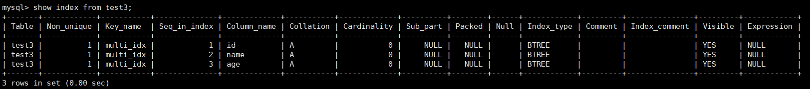

由结果可以看到，id、name和age字段上已经成功建立了一个名为multi_idx的组合索引。

组合索引可起几个索引的作用，但是使用时并不是随便查询哪个字段都可以使用索引，而是遵从 **最左前缀**。例如，索引可以搜索的字段组合为: (id, name, age). (id, name) 或者 id。而 (age) 或者 (name,age) 组合不能使用索引查询。

在test3表中，查询id和name字段，使用EXPLAIN语句查看索引的使用情况：

```shell
EXPLAIN SELECT id,name FROM test3 WHERE id=1 AND name='songhongkang' \G
```

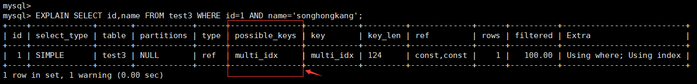

可以看到，查询id和name字段时，使用了名称为Multildx的索引，如果查询(name,age)组合或者单独查询name和age字段，会发现结果中possible_keys和key值为NULL，并没有使用在test3表中创建的索引进行查询。

#### 6. 创建全文索引
##### ✅ 什麼是 FULLTEXT 全文索引？

- `FULLTEXT` 是一種 **全文檢索技術**，適合用於對長篇文章、說明文字、內容描述等欄位進行搜尋。
- 適用欄位型別：`CHAR`、`VARCHAR`、`TEXT`
- 適用引擎：MySQL 5.6 起 `InnoDB` 開始支援，`MyISAM` 也支援。
- 只能建立在 **整個欄位** 上，**不支援前綴索引（如 column(10)）**
- 查詢方式使用 `MATCH(...columns...) AGAINST('關鍵字')`

---

##### ✅ 基本語法範例

####### 🔹 範例 1：在 `MyISAM` 上建立全文索引

```sql
CREATE TABLE papers (
  id INT(10) UNSIGNED NOT NULL AUTO_INCREMENT,
  title VARCHAR(200) DEFAULT NULL,
  content TEXT,
  PRIMARY KEY (id),
  FULLTEXT KEY ft_title_content (title, content)
) ENGINE=MyISAM DEFAULT CHARSET=utf8;
```

###### 🔹 範例 2：在 `InnoDB` 上建立全文索引（MySQL 5.6+）

```sql
CREATE TABLE articles (
  id INT UNSIGNED AUTO_INCREMENT PRIMARY KEY,
  title VARCHAR(200),
  body TEXT,
  FULLTEXT INDEX ft_title_body (title, body)
) ENGINE=InnoDB;
```

---

##### ✅ 使用方式：全文檢索語法

```sql
SELECT * 
FROM articles 
WHERE MATCH(title, body) AGAINST ('MySQL 索引');
```

###### 📌 說明：
- `MATCH(title, body)` 指要搜尋的欄位；
- `AGAINST('關鍵字')` 是搜尋的文字內容；
- `AGAINST` 可結合布林模式與自然語言模式（後面補充）。

---

##### ✅ 與 `LIKE` 查詢的比較

| 查詢方式 | 語法 | 特點 |
|----------|------|------|
| LIKE 查詢 | `WHERE content LIKE '%關鍵字%'` | 範圍模糊搜尋、但效率低（全表掃描） |
| FULLTEXT 查詢 | `WHERE MATCH(...) AGAINST('關鍵字')` | 使用全文索引搜尋、效率高 |

###### 🔹 範例比較：

```sql
-- LIKE 模糊查詢（效率較差）
SELECT * FROM papers WHERE content LIKE '%索引%';

-- FULLTEXT 全文索引查詢（效率較高）
SELECT * FROM papers WHERE MATCH(title, content) AGAINST('索引');
```

---

##### ✅ 建議使用時機

- **適合處理大量文本欄位的搜尋**，例如文章、評論、部落格、新聞等。
- 若資料量大，建議先插入資料，再建立 FULLTEXT 索引，可提高效率。

---

##### ✅ 查詢模式選擇（AGAINST）

MySQL 中的 `AGAINST` 支援兩種主要模式：

| 模式 | 語法範例 | 說明 |
|------|-----------|------|
| 自然語言模式（預設） | `AGAINST('mysql index')` | 基於關鍵字相關度自動排序 |
| 布林模式 | `AGAINST('+mysql -index' IN BOOLEAN MODE)` | 支援 AND(+)、OR(空格)、NOT(-) 等邏輯符號 |

---

##### ✅ 額外補充：檢查是否建立了全文索引

```sql
SHOW INDEX FROM articles;
```

---

##### ✅ 建議順序（建立大量資料時）

```sql
-- Step 1: 建立表但先不加 FULLTEXT 索引
CREATE TABLE articles (
  id INT UNSIGNED AUTO_INCREMENT PRIMARY KEY,
  title VARCHAR(200),
  body TEXT
) ENGINE=InnoDB;

-- Step 2: 批次插入大量資料

-- Step 3: 再加上全文索引
ALTER TABLE articles ADD FULLTEXT INDEX ft_title_body (title, body);
```

---

#### 7. 创建空间索引
##### ✅ 什麼是空間索引（SPATIAL INDEX）？

- 空間索引是一種針對 **幾何資料（空間資料）** 的特殊索引，用來加速對如位置、地理形狀等資訊的查詢。
- 通常使用在如地圖、座標、區域邊界等與 GIS（地理資訊系統）有關的資料上。
- MySQL 支援以下空間資料類型：
  - `GEOMETRY`
  - `POINT`
  - `LINESTRING`
  - `POLYGON`

---

##### ✅ 空間索引的使用限制

| 條件 | 說明 |
|------|------|
| 儲存引擎 | 只能用 `MyISAM`（MySQL 5.x）<br>MySQL 8.0 起，`InnoDB` 也支援 |
| 欄位 | 必須是 **空間資料類型**，如 `GEOMETRY` |
| 欄位值 | 必須為 **NOT NULL**，不能是 `NULL` |
| 不支援前綴索引 | 空間索引只能建在整個欄位上 |

---

##### ✅ 基本語法：建立空間索引

```sql
CREATE TABLE test5 (
  geo GEOMETRY NOT NULL,
  SPATIAL INDEX spa_idx_geo (geo)
) ENGINE=MyISAM;
```

---

##### ✅ 查詢語句：確認索引建立成功

```sql
SHOW INDEX FROM test5 \G
```

###### 輸出會包含：
- Key_name: `spa_idx_geo`
- Column_name: `geo`
- Index_type: `SPATIAL`

---

##### ✅ GEOMETRY 與空間資料舉例

可以使用內建的幾何函數（如 `ST_GeomFromText()`）來插入空間資料：

```sql
INSERT INTO test5 (geo)
VALUES (ST_GeomFromText('POINT(121.5 25.1)')); -- 台北附近一個經緯度點
```

---

##### ✅ 額外範例：使用 `POINT` 類型（更常用）

```sql
CREATE TABLE locations (
  id INT PRIMARY KEY AUTO_INCREMENT,
  name VARCHAR(100),
  location POINT NOT NULL,
  SPATIAL INDEX idx_location (location)
) ENGINE=MyISAM;
```

插入地理座標資料：

```sql
INSERT INTO locations (name, location)
VALUES ('Taipei 101', ST_GeomFromText('POINT(121.5645 25.0330)'));
```

---

##### ✅ 注意：查詢需結合空間函數

例如查詢範圍內的地點：

```sql
-- 找出範圍內的點 (此為虛構範圍範例)
SELECT * FROM locations
WHERE MBRContains(
  ST_GeomFromText('POLYGON((121.5 25.0, 121.6 25.0, 121.6 25.1, 121.5 25.1, 121.5 25.0))'),
  location
);
```

> `MBRContains()` 是基於最小外接矩形（Minimum Bounding Rectangle）的查詢方式，比精確幾何查詢效率更高。

---

##### 📌 小結

| 項目 | 說明 |
|------|------|
| 使用資料型別 | `GEOMETRY`、`POINT` 等空間資料型別 |
| 建立條件 | 欄位 `NOT NULL`，`ENGINE=MyISAM`（8.0可用 InnoDB） |
| 索引方式 | `SPATIAL INDEX` |
| 查詢方式 | `MBRContains()`、`MBRWithin()`、`ST_Contains()` 等 |

---

### 1.2.2. 在已经存在的表上创建索引
#### ✅ 一、使用 `ALTER TABLE` 建立索引

這種方式屬於**修改表結構**來新增索引，是最常見的做法之一。

##### 🔹 語法結構：

```sql
ALTER TABLE 表名
ADD [UNIQUE | FULLTEXT | SPATIAL] [INDEX | KEY] [索引名稱] (欄位名[length]...) [ASC | DESC];
```

##### 🔹 範例 1：建立普通索引（單欄位）

```sql
ALTER TABLE book5
ADD INDEX idx_cmt (COMMENT);
```

##### 🔹 範例 2：建立唯一索引

```sql
ALTER TABLE book5
ADD UNIQUE INDEX uk_idx_bname (book_name);
```

##### 🔹 範例 3：建立組合索引（多欄位）

```sql
ALTER TABLE book5
ADD INDEX mul_bid_bname_info (book_id, book_name, info);
```

---

#### ✅ 二、使用 `CREATE INDEX` 建立索引

這種方式比較語義直觀，專門用來建立索引。實際上 MySQL 底層會轉成 `ALTER TABLE`。

##### 🔹 語法結構：

```sql
CREATE [UNIQUE | FULLTEXT | SPATIAL] INDEX 索引名稱
ON 表名 (欄位1[length], 欄位2[length]...) [ASC | DESC];
```

##### 🔹 範例 1：建立普通索引

```sql
CREATE INDEX idx_cmt
ON book6 (COMMENT);
```

##### 🔹 範例 2：建立唯一索引

```sql
CREATE UNIQUE INDEX uk_idx_bname
ON book6 (book_name);
```

##### 🔹 範例 3：建立組合索引

```sql
CREATE INDEX mul_bid_bname_info
ON book6 (book_id, book_name, info);
```

---

#### ✅ 注意事項

| 條件 | 說明 |
|------|------|
| 欄位名稱 | 可以是一個或多個欄位，組合索引欄位順序會影響查詢效率 |
| 字串型欄位 | 可選擇加上 `[length]`，用來指定索引長度（僅限 CHAR/VARCHAR） |
| 降序索引 | `[ASC | DESC]` 可以指定，但在 MySQL 中實際影響很有限 |
| 表存在資料 | 可以不清除資料直接加索引，但大量資料時會影響效能，建議閒時執行 |
| FULLTEXT、SPATIAL | 限定欄位型別與儲存引擎（例如 SPATIAL 只能在空間類型欄位上建立） |

---

#### ✅ 如何查看目前表的索引？

```sql
SHOW INDEX FROM book5;
```

---

#### ✅ 小結

| 方法 | 使用語法 | 適用時機 |
|------|----------|-----------|
| `ALTER TABLE` | 修改表結構時直接加索引 | 比較常見的做法 |
| `CREATE INDEX` | 專門加索引的語法，語義清楚 | 單獨建立索引時使用 |

---

## 1.3 刪除索引
#### ✅ 一、使用 `ALTER TABLE` 刪除索引

這是最常見的方式，用於刪除指定索引（包括普通索引、唯一索引、組合索引、全文索引等）。

##### 🔹 基本語法：

```sql
ALTER TABLE 表名 DROP INDEX 索引名稱;
```

##### 🔹 範例：刪除唯一索引 `idx_bk_id`（book 表）

```sql
-- 查看目前索引
SHOW INDEX FROM book \G;

-- 刪除索引
ALTER TABLE book DROP INDEX idx_bk_id;
```

> ⚠️ 注意：若 `idx_bk_id` 是 `AUTO_INCREMENT` 欄位（例如主鍵或唯一鍵），則不能直接刪除索引，否則會報錯。

---

#### ✅ 二、使用 `DROP INDEX` 刪除索引

這是另一種刪除方式，語法稍微不同，但結果相同。

##### 🔹 基本語法：

```sql
DROP INDEX 索引名稱 ON 表名;
```

##### 🔹 範例：刪除組合索引 `idx_aut_info`（book 表）

```sql
DROP INDEX idx_aut_info ON book;
```

##### 🔹 查看索引是否成功刪除：

```sql
SHOW CREATE TABLE book \G;
```

---

#### ✅ 額外補充：AUTO_INCREMENT 欄位的限制

```sql
CREATE TABLE example (
  id INT AUTO_INCREMENT,
  name VARCHAR(50),
  UNIQUE INDEX idx_id (id)
);
```

即使 `id` 上設的是唯一索引，如果它是 `AUTO_INCREMENT` 的欄位，則不能使用 `DROP INDEX` 或 `ALTER TABLE ... DROP INDEX` 來刪除該索引，否則會出現錯誤訊息：

```
ERROR 1553 (HY000): Cannot drop index 'idx_id': needed in a foreign key constraint
```

##### 🔹 正確處理方式：
你需要先移除 `AUTO_INCREMENT` 屬性，再刪索引：

```sql
-- 1. 移除 AUTO_INCREMENT
ALTER TABLE example MODIFY id INT;

-- 2. 再刪除索引
ALTER TABLE example DROP INDEX idx_id;
```

---

#### ✅ 補充說明：欄位與索引之間的關係

- 當你刪除某個欄位時，若該欄位有包含在索引中：
  - 該欄位會從該索引中移除；
  - 若該欄位是**唯一組成欄位**，則整個索引會被刪除；
  - 若該欄位是**組合索引的一部分**，則該欄位會從索引中移除，剩餘欄位會繼續構成索引。

##### 🔹 範例：

```sql
CREATE TABLE demo (
  id INT,
  name VARCHAR(50),
  email VARCHAR(50),
  INDEX idx_name_email (name, email)
);
```

若刪除欄位 `name`：

```sql
ALTER TABLE demo DROP COLUMN name;
```

那麼原本的組合索引 `idx_name_email` 會被轉為：

```sql
INDEX idx_name_email (email)
```

---

#### ✅ 小結

| 方法 | 語法 | 備註 |
|------|------|------|
| `ALTER TABLE DROP INDEX` | `ALTER TABLE table_name DROP INDEX index_name;` | 適用於大多數情境 |
| `DROP INDEX ON` | `DROP INDEX index_name ON table_name;` | 語法更語義化 |
| `SHOW INDEX` | `SHOW INDEX FROM table_name \G` | 查看現有索引 |
| `SHOW CREATE TABLE` | `SHOW CREATE TABLE table_name \G` | 查看索引結構 |
| ⚠️ 注意 | AUTO_INCREMENT 欄位的索引不能直接刪除 | 需先移除屬性 |

---

# 2. MySQL8.0索引新特性
## 2.1 支持降序索引
降序索引以降序存储键值。虽然在语法上，从MySQL 4版本开始就已经支持降序索引的语法了，但实际上该DESC定义是被忽略的，直到MySQL 8.x版本才开始真正支持降序索引(仅限于InnoDB存储引擎)。

MySQL在 8.0版本之前创建的仍然是升序索引，如果在使用时进行反向扫描（降序），会大大降低了数据库的效率 。在某些场景下，降序索引意义重大。例如，如果一个查询，需要对多个列进行排序，且顺序要求不一致，那么使用降序索引将会避免数据库使用额外的文件排序操作，从而提高性能。

举例：分别在MySQL 5.7版本和MySQL 8.0版本中创建数据表ts1，结果如下：

```sql
CREATE TABLE ts1(a int,b int,index idx_a_b(a,b desc));
```

- 在MySQL 5.7版本中查看数据表ts1的结构，结果如下：
    - 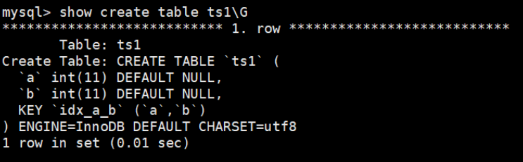
    - 从结果可以看出，索引仍然是默认的升序。

- 在MySQL 8.0版本中查看数据表ts1的结构，结果如下：
    - 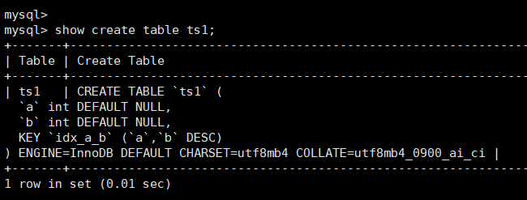
    - 从结果可以看出，索引已经是降序了。

下面继续测试降序索引在执行计划中的表现。分别在MySQL 5.7版本和MySQL 8.0版本的数据表ts1中插入800条随机数据，执行语句如下：

```sql
DELIMITER //
CREATE PROCEDURE ts_insert()
BEGIN
	DECLARE i INT DEFAULT 1;
	WHILE i < 800
	DO
		insert into ts1 select rand()*80000,rand()*80000;
		SET i = i + 1;
	END WHILE;
	commit;
END //
DELIMITER ;
 
#调用
CALL ts_insert();
```

在MySQL 5.7版本中查看数据表ts1的执行计划，结果如下：

```sql
EXPLAIN SELECT * FROM ts1 ORDER BY a,b DESC LIMIT 5;
```

从结果可以看出，执行计划中扫描数为799，而且使用了Using filesort。

> **提示:** Using filesort是MySQL中一种速度比较慢的外部排序，能避免是最好的。多数情况下，管理员可以通过优化索引来尽量避免出现Using filesort，从而提高数据库执行速度。

在MySQL 8.0版本中查看数据表ts1的执行计划。从结果可以看出，执行计划中扫描数为5，而且没有使用 Using filesort。

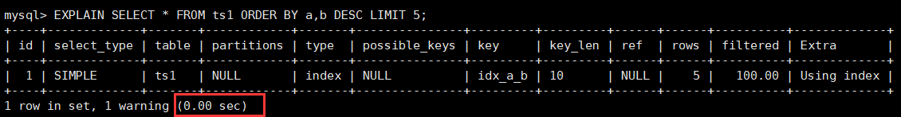

将排序条件修改为 `order by a desc, b desc` 后，下面来对比不同版本中执行计划的效果。 在MySQL 5.7版本中查看数据表ts1的执行计划，结果如下：

```sql
EXPLAIN SELECT * FROM ts1 ORDER BY a DESC,b DESC LIMIT 5;
```

在MySQL 8.0版本中查看数据表ts1的执行计划。从结果可以看出，修改后MySQL 5.7的执行计划要明显好于MySQL 8.0。

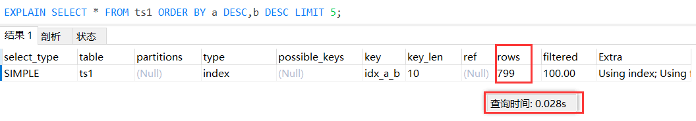

> **注意**
> - 降序索引只对查询中特定的排序顺序有效，如果使用不当，反而查询效率更低。例如，上述查询排序条件改为order by a desc, b desc，MySQL 5.7的执行计划要明显好于MySQL 8.0。

## 2.2 隱藏索引
在MySQL 5.7版本及之前，只能通过显式的方式删除索引。此时，如果发现删除索引后出现错误，又只能通过显式创建索引的方式将删除的索引创建回来。如果数据表中的数据量非常大，或者数据表本身比较大，这种操作就会消耗系统过多的资源，操作成本非常高。

从MySQL 8.x开始支持隐藏索引（invisible indexes），只需要将待删除的索引设置为隐藏索引，使查询优化器不再使用这个索引（即使使用force index（强制使用索引），优化器也不会使用该索引），确认将索引设置为隐藏索引后系统不受任何响应，就可以彻底删除索引。这种通过先将索引设置为隐藏索引，再删除索引的方式就是软删除。

同时，如果你想验证某个索引删除之后的查询性能影响，就可以暂时先隐藏该索引。

> **注意:**
> - 主键不能被设置为隐藏索引。当表中没有显式主键时，表中第一个唯一非空索引会成为隐式主键，也不能设置为隐藏索引。

索引默认是可见的，在使用 **CREATE TABLE**， **CREATE INDEX** 或者 **ALTERT ABLE** 等语句时可以通过 VISIBLE 或者 INVISIBLE 关键词设置索引的可见性。

### 1. 创建表时直接创建

在MySQL中创建隐藏索引通过SQL语句INVISIBLE来实现，其语法形式如下：

```sql
CREATE TABLE tablename( 
    propname1 type1[CONSTRAINT1], 
    propname2 type2[CONSTRAINT2], 
    ……
    propnamen typen, 
    INDEX [indexname](propname1 [(length)]) INVISIBLE 
);
```

上述语句比普通索引多了一个关键字INVISIBLE，用来标记索引为不可见索引。

### 2. 在已经存在的表上创建

可以为已经存在的表设置隐藏索引，其语法形式如下：

```sql
CREATE INDEX indexname 
ON tablename(propname[(length)]) INVISIBLE;
```

### 3. 通过ALTER TABLE语句创建
```sql
ALTER TABLE tablename 
ADD INDEX indexname (propname [(length)]) INVISIBLE;
```

### 4. 修改索引可见状态

已存在的索引可通过如下语句切换可见状态：

```sql
ALTER TABLE tablename ALTER INDEX index_name INVISIBLE; #切换成隐藏索引 
ALTER TABLE tablename ALTER INDEX index_name VISIBLE; #切换成非隐藏索引
```

如果将index_cname索引切换成可见状态，通过explain查看执行计划，发现优化器选择了index_cname索引。

> **注意:**
> - 当索引被隐藏时，它的内容仍然是和正常索引一样实时更新的。如果一个索引需要长期被隐藏，那么可以将其删除，因为索引的存在会影响插入、更新和删除的性能。

通过设置隐藏索引的可见性可以查看索引对调优的帮助。

### 5. 使隐藏索引对查询优化器可见（了解）
在MySQL 8.x版本中，为索引提供了一种新的测试方式，可以通过查询优化器的一个开关（use_invisible_indexes）来打开某个设置，使隐藏索引对查询优化器可见。如果 use_invisible_indexes 设置为off(默认)，优化器会忽略隐藏索引。如果设置为on，即使 隐藏索引不可见，优化器在生成执行计划时仍会考虑使用隐藏索引。

##### （1）在MySQL命令行执行如下命令查看查询优化器的开关设置。
```shell
mysql> select @@optimizer_switch \G
```

在输出的结果信息中找到如下属性配置。

```shell
use_invisible_indexes=off
```

此属性配置值为off，说明隐藏索引默认对查询优化器不可见。

##### （2）使隐藏索引对查询优化器可见，需要在MySQL命令行执行如下命令：
```shell
mysql> set session optimizer_switch="use_invisible_indexes=on";
Query OK, 0 rows affected (0.00 sec)
```

SQL语句执行成功，再次查看查询优化器的开关设置。

```shell
mysql>  select @@optimizer_switch \G
*************************** 1. row ***************************
@@optimizer_switch:
index_merge=on,index_merge_union=on,index_merge_sort_union=on,index_merge_
intersection=on,engine_condition_pushdown=on,index_condition_pushdown=on,mrr=on,mrr_co
st_based=on,block_nested_loop=on,batched_key_access=off,materialization=on,semijoin=on
,loosescan=on,firstmatch=on,duplicateweedout=on,subquery_materialization_cost_based=on
,use_index_extensions=on,condition_fanout_filter=on,derived_merge=on,use_invisible_indexes=on,skip_scan=on,hash_join=on
1 row in set (0.00 sec)
```

此时，在输出结果中可以看到如下属性配置。

```shell
use_invisible_indexes=on
```

> use_invisible_indexes属性的值为on，说明此时隐藏索引对查询优化器可见。

##### （3）使用EXPLAIN查看以字段invisible_column作为查询条件时的索引使用情况
```sql
explain select * from classes where cname = '高一2班';
```

> 查询优化器会使用隐藏索引来查询数据

##### （4）如果需要使隐藏索引对查询优化器不可见，则只需要执行如下命令即可。
```shell
mysql> set session optimizer_switch="use_invisible_indexes=off";
Query OK, 0 rows affected (0.00 sec)
```

再次查看查询优化器的开关设置。

```shell
mysql> select @@optimizer_switch \G
```

> 此时，use_invisible_indexes属性的值已经被设置为“off”。


# 3. 索引的设计原则
> 为了使索引的使用效率更高，在创建索引时，必须考虑在哪些字段上创建索引和创建什么类型的索引。索引设计不合理或者缺少索引都会对数据库和应用程序的性能造成障碍。高效的索引对于获得良好的性能非常重要。设计索引时，应该考虑相应准则。

## 3.1 数据准备

### 第1步：创建数据库、创建表
```sql
CREATE DATABASE atguigudb1;
USE atguigudb1;

#1.创建学生表和课程表
CREATE TABLE `student_info` (
`id` INT(11)  AUTO_INCREMENT,
`student_id` INT NOT NULL ,
`name` VARCHAR(20) DEFAULT NULL,
`course_id` INT NOT NULL ,
`class_id` INT(11) DEFAULT NULL,
`create_time` DATETIME DEFAULT CURRENT_TIMESTAMP ON UPDATE CURRENT_TIMESTAMP,
PRIMARY KEY (`id`)
) ENGINE=INNODB AUTO_INCREMENT=1 DEFAULT CHARSET=utf8;
 
CREATE TABLE `course` (
`id` INT(11) NOT NULL AUTO_INCREMENT,
`course_id` INT NOT NULL ,
`course_name` VARCHAR(40) DEFAULT NULL,
PRIMARY KEY (`id`)
) ENGINE=INNODB AUTO_INCREMENT=1 DEFAULT CHARSET=utf8;
```

### 第2步：创建模拟数据必需的存储函数

函数1：创建随机产生字符串函数

```sql
DROP FUNCTION IF EXISTS atguigudb1.rand_string;

DELIMITER $$
$$
CREATE FUNCTION atguigudb1.rand_string(n INT) 
RETURNS VARCHAR(255)
BEGIN 
	DECLARE chars_str VARCHAR(100) DEFAULT 'abcdefghijklmnopqrstuvwxyzABCDEFJHIJKLMNOPQRSTUVWXYZ';
	DECLARE return_str VARCHAR(255) DEFAULT '';
	DECLARE i INT DEFAULT 0;
	WHILE i < n DO
		SET return_str = CONCAT(return_str,SUBSTRING(chars_str, FLOOR(1 + RAND() * 52), 1));
		SET i = i + 1;
	END WHILE;
	RETURN return_str; 
END $$
DELIMITER ;
```

函数2：创建随机数函数

```sql
DROP FUNCTION IF EXISTS atguigudb1.rand_num;

DELIMITER $$
$$
CREATE FUNCTION atguigudb1.rand_num(from_num INT ,to_num INT) 
RETURNS INT(11)
BEGIN 
	DECLARE i INT DEFAULT 0; 
	SET i = FLOOR(from_num + RAND() * (to_num - from_num + 1));
	RETURN i; 
END;
$$
DELIMITER ;
```

##### 默认情况下，mysql不开启创建函数设置。

查看mysql是否允许创建函数：

```sql
show variables like 'log_bin_trust_function_creators';
```

命令开启：允许创建函数设置：

```sql
set global log_bin_trust_function_creators=1;   # 不加global只是当前窗口有效。
```

mysqld重启，上述参数又会消失。永久方法：

windows下：my.ini[mysqld]加上：

```shell
log_bin_trust_function_creators=1 
```

linux下：/etc/my.cnf下my.cnf[mysqld]加上：

```shell
log_bin_trust_function_creators=1
```

### 第3步：创建插入模拟数据的存储过程
存储过程1：创建插入课程表存储过程

```sql
DROP PROCEDURE IF EXISTS atguigudb1.insert_course;

DELIMITER $$
$$
CREATE PROCEDURE atguigudb1.insert_course(max_num INT)
BEGIN 
	DECLARE i INT DEFAULT 0;
	SET autocommit = 0; -- 設定手動提交
 
	REPEAT
		SET i = i + 1;
		INSERT INTO course (course_id, course_name) 
		VALUES (rand_num(10000, 10100), rand_string(6));
	UNTIL i = max_num 
	END REPEAT;

	COMMIT;
END
$$
DELIMITER ;
```

存储过程2：创建插入学生信息表存储过程

```sql
DROP PROCEDURE IF EXISTS atguigudb1.insert_stu;

DELIMITER $$
$$
CREATE PROCEDURE atguigudb1.insert_stu(max_num INT)
BEGIN
	DECLARE i INT DEFAULT 0; 
	SET autocommit = 0;  -- 設定手動提交

	REPEAT 
		SET i = i + 1;  
		INSERT INTO student_info (course_id, class_id, student_id, NAME) 
		VALUES (
			rand_num(10000,10100), 
			rand_num(10000,10200), 
			rand_num(1,200000), 
			rand_string(6)
		);
	UNTIL i = max_num
	END REPEAT;

	COMMIT;
END
$$
DELIMITER ;
```

### 第4步：调用存储过程
```sql
CALL insert_course(100);
CALL insert_stu(1000000);
```

## 3.2 哪些情况适合创建索引

### 1. 字段的数值有唯一性的限制
索引本身可以起到约束的作用，比如唯一索引、主键索引都可以起到唯一性约束的，因此在我们的数据表中，如果某个字段是唯一的，就可以直接创建唯一性索引，或者主键索引。这样可以更快速地通过该索引来确定某条记录。

例如，学生表中 学号 是具有唯一性的字段，为该字段建立唯一性索引可以很快确定某个学生的信息，如果使用 姓名 的话，可能存在同名现象，从而降低查询速度。

业务上具有唯一特性的字段，即使是组合字段，也必须建成唯一索引。（来源：Alibaba）

> 说明：不要以为唯一索引影响了insert速度，这个速度损耗可以忽略，但提高查找速度是明显的。

### 2. 频繁作为 WHERE 查询条件的字段
某个字段在 SELECT 语句的 **WHERE** 条件中经常被使用到，那么就需要给这个字段创建索引了。尤其是在数据量大的情况下，创建普通索引就可以大幅提升数据查询的效率。

比如 **student_info** 数据表（含100万条数据），假设我们想要查询 `student_id=123110` 的用户信息。

如果我们没有对 student_id 字段创建索引，进行如下查询:

```sql
SELECT 
	course_id ,
	class_id ,
	name ,
	create_time ,
	student_id 
FROM student_info
WHERE student_id = 123110;
```

运行结果

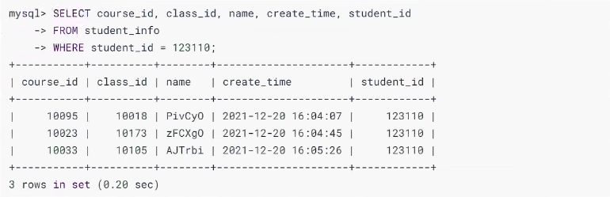

运行时间为0.20s，当我们对student_id字段创建索引之后，运行时间为0.01s，原来查询时间的1/20，效率提升还是明显的。

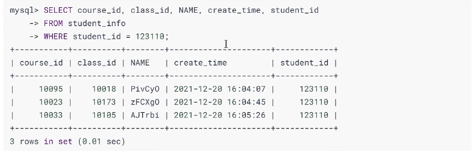

### 3. 经常 GROUP BY 和 ORDER BY 的列
索引就是让数据按照某种顺序进行存储或检索，因此当我们使用 **GROUP BY** 对数据进行分组查询，或者使用 **ORDER BY** 对数据进行排序的时候，就需要对分组或者排序的字段进行索引。如果待排序的列有多个，那么可以在这些列上建立组合索引。

比如，按照 student_id 对学生选修的课程进行分组，显示不同的student_id和课程数量，显示100个即可。

如果我们不对student_id创建索引，执行下面的SQL语句:

```sql
SELECT 
	student_id ,
	COUNT(*) AS num 
FROM student_info
GROUP BY student_id 
LIMIT 108;
```

运行结果 (100条记录，运行时间0.56s) :

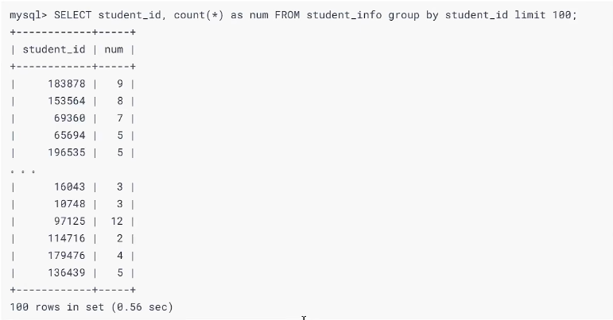

如果我们对student_id创建索引，再执行SQL语句。结果如下:

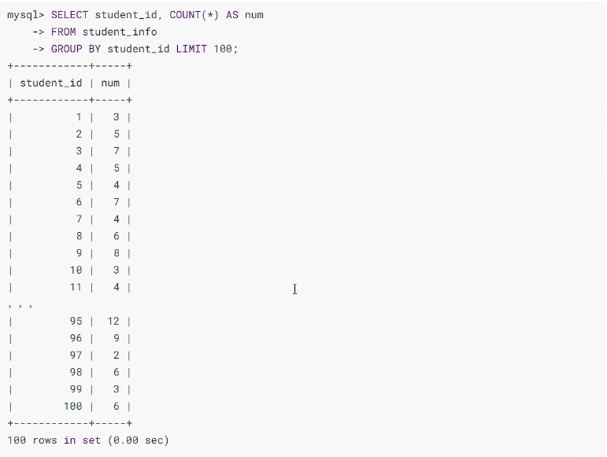

运行结果 (100条记录，运行时间0.00s)，效率提升很明显。而且，得到的结果中student_id字段的数值也是 按照顺序展示 的。

同样，如果是ORDER BY，也需要对字段创建索引。

如果同时有 GROUP BY 和 ORDER BY的情况：比如我们按照 student_id 进行分组，同时按照创建时间降序的方式进行排序，这时我们就需要同时进行 GROUP BY 和 ORDER BY，那么是不是需要单独创建 student_id 的索引和 create_time 的索引呢?

当我们对student_id和create_time 分别创建索引 ，执行下面的SQL查询:

```sql
SELECT student_id, count( * ) as num 
FROM student_info 
group by student_id
order by create_time desc
limit 100;
```

运行结果


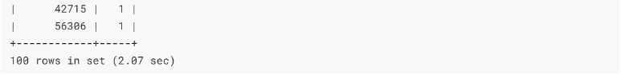

> 说明:多个单列索引在多条件查询时 只会生效一个索引 (MySQL会选择其中一个限制最严格的作为索引)，所以在多条件联合查询的时候 最好创建联合索引。接着，我们创建联合索引(student_id, create_time)，查询时间为0.22s，效率提升了很多。

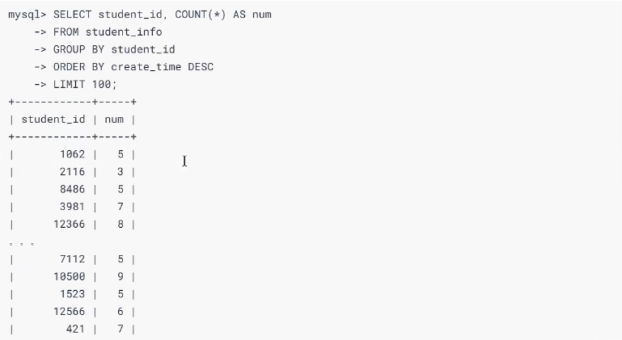


如果我们创建联合索引的顺序为(create_time, student_id)呢? 运行时间为 2.164s，因为在进行SELECT查询的时候，先进行 GROUP BY，再对数据进行 ORDER BY 的操作，所以按照(student_id, create_time)这个联合索引的顺序效率是最高的 b。

### 4. UPDATE、DELETE 的 WHERE 条件列
当我们对某条数据进行 UPDATE 或者 DELETE 操作的时候，是否也需要对 WHERE 的条件列创建索引呢?

我们先看一下对数据进行 UPDATE 的情况：我们想要把 name 为 462eed7ac6e791292a79 对应的 student_id 修改为 10002，当我们没有对 name 进行索引的时候，执行SQL语句:

```sql
UPDATE student_info SET student_id = 18802WHERE name = '462eed7ac6e791292a79'
```

运行结果为 Affected rows: 1，运行时间为 0.578s 。

你能看到效率不高，但如果我们对name 字段创建了索引，然后执行类似的SQL语句:

```sql
UPDATE student_info SET student_id = 10001
WHERE name = '462eed7ac6e791292a79'
```

运行结果为Affected rows:1，运行时间仅为 0.001s 。效率有了大幅的提升。

如果我们对某条数据进行DELETE，效率如何呢?

比如我们想删除 name 为 46teed7ac6e791292a79 的数据。当我们没有对name字段进行索引的时候，执行SQL语句:

```sql
DELETE FROM student_info WHERE name = '462eed7ac6e791292a79·
```

运行结果为Affected rows: 1，运行时间为 0.627s，效率不高。

如果我们对name创建了索引，再来执行这条sQL语句，运行时间为0.03s，效率有了大幅的提升。

> 对数据按照某个条件进行查询后再进行 UPDATE 或 DELETE 的操作，如果对 WHERE 字段创建了索引，就能大幅提升效率。原理是因为我们需要先根据 WHERE 条件列检索出来这条记录，然后再对它进行更新或删除。如果进行更新的时候，更新的字段是非索引字段，提升的效率会更明显，这是因为非索引字段更新不需要对索引进行维护。

### 5. DISTINCT 字段需要创建索引
有时候我们需要对某个字段进行去重，使用 DISTINCT，那么对这个字段创建索引，也会提升查询效率。

比如，我们想要查询课程表中不同的 student_id 都有哪些，如果我们没有对 student_id 创建索引，执行SQL 语句：

```sql
SELECT DISTINCT(student_id) FROM `student_info`;
```

运行结果（600637 条记录，运行时间 0.683s ）：

如果我们对 student_id 创建索引，再执行 SQL 语句：

```sql
SELECT DISTINCT(student_id) FROM `student_info`;
```

运行结果（600637 条记录，运行时间 0.010s ）

你能看到 SQL 查询效率有了提升，同时显示出来的 student_id 还是按照 递增的顺序 进行展示的。这是因为索引会对数据按照某种顺序进行排序，所以在去重的时候也会快很多。

### 6. 多表 JOIN 连接操作时，创建索引注意事项
首先，连接表的数量尽量不要超过 3 张，因为每增加一张表就相当于增加了一次嵌套的循环，数量级增长会非常快，严重影响查询的效率。

其次，对 WHERE 条件创建索引，因为 WHERE 才是对数据条件的过滤。如果在数据量非常大的情况下，没有 WHERE 条件过滤是非常可怕的。

最后，对用于连接的字段创建索引，并且该字段在多张表中的类型必须一致。比如 course_id 在 student_info 表和 course 表中都为 int(11) 类型，而不能一个为 int 另一个为 varchar 类型。

举个例子，如果我们只对 student_id 创建索引，执行 SQL 语句：

```sql
SELECT s.course_id, name, student_info.student_id, course_name
FROM student_info s JOIN course
ON student_info.course_id = course.course_id
WHERE name = '462eed7ac6e791292a79';
```

运行结果（1 条数据，运行时间 0.189s ）：

这里我们对 name 创建索引，再执行上面的 SQL 语句，运行时间为 0.002s 。

### 7. 使用列的类型小的创建索引
我们这里所说的类型大小指的就是该类型表示的 **数据范围的大小** 。

我们在定义表结构的时候要显式的指定列的类型，以整数类型为例，有 TINYINT、MEDIUNINT、INT、BIGINT等，它们占用的存储空间依次递增，能表示的整数范围当然也是依次递增。如果我们想要对某个整数列建立索引的话，在表示的整数范围允许的情况下，尽量让索引列使用较小的类型，比如我们能使用INT就不要使用BIGINT，能使用MEDIUMINT就不要使用INT。这是因为:

- 数据类型越小，在查询时进行的比较操作越快

- 数据类型越小，索引占用的存储空间就越少，在一个数据页内就可以放下更多的记录，从而减少磁盘I/O带来的性能损耗，也就意味着可以把更多的数据页缓存在内存中，从而加快读写效率。

> 这个建议对于表的主键来说更加适用，因为不仅是聚簇索引中会存储主键值，其他所有的二级索引的节点处都会存储一份记录的主键值，如果主键使用更小的数据类型，也就意味着节省更多的存储空间和更高效的I/O。

### 8. 使用字符串前缀创建索引
- 假设我们的字符串很长，那存储一个字符串就需要占用很大的存储空间。在我们需要为这个字符串列建立索引时，那就意味着在对应的B+树中有这么两个问题:
    1. B+树索引中的记录需要把该列的完整字符串存储起来，更费时。而且字符串越长，在索引中占用的存储空间越大
    2. 如果B+树索引中索引列存储的字符串很长，那在做字符串比较时会占用更多的时间。

我们可以通过截取字段的前面一部分内容建立索引，这个就叫 **前缀索引**。这样在查找记录时虽然不能精确的定位到记录的位置，但是能定位到相应前缀所在的位置，然后根据前缀相同的记录的主键值回表查询完整的字符串值。既 **节约空间**，又 **减少了字符串的比较时间，还大体能解决排序的问题**。

例如，TEXT和BLOG类型的字段，进行全文检索会很浪费时间，如果只检索字段前面的若干字符，这样可以提高检索速度。

创建一张商户表，因为地址字段比较长，在地址字段上建立前缀索引

```sql
create table shop(address varchar(120) not null);
alter table shop add index(address(12));
```

问题是，截取多少呢？截取得多了，达不到节省索引存储空间的目的；截取得少了，重复内容太多，字段的散列度(选择性)会降低。怎么计算不同的长度的选择性呢？

先看一下字段在全部数据中的选择度：

```sql
select count(distinct address) / count(*) from shop;
```

#### 選擇度 (Selectivity) 與前綴索引的評估

通过不同长度去计算，与全表的选择性对比：

公式：

```sql
count(distinct left(列名, 索引长度))/count(*)
```

> ✅ 結果越接近 `1`，代表該欄位有很多不同的值（高選擇度），適合建立索引。
> ❌ 若結果接近 `0`，代表重複值多，建立索引的效益低。

###### 範例

當列是 **長字串欄位（如 address）** 時，直接對整欄建立索引會佔用大量空間，因此會考慮「**前綴索引（prefix index）**」。

用下面的語法可以比較不同長度的前綴選擇度：

```sql
SELECT
  COUNT(DISTINCT LEFT(address, 10)) / COUNT(*) AS sub10,
  COUNT(DISTINCT LEFT(address, 15)) / COUNT(*) AS sub15,
  COUNT(DISTINCT LEFT(address, 20)) / COUNT(*) AS sub20,
  COUNT(DISTINCT LEFT(address, 25)) / COUNT(*) AS sub25
FROM shop;
```

> 📌 用這種方式可以找到一個合適的前綴長度，例如前綴長度 15 已經有足夠的區分度，通常就可以用來建立前綴索引。

---

###### 範例結果說明

假設執行後結果如下：

| sub10 | sub15 | sub20 | sub25 |
|-------|-------|-------|-------|
| 0.20  | 0.55  | 0.80  | 0.85  |

表示：
- 截取前 10 個字元選擇度只有 0.20，區分性太差
- 截取前 20 個字元時就有 0.80 的選擇度，已經很不錯
- 可考慮建立 `prefix(20)` 的索引

---

#### 引申另一个问题：索引列前缀对排序的影响
##### 🔍 問題核心：「索引列前綴對排序的影響」

當我們使用**前綴索引**（如 `address(12)`）時，MySQL 只將 `address` 欄位的**前 12 個字元**存進二級索引（B+Tree），後面的部分就不在索引裡了。

---

##### 📌 關鍵影響點：排序 (`ORDER BY`) 的支援情況

當你執行：

```sql
SELECT * FROM shop 
ORDER BY address 
LIMIT 12;
```

你會期待 MySQL 能**用索引直接排序**（避免 filesort），但如果你只建立了 `address(12)` 的前綴索引，這會發生什麼？

---

##### ❗ 問題說明

前綴索引 `address(12)` 能確保「前 12 字元」的順序，但不能保證整個 `address` 欄位的**完整排序順序**。

###### 舉個例子：

假設資料如下：

| id | address             |
|----|---------------------|
| 1  | 台北市信義路五段123號 |
| 2  | 台北市信義路五段125號 |
| 3  | 台北市信義路五段124號 |

這三筆的前 12 字元都一樣是 `台北市信義路五段`。

- `address(12)` 索引裡它們看起來是 **一樣的**
- 但實際上「完整地址」不一樣，排序順序應該是：1 → 3 → 2

所以：

- ✅ 若使用**完整索引** `address`，MySQL 能用索引排序（避免 filesort）
- ❌ 若使用 `address(12)`，MySQL **無法正確排序完整地址** → 會改用「**filesort**」

---

##### 📦 二級索引 vs filesort

| 方法          | 是否準確排序 | 是否需要額外排序（filesort） |
|---------------|---------------|-------------------------------|
| 完整索引      | ✅ 是          | ❌ 否                         |
| 前綴索引      | ❌ 否（僅部分）| ✅ 是（需補排序）              |

---

##### 🔁 filesort 是什麼？

filesort 是 MySQL 自己額外執行的排序方式：
- 會從磁碟讀取完整資料，再做排序
- 比索引排序慢很多，尤其資料量大時

---

##### ✅ 正確做法建議

###### 如果你：
- 想提升查詢速度又**需要排序**
- 且 address 欄位排序很重要

建議：**改用完整索引** ➜ `address`

```sql
CREATE INDEX idx_address ON shop(address);
```

否則 MySQL 執行計畫中 `EXPLAIN` 會顯示 `Using filesort`。

---

##### 👨‍💻 實作範例

```sql
-- 建立測試表
CREATE TABLE shop (
  id INT PRIMARY KEY AUTO_INCREMENT,
  address VARCHAR(100)
);

-- 插入測試資料
INSERT INTO shop (address) VALUES
('台北市信義路五段123號'),
('台北市信義路五段124號'),
('台北市信義路五段125號'),
('新北市板橋區文化路一段10號'),
('新北市板橋區文化路一段15號');

-- 建立前綴索引
CREATE INDEX idx_addr_prefix ON shop(address(12));

-- 查看執行計畫（你會看到 Using filesort）
EXPLAIN SELECT * FROM shop ORDER BY address LIMIT 3;
```

---

#### 拓展：Alibaba《Java开发手册》

【强制】在 varchar 字段上建立索引时，必须指定索引长度，没必要对全字段建立索引，根据实际文本区分度决定索引长度。

说明：索引的长度与区分度是一对矛盾体，一般对字符串类型数据，长度为 20 的索引，区分度会高达 90% 以上，可以使用 `count(distinct left(列名, 索引长度))/count(*)` 的区分度来确定。

### 9. 区分度高(散列性高)的列适合作为索引
列的基数指的是某一列中不重复数据的个数，比方说某个列包含值 `2,5,8,2,5,8,2,5,8`，虽然有9条记录，但该列的基数却是3。也就是说，在记录行数一定的情况下，列的基数越大，该列中的值越分散；列的基数越小，该列中的值越集中。这个列的基数指标非常重要，直接影响我们是否能有效的利用索引。最好为列的基数大的列建立索引，为基数太小的列建立索引效果可能不好。

可以使用公式 `select count(distinct a)/count(*) from t1` 计算区分度，越接近1越好，一般超过33%就算是比较高效的索引了。

拓展：联合索引把区分度高（散列性高）的列放在前面。

### 10. 使用最频繁的列放到联合索引的左侧
这样也可以较少的建立一些索引。同时，由于"最左前缀原则"，可以增加联合索引的使用率。

### 11. 在多个字段都要创建索引的情况下，联合索引优于单值索引
#### ✅ 原因一：聯合索引能覆蓋多個欄位，查詢更高效

當你建立一個**聯合索引**（例如 `(col1, col2, col3)`），MySQL 在查詢時可以一次使用這三個欄位進行高效匹配、排序、過濾，減少掃描次數。

但若你只建立三個單欄位索引（例如 `col1`、`col2`、`col3`），MySQL 通常 **只能選擇其中一個索引來使用**，其他欄位就變成額外過濾條件，效率降低。

---

#### ✅ 原因二：避免 index merge（索引合併）效率較低

當你對多欄位設了單欄位索引，MySQL 可能會使用「index merge」策略將多個索引結果合併，但這個操作：

- 效率比聯合索引差
- 無法覆蓋索引（導致回表）
- 不支援排序、覆蓋查詢等優化

---

##### 📌 範例比較

假設你有一個 `user` 表：

```sql
CREATE TABLE user (
  id INT PRIMARY KEY,
  name VARCHAR(50),
  age INT,
  gender CHAR(1)
);
```

##### ✅ 建立聯合索引方式

```sql
CREATE INDEX idx_user_name_age ON user(name, age);
```

##### ❌ 建立多個單欄位索引方式

```sql
CREATE INDEX idx_name ON user(name);
CREATE INDEX idx_age ON user(age);
```

---

##### 查詢範例一（可使用聯合索引）：

```sql
SELECT * FROM user WHERE name = '小明' AND age = 20;
```

- 使用聯合索引 `(name, age)`：**只掃一次索引即可獲取資料**
- 使用單欄位索引：MySQL 會使用其中一個索引（通常是選擇性更高的欄位），另一個欄位只能做**過濾（filter）**，或進行 **index merge** 合併後再掃描資料

---

##### 查詢範例二（排序、LIMIT 更有效）：

```sql
SELECT * FROM user WHERE name = '小明' ORDER BY age LIMIT 10;
```

- 聯合索引 `(name, age)` 不但可以過濾 `name`，還可以順序掃描 `age` 來排序，**不用 filesort**
- 單欄位索引 `name` 無法幫助排序 `age` → 會發生 `Using filesort`

---

##### 🔍 EXPLAIN 比較（觀察效率）

```sql
EXPLAIN SELECT * FROM user WHERE name = '小明' AND age = 20;
```

- 使用聯合索引時：`key = idx_user_name_age`，`rows = 很少`
- 使用單欄位索引時：`key = idx_name` 或 `index_merge`，`rows = 多很多`

---

##### ✅ 小結：使用建議

| 條件                                   | 建議做法                      |
|----------------------------------------|-------------------------------|
| 多欄位常一起查詢、過濾、排序、分組     | ✅ 建立聯合索引                |
| 單一欄位經常查詢                        | ✅ 可考慮建立單欄位索引        |
| 只查詢聯合索引的前綴欄位                | ✅ 聯合索引仍有效（最佳左前綴）|
| 查詢條件無固定順序或很分散              | ⚠️ 需視情況判斷，或重構查詢    |

---

## 3.3 限制索引的数目
在实际工作中，我们也需要注意平衡，索引的数目不是越多越好。我们需要限制每张表上的索引数量，建议单张表索引数量 **不超过6个**。原因：

- 每个索引都需要占用磁盘空间，索引越多，需要的磁盘空间就越大。

- 索引会影响 INSERT、DELETE、UPDATE等语句的性能，因为表中的数据更改的同时，索引也会进行调整和更新，会造成负担。

- 优化器在选择如何优化查询时，会根据统一信息，对每一个可以用到的索引来进行评估，以生成出一个最好的执行计划，如果同时有很多个索引都可以用于查询，会增加MySQL优化器生成执行计划时间，降低查询性能。

## 3.4 哪些情况不适合创建索引

### 1. 在where中使用不到的字段，不要设置索引

WHERE条件(包括GROUP BY、ORDER BY)）里用不到的字段不需要创建索引，索引的价值是快速定位，如果起不到定位的字段通常是不需要创建索引的。举个例子:

```sql
SELECT course_id, student_id, create_time
FROM student_info
WHERE student_id = 41251 ;
```

因为我们是按照 student_id 来进行检索的，所以不需要对其他字段创建索引，即使这些字段出现在SELECT字段中。

### 2. 数据量小的表最好不要使用索引
如果表记录太少，比如少于1000个，那么是不需要创建索引的。表记录太少，是否创建索引 对查询效率的影响并不大 。甚至说，查询花费的时间可能比遍历索引的时间还要短，索引可能不会产生优化效果。

举例：创建表1：

```sql
CREATE TABLE t_without_index(
	a INT PRIMARY KEY AUTO_INCREMENT,
	b INT
);
```

提供存储过程1：

```sql
#创建存储过程
DELIMITER //
CREATE PROCEDURE t_wout_insert()
BEGIN
	DECLARE i INT DEFAULT 1;
	WHILE i <= 900
	DO
		INSERT INTO t_without_index(b) SELECT RAND()*10000;
		SET i = i + 1;
	END WHILE;
	COMMIT;
END //
DELIMITER ;
#调用
CALL t_wout_insert();
```

创建表2：

```sql
CREATE TABLE t_with_index(
	a INT PRIMARY KEY AUTO_INCREMENT,
	b INT,
	INDEX idx_b(b)
);
```

创建存储过程2：

```sql
#创建存储过程
DELIMITER //
CREATE PROCEDURE t_with_insert()
BEGIN
	DECLARE i INT DEFAULT 1;
	WHILE i <= 900
	DO
		INSERT INTO t_with_index(b) SELECT RAND()*10000;
		SET i = i + 1;
	END WHILE;
	COMMIT;
END //
DELIMITER ;
#调用
CALL t_with_insert();
```

查询对比：

```shell
mysql> select * from t_without_index where b = 9879;
+------+------+
| a  | b  |
+------+------+
| 1242 | 9879 |
+------+------+
1 row in set (0.00 sec)
```

```shell
mysql> select * from t_with_index where b = 9879;
+-----+------+
| a  | b  |
+-----+------+
| 112 | 9879 |
+-----+------+
1 row in set (0.00 sec)
```

你能看到运行结果相同，但是在数据量不大的情况下，索引就发挥不出作用了。

> 结论：在数据表中的数据行数比较少的情况下，比如不到 1000 行，是不需要创建索引的。

### 3. 有大量重复数据的列上不要建立索引

在条件表达式中经常用到的不同值较多的列上建立索引，但字段中如果有大量重复数据，也不用创建索引。比如在学生表的 **性别** 字段上只有「男」与「女」两个不同值，因此无须建立索引。如果建立索引，不但不会提高查询效率，反而会 **严重降低数据更新速度**。

#### 举例1：
要在 100 万行数据中查找其中的 50 万行（比如性别为男的数据），一旦创建了索引，你需要先访问 50 万次索引，然后再访问 50 万次数据表，这样加起来的开销比不使用索引可能还要大。

#### 举例2：

假设有一个学生表，学生总数为 100 万人，男性只有 10 个人，也就是占总人口的 10 万分之 1。学生表 student_gender 结构如下。其中数据表中的 student_gender 字段取值为 0 或 1，0 代表女性，1 代表男性。

```sql
CREATE TABLE student_gender(
	student_id INT(11) NOT NULL,
	student_name VARCHAR(50) NOT NULL,
	student_gender TINYINT(1) NOT NULL,
	PRIMARY KEY(student_id)
)ENGINE = INNODB;
```

如果我们要筛选出这个学生表中的男性，可以使用：

```sql
SELECT * FROM student_gender WHERE student_gender = 1
```

运行结果（10 条数据，运行时间 0.696s ）：

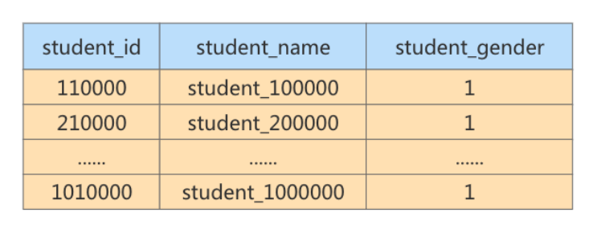

你能看到在未创建索引的情况下，运行的效率并不高。如果针对student_gender字段创建索引呢?

```sql
SELECT* FROMstudent-gender WHERE student_gender = 1
```

同样是10条数据，运行结果相同，时间却缩短到了0.052s，六幅提升了查询的效率。

你能看到在未创建索引的情况下，运行的效率并不高。如果针对student_gender字段创建索引呢?

SELECT* FROMstudent-gender WHERE student-gender = 1
同样是10条数据，运行结果相同，时间却缩短到了 0.052s ，大幅提升了查询的效率。
其实通过这两个实验你也能看出来，索引的价值是帮你快速定位。如果想要定位的数据有很多，那么索引就失去了它的使用价值，比如通常情况下的性别字段。

> 结论：当数据重复度大，比如 高于 10% 的时候，也不需要对这个字段使用索引。

### 4. 避免对经常更新的表创建过多的索引
第一层含义︰频繁更新的字段不一定要创建索引。因为更新数据的时候，也需要更新索引，如果索引太多，在更新索引的时候也会造成负担，从而影响效率。

第二层含义:避免对经常更新的表创建过多的索引，并且索引中的列尽可能少。此时，虽然提高了查询速度，同时却会降低更新表的速度。

### 5. 不建议用无序的值作为索引
例如身份证、UUID(在索引比较时需要转为ASCII，并且插入时可能造成页分裂)、MD5、HASH、无序长字符串等。

### 6. 删除不再使用或者很少使用的索引
表中的数据被大量更新，或者数据的使用方式被改变后，原有的一些索引可能不再需要。数据库管理员应当定期找出这些索引，将它们删除，从而减少索引对更新操作的影响。

### 7. 不要定义冗余或重复的索引
#### ① 冗余索引

举例：建表语句如下

```sql
CREATE TABLE person_info(
 id INT UNSIGNED NOT NULL AUTO_INCREMENT,
 name VARCHAR(100) NOT NULL,
 birthday DATE NOT NULL,
 phone_number CHAR(11) NOT NULL,
 country varchar(100) NOT NULL,
  PRIMARY KEY (id),
  KEY idx_name_birthday_phone_number (name(10), birthday, phone_number),
  KEY idx_name (name(10))
);  
```

我们知道，通过 idx_name_birthday_phone_number 索引就可以对 name 列进行快速搜索，再创建一个专门针对 name 列的索引就算是一个 **冗余索引** ，维护这个索引只会增加维护的成本，并不会对搜索有什么好处。

#### ② 重复索引

另一种情况，我们可能会对某个列 重复建立索引 ，比方说这样：

```sql
CREATE TABLE repeat_index_demo (
 col1 INT PRIMARY KEY,
 col2 INT,
  UNIQUE uk_idx_c1 (col1),
  INDEX idx_c1 (col1)
); 
```

我们看到，col1 既是主键、又给它定义为一个唯一索引，还给它定义了一个普通索引，可是主键本身就会生成聚簇索引，所以定义的唯一索引和普通索引是重复的，这种情况要避免。

## 3.5 小结
索引是一把 双刃剑，可提高查询效率，但也会降低插入和更新的速度并占用磁盘空间。

选择索引的最终目的是为了使查询的速度变快，上面给出的原则是最基本的准则，但不能拘泥于上面的准则，大家要在以后的学习和工作中进行不断的实践，根据应用的实际情况进行分析和判断，选择最合适的索引方式。