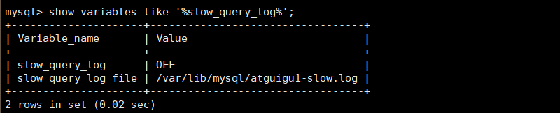
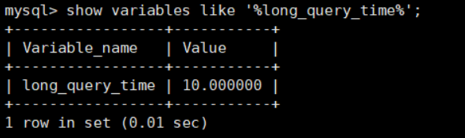

# 1. 数据库服务器的优化步骤
当我们遇到数据库调优问题的时候，该如何思考呢？这里把思考的流程整理成下面这张图。
整个流程划分成了 **观察（Show status） 和  行动（Action）** 两个部分。字母 S 的部分代表观察（会使用相应的分析工具），字母 A 代表的部分是行动（对应分析可以采取的行动）。


## 小結


# 2. 查看系统性能参数
在MySQL中，可以使用 **SHOW STATUS** 语句查询一些MySQL数据库服务器的 **性能参数 、 执行频率** 。

SHOW STATUS语句语法如下：

```sql
SHOW [GLOBAL|SESSION] STATUS LIKE '参数';
```

- 一些常用的性能参数如下：
    - Connections：连接MySQL服务器的次数。
    - Uptime：MySQL 服务器的上线时间。
    - Slow_queries：慢查询的次数。
    - Innodb_rows_read：Select查询返回的行数
    - Innodb_rows_inserted：执行INSERT操作插入的行数
    - Innodb_rows_updated：执行UPDATE操作更新的行数
    - Innodb_rows_deleted：执行DELETE操作删除的行数
    - Com_select：查询操作的次数。
    - Com_insert：插入操作的次数。对于批量插入的 INSERT 操作，只累加一次。
    - Com_update：更新操作的次数。
    - Com_delete：删除操作的次数。

若查询MySQL服务器的连接次数，则可以执行如下语句:

```sql
SHOW STATUS LIKE 'connections';
```

若查询服务器工作时间，则可以执行如下语句:

```sql
SHOW STATUS LIKE 'Uptime';
```

若查询MySQL服务器的慢查询次数，则可以执行如下语句:

```sql
SHOW STATUS LIKE 'Slow_queries';
```

慢查询次数参数可以结合慢查询日志找出慢查询语句，然后针对慢查询语句进行表结构优化或者查询语句优化。再比如，如下的指令可以查看相关的指令情况:

```sql
show status like 'Innodb_rows_%';
```

# 3. 统计SQL的查询成本：last_query_cost
一条SQL查询语句在执行前需要确定查询执行计划，如果存在多种执行计划的话，MySQL会计算每个执行计划所需要的成本，从中选择 **成本最小** 的一个作为最终执行的执行计划。

如果我们想要查看某条SQL语句的查询成本，可以在执行完这条SQL语句之后，通过查看当前会话中的 **last_query_cost** 变量值来得到当前查询的成本。它通常也是我们 评价一个查询的执行效率的一个常用指标 。这个查询成本对应的是 SQL语句所需要读取的页的数量 。

我们依 然使用第8章的 student_info 表为例：

```sql
use atguigudb1;
 
CREATE TABLE `student_info` (
    `id` INT(11) NOT NULL AUTO_INCREMENT,
    `student_id` INT NOT NULL ,
    `name` VARCHAR(20) DEFAULT NULL,
    `course_id` INT NOT NULL ,
    `class_id` INT(11) DEFAULT NULL,
    `create_time` DATETIME DEFAULT CURRENT_TIMESTAMP ON UPDATE CURRENT_TIMESTAMP,
    PRIMARY KEY (`id`)
) ENGINE=INNODB AUTO_INCREMENT=1 DEFAULT CHARSET=utf8;
```

如果我们想要查询 `id=900001` 的记录，然后看下查询成本，我们可以直接在聚簇索引上进行查找：

```shell
mysql> select * from student_info where id = 900001;
 
+--------+------------+--------+-----------+----------+---------------------+
| id     | student_id | name   | course_id | class_id | create_time         |
+--------+------------+--------+-----------+----------+---------------------+
| 900001 |      40881 | LXFjgc |     10100 |    10087 | 2021-12-20 16:05:22 |
+--------+------------+--------+-----------+----------+---------------------+
1 row in set (0.03 sec)
```

运行结果（1 条记录，运行时间为 0.03s ）
然后再看下查询优化器的成本，实际上我们只需要检索一个页即可：

```shell
mysql> SHOW STATUS LIKE 'last_query_cost';
+-----------------+----------+
| Variable_name  | Value  |
+-----------------+----------+
| Last_query_cost | 1.000000 |
+-----------------+----------+
```

如果我们想要查询 id 在 900001 到 9000100 之间的学生记录呢？

```sql
SELECT student_id, class_id, NAME, create_time FROM student_info
WHERE id BETWEEN 900001 AND 900100;
```

运行结果（100 条记录，运行时间为 0.046s）：

然后再看下查询优化器的成本，这时我们大概需要进行 20 个页的查询。

```shell
mysql> SHOW STATUS LIKE 'last_query_cost';
+-----------------+-----------+
| Variable_name  | Value   |
+-----------------+-----------+
| Last_query_cost | 21.134453 |
+-----------------+-----------+
```

你能看到页的数量是刚才的 20 倍，但是查询的效率并没有明显的变化，实际上这两个 SQL 查询的时间基本上一样，就是因为采用了顺序读取的方式将页面一次性加载到缓冲池中，然后再进行查找。虽然 **页数量（last_query_cost）增加了不少** ，但是通过缓冲池的机制，并 **没有增加多少查询时间** 。

### 使用场景：它对于比较开销是非常有用的，特别是我们有好几种查询方式可选的时候。
> SQL 查询是一个动态的过程，从页加载的角度来看，我们可以得到以下两点结论：

1. **位置决定效率:** 如果页就在数据库缓冲池中，那么效率是最高的，否则还需要从内存或者磁盘中进行读取，当然针对单个页的读取来说，如果页存在于内存中，会比在磁盘中读取效率高很多。

2. **批量决定效率:** 如果我们从磁盘中对单一页进行随机读，那么效率是很低的（差不多10ms），而采用顺序读取的方式，批量对页进行读取，平均一页的读取效率就会提升很多，甚至要快于单个页面在内存中的随机读取。

所以说，遇到 I/O 并不用担心，方法找对了，效率还是很高的。我们首先要考虑数据存放的位置，如果是经常使用的数据就要尽量放到缓冲池中，其次我们可以充分利用磁盘的吞吐能力，一次性批量读取数据，这样单个页的读取效率也就得到了提升。

# 4. 定位执行慢的SQL：慢查询日志
MySQL的慢查询日志，用来记录在MySQL中响应时间超过阈值的语句，具体指运行时间超过 **long_query_time** 的值的 SQL，则会被记录到慢查询日志中。**long_query_time** 的默认值为10，意思是运行10秒以上（不含10秒）的语句，认为是超出了我们的最大忍耐时间值。

它的主要作用是，帮助我们发现那些执行时间特别长的SQL查询语句，并且有针对性地进行优化，从而提高系统的整体效率。当我们的数据库服务器发生阻塞、运行变慢的时候，检查一下慢查询日志，找到那些慢查询sql，对解决问题很有帮助。比如一条SQL执行超过5秒钟，我们就算慢SQL，希望能收集超过5秒的sql，结合explain进行全面分析。

默认情况下，MySQL数据库没有开启慢查询日志，需要我们手动来设置这个参数。如果不是调优需要的话，一般不建议启动该参数，因为开启慢查询日志会或多或少带来一定的性能影响。

慢查询日志支持将日志记录写入文件。

## 4.1 开启慢查询日志参数
### 1. 开启 `slow_query_log`

在使用前，我们需要先看下慢查询是否已经开启，使用下面这条命令即可:

```sql
set global slow_query_log='ON';
```

然后我们再来查看下慢查询日志是否开启，以及慢查询日志文件的位置：

```sql
show variables like '%slow_query_log%';
```



> 你能看到这时慢查询分析已经开启，同时文件保存在 `/var/lib/mysql/atguigu1-slow.log` 文件中

### 2. 修改long_query_time阈值

接下来我们来看下慢查询的时间阈值设置，使用如下命令：

```sql
show variables like '%long_query_time%';
```



这里如果我们想把时间缩短，比如设置为 1 秒，可以这样设置：

```sql
-- 测试发现：设置global的方式对当前session的long_query_time失效。对新连接的客户端-- 有效。所以可以一并 执行下述语句  
set global long_query_time = 1; 
show global variables like '%long_query_time%'; 
```

### 补充:配置文件中一并设置参数

如下的方式相较于前面的命令行方式，可以看作是永久设置的方式。

修改 **my .cnf** 文件，[mysqld]下增加或修改参数 `long_query_time 、slow_query_log 和 slow_query_log_file` 后，然后重启MySQL服务器。

```shell
[mysqld]
slow_query_log=ON   #开启慢查询日志的开关
slow.query_log_file=/var/lib/mysq1/atguigu-slow.log  #慢查询日志的目录和文件名信息
long.query_time=3  #设置慢查询的阈值为3秒，超出此设定值的SQL即被记录到慢查询日志
log_output=FILE
```

> 如果不指定存储路径，慢查询日志将默认存储到MySQL数据库的数据文件夹下。如果不指定文件名，默认文件名为 **hostname-slow.log**

## 4.2 查看慢查询数目
查询当前系统中有多少条慢查询记录

```sql
SHOW GLOBAL STATUS LIKE '%Slow_queries%';
```

## 4.3 案例演示
### 步骤1. 建表

```sql
CREATE TABLE `student` (
    `id` INT(11) NOT NULL AUTO_INCREMENT,
    `stuno` INT NOT NULL ,
    `name` VARCHAR(20) DEFAULT NULL,
    `age` INT(3) DEFAULT NULL,
    `classId` INT(11) DEFAULT NULL,
PRIMARY KEY (`id`)
) ENGINE=INNODB AUTO_INCREMENT=1 DEFAULT CHARSET=utf8;
```

### 步骤2：创建函数

随机产生字符串：（同上一章）

```sql
DROP FUNCTION IF EXISTS atguigudb1.rand_string;

DELIMITER $$
$$
CREATE DEFINER=`root`@`localhost` FUNCTION `atguigudb1`.`rand_string`(n INT) RETURNS varchar(255) CHARSET utf8mb4
BEGIN 
	DECLARE chars_str VARCHAR(100) DEFAULT 'abcdefghijklmnopqrstuvwxyzABCDEFJHIJKLMNOPQRSTUVWXYZ';
	DECLARE return_str VARCHAR(255) DEFAULT '';
	DECLARE i INT DEFAULT 0;
	WHILE i < n DO
		SET return_str = CONCAT(return_str,SUBSTRING(chars_str, FLOOR(1 + RAND() * 52), 1));
		SET i = i + 1;
	END WHILE;
	RETURN return_str;
END $$
DELIMITER ;

#测试
SELECT rand_string(10);
```

产生随机数值：（同上一章）

```sql
DROP FUNCTION IF EXISTS atguigudb1.rand_num;

DELIMITER $$
CREATE DEFINER=`root`@`localhost` FUNCTION `atguigudb1`.`rand_num`(from_num INT ,to_num INT) RETURNS int
BEGIN
	DECLARE i INT DEFAULT 0; 
	SET i = FLOOR(from_num + RAND() * (to_num - from_num + 1));
	RETURN i; 
END $$
DELIMITER ;

#测试：
SELECT rand_num(10,100);
```

##### 创建函数，假如报错：
```text
This function has none of DETERMINISTIC......
```

命令开启：允许创建函数设置：

```sql
set global log_bin_trust_function_creators=1;
```

### 步骤4：创建存储过程
```sql
DROP PROCEDURE IF EXISTS atguigudb1.insert_stu1;

DELIMITER $$
$$
CREATE PROCEDURE atguigudb1.insert_stu1(START INT , max_num INT)
BEGIN 
	DECLARE i INT DEFAULT 0; 
	SET autocommit = 0; #设置手动提交事务
	REPEAT	#循环
	SET i = i + 1;	#赋值
		INSERT INTO student (stuno, NAME ,age ,classId ) VALUES ((START+i),rand_string(6),rand_num(10,100),rand_num(10,1000)); 
	UNTIL i = max_num 
	END REPEAT; 
	COMMIT;	#提交事务
END $$
DELIMITER ;
```

### 步骤5：调用存储过程
```sql
-- 调用刚刚写好的函数, 4000000条记录,从100001号开始
CALL insert_stu1(100001,4000000);
```
## 4.4 测试及分析
### 测试
```shell
mysql> SELECT * FROM student WHERE stuno = 3455655;
+---------+---------+--------+------+---------+
| id   | stuno  | name  | age | classId |
+---------+---------+--------+------+---------+
| 3523633 | 3455655 | oQmLUr |  19 |    39 |
+---------+---------+--------+------+---------+
1 row in set (2.09 sec)
```
 
```shell
mysql> SELECT * FROM student WHERE name = 'oQmLUr';
+---------+---------+--------+------+---------+
| id   | stuno  | name  | age | classId |
+---------+---------+--------+------+---------+
| 1154002 | 1243200 | OQMlUR |  266 |    28 |
| 1405708 | 1437740 | OQMlUR |  245 |   439 |
| 1748070 | 1680092 | OQMlUR |  240 |   414 |
| 2119892 | 2051914 | oQmLUr |  17 |    32 |
| 2893154 | 2825176 | OQMlUR |  245 |   435 |
| 3523633 | 3455655 | oQmLUr |  19 |    39 |
+---------+---------+--------+------+---------+
6 rows in set (2.39 sec)
```

> 从上面的结果可以看出来，查询学生编号为 `3455655` 的学生信息花费时间为 `2.09`秒。查询学生姓名为 `oQmLUr` 的学生信息花费时间为 `2.39` 秒。已经达到了秒的数量级，说明目前查询效率是比较低的，下面的小节我们分析一下原因。

### 分析
```shell
mysql> show status like 'slow_queries';
+---------------+-------+
| Variable_name | Value |
+---------------+-------+
| Slow_queries  | 2     |
+---------------+-------+
1 row in set (0.00 sec)
```

##### 补充说明:

除了上述变量，控制慢查询日志的还有一个系统变量: min_examined_row_limit。这个变量的意思是，查询 **扫描过的最少记录数** 。这个变量和查询执行时间，共同组成了判别一个查询是否是慢查询的条件。如果查询扫描过的记录数大于等于这个变量的值，并且查询执行时间超过`long_query_time` 的值，那么，这个查询就被记录到慢查询日志中;反之，则不被记录到慢查询日志中。


这个值默认是0。与 `long_query_time=10` 合在一起，表示只要查询的执行时间超过10秒钟，哪怕一个记录也没有扫描过，都要被记录到慢查询日志中。你也可以根据需要，通过修改"my.ini""文件，来修改查询时长，或者通过SET指令，用SQL语句修改"min_examined_row_limit"的值。

## 4.5 慢查询日志分析工具：mysqldumpslow
在生产环境中，如果要手工分析日志，查找、分析SQL，显然是个体力活，MySQL提供了日志分析工具 `mysqldumpslow` 。

查看mysqldumpslow的帮助信息

```shell
mysqldumpslow --help
```


- mysqldumpslow 命令的具体参数如下：
    - -a: 不将数字抽象成N，字符串抽象成S
    - -s: 是表示按照何种方式排序：
    - c: 访问次数
    - l: 锁定时间
    - r: 返回记录
    - t: 查询时间
    - al:平均锁定时间
    - ar:平均返回记录数
    - at:平均查询时间 （默认方式）
    - ac:平均查询次数
    - -t: 即为返回前面多少条的数据；
    - -g: 后边搭配一个正则匹配模式，大小写不敏感的；

举例：我们想要按照查询时间排序，查看前五条 SQL 语句，这样写即可：

```shell
mysqldumpslow -s t -t 5 /var/lib/mysql/atguigu1-slow.log
```

```shell
[root@bogon ~]# mysqldumpslow -s t -t 5 /var/lib/mysql/atguigu1-slow.log
Reading mysql slow query log from /var/lib/mysql/atguigu01-slow.log
Count: 1  Time=2.39s (2s)  Lock=0.00s (0s) Rows=13.0 (13), root[root]@localhost
 SELECT * FROM student WHERE name = 'S'
Count: 1  Time=2.09s (2s)  Lock=0.00s (0s) Rows=2.0 (2), root[root]@localhost
 SELECT * FROM student WHERE stuno = N
Died at /usr/bin/mysqldumpslow line 162, <> chunk 2.
```

### 工作常用参考：
```shell
#得到返回记录集最多的10个SQL 
mysqldumpslow -s r -t 10 /var/lib/mysql/atguigu1-slow.log 

#得到访问次数最多的10个SQL 
mysqldumpslow -s c -t 10 /var/lib/mysql/atguigu1-slow.log

#得到按照时间排序的前10条里面含有左连接的查询语句 
mysqldumpslow -s t -t 10 -g "left join" /var/lib/mysql/atguigu1-slow.log 

#另外建议在使用这些命令时结合 | 和more 使用 ，否则有可能出现爆屏情况 
mysqldumpslow -s r -t 10 /var/lib/mysql/atguigu-slow.log | more
```

## 4.6 关闭慢查询日志
MySQL服务器停止慢查询日志功能有两种方法：

### 方式1：永久性方式
```shell
[mysqld] 
slow_query_log=OFF
```

或者，把slow_query_log一项注释掉 或 删除

```shell
[mysqld]
#slow_query_log =OFF
```

重启MySQL服务，执行如下语句查询慢日志功能。

```shell
SHOW VARIABLES LIKE '%slow%';  #查询慢查询日志所在目录
SHOW VARIABLES LIKE '%long_query_time%';  #查询超时时长
```

### 方式2：临时性方式
使用SET语句来设置。

##### （1）停止MySQL慢查询日志功能，具体SQL语句如下。
```sql
SET GLOBAL slow_query_log=off;
```
##### （2）重启MySQL服务，使用SHOW语句查询慢查询日志功能信息，具体SQL语句如下
```sql
SHOW VARIABLES LIKE '%slow%';
#以及
SHOW VARIABLES LIKE '%long_query_time%';
```

## 4.7 删除慢查询日志
使用SHOW语句显示慢查询日志信息，具体SQL语句如下。

```sql
SHOW VARIABLES LIKE 'slow_query_log%';
```


从执行结果可以看出，慢查询日志的目录默认为MySQL的数据目录，在该目录下 **手动删除慢查询日志文件** 即可。使用命令 `mysqladmin flush-logs` 来重新生成查询日志文件，具体命令如下，执行完毕会在数据目录下重新生成慢查询日志文件。

```shell
mysqladmin -root -p flush-logs slow
```

> **提示：**
> - 慢查询日志都是使用 `mysqladmin flush-logs` 命令来删除重建的。使用时一定要注意，一旦执行了这个命令，慢查询日志都只存在新的日志文件中，如果需要旧的查询日志，就必须事先备份。

# 5. 查看 SQL 执行成本：SHOW PROFILE
show profile在《逻辑架构》章节中讲过，这里作为复习。

Show Profile是MySQL提供的可以用来分析当前会话中SQL都做了什么、执行语句资源消耗情况的工具，可用于sql调优的测量。默认情况下处于关闭状态，并保存最近15次的运行结果。

我们可以在会话级别开启这个功能

```sql
show variables like 'profiling';
```


通过设置 profiling='ON’ 来开启 show profile：

```sql
set profiling = 'ON';
```


然后执行相关的查询语句。接着看下当前会话都有哪些 profiles，使用下面这条命令：

```sql
show profiles;
```


你能看到当前会话一共有 2 个查询。如果我们想要查看最近一次查询的开销，可以使用：

```sql
show profile;
```


我们也可以查看指定的Query ID的开销，比如 show profile for query 2 查询结果是一样的。在SHOW PROFILE 中我们可以查看不同部分的开销，比如cpu、block.io等:

```sql
show profile cpu,block io for query 2;
```


### show profile 的常用查询参数：
① ALL：显示所有的开销信息。

② BLOCK IO：显示块IO开销。

③ CONTEXT SWITCHES：上下文切换开销。

④ CPU：显示CPU开销信息。

⑤ IPC：显示发送和接收开销信息。

⑥ MEMORY：显示内存开销信息。

⑦ PAGE FAULTS：显示页面错误开销信息。

⑧ SOURCE：显示和Source_function，Source_file，Source_line相关的开销信息。

⑨ SWAPS：显示交换次数开销信息。

### 日常开发需注意的结论:

①converting HEAP to MyISAM:查询结果太大，内存不够，数据往磁盘上搬了。

②Creating tmp table:创建临时表。先拷贝数据到临时表，用完后再删除临时表。

③Copying to tmp table on disk:把内存中临时表复制到磁盘上，警惕!

④locked。

> 如果在show profile诊断结果中出现了以上4条结果中的任何一条，则sql语句需要优化。

### 注意:

不过SHOW PROFILE命令将被弃用，我们可以从information_schema中的profiling数据表进行查看。

# 6. 分析查询语句：EXPLAIN
## 6.1 概述
定位了查询慢的SQL之后，我们就可以使用EXPLAIN或 DESCRIBE 工具做针对性的分析查询语句。DESCRIBE语句的使用方法与EXPLAIN语句是一样的，并且分析结果也是一样的。

MySQL中有专门负责优化 SELECT 语句的优化器模块，主要功能：通过计算并分析系统中收集到的统计信息，为客户端请求的Query提供它认为最优的 **执行计划** (他认为最优的数据检索方式，但不见得是DBA认为是最优的，这部分最耗费时间)。

这个执行计划展示了接下来具体执行查询的方式，比如多表连接的顺序是什么，对于每个表采用什么访问方法来执行查询等等。MySQL为我们提供了 EXPLAIN 语句来帮助我们查看某个查询语句的具体执行计划，大家看懂 EXPLAIN 语句的各个输出项，可以有针对性的提升我们查询语句的性能。

##### 1. 能做什么?
- 表的读取顺序
- 数据读取操作的操作类型
- 哪些索引可以使用
- 哪些索引被实际使用
- 表之间的引用
- 每张表有多少行被优化器查

##### 2. 官网介绍


- 版本情况
    - MySQL 5.6.3以前只能 EXPLAIN SELECT ；MYSQL 5.6.3以后就可以 EXPLAIN SELECT，UPDATE，DELETE
    - 在5.7以前的版本中，想要显示 partitions 需要使用 explain partitions 命令；想要显示 filtered 需要使用 explain extended 命令。在5.7版本后，默认explain直接显示partitions和filtered中的信息。

## 6.2 基本语法
EXPLAIN 或 DESCRIBE语句的语法形式如下：

```sql
EXPLAIN SELECT select_options 
#或者
DESCRIBE SELECT select_options
```

如果我们想看看某个查询的执行计划的话，可以在具体的查询语句前边加一个 EXPLAIN ，就像这样：

```sql
EXPLAIN SELECT 1 FROM DUAL;
```


输出的上述信息就是所谓的 执行计划 。在这个执行计划的辅助下，我们需要知道应该怎样改进自己的查询语句以使得执行起来更高效。其实除了以 SELECT 开头的查询语句，其余的 DELETE、INSERT、REPLACE 以及 UPDATE 语句等都可以加上EXPLAIN，用来查看这些语句的执行计划，只是平时我们对SELECT语句更感兴趣。

> 注意：执行EXPLAIN时并没有真正的执行该后面的语句，因此可以安全的查看执行计划。

### EXPLAIN 语句输出的各个列的作用如下：

| 列名 | 描述 |
|---|---|
| id | 在一个大的查询语句中每个SELECT关键字都对应一个唯一的id |
| select_type | SELECT关键字对应的那个查询的类型 |
| table	| 表名 |
| partitions | 匹配的分区信息 |
| type | 针对单表的访问方法 |
| possible_keys | 可能用到的索引 |
| key | 实际上使用的索引 |
| key_len | 实际使用到的索引长度 |
| ref | 当使用索引列等值查询时，与索引列进行等值匹配的对象信息 |
| rows | 预估的需要读取的记录条数 |
| filtered | 某个表经过搜索条件过滤后剩余记录条数的百分比 |
| Extra | 一些额外的信息 |

> 在这里把它们都列出来只是为了描述一个轮廓，让大家有一个大致的印象。

## 6.3 数据准备

### 建表
```sql
use atguigudb1;
 
CREATE TABLE s1 (
	id INT,
	key1 VARCHAR (100),
	key2 INT,
	key3 VARCHAR (100),
	key_part1 VARCHAR (100),
	key_part2 VARCHAR (100),
	key_part3 VARCHAR (100),
	common_field VARCHAR (100),
	PRIMARY KEY (id),
	INDEX idx_key1 (key1),
	UNIQUE INDEX idx_key2 (key2),
	INDEX idx_key3 (key3),
	INDEX idx_key_part (key_part1, key_part2, key_part3) 
) ENGINE = INNODB CHARSET = utf8;
 
 
CREATE TABLE s2 (
	id INT AUTO_INCREMENT,
	key1 VARCHAR ( 100 ),
	key2 INT,
	key3 VARCHAR ( 100 ),
	key_part1 VARCHAR ( 100 ),
	key_part2 VARCHAR ( 100 ),
	key_part3 VARCHAR ( 100 ),
	common_field VARCHAR ( 100 ),
	PRIMARY KEY ( id ),
	INDEX idx_key1 ( key1 ),
	UNIQUE INDEX idx_key2 ( key2 ),
	INDEX idx_key3 ( key3 ),
	INDEX idx_key_part ( key_part1, key_part2, key_part3 ) 
) ENGINE = INNODB CHARSET = utf8;
```

### 设置参数 log_bin_trust_function_creators
创建函数，假如报错，需开启如下命令：允许创建函数设置：

```sql
set global log_bin_trust_function_creators=1;   # 不加global只是当前窗口有效
```

### 创建函数
```sql
DROP FUNCTION IF EXISTS atguigudb1.rand_string1;

DELIMITER $$
$$
CREATE FUNCTION atguigudb1.rand_string1(n INT)
RETURNS VARCHAR(255) #该函数会返回一个字符串
BEGIN
	DECLARE chars_str VARCHAR(100) DEFAULT
'abcdefghijklmnopqrstuvwxyzABCDEFJHIJKLMNOPQRSTUVWXYZ';
	DECLARE return_str VARCHAR(255) DEFAULT '';
	DECLARE i INT DEFAULT 0;
	WHILE i < n DO
		SET return_str =CONCAT(return_str,SUBSTRING(chars_str,FLOOR(1+RAND()*52),1));
		SET i = i + 1;
	END WHILE;
	RETURN return_str;
END$$
DELIMITER ;
```

### 创建存储过程

创建往s1表中插入数据的存储过程：

```sql
DROP PROCEDURE IF EXISTS atguigudb1.insert_s1;

DELIMITER $$
$$
CREATE PROCEDURE atguigudb1.insert_s1(IN min_num INT (10),IN max_num INT (10))
BEGIN
DECLARE i INT DEFAULT 0;
SET autocommit = 0;
REPEAT
SET i = i + 1;
INSERT INTO s1 VALUES(
	(min_num + i),
	rand_string1(6),
	(min_num + 30 * i + 5),
	rand_string1(6),
	rand_string1(10),
	rand_string1(5),
	rand_string1(10),
	rand_string1(10));
UNTIL i = max_num
END REPEAT;
COMMIT;
END$$
DELIMITER ;
```

创建往s2表中插入数据的存储过程：

```sql
DROP PROCEDURE IF EXISTS atguigudb1.insert_s2;

DELIMITER $$
$$
CREATE PROCEDURE atguigudb1.insert_s2(IN min_num INT ( 10 ),IN max_num INT ( 10 )) 
BEGIN
	DECLARE i INT DEFAULT 0;
	SET autocommit = 0;
	REPEAT
		SET i = i + 1;
		INSERT INTO s2 VALUES(
		( min_num + i ),
		rand_string1 ( 6 ),
		( min_num + 30 * i + 5 ),
		rand_string1 ( 6 ),
		rand_string1 ( 10 ),
		rand_string1 ( 5 ),
		rand_string1 ( 10 ),
		rand_string1 ( 10 )
		);
		UNTIL i = max_num 
	END REPEAT;
	COMMIT;
	
END$$
DELIMITER ;
```

### 调用存储过程

s1表数据的添加：加入1万条记录：

```sql
CALL insert_s1(10001,10000);
```

s2表数据的添加：加入1万条记录：

```sql
CALL insert_s2(10001,10000);
```

## 6.4 EXPLAIN各列作用
> 为了让大家有比较好的体验，我们调整了下 EXPLAIN 输出列的顺序。

### 1. table
當我們使用 `EXPLAIN` 來分析 MySQL 查詢時，它會回傳一張表格，這張表格每一列對應「一次對單一表的存取」，也就是說，不論你原始查詢涉及幾個表（JOIN、多層子查詢等），最後都會拆解成對每個表的單獨訪問行為，並逐列顯示這些行為的細節。

---

#### ✅ 第 1 欄：`table`
##### 💡 說明：
`table` 欄表示當前這一行描述的是哪個資料表的存取。  
- 通常是表的名稱；
- 若是子查詢或派生表，可能會出現「別名」或「臨時名稱」；
- 若使用了**物化子查詢（derived table）或 temporary table**，這邊會顯示該臨時表的代號（例如 `derived2` 或 `subquery1`）。

---

##### 🧪 範例：
假設你有以下兩個表：

```sql
CREATE TABLE students (
  id INT PRIMARY KEY,
  name VARCHAR(50),
  class_id INT
);

CREATE TABLE classes (
  id INT PRIMARY KEY,
  class_name VARCHAR(50)
);
```

查詢語句如下：

```sql
EXPLAIN
SELECT s.name, c.class_name
FROM students s
JOIN classes c ON s.class_id = c.id;
```

回傳的 EXPLAIN 表格中可能會看到如下內容：

| id | select_type | table  | type   | ... |
|----|-------------|--------|--------|-----|
| 1  | SIMPLE      | c      | ALL    | ... |
| 1  | SIMPLE      | s      | ref    | ... |

🔍 解釋：
- `table` 第一行顯示 `c`：這代表 MySQL 首先會處理 `classes` 表。
- `table` 第二行顯示 `s`：這代表它會根據 `s.class_id = c.id` 去查找 `students` 表。

如果你查詢用到了子查詢，會是這樣：

```sql
EXPLAIN
SELECT name
FROM students
WHERE class_id IN (
  SELECT id FROM classes WHERE class_name LIKE 'Math%'
);
```

| id | select_type | table     | type   | ... |
|----|-------------|-----------|--------|-----|
| 1  | PRIMARY     | students  | ALL    | ... |
| 2  | SUBQUERY    | classes   | range  | ... |

🔍 `table` 會顯示 `students` 與 `classes`，分別是主查詢與子查詢處理的表名。

---

### 2. id
當你使用 `EXPLAIN` 分析 SQL 查詢時，第二欄的 `id` 是非常關鍵的欄位，它代表的是 **「執行計劃中的一個步驟」** 或 **一趟獨立的查詢操作**。  
我們可以把 `id` 想像成「這一行是第幾個子查詢或子步驟的執行單位」。

---

#### 💡 說明總結：

| `id` 數值特性 | 說明 |
|---------------|------|
| 相同的 `id` 值 | 表示這些行屬於同一層查詢（同一趟查詢），按照從上到下執行 |
| `id` 數值越大 | 執行優先級越高，表示它會「**先被執行**」 |
| 不同的 `id` | 表示不同層級的查詢（例如主查詢 vs 子查詢） |

---

#### 🧪 範例 1：簡單單表查詢
```sql
EXPLAIN
SELECT * FROM students WHERE class_id = 1;
```

| id | select_type | table    | ... |
|----|-------------|----------|-----|
| 1  | SIMPLE      | students | ... |

🔍 說明：
- `id = 1`，表示整體只有一趟查詢。

---

#### 🧪 範例 2：JOIN 查詢（還是只有一趟）
```sql
EXPLAIN
SELECT s.name, c.class_name
FROM students s
JOIN classes c ON s.class_id = c.id;
```

| id | select_type | table  | ... |
|----|-------------|--------|-----|
| 1  | SIMPLE      | c      | ... |
| 1  | SIMPLE      | s      | ... |

🔍 說明：
- 雖然查詢兩個表，但 `id` 都是 1，代表這是同一趟查詢，MySQL 會按照順序處理 `c` 和 `s` 表。

---

#### 🧪 範例 3：含子查詢的 SELECT
```sql
EXPLAIN
SELECT name FROM students
WHERE class_id IN (
  SELECT id FROM classes WHERE class_name LIKE 'Math%'
);
```

| id | select_type | table    | ... |
|----|-------------|----------|-----|
| 1  | PRIMARY     | students | ... |
| 2  | SUBQUERY    | classes  | ... |

🔍 說明：
- `id = 2` 的子查詢會 **先執行**，因為它數字比較大；
- 然後才是 `id = 1` 的主查詢。

---

#### 🧪 範例 4：更複雜的嵌套查詢
```sql
EXPLAIN
SELECT * FROM students
WHERE class_id IN (
  SELECT id FROM classes
  WHERE teacher_id IN (
    SELECT id FROM teachers WHERE name = 'Ms. Wang'
  )
);
```

| id | select_type | table     | ... |
|----|-------------|-----------|-----|
| 1  | PRIMARY     | students  | ... |
| 2  | SUBQUERY    | classes   | ... |
| 3  | SUBQUERY    | teachers  | ... |

🔍 說明：
- `id = 3`（最內層子查詢）會先執行；
- 然後 `id = 2`（查 classes）使用上層結果；
- 最後 `id = 1`（主查詢）再依據 class_id 去查 students。

---

#### 📌 重點提醒：
- `id` **不是代表資料表順序，而是執行步驟順序**。
- 一個查詢語句的 `id` 數量越多，代表這個查詢越複雜；
- 查詢次數越多，對效能越不利（可優化的潛力也越大）。

---

### 3. select_type
#### 💡 說明：

`select_type` 表示 **這一行所屬的 SELECT 語句的類型**，也就是它在整個 SQL 執行計畫中扮演的角色。  
每一個 `SELECT` 關鍵字都會被 MySQL 當成一個「小查詢單位」，系統會給這個小查詢一個 select_type。

---

#### 🧩 常見的 `select_type` 類型

| 類型名稱 | 說明 |
|----------|------|
| `SIMPLE` | 不包含子查詢或 UNION 的簡單查詢 |
| `PRIMARY` | 最外層的 SELECT，包含子查詢或 UNION 時的主查詢 |
| `SUBQUERY` | 被包含在 `SELECT`, `WHERE`, 或 `HAVING` 中的子查詢 |
| `DERIVED` | 從 FROM 子句中出現的子查詢（也就是派生表、臨時表） |
| `UNION` | UNION 中的第二個 SELECT（及之後的） |
| `UNION RESULT` | 代表整個 UNION 結果集的臨時表 |
| `DEPENDENT SUBQUERY` | 子查詢依賴於外層查詢（外層值變了，它會重跑） |
| `DEPENDENT UNION` | 同上，用在 UNION 裡的子查詢 |
| `MATERIALIZED` | 表示使用了物化子查詢（MySQL 8.0+ 的新優化方式） |
| `UNCACHEABLE SUBQUERY` | 子查詢中有變數，導致不能快取 |

---

#### 🧪 範例 1：簡單查詢
```sql
EXPLAIN SELECT * FROM students WHERE id = 1;
```

| id | select_type | table    | ... |
|----|-------------|----------|-----|
| 1  | SIMPLE      | students | ... |

🔍 `SIMPLE` → 單表查詢，沒子查詢、沒 UNION。

---

#### 🧪 範例 2：子查詢在 WHERE 子句中
```sql
EXPLAIN
SELECT name FROM students
WHERE class_id IN (
  SELECT id FROM classes WHERE class_name LIKE 'Math%');
```

| id | select_type | table    | ... |
|----|-------------|----------|-----|
| 1  | PRIMARY     | students | ... |
| 2  | SUBQUERY    | classes  | ... |

🔍 `PRIMARY` 是最外層查詢；`SUBQUERY` 是 WHERE 子句裡的內部 SELECT。

---

#### 🧪 範例 3：FROM 子句中有子查詢（派生表）
```sql
EXPLAIN
SELECT * FROM (
  SELECT * FROM students WHERE class_id = 1
) AS s1;
```

| id | select_type | table    | ... |
|----|-------------|----------|-----|
| 1  | PRIMARY     | <derived2> | ... |
| 2  | DERIVED     | students | ... |

🔍 外層查詢是 `PRIMARY`；  
內層 `FROM (...)` 是 `DERIVED` → MySQL 會物化成一個臨時表處理。

---

#### 🧪 範例 4：UNION 查詢
```sql
EXPLAIN
(SELECT id FROM students WHERE class_id = 1)
UNION
(SELECT id FROM students WHERE class_id = 2);
```

| id | select_type     | table    | ... |
|----|------------------|----------|-----|
| 1  | PRIMARY          | students | ... |
| 2  | UNION            | students | ... |
| NULL | UNION RESULT   | <union1> | ... |

🔍
- 第一個 SELECT 是 `PRIMARY`
- 第二個是 `UNION`
- `UNION RESULT` 表示合併結果的臨時表（通常 `table` 顯示 `<union1>`）

---

#### 🧠 小技巧總結：
- 查詢越複雜，`select_type` 越能幫你快速了解整體結構。
- `DERIVED`, `SUBQUERY`, `UNION` 等值的出現通常代表著可以優化的空間，例如將子查詢改寫成 JOIN。

---