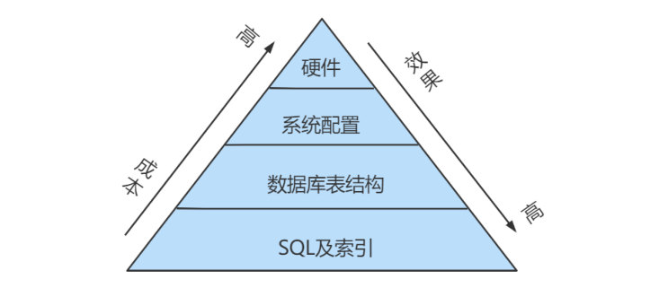
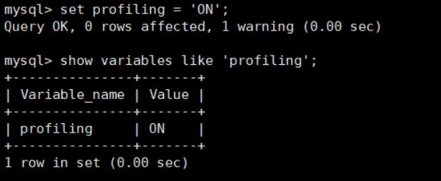

# 1. 数据库服务器的优化步骤
当我们遇到数据库调优问题的时候，该如何思考呢？这里把思考的流程整理成下面这张图。
整个流程划分成了 **观察（Show status） 和  行动（Action）** 两个部分。字母 S 的部分代表观察（会使用相应的分析工具），字母 A 代表的部分是行动（对应分析可以采取的行动）。


## 小結



# 2. 查看系统性能参数
在MySQL中，可以使用 **SHOW STATUS** 语句查询一些MySQL数据库服务器的 **性能参数 、 执行频率** 。

SHOW STATUS语句语法如下：

```sql
SHOW [GLOBAL|SESSION] STATUS LIKE '参数';
```

- 一些常用的性能参数如下：
    - Connections：连接MySQL服务器的次数。
    - Uptime：MySQL 服务器的上线时间。
    - Slow_queries：慢查询的次数。
    - Innodb_rows_read：Select查询返回的行数
    - Innodb_rows_inserted：执行INSERT操作插入的行数
    - Innodb_rows_updated：执行UPDATE操作更新的行数
    - Innodb_rows_deleted：执行DELETE操作删除的行数
    - Com_select：查询操作的次数。
    - Com_insert：插入操作的次数。对于批量插入的 INSERT 操作，只累加一次。
    - Com_update：更新操作的次数。
    - Com_delete：删除操作的次数。

若查询MySQL服务器的连接次数，则可以执行如下语句:

```sql
SHOW STATUS LIKE 'connections';
```

若查询服务器工作时间，则可以执行如下语句:

```sql
SHOW STATUS LIKE 'Uptime';
```

若查询MySQL服务器的慢查询次数，则可以执行如下语句:

```sql
SHOW STATUS LIKE 'Slow_queries';
```

慢查询次数参数可以结合慢查询日志找出慢查询语句，然后针对慢查询语句进行表结构优化或者查询语句优化。再比如，如下的指令可以查看相关的指令情况:

```sql
show status like 'Innodb_rows_%';
```

# 3. 统计SQL的查询成本：last_query_cost
一条SQL查询语句在执行前需要确定查询执行计划，如果存在多种执行计划的话，MySQL会计算每个执行计划所需要的成本，从中选择 **成本最小** 的一个作为最终执行的执行计划。

如果我们想要查看某条SQL语句的查询成本，可以在执行完这条SQL语句之后，通过查看当前会话中的 **last_query_cost** 变量值来得到当前查询的成本。它通常也是我们 评价一个查询的执行效率的一个常用指标 。这个查询成本对应的是 SQL语句所需要读取的页的数量 。

我们依 然使用第8章的 student_info 表为例：

```sql
use atguigudb1;
 
CREATE TABLE `student_info` (
    `id` INT(11) NOT NULL AUTO_INCREMENT,
    `student_id` INT NOT NULL ,
    `name` VARCHAR(20) DEFAULT NULL,
    `course_id` INT NOT NULL ,
    `class_id` INT(11) DEFAULT NULL,
    `create_time` DATETIME DEFAULT CURRENT_TIMESTAMP ON UPDATE CURRENT_TIMESTAMP,
    PRIMARY KEY (`id`)
) ENGINE=INNODB AUTO_INCREMENT=1 DEFAULT CHARSET=utf8;
```

如果我们想要查询 `id=900001` 的记录，然后看下查询成本，我们可以直接在聚簇索引上进行查找：

```shell
mysql> select * from student_info where id = 900001;
 
+--------+------------+--------+-----------+----------+---------------------+
| id     | student_id | name   | course_id | class_id | create_time         |
+--------+------------+--------+-----------+----------+---------------------+
| 900001 |      40881 | LXFjgc |     10100 |    10087 | 2021-12-20 16:05:22 |
+--------+------------+--------+-----------+----------+---------------------+
1 row in set (0.03 sec)
```

运行结果（1 条记录，运行时间为 0.03s ）
然后再看下查询优化器的成本，实际上我们只需要检索一个页即可：

```shell
mysql> SHOW STATUS LIKE 'last_query_cost';
+-----------------+----------+
| Variable_name  | Value  |
+-----------------+----------+
| Last_query_cost | 1.000000 |
+-----------------+----------+
```

如果我们想要查询 id 在 900001 到 9000100 之间的学生记录呢？

```sql
SELECT student_id, class_id, NAME, create_time FROM student_info
WHERE id BETWEEN 900001 AND 900100;
```

运行结果（100 条记录，运行时间为 0.046s）：

然后再看下查询优化器的成本，这时我们大概需要进行 20 个页的查询。

```shell
mysql> SHOW STATUS LIKE 'last_query_cost';
+-----------------+-----------+
| Variable_name  | Value   |
+-----------------+-----------+
| Last_query_cost | 21.134453 |
+-----------------+-----------+
```

你能看到页的数量是刚才的 20 倍，但是查询的效率并没有明显的变化，实际上这两个 SQL 查询的时间基本上一样，就是因为采用了顺序读取的方式将页面一次性加载到缓冲池中，然后再进行查找。虽然 **页数量（last_query_cost）增加了不少** ，但是通过缓冲池的机制，并 **没有增加多少查询时间** 。

### 使用场景：它对于比较开销是非常有用的，特别是我们有好几种查询方式可选的时候。
> SQL 查询是一个动态的过程，从页加载的角度来看，我们可以得到以下两点结论：

1. **位置决定效率:** 如果页就在数据库缓冲池中，那么效率是最高的，否则还需要从内存或者磁盘中进行读取，当然针对单个页的读取来说，如果页存在于内存中，会比在磁盘中读取效率高很多。

2. **批量决定效率:** 如果我们从磁盘中对单一页进行随机读，那么效率是很低的（差不多10ms），而采用顺序读取的方式，批量对页进行读取，平均一页的读取效率就会提升很多，甚至要快于单个页面在内存中的随机读取。

所以说，遇到 I/O 并不用担心，方法找对了，效率还是很高的。我们首先要考虑数据存放的位置，如果是经常使用的数据就要尽量放到缓冲池中，其次我们可以充分利用磁盘的吞吐能力，一次性批量读取数据，这样单个页的读取效率也就得到了提升。

# 4. 定位执行慢的SQL：慢查询日志
MySQL的慢查询日志，用来记录在MySQL中响应时间超过阈值的语句，具体指运行时间超过 **long_query_time** 的值的 SQL，则会被记录到慢查询日志中。**long_query_time** 的默认值为10，意思是运行10秒以上（不含10秒）的语句，认为是超出了我们的最大忍耐时间值。

它的主要作用是，帮助我们发现那些执行时间特别长的SQL查询语句，并且有针对性地进行优化，从而提高系统的整体效率。当我们的数据库服务器发生阻塞、运行变慢的时候，检查一下慢查询日志，找到那些慢查询sql，对解决问题很有帮助。比如一条SQL执行超过5秒钟，我们就算慢SQL，希望能收集超过5秒的sql，结合explain进行全面分析。

默认情况下，MySQL数据库没有开启慢查询日志，需要我们手动来设置这个参数。如果不是调优需要的话，一般不建议启动该参数，因为开启慢查询日志会或多或少带来一定的性能影响。

慢查询日志支持将日志记录写入文件。

## 4.1 开启慢查询日志参数
### 1. 开启 `slow_query_log`

在使用前，我们需要先看下慢查询是否已经开启，使用下面这条命令即可:

```sql
set global slow_query_log='ON';
```

然后我们再来查看下慢查询日志是否开启，以及慢查询日志文件的位置：

```sql
show variables like '%slow_query_log%';
```


> 你能看到这时慢查询分析已经开启，同时文件保存在 `/var/lib/mysql/atguigu1-slow.log` 文件中

### 2. 修改long_query_time阈值

接下来我们来看下慢查询的时间阈值设置，使用如下命令：

```sql
show variables like '%long_query_time%';
```


这里如果我们想把时间缩短，比如设置为 1 秒，可以这样设置：

```sql
-- 测试发现：设置global的方式对当前session的long_query_time失效。对新连接的客户端-- 有效。所以可以一并 执行下述语句  
set global long_query_time = 1; 
show global variables like '%long_query_time%'; 
```

### 补充:配置文件中一并设置参数

如下的方式相较于前面的命令行方式，可以看作是永久设置的方式。

修改 **my .cnf** 文件，[mysqld]下增加或修改参数 `long_query_time 、slow_query_log 和 slow_query_log_file` 后，然后重启MySQL服务器。

```shell
[mysqld]
slow_query_log=ON   #开启慢查询日志的开关
slow.query_log_file=/var/lib/mysq1/atguigu-slow.log  #慢查询日志的目录和文件名信息
long.query_time=3  #设置慢查询的阈值为3秒，超出此设定值的SQL即被记录到慢查询日志
log_output=FILE
```

> 如果不指定存储路径，慢查询日志将默认存储到MySQL数据库的数据文件夹下。如果不指定文件名，默认文件名为 **hostname-slow.log**

## 4.2 查看慢查询数目
查询当前系统中有多少条慢查询记录

```sql
SHOW GLOBAL STATUS LIKE '%Slow_queries%';
```

## 4.3 案例演示
### 步骤1. 建表

```sql
CREATE TABLE `student` (
    `id` INT(11) NOT NULL AUTO_INCREMENT,
    `stuno` INT NOT NULL ,
    `name` VARCHAR(20) DEFAULT NULL,
    `age` INT(3) DEFAULT NULL,
    `classId` INT(11) DEFAULT NULL,
PRIMARY KEY (`id`)
) ENGINE=INNODB AUTO_INCREMENT=1 DEFAULT CHARSET=utf8;
```

### 步骤2：创建函数

随机产生字符串：（同上一章）

```sql
DROP FUNCTION IF EXISTS atguigudb1.rand_string;

DELIMITER $$
$$
CREATE DEFINER=`root`@`localhost` FUNCTION `atguigudb1`.`rand_string`(n INT) RETURNS varchar(255) CHARSET utf8mb4
BEGIN 
	DECLARE chars_str VARCHAR(100) DEFAULT 'abcdefghijklmnopqrstuvwxyzABCDEFJHIJKLMNOPQRSTUVWXYZ';
	DECLARE return_str VARCHAR(255) DEFAULT '';
	DECLARE i INT DEFAULT 0;
	WHILE i < n DO
		SET return_str = CONCAT(return_str,SUBSTRING(chars_str, FLOOR(1 + RAND() * 52), 1));
		SET i = i + 1;
	END WHILE;
	RETURN return_str;
END $$
DELIMITER ;

#测试
SELECT rand_string(10);
```

产生随机数值：（同上一章）

```sql
DROP FUNCTION IF EXISTS atguigudb1.rand_num;

DELIMITER $$
CREATE DEFINER=`root`@`localhost` FUNCTION `atguigudb1`.`rand_num`(from_num INT ,to_num INT) RETURNS int
BEGIN
	DECLARE i INT DEFAULT 0; 
	SET i = FLOOR(from_num + RAND() * (to_num - from_num + 1));
	RETURN i; 
END $$
DELIMITER ;

#测试：
SELECT rand_num(10,100);
```

##### 创建函数，假如报错：
```text
This function has none of DETERMINISTIC......
```

命令开启：允许创建函数设置：

```sql
set global log_bin_trust_function_creators=1;
```

### 步骤4：创建存储过程
```sql
DROP PROCEDURE IF EXISTS atguigudb1.insert_stu1;

DELIMITER $$
$$
CREATE PROCEDURE atguigudb1.insert_stu1(START INT , max_num INT)
BEGIN 
	DECLARE i INT DEFAULT 0; 
	SET autocommit = 0; #设置手动提交事务
	REPEAT	#循环
	SET i = i + 1;	#赋值
		INSERT INTO student (stuno, NAME ,age ,classId ) VALUES ((START+i),rand_string(6),rand_num(10,100),rand_num(10,1000)); 
	UNTIL i = max_num 
	END REPEAT; 
	COMMIT;	#提交事务
END $$
DELIMITER ;
```

### 步骤5：调用存储过程
```sql
-- 调用刚刚写好的函数, 4000000条记录,从100001号开始
CALL insert_stu1(100001,4000000);
```
## 4.4 测试及分析
### 测试
```shell
mysql> SELECT * FROM student WHERE stuno = 3455655;
+---------+---------+--------+------+---------+
| id   | stuno  | name  | age | classId |
+---------+---------+--------+------+---------+
| 3523633 | 3455655 | oQmLUr |  19 |    39 |
+---------+---------+--------+------+---------+
1 row in set (2.09 sec)
```
 
```shell
mysql> SELECT * FROM student WHERE name = 'oQmLUr';
+---------+---------+--------+------+---------+
| id   | stuno  | name  | age | classId |
+---------+---------+--------+------+---------+
| 1154002 | 1243200 | OQMlUR |  266 |    28 |
| 1405708 | 1437740 | OQMlUR |  245 |   439 |
| 1748070 | 1680092 | OQMlUR |  240 |   414 |
| 2119892 | 2051914 | oQmLUr |  17 |    32 |
| 2893154 | 2825176 | OQMlUR |  245 |   435 |
| 3523633 | 3455655 | oQmLUr |  19 |    39 |
+---------+---------+--------+------+---------+
6 rows in set (2.39 sec)
```

> 从上面的结果可以看出来，查询学生编号为 `3455655` 的学生信息花费时间为 `2.09`秒。查询学生姓名为 `oQmLUr` 的学生信息花费时间为 `2.39` 秒。已经达到了秒的数量级，说明目前查询效率是比较低的，下面的小节我们分析一下原因。

### 分析
```shell
mysql> show status like 'slow_queries';
+---------------+-------+
| Variable_name | Value |
+---------------+-------+
| Slow_queries  | 2     |
+---------------+-------+
1 row in set (0.00 sec)
```

##### 补充说明:

除了上述变量，控制慢查询日志的还有一个系统变量: min_examined_row_limit。这个变量的意思是，查询 **扫描过的最少记录数** 。这个变量和查询执行时间，共同组成了判别一个查询是否是慢查询的条件。如果查询扫描过的记录数大于等于这个变量的值，并且查询执行时间超过`long_query_time` 的值，那么，这个查询就被记录到慢查询日志中;反之，则不被记录到慢查询日志中。


这个值默认是0。与 `long_query_time=10` 合在一起，表示只要查询的执行时间超过10秒钟，哪怕一个记录也没有扫描过，都要被记录到慢查询日志中。你也可以根据需要，通过修改"my.ini""文件，来修改查询时长，或者通过SET指令，用SQL语句修改"min_examined_row_limit"的值。

## 4.5 慢查询日志分析工具：mysqldumpslow
在生产环境中，如果要手工分析日志，查找、分析SQL，显然是个体力活，MySQL提供了日志分析工具 `mysqldumpslow` 。

查看mysqldumpslow的帮助信息

```shell
mysqldumpslow --help
```


- mysqldumpslow 命令的具体参数如下：
    - -a: 不将数字抽象成N，字符串抽象成S
    - -s: 是表示按照何种方式排序：
    - c: 访问次数
    - l: 锁定时间
    - r: 返回记录
    - t: 查询时间
    - al:平均锁定时间
    - ar:平均返回记录数
    - at:平均查询时间 （默认方式）
    - ac:平均查询次数
    - -t: 即为返回前面多少条的数据；
    - -g: 后边搭配一个正则匹配模式，大小写不敏感的；

举例：我们想要按照查询时间排序，查看前五条 SQL 语句，这样写即可：

```shell
mysqldumpslow -s t -t 5 /var/lib/mysql/atguigu1-slow.log
```

```shell
[root@bogon ~]# mysqldumpslow -s t -t 5 /var/lib/mysql/atguigu1-slow.log
Reading mysql slow query log from /var/lib/mysql/atguigu01-slow.log
Count: 1  Time=2.39s (2s)  Lock=0.00s (0s) Rows=13.0 (13), root[root]@localhost
 SELECT * FROM student WHERE name = 'S'
Count: 1  Time=2.09s (2s)  Lock=0.00s (0s) Rows=2.0 (2), root[root]@localhost
 SELECT * FROM student WHERE stuno = N
Died at /usr/bin/mysqldumpslow line 162, <> chunk 2.
```

### 工作常用参考：
```shell
#得到返回记录集最多的10个SQL 
mysqldumpslow -s r -t 10 /var/lib/mysql/atguigu1-slow.log 

#得到访问次数最多的10个SQL 
mysqldumpslow -s c -t 10 /var/lib/mysql/atguigu1-slow.log

#得到按照时间排序的前10条里面含有左连接的查询语句 
mysqldumpslow -s t -t 10 -g "left join" /var/lib/mysql/atguigu1-slow.log 

#另外建议在使用这些命令时结合 | 和more 使用 ，否则有可能出现爆屏情况 
mysqldumpslow -s r -t 10 /var/lib/mysql/atguigu-slow.log | more
```

## 4.6 关闭慢查询日志
MySQL服务器停止慢查询日志功能有两种方法：

### 方式1：永久性方式
```shell
[mysqld] 
slow_query_log=OFF
```

或者，把slow_query_log一项注释掉 或 删除

```shell
[mysqld]
#slow_query_log =OFF
```

重启MySQL服务，执行如下语句查询慢日志功能。

```shell
SHOW VARIABLES LIKE '%slow%';  #查询慢查询日志所在目录
SHOW VARIABLES LIKE '%long_query_time%';  #查询超时时长
```

### 方式2：临时性方式
使用SET语句来设置。

##### （1）停止MySQL慢查询日志功能，具体SQL语句如下。
```sql
SET GLOBAL slow_query_log=off;
```
##### （2）重启MySQL服务，使用SHOW语句查询慢查询日志功能信息，具体SQL语句如下
```sql
SHOW VARIABLES LIKE '%slow%';
#以及
SHOW VARIABLES LIKE '%long_query_time%';
```

## 4.7 删除慢查询日志
使用SHOW语句显示慢查询日志信息，具体SQL语句如下。

```sql
SHOW VARIABLES LIKE 'slow_query_log%';
```


从执行结果可以看出，慢查询日志的目录默认为MySQL的数据目录，在该目录下 **手动删除慢查询日志文件** 即可。使用命令 `mysqladmin flush-logs` 来重新生成查询日志文件，具体命令如下，执行完毕会在数据目录下重新生成慢查询日志文件。

```shell
mysqladmin -root -p flush-logs slow
```

> **提示：**
> - 慢查询日志都是使用 `mysqladmin flush-logs` 命令来删除重建的。使用时一定要注意，一旦执行了这个命令，慢查询日志都只存在新的日志文件中，如果需要旧的查询日志，就必须事先备份。

# 5. 查看 SQL 执行成本：SHOW PROFILE
show profile在《逻辑架构》章节中讲过，这里作为复习。

Show Profile是MySQL提供的可以用来分析当前会话中SQL都做了什么、执行语句资源消耗情况的工具，可用于sql调优的测量。默认情况下处于关闭状态，并保存最近15次的运行结果。

我们可以在会话级别开启这个功能

```sql
show variables like 'profiling';
```


通过设置 profiling='ON’ 来开启 show profile：

```sql
set profiling = 'ON';
```



然后执行相关的查询语句。接着看下当前会话都有哪些 profiles，使用下面这条命令：

```sql
show profiles;
```


你能看到当前会话一共有 2 个查询。如果我们想要查看最近一次查询的开销，可以使用：

```sql
show profile;
```


我们也可以查看指定的Query ID的开销，比如 show profile for query 2 查询结果是一样的。在SHOW PROFILE 中我们可以查看不同部分的开销，比如cpu、block.io等:

```sql
show profile cpu,block io for query 2;
```


### show profile 的常用查询参数：
① ALL：显示所有的开销信息。

② BLOCK IO：显示块IO开销。

③ CONTEXT SWITCHES：上下文切换开销。

④ CPU：显示CPU开销信息。

⑤ IPC：显示发送和接收开销信息。

⑥ MEMORY：显示内存开销信息。

⑦ PAGE FAULTS：显示页面错误开销信息。

⑧ SOURCE：显示和Source_function，Source_file，Source_line相关的开销信息。

⑨ SWAPS：显示交换次数开销信息。

### 日常开发需注意的结论:

①converting HEAP to MyISAM:查询结果太大，内存不够，数据往磁盘上搬了。

②Creating tmp table:创建临时表。先拷贝数据到临时表，用完后再删除临时表。

③Copying to tmp table on disk:把内存中临时表复制到磁盘上，警惕!

④locked。

> 如果在show profile诊断结果中出现了以上4条结果中的任何一条，则sql语句需要优化。

### 注意:

不过SHOW PROFILE命令将被弃用，我们可以从information_schema中的profiling数据表进行查看。

# 6. 分析查询语句：EXPLAIN
## 6.1 概述
定位了查询慢的SQL之后，我们就可以使用EXPLAIN或 DESCRIBE 工具做针对性的分析查询语句。DESCRIBE语句的使用方法与EXPLAIN语句是一样的，并且分析结果也是一样的。

MySQL中有专门负责优化 SELECT 语句的优化器模块，主要功能：通过计算并分析系统中收集到的统计信息，为客户端请求的Query提供它认为最优的 **执行计划** (他认为最优的数据检索方式，但不见得是DBA认为是最优的，这部分最耗费时间)。

这个执行计划展示了接下来具体执行查询的方式，比如多表连接的顺序是什么，对于每个表采用什么访问方法来执行查询等等。MySQL为我们提供了 EXPLAIN 语句来帮助我们查看某个查询语句的具体执行计划，大家看懂 EXPLAIN 语句的各个输出项，可以有针对性的提升我们查询语句的性能。

##### 1. 能做什么?
- 表的读取顺序
- 数据读取操作的操作类型
- 哪些索引可以使用
- 哪些索引被实际使用
- 表之间的引用
- 每张表有多少行被优化器查

##### 2. 官网介绍


- 版本情况
    - MySQL 5.6.3以前只能 EXPLAIN SELECT ；MYSQL 5.6.3以后就可以 EXPLAIN SELECT，UPDATE，DELETE
    - 在5.7以前的版本中，想要显示 partitions 需要使用 explain partitions 命令；想要显示 filtered 需要使用 explain extended 命令。在5.7版本后，默认explain直接显示partitions和filtered中的信息。

## 6.2 基本语法
EXPLAIN 或 DESCRIBE语句的语法形式如下：

```sql
EXPLAIN SELECT select_options 
#或者
DESCRIBE SELECT select_options
```

如果我们想看看某个查询的执行计划的话，可以在具体的查询语句前边加一个 EXPLAIN ，就像这样：

```sql
EXPLAIN SELECT 1 FROM DUAL;
```


输出的上述信息就是所谓的 执行计划 。在这个执行计划的辅助下，我们需要知道应该怎样改进自己的查询语句以使得执行起来更高效。其实除了以 SELECT 开头的查询语句，其余的 DELETE、INSERT、REPLACE 以及 UPDATE 语句等都可以加上EXPLAIN，用来查看这些语句的执行计划，只是平时我们对SELECT语句更感兴趣。

> 注意：执行EXPLAIN时并没有真正的执行该后面的语句，因此可以安全的查看执行计划。

### EXPLAIN 语句输出的各个列的作用如下：

| 列名 | 描述 |
|---|---|
| id | 在一个大的查询语句中每个SELECT关键字都对应一个唯一的id |
| select_type | SELECT关键字对应的那个查询的类型 |
| table	| 表名 |
| partitions | 匹配的分区信息 |
| type | 针对单表的访问方法 |
| possible_keys | 可能用到的索引 |
| key | 实际上使用的索引 |
| key_len | 实际使用到的索引长度 |
| ref | 当使用索引列等值查询时，与索引列进行等值匹配的对象信息 |
| rows | 预估的需要读取的记录条数 |
| filtered | 某个表经过搜索条件过滤后剩余记录条数的百分比 |
| Extra | 一些额外的信息 |

> 在这里把它们都列出来只是为了描述一个轮廓，让大家有一个大致的印象。

## 6.3 数据准备

### 建表
```sql
use atguigudb1;
 
CREATE TABLE s1 (
	id INT,
	key1 VARCHAR (100),
	key2 INT,
	key3 VARCHAR (100),
	key_part1 VARCHAR (100),
	key_part2 VARCHAR (100),
	key_part3 VARCHAR (100),
	common_field VARCHAR (100),
	PRIMARY KEY (id),
	INDEX idx_key1 (key1),
	UNIQUE INDEX idx_key2 (key2),
	INDEX idx_key3 (key3),
	INDEX idx_key_part (key_part1, key_part2, key_part3) 
) ENGINE = INNODB CHARSET = utf8;
 
 
CREATE TABLE s2 (
	id INT AUTO_INCREMENT,
	key1 VARCHAR ( 100 ),
	key2 INT,
	key3 VARCHAR ( 100 ),
	key_part1 VARCHAR ( 100 ),
	key_part2 VARCHAR ( 100 ),
	key_part3 VARCHAR ( 100 ),
	common_field VARCHAR ( 100 ),
	PRIMARY KEY ( id ),
	INDEX idx_key1 ( key1 ),
	UNIQUE INDEX idx_key2 ( key2 ),
	INDEX idx_key3 ( key3 ),
	INDEX idx_key_part ( key_part1, key_part2, key_part3 ) 
) ENGINE = INNODB CHARSET = utf8;
```

### 设置参数 log_bin_trust_function_creators
创建函数，假如报错，需开启如下命令：允许创建函数设置：

```sql
set global log_bin_trust_function_creators=1;   # 不加global只是当前窗口有效
```

### 创建函数
```sql
DROP FUNCTION IF EXISTS atguigudb1.rand_string1;

DELIMITER $$
$$
CREATE FUNCTION atguigudb1.rand_string1(n INT)
RETURNS VARCHAR(255) #该函数会返回一个字符串
BEGIN
	DECLARE chars_str VARCHAR(100) DEFAULT
'abcdefghijklmnopqrstuvwxyzABCDEFJHIJKLMNOPQRSTUVWXYZ';
	DECLARE return_str VARCHAR(255) DEFAULT '';
	DECLARE i INT DEFAULT 0;
	WHILE i < n DO
		SET return_str =CONCAT(return_str,SUBSTRING(chars_str,FLOOR(1+RAND()*52),1));
		SET i = i + 1;
	END WHILE;
	RETURN return_str;
END$$
DELIMITER ;
```

### 创建存储过程

创建往s1表中插入数据的存储过程：

```sql
DROP PROCEDURE IF EXISTS atguigudb1.insert_s1;

DELIMITER $$
$$
CREATE PROCEDURE atguigudb1.insert_s1(IN min_num INT (10),IN max_num INT (10))
BEGIN
DECLARE i INT DEFAULT 0;
SET autocommit = 0;
REPEAT
SET i = i + 1;
INSERT INTO s1 VALUES(
	(min_num + i),
	rand_string1(6),
	(min_num + 30 * i + 5),
	rand_string1(6),
	rand_string1(10),
	rand_string1(5),
	rand_string1(10),
	rand_string1(10));
UNTIL i = max_num
END REPEAT;
COMMIT;
END$$
DELIMITER ;
```

创建往s2表中插入数据的存储过程：

```sql
DROP PROCEDURE IF EXISTS atguigudb1.insert_s2;

DELIMITER $$
$$
CREATE PROCEDURE atguigudb1.insert_s2(IN min_num INT ( 10 ),IN max_num INT ( 10 )) 
BEGIN
	DECLARE i INT DEFAULT 0;
	SET autocommit = 0;
	REPEAT
		SET i = i + 1;
		INSERT INTO s2 VALUES(
		( min_num + i ),
		rand_string1 ( 6 ),
		( min_num + 30 * i + 5 ),
		rand_string1 ( 6 ),
		rand_string1 ( 10 ),
		rand_string1 ( 5 ),
		rand_string1 ( 10 ),
		rand_string1 ( 10 )
		);
		UNTIL i = max_num 
	END REPEAT;
	COMMIT;
	
END$$
DELIMITER ;
```

### 调用存储过程

s1表数据的添加：加入1万条记录：

```sql
CALL insert_s1(10001,10000);
```

s2表数据的添加：加入1万条记录：

```sql
CALL insert_s2(10001,10000);
```

## 6.4 EXPLAIN各列作用
> 为了让大家有比较好的体验，我们调整了下 EXPLAIN 输出列的顺序。

### 1. table
當我們使用 `EXPLAIN` 來分析 MySQL 查詢時，它會回傳一張表格，這張表格每一列對應「一次對單一表的存取」，也就是說，不論你原始查詢涉及幾個表（JOIN、多層子查詢等），最後都會拆解成對每個表的單獨訪問行為，並逐列顯示這些行為的細節。

---

#### ✅ 第 1 欄：`table`
##### 💡 說明：
`table` 欄表示當前這一行描述的是哪個資料表的存取。  
- 通常是表的名稱；
- 若是子查詢或派生表，可能會出現「別名」或「臨時名稱」；
- 若使用了**物化子查詢（derived table）或 temporary table**，這邊會顯示該臨時表的代號（例如 `derived2` 或 `subquery1`）。

---

##### 🧪 範例：
假設你有以下兩個表：

```sql
CREATE TABLE students (
  id INT PRIMARY KEY,
  name VARCHAR(50),
  class_id INT
);

CREATE TABLE classes (
  id INT PRIMARY KEY,
  class_name VARCHAR(50)
);
```

查詢語句如下：

```sql
EXPLAIN
SELECT s.name, c.class_name
FROM students s
JOIN classes c ON s.class_id = c.id;
```

回傳的 EXPLAIN 表格中可能會看到如下內容：

| id | select_type | table  | type   | ... |
|----|-------------|--------|--------|-----|
| 1  | SIMPLE      | c      | ALL    | ... |
| 1  | SIMPLE      | s      | ref    | ... |

🔍 解釋：
- `table` 第一行顯示 `c`：這代表 MySQL 首先會處理 `classes` 表。
- `table` 第二行顯示 `s`：這代表它會根據 `s.class_id = c.id` 去查找 `students` 表。

如果你查詢用到了子查詢，會是這樣：

```sql
EXPLAIN
SELECT name
FROM students
WHERE class_id IN (
  SELECT id FROM classes WHERE class_name LIKE 'Math%'
);
```

| id | select_type | table     | type   | ... |
|----|-------------|-----------|--------|-----|
| 1  | PRIMARY     | students  | ALL    | ... |
| 2  | SUBQUERY    | classes   | range  | ... |

🔍 `table` 會顯示 `students` 與 `classes`，分別是主查詢與子查詢處理的表名。

---

### 2. id
當你使用 `EXPLAIN` 分析 SQL 查詢時，第二欄的 `id` 是非常關鍵的欄位，它代表的是 **「執行計劃中的一個步驟」** 或 **一趟獨立的查詢操作**。  
我們可以把 `id` 想像成「這一行是第幾個子查詢或子步驟的執行單位」。

---

#### 💡 說明總結：

| `id` 數值特性 | 說明 |
|---------------|------|
| 相同的 `id` 值 | 表示這些行屬於同一層查詢（同一趟查詢），按照從上到下執行 |
| `id` 數值越大 | 執行優先級越高，表示它會「**先被執行**」 |
| 不同的 `id` | 表示不同層級的查詢（例如主查詢 vs 子查詢） |

---

#### 🧪 範例 1：簡單單表查詢
```sql
EXPLAIN
SELECT * FROM students WHERE class_id = 1;
```

| id | select_type | table    | ... |
|----|-------------|----------|-----|
| 1  | SIMPLE      | students | ... |

🔍 說明：
- `id = 1`，表示整體只有一趟查詢。

---

#### 🧪 範例 2：JOIN 查詢（還是只有一趟）
```sql
EXPLAIN
SELECT s.name, c.class_name
FROM students s
JOIN classes c ON s.class_id = c.id;
```

| id | select_type | table  | ... |
|----|-------------|--------|-----|
| 1  | SIMPLE      | c      | ... |
| 1  | SIMPLE      | s      | ... |

🔍 說明：
- 雖然查詢兩個表，但 `id` 都是 1，代表這是同一趟查詢，MySQL 會按照順序處理 `c` 和 `s` 表。

---

#### 🧪 範例 3：含子查詢的 SELECT
```sql
EXPLAIN
SELECT name FROM students
WHERE class_id IN (
  SELECT id FROM classes WHERE class_name LIKE 'Math%'
);
```

| id | select_type | table    | ... |
|----|-------------|----------|-----|
| 1  | PRIMARY     | students | ... |
| 2  | SUBQUERY    | classes  | ... |

🔍 說明：
- `id = 2` 的子查詢會 **先執行**，因為它數字比較大；
- 然後才是 `id = 1` 的主查詢。

---

#### 🧪 範例 4：更複雜的嵌套查詢
```sql
EXPLAIN
SELECT * FROM students
WHERE class_id IN (
  SELECT id FROM classes
  WHERE teacher_id IN (
    SELECT id FROM teachers WHERE name = 'Ms. Wang'
  )
);
```

| id | select_type | table     | ... |
|----|-------------|-----------|-----|
| 1  | PRIMARY     | students  | ... |
| 2  | SUBQUERY    | classes   | ... |
| 3  | SUBQUERY    | teachers  | ... |

🔍 說明：
- `id = 3`（最內層子查詢）會先執行；
- 然後 `id = 2`（查 classes）使用上層結果；
- 最後 `id = 1`（主查詢）再依據 class_id 去查 students。

---

#### 📌 重點提醒：
- `id` **不是代表資料表順序，而是執行步驟順序**。
- 一個查詢語句的 `id` 數量越多，代表這個查詢越複雜；
- 查詢次數越多，對效能越不利（可優化的潛力也越大）。

---

### 3. select_type
#### 💡 說明：

`select_type` 表示 **這一行所屬的 SELECT 語句的類型**，也就是它在整個 SQL 執行計畫中扮演的角色。  
每一個 `SELECT` 關鍵字都會被 MySQL 當成一個「小查詢單位」，系統會給這個小查詢一個 select_type。

---

#### 🧩 常見的 `select_type` 類型

| 類型名稱 | 說明 |
|----------|------|
| `SIMPLE` | 不包含子查詢或 UNION 的簡單查詢 |
| `PRIMARY` | 最外層的 SELECT，包含子查詢或 UNION 時的主查詢 |
| `SUBQUERY` | 被包含在 `SELECT`, `WHERE`, 或 `HAVING` 中的子查詢 |
| `DERIVED` | 從 FROM 子句中出現的子查詢（也就是派生表、臨時表） |
| `UNION` | UNION 中的第二個 SELECT（及之後的） |
| `UNION RESULT` | 代表整個 UNION 結果集的臨時表 |
| `DEPENDENT SUBQUERY` | 子查詢依賴於外層查詢（外層值變了，它會重跑） |
| `DEPENDENT UNION` | 同上，用在 UNION 裡的子查詢 |
| `MATERIALIZED` | 表示使用了物化子查詢（MySQL 8.0+ 的新優化方式） |
| `UNCACHEABLE SUBQUERY` | 子查詢中有變數，導致不能快取 |

---

#### 🧪 範例 1：簡單查詢
```sql
EXPLAIN SELECT * FROM students WHERE id = 1;
```

| id | select_type | table    | ... |
|----|-------------|----------|-----|
| 1  | SIMPLE      | students | ... |

🔍 `SIMPLE` → 單表查詢，沒子查詢、沒 UNION。

---

#### 🧪 範例 2：子查詢在 WHERE 子句中
```sql
EXPLAIN
SELECT name FROM students
WHERE class_id IN (
  SELECT id FROM classes WHERE class_name LIKE 'Math%');
```

| id | select_type | table    | ... |
|----|-------------|----------|-----|
| 1  | PRIMARY     | students | ... |
| 2  | SUBQUERY    | classes  | ... |

🔍 `PRIMARY` 是最外層查詢；`SUBQUERY` 是 WHERE 子句裡的內部 SELECT。

---

#### 🧪 範例 3：FROM 子句中有子查詢（派生表）
```sql
EXPLAIN
SELECT * FROM (
  SELECT * FROM students WHERE class_id = 1
) AS s1;
```

| id | select_type | table    | ... |
|----|-------------|----------|-----|
| 1  | PRIMARY     | <derived2> | ... |
| 2  | DERIVED     | students | ... |

🔍 外層查詢是 `PRIMARY`；  
內層 `FROM (...)` 是 `DERIVED` → MySQL 會物化成一個臨時表處理。

---

#### 🧪 範例 4：UNION 查詢
```sql
EXPLAIN
(SELECT id FROM students WHERE class_id = 1)
UNION
(SELECT id FROM students WHERE class_id = 2);
```

| id | select_type     | table    | ... |
|----|------------------|----------|-----|
| 1  | PRIMARY          | students | ... |
| 2  | UNION            | students | ... |
| NULL | UNION RESULT   | <union1> | ... |

🔍
- 第一個 SELECT 是 `PRIMARY`
- 第二個是 `UNION`
- `UNION RESULT` 表示合併結果的臨時表（通常 `table` 顯示 `<union1>`）

---

#### 🧠 小技巧總結：
- 查詢越複雜，`select_type` 越能幫你快速了解整體結構。
- `DERIVED`, `SUBQUERY`, `UNION` 等值的出現通常代表著可以優化的空間，例如將子查詢改寫成 JOIN。

---

### 4. partitions（了解）
#### 💡 說明：

- `partitions` 表示：**這條查詢會掃描哪些分區（partition）**。
- 如果這張表是「**分區表（Partitioned Table）**」，這個欄位就會顯示匹配的分區名稱；
- 如果是「**非分區表**」，這一欄會是 `NULL`。

---

#### 🧪 範例：手動測試分區查詢命中情況

##### Step 1️⃣ 建立分區表（按 `id` 範圍分區）
```sql
CREATE TABLE user_partitions (
  id INT AUTO_INCREMENT,
  name VARCHAR(12),
  PRIMARY KEY(id)
)
PARTITION BY RANGE(id)(
  PARTITION p0 VALUES LESS THAN (100),
  PARTITION p1 VALUES LESS THAN MAXVALUE
);
```

##### Step 2️⃣ 查詢執行計畫（命中某個分區）
```sql
EXPLAIN
SELECT * FROM user_partitions WHERE id > 200;
```

###### 查詢結果可能如下：

| id | select_type | table           | partitions | type | ... |
|----|-------------|------------------|------------|------|-----|
| 1  | SIMPLE      | user_partitions  | p1         | range | ... |

🔍 `partitions = p1`：表示這次查詢只會掃描 `p1` 分區（也就是 `id >= 100` 的資料）。

---

#### 🧪 範例：不命中任何分區（WHERE 條件不符）
```sql
EXPLAIN
SELECT * FROM user_partitions WHERE id < 50;
```

| id | select_type | table           | partitions | type | ... |
|----|-------------|------------------|------------|------|-----|
| 1  | SIMPLE      | user_partitions  | p0         | range | ... |

🔍 `partitions = p0`：這次只掃描 `p0` 分區（`id < 100`）

---

#### 🧪 範例：無法確定命中的分區（使用變數）
```sql
SET @x = 150;
EXPLAIN
SELECT * FROM user_partitions WHERE id < @x;
```

| id | select_type | table           | partitions | type | ... |
|----|-------------|------------------|------------|------|-----|
| 1  | SIMPLE      | user_partitions  | p0,p1      | range | ... |

🔍 `partitions = p0,p1`：因為 `@x` 是變數，MySQL 編譯階段無法提前預測它的值，所以會掃描所有分區。

---

#### 🧠 小補充：分區命中越精準 → 效能越好

使用分區表時：
- 若 `EXPLAIN` 的 `partitions` 欄只命中一個分區 → 查詢效率最好；
- 命中多個分區 → 雖然比全表好，但可能還有優化空間；
- 出現 `NULL` → 表示不是分區表，這個欄位沒作用。

---

#### 📌 小結

| 查詢方式 | partitions 欄位 | 效能 |
|----------|------------------|------|
| 命中單一分區 | `p1` 或 `p0` 等 | ✅ 最佳 |
| 命中多個分區 | `p0,p1` 等       | ⚠️ 中等 |
| 非分區表     | `NULL`           | 🆗 無此欄位意義 |

---

### 5. type（重点）
> 這個欄位描述 MySQL **如何存取某一個表中的資料**。  
> - 依據存取方式的不同，查詢效能可能差非常多，從一筆查詢資料的效率（如 `const`）到全表掃描（如 `ALL`）。

---

#### 🧩 `type` 值從好到壞（效能由高到低）：

| 優先級 | 類型 | 解釋 |
|--------|------|------|
| ✅ 1 | `system` | 表只有一筆資料，非常快（特殊情況） |
| ✅ 2 | `const` | 主鍵或唯一索引匹配常數，只會有一筆結果 |
| ✅ 3 | `eq_ref` | 單筆資料查詢，通常出現在 JOIN 中主鍵或唯一索引匹配 |
| ✅ 4 | `ref` | 非唯一索引匹配，會返回多筆結果（常見於 JOIN） |
| ✅ 5 | `fulltext` | 使用全文索引搜尋 |
| ⚠️ 6 | `ref_or_null` | 與 `ref` 類似，但還會查 `NULL` |
| ⚠️ 7 | `index_merge` | 合併多個索引查詢（不一定比 `ref` 好） |
| ⚠️ 8 | `unique_subquery` | 子查詢返回唯一結果，用於 IN 子句的優化 |
| ⚠️ 9 | `index_subquery` | 與 `unique_subquery` 類似但非唯一 |
| ⚠️ 10 | `range` | 使用索引範圍查詢（例如 BETWEEN、>、<） |
| ⚠️ 11 | `index` | 全索引掃描（沒用到 WHERE 過濾） |
| ❌ 12 | `ALL` | 全表掃描，效能最差 |

---

#### 🧪 範例解析：

##### 範例資料表：
```sql
CREATE TABLE students (
  id INT PRIMARY KEY,
  name VARCHAR(50),
  class_id INT,
  INDEX idx_class (class_id)
);
```

---

##### 📌 範例 1：`const`（最佳！）
```sql
EXPLAIN SELECT * FROM students WHERE id = 5;
```

| table    | type  | possible_keys | key | rows | Extra |
|----------|-------|---------------|-----|------|-------|
| students | const | PRIMARY        | PRIMARY | 1    | ...   |

🔍 解釋：
- 使用主鍵精確匹配 → `const`
- 最理想的查詢方式之一！

---

##### 📌 範例 2：`ref`（非常常見於 JOIN）
```sql
EXPLAIN SELECT * FROM students WHERE class_id = 2;
```

| table    | type | possible_keys | key        | rows | Extra |
|----------|------|---------------|------------|------|-------|
| students | ref  | idx_class     | idx_class  | 10   | ...   |

🔍 解釋：
- 使用 `class_id` 索引，但這不是唯一索引 → 多筆符合 → `ref`

---

##### 📌 範例 3：`range`（使用範圍查詢）
```sql
EXPLAIN SELECT * FROM students WHERE class_id BETWEEN 1 AND 5;
```

| table    | type  | key        | rows | Extra |
|----------|-------|------------|------|-------|
| students | range | idx_class  | ...  | ...   |

🔍 解釋：
- 使用範圍查詢 (`BETWEEN`) → 屬於 `range`

---

##### 📌 範例 4：`ALL`（最差，全表掃描）
```sql
EXPLAIN SELECT * FROM students WHERE name = 'Tom';
```

| table    | type | key  | rows | Extra |
|----------|------|------|------|-------|
| students | ALL  | NULL | 1000 | ...   |

🔍 解釋：
- `name` 沒有索引 → 只能用 `ALL` 全表掃描 → 效能很差 ❌

---

#### 🧠 小提醒：

##### ✅ 優化建議：
- **務必避免 `ALL`！**  
- 至少讓查詢達到 `range`，更理想是 `ref` 或 `const`；
- 若 EXPLAIN 顯示 `ALL`，就要思考是否該對欄位加索引，或改寫 SQL。

---

#### 🔧 查詢效能目標建議（對照阿里巴巴開發規範）：

| 效能等級 | 建議 | 達標說明 |
|----------|------|----------|
| 🟢 `const`、`eq_ref`、`ref` | ✅ 最佳查詢效能 | 索引有效使用 |
| 🟡 `range` | ⚠️ 可接受 | 範圍查詢較慢但仍使用索引 |
| 🔴 `index`、`ALL` | ❌ 不建議 | 未善用索引，查詢代價高 |

---

### 6. possible_keys和key

在EXPLAIN语句输出的执行计划中, possible_keys 列表示在某个查询语句中，对某个表执行 单表查询时可能用到的索引 有哪些。一般查询涉及到的字段上若存在索引，则该索引将被列出，但不一定被查询使用。key 列表示 实际用到的索引 有哪些，如果为NULL，则没有使用索引。比方说下边这个查询：

```sql
EXPLAIN SELECT * FROM s1 WHERE key1 > 'z' AND key3 = 'a';
```


### 7. key_len（重点）
#### 💡 意義：
> `key_len` 是 `EXPLAIN` 中非常有用的一個欄位，用來表示 **MySQL 實際用到了索引的長度（byte 數）**。這個長度越準確，代表使用索引的「覆蓋度」越高，有助於判斷是否完全用上了複合索引。

- `key_len` 表示 **MySQL 使用索引時實際用到的位元組長度（bytes）**
- 數值越小，不一定代表效能差，而是**表示用了幾個欄位進行匹配**
- 數值準確反映：MySQL 使用了複合索引的哪幾個欄位

---

#### ✳️ 搭配範例來說明：

##### 建立資料表與索引：

```sql
CREATE TABLE user_info (
  id INT NOT NULL,
  name VARCHAR(10) NOT NULL,
  email VARCHAR(20),
  PRIMARY KEY(id),
  KEY idx_name_email (name, email)
) CHARACTER SET utf8mb4;
```

---

##### 📌 查詢 1：只用到 name
```sql
EXPLAIN SELECT * FROM user_info WHERE name = 'Tom';
```

| key          | key_len |
|--------------|---------|
| idx_name_email | 42      |

🔍 解釋：

- `name VARCHAR(10)`，使用 `utf8mb4`：每字元 4 bytes
- 10 × 4 = 40 + 2（可變長欄位）= **42 bytes**
- 所以 `key_len = 42` → 使用了 `name` 欄位（第一個索引欄位）

---

##### 📌 查詢 2：name 和 email 都使用
```sql
EXPLAIN SELECT * FROM user_info WHERE name = 'Tom' AND email = 'a@b.com';
```

| key          | key_len |
|--------------|---------|
| idx_name_email | 42 + 82 = 124 |

🔍 解釋：

- `email VARCHAR(20)`：20 × 4 = 80 + 2（可變長欄位）= 82
- 加上 name 的 42：總共使用了 124 bytes
- 所以 `key_len = 124` → **完整使用了複合索引兩個欄位**

---

#### 🧮 `key_len` 計算規則：

##### ✳️ 針對不同欄位類型（整理版）

| 欄位型態 | 字元集 | NULL? | 計算方式（byte） |
|-----------|--------|-------|------------------|
| `char(N)` | utf8   | 否    | N × 3            |
| `char(N)` | utf8   | 是    | N × 3 + 1        |
| `varchar(N)` | utf8 | 否    | N × 3 + 2        |
| `varchar(N)` | utf8 | 是    | N × 3 + 2 + 1    |
| `int`     | -      | 否    | 4                |
| `int`     | -      | 是    | 5                |

- **+1** 是 NULL 標記位元（nullable 字段）
- **+2** 是可變長欄位的長度儲存開銷

---

#### 🧠 優化建議與用途

- `key_len` 可以幫你判斷 **複合索引是否「完全用上」**：
  - 如果你定義了 `(a, b, c)` 的索引，但 `key_len` 只對應到 `a`，表示查詢中只使用了第一個欄位
- 若你明明寫了 `WHERE a AND b`，卻只看到 `key_len` 代表 `a`，可能是 `b` 不符合範圍查詢或不是恰當的型態

---

### 8. ref
> `ref` 欄位描述的是：**MySQL 在查詢時，是用哪個值（常數 or 另一個欄位）去與索引進行比對的**。  
它**只會出現在使用索引等值比對**的存取方式下（例如：`type` 是 `const`、`eq_ref`、`ref`、`ref_or_null`...）。

---

#### 📌 `ref` 欄位常見的值型態：

| `ref` 值         | 說明 |
|------------------|------|
| `const`          | 和某個常數進行索引等值比對（如 `id = 1`） |
| `func`           | 使用了函數的結果 |
| `NULL`           | 沒有使用等值查詢 |
| `table.col_name` | 和另一張表的欄位進行等值比對（常見於 JOIN） |
| `field_func`     | 對某欄位使用了函數，如 `YEAR(date)` |

---

#### 🧪 多個範例解析

---

##### 📘 範例 1：等值匹配常數（`ref = const`）

```sql
CREATE TABLE students (
  id INT PRIMARY KEY,
  class_id INT,
  name VARCHAR(20),
  INDEX idx_class_id (class_id)
);
```

```sql
EXPLAIN SELECT * FROM students WHERE class_id = 101;
```

| table    | type | key          | ref   | rows | Extra |
|----------|------|--------------|-------|------|-------|
| students | ref  | idx_class_id | const | 10   | ...   |

🔍 解釋：
- `WHERE class_id = 101` 是常數匹配
- `ref = const`：表示用常數比對索引欄位

---

##### 📘 範例 2：JOIN 用另一張表欄位做匹配（`ref = 表.欄位`）

```sql
CREATE TABLE classes (
  id INT PRIMARY KEY,
  name VARCHAR(50)
);

-- 查詢：JOIN student 和 class
EXPLAIN
SELECT s.* FROM students s
JOIN classes c ON s.class_id = c.id;
```

| table    | type   | key          | ref        | rows | Extra |
|----------|--------|--------------|------------|------|-------|
| classes  | index  | PRIMARY      | NULL       | ...  |       |
| students | ref    | idx_class_id | c.id       | ...  |       |

🔍 解釋：
- `ON s.class_id = c.id` 是用「另一個表的欄位」比對索引
- `ref = c.id` → 很常見於 JOIN 查詢

---

##### 📘 範例 3：多欄位複合索引匹配其中一欄

```sql
CREATE TABLE orders (
  id INT PRIMARY KEY,
  customer_id INT,
  order_date DATE,
  INDEX idx_composite (customer_id, order_date)
);
```

```sql
EXPLAIN SELECT * FROM orders WHERE customer_id = 5;
```

| table  | type | key           | ref   | rows | Extra |
|--------|------|---------------|-------|------|-------|
| orders | ref  | idx_composite | const | ...  |       |

🔍 解釋：
- 雖然是複合索引 `(customer_id, order_date)`，但只用到 `customer_id`
- `ref = const`：仍然等值匹配，但沒有覆蓋到整個索引

---

##### 📘 範例 4：`ref = func`（使用函數，無法使用索引）

```sql
EXPLAIN SELECT * FROM students WHERE YEAR(class_id) = 2024;
```

| table    | type | key  | ref  | rows | Extra              |
|----------|------|------|------|------|--------------------|
| students | ALL  | NULL | NULL | 1000 | Using where        |

🔍 解釋：
- 使用 `YEAR(class_id)` → 索引失效
- `ref = NULL`，實際是全表掃描 → `type = ALL`

---

#### 🧠 重點總結

| 情境             | ref 顯示        | type           |
|------------------|------------------|----------------|
| 常數比對索引     | `const`          | `ref`, `const` |
| JOIN 等值比對    | `table.column`   | `eq_ref`, `ref` |
| 索引失效         | `NULL`           | `ALL`（全表掃描） |
| 使用函數比對     | `func`           | 視情況而定      |

---

### 9. rows（重点）

预估的需要读取的记录条数

```sql
EXPLAIN SELECT * FROM s1 WHERE key1 > 'z';
```


### 10. filtered
#### 💡 定義：

`filtered` 表示：
> **MySQL 預估某張表在應用完 `WHERE` 條件之後，留下來的記錄比例（%）**。

也就是說，如果 `rows` 預估有 1000 筆資料被掃描，而 `filtered = 10.0`，表示大約只有 `1000 × 10% = 100` 筆會通過過濾條件。

---

#### 🎯 使用時機：

- ✅ **單表查詢**：幫你了解篩選條件是否有效。
- ✅ **JOIN 查詢（重點）**：用來預估**被驅動表**（也就是 JOIN 右邊表）會被查詢幾次。

👉 **總查詢次數 ≈ 上一張表的 rows × filtered**

---

#### 🧪 範例解析

##### 📘 範例 1：單表查詢

```sql
EXPLAIN SELECT * FROM students WHERE age > 20 AND grade = 'A';
```

| table    | rows | filtered | Extra         |
|----------|------|----------|---------------|
| students | 1000 | 10.00    | Using where   |

🔍 解釋：
- `rows = 1000`：MySQL 預估會掃描 1000 筆
- `filtered = 10.00`：預估只有 10%（= 100 筆）會符合 `WHERE` 條件
- 用來評估「過濾效率」

---

##### 📘 範例 2：JOIN 查詢（重點！）

```sql
EXPLAIN
SELECT * FROM students s
JOIN classes c ON s.class_id = c.id
WHERE c.name = 'Math';
```

| id | table   | rows | filtered | Extra         |
|----|---------|------|----------|---------------|
| 1  | classes | 100  | 10.00    | Using where   |
| 1  | students| 1000 | 100.00   | Using index   |

🔍 解釋流程：

1. `classes` 是 **驅動表**，預估過濾後剩 `100 × 10% = 10 筆`
2. 每筆 `classes` 結果（c.id）都會去找 `students.class_id = c.id`
3. 因為 `students.filtered = 100.00`，所以每次都會完整執行一次查詢
4. 整體對 `students` 查詢次數為：**10 × 1 = 10 次**

---

#### 🧮 加強理解：filtered 是怎麼來的？

以這個查詢為例：

```sql
SELECT * FROM users WHERE age > 30 AND status = 'active';
```

假設：

- 資料總數為 10,000
- 索引用了 `status = 'active'`（這是 ref 查詢）
- 而 `age > 30` 不能用索引，只能逐筆過濾

那麼：
- `rows ≈ 2000`（根據索引抓出 2000 筆 status = 'active'）
- `filtered ≈ 25.0`（代表 age > 30 約佔 25%）

👉 所以預估最終結果筆數為：`2000 × 25% = 500`

---

#### 🧠 小結與優化提示

| 指標        | 說明 |
|-------------|------|
| `rows`      | 預估要掃描幾筆資料 |
| `filtered`  | 預估符合條件的比例 |
| `rows × filtered` | 預估最終符合條件的筆數（特別重要於 JOIN 被驅動表） |

🛠 **優化建議**：
- 如果 `filtered` 太低（如 0.1%），表示可能很多資料被無效掃描 → 應該優化索引
- JOIN 查詢中，被驅動表的 `filtered` × `rows` 決定效能關鍵 → 減少扇出值最有效

---

### 11. Extra（重要）
> 顾名思义，Extra 列是用来说明一些额外信息的，包含不适合在其他列中显示但十分重要的额外信息。我们可以通过这些额外信息来 更准确的理解MySQL到底将如何执行给定的查询语句 。MySQL提供的额外信息有好几十个，我们就不一个一个介绍了，所以我们只挑比较重要的额外信息介绍给大家。

#### No tables used

当查询语句的没有 FROM 子句时将会提示该额外信息，比如:

```sql
explain select 1;
```


#### Impossible WHERE

查询语句的WHERE子句永远为FALSE时将会提示该额外信息

```sql
EXPLAIN SELECT * FROM s1 WHERE 1 != 1;
```


#### Using where

不用读取表中所有信息，仅通过索引就可以获取所需数据，这发生在对表的全部的请求列都是同一个索引的部分的时候，表示mysql服务器将在存储引擎检索行后再进行过滤。表明使用了where过滤。

当我们使用全表扫描来执行对某个表的查询，并且该语句的WHERE子句中有针对该表的搜索条件时，在Extra列中会提示上述额外信息。

```sql
EXPLAIN SELECT * FROM s1 WHERE common_field = 'a';
```


当使用索引访问来执行对某个表的查询，并且该语句的WHERE子句中有除了该索引包含的列之外的其他搜索条件时，在Extra 列中也会提示上述额外信息。比如下边这个查询虽然使用 idx_key1 索引执行查询，但是搜索条件中除了包含 key1 的搜索条件 key1 = 'a' ，还包含 common_field 的搜索条件，所以 Extra 列会显示 Using where 的提示:

```sql
EXPLAIN SELECT * FROM s1 WHERE key1 = 'a' AND common_field = 'a';
```


#### No matching min/max row
##### 💡 定義：

當你在查詢中使用 **`MIN()` 或 `MAX()` 函數**，且 **`WHERE` 條件沒有命中任何一筆資料** 時，MySQL 優化器會提示：

```
Extra = No matching min/max row
```

這代表：
- 查詢會快速終止，因為沒找到任何符合條件的記錄
- 不會再浪費資源繼續查

---

##### 🧪 範例說明

###### 📘 建表與資料準備

```sql
CREATE TABLE s1 (
  id INT AUTO_INCREMENT PRIMARY KEY,
  key1 VARCHAR(20),
  INDEX idx_key1 (key1)
);

INSERT INTO s1 (key1) VALUES ('aaa'), ('bbb'), ('ccc');
```

---

###### 📌 範例 1：查到最小值（有資料）

```sql
EXPLAIN SELECT MIN(key1) FROM s1 WHERE key1 >= 'aaa';
```

| table | type | key      | rows | Extra       |
|-------|------|----------|------|-------------|
| s1    | range| idx_key1 | ...  | Using index |

🔍 說明：
- 有符合條件的資料 → 執行成功
- `Extra` 顯示為 `Using index` 或 `Using where; Using index`

---

###### 📌 範例 2：查不到任何符合條件的 MIN → 出現 `No matching min/max row`

```sql
EXPLAIN SELECT MIN(key1) FROM s1 WHERE key1 = 'xyz';
```

| table | type | key      | rows | Extra                    |
|-------|------|----------|------|--------------------------|
| s1    | ref  | idx_key1 | 1    | No matching min/max row  |

🔍 說明：
- `WHERE key1 = 'xyz'` 查不到任何資料（資料表沒有這筆）
- 因此 MIN() 無法運算，**MySQL 直接回傳 `NULL`**
- 不會掃全表，也不需要進一步運算 → 效率很好

---

##### 🧠 補充知識點：

###### ✅ 哪些情況會出現這訊息？
- 使用 `MIN()` / `MAX()` 函數
- `WHERE` 條件沒命中任何一筆資料
- 查詢能透過索引直接掃描（才會快速判定無結果）

###### ❗ 若沒有使用索引、或條件太複雜（函數、子查詢等），則不一定會顯示這個訊息

---

##### 📌 重點整理

| 訊息 | 意義 | 是否代表錯誤？ |
|------|------|----------------|
| `No matching min/max row` | 該查詢中 `WHERE` 沒有任何資料符合，MySQL 優化器略過 MIN/MAX 運算 | ❌ 不代表錯誤，是**正常優化提示** |

---

#### Using index
`Extra` 欄位中的 **`Using index`** 是查詢優化中最值得追求的狀態之一，它代表：

> ✅ **查詢只透過索引就能拿到需要的資料，不需要回到資料表本身（回表）**。

這種查詢稱為 **覆蓋索引查詢（covering index query）**，具有極高效能。

---

##### ✅ `Extra: Using index`
###### 💡 定義：

當查詢中「**所需要查詢的欄位**」與「**篩選條件的欄位**」**都在同一個索引中**時，MySQL 就可以**只使用索引資料頁就完成查詢**，不需要讀主表資料 → 效能最佳。

---

##### 🧠 為什麼效能好？
- 平常查詢使用索引後，會得到「主鍵值」，接著還需要「回表」去主表撈資料（開銷較高）
- `Using index` 表示不必「回表」，直接在索引就能取得所有查詢欄位 → 大幅加快速度

---

##### 🧪 範例分析

###### 📘 建立資料表與索引
```sql
CREATE TABLE s1 (
  id INT PRIMARY KEY,
  key1 VARCHAR(20),
  key2 VARCHAR(20),
  INDEX idx_key1 (key1)
);
```

---

###### 📌 範例 1：符合覆蓋索引（`Using index`）

```sql
EXPLAIN SELECT key1 FROM s1 WHERE key1 = 'a';
```

| table | type | key       | Extra        |
|-------|------|-----------|--------------|
| s1    | ref  | idx_key1  | Using index  |

🔍 解釋：
- 查詢欄位：`key1`
- 篩選條件：`key1 = 'a'`
- `key1` 這個欄位剛好全部包含在 `idx_key1` 索引中
- ✅ → 覆蓋索引 → `Using index`

---

###### 📌 範例 2：需要回表（沒有 `Using index`）

```sql
EXPLAIN SELECT key2 FROM s1 WHERE key1 = 'a';
```

| table | type | key       | Extra         |
|-------|------|-----------|---------------|
| s1    | ref  | idx_key1  | Using where   |

🔍 解釋：
- `WHERE key1 = 'a'` → 可使用 `idx_key1`
- 但 `SELECT key2` → 索引中沒有這個欄位
- 所以必須 **回表查 key2**
- ❌ 無法覆蓋索引 → 沒有 `Using index`

---

###### 📌 範例 3：複合索引的覆蓋查詢

```sql
CREATE INDEX idx_key1_key2 ON s1(key1, key2);
```

```sql
EXPLAIN SELECT key1, key2 FROM s1 WHERE key1 = 'a';
```

| table | type | key             | Extra        |
|-------|------|------------------|--------------|
| s1    | ref  | idx_key1_key2   | Using index  |

🔍 解釋：
- 複合索引包含 `key1, key2`
- 查詢與條件都在索引內 → ✅ 覆蓋索引查詢

---

##### 🧠 小技巧：怎麼打造 `Using index`？

1. 使用 `SELECT` 時只查索引內的欄位
2. 查詢條件也要是索引的一部分
3. 使用 **複合索引**，可以讓查詢與資料欄位同時滿足索引條件

---

##### ✅ 小結

| 狀態 | 是否回表？ | `Extra` 顯示          | 效能 |
|------|-------------|------------------------|------|
| 查詢欄位全在索引中 | ❌ 否           | `Using index`        | 🟢 最佳 |
| 查詢欄位不全在索引 | ✅ 是           | `Using where`        | 🟡 一般 |
| 沒有使用索引      | ✅ 是           | 無 `key`、`ALL` 類型 | 🔴 最差 |

---

#### Using index condition

有些搜索条件中虽然出现了索引列，但却不能使用到索引，比如下边这个查询:

```sql
EXPLAIN SELECT * FROM s1 WHERE key1 > 'z' AND key1 LIKE '%a';
```

- 其中的 `key1 > 'z'` 可以使用到索引，但是 `key1 LIKE ‘%a'` 却无法使用到索引，在以前版本的MySQL中,是按照下边步骤来执行这个查询的:
    - 先根据 `key1 > 'z'` 这个条件，从二级索引 `idx_key1` 中获取到对应的二级索引记录。
    - 根据上一步骤得到的二级索引记录中的主键值进行 **回表** ，找到完整的用户记录再检测该记录是否符合 `key1 LIKE '%a'` 这个条件，将符合条件的记录加入到最后的结果集。

- 虽然 `key1 LIKE‘%a'` 不能组成范围区间参与 range 访问方法的执行，但这个条件毕竟只涉及到了key1列，所以MySQL把上边的步骤改进了一下:
    - 先根据 `key1 > 'z'` 这个条件，定位到二级索引 idx_key1中对应的二级索引记录。
    - 对于指定的二级索引记录，先不着急回表，而是先检测一下该记录是否满足 `key1 LIKE‘%a'` 这个条件，如果这个条件不满足，则该二级索引记录压根儿就没必要回表。
    - 对于满足 `key1 LIKE '%a'` 这个条件的二级索引记录执行回表操作。

> 我们说回表操作其实是一个 随机I0 ，比较耗时，所以上述修改虽然只改进了一点点，但是可以省去好多回表操作的成本。MySQL把他们的这个改进称之为 索引条件下推 (英文名: Index Condition Pushdown )。如果在查询语句的执行过程中将要使用索引条件下推这个特性，在Extra列中将会显示 Using index condition ，比如这样:

```shell
mysql> EXPLAIN SELECT * FROM s1 WHERE key1 > 'z' AND key1 LIKE '%b';
```


#### Using join buffer (Block Nested Loop)
##### ✅ `Extra: Using join buffer (Block Nested Loop)`
###### 💡 定義：
當進行 **連接查詢（JOIN）** 時，**被驅動表無法透過索引來快速查找資料**，MySQL 就會啟用一塊 **join buffer（連接快取記憶體）**，使用 **Block Nested Loop Join（塊狀巢狀迴圈演算法）** 來加快查詢效率。

這是因為：
> 如果每次 JOIN 都去查一次整張表（尤其無索引）→ 效能會爆炸  
> ➜ 所以用記憶體緩衝一次處理一批資料

---

##### 🧠 背後演算法：BNL（Block Nested Loop Join）

- **傳統 Nested Loop**：
  - 對驅動表每一筆資料 → 去查一次被驅動表
  - 無索引的話 → 等於 N × M 次掃描 → 非常慢

- **Block Nested Loop（BNL）**：
  - MySQL 用一塊「join buffer」一次讀取一批驅動表資料
  - 對這一批資料再一起處理 JOIN → 減少訪問次數、提升效率

---

##### 🧪 實例演示

###### 📘 建立範例資料表
```sql
CREATE TABLE s1 (
  id INT PRIMARY KEY,
  common_field INT
);

CREATE TABLE s2 (
  id INT PRIMARY KEY,
  common_field INT
);
```

✅ `s2.common_field` 沒有索引！

---

###### 📌 查詢範例（JOIN 沒用到索引）

```sql
EXPLAIN SELECT * FROM s1 INNER JOIN s2 ON s1.common_field = s2.common_field;
```

| table | type | key  | Extra                                  |
|-------|------|------|-----------------------------------------|
| s1    | ALL  | NULL |                                         |
| s2    | ALL  | NULL | Using join buffer (Block Nested Loop)   |

🔍 解釋：
- 對 `s1` 做全表掃描（驅動表）
- 每筆都要去 `s2` 找對應資料，但 `s2.common_field` **沒有索引** → 無法快速查找
- 所以 MySQL 啟用 `join buffer` 來優化掃描流程

---

###### 📌 加索引之後（不再使用 join buffer）

```sql
CREATE INDEX idx_common_field ON s2(common_field);
```

再執行：

```sql
EXPLAIN SELECT * FROM s1 INNER JOIN s2 ON s1.common_field = s2.common_field;
```

| table | type | key             | Extra         |
|-------|------|------------------|---------------|
| s1    | ALL  | NULL            |               |
| s2    | ref  | idx_common_field| Using where   |

🔍 解釋：
- `s2` 可以直接透過 `idx_common_field` 快速查找資料
- ✅ 不再使用 join buffer！
- 效能大幅提升

---

##### ✅ 小結整理

| 狀況                        | 是否使用 Join Buffer | Extra 顯示                                  |
|-----------------------------|----------------------|----------------------------------------------|
| 被驅動表沒有可用索引         | ✅ 會用              | `Using join buffer (Block Nested Loop)`     |
| 被驅動表有索引可用           | ❌ 不會用            | 常見為 `Using where`、`Using index`         |
| 多個條件導致篩選無法使用索引 | ✅ 可能會用          | 同樣啟用 Join Buffer                         |

---

#### Using where（在 JOIN 被驅動表中的意義）

##### 💡 定義補充：

- 當查詢的 `WHERE` 條件（或 `ON` 條件）涉及 **JOIN 條件**（例如 `s1.common_field = s2.common_field`），
- 且 **該條件未能在索引中完全使用**（或沒有組成覆蓋查詢），
- MySQL 就會在 **被驅動表** 的 `Extra` 欄位顯示 `Using where`。

這裡的意思是：
> **MySQL 要在從被驅動表撈到的記錄中，執行額外的過濾條件來確認是否符合 JOIN 條件。**

---

##### 🧪 具體範例解析

###### 📘 建立資料表
```sql
CREATE TABLE s1 (
  id INT PRIMARY KEY,
  common_field INT
);

CREATE TABLE s2 (
  id INT PRIMARY KEY,
  common_field INT
);
```

**沒有為 `s2.common_field` 建立索引**

---

###### 📌 查詢語句：

```sql
EXPLAIN SELECT * FROM s1 JOIN s2 ON s1.common_field = s2.common_field;
```

| id | table | type | key  | Extra         |
|----|-------|------|------|---------------|
| 1  | s1    | ALL  | NULL |               |
| 1  | s2    | ALL  | NULL | Using where   |

🔍 解釋：
- `s1` 是驅動表，先掃出每筆 `s1.common_field`
- 查詢 `s2` 時，用條件 `s2.common_field = 某個值`（這個值是 s1 當前的資料）
- 因為 `s2.common_field` 沒有索引，所以只能掃表 + 過濾
- **這個過濾動作發生在 MySQL 層**，不是在儲存引擎中 → 所以 `Extra` 顯示 `Using where`

---

###### 📌 如果幫 `s2.common_field` 加上索引：

```sql
CREATE INDEX idx_common_field ON s2(common_field);
```

再次執行：

```sql
EXPLAIN SELECT * FROM s1 JOIN s2 ON s1.common_field = s2.common_field;
```

| id | table | type | key              | Extra       |
|----|-------|------|------------------|-------------|
| 1  | s1    | ALL  | NULL             |             |
| 1  | s2    | ref  | idx_common_field | Using index |

🔍 解釋：
- 這時候 `s2` 可以直接使用索引查找 `common_field = 某值`，效率提升
- 若查詢欄位剛好也都是索引內容 → 會顯示 `Using index`，不需要 `Using where`

---

##### ✅ `Using where` 在 JOIN 中的總結：

| 條件情境                                 | Extra 顯示         | 說明 |
|------------------------------------------|---------------------|------|
| JOIN 條件無法利用索引，需手動比對         | `Using where`        | 效能一般，會逐筆過濾 |
| JOIN 條件能利用索引，但欄位不覆蓋         | `Using where; Using index` | 有用索引但仍需過濾 |
| JOIN 條件能利用索引且覆蓋所有欄位         | `Using index`        | ✅ 效能最佳，無需再過濾 |
| JOIN 條件涉及函數（如 `YEAR(...)`）       | `Using where`        | ❌ 無法使用索引 |

---

##### 🧠 小補充：`Using where` 不是錯，但...

`Using where` 並不一定是壞事，它只是代表：
- **MySQL 需要進行過濾（無論是因為沒有索引或是條件太複雜）**
- 若能用索引提前過濾掉不必要的資料，自然效能會更好

---

##### ✅ 最佳化建議：

- 若 JOIN 的欄位會頻繁做比對，請為該欄位建立索引
- `s2.common_field` 建立索引能顯著降低回表與比對次數
- 可搭配 `EXPLAIN` 觀察是否從 `ALL` 變成 `ref` 或 `range`

---

#### Not exists
##### 💡 定義：

當執行 `LEFT JOIN`（或 `LEFT OUTER JOIN`）時，如果：

- `WHERE` 子句中有類似 `s2.col IS NULL` 的條件（針對被驅動表）
- 且這個欄位 `col` 又是 **NOT NULL**
- 那麼這條件其實是 MySQL 在檢查 **驅動表的某筆資料在被驅動表中是否「不存在對應資料」**

這種查詢在語意上 = 「**NOT EXISTS 查詢**」，MySQL 優化器會這樣判斷並提早終止匹配動作。

---

##### 📘 舉例說明

###### 📋 資料表準備

```sql
CREATE TABLE s1 (
  id INT PRIMARY KEY,
  key1 INT
);

CREATE TABLE s2 (
  id INT PRIMARY KEY NOT NULL,
  key1 INT
);
```

- `s1` 是左表（驅動表）
- `s2.id` 為 NOT NULL 欄位

---

###### 📌 查詢語句

```sql
EXPLAIN SELECT * FROM s1
LEFT JOIN s2 ON s1.key1 = s2.key1
WHERE s2.id IS NULL;
```

| table | type | key  | Extra        |
|-------|------|------|--------------|
| s1    | ALL  | NULL |              |
| s2    | ref  | ...  | Not exists   |

🔍 解釋：
- `s2.id` 是 NOT NULL → 所以 `s2.id IS NULL` 成立的唯一情況是：這筆 `s1` 的資料在 `s2` 中根本找不到匹配（JOIN 失敗）
- 因為只要能找到一筆 `s2` 符合 `s1.key1 = s2.key1` 的資料，就不可能滿足 `s2.id IS NULL` → MySQL 可以「找到第一筆就停止」
- ➤ `Extra` 顯示 `Not exists`

---

##### 🧠 背後邏輯

這類查詢其實等同於：

```sql
SELECT * FROM s1
WHERE NOT EXISTS (
  SELECT 1 FROM s2 WHERE s1.key1 = s2.key1
);
```

- 所以當 Optimizer 判斷你查詢是用 `LEFT JOIN + IS NULL` 判斷「不存在」時，就會將其優化為 `NOT EXISTS` 查詢。
- **只要發現第一筆匹配，就可以終止這筆 JOIN 的比對流程**

---

##### ✅ 效能優化效果

| 執行策略 | 效能差異 |
|----------|----------|
| 一般 `LEFT JOIN` | 對每筆 `s1` 都要找出所有匹配的 `s2` 資料 |
| `Not exists` 優化 | 只要找到第一筆 `s2` 符合條件資料 → 立即中止 |

這會在被驅動表很大、但只需確認「有無匹配」的場景中，大幅節省資源。

---

##### 🧪 延伸範例

###### 📌 多個條件，也會觸發 `Not exists`

```sql
EXPLAIN SELECT * FROM s1
LEFT JOIN s2 ON s1.key1 = s2.key1 AND s2.status = 'active'
WHERE s2.id IS NULL;
```

只要：
- `s2.id` 是 NOT NULL
- 查詢目的是「篩出沒有匹配的 s1 資料」

🔍 `Extra` 還是會出現：`Not exists`

---

##### ✅ 小結整理

| 條件                                 | 是否會觸發 `Not exists` |
|--------------------------------------|--------------------------|
| `LEFT JOIN ... WHERE s2.col IS NULL` | ✅ 如果 `col` 是 `NOT NULL` |
| `col` 是 `NULLABLE` 欄位              | ❌ 無法安全使用此優化      |
| `INNER JOIN` + `IS NULL`             | ❌ 不是左外連接           |
| JOIN 條件中有複雜函數處理             | ❌ Optimizer 可能無法識別 |

---

##### 🔧 實戰建議

- 若要利用此優化，**務必確保被 JOIN 的欄位（如 s2.id）為 `NOT NULL`**
- 可在查詢需要「過濾不存在資料」時，考慮使用 `LEFT JOIN + IS NULL` 代替 `NOT EXISTS`，讓 Optimizer 自動優化為 `Not exists`
- 若發現 `EXPLAIN` 沒出現 `Not exists`，可檢查 `s2.id` 是否允許 NULL

---

#### Using intersect(...) 、 Using union(...) 和 Using sort_union(...)
你提到的 `Using union(...)`、`Using intersect(...)` 和 `Using sort_union(...)`，是 MySQL 在執行查詢時啟用的一種進階查詢優化技術：**索引合併（Index Merge）策略**。

這是 MySQL 優化器的三種不同合併策略，會出現在 `EXPLAIN` 的 `Extra` 欄位中，目的是讓查詢可以**同時利用多個索引來提高效率**。

---

##### ✅ 三種索引合併策略總覽

| 類型 | 說明 | 適用條件 |
|------|------|-----------|
| `Using union(...)` | **聯集合併（Index Merge Union）**：將多個索引結果做 **OR 合併** | `WHERE A OR B` 等條件 |
| `Using intersect(...)` | **交集合併（Index Merge Intersect）**：將多個索引結果做 **AND 交集** | `WHERE A AND B` 但不同欄位 |
| `Using sort_union(...)` | 和 `union(...)` 類似，但結果需要排序後合併 | 某些複合篩選 + 順序要求 |

---

##### 🧠 為什麼需要索引合併？

通常單一查詢只會使用一個索引，但當條件中包含**多個欄位的篩選**，且這些欄位各自都有索引時，MySQL 就會考慮使用 **Index Merge** 技術來綜合多個索引的結果。

---

##### 🧪 實例說明

###### 📘 建立測試資料表
```sql
CREATE TABLE s1 (
  id INT PRIMARY KEY,
  key1 VARCHAR(20),
  key3 VARCHAR(20),
  INDEX idx_key1 (key1),
  INDEX idx_key3 (key3)
);
```

---

###### 📌 範例 1：`Using union(...)`

```sql
EXPLAIN SELECT * FROM s1 WHERE key1 = 'a' OR key3 = 'a';
```

| table | type | key | Extra                        |
|-------|------|-----|------------------------------|
| s1    | index_merge | idx_key1, idx_key3 | Using union(idx_key1, idx_key3); Using where |

🔍 解釋：
- `key1 = 'a'` 使用 `idx_key1`
- `key3 = 'a'` 使用 `idx_key3`
- 兩個索引結果 **合併聯集（OR）**
- 再進一步 `Using where` 做過濾確認

---

###### 📌 範例 2：`Using intersect(...)`

```sql
EXPLAIN SELECT * FROM s1 WHERE key1 = 'a' AND key3 = 'b';
```

| table | type | key | Extra                         |
|-------|------|-----|-------------------------------|
| s1    | index_merge | idx_key1, idx_key3 | Using intersect(idx_key1, idx_key3); Using where |

🔍 解釋：
- 這裡條件是 `AND` → 可以對兩個索引結果取交集
- MySQL 執行兩個索引條件，找出**同時符合 key1 和 key3** 的資料

---

###### 📌 範例 3：`Using sort_union(...)`

```sql
EXPLAIN SELECT * FROM s1 WHERE key1 = 'a' OR key3 = 'b' ORDER BY id;
```

| table | type | key | Extra                                |
|-------|------|-----|----------------------------------------|
| s1    | index_merge | idx_key1, idx_key3 | Using sort_union(idx_key1, idx_key3); Using where; Using filesort |

🔍 解釋：
- 跟 union 類似，但結果必須排序 → `sort_union`
- 並會搭配 `Using filesort` 顯示排序動作

---

##### ✅ 小結比較

| 策略 | 作用 | 常見條件型態 |
|------|------|----------------|
| `Using union(...)` | 使用多個索引，對結果做 OR 合併 | `col1 = ? OR col2 = ?` |
| `Using intersect(...)` | 對多個索引取 AND 交集 | `col1 = ? AND col2 = ?` |
| `Using sort_union(...)` | 跟 union 類似，但需要排序結果 | `OR` 條件 + `ORDER BY` |

---

##### ⚠️ 使用條件與限制

1. 索引合併只適用於單表查詢（不適用 JOIN 的多表條件）
2. 不是所有 AND / OR 條件都能套用索引合併，取決於欄位上是否有適當索引
3. 有時候索引合併反而效能不佳（比單一索引慢），需觀察 `EXPLAIN rows` 評估是否可優化為複合索引

---

##### 🔧 實戰優化建議

| 場景 | 建議 |
|------|------|
| 發現使用 `index_merge`（尤其是 intersect） | 考慮是否可以建立 **複合索引**（如 `(key1, key3)`）以完全取代索引合併 |
| 如果出現 `sort_union + filesort` | 檢查是否可以透過建立排序欄位索引（如 `ORDER BY` 欄位）來避免 `filesort` |

---

#### Zero limit
当我们的 LIMIT 子句的参数为 0 时，表示压根儿不打算从表中读出任何记录，将会提示该额外信息，比如这样:

```shell
mysql> EXPLAIN SELECT * FROM s1 LIMIT 0;
```


#### filesort
`Extra: Using filesort` 是 `EXPLAIN` 中最常見的效能警示之一，表示 **MySQL 在執行查詢時無法利用索引進行排序，只好額外在記憶體或磁碟中進行排序**，這會帶來不小的效能開銷。

---

##### ✅ `Extra: Using filesort`
###### 💡 定義：
當 `ORDER BY` 的排序欄位 **沒有被有效索引支持**，MySQL 無法用「索引順序」直接產生排序結果，就必須在執行階段將結果抓出來後額外進行排序，這就稱為：

> **Filesort（檔案排序）** —— 不是真的使用檔案，而是 MySQL 使用排序演算法（記憶體 or 磁碟）來排序。

---

##### 🧠 背後邏輯：MySQL 的兩種排序方式

| 類型        | 說明                                 |
|-------------|--------------------------------------|
| **索引排序（index order）** | 若排序欄位已在索引中 → 可直接「邊取邊排」       |
| **Filesort（非索引排序）**  | 需先抓出所有資料 → 再排序 → 最後才限制 `LIMIT` |

---

##### 🧪 實例比較

###### 📘 建表與索引：
```sql
CREATE TABLE s1 (
  id INT PRIMARY KEY,
  key1 INT,
  common_field VARCHAR(50),
  INDEX idx_key1 (key1)
);
```

---

###### 📌 範例 1：使用索引排序 ✅

```sql
EXPLAIN SELECT * FROM s1 ORDER BY key1 LIMIT 10;
```

| table | type | key      | Extra        |
|-------|------|----------|--------------|
| s1    | index| idx_key1 | Using index  |

🔍 說明：
- `key1` 有索引 → 可直接按照 `idx_key1` 的順序撈資料
- 不需要額外排序 → **不會出現 `Using filesort`**
- ✅ 效能最佳！

---

###### 📌 範例 2：無法使用索引 → filesort ❌

```sql
EXPLAIN SELECT * FROM s1 ORDER BY common_field LIMIT 10;
```

| table | type | key  | Extra            |
|-------|------|------|------------------|
| s1    | ALL  | NULL | Using filesort   |

🔍 說明：
- `common_field` 沒有索引 → 無法透過 B-tree 排序
- MySQL 只能先抓出結果 → 在記憶體或磁碟中排序
- `Extra` 顯示 `Using filesort` → 📉 效能開銷上升

---

###### 📌 範例 3：JOIN + ORDER BY 非索引欄位 → filesort

```sql
EXPLAIN SELECT * FROM s1 JOIN s2 ON s1.id = s2.s1_id ORDER BY s2.created_at;
```

若 `s2.created_at` 沒有索引，這個查詢也會出現 `Using filesort`。

---

##### ✅ 如何避免 `Using filesort`？

| 解法 | 說明 |
|------|------|
| ✅ 建立排序欄位索引 | 如：`CREATE INDEX idx_common_field ON s1(common_field)` |
| ✅ 使用覆蓋索引（SELECT 中只取用索引欄位） | 搭配 `ORDER BY` 使用有效索引 |
| ✅ 避免對函數、表達式排序 | 如：`ORDER BY UPPER(name)` → 索引失效 |
| ✅ 避免混用不同欄位方向排序 | 如：`ORDER BY a ASC, b DESC` 不適用 B-tree |

---

##### 📌 小結

| 狀況                             | `Extra` 顯示        | 效能 |
|----------------------------------|----------------------|------|
| 排序欄位有索引，正好可用        | `Using index` 或無   | ✅ 優 |
| 排序欄位無索引、含函數或表達式 | `Using filesort`     | ❌ 慢 |
| JOIN 查詢中無法使用有效索引排序 | `Using filesort`     | ❌ 慢 |

---

##### 🧠 Bonus：使用 `LIMIT` 也無法消除 `filesort` 嗎？

是的，**LIMIT 並不會避免排序本身的成本**。例如：

```sql
SELECT * FROM s1 ORDER BY common_field LIMIT 10;
```

即使你只取前 10 筆，MySQL 還是得「先把所有資料排序好」才能知道哪 10 筆在最前面，所以排序成本仍然存在。

---

#### Using temporary
##### 💡 定義：

當 MySQL 執行查詢時，若需要透過「**臨時表（temporary table）**」來完成像是：

- `DISTINCT` 去重
- `GROUP BY` 分組彙總
- `UNION`
- 某些 `ORDER BY`（特別是與 `GROUP BY` 混用時）

且 **無法透過索引直接完成目標操作**，MySQL 就會建立內部的 temporary table，在 `EXPLAIN` 的 `Extra` 欄位出現：

```
Extra: Using temporary
```

---

##### 🧪 實例解析

###### 📘 建表與索引：
```sql
CREATE TABLE s1 (
  id INT PRIMARY KEY,
  key1 VARCHAR(50),
  common_field VARCHAR(50),
  INDEX idx_key1 (key1)
);
```

---

###### 📌 範例 1：DISTINCT 查詢

```sql
EXPLAIN SELECT DISTINCT common_field FROM s1;
```

| table | type | key  | Extra            |
|-------|------|------|------------------|
| s1    | ALL  | NULL | Using temporary  |

🔍 說明：
- `DISTINCT` 需要去重 `common_field`
- 該欄位沒有索引 → MySQL 建立臨時表來進行去重
- 出現 `Using temporary`

---

###### 📌 範例 2：GROUP BY 查詢（沒有索引）

```sql
EXPLAIN SELECT common_field, COUNT(*) FROM s1 GROUP BY common_field;
```

| table | type | key  | Extra            |
|-------|------|------|------------------|
| s1    | ALL  | NULL | Using temporary; Using filesort |

🔍 說明：
- `GROUP BY` 無法用索引 → 建立臨時表 + 額外排序
- 出現 `Using temporary` 與 `Using filesort`

---

###### 📌 範例 3：GROUP BY + 索引（✅ 無需 temporary）

```sql
EXPLAIN SELECT key1, COUNT(*) FROM s1 GROUP BY key1;
```

| table | type | key       | Extra         |
|-------|------|-----------|---------------|
| s1    | index| idx_key1  | Using index   |

🔍 說明：
- `GROUP BY key1` 剛好是索引順序 → 可邊掃邊統計
- ✅ 不需 temporary、不需排序 → 效能最佳！

---

##### 🧠 臨時表建立的成本？

| 資料量 | 臨時表位置   | 成本         |
|--------|--------------|--------------|
| 小量資料 | 記憶體（Memory） | 成本低，速度快 |
| 大量資料 | 磁碟（Disk）     | 成本高，速度慢 |

**MySQL 系統變數：`tmp_table_size`、`max_heap_table_size` 決定記憶體臨時表大小限制**

---

##### ✅ 如何避免 `Using temporary`？

| 方法                     | 解說 |
|--------------------------|------|
| 為 `GROUP BY` 欄位建立索引 | 可使用索引順序避免建立臨時表 |
| 避免 SELECT *（用 SELECT 某些欄位） | 可以幫助使用覆蓋索引 |
| 不混用 `ORDER BY` 與 `GROUP BY` | 複合排序常導致無法用索引 |
| 嘗試改寫為子查詢 + JOIN | 有時重寫查詢語句效果更佳 |

---

##### 🔎 判斷是否可以使用索引處理 GROUP BY？

```sql
EXPLAIN SELECT col1, COUNT(*) FROM your_table GROUP BY col1;
```

- 若 `Extra = Using index` → 索引剛好能直接支援 GROUP BY
- 若 `Extra = Using temporary; Using filesort` → 表示無法透過索引，需要額外資源處理

---

##### ✅ 小結整理

| 查詢型態             | 是否使用臨時表？ | 顯示 |
|----------------------|------------------|------|
| `GROUP BY` 無索引     | ✅ 是             | `Using temporary` |
| `DISTINCT` + 無索引   | ✅ 是             | `Using temporary` |
| 有效覆蓋索引的 GROUP BY | ❌ 否             | `Using index`     |
| 混用排序與分組        | ✅ 是             | `Using temporary; Using filesort` |

---

#### 小结
- EXPLAIN不考虑各种Cache

- EXPLAIN不能显示MySQL在执行查询时所作的优化工作

- EXPLAIN不会告诉你关于触发器、存储过程的信息或用户自定义函数对查询的影响情况

- 部分统计信息是估算的，并非精确值

# 7. EXPLAIN的进一步使用
## 7.1 EXPLAIN四种输出格式
> 这里谈谈EXPLAIN的输出格式。EXPLAIN可以输出四种格式：传统格式，JSON格式，TREE格式以及可视化输出。用户可以根据需要选择适用于自己的格式。

### 传统格式

传统格式简单明了，输出是一个表格形式，概要说明查询计划。

```shell
mysql> EXPLAIN SELECT s1.key1, s2.key1 FROM s1 LEFT JOIN s2 ON s1.key1 = s2.key1 WHERE s2.common_field IS NOT NULL;
```


### JSON格式
> 第1种格式中介绍的EXPLAIN语句输出中缺少了一个衡量执行计划好坏的重要属性--成本。而JSON格式是四种格式里面 输出信息最详尽的格式，里面包含了执行的成本信息。

JSON格式：在EXPLAIN单词和真正的查询语句中间加上 **FORMAT=JSON** 。

```sql
EXPLAIN FORMAT=JSON SELECT ....
```

这样我们就可以得到一个 json格式的执行计划，里面包含该计划花费的成本，比如这样:

```shell
mysql> EXPLAIN FORMAT=JSON SELECT * FROM s1 INNER JOIN s2 ON s1.key1 = s2.key2 WHEREs1.common_field = 'a'\G;
```

### TREE格式
> TREE格式是8.0.16版本之后引入的新格式，主要根据查询的各个部分之间的关系和各部分的执行顺序来描述如何查询。

```shell
mysql> EXPLAIN FORMAT=tree SELECT * FROM s1 INNER JOIN s2 ON s1.key1 = s2.key2 WHERE s1.common_field = 'a' \G;
*************************** 1. row ***************************
EXPLAIN: -> Nested loop inner join  (cost=1360.08 rows=990)
    -> Filter: ((s1.common_field = 'a') and (s1.key1 is not null))  (cost=1013.75 rows=990)
        -> Table scan on s1  (cost=1013.75 rows=9895)
    -> Single-row index lookup on s2 using idx_key2 (key2=s1.key1), with index condition: (cast(s1.key1 as double) = cast(s2.key2 as double))  (cost=0.25 rows=1)
 
1 row in set, 1 warning (0.00 sec)
```

### 可视化输出
> 可视化输出，可以通过MySQL Workbench可视化查看MySQL的执行计划。通过点击Workbench的放大镜图标，即可生成可视化的查询计划。


上图按从左到右的连接顺序显示表。红色框表示 全表扫描 ，而绿色框表示使用 索引查找 。对于每个表，显示使用的索引。还要注意的是，每个表格的框上方是每个表访问所发现的行数的估计值以及访问该表的成本。

## 7.2 SHOW WARNINGS的使用
在我们使用 EXPLAIN 语句查看了某个查询的执行计划后，紧接着还可以使用 **SHOW WARNINGS** 语句查看与这个查询的执行计划有关的一些扩展信息，比如这样:

```shell
mysql> EXPLAIN SELECT s1.key1, s2.key1 FROM s1 LEFT JOIN s2 ON s1.key1 = s2.key1 WHERE s2.common_field IS NOT NULL;
```


查看优化后的执行语句

```shell
mysql> SHOW WARNINGS\G;
*************************** 1. row ***************************
  Level: Warning
   Code: 1739
Message: Cannot use ref access on index 'idx_key1' due to type or collation conversion on field 'key1'
*************************** 2. row ***************************
  Level: Note
   Code: 1003
Message: /* select#1 */ select `atguigudb1`.`s1`.`key1` AS `key1`,`atguigudb1`.`s2`.`key1` AS `key1` from `atguigudb1`.`s1` join `atguigudb1`.`s2` where ((`atguigudb1`.`s2`.`common_field` is not null) and (`atguigudb1`.`s1`.`key1` = `atguigudb1`.`s2`.`key1`))
2 rows in set (0.00 sec)
```
 
> 大家可以看到 **SHOW WARNINGS** 展示出来的信息有三个字段，分别是 Level 、Code 、Message 。我们最常见的就是Code为1003的信息，当Code值为1003时，Message字段展示的信息类似于查询优化器将我们的查询语句重写后的语句。比如我们上边的查询本来是一个左(外)连接查询，但是有一个 `s2.common_field IS NOT NULL` 的条件，这就会导致查询优化器把左(外)连接查询优化为内连接查询，从 **SHOW  WARNINGS** 的 Message 字段也可以看出来，原本的 LEFT JOIN 已经变成了JOIN。

# 補充內容
## ✅ 什麼是「分區表（Partitioned Table）」？

在 MySQL 中，「**分區表**」是指把一張大表的資料，**依據某個欄位的值**（例如 `id`、`日期` 等）**拆分成多個分區**（Partition）儲存。  
邏輯上它還是**一張表**，但底層在儲存時會分開管理。

> ✅ 這樣做的目的：是為了**提高查詢效率、改善大資料量的處理效能**。

---

### 🧠 分區的類型（最常見的）

| 類型 | 說明 | 常用情境 |
|------|------|-----------|
| RANGE | 根據某個欄位的「範圍」切分（例如 id<100、100<=id<200） | 連續 id、連續時間 |
| LIST  | 根據某個欄位的「具體值」切分（例如 `region IN ('north', 'south')`）| 區域、類型分類 |
| HASH  | 根據某個欄位做 hash 運算後分區 | 平均分布大量資料 |
| KEY   | 和 HASH 類似，但使用 MySQL 自己的 hash 演算法 | 自動 hash 分布 |

你目前使用的是最常見的 `RANGE` 分區。

---

### 🎯 分區表的應用場景

#### 📌 1. **歷史資料很多的表**
像是日誌表、訂單表、交易紀錄表等，如果資料量以「百萬筆、千萬筆」計的時候，建議使用「時間分區」。

```sql
PARTITION BY RANGE (YEAR(order_date)) (
  PARTITION p2021 VALUES LESS THAN (2022),
  PARTITION p2022 VALUES LESS THAN (2023),
  PARTITION pmax  VALUES LESS THAN MAXVALUE
);
```

#### 📌 2. **查詢條件明確（能命中特定分區）**
```sql
SELECT * FROM orders WHERE order_date >= '2022-01-01' AND order_date < '2023-01-01';
```
這樣就只會掃描 `p2022` 分區，而不會掃整張表！

---

### 🚀 分區表的效能優勢

| 功能面 | 說明 |
|--------|------|
| ✅ 加快查詢 | 查詢可以只掃描命中的分區（Partition Pruning） |
| ✅ 加快刪除 | `ALTER TABLE ... DROP PARTITION p2021` 一行就能砍整年的資料 |
| ✅ 資料管理方便 | 每個分區資料可以獨立儲存、備份 |
| ✅ 有效分攤 IO 壓力 | 尤其是用於磁碟型儲存時，幫助查詢「跳過不相干的資料」 |

---

### ⚠️ 使用分區的注意事項

1. **分區欄位必須是主鍵的一部分**
2. **有些操作不支援分區表**，例如外鍵（Foreign Key）不支援。
3. **資料分布不均會降低效能**：如果某些分區有太多資料，就失去了分區的效益。

---

### ✅ 小結：你什麼時候該用分區表？

| 情境 | 建議 |
|------|------|
| 表非常大（千萬筆以上） | ✅ 考慮分區 |
| 查詢條件通常根據 `時間`、`ID`、`類型` 篩選 | ✅ 用 `RANGE` 或 `LIST` |
| 每年、每月要定期清除資料 | ✅ 可以快速 `DROP PARTITION` |
| 表格很小 | ❌ 不需要分區，反而多此一舉 |

---

## 🔍 驅動表與被驅動表是什麼？
> 在 MySQL 中，理解「驅動表（Driving Table）」與「被驅動表（Driven Table）」的概念對於優化多表連接查詢至關重要。以下將為您詳細說明這兩者的概念、選擇原則，以及提供具體範例幫助您理解。

在執行多表連接查詢時，MySQL 通常使用「嵌套迴圈連接（Nested Loop Join）」的方式處理資料。這種方法的基本流程如下：

```sql
FOR 每一筆來自驅動表的記錄 LOOP
    查詢被驅動表中符合條件的記錄
    合併結果
END LOOP
```

- **驅動表（Driving Table）**：在連接操作中，首先被處理的表。其每一筆記錄都會用來查詢被驅動表，以尋找符合連接條件的記錄。
- **被驅動表（Driven Table）**：在連接操作中，根據驅動表的記錄進行查詢的表。

選擇適當的驅動表可以顯著影響查詢效能。通常，選擇結果集較小的表作為驅動表，可以減少被驅動表的查詢次數，從而提高查詢效率。

---

### ⚙️ 驅動表的選擇原則

1. **結果集大小**：選擇結果集較小的表作為驅動表，可以減少被驅動表的查詢次數。
2. **索引使用情況**：如果被驅動表的連接欄位上有索引，查詢效率會更高。
3. **JOIN 類型**：
   - `LEFT JOIN`：左表為驅動表。
   - `RIGHT JOIN`：右表為驅動表。
   - `INNER JOIN`：MySQL 優化器會根據統計資訊自動選擇驅動表，通常選擇結果集較小的表。

---

### 🧪 範例解析

#### 範例 1：使用 `INNER JOIN` 的查詢

假設有兩個表：

- `students`：包含 1,000 筆學生資料。
- `scores`：包含 100,000 筆成績資料。

查詢每位學生的成績：

```sql
SELECT s.name, sc.score
FROM students s
INNER JOIN scores sc ON s.id = sc.student_id;
```

在此查詢中，`students` 表的結果集較小，因此 MySQL 會選擇 `students` 作為驅動表，對每位學生查詢其成績，從而提高查詢效率。

#### 範例 2：使用 `LEFT JOIN` 的查詢

查詢所有學生及其成績（即使某些學生沒有成績）：

```sql
SELECT s.name, sc.score
FROM students s
LEFT JOIN scores sc ON s.id = sc.student_id;
```

由於使用 `LEFT JOIN`，左表 `students` 被固定為驅動表，MySQL 會對每位學生查詢其成績。如果某位學生沒有成績，則 `score` 欄位為 `NULL`。

---

### 🛠️ 使用 `EXPLAIN` 分析查詢計劃

可以使用 `EXPLAIN` 語句來分析查詢的執行計劃，判斷驅動表與被驅動表。例如：

```sql
EXPLAIN SELECT s.name, sc.score
FROM students s
INNER JOIN scores sc ON s.id = sc.student_id;
```

分析結果中的 `id` 欄位表示查詢的執行順序，`table` 欄位表示參與查詢的表。`id` 值較小的表通常是驅動表。

---

### ✅ 最佳實踐建議

- **選擇合適的驅動表**：優先選擇結果集較小的表作為驅動表。
- **建立索引**：在被驅動表的連接欄位上建立索引，可以提高查詢效率。
- **使用 `EXPLAIN` 分析查詢計劃**：了解查詢的執行順序，進一步優化查詢。
- **避免無條件的 `JOIN`**：確保在連接操作中使用適當的連接條件，避免產生大量的笛卡兒積。

---