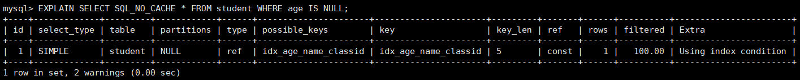
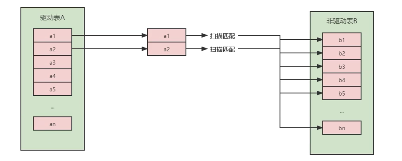

# 1. 数据准备
> 学员表 插 50万 条， 班级表 插 1万 条。

## 步骤1：建表

```sql
 create database atguigudb2;
 ​
 #班级表
 CREATE TABLE `class` (
 `id` INT(11) NOT NULL AUTO_INCREMENT,
 `className` VARCHAR(30) DEFAULT NULL,
 `address` VARCHAR(40) DEFAULT NULL,
 `monitor` INT NULL ,
 PRIMARY KEY (`id`)
 ) ENGINE=INNODB AUTO_INCREMENT=1 DEFAULT CHARSET=utf8;
 ​
 #学员表
 CREATE TABLE `student` (
 `id` INT(11) NOT NULL AUTO_INCREMENT,
 `stuno` INT NOT NULL ,
 `name` VARCHAR(20) DEFAULT NULL,
 `age` INT(3) DEFAULT NULL,
 `classId` INT(11) DEFAULT NULL,
 PRIMARY KEY (`id`)
 #CONSTRAINT `fk_class_id` FOREIGN KEY (`classId`) REFERENCES `t_class` (`id`)
 ) ENGINE=INNODB AUTO_INCREMENT=1 DEFAULT CHARSET=utf8;
```

## 步骤2：设置参数

命令开启：允许创建函数设置：

```sql
 set global log_bin_trust_function_creators=1;   
 # 不加global只是当前窗口有效。
```
## 步骤3：创建函数
保证每条数据都不同。

```sql
 #随机产生字符串
 DELIMITER //
 CREATE FUNCTION rand_string(n INT) RETURNS VARCHAR(255)
 BEGIN  
 DECLARE chars_str VARCHAR(100) DEFAULT
 'abcdefghijklmnopqrstuvwxyzABCDEFJHIJKLMNOPQRSTUVWXYZ';
 DECLARE return_str VARCHAR(255) DEFAULT '';
 DECLARE i INT DEFAULT 0;
 WHILE i < n DO 
 SET return_str =CONCAT(return_str,SUBSTRING(chars_str,FLOOR(1+RAND()*52),1)); 
 SET i = i + 1;
 END WHILE;
 RETURN return_str;
 END //
 DELIMITER ;
 ​
 #假如要删除
 #drop function rand_string;
```

随机产生班级编号

```sql
 #用于随机产生多少到多少的编号
 DELIMITER //
 CREATE FUNCTION rand_num(from_num INT ,to_num INT) RETURNS INT(11)
 BEGIN 
 DECLARE i INT DEFAULT 0; 
 SET i = FLOOR(from_num +RAND()*(to_num - from_num+1))  ;
 RETURN i; 
 END //
 DELIMITER ;
 ​
 #假如要删除
 #drop function rand_num;
```

## 步骤4：创建存储过程

```sql
 #创建往stu表中插入数据的存储过程
 DELIMITER //
 CREATE PROCEDURE insert_stu(START INT , max_num INT )
 BEGIN 
     DECLARE i INT DEFAULT 0; 
     SET autocommit = 0;   #设置手动提交事务
     REPEAT  #循环
     SET i = i + 1;  #赋值
     INSERT INTO student (stuno, name ,age ,classId ) VALUES
     ((START+i),rand_string(6),rand_num(1,50),rand_num(1,1000)); 
     UNTIL i = max_num 
     END REPEAT; 
     COMMIT;  #提交事务
 END //
 DELIMITER ;
 ​
 #假如要删除
 #drop PROCEDURE insert_stu;
```

创建往class表中插入数据的存储过程

```sql 
 #执行存储过程，往class表添加随机数据
 DELIMITER //
 CREATE PROCEDURE insert_class( max_num INT )
 BEGIN 
     DECLARE i INT DEFAULT 0; 
     SET autocommit = 0;  
     REPEAT 
     SET i = i + 1; 
     INSERT INTO class ( classname,address,monitor ) VALUES
     (rand_string(8),rand_string(10),rand_num(1,100000)); 
     UNTIL i = max_num 
     END REPEAT; 
     COMMIT;
 END //
 DELIMITER ;
 ​
 #假如要删除
 #drop PROCEDURE insert_class;
```

## 步骤5：调用存储过程 class

```sql
 #执行存储过程，往class表添加1万条数据 
 CALL insert_class(10000);

 #执行存储过程，往stu表添加50万条数据 
 CALL insert_stu(100000,500000);
```

## 步骤6：删除某表上的索引 
```sql
DELIMITER //
CREATE  PROCEDURE proc_drop_index(dbname VARCHAR(200),tablename VARCHAR(200))
BEGIN
   DECLARE done INT DEFAULT 0;
   DECLARE ct INT DEFAULT 0;
   DECLARE _index VARCHAR(200) DEFAULT '';
   DECLARE _cur CURSOR FOR  SELECT  index_name  FROM
information_schema.STATISTICS  WHERE table_schema=dbname AND table_name=tablename AND
seq_in_index=1 AND  index_name <>'PRIMARY' ;
#每个游标必须使用不同的declare continue handler for not found set done=1来控制游标的结束
   DECLARE  CONTINUE HANDLER FOR NOT FOUND set done=2 ;   
#若没有数据返回,程序继续,并将变量done设为2
    OPEN _cur;
    FETCH _cur INTO _index;
    WHILE _index<>'' DO
       SET @str = CONCAT("drop index " , _index , " on " , tablename );
       PREPARE sql_str FROM @str ;
       EXECUTE sql_str;
       DEALLOCATE PREPARE sql_str;
       SET _index='';
       FETCH _cur INTO _index;
    END WHILE;
 CLOSE _cur;
END //
DELIMITER ;
```

执行存储过程

```sql
CALL proc_drop_index("dbname", "tablename");
```

# 2. 索引失效案例
MySQL中提高性能的一个最有效的方式是对数据表设计合理的索引。索引提供了访问高效数据的方法，并且加快查询的速度，因此索引对查询的速度有着至关重要的影响。

- 使用索引可以快速地定位表中的某条记录，从而提高数据库查询的速度，提高数据库的性能。

- 如果查询时没有使用索引，查询语句就会扫描表中的所有记录。在数据量大的情况下，这样查询的速度会很慢。

大多数情况下都（默认）采用B+树来构建索引。只是空间列类型的索引使用R-树，并且MEMORY表还支持hash索引。

其实，用不用索引，最终都是优化器说了算。优化器是基于什么的优化器？基于 cost 开销(CostBaseOptimizer)，它不是基于规则(Rule-BasedOptimizer)，也不是基于语义。怎么样开销小就怎么来。另外，SQL语句是否使用索引，跟数据库版本、数据量、数据选择度都有关系。

## 2.1 全值匹配我最爱
系统中经常出现的sql语句如下:

```sql
EXPLAIN SELECT SQL_NO_CACHE * FROM student WHERE age=38;
EXPLAIN SELECT SQL_NO_CACHE * FROM student WHERE age=30 and classId=4;
EXPLAIN SELECT SQL_NO_CACHE * FROM student WHERE age=30 and classId=4 AND name = 'abcd';
```

建立索引前执行:(关注执行时间)

```shell
mysq1> SELECT SQL_NO_CACHE * FROM student WHERE age=30 and classId=4 AND name = 'abcd ' ;
Empty set, 1 warning ( e.28 sec)
```

建立索引

```sql
CREATE INDEX idx_age oN student(age) ;
CREATE INDEX idx_age_classid ON student(age , classId);
CREATE INDEX idx_age_classid_name ON student(age, classId, name) ;
```

建立索引后执行:

```shell
mysql> SELECT SQL_NO_CACHE * FROM student WHERE age=30 and classId=4 AND name = 'abed ' ;
Empty set,1 warning (0.e1 sec)
```

> 可以看到，创建索引前的查询时间是0 .28秒，创建索引后的查询时间是0.01秒，索引帮助我们极大的提高了查询效率。

## 2.2 最佳左前缀法则
在MySQL建立联合索引时会遵守 最佳左前缀匹配原则，即最左优先，在检索数据时从联合索引的最左边开始匹配。

举例1:

```sql
EXPLAIN SELECT SQL_NO_CACHE * FROM student WHERE student.age=38 AND student.name = 'abcd';
```

举例2:

```sql
EXPLAIN SELECT SQL_NO_CACHE * FROM student WHERE student.classid=1 AND student.name = 'abed'; 
```

举例3：索引idx_age_classid_name还能否正常使用?

```sql
EXPLAIN SELECT SQL_NO_CACHE * FROM student WHERE classid=4 AND student.age=30 AND student.name='abcd';
```

如果索引了多列，要遵守最左前缀法则。指的是查询从索引的最左前列开始并且不跳过索引中的列。

```shell
mysql> EXPLAIN SELECT SQL_NO_CACHE * FROM student WHERE student.age=30 AND student.name ='abcd';
```

> 结论：MySQL可以为多个字段创建索引，一个索引可以包括16个字段。对于多列索引，过滤条件要使用索引必须按照索引建立时的顺序，依次满足，一旦跳过某个字段，索引后面的字段都无法被使用。如果查询条件中没有使用这些字段中第1个字段时，多列（或联合）索引不会被使用。

## 2.3 主键插入顺序
对于一个使用InnoDB存储引擎的表来说，在我们没有显示的创建索引时，表中的数据实际上都是存储在聚簇索引的叶子节点的。而记录又存储在数据页中的，数据页和记录又是按照记录主键值从小到大的顺序进行排序，所以如果我们插入的记录的主键值是依次增大的话，那我们每插满一个数据页就换到下一个数据页继续插，而如果我们插入的主键值忽小忽大的话，就比较麻烦了，可能会造成页面分裂和记录移位。

假设某个数据页存储的记录已经满了，它存储的主键值在 1~100 之间：


如果此时再插入一条主键值为 9 的记录，那它插入的位置就如下图：


可这个数据页已经满了，再插进来咋办呢？我们需要把当前 页面分裂 成两个页面，把本页中的一些记录移动到新创建的这个页中。页面分裂和记录移位意味着什么？意味着： 性能损耗 ！所以如果我们想尽量避免这样无谓的性能损耗，最好让插入的记录的 主键值依次递增 ，这样就不会发生这样的性能损耗了。 所以我们建议：让主键具有 AUTO_INCREMENT ，让存储引擎自己为表生成主键，而不是我们手动插入 ，比如： person_info 表：

```sql
CREATE TABLE person_info(
	 id INT UNSIGNED NOT NULL AUTO_INCREMENT,
	 name VARCHAR(100) NOT NULL,
	 birthday DATE NOT NULL,
	 phone_number CHAR(11) NOT NULL,
	 country varchar(100) NOT NULL,
	  PRIMARY KEY (id),
	  KEY idx_name_birthday_phone_number (name(10), birthday, phone_number)
);  
```

> 我们自定义的主键列 id 拥有 AUTO_INCREMENT 属性，在插入记录时存储引擎会自动为我们填入自增的主键值。这样的主键占用空间小，顺序写入，减少页分裂。

## 2.4 计算、函数、类型转换(自动或手动)导致索引失效
### 舉例一
student 表的字段 stuno 上设置有索引

```sql
CREATE INDEX idx_sno ON student(stuno);
```

##### 第一种，索引失效
```sql
EXPLAIN SELECT SQL_NO_CACHE id,stuno,name FROM student WHERE stuno+1 = 900001; -- 索引失效
```
 


> 你能看到如果对索引进行了表达式计算，索引就失效了。这是因为我们需要把索引字段的取值都取出来，然后依次进行表达式的计算来进行条件判断，因此采用的就是全表扫描的方式，运行时间也会慢很多

##### 第二种，索引优化生效

```sql
EXPLAIN SELECT SQL_NO_CACHE id,stuno,name FROM student WHERE stuno = 900000;
```


### 舉例二
创建索引

```sql
CREATE INDEX idx_name ON student(NAME);
```

##### 第一种：索引优化生效
```sql
EXPLAIN SELECT SQL_NO_CACHE * FROM student WHERE student.name LIKE 'abc%';
```


##### 第二种：索引优化失效
```sql
EXPLAIN SELECT SQL_NO_CACHE * FROM student WHERE LEFT(student.name,3) = 'abc';
```


## 2.5 类型转换导致索引失效
下列哪个sql语句可以用到索引。（假设name字段上设置有索引）

##### 未使用到索引
```sql
EXPLAIN SELECT SQL_NO_CACHE * FROM student WHERE name=123;
```


> `name=123` 发生类型转换，索引失效。

##### 使用到索引
```sql
EXPLAIN SELECT SQL_NO_CACHE * FROM student WHERE name='123';
```


## 2.6 范围条件右边的列索引失效

### 1）如果系统经常出现的sql如下:
```sql
ALTER TABLE student DROP INDEX idx_name;
ALTER TABLE student DROP INDEX idx_age;
ALTER TABLE student DROP INDEX idx_age_classid;

EXPLAIN SELECT SQL_NO_CACHE * FROM student WHERE student.age=30 AND student.classId > 20 AND student.name = 'abc';
```

> `student.classId > 20` 的右侧的 `student.name = 'abc'` 的索引就会失效

### 2）那么索引 idx_age_classid_name 这个索引还能正常使用么?

不能，范围右边的列不能使用。比如:(<)(=)(>)(>=)和 between 等

如果这种sql出现较多，应该建立:

```sql
create index idx_age_name_classid on student(age,name,classid);
```

将范围查询条件放置语句最后：

```sql
EXPLAIN SELECT SQL_NO_CACHE * FROM student WHERE student.age=30 AND student.name = 'abc' AND student.classId > 20 ;
```

> 应用开发中范围查询，例如：金额查询，日期查询往往都是范围查询。应将查询条件放置where语句最后。（创建的联合索引中，务必把范围涉及到的字段写在最后）

## 2.7 不等于(!= 或者<>)索引失效
> 理解：一般情况下， 条件 !=、<> 得到的数据太多了，导致回表的次数太多，成本太高，总的成本可能超过全表扫描，因为查询优化器会选择成本较低的查询顺序，即执行全表扫描；

为name字段创建索引

```sql
CREATE INDEX idx_name ON student(NAME);
```

查看索引是否失效

```sql
explain select * from student where name <> 'abc';
```


> 当sql语句中有!=或者<>会出现索引失效的问题，尝试改写为等于，或采用覆盖索引

## 2.8 is null可以使用索引，is not null无法使用索引
> 理解：一般情况下， 条件 **is not null** 得到的数据太多了，导致回表的次数太多，成本太高，总的成本可能超过全表扫描，因为查询优化器会选择成本较低的查询顺序，即执行全表扫描

```sql
EXPLAIN SELECT SQL_NO_CACHE * FROM student WHERE age IS NULL;
```



```sql
EXPLAIN SELECT SQL_NO_CACHE * FROM student WHERE age IS NOT NULL;
```


结论：最好在设计数据表的时候就将字段设置为 NOT NULL 约束，比如你可以将INT类型的字段，默认值设置为0。将字符类型的默认值设置为空字符串('')

拓展：同理，在查询中使用 not like 也无法使用索引，导致全表扫描

## 2.9 like以通配符%开头索引失效
##### 1)索引有效
```sql
EXPLAIN SELECT SQL_NO_CACHE * FROM student WHERE NAME LIKE 'ab%';
```


##### 2）索引失效
```sql
EXPLAIN SELECT SQL_No_CACHE * FROM student WHERE NAME LIKE '%ab%';
```


## 2.10 OR 前后存在非索引的列，索引失效 
```sql
-- 未使用到索引（此时的age字段有索引，classid没有索引）
EXPLAIN SELECT SQL_NO_CACHE * FROM student WHERE age = 10 OR classid = 100;
```


```sql
-- 使用到索引（此时的age、classid字段都有索引）
EXPLAIN SELECT SQL_NO_CACHE * FROM student WHERE age = 10 OR name = 'Abel';
```


> 因为age字段和name字段上都有索引，所以查询中使用了索引。你能看到这里使用到了 index_merge，简单来说index_merge就是对age和name分别进行了扫描，然后将这两个结果集进行了合并。这样做的好处就是 避免了全表扫描。

在WHERE子句中，如果在OR前的条件列进行了索引，而在OR后的条件列没有进行索引，那么索引会失效。也就是说，OR前后的两个条件中的列都是索引时，查询中才使用索引。

## 2.11 数据库和表的字符集统一使用utf8mb4
> 统一使用utf8mb4( 5.5.3版本以上支持)兼容性更好，统一字符集可以避免由于字符集转换产生的乱码。不同的字符集进行比较前需要进行转换会造成索引失效。

# 3. 关联查询优化
## 3.1数据准备
```sql
-- 分类
CREATE TABLE IF NOT EXISTS `type` (
`id` INT(10) UNSIGNED NOT NULL AUTO_INCREMENT,
`card` INT(10) UNSIGNED NOT NULL,
PRIMARY KEY (`id`)
);

-- 图书
CREATE TABLE IF NOT EXISTS `book` (
`bookid` INT(10) UNSIGNED NOT NULL AUTO_INCREMENT,
`card` INT(10) UNSIGNED NOT NULL,
PRIMARY KEY (`bookid`)
);
```

##### 向分类表中添加20条记录
```sql
INSERT INTO atguigudb2.type(card) VALUES(FLOOR(1 + (RAND() * 20)));
```

##### 向图书表中添加20条记录
```sql
INSERT INTO book(card) VALUES(FLOOR(1 + (RAND() * 20)));
```

## 3.2 采用左外连接
### 重點觀念：`LEFT JOIN` 特性
- 左表 `type` 的每一列都要出現在結果中。
- **右表 `book` 的資料是否有對應項目，要看條件是否能找到匹配。**
- 所以實際查資料時，**右表是否有效率關鍵取決於是否有建立索引**，以避免對整張表進行全表掃描。

---

### 🔍 使用 EXPLAIN 分析查詢執行計畫

#### 🧪 初始情況（沒有索引）
```sql
EXPLAIN SELECT SQL_NO_CACHE * 
FROM type 
LEFT JOIN book ON type.card = book.card;
```

結果顯示：
- `type` 的 `type` 欄位：`ALL`（表示全表掃描）
- `book` 的 `type` 欄位：也是 `ALL`（也全表掃描）

---

### ✅ 優化方式一：給【被驅動表】book.card 建立索引

```sql
ALTER TABLE book ADD INDEX Y (card);
```

#### 🧪 再次執行 EXPLAIN
```sql
EXPLAIN SELECT SQL_NO_CACHE * 
FROM type 
LEFT JOIN book ON type.card = book.card;
```

現在會看到：
- `type` 還是 `ALL`（沒變）
- **`book` 變成 `ref`，表示使用了索引 `Y(card)` 來查找匹配行**
- `rows` 減少，效率大幅提升 ✅

#### 📌 結論：
- 在 `LEFT JOIN` 查詢中，「右表」是查詢的重點，**給右表加上 JOIN 條件的索引能大幅提升效率！**

---

### 🚫 錯誤方式：給【驅動表】type.card 建立索引

```sql
ALTER TABLE type ADD INDEX X (card);
```

#### 🧪 再次執行 EXPLAIN
```sql
EXPLAIN SELECT SQL_NO_CACHE * 
FROM type 
LEFT JOIN book ON type.card = book.card;
```

結果會發現：
- `type`（左表）還是使用 `ALL`（因為要掃描全部）
- `book` 使用了索引 `ref`

#### 📌 結論：
- **左表無法透過索引限制查詢資料，因為是主表**
- **即使左表加了索引，MySQL 也無法避開對左表的全表掃描**

---

### 🚫 還原：移除右表的索引

```sql
DROP INDEX Y ON book;
```

再執行 `EXPLAIN`：
- `book` 又回到 `ALL`（全表掃描）
- 查詢性能下降

---

### 🎯 小結：LEFT JOIN 與索引最佳化策略

| 表角色   | 是否應加索引 | 原因說明                     |
|--------|-------------|-----------------------------|
| 左表（驅動表） | 不一定有效    | 需要全表掃描才能進行連接               |
| 右表（被驅動表） | ✅ 應加索引    | 根據 `ON` 條件查詢右表時能用索引加速匹配 |

---

## 3.3 采用内连接
### ✅ 一、什麼是「驅動表」與「被驅動表」？

當你執行以下查詢：

```sql
SELECT * 
FROM A 
INNER JOIN B ON A.id = B.a_id;
```

- MySQL 查詢優化器會選擇其中一張表作為「驅動表」（Driving Table），通常是 **較小的表**。
- 然後對每一筆驅動表的記錄，去「被驅動表」（Driven Table）中根據 JOIN 條件找符合的資料。

舉例：
- 若 A 有 100 筆，B 有 10,000 筆，A 是驅動表會比 B 是驅動表效率更好（小表驅動大表）。

---

### ✅ 二、MySQL 如何選擇驅動表？

#### 1. 只有一邊有索引
```sql
type.card = book.card
```

- 若 **只有 `book.card` 有索引**，MySQL 傾向於選擇 `type` 為驅動表，`book` 為被驅動表。

因為：
- 可以利用 `book.card` 上的索引查找匹配值，效率較高。

---

#### 2. 兩邊都有索引
```sql
ALTER TABLE type ADD INDEX X(card);
ALTER TABLE book ADD INDEX Y(card);
```

- 此時，MySQL 會選擇「小表為驅動表」以減少匹配次數。

---

### ✅ 三、實作與範例
#### 1. 查詢前先移除索引

```sql
DROP INDEX IF EXISTS X ON type;
DROP INDEX IF EXISTS Y ON book;

EXPLAIN SELECT SQL_NO_CACHE * 
FROM type 
INNER JOIN book ON type.card = book.card;
```

🔎 結果：
- `type` 和 `book` 可能都會使用 `ALL`（全表掃描），效率差。

---

#### 2. 加索引：只給 book.card 建索引

```sql
ALTER TABLE book ADD INDEX Y(card);

EXPLAIN SELECT SQL_NO_CACHE * 
FROM type 
INNER JOIN book ON type.card = book.card;
```

🔎 結果：
- `type` 是 `ALL`
- `book` 是 `ref`（使用索引）
- ✅ `type` 成為驅動表，`book` 被驅動、透過索引查找，效率大幅提升。

---

#### 3. 兩邊都加索引

```sql
ALTER TABLE type ADD INDEX X(card);

EXPLAIN SELECT SQL_NO_CACHE * 
FROM type 
INNER JOIN book ON type.card = book.card;
```

🔎 結果：
- `ref` / `ref`，MySQL 可能會根據表大小選擇小表為驅動表。
- 如果 `type` 比 `book` 小，MySQL 還是會選擇 `type` 為驅動表。

---

#### 6. 移除 type 索引觀察變化

```sql
DROP INDEX X ON type;

EXPLAIN SELECT SQL_NO_CACHE * 
FROM type 
INNER JOIN book ON type.card = book.card;
```

🔎 結果：
- `type` 又會變回 `ALL`
- `book` 還是 `ref`
- 顯示有索引的一方會被作為 **被驅動表**（用索引來查找）

---

### ✅ 四、總結重點

| 情況 | MySQL 的驅動選擇邏輯 |
|------|------------------------|
| 只有一邊有索引 | 沒有索引的一方會被選為「驅動表」，有索引的表成為「被驅動表」 |
| 兩邊都有索引 | 小表會被選為驅動表，避免多次查詢大型表 |
| 都沒索引 | 兩表都 `ALL` 掃描，效率最差 |

#### ✅ 效能建議：
- **永遠確保 JOIN 條件中的欄位有索引**。
- **優先為大表的 JOIN 條件欄位加索引**，避免對大表全表掃描。

---

## 3.4 join语句原理
### 3.4.1 概述
#### ✅ 1. JOIN 語句的本質是什麼？

JOIN 本質上是「**兩張表之間進行資料的比對**」，符合 `ON` 條件的資料就會被組合起來。

以 `INNER JOIN` 為例，下面這句話：

```sql
SELECT * FROM A INNER JOIN B ON A.id = B.a_id;
```

意思是：
- 對 A 表中的每一筆資料
- 去 B 表中找出 `B.a_id = A.id` 的所有資料
- 把符合的組合起來成為一筆輸出

這就像是兩個「巢狀 for 迴圈」一樣。

---

#### ✅ 2. MySQL 如何實作 JOIN（Nested Loop Join）

在 MySQL 5.5 以前版本（或當無法使用其他策略時），**JOIN 是用最原始的「嵌套迴圈演算法」來做的：**

##### 🧠 Nested Loop Join (NLJ) 執行邏輯：
```plaintext
FOR 每一筆 A 表資料:
    FOR 每一筆 B 表資料:
        IF A.id = B.a_id THEN
            輸出組合資料
```

##### 缺點：
如果 A 表有 1000 筆、B 表有 1000 筆，那總共要比對 **1,000 × 1,000 = 1,000,000 次**，非常慢。

---

#### ✅ 3. BNLJ：Block Nested Loop Join（MySQL 5.5+ 優化）

為了改善效率，MySQL 在 5.5 引入了 BNLJ：

- 將「驅動表」（外層那個迴圈）一次讀出一批資料（例如 100 筆）進記憶體
- 然後針對這 100 筆，去掃描「被驅動表」（內層迴圈）一次
- 每一批比對完畢後，繼續載入下一批

##### 🎯 BNLJ 的優點：
- 減少對被驅動表的讀取次數（不會每筆外層都去掃一遍內層）
- 相對更快，尤其在 **右表無法用索引時**

---

#### ✅ 4. 實際範例理解：Nested Loop 與 BNLJ

##### 建立兩張測試表：

```sql
CREATE TABLE customer (
  id INT PRIMARY KEY,
  name VARCHAR(50)
);

CREATE TABLE orders (
  id INT PRIMARY KEY,
  customer_id INT,
  product VARCHAR(50)
);
```

插入測試資料：

```sql
INSERT INTO customer VALUES (1, 'Alice'), (2, 'Bob'), (3, 'Charlie');

INSERT INTO orders VALUES 
(101, 1, 'Book'), 
(102, 2, 'Pen'), 
(103, 1, 'Notebook'), 
(104, 3, 'Eraser');
```

---

##### 查詢語句：

```sql
SELECT * 
FROM customer 
JOIN orders 
ON customer.id = orders.customer_id;
```

🔍 執行計畫 `EXPLAIN` 顯示：
- 如果 `orders.customer_id` 沒有索引，MySQL 會使用 BNL（Block Nested Loop）
- 如果你有加索引（如下），那就會用索引直接查找，效率更高

```sql
ALTER TABLE orders ADD INDEX idx_customer (customer_id);
```

---

### 3.4.2 Simple Nested-Loop Join（索引嵌套循环连接）
> 算法相当简单，从表A中取出一条数据1，遍历表B，将匹配到的数据放到result..以此类推，驱动表A中的每一条记录与被驱动表B的记录进行判断:



可以看到这种方式效率是非常低的，以上述表A数据100条，表,B数据1000条计算，则A*B= 10万次。开销统计如下:


当然mysql肯定不会这么粗暴的去进行表的连接，所以就出现了后面的两种对Nested-Loop Join优化算法。

### 3.4.3 Index Nested-Loop Join（索引嵌套循环连接）
> Index Nested-Loop Join其优化的思路主要是为了减少内层表数据的匹配次数，所以要求被驱动表上必须有索引才行。通过外层表匹配条件直接与内层表索引进行匹配，避免和内层表的每条记录去进行比较，这样极大的减少了对内层表的匹配次数。


驱动表中的每条记录通过被驱动表的索引进行访问，因为索引查询的成本是比较固定的，故mysql优化器都倾向于使用记录数少的表作为驱动表 (外表)。


如果被驱动表加索引，效率是非常高的，但如果索引不是主键索引，所以还得进行一次回表查询。相比，被驱动表的索引是主键索引，效率会更高。

我们来看一下这个语句：

```sql
EXPLAIN SELECT * FROM t1 STRAIGHT_JOIN t2 ON (t1.a=t2.a);
```

如果直接使用join语句，MySQL优化器可能会选择表t1或t2作为驱动表，这样会影响我们分析SQL语句的执行过程。所以，为了便于分析执行过程中的性能问题，我改用 **straight_join** 让MySQL使用固定的连接方式执行查询，这样优化器只会按照我们指定的方式去 join。在这个语句里，t1 是驱动表，t2是被驱动表。


可以看到，在这条语句里，被驱动表t2的字段a上有索引，join过程用上了这个索引，因此这个语句的执行流程是这样的：

1. 从表t1中读入一行数据 R；

2. 从数据行R中，取出a字段到表t2里去查找；

3. 取出表t2中满足条件的行，跟R组成一行，作为结果集的一部分；

4. 重复执行步骤1到3，直到表t1的末尾循环结束。 这个过程是先遍历表t1，然后根据从表t1中取出的每行数据中的a值，去表t2中查找满足条件的记录。在形式上，这个过程就跟我们写程序时的嵌套查询类似，并且可以用上被驱动表的索引，所以我们称之为“Index Nested-Loop Join”，简称NLJ。

它对应的流程图如下所示：


### 3.4.4 Block Nested-Loop Join（块嵌套循环连接）
> 如果存在索引，那么会使用index的方式进行join，如果join的列没有索引，被驱动表要扫描的次数太多了。每次访问被驱动表，其表中的记录都会被加载到内存中，然后再从驱动表中取一条与其匹配，匹配结束后清除内存，然后再从驱动表中加载一条记录，然后把被驱动表的记录再加载到内存匹配，这样周而复始，大大增加了 I/O 的次数。为了减少被驱动表的 I/O 次数，就出现了Block Nested-Loop Join 的方式。

不再是逐条获取驱动表的数据，而是一块一块的获取，引入了join buffer缓冲区，将驱动表join相关的部分数据列（大小受join buffer的限制）缓存到join buffer中，然后全表扫描被驱动表，被驱动表的每一条记录一次性和join buffer中的所有驱动表记录进行匹配（内存中操作），将简单嵌套循环中的多次比较合并成一次，降低了被驱动表的访问频率。

> **注意:**
> - 这里缓存的不只是关联表的列,select后面的列也会缓存起来。
> - 在一个有 N 个 join 关联的sql中会分配 `N-1` 个join buffer。所以查询的时候尽量减少不必要的字段，可以让join buffer中可以存放更多的列，所以尽量避免 `select * ....` 的写法


##### 参数设置:

- block_nested_loop
  - 通过 `show variables like '%optimizer_switch%’` 查看 block_nested_loop状态。默认是开启的。

- join_buffer_size
  - 驱动表能不能一次加载完，要看join buffer能不能存储所有的数据，默认情况下 join_buffer_size=256k。

> join_buffer_size的最大值在32位系统可以申请4G，而在64位操做系统下可以申请大于4G的Join Buffer空间(64位Windows除外，其大值会被截断为4GB并发出警告)。

### 3.4.5 Hash Join
#### ✅ 一、什麼是 Hash Join？

**Hash Join 是基於等值連接（等號）的一種高效查詢方法。**

核心原理：

1. **選擇小表**，用 JOIN 條件欄位（key）構建 **哈希表（Hash Table）** 放在記憶體中。
2. 然後 **掃描大表**，根據其 key 去查這個 Hash Table，看是否有對應資料。
3. 找到的就輸出 JOIN 結果。

---

#### ✅ 二、MySQL 支援 Hash Join 的版本與限制

| 項目             | 說明 |
|------------------|------|
| 開始支援版本     | 8.0.18（手動啟用） |
| 預設啟用版本     | 8.0.20（之後預設啟用） |
| 取代 BNLJ 的角色 | ✅ |
| 是否支持非等值條件（如 `<`, `>`）| ❌ 只能用於 **等值連接**（例如 `ON a.id = b.id`） |
| 是否需索引支援   | ❌ 無需依賴索引也能效率良好 |
| 適用場景         | 大表 join、大數據分析、無索引場景、內存足夠的情況 |

---

#### ✅ 三、Hash Join 與 Nested Loop Join 差異

| 項目                     | Nested Loop Join             | Hash Join                          |
|--------------------------|------------------------------|-------------------------------------|
| 內部機制                 | 外層每筆比對內層全部          | 小表建 Hash，大表查表              |
| 是否依賴索引             | 是                           | 否                                  |
| 適合小表還是大表         | 小表                          | 大表（尤其無索引）                  |
| 是否能做非等值條件       | 可以                          | 只能做等值條件                      |
| 是否需要內存支持         | 相對低                        | ✅ 若無法全部放進內存需磁碟輔助        |

---

#### ✅ 四、實際範例演示：Hash Join

##### 👨‍🔧 建立測試資料表：

```sql
CREATE TABLE customer (
  id INT PRIMARY KEY,
  name VARCHAR(50)
);

CREATE TABLE orders (
  id INT PRIMARY KEY,
  customer_id INT,
  product VARCHAR(100)
);
```

##### 🧪 插入測試資料

```sql
INSERT INTO customer VALUES (1, 'Alice'), (2, 'Bob'), (3, 'Charlie');

INSERT INTO orders VALUES
(101, 1, 'Book'),
(102, 1, 'Pen'),
(103, 2, 'Notebook'),
(104, 4, 'Eraser');
```

---

##### ✅ 查詢語句（等值 JOIN）

```sql
EXPLAIN FORMAT=JSON
SELECT * 
FROM customer 
JOIN orders 
ON customer.id = orders.customer_id;
```

🔍 若你使用的是 **MySQL 8.0.20+**，且表無索引，`EXPLAIN` 的 JSON 輸出中會顯示：

```json
"join_type": "hash"
```

或

```json
"nested_loop": [
  {
    "table": {
      "access_type": "hash join",
      ...
    }
  }
]
```

就代表正在使用 **Hash Join**。

---

#### ✅ 五、模擬大型資料的 Hash Join 優勢

想像下面這種情況：

```sql
-- 大型 orders 表
SELECT c.name, COUNT(o.id)
FROM customer c
JOIN orders o ON c.id = o.customer_id
GROUP BY c.name;
```

- 如果 `orders` 有幾百萬筆，沒有索引，那麼：
  - Nested Loop Join 效能會極差（掃描乘積）。
  - Hash Join 能將 `customer`（小表）建成 Hash Table，然後快速比對 `orders` 中每筆的 `customer_id`。
  - 效能極大提升，尤其在大資料分析中是很重要的。

---

#### ✅ 六、小結與建議

| 結論 | 建議 |
|------|------|
| Hash Join 非常適合處理大表 JOIN 尤其是無索引時 | ✅ 若你在做資料倉儲、大數據 JOIN，務必升級至 8.0.20+ 使用 Hash Join |
| Hash Join 只能用於「等值條件」 | ❗非等值 JOIN 請改用其他策略 |
| MySQL 優化器自動選擇是否使用 Hash Join | ✅ 無需手動干預，除非你手動設置 JOIN 策略（可用 `JOIN_HINT` 指令） |
| 足夠記憶體能讓 Hash Join 表現更好 | ✅ 配置參數：`join_buffer_size`, `tmp_table_size` 可調整 |

---

# 4. 子查询优化
> MySQL从4.1版本开始支持子查询，使用子查询可以进行SELECT语句的嵌套查询，即一个SELECT查询的结果作为另一个SELECT语句的条件。子查询可以一次性完成很多 **逻辑上需要多个步骤才能完成的SQL操作** 。

子查询是 MySQL 的一项重要的功能，可以帮助我们通过一个 SQL 语句实现比较复杂的查询。但是，子查询的执行效率不高。原因：

① 执行子查询时，MySQL需要为内层查询语句的查询结果建立一个临时表，然后外层查询语句从临时表中查询记录。查询完毕后，再撤销这些临时表。这样会消耗过多的CPU和IO资源，产生大量的慢查询。

② 子查询的结果集存储的临时表，不论是内存临时表还是磁盘临时表都不会存在索引，所以查询性能会受到一定的影响。

③ 对于返回结果集比较大的子查询，其对查询性能的影响也就越大。

在MySQL中，可以使用连接（JOIN）查询来替代子查询。连接查询不需要建立临时表，其速度比子查询要快，如果查询中使用索引的话，性能就会更好。

### 举例1:查询学生表中是班长的学生信息

使用子查询

```sql
-- 创建班级表中班长的索引
CREATE INDEX idx_monitor ON class (monitor);

explain select * from student stu1
where stu1.stuno in (
  select  monitor
  from class c
  where monitor is not null
);

-- is not null 不一定导致索引失效，是is not null 的数据太多了回表的次数太多，数据量太大，成本太高的情况，查询优化器会强制执行全表扫描
```
 

推荐:使用多表查询

```sql
explain select stu1.* from student stu1 
join class c on stu1.stuno = c.monitor
where c.monitor is not null;
```

### 举例2:取所有不为班长的同学

不推荐

```sql
explain select SQL.NO.CACHE a.*
from student a
where a.stuno NOT IN (
	SELECT monitor 
  from class b
  where monitor IS NOT NULL
)
```

推荐

```sql
explain select SQL_NO_CACHE a.*
from student a left outer join class b
on a.stuno = b.monitor
where b.monitor is null;
```

> 结论：尽量不要使用 NOT IN 或者 NOT EXISTS，用 `LEFT JOIN xxx ON xx WHERE xx IS NULL` 替代

# 5. 排序优化
## 5.1 排序优化
问题：在 WHERE 条件字段上加索引，但是为什么在 ORDER BY 字段上还要加索引呢？

回答:

在MySQL中，支持两种排序方式，分别是 FileSort 和 Index 排序。

Index 排序中，索引可以保证数据的有序性，不需要再进行排序，效率更高。

FileSort 排序则一般在 内存中 进行排序，占用CPU 较多 。如果待排结果较大，会产生临时文件I/O到磁盘进行排序的情况，效率较低。

优化建议：

SQL 中，可以在 WHERE 子句和 ORDER BY 子句中使用索引，目的是在 WHERE 子句中 避免全表扫描，在 ORDER BY 子句避免使用 File Sort 排序。当然，某些情况下全表扫描，或者 File Sort 排序不一定比索引慢。但总的来说，我们还是要避免，以提高查询效率。

尽量使用 Index 完成 ORDER BY 排序。如果 WHERE 和 ORDER BY 后面是相同的列就使用单索引列；如果不同就使用联合索引。

无法使用 Index 时，需要对 File Sort 方式进行调优。

## 5.2 测试
删除student表和class表中已创建的非主键索引。

```sql
DROP INDEX idx_monitor ON class;
DROP INDEX idx_cid ON student;
DROP INDEX idx_age ON student;
DROP INDEX idx_name ON student;
DROP INDEX idx_age_name_classid ON student ;
DROP INDEX idx_age_classid_name ON student ;
```

以下是否能使用到索引，能否去掉 using filesort

### 过程一:不加索引

```sql
explain select SQL_NO_CACHE * FROM student ORDER BY age,classId;
```


```sql
explain select SQL_NO_CACHE * FROM student ORDER BY age,classId limit 10;
```


### 过程二：加索引 order by时不limit，索引失效

```sql
-- 创建索引
create index idx_age_classId_name on student(age,classId,name);
-- 不限制，索引失效

explain select SQL_NO_CACHE * FROM student ORDER BY age,classId;
```


```sql
-- 覆盖索引

-- EXPLAIN SELECT SQL_NO_CACHE age, classid PROM student ORDER BY age,classid;
```

```sql
-- 增加limitg过滤条件，使用上索引了
explain select SQL_NO_CACHE * FROM student ORDER BY age,classId limit 10;
```


 
### 过程三：order by时顺序错误，索引失效
```sql
#创建索引age,classid,stuno
CREATE  INDEX idx_age_classid_stuno ON student (age,classid,stuno); 
```

以下哪些索引失效?

```sql
EXPLAIN  SELECT * FROM student ORDER BY classid LIMIT 10; --失效
EXPLAIN  SELECT * FROM student ORDER BY classid,NAME LIMIT 10; --失效
EXPLAIN  SELECT * FROM student ORDER BY age,classid,stuno LIMIT 10; 
EXPLAIN  SELECT * FROM student ORDER BY age,classid LIMIT 10;
EXPLAIN  SELECT * FROM student ORDER BY age LIMIT 10;
```

### 过程四：order by时规则不一致, 索引失效 （顺序错，不索引；方向反，不索引）
```sql
-- 创建索引age,classid,stuno
CREATE  INDEX idx_age_classid_stuno ON student (age,classid,stuno); 
CREATE  INDEX idx_age_classid_stuno ON student (age,classid,name); 
```

```sql
-- 索引默认为升序，但此处用了降序，方向相反了
EXPLAIN  SELECT * FROM student ORDER BY age DESC, classid ASC LIMIT 10; 
```

```sql
-- 索引的顺序错误
EXPLAIN  SELECT * FROM student ORDER BY classid DESC, NAME DESC LIMIT 10;
```

```sql
-- 索引的方向错误
EXPLAIN  SELECT * FROM student ORDER BY age ASC,classid DESC LIMIT 10;  
```

```sql
-- 能成功用上索引，age和classid先降序找到对应的主键，回表时逆序变量即可
EXPLAIN  SELECT * FROM student ORDER BY age DESC, classid DESC LIMIT 10; 
```

### 过程五：无过滤，不索引
#### ✅ 重點觀念：ORDER BY 能否用上索引的三個條件

1. **WHERE 條件與 ORDER BY 使用的欄位，順序與索引一致**
2. **ORDER BY 的欄位順序與索引欄位完全一致且方向一致（ASC/ASC 或 DESC/DESC）**
3. **不能跳過索引中的欄位順序（不符合最左前綴原則）**

---

#### 🔍 範例數據表

假設有一張表：

```sql
CREATE TABLE student (
  id INT PRIMARY KEY,
  name VARCHAR(50),
  age INT,
  classid INT
);
```

並插入一些測試資料：

```sql
INSERT INTO student VALUES 
(1, 'Alice', 20, 1),
(2, 'Bob', 25, 1),
(3, 'Charlie', 45, 2),
(4, 'David', 45, 3);
```

---

#### 🔸例子一：無排序索引支援

```sql
EXPLAIN SELECT * FROM student WHERE age = 45 ORDER BY classid;
```

- ✅ `age = 45` 可用 `age` 上的索引（假設你建了）
- ❌ 但 `ORDER BY classid` 沒有用索引（因為 `age` 與 `classid` 是不同欄位）

**結果：會出現 `Using where; Using filesort`**

也就是：篩選是透過 `age` 的索引來做，但排序得額外在記憶體或磁碟做 `filesort`，這會耗資源。

---

#### 🔸例子二：多欄排序也沒有效率

```sql
EXPLAIN SELECT * FROM student WHERE age = 45 ORDER BY classid, name;
```

- 同上：`WHERE age=45` 用了 `age` 索引
- 但 `ORDER BY classid, name` 沒有對應的複合索引，排序仍得額外執行

**仍然是 `Using where; Using filesort`**

---

#### 🔸例子三：排序的欄位剛好是 WHERE 篩選的欄位

```sql
EXPLAIN SELECT * FROM student WHERE classid = 45 ORDER BY age;
```

這裡如果沒有索引支援（classid 有但 age 沒有），就會：

- 使用 `classid = 45` 篩選時用了 `idx_cid` 索引
- 但 `ORDER BY age` 沒有對應排序索引，仍然要 filesort

**解法：新增複合索引 (classid, age)**

---

#### 🔸例子四：LIMIT + ORDER BY 的優化使用

```sql
EXPLAIN SELECT * FROM student WHERE classid = 45 ORDER BY age LIMIT 10;
```

這個查詢是很常見的：**查某班級內，依年齡排序的前 10 筆**

如果沒有索引 `(classid, age)`，就會：

- 使用 `classid = 45` 找出所有人（用 `idx_cid`）
- 然後再從中 `filesort` 得出前 10 筆

---

#### ✅ 立即優化方式：建立複合索引 `(classid, age)`

```sql
CREATE INDEX idx_class_age ON student(classid, age);
```

再執行：

```sql
EXPLAIN SELECT * FROM student WHERE classid = 45 ORDER BY age;
```

🔍 這時你會發現 `Extra` 欄位只有 `Using index condition`，**不再出現 `Using filesort`**，表示：

- 索引直接完成排序
- 查詢性能提升！

---

#### ✅ 小結：如何讓 ORDER BY 最佳化

| 查詢語句                            | 是否使用索引排序 | 需要 filesort |
|-------------------------------------|------------------|---------------|
| `WHERE age=45 ORDER BY classid`     | ❌               | ✅            |
| `WHERE age=45 ORDER BY classid, name` | ❌             | ✅            |
| `WHERE classid=45 ORDER BY age`     | ❌（若無複合索引） | ✅            |
| `WHERE classid=45 ORDER BY age LIMIT 10` | ✅（有複合索引時） | ❌         |

##### ✅ 建議索引建立方式：

```sql
CREATE INDEX idx_class_age ON student(classid, age);
```

符合這條件時，`WHERE classid=... ORDER BY age` 的查詢能走完整索引掃描（Index Range Scan），效能最優！

---

如果你願意，我可以幫你畫出這幾個查詢的「執行流程圖」，讓你更視覺化地理解 JOIN 與排序過程。需要嗎？
 
### 小结：
INDEX a_b_c(a,b,c)

##### order by 能使用索引最左前缀
- ORDER BY a
- ORDER BY a,b
- ORDER BY a,b,c
- ORDER BY a DESC,b DESC,c DESC

##### 如果WHERE使用索引的最左前缀定义为常量，则order by 能使用索引
- WHERE a = const ORDER BY b,c
- WHERE a = const AND b = const ORDER BY c
- WHERE a = const ORDER BY b,c
- WHERE a = const AND b > const ORDER BY b,c

##### 不能使用索引进行排序
- ORDER BY a ASC,b DESC,c DESC  /* 排序不一致 */
- WHERE a = const ORDER BY b,c  /*丢失a索引*/
- WHERE a = const ORDER BY c   /*丢失b索引*/
- WHERE a = const ORDER BY a,d  /*d不是索引的一部分*/
- WHERE a in (...) ORDER BY b,c /*对于排序来说，多个相等条件也是范围查询*/

## 5.3 filesort算法：双路排序和单路排序
### ✅ 一、什麼是 `filesort`？

在 MySQL 中，如果 `ORDER BY` 欄位 **無法使用索引完成排序**，就會使用一個叫做 **`filesort` 的排序演算法**，**與磁碟臨時文件搭配使用**，來完成排序邏輯。

這個名字有點誤導，它並不一定「寫檔案」，只是代表使用了「內部排序緩衝區（sort buffer）」來處理排序。

---

### ✅ 二、雙路排序（Two-Pass Filesort）

#### ✴️ 原理：
1. **第一次讀取資料**時，只讀取：
   - 排序欄位（例如 `ORDER BY age`）  
   - rowid（或 PK）

2. 將這些排序欄位和 rowid 放進 buffer 排序
3. **排序完成後，再去磁碟**，根據 rowid 重新載入完整資料
4. 然後輸出結果

#### 🧠 缺點：
- 需要 **兩次磁碟 I/O**
- 尤其排序欄位不在 index 裡面時，I/O 成本非常高

#### 📌 適用情境：
- 查詢欄位太多
- 單筆資料太大（超過 `max_length_for_sort_data`）

---

### ✅ 三、單路排序（One-Pass Filesort）

#### ✴️ 原理：
1. 一次性從磁碟把「**所有需要的資料欄位**」都讀進來
2. 在 buffer 裡直接根據 `ORDER BY` 欄位排序
3. 排好直接輸出結果

#### ✅ 優點：
- 只需一次磁碟存取，排序完成就能輸出（不需再次查磁碟）

#### ⚠️ 缺點：
- **需要更多的記憶體**（因為一次要載入所有欄位）
- 若超過 `sort_buffer_size`，就會多次寫 tmp file，反而更慢

---

### ✅ 四、範例說明（實戰）

假設有以下表：

```sql
CREATE TABLE student (
  id INT PRIMARY KEY,
  name VARCHAR(50),
  age INT,
  classid INT,
  resume TEXT
);
```

---

#### 🔍 情境一：SELECT 所有欄位 + 排序（會用雙路）

```sql
EXPLAIN SELECT * FROM student ORDER BY age;
```

因為：
- `age` 沒有索引
- `SELECT *` 會拉出 `resume`（TEXT 欄位）
- 單筆資料很大 ⇒ 超過 `max_length_for_sort_data`

👉 `filesort` 使用雙路排序（兩次 I/O）

---

#### 🔍 情境二：只查必要欄位 + 排序（可用單路）

```sql
EXPLAIN SELECT id, age FROM student ORDER BY age;
```

- 只選擇小欄位（不含 TEXT）
- 若這些欄位的總大小 < `max_length_for_sort_data`

👉 使用單路排序，只需一次 I/O，效能好！

---

### ✅ 五、排序優化技巧與參數設定

| 策略 | 說明 |
|------|------|
| ✅ 只查必要欄位 | 避免 `SELECT *`，尤其是含 BLOB/TEXT |
| ✅ 建立排序欄位的索引 | 若條件允許，建立 `ORDER BY` 欄位索引能避免 `filesort` |
| ✅ 提高 `sort_buffer_size` | 增加排序緩衝區，減少排序過程中磁碟 I/O |
| ✅ 調高 `max_length_for_sort_data` | 增加使用單路排序的可能性 |

#### ✅ 查詢參數方式：

```sql
SHOW VARIABLES LIKE 'sort_buffer_size';
SHOW VARIABLES LIKE 'max_length_for_sort_data';
```

#### ✅ 修改參數（例如 8MB）：

```sql
SET SESSION sort_buffer_size = 8388608;
SET SESSION max_length_for_sort_data = 4096;
```

---

### ✅ 小結：什麼時候用單路 / 雙路

| 條件 | 結果 |
|------|------|
| SELECT 的欄位總大小 < `max_length_for_sort_data` | 使用單路（更快） |
| SELECT 包含 TEXT / BLOB 或欄位總大小過大 | 使用雙路（慢） |
| 排序欄位有索引 | 根本不會走 `filesort` ✅ |

---

### ✅ 結語建議

排序效能優化重點在於 **避免不必要的 `filesort`**，若無法避免，就要：

- 控制查詢欄位數量
- 提高排序參數
- 規劃合理索引

# 6. GROUP BY优化
## ✅ 一、核心觀念總整理

| 最佳化點 | 說明 |
|----------|------|
| ✅ `GROUP BY` 優化類似 `ORDER BY` | 都可以透過**索引排序**避免使用 `filesort` 和 `temporary table` |
| ✅ 使用索引順序關鍵在「最左前綴原則」 | 索引欄位順序要符合 `GROUP BY` 欄位的順序 |
| ✅ `WHERE` 優於 `HAVING` | 篩選盡量在 `WHERE` 處理，`HAVING` 主要給聚合條件用 |
| ⚠️ `GROUP BY` + `ORDER BY` 同時存在時更耗效能 | 能在應用端處理排序就不要交給資料庫 |
| ⚠️ 查詢結果請盡量控制在 1000 行以內 | `GROUP BY`/`ORDER BY` 若結果太大，會耗費大量 CPU/IO |

---

## ✅ 二、範例資料準備

```sql
CREATE TABLE student (
  id INT PRIMARY KEY,
  name VARCHAR(50),
  age INT,
  classid INT
);
```

假設你要查詢每個班級的學生總數：

```sql
SELECT classid, COUNT(*) FROM student GROUP BY classid;
```

---

## ✅ 三、情境分析與最佳化範例

### ✅ [情境一] 沒有索引 → 慢

```sql
EXPLAIN SELECT classid, COUNT(*) FROM student GROUP BY classid;
```

- 如果 `classid` 沒有索引
- 會顯示：`Using temporary; Using filesort`（CPU 負載高、效能差）

### ✅ 解法：為 `classid` 建索引

```sql
CREATE INDEX idx_classid ON student(classid);

EXPLAIN SELECT classid, COUNT(*) FROM student GROUP BY classid;
```

結果變為：
- 沒有使用 `filesort`
- ✅ `Index` 可直接幫助分組和排序，提高效能

---

### ✅ [情境二] 多欄位 GROUP BY，符合最左前綴原則

```sql
CREATE INDEX idx_class_age ON student(classid, age);

-- 能用索引
SELECT classid, age, COUNT(*) 
FROM student 
GROUP BY classid, age;
```

- ✅ 因為查詢的 `GROUP BY (classid, age)` 完全符合索引的順序
- ✅ 索引幫助避免了 `Using filesort` 和 `Using temporary`

---

### ❌ [情境三] GROUP BY 欄位順序與索引不一致（失敗）

```sql
-- 索引為 (classid, age)
SELECT age, classid, COUNT(*) 
FROM student 
GROUP BY age, classid;
```

- `GROUP BY` 順序與索引不一致 ⇒ 索引無效
- 查詢會回到 `Using temporary` + `Using filesort`

📌 **GROUP BY 順序要嚴格遵守索引欄位順序（最左前綴原則）**

---

### ⚠️ [情境四] `HAVING` 取代 `WHERE`（效能差）

```sql
-- 慢的寫法
SELECT classid, COUNT(*) 
FROM student 
GROUP BY classid 
HAVING classid = 3;

-- 快的寫法
SELECT classid, COUNT(*) 
FROM student 
WHERE classid = 3 
GROUP BY classid;
```

💡 `HAVING` 是在聚合（GROUP BY）之後再篩選，會處理整個資料再比對條件，效率低。  
→ ✅ 所以能寫在 `WHERE` 的條件，一定要優先寫 `WHERE`！

---

## ✅ 四、參數調整來輔助 `GROUP BY` 效能

| 參數名稱 | 說明 |
|----------|------|
| `sort_buffer_size` | 調整排序時的內存使用（通常調整為 2~8MB） |
| `max_length_for_sort_data` | 控制是否能使用單路排序，對 GROUP BY 也有影響 |

```sql
SHOW VARIABLES LIKE 'sort_buffer_size';
SHOW VARIABLES LIKE 'max_length_for_sort_data';
```

---

## ✅ 五、小結：GROUP BY 效能優化建議

| 項目 | 建議 |
|------|------|
| ✅ 使用 `WHERE` 而非 `HAVING` 做條件篩選 |
| ✅ 使用 `GROUP BY` 時，索引欄位順序需匹配 |
| ✅ `SELECT *` 是大忌，請查必要欄位 |
| ✅ 若同時有 `GROUP BY` + `ORDER BY`，請考慮應用端排序 |
| ⚠️ 查詢結果應控制在 1000 行以內，避免過度消耗 MySQL 資源 |

---

# 7. 优化分页查询
> 一般分页查询时，通过创建覆盖索引能够比较好地提高性能。一个常见又非常头疼的问题就是`limit 2000000, 10`，此时需要MySQL排序前2000010记录，仅仅返回2000000-2000010的记录，其他记录丢弃，查询排序的代价非常大。

```sql
explain select * from student limit 2000000,10;
```

### 优化思路一
> 在索引上完成排序分页操作，最后根据主键关联回原表查询所需要的其他列内容。

```sql
EXPLAIN SELECT * FROM student t,(SELECT id FROM student ORDER BY id LIMIT 2000000,10) a
WHERE t.id = a.id;
```


### 优化思路二
> 该方案适用于主键自增的表，可以把Limit 查询转换成某个位置的查询。

```sql
EXPLAIN SELECT * FROM student WHERE id > 2000000 LIMIT 10;
```


# 8. 优先考虑覆盖索引
## 8.1 ✅ 一、什麼是覆蓋索引？

### ✅ 定義
當一個索引包含了 SQL 查詢所需的**所有欄位**（無論是在 SELECT、WHERE、ORDER BY、GROUP BY 中使用的欄位），這種情況下就稱為「**覆蓋索引**」。

MySQL 可以**直接從索引的資料結構（B+ Tree 的葉節點）中取得資料**，**不用再回到資料表查找完整資料**，這會大幅提升效能。

---

## 🔍 二、為什麼能提升效能？

因為：
- 一般查詢使用索引時，只能用來找出資料的儲存位置（row pointer），然後還得「回表」查資料。
- 覆蓋索引則**完全不需要回表**，因為資料就在索引本身，I/O 操作少很多，查詢更快。

---

## 📦 三、實際範例說明

### 🌱 建立資料表：
```sql
CREATE TABLE student (
  id INT PRIMARY KEY,
  name VARCHAR(50),
  age INT
);
```

### 🌱 建立覆蓋索引：
```sql
CREATE INDEX idx_age_name ON student(age, name);
```

---

### ✅ 範例 1：使用覆蓋索引
```sql
EXPLAIN SELECT age, name FROM student WHERE age = 18;
```

這個查詢：
- `SELECT` 欄位：`age, name`
- `WHERE` 條件：`age = 18`

👉 全部用到的欄位都包含在 `idx_age_name` 裡  
✅ 因此這是一個**覆蓋索引查詢**

---

### ❌ 範例 2：無法使用覆蓋索引（需要回表）
```sql
EXPLAIN SELECT * FROM student WHERE age = 18;
```

這個查詢：
- `SELECT *` 包含 `id`
- `idx_age_name` 沒有 `id` 欄位

👉 MySQL 需要回到原表去讀取 `id`  
❌ 因此不是覆蓋索引查詢

---

### ✅ 範例 3：LIKE 查詢與覆蓋索引
```sql
EXPLAIN SELECT id, age, name FROM student WHERE name LIKE '%abc';
```

- `name LIKE '%abc'`：這是「非前綴查詢」，即使有索引也不會用上（MySQL 無法用 B+ Tree 快速定位）
- ❌ 索引用不上，自然也不是覆蓋索引

---

## ⚖️ 四、覆蓋索引的利與弊

### ✅ 優點：
- ✅ **查詢效能快**（避免回表）
- ✅ **減少 I/O 操作**
- ✅ **幫助實現索引下推（Index Condition Pushdown）**

### ❌ 缺點：
- ❌ **佔用更多磁碟空間**（索引中儲存多個欄位）
- ❌ **維護成本高**（INSERT / UPDATE / DELETE 都要更新複合索引）
- ❌ **索引過多會拖慢寫入效能**

---

## 📌 總結重點

| 條件 | 是覆蓋索引嗎？ |
|------|----------------|
| 查詢所有欄位都在索引中 | ✅ 是 |
| 查詢欄位有一個不在索引中 | ❌ 否，需要回表 |
| 使用 `SELECT *` | 通常 ❌ 否 |
| 建立複合索引但沒按順序使用 | ❌ 否，違反最左前綴原則 |

---


## ✅ 8.2 覆盖索引的利弊

### 💡 好處 1：避免 InnoDB 二次查詢（回表）

#### 📌 什麼是「回表」？
InnoDB 的**非聚簇索引（次要索引）**的葉子節點中，**不儲存整列資料，只儲存該行的「主鍵值」**。  
所以當你用次要索引查詢某筆資料時：
1. 先在次要索引中找主鍵（第一次查詢）
2. 再回到主鍵索引（聚簇索引）找出整筆資料（第二次查詢）

這個動作就叫做「回表」。

#### ✅ 覆蓋索引的效果：
如果你查詢的欄位**都已包含在索引中**，那麼不需要回表，可以**一次查詢完成**，大幅減少 I/O。

#### 🎯 範例：

```sql
-- 建立資料表
CREATE TABLE student (
  id INT PRIMARY KEY,
  name VARCHAR(50),
  age INT,
  gender VARCHAR(10)
) ENGINE=InnoDB;

-- 建立次要索引
CREATE INDEX idx_age_name ON student(age, name);
```

```sql
-- 這個查詢是覆蓋索引，不需要回表：
EXPLAIN SELECT age, name FROM student WHERE age = 18;

-- 這個查詢就需要回表，因為 SELECT * 包含了gender，但idx中沒這欄：
EXPLAIN SELECT * FROM student WHERE age = 18;
```

---

### 💡 好處 2：從隨機 IO 變成順序 IO，提高效率

#### 📌 為什麼 IO 會更有效？
- 傳統情況下查詢資料可能要從磁碟**隨機存取不同位置的資料頁**，這是慢的。
- 但如果你用**覆蓋索引進行範圍查詢**（如 `age BETWEEN 10 AND 20`），
  那麼因為索引本身是**有序的 B+ 樹結構**，資料會被順序讀出來（順序 IO）➡️ 這樣更快。

#### 🎯 範例：

```sql
EXPLAIN SELECT age, name FROM student WHERE age BETWEEN 10 AND 20;
```

這邊 `idx_age_name` 剛好符合條件，而且只查 age 和 name，所以是「覆蓋索引 + 範圍查詢 + 順序IO」。

---

## ❌ 二、弊端說明

### 💣 弊端：索引欄位越多，維護成本越高

#### 📌 問題在哪？
- 當你建立一個**冗長的複合索引（為了實現覆蓋索引）**：
  - 每次 `INSERT`、`UPDATE`、`DELETE` 都會觸發這些索引的更新
  - 索引空間也會變大，佔用更多磁碟

#### 🎯 舉個情境：
你建了一個覆蓋索引如下：
```sql
CREATE INDEX idx_big ON orders(user_id, product_id, order_date, status, amount, payment_type, ...)
```

這個索引包含很多欄位（為了讓查詢不回表），但每次更新任一欄位，都會觸發索引重建，系統成本變高。

---

## 📌 三、總結表格

| 項目 | 說明 |
|------|------|
| **優點 1** | 避免回表（查詢更快） |
| **優點 2** | 將隨機 IO 變成順序 IO（尤其範圍查詢） |
| **缺點** | 索引欄位越多，維護成本越高，會拖慢寫入、佔用更多磁碟 |

---

# 9. 如何给字符串添加索引
有一张教师表，表定义如下：

```sql
create table teacher(
	ID bigint unsigned primary key,
	email varchar(64),
	...
)engine=innodb;
```

讲师要使用邮箱登录，所以业务代码中一定会出现类似于这样的语句：

```shell
mysql> select col1, col2 from teacher where email='xxx';
```

如果email这个字段上没有索引，那么这个语句就只能做 全表扫描。

## 9.1 前缀索引
> MySQL是支持前缀索引的。默认地，如果你创建索引的语句不指定前缀长度，那么索引就会包含整个字符串。

```shell
mysql> alter table teacher add index index1(email);
#或
mysql> alter table teacher add index index2(email(6));
```

这两种不同的定义在数据结构和存储上有什么区别呢？下图就是这两个索引的示意图。


以及


- 如果使用的是index1（即email整个字符串的索引结构），执行顺序是这样的：
  1. 从index1索引树找到满足索引值是’zhangssxyz@xxx.com’的这条记录，取得ID2的值；
  2. 到主键上查到主键值是ID2的行，判断email的值是正确的，将这行记录加入结果集；
  3. 取index1索引树上刚刚查到的位置的下一条记录，发现已经不满足`email='zhangssxyz@xxx.com'` 的条件了，循环结束。
  4. 这个过程中，只需要回主键索引取一次数据，所以系统认为只扫描了一行。

- 如果使用的是index2（即email(6)索引结构），执行顺序是这样的：
  1. 从index2索引树找到满足索引值是’zhangs’的记录，找到的第一个是ID1；
  2. 到主键上查到主键值是ID1的行，判断出email的值不是’zhangssxyz@xxx.com’，这行记录丢弃；
  3. 取index2上刚刚查到的位置的下一条记录，发现仍然是’zhangs’，取出ID2，再到ID索引上取整行然后判断，这次值对了，将这行记录加入结果集；
  4. 重复上一步，直到在idxe2上取到的值不是’zhangs’时，循环结束。

> 也就是说使用前缀索引，定义好长度，就可以做到既节省空间，又不用额外增加太多的查询成本。前面已经讲过区分度，区分度越高越好。因为区分度越高，意味着重复的键值越少。

## 9.2 前缀索引对覆盖索引的影响
> 结论： 使用前缀索引就用不上覆盖索引对查询性能的优化了，这也是你在选择是否使用前缀索引时需要考虑的一个因素。

# 10. 索引条件下推
## 10.1 ICP的开启/关闭
### 🧠 一、什麼是 `optimizer_switch`

MySQL 提供一個系統變數 `optimizer_switch`，可以控制**多種查詢優化策略的開啟與關閉**，其中之一就是 `index_condition_pushdown`。

這代表：
- 如果開啟 `index_condition_pushdown`，MySQL 就會盡可能把可下推的 `WHERE` 條件推送到 storage 層，提高效能。
- 如果關閉它，即使條件可以下推，MySQL 還是會在 server 層處理，性能會變差。

---

### ⚙️ 二、開關 ICP 的方式

#### ✅ 開啟 ICP（預設就是開的）
```sql
SET optimizer_switch = 'index_condition_pushdown=on';
```

#### ❌ 關閉 ICP
```sql
SET optimizer_switch = 'index_condition_pushdown=off';
```

你可以查詢當前狀態：

```sql
SHOW VARIABLES LIKE 'optimizer_switch';
```

---

### 📌 三、實務重點小結

| 動作                         | 效果說明                                     |
|------------------------------|----------------------------------------------|
| `index_condition_pushdown=on`  | ✅ 預設開啟，能在索引層就篩掉不符合的資料行         |
| `index_condition_pushdown=off` | ❌ 關閉後即使可下推也不會做，會浪費回表與 CPU 成本     |
| `EXPLAIN` Extra 欄出現 `Using index condition` | 表示有成功啟用 ICP |

---

## 10.2 ICP的使用条件
### 🧠 一、重點整理：ICP 使用條件對照表

| 條件編號 | 條件說明                                                                 | 為什麼這樣設計？（解釋）                             |
|--------|---------------------------------------------------------------------|----------------------------------------------------|
| ①     | ✅ **只能用於二級索引**（secondary index）                               | 主鍵索引（聚簇索引）已經直接存有整行記錄，沒必要再下推 |
| ②     | ✅ `EXPLAIN` 中 type 為：`range`、`ref`、`eq_ref`、`ref_or_null` 時才會用ICP | 這些是可使用索引的查詢方式，才能觸發索引層篩選邏輯     |
| ③     | ✅ `WHERE` 條件中的欄位**必須出現在索引中**，否則無法做 index filter     | 否則只能回表才能取得欄位值，只能 server 做判斷       |
| ④     | ✅ ICP 支援 InnoDB 和 MyISAM（包括分區表）                               | 5.7 後 InnoDB 分區表也支援                          |
| ⑤     | ❌ MySQL 5.6 不支援分區表的 ICP，5.7+ 才支援                             | 版本差異                                           |
| ⑥     | ❌ 覆蓋索引（covering index）情況下，ICP 無效                            | 因為查詢只用 index，不會回表，沒 I/O 可省，無需 ICP |

---

### 🧪 二、範例：只在滿足條件時啟用 ICP

#### ✅ 能使用 ICP 的情境

```sql
-- 二級索引: (name, age)，不使用主鍵，type=ref，name 和 age 都在索引中
EXPLAIN SELECT * FROM employee WHERE name = 'Tom' AND age > 30;
```

- **滿足條件：**
  - 二級索引 ✅
  - `name, age` 都是索引欄 ✅
  - type = ref ✅
  - 不是 covering index ✅

📌 Extra: `Using index condition`

---

#### ❌ 不能使用 ICP 的情境

##### (1) 使用主鍵（聚簇索引）

```sql
-- id 是主鍵索引，不屬於二級索引
EXPLAIN SELECT * FROM employee WHERE id = 100 AND age > 30;
```

📌 Extra: `Using where`（**不會啟用 ICP**）

---

##### (2) 使用覆蓋索引

```sql
-- 覆蓋索引查詢，不需要回表
EXPLAIN SELECT name, age FROM employee WHERE name = 'Tom' AND age > 30;
```

📌 Extra: `Using index`（**不是 Using index condition**）

因為這類查詢只從索引中取值，**沒有回表，也沒 I/O 可省**，自然不需要下推條件。

---

##### (3) `WHERE` 條件不在索引中

```sql
-- address 不是索引欄位
EXPLAIN SELECT * FROM employee WHERE name = 'Tom' AND address = 'Taipei';
```

📌 即使 name 是索引，也只會過濾 `name = 'Tom'`，`address` 條件只能 server 做 `table filter`

---

### 🧭 三、ICP 適用類型（join type）

| type 值       | 說明                     | 是否支持 ICP |
|---------------|--------------------------|--------------|
| `const`       | 常數比較                 | ❌ 不適用     |
| `eq_ref`      | 唯一索引等值連接         | ✅ 支援       |
| `ref`         | 普通索引等值連接         | ✅ 支援       |
| `range`       | 索引範圍查詢             | ✅ 支援       |
| `ref_or_null` | 同時篩選 NULL 和索引值   | ✅ 支援       |
| `index`       | 索引全掃描               | ❌ 不適用     |
| `ALL`         | 全表掃描                 | ❌ 不適用     |

---

### 🎯 四、小結：你可以這樣記

> 📌 ICP 只對 **「用索引找資料且會回表」** 的情況才有幫助！

- ✅ 有用：二級索引、有條件在索引欄中、type 為 ref/range
- ❌ 無用：主鍵、全表掃描、覆蓋索引、不在索引中的條件、MySQL 5.6 分區表

---

## 10.3 使用前后的扫描过程
### 🧱 建立範例資料表

```sql
CREATE TABLE employee (
  id INT PRIMARY KEY,
  name VARCHAR(50),
  age INT,
  department VARCHAR(50),
  INDEX idx_name_age (name, age)
);
```

假設我們有這筆查詢語句：

```sql
SELECT * FROM employee WHERE name = 'Tom' AND age > 30;
```

---

### 🔍 不使用 ICP 時的流程

#### ✴️ 查詢條件拆解

- **index key condition**：`name = 'Tom'`（可用索引）
- **index filter**：❌ 不用，因為未啟用ICP
- **table filter**：`age > 30`（只在 server 層判斷）

#### 🚶‍♂️ 執行流程


1. storage 層使用 `idx_name_age` 找出所有 `name = 'Tom'` 的索引位置。
2. 對這些索引對應的資料行一一回表查找。
3. server 層再判斷 `age > 30`，把不符合的行剃除。

> ✅ 優點：能使用索引定位 `name` 條件  
> ❌ 缺點：`age > 30` 沒被下推，可能會回表很多資料才剃除，大量 IO

---

### ⚡ 使用 ICP 時的流程

#### ✴️ 查詢條件拆解

- **index key condition**：`name = 'Tom'`
- **index filter**：`age > 30`（**age 在索引中，MySQL 判斷可以下推**）
- **table filter**：❌ 無（因為兩條件都可下推）

#### 🚀 執行流程


1. storage 層依索引 `idx_name_age` 找出 `name = 'Tom'` 的索引區間。
2. 接著在**索引中直接判斷 `age > 30`**。
3. 僅當 `name = 'Tom' AND age > 30` 都符合的記錄才會回表。
4. server 層只做資料返回（不再做 age 過濾）。

> ✅ 優點：storage層直接過濾不符 `age > 30` 的記錄，**少回表，速度快**

---

### 🔁 對照圖解

| 層級       | 不使用 ICP                         | 使用 ICP                            |
|------------|------------------------------------|-------------------------------------|
| **storage** | 索引找出符合 `name='Tom'` → 回表所有行 | 索引找出 `name='Tom'` → 在索引中用 `age>30` 過濾 → 回表少量行 |
| **server**  | 再次檢查 `age>30`                  | 幾乎不需檢查，直接返回結果          |

---

### ✅ 判斷是否有使用 ICP（用 `EXPLAIN` 看）

```sql
EXPLAIN SELECT * FROM employee WHERE name = 'Tom' AND age > 30;
```

- 若 `Extra` 欄有顯示 `Using index condition` → ✔️ 有啟用 ICP
- 若 `Extra` 欄只寫 `Using where` → ❌ 沒使用 ICP，整條件在 server 層判斷

---

### 🎯 小結

| 名稱            | 說明 |
|-----------------|------|
| **index key condition** | 哪些記錄範圍可由索引搜尋（如 `name = 'Tom'`） |
| **index filter**       | 在索引中就能判斷的其他條件（如 `age > 30`）|
| **table filter**       | 無法用索引判斷的條件，只能回表後處理（如非索引欄）|

索引下推的核心價值：**讓 server 原本要做的 `WHERE` 過濾，提前下放到 storage 層處理。**

---

# 11. 普通索引 vs 唯一索引
> 从性能的角度考虑，你选择唯一索引还是普通索引呢？选择的依据是什么呢？ 假设，我们有一个主键列为 ID 的表，表中有字段k，并且在k上有索引，假设字段 k 上的值都不重复。这个表的建表语句是：

```sql
create table test(
  id int primary key,     -- 主鍵索引
  k int not null,         -- 被普通索引的欄位
  name varchar(16),
  index(k)                -- 普通索引 (非唯一)
)engine=InnoDB;
```

資料表內容（id, k）如下：

| id   | k   |
|------|-----|
| 100  | 1   |
| 200  | 2   |
| 300  | 3   |
| 500  | 5   |
| 600  | 6   |

---

## 11.1 查询过程
### 🔍 查詢語句

```sql
SELECT id FROM test WHERE k = 5;
```

---

### 🔎 普通索引 vs 唯一索引：查詢流程比較

#### 1️⃣ 如果 `k` 是 **普通索引**：

- MySQL 執行查詢時：
  - 使用 B+ 樹結構在 `k` 的索引頁中查找符合 `k=5` 的項目
  - 找到 `k=5` 的第一筆資料（如 `id=500`）
  - **不會立刻停下來**，會繼續往後找，直到找到第一筆 `k ≠ 5` 的紀錄（如 `k=6`）
  - 這樣做是因為 **普通索引允許重複**，MySQL 不知道是不是還有其他的 `k=5` 記錄

📌 **簡單來說**：  
→ 它需要「**範圍查詢**」：從 `k=5` 開始，一直向右比對。

---

#### 2️⃣ 如果 `k` 是 **唯一索引**：

```sql
CREATE UNIQUE INDEX uk_k ON test(k);
```

- 一樣用 B+ 樹來找 `k=5`
- 找到第一筆符合的資料（`id=500`）後：
  - 由於索引定義為唯一，**不會再有第二筆 `k=5`**
  - 查詢立即結束，不繼續掃描後面的節點

📌 **簡單來說**：  
→ 它是「**等值查詢 + 唯一性提前終止**」

---

### ⚖️ 性能差距有多大？

#### ✅ 結論：**差距非常小（幾乎可以忽略）**

為什麼？

- InnoDB 的 B+ Tree 結構設計非常高效
- 在大多數情況下：
  - 即使是普通索引，它也只多掃描了一兩筆資料（最多到 `k ≠ 5` 為止）
  - 如果 `k` 是唯一值（即便你沒設唯一索引），實際查詢也只會有一筆結果
- 所以你看到的查詢性能差異其實**微乎其微**

---

### 📌 何時才會明顯差異？

只有在下列狀況中，差異才會明顯：

| 狀況 | 說明 |
|------|------|
| 🔁 大量重複值 | `k` 有大量相同值（如：上萬筆 k=5）時，普通索引查詢必須掃描完全部的 `k=5`，而唯一索引可以提前中止 |
| 🧠 開發語義意圖清晰 | 設唯一索引可以讓程式邏輯更明確（比如帳號、身份證字號、手機號碼），並防止誤插入重複資料 |
| 🔐 資料完整性需求 | 唯一索引能保證資料不會重複，是一種 **業務層面的約束** |

---

### ✅ 總結重點

| 比較項目 | 普通索引 | 唯一索引 |
|----------|-----------|------------|
| 允許重複 | ✅ 是 | ❌ 否 |
| 查詢行為 | 查到後還需繼續往右找 | 查到即停 |
| 性能差異 | 差距微小，只有重複值很多時才明顯 | 查詢速度稍快（但感受不大） |
| 資料約束 | 無約束 | 保證唯一性 |
| 實務建議 | 若欄位值設計上需唯一，應使用唯一索引 | 若值會重複，使用普通索引 |

---

## 11.2 更新过程
### ✅ 插入一筆資料 `(400, 4)` 的過程（使用普通索引）

#### ➤ 索引查找：InnoDB 要找出「索引k」的位置，以插入 `k=4`

1. MySQL 會先嘗試從 buffer pool 中找出索引頁是否已經載入記憶體。
2. 若「k=4 對應的索引頁尚未在記憶體中」，InnoDB 就會將這筆**插入操作暫時寫入 change buffer（變更緩衝區）**，而**不是馬上從磁碟載入該頁面**，節省一次磁碟I/O！

#### ➤ 為什麼可以用 change buffer？
因為 `index(k)` 是 **普通索引**，**允許重複值**，插入時不需要立即查證是否已存在 `k=4`，可延後處理，讓操作先進 change buffer。

---

### 🚫 如果 index(k) 是唯一索引，會怎樣？

如果你改成：

```sql
create unique index uk_k on test(k);
```

那麼插入 `(400, 4)` 時：

- **不能使用 change buffer** ❌
- 系統必須立即檢查 `k=4` 是否已存在（保證唯一性）
- 這代表 InnoDB **必須立刻從磁碟載入對應索引頁到記憶體**
- 增加 I/O 次數和延遲（尤其當數據頁尚未在 buffer pool 中時）

---

### 🔁 change buffer 運作機制補充

- **change buffer 僅適用於普通二級索引（非唯一索引）**
- 運作方式為：將對尚未載入頁面的「插入、更新、刪除操作」暫時緩存
- 當後續：
  - 該頁面被查詢時會觸發 merge
  - 或者背景執行緒定期觸發 merge
  - 或者 shutdown 前會 merge 所有頁面

這樣能：
- **減少磁碟讀取**
- **提升插入和更新效率**
- **避免頻繁讀寫磁碟導致內存資源浪費**

---

### 📌 總結：普通索引 vs 唯一索引

| 項目 | 普通索引 (`index(k)`) | 唯一索引 (`unique index(k)`) |
|------|-----------------------|-----------------------------|
| 是否允許重複值 | ✅ 是 | ❌ 否 |
| 是否能使用 change buffer | ✅ 能 | ❌ 不能 |
| 插入效率 | 高（可延遲磁碟IO） | 低（需即時檢查唯一性） |
| 更新效率 | 高（變更可先緩存） | 低（需即時確保唯一） |
| 資料一致性保障 | 延後保證 | 即時保證 |

---

## 11.3 change buffer的使用场景
### 🧠 基本原則

- **查詢能力：** 普通索引 vs 唯一索引 → 幾乎**沒差**
- **性能差異主要來自：更新時能否使用 `change buffer`（變更緩衝區）**

---

### 📌 `change buffer` 的使用條件（只能應用於「普通索引」）

#### 🔁 插入或更新時：
若索引頁尚未載入 buffer pool：
- **普通索引**：可以暫時記錄在 change buffer，**延後磁碟 I/O**
- **唯一索引**：必須立刻讀出索引頁來檢查是否已存在 → 產生磁碟讀取

---

### 🔨 實際場景舉例解析

#### ✅ 範例1：**日誌型資料大量插入**（建議用普通索引）

```sql
create table log_data (
  id bigint primary key,
  user_id int,
  action varchar(50),
  created_at datetime,
  index(user_id)  -- 普通索引
);
```

- 每天大量 `INSERT INTO log_data(...) VALUES (...)`
- 資料寫入後，不會立即查詢（例如只做定期統計）
- **適合用普通索引** → 可配合 change buffer 提升插入效率
- 如果 `user_id` 是唯一索引，插入時每筆都得檢查唯一性 → 每次都要從磁碟讀索引頁

---

#### ✅ 範例2：**會員資料表**（建議用唯一索引）

```sql
create table member (
  id int primary key,
  phone varchar(20) unique,
  email varchar(50) unique,
  name varchar(50)
);
```

- 電話、信箱一定要唯一
- 不能只靠程式來保證 → 必須用 **唯一索引** 做資料庫層面的約束
- 即使插入慢一點，也不能冒風險寫入錯誤資料

---

### ⚠️ 如果業務**不能保證唯一性** → **唯一索引是必要的**

例如：

```sql
insert into member (id, phone) values (100, '0912345678');
insert into member (id, phone) values (101, '0912345678');  -- ❌ 若無唯一索引將會成功插入錯誤資料
```

這種情況下，就必須要放棄 change buffer 帶來的性能好處，以 **資料一致性優先**。

---

### ✅ 範例3：**歸檔資料表（歷史資料）**（建議改回普通索引）

- 歸檔資料不再更新，只插入
- 而且來源資料已經去除重複（例如從主庫轉入時已驗證唯一性）
- 這時候可以「**改用普通索引**」提升導入效能

```sql
ALTER TABLE archive_member DROP INDEX uniq_email;
ALTER TABLE archive_member ADD INDEX idx_email(email);
```

這樣做會：
- 提高歸檔表導入大量資料的效率（插入時不必查索引）
- 減少內存壓力

---

### 🎯 總結選擇建議

| 條件 | 建議索引類型 | 原因 |
|------|----------------|------|
| 資料需唯一性約束 | 唯一索引 | 保證正確性，防止錯誤資料寫入 |
| 插入/更新為主，查詢不頻繁 | 普通索引 | 可用 change buffer，提升寫入效能 |
| 歸檔庫、大量導入已驗證資料 | 普通索引 | 無需唯一性檢查，插入更快 |
| 插入後馬上查詢該記錄 | 普通索引 + 關閉 change buffer | 提高命中率，避免變更延後合併影響查詢一致性 |

---

# 12. 其它查询优化策略
## 12.1 EXISTS 和 IN 的区分
### ✅ 1. `IN` 和 `EXISTS` 的邏輯差別

| 條件形式 | 說明 |
|---------|------|
| `IN`    | 將子查詢的結果集拉出來，然後逐一比對主查詢欄位是否「包含」於此集合 |
| `EXISTS`| 不在乎子查詢的實際返回值，只要子查詢能返回 **任意一筆資料**，就算條件成立 |

---

### ✅ 2. 查詢執行的邏輯差異（實際影響效能）

#### **`IN` 子查詢通常先全部計算再比對**
```sql
SELECT * FROM A WHERE cc IN (SELECT cc FROM B);
```
邏輯類似：
```text
先把 B.cc 結果全部取出 → 組成一個集合 → 拿 A.cc 一個個比對是否在集合中
```
- 當 B 很小時，這樣做是高效的（記憶體中的集合查找快）。
- **但若 B 很大**、或者沒有索引，MySQL 可能會建立臨時表並全表掃描。

---

#### **`EXISTS` 則是一種「關係判斷」：**
```sql
SELECT * FROM A WHERE EXISTS (SELECT 1 FROM B WHERE B.cc = A.cc);
```
邏輯類似：
```text
對 A 的每一筆，去 B 中找「有沒有對應的 cc」
→ 一找到就結束子查詢，不會去掃整個 B。
```
- 若 B 表在 `cc` 上有索引，效率極高。
- 特別適合 **A 小 B 大**的情況（由 A 一筆一筆去查 B 是否存在）。

---

### ✅ 3. 使用場景判斷與舉例

#### ✨【場景一】A 是小表、B 是大表 → 適合 `EXISTS`

```sql
-- A 是用戶表（幾萬筆），B 是訂單表（幾百萬筆）
SELECT * FROM users u 
WHERE EXISTS (
  SELECT 1 FROM orders o 
  WHERE o.user_id = u.id
);
```
- 每個 user 拿去 orders 找看看有沒有他的訂單（用 index 查找），一找到就返回。

---

#### ✨【場景二】B 是小表、A 是大表 → 適合 `IN`

```sql
-- B 是 VIP 客戶名單（幾百筆），A 是購買記錄（幾百萬筆）
SELECT * FROM purchase_records pr 
WHERE pr.customer_id IN (
  SELECT customer_id FROM vip_customers
);
```
- vip_customers 很小，可以整個抓出來組成一個集合來對照。

---

### ✅ 4. 小結選擇標準

| 條件 | 建議使用 |
|------|----------|
| 子查詢表較小（可快速建立集合） | `IN` |
| 外查詢表較小、子查詢表大（並且有索引） | `EXISTS` |
| 子查詢結果中可能有 NULL | `EXISTS`（因 `IN` 遇到 NULL 可能導致整個查詢為 UNKNOWN） |

---

## 12.2 COUNT(*)与COUNT(具体字段)效率
### ✅ 一、基本語法與差異說明

| 語法 | 說明 |
|------|------|
| `COUNT(*)` | 統計「所有行數」，不管欄位是否為 `NULL`，效率通常是最優 |
| `COUNT(1)` | 類似 `COUNT(*)`，只不過是用常數 `1` 判斷是否為 NULL，效果與 `COUNT(*)` 幾乎一致 |
| `COUNT(字段)` | 統計該欄位「非 NULL 的筆數」；會根據欄位是否為 `NULL` 做過濾 |

---

### ✅ 二、例子說明

假設你有以下資料表：

```sql
CREATE TABLE users (
  id INT PRIMARY KEY AUTO_INCREMENT,
  name VARCHAR(100),
  email VARCHAR(100),
  INDEX idx_email(email)
) ENGINE=InnoDB;
```

並插入以下資料：

```sql
INSERT INTO users (name, email) VALUES 
('Alice', 'alice@example.com'),
('Bob', NULL),
('Charlie', 'charlie@example.com');
```

#### ✅ 1. `COUNT(*)`
```sql
SELECT COUNT(*) FROM users;
```
- 結果：`3`
- 說明：統計總共有幾筆資料。**不管欄位值是 NULL 還是非 NULL，都會計入**。
- 優化機制：InnoDB 引擎會選擇 **最小的二級索引來掃描**（如 `idx_email`），不會去解析整個行資料。

---

#### ✅ 2. `COUNT(1)`
```sql
SELECT COUNT(1) FROM users;
```
- 結果：`3`
- 說明：其實和 `COUNT(*)` 是一樣的邏輯。MySQL 內部執行計劃也會自動轉換為 `COUNT(*)`。
- 執行效能與 `COUNT(*)` 幾乎沒有差異。

---

#### ✅ 3. `COUNT(email)`
```sql
SELECT COUNT(email) FROM users;
```
- 結果：`2`
- 說明：**只統計 email 欄位非 NULL 的筆數**，所以 NULL 的那筆不會計算進去。
- 優化可能：如果 email 欄位上有索引，會走 `idx_email`，**掃描效率會比主鍵聚簇索引快**。

---

### ✅ 三、InnoDB vs MyISAM 差異解析

#### 🔹 MyISAM 引擎：
- `COUNT(*)` 是 **O(1)** 操作！
- 它會直接從 table metadata 裡抓 `row_count` 數值（所以即便是上億筆也很快）。
- 沒有行級鎖，不支援事務。

#### 🔹 InnoDB 引擎：
- `COUNT(*)` 是 **O(n)** 操作，會逐行掃描。
- 因為要支援 **事務一致性（MVCC）**，所以不能用 metadata 的 row count。
- 但它會嘗試使用**最小的二級索引（非聚簇）**來掃描，提高效率。

---

### ✅ 四、執行效率比較與建議

| 查詢方式 | 結果 | 效能建議（InnoDB） |
|----------|------|-------------------|
| `COUNT(*)` | 所有行 | **推薦使用**；MySQL 會自動選擇最輕量的索引掃描 |
| `COUNT(1)` | 所有行 | 同上，無實質差異 |
| `COUNT(欄位)` | 該欄位非 NULL 的行 | 適用於你只想統計特定欄位有效值，若該欄位有索引可提速 |

---

### ✅ 小結

- ✅ `COUNT(*)` 和 `COUNT(1)` 在結果與效率上幾乎等同，推薦使用 `COUNT(*)`。
- ✅ `COUNT(欄位)` 的效率依賴該欄位是否有索引，且會忽略 NULL 值。
- ✅ InnoDB 引擎下，`COUNT(*)` 會選擇最小的二級索引來加速查詢。
- ✅ MyISAM 引擎下，`COUNT(*)` 是 O(1) 的，速度極快。

---

## 12.3关于SELECT(*)
### ✅ 一、為什麼不要使用 `SELECT *`

#### 原因①：多耗資源（MySQL 解析成本 + 資料傳輸成本）

```sql
SELECT * FROM users;
```

- MySQL 執行這句時，不是直接「一把抓」資料，而是會去 **資料字典（information_schema）查詢這個表所有的欄位名稱**，然後一一展開：
  ```sql
  SELECT id, name, email, age, address, ... FROM users;
  ```
- 若資料表欄位很多（如幾十個），這個轉換動作會：
  - 增加 **解析時間**
  - 增加 **網路傳輸的負擔**
  - 導致 **客戶端記憶體佔用更多**（尤其是在應用程式中）

---

#### 原因②：**無法使用「覆蓋索引（Covering Index）」**

所謂**覆蓋索引**，是指：
> 查詢所需的欄位，全都包含在索引裡，就不需要回表查原始資料。

假設我們有以下索引：
```sql
CREATE INDEX idx_name_age ON users(name, age);
```

執行以下查詢時：
```sql
SELECT name, age FROM users WHERE name = 'Alice';
```
- ✅ 可以完全從 `idx_name_age` 索引中拿到資料，**不需要去讀取真正的資料行**（稱為 "回表"），效率超高。

但如果你這樣寫：
```sql
SELECT * FROM users WHERE name = 'Alice';
```
- ❌ MySQL 不知道你會用到哪些欄位，所以就**無法只從索引中讀資料**，必須回表查整筆行資料（I/O 成本變高）。

---

### ✅ 二、實際案例說明

#### 假設資料表如下：

```sql
CREATE TABLE users (
  id INT PRIMARY KEY,
  name VARCHAR(50),
  email VARCHAR(100),
  age INT,
  address TEXT,
  INDEX idx_name_age(name, age)
);
```

#### ✨ 查詢方式對比

###### ✅ 建議寫法（可用覆蓋索引）：
```sql
SELECT name, age FROM users WHERE name = 'Alice';
```
- 執行計劃（EXPLAIN）：可能會看到 `Using index` → 表示走「覆蓋索引」，效率最佳！

###### ❌ 不建議寫法（不能用覆蓋索引）：
```sql
SELECT * FROM users WHERE name = 'Alice';
```
- 執行計劃會變成 `Using where` → MySQL 會使用索引找出主鍵，但必須「回表」取出整行資料。

---

### ✅ 三、什麼時候可以用 `SELECT *`？

你可以在這些場景使用 `SELECT *`：
- ✅ 寫測試用 SQL 查詢時（開發階段）
- ✅ 臨時手動看整筆資料
- ✅ 你確定會用到所有欄位（但這很少）

但實際在 **後端程式碼或正式環境中**，強烈建議**明確列出欄位清單**。

---

### ✅ 小結建議

| 查詢方式 | 是否推薦 | 原因 |
|----------|----------|------|
| `SELECT *` | ❌ 不推薦 | 無法用覆蓋索引，資源開銷大 |
| `SELECT 欄位列表` | ✅ 強烈推薦 | 可用覆蓋索引、減少傳輸、解析快 |
| `SELECT *` in 測試 | ✅ 可接受 | 僅在開發查詢時使用 |

---

## 12.4 LIMIT 1 对优化的影响
### ✅ 一、`LIMIT 1` 是什麼意思？

語法：
```sql
SELECT * FROM users WHERE age > 30 LIMIT 1;
```

意思是：只要找出 **符合條件的第一筆資料** 就結束查詢，不會繼續掃描整個表。

---

### ✅ 二、為什麼 `LIMIT 1` 可以提高查詢效能？

當沒有 `LIMIT 1` 時：

- MySQL 會將 **所有符合條件的資料行都找出來**。
- 尤其是當條件沒辦法使用索引時，會觸發「**全表掃描（Full Table Scan）**」。
- 如果表有幾萬、幾百萬筆資料，就會造成明顯效能瓶頸。

#### 加上 `LIMIT 1` 的好處：

- **MySQL 可以在找到第一筆符合條件的資料時就提前終止掃描**（這是查詢優化器能判斷的）。
- 節省大量不必要的 I/O 與計算。

---

### ✅ 三、實例說明

#### 假設我們有一個 `users` 表：

```sql
CREATE TABLE users (
  id INT PRIMARY KEY,
  name VARCHAR(100),
  age INT
);
```

表中有 100,000 筆資料，其中 `age > 90` 的只有 3 筆。

---

#### ✨ 不加 `LIMIT` 的查詢：

```sql
SELECT * FROM users WHERE age > 90;
```

- MySQL 會掃描整個表（如果沒有 `age` 索引）
- 找出所有符合條件的 3 筆資料
- 耗時 = 掃描 + 過濾

---

#### ✨ 加上 `LIMIT 1`：

```sql
SELECT * FROM users WHERE age > 90 LIMIT 1;
```

- 當找到第 1 筆符合條件的資料後，立即停止掃描
- 耗時明顯降低（尤其在大表中）

---

### ✅ 四、什麼情況下不需要 `LIMIT 1`？

當 **查詢本身已保證只有一筆結果** 時，就不需要 `LIMIT 1`：

#### 情況①：查詢主鍵或唯一索引欄位

```sql
SELECT * FROM users WHERE id = 100;
-- id 是 PRIMARY KEY（唯一），本來就只有一筆，不會掃描整表
```

#### 情況②：使用 `UNIQUE` 索引查詢

```sql
CREATE UNIQUE INDEX idx_email ON users(email);

SELECT * FROM users WHERE email = 'test@example.com';
-- email 是唯一索引，最多只會有一筆資料
```

這種情況下，即使你不加 `LIMIT 1`，MySQL 也知道查詢只會命中一筆，不會額外掃描，因此加與不加 `LIMIT 1` 對效能幾乎沒差。

---

### ✅ 五、小結與建議

| 情況 | 是否建議使用 `LIMIT 1` | 原因 |
|------|------------------------|------|
| 條件不夠精準（無索引或查詢可能有多筆） | ✅ 建議使用 | 可提前中止掃描，減少資源耗用 |
| 條件為唯一鍵或主鍵 | ❌ 不需要 | 已保證只會返回一筆，不會掃描全表 |
| 實務開發（如 EXISTS 檢查用） | ✅ 非常推薦 | `EXISTS (SELECT 1 FROM ... LIMIT 1)` 是最佳寫法 |

---

## 12.5 多使用COMMIT
### ✅ 一、什麼是 COMMIT？

在 InnoDB 中，當你使用以下語句開啟一個事務：
```sql
START TRANSACTION;
-- 或 BEGIN;
```

你就會開始一個「**未提交的事務狀態**」。你做的每個修改（INSERT/UPDATE/DELETE）都只對當前事務可見，直到你：
```sql
COMMIT;
```
才會**真正寫入資料庫並釋放所有相關資源**。

---

### ✅ 二、為什麼建議多用 COMMIT？

當你執行很長的事務（例如一口氣更新幾萬筆資料但不提交），會導致：

| 資源類型 | 問題 |
|----------|------|
| 🔁 undo log | 用來支援 rollback 和 MVCC，需要大量空間記錄每筆變動 |
| 🔄 redo log | 保證崩潰恢復，但也會大量佔用 buffer |
| 🔐 鎖定資源 | 每筆資料行都可能加鎖，阻礙其他查詢/修改 |
| 📉 整體效能 | 隨著事務未提交時間增加，MySQL 內部維護成本會大幅上升 |

所以：
> ✅「長事務」改為「多次小事務 + 多次 COMMIT」，能 **釋放資源、降低壓力、提高吞吐量**

---

### ✅ 三、舉例說明（大批量資料操作）

#### ❌ 不佳範例（不使用 COMMIT，每次事務太大）

```sql
START TRANSACTION;
INSERT INTO logs (msg) VALUES ('log 1');
INSERT INTO logs (msg) VALUES ('log 2');
...
-- 重複 10,000 次
-- 最後才 COMMIT
COMMIT;
```

- 問題：
  - undo log / redo log 長期佔用記憶體
  - InnoDB 無法釋放鎖，導致其他查詢卡住
  - 一旦失敗，要 rollback 很多操作，代價很大

---

#### ✅ 最佳實務（分批 COMMIT）

```sql
-- 每 1000 筆提交一次
START TRANSACTION;
-- loop 開始
  INSERT INTO logs (msg) VALUES ('log 1');
  ...
  IF i % 1000 == 0 THEN
    COMMIT;
    START TRANSACTION;
  END IF;
-- loop 結束後最後一筆也要 COMMIT
COMMIT;
```

- 好處：
  - 釋放鎖與資源更及時
  - 失敗時回滾代價小
  - 整體系統更穩定與高效

---

### ✅ 四、COMMIT 會釋放的資源詳解

| 資源類型 | 說明 |
|----------|------|
| 🔄 Undo log | 提供回滾與 MVCC 的歷史版本記錄，避免過多佔用 buffer |
| 🔄 Redo log | 崩潰恢復所需，寫滿會 flush 到磁碟，避免 IO 高峰 |
| 🔐 鎖定（row lock） | 釋放你所改動的資料列鎖，避免阻塞其他用戶操作 |
| 🧠 系統內部結構 | 包括表空間內部快照、資源追蹤、記憶體緩衝...等 |

---

### ✅ 五、總結建議

| 使用時機 | 建議 |
|-----------|------|
| 批次處理大量資料 | ✅ 每幾百或幾千筆就 COMMIT 一次 |
| 頻繁寫入操作 | ✅ 寫入後立即 COMMIT |
| 單一操作事務 | ✅ 每筆操作就是一個事務（預設 autocommit 開啟） |
| 長事務（更新多表、多筆資料） | ❌ 應避免，會造成大量資源壓力與死鎖風險 |

---

# 13. 淘宝数据库，主键如何设计的 ?
聊一个实际问题：淘宝的数据库，主键是如何设计的？ 某些错的离谱的答案还在网上年复一年的流传着，甚至还成为了所谓的MySQL军规。其中，一个最明显的错误就是关于MySQL的主键设计。

大部分人的回答如此自信：用8字节的 BIGINT 做主键，而不要用 INT。 错 ！

这样的回答，只站在了数据库这一层，而没有 从业务的角度 思考主键。主键就是一个自增ID吗？站在2022年的新年档口，用自增做主键，架构设计上可能 连及格都拿不到 。

## 13.1 自增ID的问题
### 🔹 自增 ID 雖簡單，但問題不少

#### ✅ 優點：
- 很簡單理解與操作（自動生成編號：1、2、3……）
- 所有關聯式資料庫（如 MySQL、PostgreSQL）都支援這種設計

但它的**缺點也不少**：

---

### ❗ 自增 ID 的問題解析

#### 📌 1. **可靠性不高：自增 ID 回溯**

###### 解釋：
- 在 MySQL 8.0 以前的版本，自增 ID 在 **宕機或主從同步異常時，可能回退**（例如從 105 → 100），導致主鍵重複或資料錯亂。

###### 舉例：
```sql
INSERT INTO users (name) VALUES ('Alice');
-- 分配 id = 105
伺服器崩潰或複製異常
INSERT INTO users (name) VALUES ('Bob');
-- 竟然又分配 id = 100（ID 回溯）
```
> 這會造成「主鍵衝突」或「錯誤數據查詢」。

---

#### 📌 2. **安全性不高：容易被猜到**

###### 解釋：
- 因為是從 1 開始遞增的，對外 API 像 `/user/123` 會讓人一看就知道資料筆數。
- 黑客可以**批量爬取**或猜測用戶 ID。

###### 舉例：
- 你有 API：`GET /api/user/1`
- 黑客只需寫個程式從 1 一直請求到 1000000，很容易把所有用戶資料都抓下來。

---

#### 📌 3. **性能差：自增 ID 是集中生成**

###### 解釋：
- 自增 ID 要由資料庫「鎖住某個變數」來產生，**高併發寫入會有瓶頸**，容易造成阻塞。

###### 舉例：
- 有 100 個使用者同時新增資料，MySQL 會對 `auto_increment` 做同步鎖保護，這會讓資料插入的速度下降。

---

#### 📌 4. **多一次交互：需要獲取 last_insert_id()**

###### 解釋：
- 當你插入資料後，還要透過 `SELECT LAST_INSERT_ID();` 再查一次 ID，有一筆額外的 SQL 開銷。

###### 舉例：
```sql
INSERT INTO orders (user_id, total) VALUES (1, 500);
-- 然後還要：
SELECT LAST_INSERT_ID();
```
> 如果這是一個高併發電商系統，每筆訂單都要兩次 SQL，成本很高。

---

#### 📌 5. **不是全局唯一：分布式系統災難**

###### 解釋：
- 自增 ID 在「單一資料庫」中沒問題，但**在多資料庫、分區、分片或微服務中會重複**。

###### 舉例：
- A 伺服器新增一筆 ID = 1，B 伺服器也新增一筆 ID = 1 → 主鍵衝突。

> 若用戶、商品、訂單都用自增 ID，在分布式系統下會很難「唯一識別某一筆資料」。

---

### ✅ 更好的替代方案

為了解決上述問題，可以考慮以下主鍵設計方式：

#### ✅ 使用 UUID：
```sql
id CHAR(36) PRIMARY KEY DEFAULT (UUID());
```
- 全球唯一
- 不易猜測，安全性高
- 缺點是佔用空間大，且排序性能差

#### ✅ 使用 雪花算法（Snowflake ID）：
- 由 Twitter 發明的一種**分布式唯一 ID 生成演算法**
- 特點：**全局唯一、有時間排序特性、64位整數，不佔太多空間**

---

### ✅ 總結

| 缺點 | 自增 ID | UUID | 雪花 ID |
|------|----------|------|----------|
| 容易猜到 | ✅ | ❌ | ❌ |
| 全局唯一 | ❌ | ✅ | ✅ |
| 安全性高 | ❌ | ✅ | ✅ |
| 可排序 | ✅ | ❌ | ✅ |
| 高併發支援 | ❌ | ✅ | ✅ |

---

## 13.2 业务字段做主键
> 为了能够唯一地标识一个会员的信息，需要为 **会员信息表** 设置一个主键。那么，怎么为这个表设置主键，才能达到我们理想的目标呢？ 这里我们考虑业务字段做主键。 表数据如下：


在这个表里，哪个字段比较合适呢？

### 选择卡号（cardno）

会员卡号（cardno）看起来比较合适，因为会员卡号不能为空，而且有唯一性，可以用来 标识一条会员记录。

```sql
CREATE TABLE demo.membermaster(
    cardno CHAR(8) PRIMARY KEY, -- 会员卡号为主键
    membername TEXT,
    memberphone TEXT,
    memberpid TEXT,
    memberaddress TEXT,
    sex TEXT,
    birthday DATETIME
);
```

不同的会员卡号对应不同的会员，字段 **cardno** 唯一地标识某一个会员。如果都是这样，会员卡号与会员一一对应，系统是可以正常运行的。

但实际情况是， **会员卡号可能存在重复使用** 的情况。比如，张三因为工作变动搬离了原来的地址，不再到商家的门店消费了 （退还了会卡），于是张三就不再是这个商家门店的会员了。但是，商家不想让这个会 员卡空着，就把卡号是「10000001」的会员卡发给了王五。

从系统设计的角度看，这个变化只是修改了会员信息表中的卡号是「10000001」这个会员 信息，并不会影响到数据一致性。也就是说，修改会员卡号是「10000001」的会员信息， 系统的各个模块，都会获取到修改后的会员信息，不会出现“有的模块获取到修改之前的会员信息，有的模块获取到修改后的会员信息，而导致系统内部数据不一致”的情况。因此，从 **信息系统层面** 上看是没问题的。

但是从使用 **系统的业务层面** 来看，就有很大的问题 了，会对商家造成影响。 比如，我们有一个销售流水表（trans），记录了所有的销售流水明细。2020 年 12 月 01 日，张三在门店购买了一本书，消费了 89 元。那么，系统中就有了张三买书的流水记录，如下所示：


接着，我们查询一下 2020 年 12 月 01 日的会员销售记录：

```shell
mysql> SELECT b.membername,c.goodsname,a.quantity,a.salesvalue,a.transdate
-> FROM demo.trans AS a
-> JOIN demo.membermaster AS b
-> JOIN demo.goodsmaster AS c
-> ON (a.cardno = b.cardno AND a.itemnumber=c.itemnumber);
+------------+-----------+----------+------------+---------------------+
| membername | goodsname | quantity | salesvalue | transdate      |
+------------+-----------+----------+------------+---------------------+
| 张三    | 书    | 1.000  | 89.00   | 2020-12-01 00:00:00 |
+------------+-----------+----------+------------+---------------------+
1 row in set (0.00 sec)
```

如果会员卡“10000001”又发给了王五，我们会更改会员信息表。导致查询时：

```shell
mysql> SELECT b.membername,c.goodsname,a.quantity,a.salesvalue,a.transdate
-> FROM demo.trans AS a
-> JOIN demo.membermaster AS b
-> JOIN demo.goodsmaster AS c
-> ON (a.cardno = b.cardno AND a.itemnumber=c.itemnumber);
+------------+-----------+----------+------------+---------------------+
| membername | goodsname | quantity | salesvalue | transdate      |
+------------+-----------+----------+------------+---------------------+
| 王五    | 书    | 1.000  | 89.00   | 2020-12-01 00:00:00 |
+------------+-----------+----------+------------+---------------------+
1 row in set (0.01 sec)
```

这次得到的结果是：王五在 2020 年 12 月 01 日，买了一本书，消费 89 元。显然是错误的！结论：千万不能把会员卡号当做主键。

### 选择会员电话 或 身份证号

会员电话可以做主键吗？不行的。在实际操作中，手机号也存在 被运营商收回 ，重新发给别人用的情况。 那身份证号行不行呢？好像可以。因为身份证决不会重复，身份证号与一个人存在一一对 应的关系。可问题是，身份证号属于 个人隐私 ，顾客不一定愿意给你。要是强制要求会员必须登记身份证号，会把很多客人赶跑的。其实，客户电话也有这个问题，这也是我们在设计会员信息表的时候，允许身份证号和电话都为空的原因。

所以，建议尽量不要用跟业务有关的字段做主键。毕竟，作为项目设计的技术人员，我们谁也无法预测在项目的整个生命周期中，哪个业务字段会因为项目的业务需求而有重复，或者重用之类的情况出现。

> 经验： 刚开始使用 MySQL 时，很多人都很容易犯的错误是喜欢用业务字段做主键，想当然地认为了解业务需求，但实际情况往往出乎意料，而更改主键设置的成本非常高。

## 13.3 淘宝的主键设计
> 在淘宝的电商业务中，订单服务是一个核心业务。请问， 订单表的主键 淘宝是如何设计的呢？是自增ID吗？ 打开淘宝，看一下订单信息：


从上图可以发现，订单号不是自增ID！我们详细看下上述4个订单号：

```text
1550672064762308113
1481195847180308113
1431156171142308113
1431146631521308113
```

订单号是19位的长度，且订单的最后5位都是一样的，都是08113。且订单号的前面14位部分是单调递增的。 大胆猜测，淘宝的订单ID设计应该是：

```text
订单ID = 时间 + 去重字段 + 用户ID后6位尾号
```

> 这样的设计能做到全局唯一，且对分布式系统查询及其友好。

## 13.4 推荐的主键设计
> 非核心业务 ：对应表的主键可以选择使用自增ID，如告警、日志、监控等信息。 

**核心业务：** 主键设计至少应该是全局唯一且是单调递增。全局唯一保证在各系统之间都是唯一的，单调递增是希望插入时不影响数据库性能。

这里推荐最简单的一种主键设计：UUID。

UUID的特点： 全局唯一，占用36字节，数据无序，插入性能差。

### 认识UUID：
MySQL数据库的UUID组成如下所示：

UUID = 时间+UUID版本（16字节）- 时钟序列（4字节） - MAC地址（12字节）

我们以UUID值e0ea12d4-6473-11eb-943c-00155dbaa39d举例：


##### 为什么UUID是全局唯一的？ 
> 在UUID中时间部分占用60位，存储的类似TIMESTAMP的时间戳，但表示的是从1582-10-15 00：00：00.00到现在的100ns的计数。可以看到UUID存储的时间精度比TIMESTAMPE更高，时间维度发生重复的概率降低到1/100ns。 时钟序列是为了避免时钟被回拨导致产生时间重复的可能性。MAC地址用于全局唯一。

##### 为什么UUID占用36个字节？ 
> UUID根据字符串进行存储，设计时还带有无用"-"字符串，因此总共需要36个字节。

##### 为什么UUID是随机无序的呢？ 
> 因为UUID的设计中，将时间低位放在最前面，而这部分的数据是一直在变化的，并且是无序。

改造UUID 若将时间高低位互换，则时间就是单调递增的了，也就变得单调递增了。MySQL 8.0可以更换时间低位和时间高位的存储方式，这样UUID就是有序的UUID了。

MySQL 8.0还解决了UUID存在的空间占用的问题，除去了UUID字符串中无意义的"-"字符串，并且将字符串用二进制类型保存，这样存储空间降低为了16字节。 可以通过MySQL8.0提供的uuid_to_bin函数实现上述功能，同样的，MySQL也提供了bin_to_uuid函数进行

转化：

```sql
SET @uuid = UUID();
SELECT @uuid,uuid_to_bin(@uuid),uuid_to_bin(@uuid,TRUE);
```


通过函数uuid_to_bin(@uuid,true)将UUID转化为有序UUID了。全局唯一 + 单调递增，这不就是我们想要的主键！

### 有序UUID性能测试 
> 16字节的有序UUID，相比之前8字节的自增ID，性能和存储空间对比究竟如何呢？ 我们来做一个测试，插入1亿条数据，每条数据占用500字节，含有3个二级索引，最终的结果如下所示：


从上图可以看到插入1亿条数据有序UUID是最快的，而且在实际业务使用中有序UUID在 业务端就可以生成 。还可以进一步减少SQL的交互次数。 另外，虽然有序UUID相比自增ID多了8个字节，但实际只增大了3G的存储空间，还可以接受。

> 在当今的互联网环境中，非常不推荐自增ID作为主键的数据库设计。更推荐类似有序UUID的全局唯一的实现。 另外在真实的业务系统中，主键还可以加入业务和系统属性，如用户的尾号，机房的信息等。这样的主键设计就更为考验架构师的水平了。

### 如果不是MySQL8.0 肿么办？ 
> 手动赋值字段做主键！ 

比如，设计各个分店的会员表的主键，因为如果每台机器各自产生的数据需要合并，就可能会出现主键重复的问题。可以在总部 MySQL 数据库中，有一个管理信息表，在这个表中添加一个字段，专门用来记录当前会员编号的最大值。门店在添加会员的时候，先到总部 MySQL 数据库中获取这个最大值，在这个基础上加 1，然后用这个值作为新会员的“id”，同时，更新总部 MySQL 数据库管理信息表中的当 前会员编号的最大值 。这样一来，各个门店添加会员的时候，都对同一个总部 MySQL 数据库中的数据表字段进 行操作，就解决了各门店添加会员时会员编号冲突的问题。