# 1. 为什么需要数据库设计
## 我们在设计数据表的时候，要考虑很多问题。
> **比如: **
> - 用户都需要什么数据?需要在数据表中保存哪些数据
> - 如何保证数据表中数据的 正确性，当插入、删除、更新的时候该进行怎样的 约束检查?
> - 如何降低数据表的 数据冗余度 ，保证数据表不会因为用户量的增长而迅速扩张?
> - 如何让负责数据库维护的人员 更方便 地使用数据库?
> - 使用数据库的应用场景也各不相同，可以说针对不同的情况，设计出来的数据表可能 千差万别 。

## 现实情况中，面临的场景:
> 当数据库运行了一段时间之后，我们才发现数据表设计的有问题。重新调整数据表的结构，就需要做数据迁移，还有可能影响程序的业务逻辑，以及网站正常的访问。

## 如果是糟糕的数据库设计可能会造成以下问题:
- 数据冗余、信息重复，存储空间浪费
- 数据更新、插入、删除的异常
- 无法正确表示信息
- 丢失有效信息
- 程序性能差

## 良好的数据库设计则有以下优点:
- 节省数据的存储空间
- 能够保证数据的完整性
- 方便进行数据库应用系统的开发
- 总之，开始设置数据库的时候，我们就需要重视数据表的设计。为了建立 冗余较小、结构合理 的数据库，设计数据库时必须遵循一定的规则。

# 2. 范 式
## 2.1 范式简介
在关系型数据库中，关于数据表设计的基本原则、规则就称为范式。可以理解为，一张数据表的设计结构需要满足的某种设计标准的级别。要想设计一个结构合理的关系型数据库，必须满足一定的范式。

范式的英文名称是 Normal Form，简称 NF。它是英国人E.F.Codd在上个世纪70年代提出关系数据库模型后总结出来的。范式是关系数据库理论的基础，也是我们在设计数据库结构过程中所要遵循的 规则和指导方法。

## 2.2 范式都包括哪些
> 目前关系型数据库有六种常见范式，按照范式级别，从低到高分别是：第一范式（1NF）、第二范式（2NF）、第三范式（3NF）、巴斯-科德范式（BCNF）、第四范式(4NF)和第五范式（5NF，又称完美范式）。

数据库的范式设计越高阶，冗余度就越低，同时高阶的范式一定符合低阶范式的要求，满足最低要求的范式是第一范式(1NF)。在第一范式的基础上进一步满足更多规范要求的称为第二范式(2NF)，其余范式以次类推。

一般来说，在关系型数据库设计中，最高也就遵循到 BCNF，普遍还是 3NF。但也不绝对，有时候为了提高某些查询性能，我们还需要破坏范式规则，也就是 反规范化。

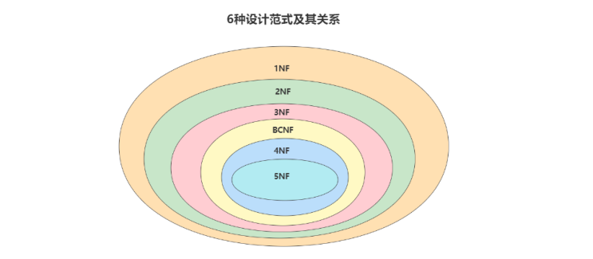

## 2.3 键和相关属性的概念
### ✅ 表結構

#### 球員表（`player`）：
| 球員編號（player_id） | 姓名（name） | 身份證號（id_card） | 年齡（age） | 球隊編號（team_id） |
|----------------------|-------------|---------------------|-------------|---------------------|

#### 球隊表（`team`）：
| 球隊編號（team_id） | 主教練（coach） | 所在地（location） |
|--------------------|----------------|-------------------|

---

### 🔑 各種鍵（Key）解釋與範例

#### 1. 超鍵（Super Key）
> 能唯一識別一筆資料（元組）的**任何屬性組合**。

- 範例（`player` 表）：
  - (`player_id`)
  - (`id_card`)
  - (`player_id`, `name`)
  - (`id_card`, `age`)
  - 都是**可以唯一辨識球員**的屬性組合

#### 2. 候選鍵（Candidate Key）
> 從超鍵中挑出**最小唯一識別**資料的那一組（不能再刪屬性）。

- 範例（`player` 表）：
  - `player_id`
  - `id_card`
  > 因為這兩個欄位分別就能**唯一標識球員**，而且都已經「最小」，所以是候選鍵。

#### 3. 主鍵（Primary Key）
> 從「候選鍵」中選一個作為主要識別方式。

- 假設我們選 `player_id` 為主鍵。

#### 4. 外鍵（Foreign Key）
> 指向其他表的「主鍵」，用來建立表之間的關聯。

- 範例：
  - `player.team_id` 是 `team.team_id` 的外鍵，表示球員屬於某支球隊。

---

### 🔢 主屬性 vs 非主屬性

- **主屬性（Prime Attribute）**：
  - 出現在「任一候選鍵」中的欄位
  - 範例：`player_id`、`id_card`

- **非主屬性（Non-Prime Attribute）**：
  - 沒出現在任何候選鍵中
  - 範例：`name`、`age`、`team_id`

---

### 🧠 小結一張圖幫助記憶

```
                ┌────────────┐
                │   超鍵      │
                └────────────┘
                     │
       ┌─────────────┴─────────────┐
       ▼                           ▼
┌────────────┐            ┌──────────────────┐
│ 候選鍵      │ ← 最小超鍵  ｜ 非候選鍵（不唯一）  |
└────────────┘            └──────────────────┘
       │
       ▼
┌────────────┐
│ 主鍵（選定） │
└────────────┘

主屬性：出現在候選鍵中
非主屬性：未出現在任何候選鍵中
```

---

## 2.4 第一范式(1st NF)
### ✅ 一、第一范式（1NF）定義

> **每一個欄位（屬性）都應該是不可再拆的最小單位（原子性）。**

也就是說：  
- 一個欄位只能存一個值（不能是清單、陣列、逗號分隔字串）
- 不要讓一個欄位同時代表多個意思（如 user_info 裡又存地址、電話）

---

### 🧪 二、舉例解析

---

#### 📌 範例 1：違反原子性（欄位裝了多個資料）

###### ❌ 不符合 1NF：

| emp_id | emp_name | emp_mobile            |
|--------|----------|------------------------|
| 1      | zhangsan | 13812345678            |
| 2      | lisi     | 13912345678, 13798765432 |
| 3      | zhaoliu  | 13888888888, 13999999999 |

> `emp_mobile` 欄位裝了 **多個手機號碼（用逗號隔開）**，不符合「一欄一值」原則。

---

###### ✅ 改為符合 1NF：

| emp_id | emp_name | emp_mobile    |
|--------|----------|----------------|
| 1      | zhangsan | 13812345678    |
| 2      | lisi     | 13912345678    |
| 2      | lisi     | 13798765432    |
| 3      | zhaoliu  | 13888888888    |
| 3      | zhaoliu  | 13999999999    |

> 解決方法：**一筆資料一行，不能在同一格放多筆資料。**

---

#### 📌 範例 2：複合欄位（欄位意義不單一）

###### ❌ 不符合 1NF：

| user_id | username | user_info                         |
|---------|----------|------------------------------------|
| 101     | tom      | 台北市中正區,0912345678             |
| 102     | jerry    | 新北市板橋區,0933888999             |

> `user_info` 欄位**混合了地址和電話號碼**，不是單一意義的欄位。

---

###### ✅ 改為符合 1NF：

| user_id | username | address         | phone        |
|---------|----------|------------------|---------------|
| 101     | tom      | 台北市中正區     | 0912345678    |
| 102     | jerry    | 新北市板橋區     | 0933888999    |

> 解決方法：**拆欄位，確保一欄對應一個單一意義。**

---

#### 📌 範例 3：主觀性（姓名欄位到底拆不拆？）

這種情況比較特殊，有爭議，但能幫助理解**原子性 ≠ 一定要拆越細越好**。

###### ✅ 不一定違反 1NF：

| emp_id | fullname        |
|--------|-----------------|
| 1      | John Smith      |
| 2      | Mary Jane Brown |

這樣設計沒有違反 1NF，因為 `fullname` 是一個整體，不可再拆的意義。

但如果你的應用需要搜尋姓氏或名字（例如搜尋所有姓「Smith」的人），就該這樣設計：

| emp_id | firstname | middlename | lastname |
|--------|-----------|------------|----------|
| 1      | John      |            | Smith    |
| 2      | Mary      | Jane       | Brown    |

> 要不要拆，全看 **資料使用需求**，不是拆得越多越好。

---

### 🧠 三、小總結（快速判斷 1NF）

| 判斷點                             | 是否符合 1NF？         |
|----------------------------------|------------------------|
| 欄位中有多個值（逗號分隔等）        | ❌ 不符合              |
| 欄位中代表多個資訊（混合用途）      | ❌ 不符合              |
| 欄位值是最小單位、不可拆分         | ✅ 符合                |
| 是否需要拆欄位視實際應用需求而定     | ✅ 主觀決定            |

---

## 2.5 第二范式(2nd NF)
### ✅ 一、第二范式（2NF）定義

> **在符合第一范式的基礎上，所有非主屬性都**「完全依賴」**主鍵，不能是「部分依賴」。**

#### 📌 重點詞彙解釋：
- **主鍵**：唯一識別一筆資料的欄位（可由多欄組成）
- **完全依賴（Full Dependency）**：非主鍵欄位依賴**整個主鍵**
- **部分依賴（Partial Dependency）**：非主鍵欄位只依賴主鍵的一部分 → 就違反 2NF！

---

### 🧪 二、舉例分析與改寫

---

#### 📍 範例 1：成績表（符合第二范式）

###### 表：`Score`

| student_id | course_id | score |
|------------|-----------|-------|
| 1          | C01       | 90    |
| 1          | C02       | 80    |
| 2          | C01       | 85    |

- 主鍵是 (`student_id`, `course_id`) — 複合主鍵
- `score` 是非主鍵欄位，**完全依賴這兩個欄位**

✅ 所以這張表 **符合 2NF**

---

#### 📍 範例 2：違反第二范式的球員比賽表

###### 表：`player_game`

| player_id | game_id | name   | age | game_time      | game_location | score |
|-----------|---------|--------|-----|----------------|----------------|-------|
| 1         | A       | Tom    | 24  | 2025-04-20 10:00 | Taipei Arena   | 25    |
| 1         | B       | Tom    | 24  | 2025-04-21 14:00 | Taichung Gym   | 18    |
| 2         | A       | Jerry  | 22  | 2025-04-20 10:00 | Taipei Arena   | 30    |

###### 🔍 問題分析：
- 主鍵是 (`player_id`, `game_id`)
- `score` 是完全依賴整個主鍵，沒問題
- 但：
  - `name`, `age` 只依賴 `player_id`（玩家屬性）
  - `game_time`, `game_location` 只依賴 `game_id`（比賽屬性）

> 所以這些欄位 **是部分依賴主鍵**，違反第二范式！

---

###### ✅ 正確做法：拆成三張表（每張表代表一個單一主體）

1. `player`（球員資訊）

| player_id | name  | age |
|-----------|-------|-----|
| 1         | Tom   | 24  |
| 2         | Jerry | 22  |

2. `game`（比賽資訊）

| game_id | game_time        | game_location  |
|---------|------------------|----------------|
| A       | 2025-04-20 10:00 | Taipei Arena   |
| B       | 2025-04-21 14:00 | Taichung Gym   |

3. `player_game`（比賽成績）

| player_id | game_id | score |
|-----------|---------|-------|
| 1         | A       | 25    |
| 1         | B       | 18    |
| 2         | A       | 30    |

✅ 每個非主鍵欄位都「完全依賴」主鍵，現在就符合 2NF！

---

#### 📍 範例 3：Orders 訂單資料

###### ❌ 違反 2NF 的 Orders 表：

| order_id | product_id | order_date | customer_id | customer_name | product_name | quantity |
|----------|------------|------------|-------------|---------------|--------------|----------|
| 1001     | P01        | 2025-04-01 | C01         | Alice         | Mouse        | 3        |
| 1001     | P02        | 2025-04-01 | C01         | Alice         | Keyboard     | 1        |

- 主鍵為 (`order_id`, `product_id`)
- 問題：
  - `order_date`、`customer_id`、`customer_name` 只依賴 `order_id`
  - `product_name` 只依賴 `product_id`

---

###### ✅ 拆表後的結構（符合 2NF）：

1. `orders`

| order_id | order_date | customer_id |
|----------|------------|-------------|
| 1001     | 2025-04-01 | C01         |

2. `customers`

| customer_id | customer_name |
|-------------|----------------|
| C01         | Alice          |

3. `products`

| product_id | product_name |
|------------|--------------|
| P01        | Mouse        |
| P02        | Keyboard     |

4. `order_details`

| order_id | product_id | quantity |
|----------|------------|----------|
| 1001     | P01        | 3        |
| 1001     | P02        | 1        |

---

### 🧠 三、小結與對照表

| 條件 | 是否符合 2NF？ | 原因 |
|------|----------------|------|
| 非主鍵欄位依賴複合主鍵的**全部欄位** | ✅ | 完全依賴 |
| 非主鍵欄位只依賴主鍵的**部分欄位** | ❌ | 部分依賴 → 違反 |
| 一張表混合了多個主體資訊 | ❌ | 不只描述一個主體（如球員+比賽） |

---

#### 🎯 記憶口訣：
> **1NF**：欄位值是原子  
> **2NF**：非主屬性完全依賴主鍵

---

## 2.6 第三范式(3rd NF)
### ✅ 一、第三范式（3NF）定義

> 在滿足第二范式（2NF）的前提下：
>
> ✅ 所有非主鍵欄位（非主屬性）**只能直接依賴主鍵**，  
> ❌ 不能依賴其他非主鍵欄位（= 不得有**傳遞依賴**）

---

### 🔄 二、傳遞依賴的意思

#### ✅ 傳遞依賴的概念（簡單解釋）

假設有三個欄位（屬性）：
- A（主鍵）  
- B（非主鍵）  
- C（非主鍵）

如果：
```
A → B 且 B → C
```

那麼，**C 就是透過 B 才得知 A 的訊息**，這種就叫做「**傳遞依賴**」。

> ✅ 在 3NF 中，**非主鍵欄位 C 必須直接依賴主鍵 A，不能透過 B 間接依賴 A**。

---

#### 🎯 換句話說：

- ❌ 錯誤：**主鍵 → 非主鍵1 → 非主鍵2（= 傳遞依賴）**
- ✅ 正確：**主鍵 → 非主鍵1**，非主鍵之間不應再有依賴

---

#### 📦 舉例解釋（以「員工資料」為例）

| emp_id | name | dept_id | dept_name |
|--------|------|---------|-----------|
| 101    | Tom  | D01     | 人資部     |

- `emp_id` 是主鍵
- `dept_name` 並不是直接由 `emp_id` 決定的，而是：
  ```
  emp_id → dept_id → dept_name
  ```
  所以 `dept_name` 是透過 `dept_id` 間接依賴 `emp_id` → **傳遞依賴**

##### ❗問題會是什麼？
- 如果 `dept_name` 更新錯了，會讓同一個 `dept_id` 有不同 `dept_name` → 資料不一致
- 增加資料冗餘（每筆員工資料都重複部門名稱）

---

#### 🛠 解法

將「部門資料」獨立出來放進另一張表中，變成：

**`employee` 表：**

| emp_id | name | dept_id |
|--------|------|---------|
| 101    | Tom  | D01     |

**`department` 表：**

| dept_id | dept_name |
|---------|-----------|
| D01     | 人資部     |

---

#### 🧠 小結

| 類型         | 說明                                       |
|--------------|--------------------------------------------|
| 直接依賴     | A（主鍵） → B（非主鍵）                    |
| 傳遞依賴 ❌ | A（主鍵） → B（非主鍵） → C（非主鍵） → 錯誤設計 |

在設計資料表時，如果你發現某個欄位不是由主鍵直接決定的，而是靠其他非主鍵欄位來決定的，就要注意是不是有「傳遞依賴」。

---

### 🧪 三、常見問題場景舉例

---

#### 📍 範例 1：員工表中混入部門資料（傳遞依賴）

###### ❌ 違反 3NF 的設計

| emp_id | name | dept_id | dept_name | dept_intro |
|--------|------|---------|-----------|------------|
| 1      | Tom  | D01     | 人資部     | 負責招募     |
| 2      | Lily | D01     | 人資部     | 負責招募     |
| 3      | Jack | D02     | 技術部     | 開發產品     |

- 主鍵：`emp_id`
- 問題：
  - `dept_name` 和 `dept_intro` 應該依賴 `dept_id`，但這裡透過 `emp_id` 間接存入，出現 **傳遞依賴**

###### ✅ 改寫為 3NF 結構：

1. `employee` 表（只保留員工資料）

| emp_id | name | dept_id |
|--------|------|---------|
| 1      | Tom  | D01     |
| 2      | Lily | D01     |
| 3      | Jack | D02     |

2. `department` 表（部門資料單獨管理）

| dept_id | dept_name | dept_intro |
|---------|-----------|-------------|
| D01     | 人資部     | 負責招募      |
| D02     | 技術部     | 開發產品      |

---

#### 📍 範例 2：商品類別資訊混入商品表

###### ❌ 錯誤設計（違反 3NF）

| goods_id | goods_name | category_id | category_name |
|----------|-------------|-------------|----------------|
| 1        | 滑鼠        | C01         | 外設產品         |
| 2        | 鍵盤        | C01         | 外設產品         |
| 3        | 顯示器      | C02         | 顯示設備         |

- `category_name` 是依賴於 `category_id`，卻放在商品表內 → **傳遞依賴**

###### ✅ 改寫成 3NF 結構

1. `goods`

| goods_id | goods_name | category_id |
|----------|------------|-------------|
| 1        | 滑鼠        | C01         |
| 2        | 鍵盤        | C01         |
| 3        | 顯示器      | C02         |

2. `goods_category`

| category_id | category_name |
|-------------|----------------|
| C01         | 外設產品         |
| C02         | 顯示設備         |

---

#### 📍 範例 3：球員與教練的傳遞依賴

###### ❌ 錯誤設計：

| player_id | name | team_name | coach_name |
|-----------|------|-----------|-------------|
| 1         | Tom  | A 隊       | 老王         |
| 2         | Lily | A 隊       | 老王         |
| 3         | Jack | B 隊       | 小李         |

- 主鍵：`player_id`
- 問題：`coach_name` 應依賴 `team_name`，但透過 `player_id` 傳遞依賴

###### ✅ 改寫為 3NF：

1. `player` 表

| player_id | name | team_name |
|-----------|------|------------|
| 1         | Tom  | A 隊        |
| 2         | Lily | A 隊        |
| 3         | Jack | B 隊        |

2. `team` 表

| team_name | coach_name |
|-----------|-------------|
| A 隊       | 老王         |
| B 隊       | 小李         |

---

#### 📍 範例 4：訂單資料的傳遞依賴

###### ❌ 違反 3NF 的 Orders 表：

| order_id | order_date | customer_id | customer_name |
|----------|-------------|--------------|----------------|
| 1001     | 2025-04-01  | C01          | Alice          |
| 1002     | 2025-04-02  | C02          | Bob            |

- 主鍵：`order_id`
- `customer_name` 應該依賴 `customer_id`，卻被包進 `order` 裡 → 傳遞依賴

###### ✅ 改寫為 3NF：

1. `orders`

| order_id | order_date | customer_id |
|----------|-------------|--------------|
| 1001     | 2025-04-01  | C01          |
| 1002     | 2025-04-02  | C02          |

2. `customers`

| customer_id | customer_name |
|--------------|----------------|
| C01          | Alice          |
| C02          | Bob            |

---

### 🧠 四、小結與記憶口訣

#### ✅ 簡單總結：

| 范式 | 要求 |
|------|------|
| 1NF  | 欄位值必須是原子單位（不可再拆） |
| 2NF  | 非主鍵欄位需**完全依賴**主鍵 |
| 3NF  | 非主鍵欄位不得**傳遞依賴**於主鍵（彼此獨立） |

---

#### 📌 口訣記憶法：
> ✅ **依賴鍵（主鍵） → 完全依賴 → 除了鍵別無所依**  
> “每個非鍵屬性依賴於主鍵，依賴於整個主鍵，並且除了主鍵別無所依。”

---

## 2.7 小结
### ✅ 一、三大范式概覽與對應規則

| 范式 | 定義 | 避免的問題 | 舉例說明 |
|------|------|-------------|-----------|
| **1NF** | 每一欄都是「不可再拆的最小單位」 | 儲存欄位中有多個值（如逗號分隔手機號） | `emp_mobile = "0912..., 0922..."` ❌ |
| **2NF** | 在 1NF 基礎上，非主鍵欄位「完全依賴」主鍵 | 避免欄位只依賴主鍵一部分（複合主鍵常見） | `order_id, product_id → product_name` ❌ |
| **3NF** | 在 2NF 基礎上，非主鍵欄位「只能依賴主鍵，不能依賴其他非主鍵欄位」 | 避免**傳遞依賴** | `customer_id → customer_name → order_id` ❌ |

---

### 🧪 二、舉例比較說明

#### ❌ 不符合范式的 Orders 表：
```plaintext
| order_id | product_id | order_date | customer_id | customer_name |
|----------|------------|------------|-------------|----------------|
| 1001     | P01        | 2025-04-01 | C01         | Alice          |
| 1001     | P02        | 2025-04-01 | C01         | Alice          |
```

- **1NF 問題？** ✅ 沒有，都是原子值。
- **2NF 問題？** ❌ `customer_name` 只依賴 `customer_id`，而主鍵是 `(order_id, product_id)`
- **3NF 問題？** ❌ `customer_name` 傳遞依賴於 `order_id → customer_id → customer_name`

---

#### ✅ 正規化後的表（符合 3NF）：

1. `orders`  
```plaintext
| order_id | order_date | customer_id |
|----------|------------|--------------|
| 1001     | 2025-04-01 | C01          |
```

2. `customers`  
```plaintext
| customer_id | customer_name |
|-------------|----------------|
| C01         | Alice          |
```

3. `order_details`  
```plaintext
| order_id | product_id |
|----------|------------|
| 1001     | P01        |
| 1001     | P02        |
```

✅ 每張表只描述**一件事、沒有冗餘、避免異常、查詢需 join**

---

### 📈 三、范式的優點

| 優點 | 說明 |
|------|------|
| ✅ 消除冗餘 | 資料不用重複存多次，例如部門名稱不會重複在每個員工紀錄中 |
| ✅ 降低異常風險 | 更新一筆資料不會漏改其他地方（避免「更新異常」） |
| ✅ 強化資料一致性 | 資料更容易維護，結構清晰，減少出錯 |

---

### 🐢 四、范式的缺點

| 缺點 | 說明 |
|------|------|
| ❌ 查詢成本高 | 多張表之間需頻繁 join，尤其在大量讀操作中會影響效能 |
| ❌ 索引失效風險 | 複雜查詢容易讓 MySQL 無法走最佳索引路徑 |
| ❌ 開發成本上升 | 系統邏輯更複雜，資料分散，不易快速讀取組合資訊 |

---

### 🔄 五、實務中的取捨：范式 vs 反范式（Denormalization）

| 情境 | 建議做法 |
|------|------------|
| 查詢頻繁、寫入較少（如報表查詢） | 可以**反范式設計**，冗餘一些資料以提升查詢效能 |
| 關係複雜、有一致性要求（如交易、金融） | 使用 **3NF 或更高范式**，保證資料準確 |
| 結構固定、變化少 | 可以適當做 **合併表設計**，簡化維護與 join |
| 表很大（百萬級以上） | **避免過度 join**，適當做欄位複製提升效能 |

---

### 🧠 六、小結語與口訣記憶

> 「范式不是絕對標準，而是一種設計指南」

📌 **記憶口訣：**  
👉 1NF：一欄一值（原子性）  
👉 2NF：全依主鍵  
👉 3NF：只依主鍵

---

# 3. 反范式化
## 3.1 概述
### ✅ 一、什麼是反范式化？

> **反范式化**是指：**為了系統效能或查詢便利性**，在資料庫表中「故意增加冗餘資料」或「合併多表」，以**減少查詢時的 JOIN 效能損耗**。

它與「范式化」正好相反——范式化強調結構整齊、避免冗餘，但反范式化強調查詢效能、方便實作。

---

### 📊 二、范式 vs 反范式化

| 項目 | 范式化 | 反范式化 |
|------|--------|------------|
| 優點 | 資料一致性高、不重複 | 查詢效率高、少 JOIN |
| 缺點 | 查詢要 JOIN 多表、效率低 | 會有資料冗餘、更新需同步 |
| 適用場景 | 資料變動多、寫入頻繁 | 資料查詢頻繁、讀多寫少 |
| 常見應用 | 事務性系統（如 ERP） | 查詢性系統（如 報表、後台） |

---

### 🧱 三、簡單例子比較

#### ✅ 范式化版本（正常設計）

```sql
-- 顧客基本資料
CREATE TABLE customer (
  id INT PRIMARY KEY,
  name VARCHAR(100)
);

-- 訂單資料（外鍵參照顧客）
CREATE TABLE orders (
  id INT PRIMARY KEY,
  customer_id INT,
  order_date DATE,
  FOREIGN KEY (customer_id) REFERENCES customer(id)
);
```

**查詢一筆訂單 + 顧客名字：**

```sql
SELECT o.id, o.order_date, c.name
FROM orders o
JOIN customer c ON o.customer_id = c.id;
```

這需要 JOIN，一旦資料量大就會慢。

---

#### ❌ 反范式化版本（反范式設計）

```sql
CREATE TABLE orders (
  id INT PRIMARY KEY,
  customer_id INT,
  customer_name VARCHAR(100), -- 冗餘欄位
  order_date DATE
);
```

這裡多了一個冗餘欄位 `customer_name`，但查詢時就不必再 JOIN `customer` 表了：

```sql
SELECT id, order_date, customer_name FROM orders;
```

效能提升，但要注意：**若顧客改名，需同步更新多筆訂單的 customer_name 欄位**，這就是反范式的「代價」。

---

### 🎯 四、常見反范式化做法

| 技巧 | 說明 |
|------|------|
| 增加冗餘欄位 | 將常查詢的欄位直接複製到主要表 |
| 預先計算欄位 | 儲存計算結果（如訂單總金額） |
| 合併多表為一表 | 將原本拆開的資料合成一張大表 |
| 儲存統計資訊 | 例如直接記錄某商品的點擊數、評論數 |

---

### 🧠 五、什麼時候該使用反范式化？

#### 適用條件：
- **系統讀多寫少**（如電商網站首頁、報表系統）
- **JOIN 操作效能成瓶頸**
- **允許少量資料冗餘**
- **資料一致性不需要百分百同步**

---

### 🧾 六、小結

| 若你要的是：| 請選擇 |
|-------------|--------|
| **資料一致性高** | → 正常范式化設計 |
| **查詢效能高** | → 反范式化設計 |

兩者並不對立，實務上**常常會混用**：資料主表走范式設計，報表或快取表走反范式設計。

---

## 3.2 应用举例
> ✅ **當資料量很大、JOIN 次數頻繁、查詢效能不足時，可以「犧牲一點資料冗餘」來換取「查詢速度」的飛躍提升。**

---

### 🎯 舉例 1：員工表 + 部門表

#### ✅ 范式設計（正常做法）：
- `employees` 表中有欄位 `department_id`
- `departments` 表中有 `department_id` 與 `department_name`
- 要查詢員工與部門名稱就要 JOIN：

```sql
SELECT employee_id, department_name
FROM employees e
JOIN departments d ON e.department_id = d.department_id;
```

#### ❌ 反范式做法：
- 在 `employees` 表中直接加上 `department_name` 欄位
- 優點：避免每次查詢都 JOIN
- 缺點：若部門改名，員工表中的資料也要同步更新

---

### 🎯 舉例 2：商品資訊 goods 表設計（簡略描述）

類似上面的例子，把商品名稱（或分類名、品牌名等）這些**原本應該從別張表 JOIN 的資料**，直接冗餘存入 `goods` 表中，提高查詢效率。

例如：

```sql
CREATE TABLE goods (
  id INT PRIMARY KEY,
  name VARCHAR(50),
  category_id INT,
  category_name VARCHAR(50),  -- 冗餘欄位
  brand_name VARCHAR(50)      -- 冗餘欄位
);
```

---

### 🎯 舉例 3：商品流水表 + 商品資訊表

#### ✅ 正常做法：
- `trans` 表紀錄交易（400萬筆）
- `goodsinfo` 表紀錄商品（2000筆）
- 查詢商品名稱要 JOIN：

```sql
SELECT t.trans_id, g.goods_name
FROM trans t
JOIN goodsinfo g ON t.goods_id = g.goods_id;
```

#### ❌ 反范式做法：
- 直接在 `trans` 表加入 `goods_name` 欄位
- 查詢只查一張表，**少 JOIN 一張 400萬筆的巨表**，大幅加速

---

### 🎯 舉例 4：評論表 + 學生表（百萬資料）

#### ✅ 原始設計：
```sql
SELECT p.comment_text, p.comment_time, s.stu_name
FROM class_comment p
JOIN student s ON p.stu_id = s.stu_id
WHERE p.class_id = 10001
ORDER BY p.comment_id DESC
LIMIT 1000;
```
- 因為 `class_comment` 和 `student` 各有百萬筆資料，JOIN 成為瓶頸
- 查詢耗時約 0.395 秒

#### ❌ 反范式化改寫：
1. `class_comment` 表中新增欄位 `stu_name`
2. 初次同步填入學生名稱：
   ```sql
   ALTER TABLE class_comment ADD stu_name VARCHAR(25);
   UPDATE class_comment c
   SET stu_name = (SELECT s.stu_name FROM student s WHERE s.stu_id = c.stu_id);
   ```
3. 查詢變成：

```sql
SELECT comment_text, comment_time, stu_name
FROM class_comment
WHERE class_id = 10001
ORDER BY comment_id DESC
LIMIT 1000;
```

✅ 結果查詢耗時大幅下降到 0.039 秒，**速度提升了將近 10 倍！**

---

### 🧠 小結：何時該考慮反范式化？

| 條件 | 是否適合反范式化 |
|------|-----------------|
| 資料量大 | ✅ 適合 |
| 查詢頻繁且有多表 JOIN | ✅ 適合 |
| 寫入比讀取多 | ❌ 謹慎使用，易造成同步壓力 |
| 對資料一致性要求高 | ❌ 避免使用 |

---

## 3.3 反范式的新问题
### ✅ 1. 存儲空間變大了

#### 💬 原因：
因為你「**重複儲存了資料**」，像是某個欄位本來應該只在一張表出現一次，現在卻在多張表中出現。

#### 🔍 舉例：
原本 `student` 表中有 `stu_name`，而 `class_comment` 表只存 `stu_id`：

```sql
SELECT comment_text, s.stu_name
FROM class_comment c
JOIN student s ON c.stu_id = s.stu_id;
```

反范式後：

```sql
-- class_comment 增加冗餘欄位 stu_name
stu_id | stu_name   | comment_text
-------|------------|----------------
10001  | 張小明     | 很棒的課程
10001  | 張小明     | 老師講得很好
```

✅ **重複存了很多次「張小明」這個名字，耗空間。**

> 雖然現代硬碟便宜，但在大資料量（如百萬級別）下仍是負擔。

---

### ✅ 2. 資料一致性風險：欄位需要同步更新

#### 💬 原因：
反范式導致「一份資料多處儲存」，如果只更新其中一處，會造成資料不一致。

#### 🔍 舉例：
假設學生「張小明」改名為「張大明」：

- 若只更新 `student` 表，但忘記更新 `class_comment.stu_name`，就會造成混亂。

```sql
-- 正確更新方式是兩邊都要改
UPDATE student SET stu_name = '張大明' WHERE stu_id = 10001;
UPDATE class_comment SET stu_name = '張大明' WHERE stu_id = 10001;
```

✅ 需要**額外維護同步邏輯**（如觸發器或程式控制），否則資料會錯亂。

---

### ✅ 3. 寫入成本提高（特別是用儲存程序時）

#### 💬 原因：
每次寫入/更新，都不只是更新一筆資料，而是「多筆關聯冗餘資料也要跟著改」，尤其當你用儲存程序來自動執行批次操作，效能會明顯下降。

#### 🔍 舉例：

```sql
-- 原本更新 student 表一行：
UPDATE student SET stu_name = '張大明' WHERE stu_id = 10001;

-- 現在還要查出所有 class_comment 裡面這個學生的評論也要改：
UPDATE class_comment SET stu_name = '張大明' WHERE stu_id = 10001;
```

如果 `class_comment` 表有百萬筆資料，這樣的更新就會很重，甚至需要寫儲存過程來批量處理，**消耗大量資源（CPU + I/O）**。

---

### ✅ 4. 小型資料無法體現效能優勢，反而更複雜

#### 💬 原因：
資料量很小時，JOIN 的成本本來就不高，反而是反范式會讓資料結構變複雜、難維護。

#### 🔍 舉例：
一個只有幾千筆學生資料與評論資料的教學網站：

- 用 JOIN 的查詢速度足夠快（例如：0.001 秒）
- 加上冗餘欄位後，查詢只快了 0.0005 秒，但開發邏輯變複雜、寫入邏輯多一倍，**反而不划算**

---

### 🧠 小結

| 問題 | 說明 | 解決建議 |
|------|------|-----------|
| 🚨 空間變大 | 同一資料重複存多處 | 評估是否真的需要冗餘資料 |
| 🚨 資料不同步 | 更新一處，另一處沒改 | 使用觸發器、儲存程序或統一更新邏輯 |
| 🚨 更新成本高 | 更新時要同步更新多張表 | 適用於讀多寫少場景 |
| 🚨 小資料不適用 | 查詢本來就很快，不需要冗餘 | 小型系統建議保守採用范式設計 |

---

## 3.4 反范式的适用场景
### ✅ 一、什麼時候可以「增加冗餘欄位」？

#### 📌 建議條件有兩個：

1. **這個欄位不常改變**
2. **這個欄位在查詢時幾乎每次都需要**

---

#### 🧠 舉例：員工表 + 部門名稱

```sql
-- 范式設計：
SELECT e.name, d.department_name
FROM employee e
JOIN department d ON e.department_id = d.department_id;
```

但你發現：
- 使用者每次查詢都要看到部門名稱
- `department_name` 幾乎不會改

👉 所以你可以反范式化，在 `employee` 表中**直接新增 `department_name` 欄位**

```sql
ALTER TABLE employee ADD department_name VARCHAR(50);
```

好處：
- 查詢速度提升（不需 JOIN）
壞處：
- 若改部門名稱，要同步多筆資料

---

### ✅ 二、適合保存「歷史快照」的場景

這是非常常見的反范式化設計情境：

#### 📌 關鍵概念：
> 當某些資料在未來**可能會改變**，但你又需要「當時」的快照記錄，就該保存冗餘欄位。

---

#### 🧠 舉例：訂單收件人資料

- `user` 表中有姓名、電話、地址
- 但使用者可以隨時修改這些資料
- **你不能只儲存 user_id，再 JOIN 查詢使用者資訊，因為資料可能變了！**

👉 正確做法是：

```sql
CREATE TABLE orders (
  order_id INT PRIMARY KEY,
  user_id INT,
  receiver_name VARCHAR(50),
  receiver_phone VARCHAR(20),
  receiver_address TEXT
);
```

這樣每張訂單就記錄了當時的快照資料，**不受使用者後來修改影響**。

---

### ✅ 三、資料倉儲（Data Warehouse）非常適合反范式設計

資料倉儲（Data Warehouse）設計目的是**分析過去**，不是即時處理。常見於 BI、報表、數據分析場景。

#### 📌 資料倉儲 vs 傳統資料庫比較：

| 項目 | 資料庫（OLTP） | 資料倉儲（OLAP） |
|------|----------------|------------------|
| 目的 | 操作記錄（查、增、改、刪） | 歷史分析（查詢、統計） |
| 資料類型 | 當前的業務資料 | 歷史快照 |
| 設計方式 | 范式設計為主 | 反范式設計為主 |
| 查詢特性 | 多為小範圍查詢 | 多為複雜查詢與聚合 |
| 寫入頻率 | 寫入/更新多 | 寫入少，讀多 |

---

#### 🧠 舉例：商品銷售數據倉儲設計

在資料倉中，我們會建立一張「商品銷售事實表」，不但包含商品 ID，還會冗餘商品名稱、品牌、分類等，方便 BI 查詢：

```sql
CREATE TABLE sales_fact (
  sale_id INT,
  goods_id INT,
  goods_name VARCHAR(50),      -- 冗餘欄位
  brand_name VARCHAR(50),      -- 冗餘欄位
  category_name VARCHAR(50),   -- 冗餘欄位
  quantity INT,
  total_price DECIMAL(10,2),
  sale_date DATE
);
```

這些資料未來不會變，冗餘反而提升了查詢效率，方便聚合分析。

---

### 📌 小結：什麼時候用反范式設計？

| 場景 | 適用說明 |
|------|----------|
| 查詢頻繁、JOIN 成本高 | → 增加冗餘欄位 |
| 資料穩定、不常變動 | → 冗餘欄位更新成本低 |
| 需要保存歷史狀態（快照） | → 訂單、收件人、評論等歷史資訊 |
| 資料倉儲設計 | → 用於分析、查詢，不注重實時更新 |

---

# 4. BCNF(巴斯范式)
## ✅ 一、BCNF（巴斯范式）定義

> **BCNF 是對第三范式（3NF）的進一步強化**，它要求：
>
> 💡「**每一個函數依賴的左邊（決定因素）**都必須是**候選鍵（Candidate Key）**」。

### 🔍 什麼是「函數依賴」？
> 它是指一種 **屬性（欄位）與屬性之間的規律性關係**。

在資料庫中，「**函數依賴（Functional Dependency）**」的意思是：

> 如果透過某個欄位（或欄位組合）的值，**可以唯一決定**另一個欄位的值，  
> 那我們就說：「後者 **函數依賴** 前者」。

語法上寫作：  
```
A → B
```

意思是：
> 如果你知道 A 的值，就能唯一確定 B 的值。

---

#### ✅ 舉例一：學生資料表

| 學號（student_id） | 姓名（name） | 科系（department） |
|-------------------|-------------|-------------------|
| 001               | 小明        | 資管系              |
| 002               | 小華        | 資工系              |

這裡有：
- `student_id → name`：因為每個學號對應一個名字
- `student_id → department`：學號也能唯一決定科系

所以 `name` 與 `department` **函數依賴** `student_id`。

---

#### ❌ 反例（不構成函數依賴）：

| 員工職稱（title） | 員工姓名（name） |
|------------------|-----------------|
| 業務              | 小美             |
| 業務              | 小張             |

這裡 `title → name` 不成立，因為一個職稱可能有多位員工。

---

#### 💡 BCNF 關注的就是「哪些欄位能決定哪些欄位」

BCNF 要求：
> 所有像 A → B 這樣的函數依賴中，A **必須是候選鍵（可以唯一標識資料列）**。

如果 A 不是候選鍵，卻能決定其他欄位，那就違反 BCNF，要拆表或調整設計。

---

#### 🔚 小結

| 名詞         | 解釋 |
|--------------|------|
| 函數依賴 A → B | 知道 A 的值就能唯一決定 B 的值 |
| A 是決定因素     | A 是左邊的欄位（決定欄位） |
| B 是被依賴屬性   | B 是右邊的欄位（被決定欄位） |

> 所以這裡「函數」不是程式語言的 function，也不是欄位名，而是指 **欄位間的一種「唯一決定關係」**。

---

---

### 📌 回顧一下：什麼是候選鍵？
候選鍵是能夠唯一識別一筆資料的**最小欄位組合**，可能有多個。例如學生資料表中，學號 或 身分證號 都可作為候選鍵。

---

## ❗ 二、為什麼需要 BCNF？

即使表達式符合 3NF，仍然可能發生「某個非主鍵欄位能決定候選鍵的一部分」，也就是主鍵的部分被**函數依賴**，這樣會導致：

- 資料異常（重複、更新困難）
- 無法確保唯一性與一致性

---

## 📋 三、範例說明

### 📌 範例資料表：倉庫資訊（未滿足 BCNF）

| 倉庫名（warehouse） | 管理員（admin） | 物品名（item） |
|-------------------|----------------|----------------|
| 北京倉              | 張三             | iPhone XR       |
| 上海倉              | 李四             | iPhone 7P       |

#### 主鍵： (admin, item) 為候選鍵（每位管理員負責特定物品）
但 `warehouse -> admin`，也就是：

👉 倉庫名（warehouse）能夠**唯一決定**管理員（admin）

這就造成了：
- 非主鍵 `warehouse` 函數決定了 `admin`，而 `warehouse` 並不是候選鍵。
- 違反了 BCNF 的「左側一定是候選鍵」的要求。

---

## 🔧 四、如何拆解讓它符合 BCNF？

### ✅ 拆分為兩張表

1️⃣ 倉庫-管理員 表：
| 倉庫名（warehouse） | 管理員（admin） |
|-------------------|----------------|
| 北京倉              | 張三             |
| 上海倉              | 李四             |

2️⃣ 管理員-物品 表：
| 管理員（admin） | 物品名（item） |
|----------------|----------------|
| 張三             | iPhone XR       |
| 李四             | iPhone 7P       |

這樣拆解後，每張表都符合 BCNF 規則：
- 所有依賴的左側都是候選鍵
- 消除了非候選鍵依賴候選鍵部分屬性的問題

---

## 🔚 小結

| 項目 | 第三范式（3NF） | BCNF（巴斯范式） |
|------|----------------|-----------------|
| 要求 | 消除**傳遞依賴** | 所有決定因素必須是候選鍵 |
| 可能問題 | 某些情況下仍會有**部分依賴** | 強化了約束條件，防止此類依賴出現 |

---

# 5. 第四范式（了解）
### 🔍 一、什麼是「多值依賴」？

假設有個主鍵欄位 `K`，如果這個主鍵欄位對某兩組欄位 `A` 和 `B` 都有一對多的關係，而且 `A` 和 `B` **彼此之間無關聯、互不影響**，那就構成了「非平凡的多值依賴」。

語法表示：`K →→ A` 和 `K →→ B`，但 `A` 和 `B` 沒有任何依賴關係。

---

### 📘 二、常見錯誤範例（不符合第四范式）

#### 範例：職工表
| 職工ID | 孩子姓名 | 選修課程 |
|--------|----------|----------|
| E001   | 小明     | Java     |
| E001   | 小明     | Python   |
| E001   | 小美     | Java     |
| E001   | 小美     | Python   |

這張表的意思是：

- E001 有兩個小孩：小明、小美
- E001 選修了兩門課程：Java、Python

所以這張表其實會出現 **2 × 2 = 4** 筆組合資料。
但是「孩子」和「課程」根本沒有任何關係，是因為職工ID各自一對多造成的「多值依賴」，不應該混在同一張表中。

#### 🛠 拆表變成符合第四范式：

**孩子表：**
| 職工ID | 孩子姓名 |
|--------|----------|
| E001   | 小明     |
| E001   | 小美     |

**課程表：**
| 職工ID | 選修課程 |
|--------|----------|
| E001   | Java     |
| E001   | Python   |

這樣就不會產生不必要的「組合膨脹」，而且查詢與維護也更清楚。

---

### 🧠 三、再舉一個簡潔例子：課程、教師、教材

| 課程 | 教師 | 教材 |
|------|------|------|
| 高數 | 張三 | 高數教材A |
| 高數 | 李四 | 高數教材A |
| 高數 | 張三 | 英文版高數 |
| 高數 | 李四 | 英文版高數 |

每個教師對每本教材都要重複組合一次，其實「教師」和「教材」彼此是**互不影響的兩組多值依賴**，都只是對「課程」一對多。

#### ✅ 符合4NF的做法：

**課程與教師表：**
| 課程 | 教師 |
|------|------|
| 高數 | 張三 |
| 高數 | 李四 |

**課程與教材表：**
| 課程 | 教材 |
|------|------|
| 高數 | 高數教材A |
| 高數 | 英文版高數 |

---

### ✅ 四、總結：如何判斷是否違反4NF？

1. 看一張表是否有「**多個一對多的屬性組**」
2. 它們是否「**對同一主鍵**」一對多
3. 這些「多」之間彼此是否 **獨立無關**
4. 如果符合以上，這張表就是 **違反第四范式**

解決辦法就是：**分表處理每個多值依賴，只保留單一的多值事實**。

---

# 6. 第五范式、域键范式（了解）
## ✅ 一、第五范式（5NF, Fifth Normal Form）

### 📘 定義（簡單講）
**5NF 又稱「投影-聯接范式（PJ/NF）」**，它解決的是：  
> **當一張表被拆成多張表之後，這些子表能不能再「無損地聯接」還原出原來的資料？**

第五范式會要求：  
📌 **所有的 join（連接）都應該是必要的，不能有不必要的重組依賴**。

---

### 🔍 範例說明：供應商供貨地點問題

假設我們有一張表如下：

| 供應商 | 零件 | 地點 |
|--------|------|------|
| A      | X    | 台北 |
| A      | X    | 台中 |
| A      | Y    | 台北 |

意思是：  
- 供應商 A 可以提供零件 X，配送到台北或台中  
- 供應商 A 也可以提供零件 Y，配送到台北

#### 📌 這個表滿足 4NF 嗎？
滿足，因為沒有獨立的多值依賴問題。

#### 📌 問題來了：如果這張表我們拆成三張表

- 表1：供應商 - 零件
| 供應商 | 零件 |
|--------|------|
| A      | X    |
| A      | Y    |

- 表2：供應商 - 地點
| 供應商 | 地點 |
|--------|------|
| A      | 台北 |
| A      | 台中 |

- 表3：零件 - 地點
| 零件 | 地點 |
|------|------|
| X    | 台北 |
| X    | 台中 |
| Y    | 台北 |

這三張表聯接後（供應商 ∩ 零件 ∩ 地點）會得到一張新的表：

| 供應商 | 零件 | 地點 |
|--------|------|------|
| A      | X    | 台北 |
| A      | X    | 台中 |
| A      | Y    | 台北 |
| ❌A    | Y    | 台中 ← 錯誤產生了！

這就是「**無損連接問題（Lossless Join）**」：拆開後再 join，**資料產生了錯誤的多餘組合**。

#### ✅ 解決辦法：
這三張表不能單獨存在，應該保留原來的三元組表（供應商、零件、地點），這就是**5NF 的要求**——**只有在無損情況下，才能拆表**。

---

## ✅ 二、域鍵范式（DKNF, Domain-Key Normal Form）

### 📘 定義（簡單講）

> DKNF 是「最終范式」，要求：  
> 一個關係的 **所有限制（constraints）都只能用**：
> - 欄位的定義域（domain）  
> - 鍵的限制（key）

說白話就是：

🧠 **表格中所有的商業規則或資料約束，都要在「欄位型別」與「鍵」這兩個層級完成，不允許有其他邏輯依賴或條件需要在應用層做控制。**

---

### 📌 舉例說明：

假設有一張訂單表：

| 訂單編號 | 付款方式 | 銀行帳號 |
|----------|----------|----------|
| O001     | 現金     | NULL     |
| O002     | 匯款     | 12345678 |

這裡有個商業規則：「**付款方式為匯款時，必須填寫銀行帳號；如果是現金就不能填帳號**」

這個限制無法單靠「欄位型別」或「主鍵」去描述，必須用「檢查條件（CHECK）」或應用層邏輯來寫。

因此這張表 **不符合 DKNF**。

符合 DKNF 的要求會是：  
📌 把這類邏輯條件都轉成 **結構上的約束（如表分開、鍵與 domain 限制）**。

---

## ✅ 三、總結對照表：

| 范式        | 解決問題                     | 是否常用 | 特點關鍵字                  |
|-------------|------------------------------|----------|-----------------------------|
| 4NF         | 多值依賴（MVD）              | 常見     | 一主鍵對多欄、彼此無關的多值 |
| 5NF         | 連接依賴（Join Dependency）  | 較少     | 無損連接、資料不應錯配       |
| DKNF        | 所有限制都只能用鍵與域       | 理論為主 | 沒有業務邏輯在應用層         |

---

# 7. ER 模型
> ER模型也叫作 实体关系模型，是用来描述现实生活中客观存在的事物、事物的属性，以及事物之间关系的一种数据模型。在开发基于数据库的信息系统的设计阶段，通常使用ER模型来描述信息需求和信息特性，帮助我们理清业务逻辑，从而设计出优秀的数据库。

## 7.1 ER 模型包括那些要素？
### 💡 ER 模型三大要素

| 要素 | 說明 | 圖形表示 |
|------|------|----------|
| 實體（Entity） | 現實世界中可被辨識的事物，例如「學生」、「課程」等。 | 🔲 矩形 |
| 屬性（Attribute） | 實體的特徵，例如學生的「學號」、「姓名」、「出生日期」。 | 🟠 橢圓形 |
| 關聯（Relationship） | 實體與實體之間的關係，例如「學生選修課程」。 | 🔷 菱形 |

---

### 🧑‍🎓 ER 模型例子：學生選課系統

#### 🎯 目標：設計一個簡單的「學生選課」系統 ER 圖

#### ✅ 實體（Entity）
1. **學生（Student）**
2. **課程（Course）**

#### ✅ 屬性（Attribute）
- 學生：
  - 學號（student_id）
  - 姓名（name）
  - 出生日期（dob）
- 課程：
  - 課程編號（course_id）
  - 課程名稱（course_name）
  - 學分（credits）

#### ✅ 關聯（Relationship）
- **選修（Enroll）**：表示學生與課程之間的關係，一個學生可以選修多門課，一門課也可以有多個學生選修。

---

### 🖼 圖形化（ER 圖草圖）

```
[Student] --------<Enroll>-------- [Course]
   |                                   |
 (student_id)                      (course_id)
   |                                   |
  (name)                           (course_name)
   |                                   |
  (dob)                              (credits)
```

- 矩形 `[Student]` 和 `[Course]` 是實體。
- 橢圓形是屬性。
- 菱形 `<Enroll>` 是關聯。

---

### 🔍 補充：強實體 vs 弱實體

- **強實體**：有自己的主鍵，不依賴其他實體，例如：`Student`、`Course`。
- **弱實體**：必須依附於其他實體存在，沒有獨立主鍵，例如「訂單明細」必須依附於「訂單」存在。

---

## 7.2 关系的类型
### 📘 1. 一對一關係（One to One）

#### ✅ 說明：
每一個實體 A **對應一個實體 B**，反過來 B 也只能對應一個 A。

#### 📌 例子：
- 一個人（Person）⇄ 一張身分證（IDCard）
- 每個人只能有一張身分證，每張身分證只屬於一個人。

#### 🗃 資料庫表設計（MySQL）：

```sql
CREATE TABLE Person (
  person_id INT PRIMARY KEY,
  name VARCHAR(100)
);

CREATE TABLE IDCard (
  idcard_id INT PRIMARY KEY,
  card_number VARCHAR(20) UNIQUE,
  person_id INT UNIQUE, -- 關鍵：加 UNIQUE 表示一對一
  FOREIGN KEY (person_id) REFERENCES Person(person_id)
);
```

---

### 📘 2. 一對多關係（One to Many）

#### ✅ 說明：
一個實體 A 可以對應**多個**實體 B，但每個 B **只能對應一個** A。

#### 📌 例子：
- 一個班級（Class）⇨ 多位學生（Student）
- 一個班級可以有很多學生，但一個學生只能在一個班級裡。

#### 🗃 資料庫表設計：

```sql
CREATE TABLE Class (
  class_id INT PRIMARY KEY,
  class_name VARCHAR(100)
);

CREATE TABLE Student (
  student_id INT PRIMARY KEY,
  name VARCHAR(100),
  class_id INT,
  FOREIGN KEY (class_id) REFERENCES Class(class_id)
);
```

> `Student` 表中的 `class_id` 是外鍵，指向 `Class`，表示「每個學生屬於哪個班級」。

---

### 📘 3. 多對多關係（Many to Many）

#### ✅ 說明：
實體 A 可以對應**多個** B，同時實體 B 也可以對應**多個** A。

#### 📌 例子：
- 學生（Student）⇄ 課程（Course）
- 一位學生可以選修多門課程，一門課也可以被多位學生選修。

#### 🗃 資料庫表設計（需要中介表）：

```sql
CREATE TABLE Student (
  student_id INT PRIMARY KEY,
  name VARCHAR(100)
);

CREATE TABLE Course (
  course_id INT PRIMARY KEY,
  course_name VARCHAR(100)
);

-- 關聯表（中介表）
CREATE TABLE Student_Course (
  student_id INT,
  course_id INT,
  PRIMARY KEY (student_id, course_id), -- 組合主鍵
  FOREIGN KEY (student_id) REFERENCES Student(student_id),
  FOREIGN KEY (course_id) REFERENCES Course(course_id)
);
```

> `Student_Course` 是中介表，實現多對多的「橋接」。

---

### ✅ 小結比較

| 類型 | 實例 | 表設計方式 |
|------|------|-------------|
| 一對一 | 人員–身分證 | 一張表中用唯一外鍵連接另一表 |
| 一對多 | 班級–學生 | 在「多的那邊」設置外鍵 |
| 多對多 | 學生–課程 | 新建中介關聯表 |

---

## 7.3 建模分析
> ER 模型看起来比较麻烦，但是对我们把控项目整体非常重要。如果你只是开发一个小应用，或许简单设计几个表够用了，一旦要设计有一定规模的应用，在项目的初始阶段，建立完整的 ER 模型就非常关键了。开发应用项目的实质，其实就是 建模 。

我们设计的案例是 **电商业务** ，由于电商业务太过庞大且复杂，所以我们做了业务简化，比如针对SKU（StockKeepingUnit，库存量单位）和SPU（Standard Product Unit，标准化产品单元）的含义上，我们直接使用了SKU，并没有提及SPU的概念。本次电商业务设计总共有8个实体，如下所示。

1. 地址实体
2. 用户实体
3. 购物车实体
4. 评论实体
5. 商品实体
6. 商品分类实体
7. 订单实体
8. 订单详情实体

其中， 用户 和 商品分类 是强实体，因为它们不需要依赖其他任何实体。而其他属于弱实体，因为它们虽然都可以独立存在，但是它们都依赖用户这个实体，因此都是弱实体。知道了这些要素，我们就可以给电商业务创建 ER 模型了，如图：

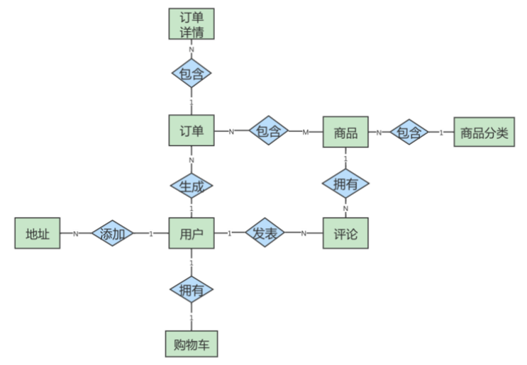

在这个图中，地址和用户之间的添加关系，是一对多的关系，而商品和商品详情示一对多的关系，商品和订单是多对多的关系。 这个 ER 模型，包括了 8个实体之间的 8种关系。

- （1）用户可以在电商平台添加多个地址；
- （2）用户只能拥有一个购物车；
- （3）用户可以生成多个订单；
- （4）用户可以发表多条评论；
- （5）一件商品可以有多条评论；
- （6）每一个商品分类包含多种商品；
- （7）一个订单可以包含多个商品，一个商品可以在多个订单里。
- （8）订单中又包含多个订单详情，因为一个订单中可能包含不同种类的商品

## 7.4 ER 模型的细化
有了这个 ER 模型，我们就可以从整体上 理解 电商的业务了。刚刚的 ER 模型展示了电商业务的框架，但是只包括了订单，地址，用户，购物车，评论，商品，商品分类和订单详情这八个实体，以及它们之间的关系，还不能对应到具体的表，以及表与表之间的关联。我们需要把 属性 加上 ，用 椭圆 来表示，这样我们得到的 ER 模型就更加完整了。

因此，我们需要进一步去设计一下这个 ER 模型的各个局部，也就是细化下电商的具体业务流程，然后把它们综合到一起，形成一个完整的 ER 模型。这样可以帮助我们理清数据库的设计思路。

接下来，我们再分析一下各个实体都有哪些属性，如下所示。

- （1） 地址实体 包括用户编号、省、市、地区、收件人、联系电话、是否是默认地址。
- （2） 用户实体 包括用户编号、用户名称、昵称、用户密码、手机号、邮箱、头像、用户级别。
- （3） 购物车实体 包括购物车编号、用户编号、商品编号、商品数量、图片文件url。
- 
- （4） 订单实体 包括订单编号、收货人、收件人电话、总金额、用户编号、付款方式、送货地址、下单时间。
- （5） 订单详情实体 包括订单详情编号、订单编号、商品名称、商品编号、商品数量。
- （6） 商品实体 包括商品编号、价格、商品名称、分类编号、是否销售，规格、颜色。
- （7） 评论实体 包括评论id、评论内容、评论时间、用户编号、商品编号
- （8） 商品分类实体 包括类别编号、类别名称、父类别编号

这样细分之后，我们就可以重新设计电商业务了，ER 模型如图：

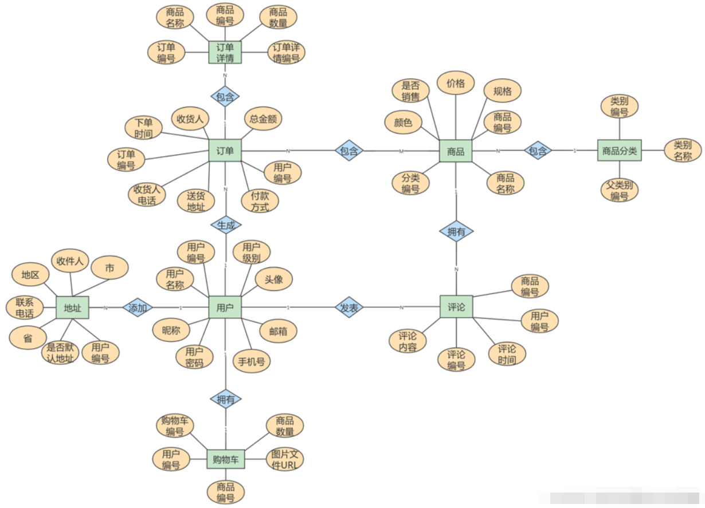

## 7.5 ER 模型图转换成数据表
通过绘制 ER 模型，我们已经理清了业务逻辑，现在，我们就要进行非常重要的一步了：把绘制好的 ER 模型，转换成具体的数据表，下面介绍下转换的原则：

- （1）一个 实体 通常转换成一个 数据表 ；
- （2）一个 多对多的关系 ，通常也转换成一个 数据表 ；
- （3）一个 1 对 1 ，或者 1 对多 的关系，往往通过表的 外键 来表达，而不是设计一个新的数据表；
- （4） 属性 转换成表的 字段 。

下面结合前面的ER模型，具体讲解一下怎么运用这些转换的原则，把 ER 模型转换成具体的数据表，从而把抽象出来的数据模型，落实到具体的数据库设计当中。

### 1）一个实体转换成一个数据表
#### 先来看一下强实体转换成数据表:

用户实体 转换成用户表(user_info）的代码如下所示。

```sql
CREATE TABLE user_info (
	`id` bigint(20)NOT NULL AUTO_INCREMENT COMMENT '编号',
    `user_ iame` varchar(206) DEFAULT NULL COMMENT '用户名称',
    `nick_name` varchar(280) DEFAULT NULL COMMENT '用户呢称',
    `passwd` varchar(288)DEFAULT NULL COMMENT '用户密码',
    `phone_num` varchar(288) DEFAULT NULL COMMENT '手机号',
    `email` varchar(200)DEFAULT NULL COMMENT '邮箱',
	`head_img` varchar (208)DEFAULT NULL COMMENT '头像',
	`user_level` varchar (288)DEFAULT NULL COMMENT '用户级别',		PRIMARY KEY (id)
) ENGINE=InnoDB AUTO_INCREMENT=4 DEFAULT CHARSET=utf8 COMMENT='用户表';
```

商品分类实体 转换成商品分类表(base_category)，由于商品分类可以有一级分类和二级分类，比如一级分类有家居、手机等等分类，二级分类可以根据手机的一级分类分为手机配件，运营商等，这里我们把商品分类实体规划为两张表，分别是一级分类表和二级分类表，之所以这么规划是因为 一级分类 和 二级分类 都是有限的，存储为两张表业务结构更加清晰。

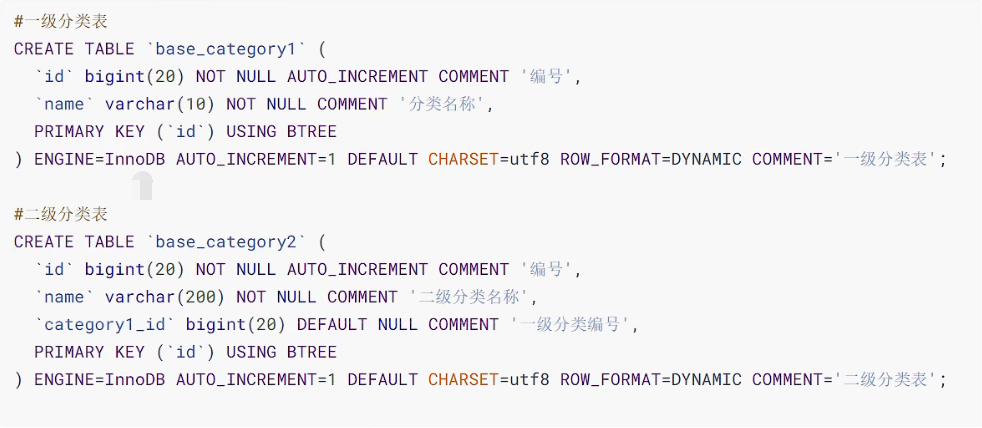

那么如果规划为一张表呢，表结构如下所示。

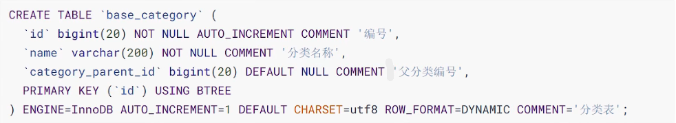

如果这样分类的话，那么查询一级分类时候，就需要判断父分类编号是否为空，但是如果插入二级分类的时候也是空，就容易造成 业务数据混乱。而且查询二级分类的时候IS NOT NULL条件是无法使用到索张的。同时，这样的设计也不符合第二范式(因为父分类编号并不依赖分类编号ID，因为父分类编号可以有很多数据为NULL)，所以需要进行表的拆分。因此无论是 业务需求 还是 数据库表的规范 来看都应该拆分为两张表。

#### 下面我们再把弱实体转换成数据表:

地址实体 转换成地址表(user_address)，如下所示


订单实体 转换成订单表（order_info)，如下所示，实际业务中订单的信息会非常多，我们这里做了简化。

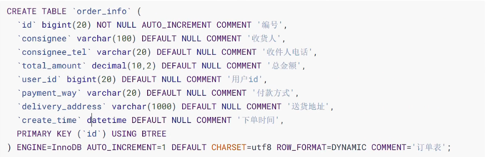

订单详情实体 转换成订单详情表(order_detail) ，如下所示。(用于体现多对多关系的，见下节)

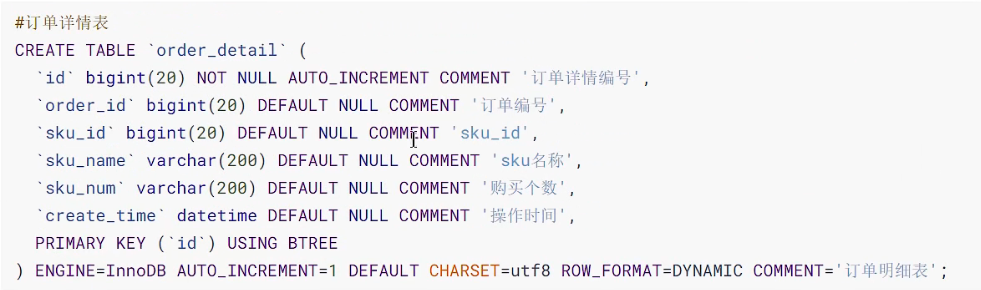

购物车实体 转换成购物车表(cart_info) ，如下所示。


评论实体 转换成评论表( members) ，如下所示。


商品实体 转换成商品表(members) ，如下所示。

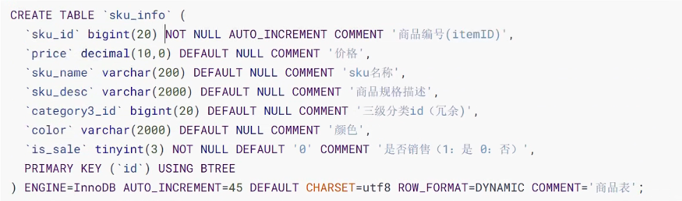

### 2) 一个多对多的关系转换成一个数据表
这个ER模型中的多对多的关系有1个，即 商品 和 订单 之间的关系，同品类的商品可以出现在不同的订单中，不同的订单也可以包含同一类型的商品，所以它们之间的关系是多对多。针对这种情况需要设计一个独立的表来示，这种表一般称为 中间表 。

我们可以设计一个独立的 订单详情表，来代表商品和订单之间的包含关系。这个表关联到2个实体，分别是 订单、商品。所以，表中必须要包括这2个实体转换成的表的主键。除此之外，我们还要包括该关系自有的属性:商品数量，商品下单价格以及商品名称。

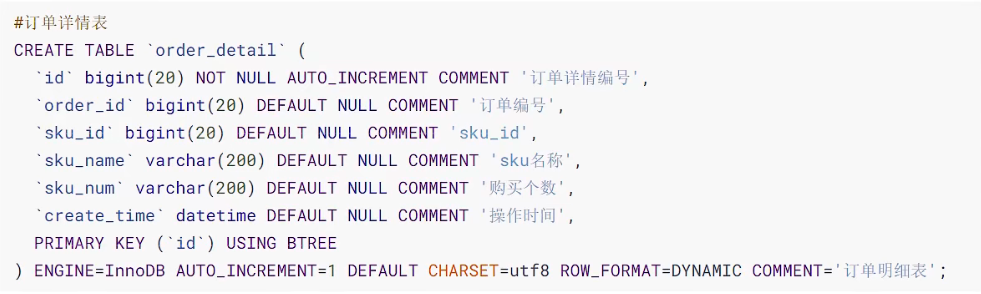

### 3) 通过外键来表达1对多的关系
在上面的表的设计中，我们可以用外键来表达1对多的关系。比如在商品评论表sku_comments中，我们分别把 `user_id、sku_id` 定义成外键，以使用下面的语句设置外键。

```sql
CONSTRAINT fk_comment_user FOREIGN KEY (user_id) REFERENCES (user_info id)

CONSTRAINT fk_comment_sku FOREIGN KEY (sku_id) REFERENCES sku_info (sku_id)
```

外键约束主要是在数据库层面上 **保证数据的一致性**，但是因为插入和更新数据需要检查外键，理论上性能会有所下降，对性能是负面的影响。

实际的项目，不建议使用外键，一方面是降低开发的复杂度 (有外键的话主从表类的操作必须先操作主表)，另外是有外键在 处理数据的时候非常麻烦。在电商平台，由于 并发业务量比较大 ，所以一般不设置外键，以免影响据库 性能。

在应用层面做数据的 一致性检查 ，本来就是一个正常的功能需求。如学生选课的场景，课程肯定不是输入的，而是通过下拉或查找等方式从系统中进行选取，就能够保证是合法的课程ID，因此就不需要靠数据库的外键来检查了。

### 4) 把属性转换成表的字段
在刚刚的设计中，我们也完成了把属性都转换成了表的字段，比如把商品属性转换成了商品信息表中的字段。

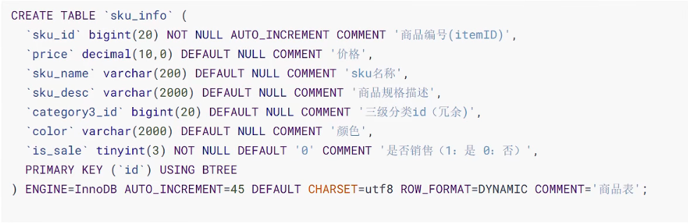

到这里，我们通过创建电商项目业务流程的ER模型，再把ER模型转换成具体的数据表的过程，完成了利用ER模型设计电商项目数据库的工作。

其实，任何一个基于数据库的应用项目，都可以通过这种 先建立 ER 模型 ，再 转换成数据表 的方式，完成数据库的设计工作。创建 ER 模型不是目的，目的是把业务逻辑梳理清楚，设计出优秀的数据库。我建议你不是为了建模而建模，要利用创建 ER 模型的过程来整理思路，这样创建 ER 模型才有意义。

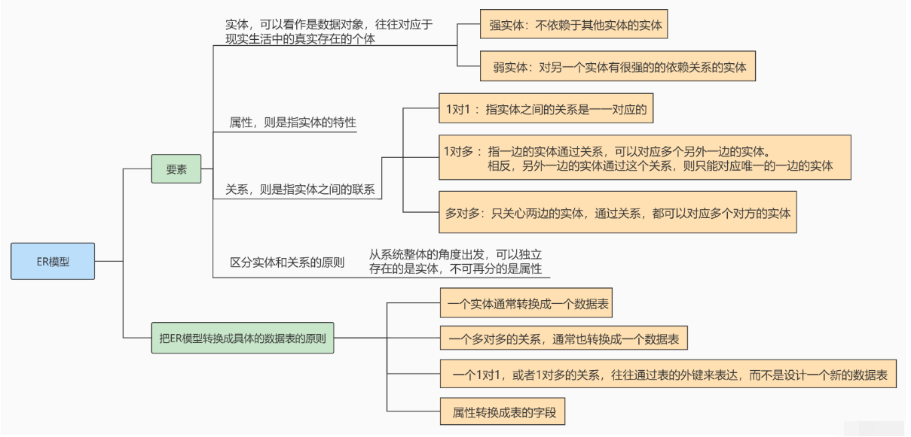

# 9. 数据表的设计原则
> 综合以上内容，总结出数据表设计的一般原则：**三少一多**

### 1. 数据表的个数越少越好

RDBMS的核心在于对实体和联系的定义，也就是E-R图(Entity Relationship Diagram)，数据表越少，证明实体和联系设计得越简洁，既方便理解又方便操作。

### 2. 数据表中的字段个数越少越好

字段个数越多，数据冗余的可能性越大。设置字段个数少的前提是各个字段相互独立，而不是某个字段的取值可以由其他字段计算出来。当然字段个数少是相对的，我们通常会在 数据冗余 和 检索效率 中进行平衡。

### 3. 数据表中联合主键的字段个数越少越好

设置主键是为了确定唯一性，当一个字段无法确定唯一性的时候，就需要采用联合主键的方式(也就是用多个字段来定义一个主键)。联合主键中的字段越多，占用的索引空间越大，不仅会加大理解难度，还会增加运行时间和索引空间，因此联合主键的字段个数越少越好。

### 4. 使用主键和外键越多越好

数据库的设计实际上就是定义各种表，以及各种字段之间的关系。这些关系越多，证明这些实体之间的冗余度越低，利用度越高。这样做的好处在于不仅保证了数据表之间的 独立性，还能提升相互之间的关联使用率。

> **三少一多** 原则的核心就是 **简单可复用** 。简单指的是用更少的表、更少的字段、更少的联合主键字段来完成数据表的设计。可复用则是通过主键、外键的使用来增强数据表之间的复用率。因为一个主键可以理解是一张表的代表。键设计得越多，证明它们之间的利用率越高。

> 注意：这个原则并不是绝对的，有时候我们需要牺牲数据的冗余度来换取数据处理的效率。

# 10. 数据库对象编写建议
> 前面我们讲了数据库的设计规范，，下面给出的这些规范适用于大多数公司，按照下面的规范来使用数据库，这样数据库可以发挥出更高的性能。

## 10.1 关于库
【强制】库的名称必须控制在32个字符以内，只能使用英文字母、数字和下划线，建议以英文字母开头。

【强制】库名中英文一律小写，不同单词采用下划线分割。须见名知意。

【强制】库的名称格式：业务系统名称_子系统名。

【强制】库名禁止使用关键字（如type,order等）。

【强制】创建数据库时必须显式指定字符集，并且字符集只能是utf8或者utf8mb4。创建数据库SQL举例：CREATE DATABASE crm_fund DEFAULT CHARACTER SET 'utf8';

【建议】对于程序连接数据库账号，遵循权限最小原则。使用数据库账号只能在一个DB下使用，不准跨库。程序使用的账号原则上不准有drop权限。

【建议】临时库以tmp_为前缀，并以日期为后缀；备份库以bak_为前缀，并以日期为后缀。

## 10.2 关于表、列
【强制】表和列的名称必须控制在32个字符以内，表名只能使用英文字母、数字和下划线，建议以英文字母开头。

【强制】 表名、列名一律小写，不同单词采用下划线分割。须见名知意。

【强制】表名要求有模块名强相关，同一模块的表名尽量使用统一前缀。比如：crm_fund_item

【强制】创建表时必须显式指定字符集为utf8或utf8mb4。

【强制】表名、列名禁止使用关键字（如type,order等）。

【强制】创建表时必须显式指定表存储引擎类型。如无特殊需求，一律为InnoDB。

【强制】建表必须有comment（注释）。

【强制】字段命名应尽可能使用表达实际含义的英文单词或缩写。如：公司 ID，不要使用 corporation_id, 而用corp_id 即可。

【强制】布尔值类型的字段命名为is_描述。如member表上表示是否为enabled的会员的字段命名为 is_enabled。

【强制】禁止在数据库中存储图片、文件等大的二进制数据。通常文件很大，短时间内造成数据量快速增长，数据库进行数据库读取时，通常会进行大量的随机IO操作，文件很大时，IO操作很耗时。通常存储于文件服务器，数据库只存储文件地址信息。

【建议】建表时关于主键：表必须有主键 

(1)强制要求主键为id，类型为int或bigint，且为auto_increment 建议使用unsigned无符号型。

(2)标识表里每一行主体的字段不要设为主键，建议设为其他字段如user_id，order_id等，并建立unique key索引。因为如果设为主键且主键值为随机插入，则会导致innodb内部页分裂和大量随机I/O，性能下降。

【建议】核心表（如用户表）必须有行数据的创建时间字段（create_time）和最后更新时间字段（update_time），便于查问题。

【建议】表中所有字段尽量都是NOT NULL属性，业务可以根据需要定义DEFAULT值。 因为使用NULL值会存在每一行都会占用额外存储空间、数据迁移容易出错、聚合函数计算结果偏差等问题。

【建议】所有存储相同数据的列名和列类型必须一致（一般作为关联列，如果查询时关联列类型不一致会自动进行数据类型隐式转换，会造成列上的索引失效，导致查询效率降低）。

【建议】中间表（或临时表）用于保留中间结果集，名称以tmp_开头。备份表用于备份或抓取源表快照，名称以bak_开头。中间表和备份表定期清理。

【示范】一个较为规范的建表语句：

```sql
CREATE TABLE user_info ( 
    `id` int unsigned NOT NULL AUTO_INCREMENT COMMENT '自增主键', 
    `user_id` bigint(11) NOT NULL COMMENT '用户id', 
    `username` varchar(45) NOT NULL COMMENT '真实姓名', 
    `email` varchar(30) NOT NULL COMMENT '用户邮箱', 
    `nickname` varchar(45) NOT NULL COMMENT '昵称', 
    `birthday` date NOT NULL COMMENT '生日', 
    `sex` tinyint(4) DEFAULT '0' COMMENT '性别', 
    `short_introduce` varchar(150) DEFAULT NULL COMMENT '一句话介绍自己，最多50个汉字', 
    `user_resume` varchar(300) NOT NULL COMMENT '用户提交的简历存放地址', 
    `user_register_ip` int NOT NULL COMMENT '用户注册时的源ip', 
    `create_time` timestamp NOT NULL DEFAULT CURRENT_TIMESTAMP COMMENT '创建时间', 
    `update_time` timestamp NOT NULL DEFAULT CURRENT_TIMESTAMP ON UPDATE CURRENT_TIMESTAMP COMMENT '修改时间', 
    `user_review_status` tinyint NOT NULL COMMENT '用户资料审核状态，1为通过，2为审核中，3为未 通过，4为还未提交审核',
    PRIMARY KEY (`id`), 
    UNIQUE KEY `uniq_user_id` (`user_id`), 
    KEY `idx_username`(`username`), 
    KEY `idx_create_time_status`(`create_time`,`user_review_status`) 
) ENGINE=InnoDB DEFAULT CHARSET=utf8 COMMENT='网站用户基本信息'
```

【建议】创建表时，可以使用可视化工具。这样可以确保表、字段相关的约定都能设置上。实际上，我们通常很少自己写 DDL 语句，可以使用一些可视化工具来创建和操作数据库和数据表。可视化工具除了方便，还能直接帮我们将数据库的结构定义转化成 SQL 语言，方便数据库和数据表结构的导出和导入。

## 10.3 关于索引
【强制】InnoDB表必须主键为id int/bigint auto_increment，且主键值禁止被更新。

【强制】InnoDB和MyISAM存储引擎表，索引类型必须为BTREE。

【建议】主键的名称以pk_开头，唯一键以uni_或uk_开头，普通索引以idx_开头，一律使用小写格式，以字段的名称或缩写作为后缀。

【建议】多单词组成的columnname，取前几个单词首字母，加末单词组成column_name。如: sample 表 member_id 上的索引：idx_sample_mid。

【建议】单个表上的索引个数不能超过6个。

【建议】在建立索引时，多考虑建立联合索引，并把区分度最高的字段放在最前面。

【建议】在多表 JOIN 的SQL里，保证被驱动表的连接列上有索引，这样JOIN 执行效率最高。

【建议】建表或加索引时，保证表里互相不存在冗余索引。 比如：如果表里已经存在key(a,b)， 则key(a)为冗余索引，需要删除。

## 10.4 SQL编写
【强制】程序端SELECT语句必须指定具体字段名称，禁止写成 *。

【建议】程序端insert语句指定具体字段名称，不要写成INSERT INTO t1 VALUES(…)。

【建议】除静态表或小表（100行以内），DML语句必须有WHERE条件，且使用索引查找。

【建议】INSERT INTO…VALUES(XX),(XX),(XX).. 这里XX的值不要超过5000个。 值过多虽然上线很快，但会引起主从同步延迟。

【建议】SELECT语句不要使用UNION，推荐使用UNION ALL，并且UNION子句个数限制在5个以内。

【建议】线上环境，多表 JOIN 不要超过5个表。

【建议】减少使用ORDER BY，和业务沟通能不排序就不排序，或将排序放到程序端去做。ORDER BY、GROUP BY、DISTINCT 这些语句较为耗费CPU，数据库的CPU资源是极其宝贵的。

【建议】包含了ORDER BY、GROUP BY、DISTINCT 这些查询的语句，WHERE 条件过滤出来的结果集请保持在1000行以内，否则SQL会很慢。

【建议】对单表的多次alter操作必须合并为一次。对于超过100W行的大表进行alter table，必须经过DBA审核，并在业务低峰期执行，多个alter需整合在一起。 因为alter table会产生表锁，期间阻塞对于该表的所有写入，对于业务可能会产生极大影响。

【建议】批量操作数据时，需要控制事务处理间隔时间，进行必要的sleep。

【建议】事务里包含SQL不超过5个。因为过长的事务会导致锁数据较久，MySQL内部缓存、连接消耗过多等问题。

【建议】事务里更新语句尽量基于主键或UNIQUE KEY，如UPDATE… WHERE id=XX;否则会产生间隙锁，内部扩大锁定范围，导致系统性能下降，产生死锁。
