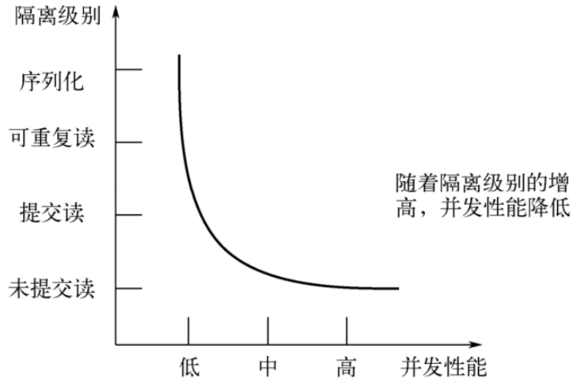

# 1. 数据库事务概述
> 事务是数据库区别于文件系统的重要特性之一，当我们有了事务就会让数据库始终保持 **一致性**，同时我们还能通过事务的机制 **恢复到某个时间点**，这样可以保证已提交到数据库的修改不会因为系统崩溃而丢失。

## 1.1 存储引擎支持情况
SHOW ENGINES 命令来查看当前 MySQL 支持的存储引擎都有哪些，以及这些存储引擎是否支持事务。


能看出在 MySQL 中，只有InnoDB 是支持事务的。

## 1.2 基本概念
### 🔹什麼是「事務」？

**事務（Transaction）** 是一組SQL語句的集合，這些語句要麼「**全部執行成功**」，要麼「**全部不執行**」。

就像「轉帳」這個例子，包含兩步操作：

1. 從 AA 的帳戶扣掉 100 元
2. 給 BB 的帳戶加上 100 元

這兩步必須一起成功，否則會造成「錢不見了」或「錢被複製了」的資料錯誤。

---

### 🔹未使用事務的情況

你的例子如下：

```sql
update account set money = money - 100 where name = 'AA';
-- 此時已經從 AA 扣了錢

-- 假設這時伺服器突然當機，導致下面這句沒執行
update account set money = money + 100 where name = 'BB';
```

🧨 問題出現了：
- AA 扣了錢 ✅
- 但 BB 沒收到錢 ❌

這就違反了我們希望「**要嘛都成功，要嘛都失敗**」的原則。

---

### ✅ 正確做法：使用事務處理轉帳

```sql
START TRANSACTION;  -- 開始一個事務

UPDATE account SET money = money - 100 WHERE name = 'AA';
UPDATE account SET money = money + 100 WHERE name = 'BB';

COMMIT;  -- 提交事務，讓修改永久生效
```

如果中間哪一步出錯了，我們就使用：

```sql
ROLLBACK;  -- 回滾，撤銷整個事務的所有操作
```

---

## 1.3 事务的ACID特性
### 原子性（atomicity）：
#### ✅ 原子性（Atomicity）是什麼？

原子性指的是：

> **一個事務中的所有操作要麼全部成功，要麼全部不執行**。沒有中間狀態，不能只執行一部分。

---

##### 🏦 轉帳例子說明原子性

假設有個銀行轉帳流程：

```sql
START TRANSACTION;

UPDATE account SET money = money - 100 WHERE name = 'A'; -- A扣100元
UPDATE account SET money = money + 100 WHERE name = 'B'; -- B加100元

COMMIT;
```

這段 SQL 是一個**事務**，如果中間出錯了（例如第二行執行時突然斷電），原子性保證這兩筆操作都不會生效，整體會被 **ROLLBACK（回滾）**。

---

##### ❌ 如果沒有原子性，會發生什麼？

假設以下情境：

```sql
UPDATE account SET money = money - 100 WHERE name = 'A'; -- 成功執行，A扣了錢

-- 突然伺服器當機，B沒加到錢
UPDATE account SET money = money + 100 WHERE name = 'B'; -- ❌ 沒執行
```

⚠️ 問題就來了：

- A 的帳戶錢少了 ✅
- B 的帳戶錢沒變 ❌
- 錢 **憑空消失了 100 元！**

這樣的情況就叫做「**資料不一致**」，而這正是 **缺乏原子性** 所造成的災難。

---

##### 🎯 用生活比喻說明原子性

想像你去便利商店買東西：
- 你交出 100 元 → 扣錢
- 店員把商品給你 → 加商品

如果過程出錯（你給錢但沒拿到商品），你一定希望能 **取消交易、退你錢** 對吧？

這種「要嘛錢和商品一起交換，要嘛什麼都不發生」的行為，就是原子性！

---

#### 💡 總結

| 概念 | 說明 |
|------|------|
| 原子性 | 保證事務中所有 SQL 操作 **全部成功或全部取消** |
| 重要性 | 防止資料不一致、錢莫名消失或增加 |
| 關鍵操作 | `START TRANSACTION` → `COMMIT` 或 `ROLLBACK` |

---

### 一致性（consistency）：
#### ✅ 一致性（Consistency）是什麼？

**一致性**是指：

> 一筆事務在執行前後，資料的狀態**必須從一個「滿足約束」的合法狀態，變到另一個也滿足約束的合法狀態。**

簡單來說，就是：  
**資料不能出現「違反邏輯或規則」的狀況！**

這些「規則」可以是：
- 表的欄位限制（如：金額不可為負、姓名不可重複）
- 業務邏輯（如：A轉給B的錢總額不變）
- 外鍵約束、唯一約束、check條件等

---

#### 📘 例子 1：A 轉帳 300 元，但只有 200 元

```sql
-- A 只有 200 元
UPDATE account SET balance = balance - 300 WHERE name = 'A';
```

如果沒開啟檢查，這行會讓 A 餘額變成 -100，資料雖然執行成功，但邏輯上是不合理的。

若你有設定：

```sql
ALTER TABLE account ADD CHECK (balance >= 0);
```

這時會報錯，並且回滾事務，因為這違反了「餘額不可為負」的 **一致性約束**。

> ✅ **一致性保護了資料的業務邏輯完整性。**

---

#### 📘 例子 2：A 扣錢成功，但 B 加錢失敗

```sql
START TRANSACTION;
UPDATE account SET balance = balance - 50 WHERE name = 'A'; -- 成功
UPDATE account SET balance = balance + 50 WHERE name = 'B'; -- 執行時斷電或失敗
COMMIT;
```

此時：
- A 扣了錢
- B 沒加錢
- A+B 的總額變少 → **錢憑空消失**

這就違反了你「定義的一致性」：  
> A帳戶 + B帳戶的總金額 = 不變

為了保障一致性，這時候資料庫應該要**回滾事務（ROLLBACK）**，將 A 的扣款也還原。

---

#### 📘 例子 3：唯一性約束被破壞

```sql
-- 表設定：姓名不可重複
ALTER TABLE users ADD UNIQUE(name);

START TRANSACTION;
INSERT INTO users(name) VALUES ('張三');  -- 表中已有 '張三'
COMMIT;
```

這時會報錯，MySQL 不允許插入重複的名字，**一致性被破壞了，事務會失敗回滾**。

---

### 隔离型（isolation）：
事务的隔离性是指一个事务的执行不能被其他事务干扰，即一个事务内部的操作及使用的数据对并发的其他事务是隔离的，并发执行的各个事务之间不能互相干扰。

如果无法保证隔离性会怎么样？假设A账户有200元，B账户0元。A账户往B账户转账两次，每次金额为50元，分别在两个事务中执行。如果无法保证隔离性，会出现下面的情形：

```sql
UPDATE accounts SET money = money - 50 WHERE NAME = 'AA';
 ​
UPDATE accounts SET money = money + 50 WHERE NAME = 'BB'
```


### 持久性（durability）：

持久性是指一个事务一旦被提交，它对数据库中数据的改变就是永久性的，接下来的其他操作和数据库故障不应该对其有任何影响。

持久性是通过事务日志来保证的。日志包括了重做日志和回滚日志。当我们通过事务对数据进行修改的时候，首先会将数据库的变化信息记录到重做日志中，然后再对数据库中对应的行进行修改。这样做的好处是，即使数据库系统崩溃，数据库重启后也能找到没有更新到数据库系统中的重做日志，重新执行，从而使事务具有持久性。

### 总结

ACID是事务的四大特性，在这四个特性中，原子性是基础，隔离性是手段，一致性是约束条件，而持久性是我们的目的。

数据库事务，其实就是数据库设计者为了方便起见，把需要保证 **原子性、隔离性、一致性 和 持久性** 的一个或多个数据库操作称为一个事务。

## 1.4 事務的五大狀態解析 + 實例

我們假設以下這筆轉帳操作為一個事務：

> 「A 從帳戶扣 100 元，轉給 B」

### 1️⃣ 活動的（Active）
> 事务对应的数据库操作正在执行过程中时，我们就说该事务处在活动的状态。

> ✔️**事務正在執行中**

- 你剛開始執行 SQL：
  
  ```sql
  START TRANSACTION;
  UPDATE accounts SET balance = balance - 100 WHERE name = 'A';
  ```

- 此時事務正在操作資料，尚未完成。

📌 對應狀態：**正在活動執行，尚未到結尾**

---

### 2️⃣ 部分提交的（Partially Committed）
> 当事务中的最后一个操作执行完成，但由于操作都在内存中执行，所造成的影响并没有刷新到磁盘时，我们就说该事务处在部分提交的状态。

> ✔️**所有 SQL 都執行完成，但還沒真正寫入磁碟**

- 你執行完最後一條語句：

  ```sql
  UPDATE accounts SET balance = balance + 100 WHERE name = 'B';
  ```

- 接著下達：

  ```sql
  COMMIT;
  ```

- **這一刻**資料還只是寫在記憶體中的 redo log、undo log，MySQL 還沒同步寫到磁碟。

📌 對應狀態：**準備提交，但還未持久化**

---

### 3️⃣ 提交的（Committed）
> > 当一个处在部分提交的状态的事务将修改过的数据都同步到磁盘上之后，我们就可以说该事务处在了提交的状态。

> ✔️**事務已經真正寫入磁碟，永久保存**

- redo log 被刷到磁碟了（fsync 操作完成）
- 事務正式完成、不可逆

這就是你想要的成功結尾狀態，資料完全保存下來，永不丟失（這也是「D = Durability 持久性」的體現）。

📌 對應狀態：**成功提交完成**

---

### 4️⃣ 失敗的（Failed）
> > 当事务处在活动的或者部分提交的状态时，可能遇到了某些错误（数据库自身的错误、操作系统错误或者直接断电等）而无法继续执行，或者人为的停止当前事务的执行，我们就说该事务处在失败的状态。

> ❌**事務執行過程中出錯**

- 假設你在執行第二條語句時（B 加錢）突然遇到錯誤，例如：
  - 資料庫磁碟損壞
  - 程式崩潰
  - 插入違反約束
  - 程式碼使用了 `ROLLBACK`

- 此時事務「無法繼續」

📌 對應狀態：**意外終止，尚未回滾**

---

### 5️⃣ 中止的（Aborted）
> > 如果事务执行了一部分而变为失败的状态，那么就需要把已经修改的事务中的操作还原到事务执行前的状态。换句话说，就是要撤销失败事务对当前数据库造成的影响。我们把这个撤销的过程称之为回滚。当回滚操作执行完毕时，也就是数据库恢复到了执行事务之前的状态，我们就说该事务处在了中止的状态。

> ❌**事務失敗後，執行了回滾操作，資料恢復到原狀**

- 如果事務失敗，MySQL 就會執行回滾（ROLLBACK）：
  
  ```sql
  ROLLBACK;
  ```

- 回滾使用 undo log，把資料復原，恢復到事務開始前的樣子

- 一旦回滾完成，稱為「中止的狀態」

📌 對應狀態：**資料回到原點，事務結束但未成功**

---

### 🔄 狀態轉換圖（簡化版）


---

### 📌 總結對照表

| 狀態             | 說明 |
|------------------|------|
| Active            | SQL 正在執行 |
| Partially Committed | SQL 全部執行完，正在提交前準備階段 |
| Committed         | 實際資料成功寫入磁碟 |
| Failed            | 事務執行過程中失敗但尚未回滾 |
| Aborted           | 執行回滾成功，恢復原狀 |

---

# 2. 如何使用事务
> 使用事务有两种方式，分别为 **显式事务** 和 **隐式事务** 。

- 事务的完成过程
  - 步骤1：开启事务
  - 步骤2：一系列的DML操作
  - ....
  - 步骤3：事务结束的状态：提交的状态(COMMIT) 、 中止的状态(ROLLBACK)

## 2.1 显式事务

### 步骤1： 
> 开启事务，START TRANSACTION 或者 BEGIN，作用是显式开启一个事务。

```sql
BEGIN; 
-- 或者 
START TRANSACTION;
```

`START TRANSACTION` 语句相较于 BEGIN 特别之处在于，后边能跟随几个修饰符：

①READ ONLY：标识当前事务是一个只读事务，也就是属于该事务的数据库操作只能读取数据，而不能修改数据。

补充:只读事务中只是不允许修改那些其他事务也能访问到的表中的数据，对于临时表来说(我们使用CREATE TMEPORARY TABLE创建的表)，由于它们只能在当前会话中可见，所以只读事务其实也是可以对临时表进行增、删、改操作的。

②READ WRITE(默认)：标识当前事务是一个读写事务，也就是属于该事务的数据库操作既可以读取数据，也可以修改数据。

③WITH CONSISTENT SNAPSHOT：启动一致性读。

比如：

```sql
 START TRANSACTION READ ONLY; --开启一个只读事务
 ​
 START TRANSACTION READ ONLY, WITH CONSISTENT SNAPSHOT; -- 开启只读事务和一致性读
 ​
 START TRANSACTION READ WRITE, WITH CONSISTENT SNAPSHOT -- 开启读写事务和一致性读
```
注意:

READ ONLY 和 READ WRITE 是用来设置所谓的事务 访问模式 的，就是以只读还是读写的方式来访问数据库中的数据，一个事务的访问模式不能同时既设置为只读的也设置为读写的，所以不能同时把 **READ ONLY 和READ WRITE** 放到 `START TRANSACTION` 语句后边。

如果我们不显式指定事务的访问模式，那么该事务的访问模式 **默认就是读写** 模式。

### 步骤2：
> 一系列事务中的操作（主要是DML，不含DDL）

### 步骤3：

> 提交事务(commit) 或 中止事务（即回滚事务，rollback）

```sql
-- 提交事务。当提交事务后，对数据库的修改是永久性的。
COMMIT;

-- 回滚事务。即撤销正在进行的所有没有提交的修改 
ROLLBACK; 
 ​
-- 将事务回滚到某个保存点。 
ROLLBACK TO [SAVEPOINT]
```

其中关于SAVEPOINT相关操作有：

```sql
-- 在事务中创建保存点，方便后续针对保存点进行回滚。一个事物中可以存在多个保存点。
SAVEPOINT 保存点名称;

-- 删除某个保存点
RELEASE SAVEPOINT 保存点名称;
```

## 2.2 隐式事务
MySQL中有一个系统变量 autocommit ：

```shell
mysql> SHOW VARIABLES LIKE 'autocommit';
+---------------+-------+
| Variable_name | Value |
+---------------+-------+
| autocommit    | ON  	|
+---------------+-------+
1 row in set (0.01 sec)
```

autocommit 默认开启状态，在此状态下每条 DML 语句都是一个独立的事务

当然，如果我们想关闭这种 **自动提交** 的功能，可以使用下边两种方法之一：

### 方式1：
> 把系统变量autocommit的值设置为OFF

```sql
SET autocommit = OFF; -- 针对于DML操作是有效的,对DDL操作是无效的
#或
SET autocommit = 0;
```

### 方式2：
> 显式的的使用 `START TRANSACTION` 或者 `BEGIN` 语句开启一个事务。这样在本次事务提交或者回滚前会暂时关闭掉自动提交的功能。

```sql
-- 我们在autocommit为true的情况下，使用start transaction或begin开启事务，那么DML操作就不会自动提交数据
START TRANSACTION; --下面俩条语句不会自动更新

update account set balance = balance - 10 where id = 1;

update account set balance = balance + 10 where id = 2;


commit; --上面俩条更新语句才会提交
```

这样的话，我们写入的多条语句就算是属于同一个事务了，直到我们显式的写出 COMMIT 语句来把这个事务提交掉，或者显式的写出 `ROLLBACK` 语句来把这个事务回滚掉。

> 补充: Oracle默认不自动提交，需要手写COMMIT命令，而MySQL默认自动提交。

## 2.3 隐式提交数据的情况
### 数据定义语言（Data definition language，缩写为：DDL）

数据库对象，指的就是 数据库、表、视图、存储过程 等结构。

当我们使用 CREATE、ALTER、DROP 等语句去修改数据库对象时，就会隐式的提交前边语句所属于的事务。即:

```sql
BEGIN ;
SELECT ... -- 事务中的一条语句

UPDATE ... -- 事务中的一条语句

...		   -- 事务中的其它语句


CREATE TABLE ... -- 此语句会隐式的提交前边语句所属于的事务
```


### 隐式使用或修改mysql数据库中的表
> 当我们使用 `ALTER USER、CREATE USER、DROP USER、GRANT、RENAME USER、REVOKE、SET PASSWORD` 等语句时也会隐式的提交前边语句所属于的事务。

### 事务控制或关于锁定的语句

① 当我们在一个事务还没提交或者回滚时就又使用 `START TRANSACTION` 或者 `BEGIN` 语句开启了另一个事务时，会隐式的提交上一个事务。

```sql
BEGIN;
SELECT ... -- 事务中的一条语句
UPDATE ... -- 事务中的一条语句
...		     -- 事务中的其它语句
BEGIN;	   -- 此语句会隐式的提交前边语句所属于的事务
```

②当前的autocommit系统变量的值为OFF，我们手动把它调为ON时，也会隐式的提交前边语句所属的事务。

③使用LOCK TABLES、UNLOCK TABLES等关于锁定的语句也会隐式的提交前边语句所属的事务。

### 加载数据的语句
> 使用 LOAD DATA 语句来批量往数据库中导入数据时，也会隐式的提交前边语句所属的事务。

### 关于MySQL复制的一些语句
> 使用 `START SLAVE、STOP SLAVE、RESET SLAVE、CHANGE MASTER TO` 等语句时会 **隐式的提交** 前边语句所属的事务。

### 其它的一些语句
> 使用 `ANALYZE TABLE、CACHE INDEX、CHECK TABLE、FLUSH、LOAD INDEX INTO CACHE、OPTIAIZE TABLE、REPAIR TABLE、RESET` 等语句也会隐式的提交前边语句所属的事务。

## 2.4 使用举例1：提交与回滚
> 我们看下在 MySQL 的默认状态下，下面这个事务最后的处理结果是什么。

### 情况1：
```sql
CREATE TABLE user(name varchar(20), PRIMARY KEY (name)) ENGINE=InnoDB;

BEGIN;
INSERT INTO user SELECT '张三';
COMMIT;


BEGIN;
INSERT INTO user SELECT '李四';
INSERT INTO user SELECT '李四';
ROLLBACK;
```

```shell
mysql> select * from user;

+--------+
| name  |
+--------+
| 张三  |
+--------+

> 1 行于数据集 (0.01 秒)
```

### 情况2：
```sql
CREATE TABLE user (name varchar(20), PRIMARY KEY (name)) ENGINE=InnoDB;

BEGIN;
INSERT INTO user SELECT '张三';
COMMIT;  -- ✅ 張三已經永久寫入

-- 以下這兩條語句並沒有用 BEGIN 包起來
INSERT INTO user SELECT '李四';  -- ✅ 立即自動提交（生效）
INSERT INTO user SELECT '李四';  -- ❌ 發生主鍵衝突錯誤，但這一條會失敗而已
ROLLBACK;                        -- ❌ 無效！因為你沒有開事務！
```

运行结果（2 行数据）：

```shell
mysql> SELECT * FROM user;
+--------+
| name  |
+--------+
| 张三  |
| 李四  |
+--------+
2 行于数据集 (0.01 秒)
```

### 情况3：
```sql
CREATE TABLE user(name varchar(255), PRIMARY KEY (name)) ENGINE=InnoDB;

SET @@completion_type = 1;

BEGIN;
INSERT INTO user SELECT '张三';
COMMIT;  -- ✅ 張三寫入並提交成功（這行之後自動開啟新事務）


INSERT INTO user SELECT '李四';     -- ✅ 在第二個事務中
INSERT INTO user SELECT '李四';     -- ❌ 主鍵衝突 → 事務錯誤
ROLLBACK;                           -- ⛔ 回滾整個第二個事務
```


运行结果（1 行数据）：

```shell
mysql> SELECT * FROM user;
+--------+
| name  |
+--------+
| 张三  |
+--------+
1 行于数据集 (0.01 秒)
```

### 總結
#### 🧩 第一部分：`completion_type` 的三種設定與影響

| 模式 | 行為 | 實際效果 |
|------|------|----------|
| `completion_type = 0`（預設） | `COMMIT` | 只提交當前事務，**不會開新事務** |
| `completion_type = 1` | `COMMIT AND CHAIN` | 提交後，**自動開啟一個新事務**（保持同樣隔離級別） |
| `completion_type = 2` | `COMMIT AND RELEASE` | 提交後，**斷開與伺服器的連線**（用於連線池） |

---

##### ✅ 範例：測試 `completion_type` 行為差異

##### 🔹 `completion_type = 0`（預設）

```sql
SET @@completion_type = 0;
START TRANSACTION;
INSERT INTO user VALUES ('Alice');
COMMIT;

-- 如果你這時執行 SQL
INSERT INTO user VALUES ('Bob');
-- ⚠️ 這一筆是單獨的事務（autocommit 生效），**並不是上一筆的延伸**
```

---

##### 🔹 `completion_type = 1`（COMMIT AND CHAIN）

```sql
SET @@completion_type = 1;
START TRANSACTION;
INSERT INTO user VALUES ('Alice');
COMMIT;
-- 👇 COMMIT 後自動開啟新事務！

INSERT INTO user VALUES ('Bob');
ROLLBACK;
-- ❌ 'Bob' 將會被回滾，因為在自動開啟的新事務中
```

---

##### 🔹 `completion_type = 2`（COMMIT AND RELEASE）

```sql
SET @@completion_type = 2;
START TRANSACTION;
INSERT INTO user VALUES ('Alice');
COMMIT;
-- ⚠️ 資料庫主動斷開連線
-- 如果你在 CLI 或應用層會看到「MySQL server has gone away」
```

這種用於某些 **應用程式自動關閉連線的情境**（例如安全性策略或連線池釋放）。

---

#### 🧩 第二部分：`autocommit` 的配合行為

##### 🔹 autocommit = 1（預設）

```sql
-- 每條語句都是一個單獨事務，自動提交
INSERT INTO user VALUES ('Tom');  -- ✅ 自動生效
ROLLBACK;                         -- ❌ 無效
```

✅ 若你顯式開啟事務：

```sql
START TRANSACTION;
INSERT INTO user VALUES ('Jerry');
ROLLBACK;  -- ✅ 此時會生效，因為進入手動事務模式
```

---

##### 🔹 autocommit = 0

```sql
SET autocommit = 0;

-- 你必須手動 COMMIT
INSERT INTO user VALUES ('Anna');
-- ⚠️ 如果沒有 COMMIT，這筆資料不會持久化到磁碟
```

即使你沒有用 `BEGIN`，這筆語句也**會進入一個隱含事務中**，需要 COMMIT/ROLLBACK 決定最終命運。

---

#### ✅ 小結對照表

| 行為情境 | 結果 |
|----------|------|
| `completion_type = 0` + `autocommit = 1` | 預設模式，COMMIT 就結束事務 |
| `completion_type = 1` + `autocommit = 1` | COMMIT 後自動進入下一個事務 |
| `completion_type = 2` + `autocommit = 1` | COMMIT 後直接關閉連線 |
| `autocommit = 0` | 每條語句都在事務中，**必須明確 COMMIT 或 ROLLBACK** |

---

## 2.5 使用举例2：测试不支持事务的engine
### 建表
```sql
CREATE TABLE test1(i INT) ENGINE = INNODB;
CREATE TABLE test2(i INT) ENGINE = MYISAM;
```

### 针对于innodb表：支持事务
```sql
BEGIN
INSERT INTO test1 VALUES (1);
ROLLBACK;
SELECT * FROM test1;  -- 可以回滚，结果没有数据
```

### 针对于myisam表：不支持事务
```sql
BEGIN
INSERT INTO test2 VALUES (1);
ROLLBACK;
SELECT * FROM test2;  -- 不能回滚，结果有数据
```

## 2.6 使用举例3：SAVEPOINT
### 创建表：
```sql
CREATE TABLE user3(NAME VARCHAR(15),balance DECIMAL(10,2));
```

### 插入数据
```sql
INSERT INTO user3(NAME,balance) VALUES('张三',1000);
```

### 设置savepoint点
```sql
BEGIN;
UPDATE user3 SET balance = balance - 100 WHERE NAME = '张三';
UPDATE user3 SET balance = balance - 100 WHERE NAME = '张三';
SAVEPOINT s1; -- 设置保存点

UPDATE user3 SET balance = balance + 1 WHERE NAME = '张三';

ROLLBACK TO s1; -- 回滚到保存点，注意，保存点并不是事务的最终状态，只是一次事务过程中的中间状态；事务要么commit成功，要么rollback回滚，

SELECT * FROM user3;

ROLLBACK; -- 回滚操作 ,回滚到事务之前，即还没有上面俩次更新之前的状态

SELECT * FROM user3;
```

# 3. 事务隔离级别
MySQL 是一个 **客户端／服务器** 架构的软件，对于同一个服务器来说，可以有若干个客户端与之连接，每个客户端与服务器连接上之后，就可以称为一个会话（ Session ）。每个客户端都可以在自己的会话中向服务器发出请求语句，一个请求语句可能是某个事务的一部分，也就是对于服务器来说可能同时处理多个事务。事务有 **隔离性** 的特性，理论上在某个事务 **对某个数据进行访问** 时，其他事务应该进行 **排队** ，当该事务提交之后，其他事务才可以继续访问这个数据。但是这样对 **性能影响太大** ，我们既想保持事务的隔离性，又想让服务器在处理访问同一数据的多个事务时 **性能尽量高些** ，那就看二者如何权衡取舍了。

## 3.2 数据并发问题
针对事务的隔离性和并发性，我们怎么做取舍呢？先看一下访问相同数据的事务在 不保证串行执行 （也就是执行完一个再执行另一个）的情况下可能会出现哪些问题：

### 1. 脏写（Dirty Write）
> 对于两个事务 Session A、Session B，如果事务 Session A 修改了另一个未提交事务Session B 修改过的数据，那就意味着发生了 **脏写**


Session A和Session B各开启了一个事务，Session B中的事务先将studentno列为1的记录的name列更新为'李四'，然后Session A中的事务接着又把这条studentno列为1的记录的name列更新为'张三'。如果之后Session B中的事务进行了回滚，那么Session A中的更新也将不复存在，这种现象就称之为脏写。这时Session A中的事务就没有效果了，明明把数据更新了，最后也提交事务了，最后看到的数据什么变化也没有。这里大家对事务的隔离级比较了解的话，会发现默认隔离级别下，上面sessionA中的更新语句会处于等待状态，这里只是跟大家说明一下会出现这样现象。

### 2. 脏读（Dirty Read）
对于两个事务 Session A、Session B，Session A读取了已经被 Session B更新但还没有被提交的字段。之后若 Session B回滚，Session A读取的内容就是临时且无效的。


Session A和Session B各开启了一个事务，Session B中的事务先将studentno列为1的记录的name列更新为'张三'，然后Session A中的事务再去查询这条studentno为1的记录，如果读到列name的值为'张三'，而Session B中的事务稍后进行了回滚，那么Session A中的事务相当于读到了一个不存在的数据，这种现象就称之为 脏读。

### 3. 不可重复读（Non-Repeatable Read）
对于两个事务Session A、Session B，Session A读取了一个字段，然后 Session B更新了该字段且commit。 之后Session A再次读取同一个字段，值就不同了。那就意味着发生了不可重复读。


我们在Session B中提交了几个 隐式事务 （注意是隐式事务，意味着语句结束事务就提交了），这些事务都修改了studentno列为1的记录的列name的值，每次事务提交之后，如果Session A中的事务都可以查看到最新的值，这种现象也被称之为 不可重复读 。

### 4. 幻读（Phantom）
对于两个事务Session A、Session B, Session A 从一个表中读取了一个字段, 然后 Session B 在该表中插入了一些新的行。 之后, 如果 Session A再次读取同一个表, 就会多出几行。那就意味着发生了幻读。

 

Session A中的事务先根据条件 `studentno > 0` 这个条件查询表 student，得到了name列值为'张三'的记录；之后Session B中提交了一个 **隐式事务** ，该事务向表student中插入了一条新记录；之后Session A中的事务再根据相同的条件 `studentno > 0` 查询表student，得到的结果集中包含Session B中的事务新插入的那条记录，这种现象也被称之为 **幻读** 。我们把新插入的那些记录称之为 **幻影记录** 。

##### 注意1：
有的同学会有疑问，那如果Session B中剔除了一些符合 `studentno > 0` 的记录而不是插入新记录，那么Session A之后再根据 `studentno > 0` 的条件读取的记录变少了，这种现象算不算幻读呢？

这种现象不属于幻读，幻读强调的是一个事物按照某个相同条件多次读取记录时，**后读取时读到了之前没有读到的记录**。

##### 注意2：
那对于先前已经读到的记录，之后又读取不到这种情况，算啥呢？

这相当于对每一条记录都发生了不可重复读的现象。幻读只是重点强调了读取到之前读取没有获取到的记录。

## 3.3 SQL中的四种隔离级别
上面介绍了几种并发事务执行过程中可能遇到的一些问题，这些问题有轻重缓急之分，我们给这些问题按照严重性来排一下序：

```sql
脏写 > 脏读 > 不可重复读 > 幻读
```

> 我们愿意舍弃一部分隔离性来换取一部分性能在这里就体现在：设立一些隔离级别，隔离级别越低，并发问题发生的就越多。

### SQL标准中设立了4个隔离级别：

1. **READ UNCOMMITTED：** 读未提交，在该隔离级别，所有事务都可以看到其他未提交事务的执行结果。不能避免脏读、不可重复读、幻读。

2. **READ COMMITTED：** 读已提交，它满足了隔离的简单定义：一个事务只能看见已经提交事务所做的改变。这是大多数数据库系统的默认隔离级别（但不是MySQL默认的）。可以避免脏读，但不可重复读、幻读问题仍然存在。

3. **REPEATABLE READ：** 可重复读，事务A在读到一条数据之后，此时事务B对该数据进行了修改并提交，那么事务A再读该数据，读到的还是原来的内容。可以避免脏读、不可重复读，但幻读问题仍然存在。这是MySQL的默认隔离级别。

4. **SERIALIZABLE：** 可串行化，确保事务可以从一个表中读取相同的行。在这个事务持续期间，禁止其他事务对该表执行插入、更新和删除操作。所有的并发问题都可以避免，但性能十分低下。能避免脏读、不可重复读和幻读。

SQL标准 中规定，针对不同的隔离级别，并发事务可以发生不同严重程度的问题，具体情况如下：


> 脏写 怎么没涉及到？因为脏写这个问题太严重了，不论是哪种隔离级别，都不允许脏写的情况发生。 

不同的隔离级别有不同的现象，并有不同的锁和并发机制，隔离级别越高，数据库的并发性能就越差，4种事务隔离级别与并发性能的关系如下：



## 3.4 MySQL支持的四种隔离级别
> 不同的数据库厂商对SQL标准中规定的四种隔离级别支持不一样。比如，Oracle 就只支持READ COMMITTED〈默认隔离级别）和 SERIALIZABLE 隔离级别。MySQL 虽然支持4种隔离级别，但与SQL标准中所规定的各级隔离级别允许发生的问题却有些出入，MySQL 在 REPEATABLE READ 隔离级别下，是可以禁止幻读问题的发生的，禁止幻读的原因我们在第16章讲解。

MySQL的默认隔离级别为 REPEATABLE READ，我们可以手动修改一下事务的隔离级别。


### 查看隔离级别

##### MySQL 5.7.20的版本之前：

```shell
mysql> SHOW VARIABLES LIKE 'tx_isolation';
+---------------+-----------------+
| Variable_name | Value      |
+---------------+-----------------+
| tx_isolation | REPEATABLE-READ |
+---------------+-----------------+
1 row in set (0.00 sec)
```

##### MySQL 5.7.20版本之后

引入 `transaction_isolation` 来替换 `tx_isolation`

查看隔离级别，MySQL 5.7.20的版本及之后：

```shell
mysql> SHOW VARIABLES LIKE 'transaction_isolation';

+-----------------------+-----------------+
| Variable_name         | Value           |
+-----------------------+-----------------+
| transaction_isolation | REPEATABLE-READ |
+-----------------------+-----------------+
1 row in set (0.02 sec)
```

或者不同MySQL版本中都可以使用的：

```sql
SELECT @@transaction_isolation;
```

## 3.5 如何设置事务的隔离级别
通过下面的语句修改事务的隔离级别：

```sql
SET [GLOBAL|SESSION] TRANSACTION ISOLATION LEVEL 隔离级别; 
```

- 其中，隔离级别格式：
  - READ UNCOMMITTED
  - READ COMMITTED
  - REPEATABLE READ
  - SERIALIZABLE

或者：

```sql
SET [GLOBAL|SESSION] TRANSACTION_ISOLATION = '隔离级别' 
```

- 其中，隔离级别格式：
  - READ-UNCOMMITTED
  - READ-COMMITTED
  - REPEATABLE-READ
  - SERIALIZABLE

关于设置时使用GLOBAL或SESSION的影响：

### 使用 GLOBAL 关键字（在全局范围影响）：

```sql
SET GLOBAL TRANSACTION ISOLATION LEVEL SERIALIZABLE;
-- 或
SET GLOBAL TRANSACTION_ISOLATION = 'SERIALIZABLE';
```

> 则：当前已经存在的会话无效，只对执行完该语句之后产生的会话起作用

### 使用 SESSION 关键字（在会话范围影响）：
```sql
SET SESSION TRANSACTION ISOLATION LEVEL SERIALIZABLE;
-- 或
SET SESSION TRANSACTION_ISOLATION = 'SERIALIZABLE';
```

- 则：
  - 对当前会话的所有后续的事务有效，如果在事务之间执行，则对后续的事务有效
  - 该语句可以在已经开启的事务中间执行，但不会影响当前正在执行的事务

如果在服务器启动时想改变事务的默认隔离级别，可以修改启动参数 `transaction_isolation` 的值。比如，在启动服务器时指定了 `transaction_isolation=SERIALIZABLE` ，那么事务的默认隔离级别就从原来的 `REPEATABLE-READ` 变成了 `SERIALIZABLE`

> 小结： 数据库规定了多种事务隔离级别，不同隔离级别对应不同的干扰程度，隔离级别越高，数据一致性就越好，但并发性越弱。

## 3.6 不同隔离级别举例
### 表中的数据如下:


### 演示1：读未提交之脏读 设置隔离级别为未提交读：


事务1和事务2的执行流程如下：


### 演示2：读已提交


设置隔离级别为可重复读，事务的执行流程如下：


### 演示3：幻读


> 这里要灵活的 **理解读取** 的意思，第一次select是读取，第二次的 insert 其实也属于隐式的读取，只不过是在 mysql 的机制中读取的，插入数据也是要先读取一下有没有主键冲突才能决定是否执行插入。

> 幻读，并不是说两次读取获取的结果集不同，幻读侧重的方面是某一次的select 操作得到的结果所表征的数据状态无法支撑后续的业务操作。更为具体一些: select某记录是否存在，不存在，准备插入此记录，但执行insert时发现此记录已存在，无法插入，此时就发生了幻读。

> 在RR隔离级别下，step1、step2 是会正常执行的，step3 则会报错主键冲突，对于事务1的业务来说是执行失败的，这里事务1就是发生了幻读，因为事务1在step1中读取的数据状态并不能支撑后续的业务操作，事务1:“见鬼了，我刚才读到的结果应该可以支持我这样操作才对啊，为什么现在不可以”。事务1不敢相信的又执行了step4，发现和setp1读取的结果是一样的(RR下的MVCC机制)。此时，幻读无疑已经发生，事务1无论读取多少次，都查不到 id =3的记录，但它的确无法插入这条他通过读取来认定不存在的记录(此数据已被事务2插入)，对于事务1来说，它幻读了。

> 其实RR也是可以避免幻读的，通过对select操作手动加 行X锁(独占锁)(SELEC ...FOR UPDATE这也正是 SERIALIZABLE隔离级别下会隐式为你做的事情)。同时，即便当前记录不存在，比如id = 3是不存在的，当前事务也会获得一把记录锁(因为InnoDB的行锁锁定的是索引，故记录实体存在与否没关系，存在就加 行X锁，不存在就加 间隙锁 ），其他事务则无法插入此索引的记录，故杜绝了幻读。 在 SERIALIZABLE隔离级别下，step1执行时是会隐式的添加 行(X)锁/ gap(x)锁的，从而step2 会被阻塞,step3 会正常执行，待事务1提交后，事务2才能继续执行（主键冲突执行失败)，对于事务1来说业务是正确的，成功的阻塞扼杀了扰乱业务的事务2，对于事务1来说他前期读取的结果是可以支撑其后续业务的。 所以MySQL的幻读并非什么读取两次返回结果集不同，而是事务在插入事先检测不存在的记录时，惊奇的发现这些数据已经存在了，之前的检测读获取到的数据如同鬼影一般。

> 所以MySQL的幻读并非什么读取两次返回结果集不同，而是事务在插入事先检测不存在的记录时，惊奇的发现这些数据已经存在了，之前的检测读获取到的数据如同鬼影一般。

# 4. 事务的常见分类
从事务理论的角度来看，可以把事务分为以下几种类型：

扁平事务（Flat Transactions）

带有保存点的扁平事务（Flat Transactions with Savepoints）

链事务（Chained Transactions）

嵌套事务（Nested Transactions）

分布式事务（Distributed Transactions）

下面分别介绍这几种类型:

## 4.1 扁平事务（Flat Transactions）
### ✅ 一、什麼是「扁平事務」？

扁平事務（Flat Transaction）：
> 是一段 **沒有子結構**、沒有嵌套的單一事務。  
> 它從 `BEGIN` 開始，到 `COMMIT` 或 `ROLLBACK` 結束，**中間所有操作要嘛全部成功、要嘛全部失敗**。

它就像是「**全有或全無的交易流程**」。

---

### 🔁 二、扁平事務的流程圖

```plaintext
    ┌──────────────┐
    │ BEGIN WORK   │
    └────┬─────────┘
         │
         ▼
    執行一連串操作
         │
         ▼
  ┌────────────┐    ┌────────────┐
  │ COMMIT     │ or │ ROLLBACK   │
  └────────────┘    └────────────┘
```

---

### 📦 三、範例：銀行轉帳場景

```sql
START TRANSACTION;

UPDATE accounts SET balance = balance - 100 WHERE name = 'A'; -- A 扣 100
UPDATE accounts SET balance = balance + 100 WHERE name = 'B'; -- B 加 100

COMMIT; -- 整體提交
```

#### 若中間發生錯誤

```sql
START TRANSACTION;

UPDATE accounts SET balance = balance - 100 WHERE name = 'A'; -- ✅ 扣錢成功

-- 第二條出錯：主鍵違反或斷線
UPDATE accounts SET balance = balance + 100 WHERE name = 'B'; -- ❌ 發生錯誤

ROLLBACK; -- 取消整筆操作（A 的錢也會還回來）
```

---

### 🎯 四、特性總結

| 特性 | 說明 |
|------|------|
| ✅ 原子性 | 操作是整體的，全做或全不做 |
| ✅ 易用性 | 不需要考慮嵌套、階段提交 |
| ❌ 無法局部提交 | 不能只提交前半段，後半段回滾 |
| 🔁 高使用頻率 | 絕大多數應用場景（Web系統、ERP等）都是扁平事務 |

---

### 🧠 五、生活化比喻

#### 🚕 像搭計程車付款的過程：

1. **上車 → BEGIN**
2. **行駛中，停紅燈、繞路等 → 操作進行中**
3. **安全下車並付款 → COMMIT**
4. **途中你發現司機走錯路要求中止 → ROLLBACK，全程無效**

不能說「我只付前半段」，**要嘛整趟成立、要嘛整趟作廢**，這就是扁平事務。

---

### 📌 六、扁平事務的三種結果對應

| 結果 | 說明 | 範例 |
|------|------|------|
| ① 成功提交（約96%） | 操作正常結束 | A轉B成功並提交 |
| ② 程式中斷（約3%） | 例外處理 → 回滾 | 抓到例外後主動 `ROLLBACK` |
| ③ 外部中斷（約1%） | 如伺服器斷電、連線逾時 | 中間發生非預期錯誤，自動回滾 |

---

### ✅ 總結一句話

> **扁平事務就是「全有或全無」的一次性操作**，簡單、安全，在 MySQL 中最常見，用於確保資料一致性，是我們寫程式最常用的事務模型。

---

## 4.2 带有保存点的扁平事务（Flat Transactions with Savepoints）
### ✅ 一、什麼是「帶有保存點的扁平事務」？

它仍然是**一個完整的扁平事務（從 `BEGIN` 到 `COMMIT/ROLLBACK`）**，但允許中途設立「**保存點（SAVEPOINT）**」，在錯誤發生時 **回滾至某個保存點**，而不是整筆資料都失效。

#### 🚨 和嵌套事務不同：  
- 它 **不是事務中再包事務**（那叫嵌套事務，MySQL 不真正支援）  
- 而是用 `SAVEPOINT` + `ROLLBACK TO` 模擬「部分回滾」

---

### 🧪 二、使用範例：訂單流程

假設我們正在執行一個訂單處理流程：

```sql
START TRANSACTION;

-- Step 1: 扣庫存
UPDATE products SET stock = stock - 1 WHERE id = 101;

SAVEPOINT step1;  -- 設置保存點

-- Step 2: 記錄積分（可選步驟）
INSERT INTO user_points(user_id, points) VALUES (1, 10);

SAVEPOINT step2;

-- Step 3: 發送通知（假設這一步出錯）
INSERT INTO notify_queue(message) VALUES ('Order confirmed');
-- ❌ 模擬這一行發生錯誤

ROLLBACK TO step2;  -- 只撤銷通知，但保留前面兩步

COMMIT;
```

#### ✅ 最終結果是：
- 商品扣庫存 ✅
- 用戶得積分 ✅
- 發送通知 ❌（因為錯誤回滾）
- 整筆事務仍然 `COMMIT`，只排除錯誤段

---

### 🗂️ 三、相關語法整理

| 語法 | 說明 |
|------|------|
| `SAVEPOINT 名稱` | 設立保存點 |
| `ROLLBACK TO 名稱` | 回到某個保存點（**不結束事務**） |
| `RELEASE SAVEPOINT 名稱` | 釋放保存點 |
| `ROLLBACK` | 回到事務最開始（全回滾） |

---

### 🔁 四、流程圖示意

```plaintext
BEGIN
  ↓
扣庫存 → SAVEPOINT step1
  ↓
加積分 → SAVEPOINT step2
  ↓
通知錯誤 → ROLLBACK TO step2
  ↓
COMMIT（提交扣庫存 & 積分）
```

---

### 💡 五、使用場景與好處

| 場景 | 為什麼用 SAVEPOINT |
|------|-------------------|
| 可接受部分成功 | 例如訂單部分成功、部分選配功能失敗 |
| 減少回滾成本 | 遇到錯誤時不必回頭全部重做 |
| 提升靈活性 | 複雜交易邏輯中的錯誤容忍控制 |

---

### ✅ 小結：純扁平 vs 帶保存點的扁平事務比較

| 比較項 | 純扁平事務 | 帶保存點的扁平事務 |
|--------|------------|--------------------|
| 回滾能力 | 只能整筆回滾 | 可以回滾至中途保存點 |
| 彈性 | 小 | 高 |
| 使用難度 | 簡單 | 稍複雜但常用於實務 |
| 範例 | 金流失敗整筆退回 | 部分操作錯誤不影響整體流程 |

---

## 4.3 链事务（Chained Transactions）
### 🔍 一、什麼是「鏈事務」？

> 鏈事務是**一連串子事務鏈接起來的操作**，每次子事務完成後，就**釋放當前資源與鎖**，並「傳遞上下文」給下一筆子事務。

你可以把它理解為：

- 🚗 **從一站到另一站，中途會停靠釋放部分資源**
- ✅ 每站都 `COMMIT` 成功才能繼續往下
- ❌ 若發生錯誤，只能回到最近的子事務，不支援跳回前面保存點

---

### 🆚 二、與「帶保存點的扁平事務」比較

| 項目 | 保存點式扁平事務 | 鏈事務（Chained Transaction） |
|------|------------------|------------------------------|
| 回滾能力 | 可以 `ROLLBACK TO` 任意保存點 | 只能回到**當前子事務** |
| 鎖 | 不會釋放之前持有的鎖 | 每次 `COMMIT` 後會釋放鎖 |
| 保存點生存期 | 保存點在系統崩潰後會消失 | 每個子事務獨立提交，支援更穩定的持久化 |
| 運作形式 | 一個大事務裡塞多個 SAVEPOINT | 一串連續、每段皆獨立 `COMMIT` 的事務 |
| 實現機制 | 常見於應用層顯式 `SAVEPOINT` 控制 | 常見於特定框架 / 資料庫內部連鎖提交 |

---

### 🧪 三、模擬例子：三步驟的資料處理流程

#### 🔹 普通扁平事務（用保存點）

```sql
START TRANSACTION;

SAVEPOINT sp1;
INSERT INTO A VALUES (...);

SAVEPOINT sp2;
INSERT INTO B VALUES (...);

SAVEPOINT sp3;
INSERT INTO C VALUES (...);

-- 假設 C 出錯
ROLLBACK TO sp2;
-- 後面再 COMMIT，則 A 與 B 寫入，C 被取消
COMMIT;
```

#### 🔹 鏈事務模擬邏輯（不等同語法）

```sql
-- 第一段子事務
START TRANSACTION;
INSERT INTO A VALUES (...);
COMMIT;  -- ✅ 提交並釋放鎖

-- 第二段子事務
START TRANSACTION;
INSERT INTO B VALUES (...);
COMMIT;  -- ✅ 提交並釋放鎖

-- 第三段子事務
START TRANSACTION;
INSERT INTO C VALUES (...);
-- ❌ 錯誤發生，ROLLBACK 僅影響這段
ROLLBACK;
```

> 📌 若 `C` 出錯，A 與 B 的修改仍然保存，因為它們已經在子事務中成功 `COMMIT`。

---

### 🧭 四、流程圖：鏈事務 vs 保存點事務

```
保存點事務（單一事務包住）：
  [BEGIN]
     ├── A 操作
     ├── SAVEPOINT 1
     ├── B 操作
     ├── SAVEPOINT 2
     ├── C 操作
     └── COMMIT or ROLLBACK TO SAVEPOINT

鏈事務（多段串接）：
  [BEGIN + COMMIT] → A
      ↓
  [BEGIN + COMMIT] → B
      ↓
  [BEGIN + ROLLBACK] → C（失敗只影響 C）
```

---

### 💡 應用場景與優點

| 適合場景 | 原因 |
|----------|------|
| 大批量資料處理（如導入數據） | 每段處理完立即釋放鎖，減少鎖等待與鎖競爭 |
| 任務分段提交的流程 | 每一步都可單獨檢查與提交 |
| 當系統有崩潰風險時 | 避免整筆操作丟失，只損失最後失敗那段 |

---

### ✅ 小結：一句話搞懂鏈事務

> **鏈事務 = 多個可獨立提交的子事務串接在一起**，每段成功即提交、釋放鎖，下一段繼續執行。相比純扁平事務，它更**資源友善與彈性高**，但**無法回滾到更早狀態**。

---

## 4.4 嵌套事务（Nested Transactions）
### ✅ 一、什麼是「嵌套事務」？

> 嵌套事務就是在一筆主事務（Top-Level Transaction）中，還可以**啟動子事務（Subtransaction）**，每個子事務可以有自己的提交與回滾控制。

你可以把它理解成一棵 **事務控制的樹狀結構**：

```
頂層事務（T1）
│
├─ 子事務（T1.1）
│   └─ 子事務（T1.1.1）
│
└─ 子事務（T1.2）
```

---

### 🧪 二、理想嵌套事務的運作規則

1. **子事務可以提交或回滾，但不會立即改變資料庫狀態**
2. **只有當最上層事務提交時，所有已提交的子事務才會真正寫入資料庫**
3. 如果 **上層事務回滾，所有下層已提交的子事務也會一併回滾**

---

### ❌ 三、MySQL 原生支援嵌套事務嗎？

➡️ **不支援！MySQL（包括 InnoDB）並不支援真正的嵌套事務。**

你不能這樣寫：

```sql
START TRANSACTION;
  ...
  START TRANSACTION; -- ❌ 無效，會自動隱式 COMMIT 前一筆事務
    ...
  COMMIT;
COMMIT;
```

🧨 MySQL 只會視為**兩筆平行事務，前一筆已經被隱式結束**。

---

### ✅ 四、那怎麼模擬嵌套事務呢？──使用 SAVEPOINT

雖然 MySQL 不支援嵌套事務，但你可以用 `SAVEPOINT` + `ROLLBACK TO` 來**模擬類似嵌套的效果**：

```sql
START TRANSACTION;

-- 像是第一層事務
UPDATE account SET balance = balance - 100 WHERE name = 'A';

SAVEPOINT sp1;

-- 模擬子事務
UPDATE log SET status = 'error' WHERE id = 123;

-- 發生錯誤時回到保存點
ROLLBACK TO sp1;

-- 其他部分繼續執行
UPDATE audit SET checked = 1 WHERE id = 5;

COMMIT;
```

🧠 這就是用保存點模擬嵌套事務的一種方法。

---

### 🔁 五、圖解比較

#### ✅ 真正嵌套事務（理論上）
```
START T1
  └── START T1.1
        └── START T1.1.1
        └── COMMIT T1.1.1
    └── COMMIT T1.1
└── COMMIT T1  → ✅ 全部資料才真正寫入
```

#### ⚠️ MySQL 模擬方式
```
START TRANSACTION
  └── SAVEPOINT sp1
        └── 模擬子事務操作
        └── ROLLBACK TO sp1（如錯誤）
  └── COMMIT
```

---

### 🧰 六、應用場景舉例

| 應用場景 | 原因 |
|----------|------|
| 需要多段資料操作，但允許部分失敗 | 像訂單流程中：支付成功，但通知發送失敗時只回滾通知部分 |
| 模組化開發中，子模組可能失敗 | 每個模組操作像一個子事務，可設定 SAVEPOINT 控制 |
| 長事務避免全域回滾 | 利用 SAVEPOINT 局部回滾提高效率 |

---

### ✅ 小結一句話

> 雖然 MySQL 不支援真正的「嵌套事務」，但可以透過 `SAVEPOINT` + `ROLLBACK TO` 模擬「子事務控制」，實現更細緻的回滾管理，提升事務彈性與容錯性。

---

## 4.5 分布式事务（Distributed Transactions）
### ✅ 一、什麼是分布式事務？

> 分布式事務 = **一個事務需要跨越兩個以上的資料源（通常分佈在不同伺服器上）共同完成，且要保證整體的一致性（要嘛都成功，要嘛都失敗）**

---

### 🏦 二、例子：跨行轉帳

#### 假設場景：

- 使用者從 **招商銀行（CMB）** 的帳戶轉出 1000 元
- 匯入 **工商銀行（ICBC）** 的帳戶

這兩個操作分別對應兩個不同伺服器的資料庫（甚至是不同銀行的系統），整筆操作需要被視為**一個完整的事務**。

#### 必須滿足：
- 如果招商銀行扣了錢，但工商銀行那邊沒加錢 ❌ → 錢消失
- 如果工商銀行加了錢，但招商銀行沒扣錢 ❌ → 錢多了
- 所以必須：「**兩邊都成功才算成功，有一邊錯了就全部回滾**」

---

### 🔧 三、MySQL 本身支援分布式事務嗎？

MySQL **原生不直接支援跨資料庫的分布式事務**，但有兩種常見方式實作：

#### 1. ✉️ **兩階段提交（2PC, Two Phase Commit）**

這是最傳統也最標準的做法：

| 階段 | 說明 |
|------|------|
| **第一階段：預提交（prepare）** | 各資料庫都收到預提交請求，先記錄但不實際提交 |
| **第二階段：正式提交（commit）或回滾（rollback）** | 若所有節點都預備成功 → 執行 commit；否則 rollback |

✅ 保證一致性，但缺點是：**效率較慢、容易死鎖、崩潰時不好恢復**

#### 2. 🛠️ 使用 **中間件 / 協調者（TM）**

例如：

- 阿里開源的 **Seata**
- Spring 的 **JTA + Atomikos**
- XA 協議（MySQL 支援）

用這些協調者來控制多個資料庫的提交和回滾流程。

---

### 📘 四、簡單示意範例（MySQL + XA）

```sql
-- 銀行A：招商銀行
XA START 'cmb-tx';
UPDATE cmb_account SET balance = balance - 1000 WHERE name = 'UserA';
XA END 'cmb-tx';
XA PREPARE 'cmb-tx';

-- 銀行B：工商銀行
XA START 'icbc-tx';
UPDATE icbc_account SET balance = balance + 1000 WHERE name = 'UserB';
XA END 'icbc-tx';
XA PREPARE 'icbc-tx';

-- 最終決策（協調者）
-- 如果都沒出錯
XA COMMIT 'cmb-tx';
XA COMMIT 'icbc-tx';

-- 如果任何一方出錯
-- XA ROLLBACK 'cmb-tx';
-- XA ROLLBACK 'icbc-tx';
```

> 📌 `XA` 是 MySQL 提供的一種跨資料庫分布式事務協定（支援 2PC）

---

### 🎯 五、分布式事務常見解法比較

| 技術 | 原理 | 優點 | 缺點 |
|------|------|------|------|
| **2PC** | 兩階段提交（如 XA） | 標準、安全 | 性能較差、遇當機難恢復 |
| **TCC（Try Confirm Cancel）** | 預留資源 → 確認 → 取消 | 快速、可控 | 程式邏輯複雜 |
| **消息最終一致性** | 使用 MQ 傳遞補償消息 | 效能高 | 實現複雜、無法強一致性 |
| **Seata** | 國產框架，支持多種模式 | 自動管理分布式事務 | 學習成本 |

---

### ✅ 六、小結

| 問題 | 解釋 |
|------|------|
| 分布式事務是什麼？ | 跨多資料源、多伺服器的單一事務操作 |
| 為何需要？ | 保證多系統間數據一致（如跨行轉帳） |
| MySQL 支援嗎？ | 原生不支援，但可用 XA 或透過中間件支援 |
| 有什麼缺點？ | 複雜度高、效能壓力大、不易追蹤錯誤 |

---

如果你想我補充「Spring Boot + MySQL 使用 Atomikos 做分布式事務」或「Seata 的架構設計」，我也可以針對開發者視角給你補上實作範例喔，要繼續深入嗎？