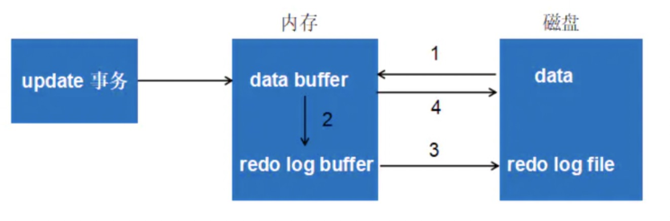
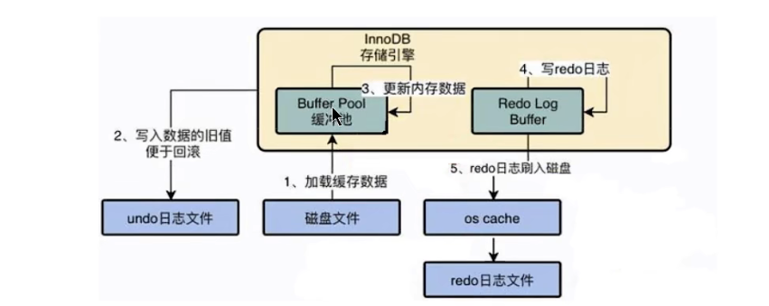
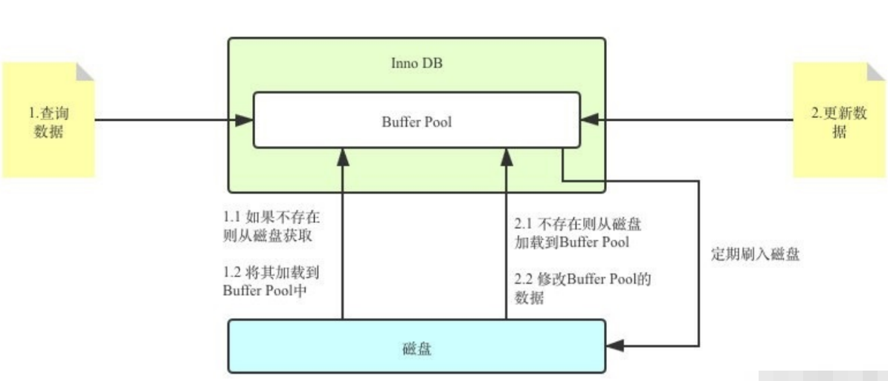
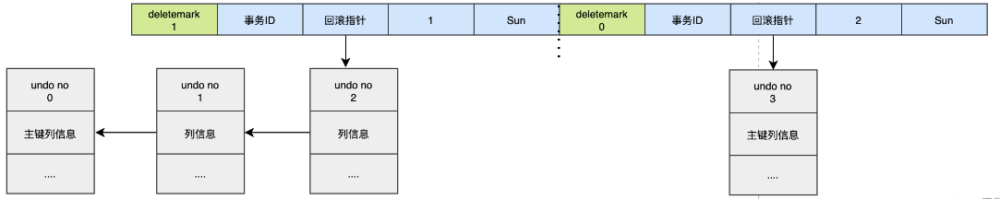
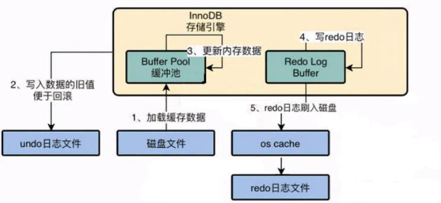

# 1. 概述
## 🔹ACID 四大特性如何透過 REDO LOG 和 UNDO LOG 實現？

| 特性       | 實現方式             | 對應機制   |
|------------|----------------------|------------|
| 原子性     | 要麼全做，要麼全不做 | Undo Log   |
| 一致性     | 完整性、約束正確     | Undo + Redo|
| 隔離性     | 多交易互不干擾       | 鎖機制     |
| 持久性     | 提交後不會丟失       | Redo Log   |

---

## 🔸1. REDO LOG（重做日誌）——確保**持久性**
### 📌 是什麼？
當你對資料庫進行寫入（如 `UPDATE`、`INSERT`）操作時，InnoDB 不會立刻將資料寫入磁碟，而是先寫入**記憶體**（Buffer Pool），並同時把這次「修改內容」寫入 REDO LOG。

這樣即使資料還沒來得及寫入磁碟，系統突然當機，也能透過 REDO LOG 重新做一遍，保證數據不會丟。

### 🧠 實例：
```sql
START TRANSACTION;
UPDATE account SET balance = balance - 100 WHERE id = 1;
UPDATE account SET balance = balance + 100 WHERE id = 2;
COMMIT;
```

執行上面轉帳操作時：
- REDO LOG 寫下「修改 account 表第1行的 balance 欄位值」的**物理變更記錄**。
- 即使突然斷電，MySQL 重啟後會用 REDO LOG 將資料「重做」，恢復為轉帳後的正確狀態（這就是**持久性**）。

---

## 🔸2. UNDO LOG（回滾日誌）——確保**原子性與一致性**
### 📌 是什麼？
UNDO LOG 記錄的是「每個操作的反向操作」：
- 如果你執行的是 `UPDATE`，UNDO LOG 就會記錄一條 `UPDATE` 回原值；
- 如果是 `INSERT`，UNDO LOG 就記錄 `DELETE`；
- 如果是 `DELETE`，UNDO LOG 就記錄 `INSERT`。

當交易失敗或被回滾時，就可以利用 UNDO LOG「還原」資料，確保原子性（一部做錯就全不做）。

### 🧠 實例：
```sql
START TRANSACTION;
UPDATE product SET price = price + 100 WHERE id = 1;
-- 突然發現錯誤！
ROLLBACK;
```

執行時：
- UNDO LOG 記錄 `price` 原來是多少；
- `ROLLBACK` 時從 UNDO LOG 拿出來把值改回來；
- 保證這筆交易像沒發生過一樣（**原子性**）。

此外，**一致性**也靠 UNDO LOG 實現，因為它能讓資料維持在一個「正確的快照版本」，搭配 **MVCC（多版本控制）** 技術，避免讀取中途修改的資料。

---

## 🔸3. 為什麼說 UNDO ≠ REDO 的反向操作？

這兩者功能完全不同：

| 比較       | REDO LOG                      | UNDO LOG                            |
|------------|-------------------------------|-------------------------------------|
| 作用       | **重做已提交的操作**          | **回滾未提交的操作**                |
| 層級       | 物理層（日誌記憶頁面更改）     | 邏輯層（記錄反操作）                |
| 用途       | 持久性（防當機丟資料）        | 原子性 + 一致性 + MVCC（隔離）     |

---

## 🔸4. 如果在寫入 REDO LOG 過程中系統突然當機會怎樣？

### ✅ REDO LOG 的寫入流程（WAL: Write-Ahead Logging）
當你執行 `INSERT` / `UPDATE` / `DELETE` 時，InnoDB 的操作流程如下：

1. **修改資料：**
   - 修改的資料會先寫入 **Buffer Pool**（資料在記憶體中暫存）。
   
2. **寫入 REDO LOG（順序寫入磁碟）：**
   - 同步將修改的 **操作記錄（而非數據本身）** 寫入 redo log buffer（記憶體）。
   - 接著，**會將 redo log buffer 的內容 flush 到 redo log file（磁碟）中。**

3. **返回成功（COMMIT）：**
   - **只有 redo log 被安全寫入磁碟之後，MySQL 才會回應 client 說「這次修改成功」**。
   - 這就是 WAL 的核心：「先寫日誌，再寫資料」。

---

### ⚠️ 如果在「寫入 REDO LOG」的中途當機：

這種情況可以分兩種來看：

#### ✅ 情況一：尚未進行 COMMIT
- 如果 REDO LOG 還沒寫入磁碟就當機了，那麼 **這次交易根本不會被認為是成功的**。
- 重啟後，MySQL 在 crash recovery 階段會檢查 redo log，發現該筆交易沒有完成，就**不會重做這筆交易**。

> ✅ 結果：資料完整、交易無效，符合 **原子性與持久性保證**。

---

#### ✅ 情況二：REDO LOG 已寫入磁碟但資料頁尚未寫入磁碟
- 如果當機時 REDO LOG 已經寫入磁碟了，而資料頁還留在 Buffer Pool（還沒 flush 到磁碟），那沒關係。
- 重啟時，InnoDB 會從 REDO LOG **「重放這筆操作」**，重新把資料寫入磁碟，確保持久性。

> ✅ 結果：資料不會丟失，InnoDB 自動恢復，保證持久性。

---

#### 💡 為什麼這麼設計？
這樣的設計符合**ACID 的「原子性 + 持久性」原則**：
- **原子性**：交易沒寫入 REDO LOG，整個交易等於沒發生。
- **持久性**：只要寫入 REDO LOG，就能保證資料不會因為系統當機而遺失。

---

#### ✅ 結論
> 當機發生時，只要 REDO LOG 沒寫入磁碟，交易就不會被當作成功提交；  
> 一旦寫入 REDO LOG，即使資料還沒同步到資料頁，也能在重啟後靠 REDO LOG 重做操作，保證資料完整。

是否還想更深入了解 REDO LOG 的格式、檔案結構，或 crash recovery 的步驟？

## 🧩 補充：REDO + UNDO 如何配合？

一筆交易提交前，會先：
1. **寫入 UNDO LOG**：準備好「怎麼回滾」；
2. **修改資料**；
3. **寫入 REDO LOG**；
4. **執行 COMMIT**：真正確認操作成功。

這樣即使中間哪一步失敗，MySQL 也能透過日誌還原資料。

---

# 2. redo日志
InnoDB 存储引擎是以 **页为单位** 来管理存储空间的。在真正访问页面之前，需要把在 **磁盘** 上的页缓存到内存中的 Buffer Pool 之后才可以访问。所有的变更都必须先更新缓冲池中的数据，然后缓冲池中的 **脏页** 会以一定的频率被刷入磁盘（ checkPoint机制），通过缓冲池来优化CPU和磁盘之间的鸿沟，这样就可以保证整体的性能不会下降太快。

## 2.1 为什么需要REDO日志?
### 🔹1. 背景問題：為什麼不能每次直接寫磁碟？

#### ✅InnoDB 的優化策略：
InnoDB 引擎使用了一個叫 **Buffer Pool（緩衝池）** 的機制，先把資料讀進記憶體、修改也先改記憶體，這樣效率快很多，不需要每次都直接跟磁碟交互。

#### ❌ 但會出問題：
修改後的資料雖然存在記憶體中，但「還沒寫回磁碟」，若此時電腦當機（掉電、崩潰），這些「尚未落盤」的變更就會消失。

---

### 🔸例子：使用 Buffer Pool + Checkpoint

```sql
START TRANSACTION;
UPDATE user SET balance = balance - 500 WHERE id = 1;
UPDATE user SET balance = balance + 500 WHERE id = 2;
COMMIT;
```

這筆轉帳操作執行後：

- 在 `COMMIT` 時，其實只是**寫入記憶體的 Buffer Pool**；
- 預設情況下，只有當 **checkpoint（檢查點）** 被觸發時，Buffer Pool 才會把頁面寫回磁碟；
- 所以在此之間如果 **系統當機**，這兩筆修改就會「消失」，**破壞了持久性（Durability）**。

---

### 🔹2. 傳統解法為何不可行？

#### ❗方法：每次 COMMIT 都直接刷新頁面到磁碟

問題：
1. **成本過高**：可能只是更新一個字元，但必須整個 16KB 頁面刷到磁碟；
2. **IO 太慢**：修改多頁時，這些頁面可能不連續，會導致「隨機IO」，而不是效率高的「順序IO」；
3. **機械硬碟效能低**：隨機IO 在傳統硬碟中特別慢。

所以這樣做「不實際」。

---

### 🔹3. 更聰明的做法：WAL 技術 + REDO LOG

#### ✅什麼是 WAL？
**Write-Ahead Logging（先寫日誌，再寫資料）**

只要你在提交時，把這次修改「記錄」起來，寫入 **REDO LOG** 裡，即使 Buffer Pool 中的資料沒來得及寫進磁碟，系統也能在重啟後**根據 REDO LOG 恢復**剛剛的變更。

#### ✅REDO LOG 的記錄內容（物理級別）：
舉例：  
「表空間0的第10頁，第100位元組的值由1變更為2」

這樣系統在重啟時可以「重做」這個操作，讓資料恢復為宕機前的狀態。

---

### 🔸完整流程：REDO LOG 讓你不怕當機

1. **開始交易**
2. Buffer Pool 修改記憶體資料
3. REDO LOG 同步記錄「這筆交易做了什麼修改」
4. COMMIT 時先**寫入 REDO LOG 並刷盤（fsync）**
5. 系統這時即使當機，也能靠 REDO LOG 進行重放（RE-DO）

---

### 🧠 簡單圖解（邏輯順序）：

```
               +------------------+
               | 修改 Buffer Pool  |
               +------------------+
                         ↓
               +------------------+
               |   記錄 REDO LOG   | ← 這一步一定會寫進磁碟（fsync）
               +------------------+
                         ↓
               +------------------+
               |    交易提交 COMMIT |
               +------------------+
```


---

### 🧩 補充說明：REDO LOG 實際使用技巧

- **格式是固定大小的循環日誌（circular log file）**
- 寫入時分為兩階段：prepare 和 commit
- **只有 commit 過的 REDO LOG 才會在宕機後重做**

---

### ✅ 總結：為什麼需要 REDO LOG？

| 問題 | 解法 |
|------|------|
| COMMIT 後資料還在記憶體中，系統一當機就會丟失變更 | 使用 REDO LOG 記錄這筆交易「修改了什麼」，即使當機後也能「重做」 |
| 每次寫完整頁面到磁碟太慢 | REDO LOG 只寫少量「變更資訊」，又是順序IO，非常快 |
| 保證 ACID 中的「D：持久性」 | WAL 技術 + REDO LOG 實現 |

---

如果你想進一步了解「REDO LOG 的格式」、「與 binlog 有什麼區別」、「flush 時機點」或「與 UNDO LOG 如何配合」等等，我也可以補充喔！需要我繼續展開嗎？

## 2.2 REDO日志的好处、特点
### 🔷一、REDO 日誌的好處

#### ✅好處 1：**降低刷盤頻率**

- ✅傳統做法：每次修改就刷一次資料頁（16KB）到磁碟 → 頻率高、效率差
- ✅有了 REDO LOG：**只要寫很小的日誌記錄就好**，真正的資料可以「延後刷盤」

#### ✅舉例說明：
假設你只是執行這條語句：
```sql
UPDATE user SET age = age + 1 WHERE id = 1;
```

這條語句只改變某一行的一個整數欄位，例如只從 25 改為 26。

🔸 但 InnoDB 一頁是 16KB，大部分空間根本沒變！  
🔸 如果每次都把整頁刷到磁碟 = 浪費效能  
🔸 所以只需記錄：**user 表 第x頁 第 y 個 offset 的值從 25 改為 26**

這樣一筆 REDO LOG 只佔幾十位元組，非常小，寫入快，**不需頻繁刷整頁**！

---

### 🔷二、REDO LOG 的特性

#### ✅特性 1：**順序寫入磁碟（順序 IO）**
- 傳統寫磁碟通常是「隨機 IO」：不同資料頁可能位於磁碟不同位置 → 讀寫效能差
- REDO LOG 是 **像日記一樣往後追加** → 採用「順序 IO」，效率遠高於隨機 IO（尤其在 HDD 時代效果明顯）

#### ✅舉例說明：
你有一個交易如下：
```sql
START TRANSACTION;
INSERT INTO orders VALUES (...);  -- 產生一筆 redo
UPDATE orders SET ... WHERE id=1; -- 又產生 redo
DELETE FROM temp_orders WHERE ...; -- 又一筆 redo
COMMIT;
```

🔹這三筆語句都會對資料造成修改，每條都會產生 redo log  
🔹它們會**按順序被追加寫入 redo log 檔案**中，並不會「跳來跳去」寫入磁碟  
🔹這樣即使你修改了很多頁的資料，也只需一直往 redo log 文件後面追加即可！

---

### 🔷三、REDO LOG vs BINLOG 差異

| 比較點 | REDO LOG | BINLOG |
|--------|----------|--------|
| 所屬層級 | 存儲引擎層（InnoDB） | 服務層（MySQL Server） |
| 記錄時間 | 實時寫入、語句一執行就記錄 | **提交時**一次性寫入 |
| 寫入方式 | **順序 IO、立即記錄** | **延遲寫入、事後記錄** |
| 用途 | 崩潰恢復、保證持久性 | 複製、備份、恢復 |
| 粒度 | 物理層（頁號、offset、值） | 邏輯層（語句或行操作） |

---

#### ✅例子比較：

假設你執行：
```sql
START TRANSACTION;
INSERT INTO users VALUES (...); -- 第 1 筆
...
-- 重複 100,000 筆
COMMIT;
```

🔸 **REDO LOG**：每筆 `INSERT` 立即產生 redo log，並記錄：
```
“表空間 X 的第 Y 頁，Z 位置，寫入某些資料”
```
→ 累積很多條，**順序寫入磁碟**，即使還沒 COMMIT，這些內容就已經寫好了。

🔸 **BINLOG**：直到 `COMMIT`，MySQL 才會把這 10 萬筆 `INSERT` 整理成一條或多條 binlog 記錄，一次性寫入磁碟。

---

### 🔚 小結整理

| 好處與特性 | 說明 |
|------------|------|
| ✅ 減少 IO 開銷 | 修改很小，也不必刷整頁 |
| ✅ 空間佔用小 | 只記錄改動的位置和數據 |
| ✅ 順序寫入效能佳 | 支援高併發、減少隨機 IO |
| ✅ 可用於宕機恢復 | 提交成功就保證不丟資料 |

---

如果你想更深入了解：
- `redo log buffer → redo log file 的刷寫時機`
- `flush log at trx commit 的 1 / 2 / 0 三種設定差別`
- `redo log 與 undo log 如何配合恢復或回滾`

我可以幫你一步步補上～要繼續嗎？

## 2.3 redo的组成
Redo log 可以简单分为以下两个部分： **重做日志的缓冲** 、 **重做日志文件**

重做日志的缓冲 (redo log buffer) ，保存在内存中，是易失的。

在服务器启动时就向操作系统申请了一大片称之为 `redo log buffer的` 连续内存 空间，翻译成中文就是redo日志缓冲区。

这片内存空间被划分成若干个连续的 `redo log block`。一个 `redo log block` 占用 512 字节大小。


### 参数设置：innodb_log_buffer_size：

redo log buffer 大小，默认16M，最大值是4096M，最小值为1M。

```shell
mysql> show variables like '%innodb_log_buffer_size%';
+------------------------+----------+
| Variable_name     	 | Value  |
+------------------------+----------+
| innodb_log_buffer_size | 16777216 |
+------------------------+----------+
```

重做日志文件 (redo log file)，保存在硬盘中，是持久的。

> REDO日志文件默认在数据库的根路径下，其中的 ib_logfile8 和 ib_logfile1 即为REDO日志。

## 2.4 redo的整体流程
以一个更新事务为例，redo log 流转过程，如下图所示：



第1步：先将原始数据从磁盘中读入内存中来，修改数据的内存拷贝

第2步：生成一条重做日志并写入redo log buffer，记录的是数据被修改后的值

第3步：当事务commit时，将redo log buffer中的内容刷新到 redo log file，对 redo log file采用追加写的方式

第4步：定期将内存中修改的数据刷新到磁盘中

> **体会：**
> - Write-Ahead Log(预先日志持久化)：在持久化一个数据页之前，先将内存中相应的日志页持久化。

## 2.5 redo log的刷盘策略
redo log的写入并不是直接写入磁盘的，InnoDB引擎会在写redo log的时候先写redo log buffer，之后以 一定的频率 刷入到真正的redo log file 中。这里的一定频率怎么看待呢？这就是我们要说的刷盘策略。


### 🔹為什麼需要「刷盤策略」？

#### 🔸現象：
InnoDB 在寫入 redo log 時，**不是直接寫進磁碟**，而是先寫進：
- **`redo log buffer`（位於記憶體）**

然後再經過一些條件觸發，把 buffer 的內容「刷進 redo log file」（實際的日誌檔案）

---

#### ✅但有一個陷阱：

把 redo log buffer 寫入 redo log file，其實只是「寫進檔案系統的 page cache（磁碟快取）」，**還沒真正寫入磁碟**。

👉 如果此時作業系統或整台主機當機，**page cache 內容也會丟失**，你的 redo log 就沒了，等於交易沒真正被保存。

---

### 🔸innodb_flush_log_at_trx_commit 的三種模式
> InnoDB 给出 `innodb_flush_log_at_trx_commit` 参数，该参数控制 commit提交事务时，如何将 redo log buffer 中的日志刷新到 redo log file 中，它支持三种策略。

這個參數控制「當事務 COMMIT 時，InnoDB 該怎麼處理 redo log buffer 的刷盤行為」

| 值 | 行為 | 安全性 | 效能 |
|----|------|--------|------|
| `0` | 不刷盤；靠系統每秒一次同步 | 低 | 高 |
| `1` | 每次 COMMIT 都立即刷盤（預設）| 高 | 低 |
| `2` | COMMIT 時只寫入 page cache，不做 fsync | 中等 | 中等 |

---

### 🔷三種模式的具體例子

---

#### ✅ 模式 1：`innodb_flush_log_at_trx_commit = 1`（預設、安全模式）

> 事務一 COMMIT，就把 redo log buffer 寫入 redo log file，並強制「fsync」寫入磁碟。

###### 🧠 實例：

```sql
START TRANSACTION;
UPDATE account SET balance = balance - 100 WHERE id = 1;
COMMIT;
```

- 執行 `COMMIT` 時：
  - redo log 寫入磁碟 ✅
  - 即使現在斷電，重啟後也能從 redo log 中「重做」這筆交易
- ✅ **最安全**（Durability 保證）
- ❌ 但每筆交易都要進行一次 fsync，效能會差

---

#### ✅ 模式 2：`innodb_flush_log_at_trx_commit = 2`

> COMMIT 時只寫到 page cache（作業系統緩存），不立刻 fsync

- 操作系統會自行決定何時寫入真正磁碟，可能延遲幾秒才落實
- 如果系統崩潰 → redo log 還在 page cache → 會遺失 ❌

###### 🧠 應用場景：
這適合 **接受輕微資料丟失風險、追求效能的情境**，例如報表、內部測試用系統

---

#### ✅ 模式 3：`innodb_flush_log_at_trx_commit = 0`

> COMMIT 不做任何刷盤，由系統每秒一次自行刷盤

- 即使你做了 COMMIT，**也不一定會立即寫入磁碟**
- 每秒只有一次保險機會（master thread 定時刷盤）

###### 🧠 風險：
假設你在 0.5 秒內提交了 100 筆交易，**在下一次刷盤之前系統掛掉** → 這 100 筆交易全丟了 ❌

---

### 🔷補充：除了手動 COMMIT，InnoDB 還會主動刷盤

#### ✅ 以下情況會觸發 redo log buffer 自動刷盤：

##### 1. 每秒一次（由 Master Thread 負責）
> 即使沒提交也會寫入 page cache → 效能與安全的折衷

InnoDB 存储引擎有一个后台线程，每隔 1秒，就会把 redo log buffer 中的内容写到文件系统缓存(page cache)，然后调用刷盘操作。


也就是说，一个没有提交事务的 redo log 记录，也可能会刷盘。因为在事务执行过程redo log记录是会写入 redo log buffer 中，这些redo log 记录会被 后台线程 刷盘。


##### 2. redo log buffer 快滿了（超過 log_buffer_size 的一半）
> 預設 log buffer 大小為 16MB，只要佔了一半（8MB），就會自動刷盤，避免塞爆

---

### 🔷總結圖解（簡化版）

```
[SQL 語句執行]
      ↓
[Redo Log Buffer] --→ (定時 or 達到大小門檻) → Page Cache → 寫入磁碟 (fsync)
      ↓
     COMMIT
      ↓
視 innodb_flush_log_at_trx_commit 值決定：
 0 → 不寫；等系統刷盤  
 1 → 立即 fsync  
 2 → 寫入 page cache，不 fsync
```

---

### ✅ 小結對照表

| 模式 | 是否立即寫入磁碟 | 安全性 | 效能 | 適合場景 |
|------|------------------|--------|------|---------|
| 0    | ❌（靠系統每秒刷） | 最低   | 最快 | 測試、可接受數據丟失 |
| 1    | ✅（立即 fsync）   | 最佳   | 最慢 | 生產環境、金融系統 |
| 2    | ❌（寫入緩存）     | 中等   | 中等 | 普通業務系統 |

---

## 2.6 不同刷盘策略演示

### innodb_flush_log_at_trx_commit=1


> **innodb_flush_log_at_trx_commit=1**
> - 为 1 时，只要事务提交成功,`redo log` 记录就一定在硬盘里，不会有任何数据丢失。
> - 如果事务执行期间MySQL挂了或宕机，这部分日志丢了，但是事务并没有提交，所以日志丢了也不会有损失。可以保证ACID的D，数据绝对不会丢失，但是 **效率最差的**。
> - 建议使用默认值，虽然操作系统宕机的概率理论小于数据库宕机的概率，但是一般既然使用了事务，那么数据的安全相对来说更重要些。

### innodb_flush_log_at_trx_commit=2


> **innodb_flush_log_at_trx_commit=2**
> - 为2时，只要事务提交成功,`redo log buffer` 中的内容只写入文件系统缓存 (page cache)。
> - 如果仅仅只是MySQL挂了不会有任何数据丢失，但是操作系统宕机可能会有1秒数据的丢失，这种情况下无法满足ACID中的D。但是数值2肯定是效率最高的。

### innodb_flush_log_at_trx_commit=0


> **innodb_flush_log_at_trx_commit=0**
> - 为0时, `master thread` 中每1秒进行一次重做日志的fsync操作，因此实例crash最多丢失1秒钟内的事务。(master thread是负责将缓冲池中的数据异步刷新到磁盘，保证数据的一致性)
> - `innodb_flush_log_at_trx_commit=0` 的话，是一种折中的做法，它的IO效率理论是高于1的，低于2的，这种策略也有丢失数据的风险，也无法保证D。

## 2.7 写入redo log buffer过程
### 2.7.1 补充概念：Mini-Transaction
#### 概述
先來用一個邏輯圖幫你整理各個結構的關係：

 

- **Mini-Transaction（小型事務）** 是 InnoDB 對於「一次對某個資料頁（page）的原子操作」的抽象單位
- 例如：對某個 B+ Tree 插入一筆資料，就會產生一次 Mini-Transaction
- 每個 mtr 寫入 redo log 時，是一個 **不可分割的單位**（要麼整個成功，要麼整個 rollback）

👉 在 **崩潰恢復時（Crash Recovery）**，系統會依照 mtr 為單位，來判斷 redo log 是否需要重放。

---

#### 🧠 舉個例子：

假設你執行：

```sql
INSERT INTO users (id, name) VALUES (1, 'Alice');
```

這會產生的底層行為包括：

1. 找到 users 表對應的 B+ Tree 索引頁
2. 在適當位置插入資料
3. 調整頁面內部的 slot 和指針
4. 修改 page header 內容
5. 可能還要分裂頁面（若滿了）

👉這一連串「對 page 的原子操作」會被封裝成一個 **mtr**

而這個 mtr 會產生多條 redo log，例如：

- 修改 page 123 的 offset 100 → 寫入 `Alice`
- 調整 slot 結構 → offset 200 → 調整為某數值
- 更新 page header → offset 0 → 記錄新空間位置

這些 **Redo Log 記錄會一口氣寫入 redo log buffer 中**。

---

#### 🔷2️⃣ Redo Log Buffer 寫入流程（實際順序）

以下是當你執行 SQL 修改資料時，Redo Log 是怎麼一步步寫進 buffer 的：

##### ✅流程圖：

```
[SQL 語句] → [觸發多個 Mini-Transaction] → [每個 mtr 寫多條 redo log] → [寫入 redo log buffer]
```

##### 🧠 舉例延伸：

```sql
START TRANSACTION;
UPDATE product SET price = price + 10 WHERE id = 1;
COMMIT;
```

這條語句的行為流程可能是：

1. `UPDATE` 會修改一個資料頁（例如 page 100）
2. 修改記錄欄位值 + 修改 undo slot + page checksum…
3. 每一個這種操作都是一次「頁面原子變更」
4. 每一頁的原子變更對應一個 mtr
5. 每個 mtr 會產生一組 redo log 記錄
6. 這些 redo log 會一口氣放進 redo log buffer

---

#### 🔶3️⃣ mtr 實現的價值？

- ✅ **原子性單位**：避免系統崩潰時只恢復了一半的頁面變更
- ✅ **效率佳**：一個 mtr 是預先記憶體內聚集起來後一次性寫入 redo log buffer
- ✅ **資料一致性**：確保崩潰後可以按 mtr 邊界進行回放，恢復一致狀態

---

#### 🔷總結：關鍵重點整理

| 概念 | 說明 |
|------|------|
| `mtr` | Mini-Transaction，是對一個頁面（或少數頁）原子操作的封裝 |
| 作用 | mtr 是 redo log 的基本單位，崩潰恢復時按 mtr 邊界回放 |
| 寫入方式 | 一個 mtr 會產生多條 redo log，會一次性寫入 redo log buffer |
| 優點 | 確保資料一致性，優化寫入效率，避免部分寫入導致資料破壞 |

---

### 2.7.2 redo 日志写入log buffer
> 向 `log buffer` 中写入 redo 日志的过程是顺序的，也就是先往前边的block中写，当该block的空闲空间用完之后再往下一个block中写。

当我们想往 `log buffer` 中写入redo日志时，第一个遇到的问题就是应该写在哪个 block 的哪个偏移量处，所以InnoDB的设计者特意提供了一个称之为 `buf_free` 的全局变量，该变量指明后续写入的redo日志应该写入到 `log buffer` 中的哪个位置，如图所示:│


一个mtr执行过程中可能产生若干条redo日志，这些redo日志是一个不可分割的组，所以其实并不是每生成一条redo日志，就将其插入到log buffer中，而是每个mtr运行过程中产生的日志先暂时存到一个地方，当该mtr结束的时候，将过程中产生的一组redo日志再全部复制到log buffer中。

我们现在假设有两个名为T1、T2的事务，每个事务都包含2个mtr，我们给这几个mtr命名一下:

1. 事务T1的两个mtr分别称为mtr_T1_1和mtr_T1_2。
2. 事务T2的两个mtr分别称为mtr_T2_1和mtr_T2_2。

每个mtr都会产生一组redo日志，用示意图来描述一下这些mtr产生的日志情况：


不同的事务可能是 **并发** 执行的，所以 T1 、 T2 之间的 mtr 可能是 **交替执行** 的。每当一个mtr执行完成时，伴随该mtr生成的一组redo日志就需要被复制到log buffer中，也就是说不同事务的mtr可能是交替写入log buffer的，我们画个示意图(为了美观，我们把一个mtr中产生的所有的redo日志当作一个整体来画)︰


有的mtr产生的redo日志量非常大，比如mtr_t1_2产生的redo日志占用空间比较大，占用了3个block来存储。

### 2.7.3 redo log block的结构图
> 一个 `redo log block` 是由 **日志头、日志体、日志尾**组成。日志头占用12字节，日志尾占用8字节，所以一个block真正能存储的数据就是 `512-12-4=496` 字节。

##### 为什么一个block设计成512字节?
这个和磁盘的扇区有关，机械磁盘默认的扇区就是512字节，如果你要写入的数据大于512字节，那么要写入的扇区肯定不止一个，这时就要涉及到盘片的转动，找到下一个扇区，假设现在需要写入两个扇区A和B，如果扇区A写入成功，而扇区B写入失败，那么就会出现 非原子性的写入，而如果每次只写入和扇区的大小一样的512字节，那么每次的写入都是原子性的。


真正的redo日志都是存储到占用496字节大小的log block body中，图中的log block header和log block trailer存储的是一些管理信息。我们来看看这些所谓的 管理信息 都有什么。


##### log block header的属分别如下:
> 我們可以把一份 redo log 檔案（或 buffer）想像成一個「由多個 log block 組成的陣列」，每個 block 大小是固定的 `512 bytes`。  
這些區塊的前面部分就是 `log block header`，負責記錄這個區塊的**位置、內容狀態、對應的 mtr 資訊**等。

---

###### ✅ 整體結構概觀圖（簡化）

```
[Log Buffer]
│
├── Log Block #1（512B）
│    ├── [Log Block Header]（前 12 bytes）
│    │    ├── LOG_BLOCK_HDR_NO
│    │    ├── LOG_BLOCK_HDR_DATA_LEN
│    │    ├── LOG_BLOCK_FIRST_REC_GROUP
│    ├── [Redo Log Record Body]（寫進來的 redo log）
│    └── [Log Block Trailer]（最後 4 bytes：LOG_BLOCK_CHECKSUM）
│
├── Log Block #2（512B）
│    ...
```

---

###### ✅1. `LOG_BLOCK_HDR_NO`（4 Bytes）

- 是這個 log block 在 log buffer 中的 **順序編號**
- 從 0 開始，每個新的 block +1，循環使用（最大 2^31 = 約 2G 次）
- **bit 31 被拿來當作 flush bit 用來標記這個 block 是否是 flush 的起點**

**🧠 舉例：**

如果這是第 5 個 block，則 `LOG_BLOCK_HDR_NO = 5`（用來辨識 log buffer 中這是第幾個 block）

---

###### ✅2. `LOG_BLOCK_HDR_DATA_LEN`（2 Bytes）

- 表示該 block 已經用了多少空間（資料量）
- 一開始預設是 12（前面 header 佔用），剩下的空間開始寫入 redo log 資料
- 若此值達到 512，表示整個 block 滿了

**🧠 舉例：**

如果目前這個 block 裡寫入了 100 bytes redo log 資料（從 offset 12 開始），則：
```
LOG_BLOCK_HDR_DATA_LEN = 12 + 100 = 112
```

---

###### ✅3. `LOG_BLOCK_FIRST_REC_GROUP`（2 Bytes）

- 表示：**此 block 裡第一個 redo log record group（也就是第一個 mtr 對應的 redo）的起始偏移量**
- 如果這個值和 `LOG_BLOCK_HDR_DATA_LEN` 相等 ⇒ 表示這個 block 內沒有新的 redo log，是空的或只是 padding 填充

**🧠 舉例：**

假設某個 block 在 offset 120 的位置開始寫入一個 mtr 所產生的 redo log 記錄，那：
```
LOG_BLOCK_FIRST_REC_GROUP = 120
```

這個值可以幫助 **Crash Recovery 時快速找到要重做的起點**

---

###### ✅4. `LOG_BLOCK_CHECKPOINT_NO`（4 Bytes）

- 表示此 block **最後一次寫入時對應的 checkpoint 編號**
- 是 crash recovery 時的一個關鍵值，用來確保日誌的 replay 是從正確的位置開始

**🧠 舉例：**

假設當前 redo log 的 checkpoint 號碼是 `10589`，那這個值就是 `10589`。  
系統恢復時會比對 checkpoint 號碼，確認要從哪個 block 開始 redo。

---

###### ✅5. `LOG_BLOCK_CHECKSUM`（Block Trailer，4 Bytes）

- 記錄該 block 的 checksum 校驗碼，通常與 `LOG_BLOCK_HDR_NO` 有關（簡化校驗）
- ⛔️ 預設你可以先忽略這個值（不是功能邏輯的一環，而是驗證資料用）

---

###### 🔸綜合範例

假設現在第 8 個 log block 正在寫入內容，其情況如下：

| 欄位                      | 值       | 說明                                   |
|---------------------------|----------|----------------------------------------|
| LOG_BLOCK_HDR_NO          | 8        | 第 8 個 block（從 0 開始）             |
| LOG_BLOCK_HDR_DATA_LEN    | 120      | 目前已寫入 108 bytes（12 + 108）      |
| LOG_BLOCK_FIRST_REC_GROUP | 20       | 第一筆 redo log 是從 offset 20 開始   |
| LOG_BLOCK_CHECKPOINT_NO   | 58213    | 對應的 checkpoint 號碼                 |
| LOG_BLOCK_CHECKSUM        | 8        | 簡化處理，跟 HDR_NO 相同作為校驗碼    |

---

###### ✅ 總結：為什麼要這樣設計？

| 欄位 | 作用 |
|------|------|
| `HDR_NO` | 幫助定位 log block 的順序與識別點 |
| `DATA_LEN` | 知道寫到哪，還能寫多少 |
| `FIRST_REC_GROUP` | 協助 crash recovery 從正確的 mtr 開始 redo |
| `CHECKPOINT_NO` | 幫助從最近一致狀態恢復 |
| `CHECKSUM` | 驗證 log block 是否完整正確 |

---

## 2.8 redo log file
### 2.8.1 相关参数设置
#### 🔷1. `innodb_log_group_home_dir`  
##### ✅用途：指定 redo log 檔案存放的目錄
- 預設為 `./`，也就是在 MySQL 的**數據目錄**中。
- 你通常會看到下面這兩個檔案：
  ```
  ib_logfile0
  ib_logfile1
  ```
- 這些是**磁碟上的實體 redo log 檔案**，是最終從 `redo log buffer` 寫入的目標。

##### 🧠 舉例：
如果你的 MySQL 數據目錄是 `/var/lib/mysql`，那麼這兩個檔案預設會存在於：
```
/var/lib/mysql/ib_logfile0
/var/lib/mysql/ib_logfile1
```

✅ **可修改**：如果你希望將這些 redo log 放到更快的磁碟上（如 SSD），可以更改這個參數。

---

#### 🔷2. `innodb_log_files_in_group`
##### ✅用途：指定 redo log file 的**個數**
- 預設值為 2，最多可設為 100
- redo log 是**循環使用的文件組**（circular redo log group）
- 每當寫完一個 redo log file，就會切換到下一個，如同環狀緩衝區。

##### 🧠 舉例：
如果設為 3 且單個檔案大小為 100MB，則整個 redo log 文件組最大大小為：
```
3 × 100MB = 300MB
```

這會影響：
- redo log 可容納多少未刷入磁碟的操作
- 崩潰恢復所需掃描的範圍

✅ **擴充時機**：當你的系統事務量大、寫入頻繁時，可以考慮調高這個數值，但要避免造成恢復時間太久。

---

#### 🔷3. `innodb_flush_log_at_trx_commit`（已學過）

##### ✅用途：控制「什麼時候把 redo log buffer 刷入檔案」
- `0`：不刷，靠 OS 定時
- `1`：每次 COMMIT 都刷（預設、安全）
- `2`：只寫入 Page Cache，不 fsync

🔥 若與 `innodb_log_files_in_group` 配合得當，可在提升效能同時保有較好耐久性。

---

#### 🔷4. `innodb_log_file_size`
##### ✅用途：設定「單個 redo log 檔案」的大小

- 預設為 `48MB`（50331648 bytes）
- 最大為 `512G / N`，其中 N 是 redo log file 的個數
- 需搭配 `innodb_log_files_in_group` 一起考量總容量

##### 🧠 舉例：
```shell
mysql> show variables like 'innodb_log_file_size';
+----------------------+----------+
| innodb_log_file_size | 50331648 |  ← 這是 48MB
```

如果你有 2 個 log files，那整體 redo log 文件空間為：
```
2 × 48MB = 96MB
```

✅ **為什麼要調整？**
- 如果 redo log 太小，寫入太快填滿，InnoDB 就會過早做 checkpoint，影響效能
- 如果太大，當機後崩潰恢復會花比較久的時間（因為要 replay 很多 log）

##### 🧠 改法：
```ini
# 在 my.cnf 配置檔中加上：
innodb_log_file_size=200M
# 然後重啟 MySQL 生效
```

✅ 建議在「大事務」或「高併發系統」中提升這個值。

---

#### 📌 綜合建議配置（舉例）

如果你的應用場景是：
- 一次交易會更新成千上萬筆資料
- 高頻率的批量寫入操作（如電商、訂單、IoT）

可以考慮：

```ini
innodb_log_file_size = 256M
innodb_log_files_in_group = 3
innodb_flush_log_at_trx_commit = 2   # 效能優先，但略有丟失風險
```

但如果是：
- 金融、會計等系統，需要數據絕對安全  
則建議維持：

```ini
innodb_flush_log_at_trx_commit = 1
```

---

#### ✅ 最後總結表

| 參數名稱 | 作用 | 預設值 | 建議用途 |
|----------|------|--------|----------|
| `innodb_log_group_home_dir` | redo log 存放目錄 | `./` | 可放 SSD 路徑 |
| `innodb_log_files_in_group` | redo log 文件數量 | `2` | 高寫入量可增加 |
| `innodb_log_file_size` | 單檔案大小 | `48MB` | 大事務建議提升 |
| `innodb_flush_log_at_trx_commit` | 刷盤策略 | `1` | 安全性 vs 效能調整 |

---

### 2.8.2 日志文件组
#### 🔷1. Redo Log 文件組是什麼？

##### ✅概念說明：
- Redo log 並**不是只用一個檔案**，而是一組檔案，叫做**「日誌文件組」**。


- 這些檔案名稱像這樣：
  ```
  ib_logfile0
  ib_logfile1
  ib_logfile2
  ...
  ```

這組檔案的數量由參數 `innodb_log_files_in_group` 控制，**預設是 2 個**。

---

#### 🔷2. Redo Log 文件如何寫入？（環狀機制）

##### ✅寫入機制如下：
1. 系統從 `ib_logfile0` 開始寫入 redo log
2. 寫滿後 → 接著寫 `ib_logfile1`
3. 再寫滿後 → 繼續寫 `ib_logfile2`（如果有設定更多）
4. 當寫到最後一個 log file（例如 `ib_logfile2`）後，
   👉 **會「繞回去」再寫 `ib_logfile0`**！

這是一個**循環使用（circular）**的機制，確保磁碟空間可以重複利用。

---

##### 🧠 舉個例子：

假設你設定：

```ini
innodb_log_files_in_group = 3
innodb_log_file_size = 100MB
```

那麼：

| ib_logfile 檔案名稱 | 大小 |
|----------------------|------|
| ib_logfile0          | 100MB |
| ib_logfile1          | 100MB |
| ib_logfile2          | 100MB |

總共可用的 redo log 空間是：
```
3 × 100MB = 300MB
```

當你不斷執行寫入操作時，資料會依序填滿：
- `ib_logfile0 → ib_logfile1 → ib_logfile2 → ib_logfile0 → ...`  
像跑馬燈一樣一直繞圈。

---

#### 🔷3. 問題來了：那舊的 log 不就被覆蓋了？

是的！**如果沒有額外機制，早期的 redo log 確實會被覆蓋！**

這就會導致 **已提交但尚未落盤（flush）的資料無法恢復 → 資料丟失！**

---

#### 🔷4. 解決方案：Checkpoint 機制

##### ✅Checkpoint 是什麼？

> ✅Checkpoint 是一個 **「安全標記」**，告訴系統：  
> 「**我之前產生的 redo log 到這個位置都已經落實（資料頁已寫入磁碟）了，可以安全刪除/覆蓋。**」

也就是說：
- **覆蓋 redo log 時，只能覆蓋早於 checkpoint 的部分**
- **晚於 checkpoint 的 redo log 是不能被覆蓋的！**

##### 🧠 舉例：

- 目前寫到 `ib_logfile2` 的 80MB 處  
- Checkpoint 在 `ib_logfile0` 的 20MB 處

✅ 那麼你可以安全覆蓋：
- `ib_logfile0` 的 0~20MB 之前的內容

❌ 但不能覆蓋：
- `ib_logfile1` 和 `ib_logfile2`，因為這些是新的 redo log，尚未完全 checkpoint。

---

#### ✅ 結論與圖示理解

##### 🧩Redo Log Group 的結構：

```
+--------------+--------------+--------------+
| ib_logfile0  | ib_logfile1  | ib_logfile2  |
+--------------+--------------+--------------+
 ↑            ↑
 checkpoint    當前寫入位置
```

##### 🧩Checkpoint 的作用：
- 控制「哪部分的 redo log 可以被覆蓋」
- 保證即使覆蓋了過舊 log，資料也不會因為沒有回放 redo 而丟失

---

#### 🔸總結表

| 名稱 | 說明 |
|------|------|
| `ib_logfileN` | redo log file 檔案，組成文件組 |
| `innodb_log_files_in_group` | redo log file 數量（循環使用） |
| `innodb_log_file_size` | 單個 redo log 檔案大小 |
| Redo log group size | `log_files_in_group × log_file_size` |
| Checkpoint | 指定哪些 redo log 可以安全覆蓋 |
| 寫入方式 | 環狀寫入，空間重複使用，配合 checkpoint 管理 |

---

### 2.8.3 checkpoint
> 在整个日志文件组中还有两个重要的属性，分别是 **write pos、checkpoint**
> - **write pos:** 是当前记录的位置，一边写一边后移
> - **checkpoint:** 是当前要擦除的位置，也是往后推移

每次刷盘 `redo log` 记录到日志文件组中，`write pos` 位置就会后移更新。每次MySQL加载日志文件组恢复数据时，会清空加载过的 `redo log` 记录，并把 `checkpoint` 后移更新。

`write pos` 和 `checkpoint` 之间的还空着的部分可以用来写入新的 `redo log` 记录。


如果 `write pos` 追上 `checkpoint` ，表示日志文件组满了，这时候不能再写入新的 `redo log` 记录，MySQL 得停下来，清空一些记录，把 `checkpoint` 推进一下。


## 2.9 redo log小结
> InnoDB的更新操作采用的是Write Ahead Log(预先日志持久化)策略，即先写日志，再写入磁盘。



# 3. undo日誌
> `redo log` 是事务持久性的保证，`undo log` 是事务原子性的保证。在事务中更新数据的前置操作其实是要先写入一个 `undo log` 。

## 3.1 如何理解Undo日志
事务需要保证原子性，也就是事务中的操作要么全部完成，要么什么也不做。但有时候事务执行到一半会出现一些情况，比如：

1. 情况一：事务执行过程中可能遇到各种错误，比如服务器本身的错误，操作系统错误，甚至是突然断电导致的错误。

2. 情况二：程序员可以在事务执行过程中手动输入 `ROLLBACK` 语句结束当前事务的执行。

以上情况出现，我们需要把数据改回原先的样子，这个过程称之为 **回滚**，这样就可以造成一个假象：这个事务看起来什么都没做，所以符合原子性要求。

每当我们要对一条记录做改动时(这里的 `改动可以指 INSERT、DELETE、UPDATE` )，都需要"留一手"——把回滚时所需的东西记下来。比如：

- 你插入一条记录时，至少要把这条记录的主键值记下来，之后回滚的时候只需要把这个主键值对应的记录删掉就好了。(对于每个INSERT，InnoDB存储引擎会完成一个DELETE)

- 你删除了一条记录，至少要把这条记录中的内容都记下来，这样之后回滚时再把由这些内容组成的记录插入到表中就好了。(对于每个DELETE，InnoDB存储引擎会执行一个INSERT)

- 你修改了一条记录，至少要把修改这条记录前的旧值都记录下来，这样之后回滚时再把这条记录更新为旧值就好了。(对于每个UPDATE，InnoDB存储引擎会执行一个相反的UPDATE，将修改前的行放回去)

MySQL把这些为了回滚而记录的这些内容称之为 **撤销日志** 或者 **回滚日志(即undo log)** 。注意，由于查询操作 (SELECT) 并不会修改任何用户记录，所以在查询操作执行时，并不需要记录 **相应的undo日志**。

此外，undo log 会产生 redo log，也就是 undo log 的产生会伴随着 redo log 的产生，这是因为 undo log 也需要持久性的保护。

## 2.2 Undo日志的作用
### 🔁 一、Undo 日誌作用 1：**回滾數據**

#### ✅ 誤解澄清：
Undo 日誌並**不會把頁面整體還原**（不像備份還原），而是**邏輯性地撤銷某些操作**，只針對某個欄位或某筆記錄的變動進行「反向操作」。

#### 🧠 範例情境：
假設你執行了以下語句：

```sql
START TRANSACTION;
UPDATE account SET balance = balance - 100 WHERE id = 1;
-- 接著你手動回滾：
ROLLBACK;
```

這時：
1. `InnoDB` 在你執行 `UPDATE` 的當下，**會將原來 balance 的值寫入 Undo 日誌**（例如原來是 1000）。
2. 當你 `ROLLBACK` 時，MySQL 不是把整個頁面還原，而是讀取 Undo 日誌中的記錄：
   - 找到那筆記錄原來是 `balance = 1000`，然後再執行「將 balance 改回 1000」的邏輯操作。
   - **這就是邏輯回滾**，只對該行起作用，不會動到頁面中其他同時被其他人修改的資料。

#### ✅ 為什麼不做物理回滾？
假設頁面中有多筆資料被多個人修改，直接還原整個頁面會影響其他使用者的修改紀錄。所以只能針對你改的資料進行**選擇性地回滾**。

---

### 👥 二、Undo 日誌作用 2：**MVCC（多版本並發控制）**

#### ✅ 說明：
MVCC 是讓讀取操作「不加鎖」也能讀取舊版本的數據，這樣才不會跟寫入操作互相阻塞。

#### 🧠 範例情境：

假設目前有兩個用戶同時操作資料表：

##### 使用者 A：
```sql
START TRANSACTION;
UPDATE account SET balance = balance - 100 WHERE id = 1;
-- 尚未 COMMIT
```

##### 使用者 B：
```sql
SELECT * FROM account WHERE id = 1;
```

這時候，使用者 B 應該看到「更新前的數據」（例如 balance = 1000），而不是「已被減掉但還沒提交的 900」。

#### 怎麼做到？
- 在使用者 A 更新資料的同時，InnoDB 把原來那一行的內容（balance=1000）寫入 Undo 日誌。
- 當使用者 B 查詢時，根據事務的隔離級別（例如 `REPEATABLE READ`），InnoDB **會根據 Undo 日誌幫 B 重建出一個舊版本的行記錄**，供 B 查閱，這樣就不需要加鎖了。

---

### 🧾 小結

| 作用 | 解釋 | 實例 |
|------|------|------|
| **回滾數據** | 用於撤銷某筆資料變更，避免影響其他交易 | `UPDATE` → `ROLLBACK`，數值被邏輯還原 |
| **MVCC** | 允許舊資料版本的讀取，實現非鎖定查詢 | 一人 `UPDATE`、另一人 `SELECT`，仍可看到原始資料 |

---

## 2.3 undo的存储结构
### 2.3.1 回滚段与undo页
#### 🔧 一、Undo 的儲存是「分段」管理的：Rollback Segment（回滾段）

##### ✅ 基本觀念：
Undo log 並不是整包亂放，而是被 **分段儲存在稱為 rollback segment 的區塊中**。

- 每個 rollback segment 可容納 **1024 個 undo log segment（可視為子段）**
- 每個 undo log segment 會配置一組 undo page（實際儲存資料的頁面）

---

#### 🧠 二、實際範例說明

##### 🧾 假設：

你執行了如下交易：

```sql
START TRANSACTION;
UPDATE employee SET salary = salary + 1000 WHERE id = 100;
```

這條 SQL 在執行的同時會：
1. 找一個可用的 rollback segment（如果超過上限，會等待）
2. 在該 segment 中分配一個 undo log segment
3. 寫入一筆「原始資料（salary 的舊值）」到 undo page 中

---

#### 📈 三、版本變化與限制

| InnoDB 版本 | rollback segment 數量上限 | 可同時處理的最大事務數量 |
|-------------|-----------------------------|------------------------------|
| 1.1 以下    | 1 個 rollback segment       | **最多 1024 筆事務同時在線** |
| 1.1 起       | 128 個 rollback segment     | **最多 128 × 1024 = 131072 筆事務** |

##### ✅ 為什麼會有限制？
因為每個 rollback segment 最多容納 1024 個 undo log segment，也就是 1024 個事務。這是一種事務隔離機制，讓每筆交易有自己的日誌空間。

---

#### 📂 四、Undo 日誌的儲存路徑與文件設置

##### ✅ 參數介紹與用途：

| 參數名稱 | 功能 |
|----------|------|
| `innodb_undo_logs` | 控制 rollback segment 的個數（預設 128） |
| `innodb_undo_tablespaces` | 控制 undo log 分佈的文件數量（例如分散到多個檔案） |
| `innodb_undo_directory` | 指定 undo 日誌儲存目錄（預設是 `.`，即資料目錄） |

##### 🧠 舉例說明：

```ini
innodb_undo_logs = 64
innodb_undo_tablespaces = 4
innodb_undo_directory = /var/lib/mysql/undolog
```

此設定代表：
- 系統會建立 64 個 rollback segments
- 並平均分散在 4 個檔案中，檔名如 `undo001`, `undo002`, ...
- 這些文件會出現在 `/var/lib/mysql/undolog/` 資料夾中

這樣可以**減少 I/O 瓶頸**，提高性能，尤其是高並發下效果明顯。

---

#### 🔁 總結一圖

```
一個 rollback segment
    └── 包含 1024 個 undo log segment
             └── 各自分配 undo page（記錄修改前的數據）
                     └── 存在於共享表空間或 undo tablespace 檔案中
```

---

#### ✅ 小提醒
一般不需要手動調整這些 undo 設定，除非你在做**高併發、大事務量的優化**，或使用的是獨立表空間模式。

如果你還想知道這些 undo page 與 redo log、buffer pool 的互動，我也可以幫你畫出整個流程圖。需要的話告訴我喔！

### 2.3.2 undo页的重用
#### 🔧 一、Undo 的儲存是「分段」管理的：Rollback Segment（回滾段）

##### ✅ 基本觀念：
Undo log 並不是整包亂放，而是被 **分段儲存在稱為 rollback segment 的區塊中**。

- 每個 rollback segment 可容納 **1024 個 undo log segment（可視為子段）**
- 每個 undo log segment 會配置一組 undo page（實際儲存資料的頁面）

---

#### 🧠 二、實際範例說明

##### 🧾 假設：

你執行了如下交易：

```sql
START TRANSACTION;
UPDATE employee SET salary = salary + 1000 WHERE id = 100;
```

這條 SQL 在執行的同時會：
1. 找一個可用的 rollback segment（如果超過上限，會等待）
2. 在該 segment 中分配一個 undo log segment
3. 寫入一筆「原始資料（salary 的舊值）」到 undo page 中

---

#### 📈 三、版本變化與限制

| InnoDB 版本 | rollback segment 數量上限 | 可同時處理的最大事務數量 |
|-------------|-----------------------------|------------------------------|
| 1.1 以下    | 1 個 rollback segment       | **最多 1024 筆事務同時在線** |
| 1.1 起       | 128 個 rollback segment     | **最多 128 × 1024 = 131072 筆事務** |

##### ✅ 為什麼會有限制？
因為每個 rollback segment 最多容納 1024 個 undo log segment，也就是 1024 個事務。這是一種事務隔離機制，讓每筆交易有自己的日誌空間。

---

#### 📂 四、Undo 日誌的儲存路徑與文件設置

##### ✅ 參數介紹與用途：

| 參數名稱 | 功能 |
|----------|------|
| `innodb_undo_logs` | 控制 rollback segment 的個數（預設 128） |
| `innodb_undo_tablespaces` | 控制 undo log 分佈的文件數量（例如分散到多個檔案） |
| `innodb_undo_directory` | 指定 undo 日誌儲存目錄（預設是 `.`，即資料目錄） |

##### 🧠 舉例說明：

```ini
innodb_undo_logs = 64
innodb_undo_tablespaces = 4
innodb_undo_directory = /var/lib/mysql/undolog
```

此設定代表：
- 系統會建立 64 個 rollback segments
- 並平均分散在 4 個檔案中，檔名如 `undo001`, `undo002`, ...
- 這些文件會出現在 `/var/lib/mysql/undolog/` 資料夾中

這樣可以**減少 I/O 瓶頸**，提高性能，尤其是高並發下效果明顯。

---

#### 🔁 總結一圖

```
一個 rollback segment
    └── 包含 1024 個 undo log segment
             └── 各自分配 undo page（記錄修改前的數據）
                     └── 存在於共享表空間或 undo tablespace 檔案中
```

---

#### ✅ 小提醒
一般不需要手動調整這些 undo 設定，除非你在做**高併發、大事務量的優化**，或使用的是獨立表空間模式。

如果你還想知道這些 undo page 與 redo log、buffer pool 的互動，我也可以幫你畫出整個流程圖。需要的話告訴我喔！

### 2.3.3 回滚段与事务
#### ✅ 一、核心概念整理

| 名詞           | 定義 |
|----------------|------|
| **回滾段（rollback segment）** | Undo 日誌的邏輯容器，用來儲存各事務產生的 undo log |
| **盤區（extent 或稱 undo log segment）** | 回滾段中實際分配空間的單元，一個盤區中含有多個 Undo 頁 |
| **Undo 表空間（undo tablespace）** | 實體上儲存 rollback segment 的檔案，可以是 ibdata 或獨立檔案 |

---

#### 🔧 二、範例說明：一筆交易與 rollback segment 的關係

假設有三個事務分別在同一時間啟動：

```sql
-- Transaction A
START TRANSACTION;
UPDATE user SET name = 'Alice' WHERE id = 1;

-- Transaction B
START TRANSACTION;
UPDATE user SET name = 'Bob' WHERE id = 2;

-- Transaction C
START TRANSACTION;
UPDATE user SET name = 'Charlie' WHERE id = 3;
```

##### 啟動後：

1. InnoDB 分別為 A、B、C 指派一個可用的 rollback segment（假設 128 個可用）
2. 每個事務只會用一個 rollback segment，不會跨段使用
3. 這些事務在修改資料時，**會把舊的資料寫入該 rollback segment 中的 undo 頁**

---

#### 🧠 三、盤區（extent）的動態擴展與重用

##### 🔄 運作機制如下：

1. 每個 rollback segment 開始時有一個或多個盤區（空間塊）
2. 當事務執行 UPDATE/DELETE 造成 undo log 增長時：
   - 若空間不夠 → 擴展下一個盤區
   - 若整個 rollback segment 空間不足 → 看能否擴展新的盤區（或依設限報錯）

3. **Undo 頁（16KB）來自這些盤區中**，這些頁可被複用（上節你問過）

---

#### 🧾 實際流程示意：

```
【Undo Tablespace】
┌────────────────────────────┐
│ Rollback Segment 1         │ ← Transaction A 指派這個段
│   ├─ Undo Log Segment A1    │ ← 寫入原始 name: 'Ann'
│   ├─ Undo Log Segment A2    │ ← 不夠時擴展新的盤區
│                             │
│ Rollback Segment 2         │ ← Transaction B
│   ├─ Undo Log Segment B1    │
│                             │
│ Rollback Segment 3         │ ← Transaction C
│   ├─ Undo Log Segment C1    │
└────────────────────────────┘
```

---

#### ✅ 四、事務提交後會發生什麼？

提交時，InnoDB 會做兩件事：

1. **把 undo log 放入一個 purge 鏈表中（供清理線程後續刪除）**
   - 是 deferred clean（延遲清理）

2. **判斷 undo 頁是否能重用**
   - 如果該頁還有空間且無活躍舊版本引用 → **可被下個事務重用**
   - 否則等 purge thread 清掉頁面資料再釋放空間

---

#### 📌 小結：事務與 rollback segment 的互動重點

| 概念 | 說明 |
|------|------|
| 每個事務只用一個 rollback segment | 節省管理成本 |
| rollback segment 可同時被多個事務用 | 並發處理下的共享容器 |
| 空間不足時可擴展盤區（segment） | 彈性空間管理 |
| 提交後的 undo log 不立即刪除 | 等 purge 線程清理 |
| undo 頁可能重用 | 若空間未滿且無舊版本引用 |

---

### 2.3.4 回滚段中的数据分类
#### 🧠 一、Undo 日誌的「三種資料狀態分類」

InnoDB 把回滾段（rollback segment）裡的 undo log 分成三個狀態：

| 狀態 | 說明 | 是否能刪除？ |
|------|------|--------------|
| ① 未提交的資料（uncommitted） | 該筆資料屬於**正在進行中的事務** | ❌ 絕不能刪除 |
| ② 已提交但未過期（committed） | 事務已提交，但還在 undo 保留期（`undo_retention`）內 | ❌ purge 線程不能立即刪除 |
| ③ 已過期的資料（expired） | 事務已提交，且超過 `undo_retention` 時間 | ✅ purge 線程會清除 |

---

#### 🧾 二、undo_retention 是什麼？

這是 InnoDB 的系統參數，預設可能為 **"8秒"** 或由你自行設定（單位：秒）：

```sql
SHOW VARIABLES LIKE 'innodb_undo_retention';
```

這個參數指定了：
> 即使一筆事務已經提交，**仍然要保留其 undo log 至少幾秒鐘**，以保證資料快照或複製機制能夠正常運作。

---

#### 🧪 三、實際操作範例

```sql
-- 事務 A 啟動並查詢
START TRANSACTION;
SELECT * FROM orders WHERE id = 100;

-- 事務 B 對同一筆資料做修改並提交
START TRANSACTION;
UPDATE orders SET status = 'shipped' WHERE id = 100;
COMMIT;
```

此時：
- 事務 A 是 **快照讀取（MVCC）**，需要看到舊資料 → 必須用到 **B 的 undo log**
- 即使 B 已經提交了，它的 undo log **不能立刻刪除**
- 要等到事務 A 結束、且超過 `undo_retention` 時間，**purge 線程** 才會判斷是否可以清除

---

#### 🔁 四、Undo Log 的生命週期圖解

```
[事務執行中] → [提交但未過期] → [過期可刪除]
      │                  │                   │
      │                  │                   └─ 被 purge 清除
      │                  └─ 不能刪，因 MVCC 快照可能還需
      └─ 絕不能刪，會導致 rollback 出錯
```

---

#### 🧠 五、為什麼不馬上刪除？

因為 MySQL 是「**支援多事務並發與快照一致性（MVCC）**」的資料庫，
- 一筆資料的 **舊版本是用 undo log 組成的**
- 所以：
  - ❌ 還有事務沒結束 → 不能刪
  - ❌ 保留期未到 → 不能刪
  - ✅ 所有依賴它的快照都結束、保留期已過 → purge 才刪

---

#### ✅ 總結重點

| Undo 類型 | 說明 | 處理方式 |
|-----------|------|-----------|
| Uncommitted | 尚未提交 | 絕對不能刪除 |
| Committed（未過期） | 已提交但在保留期內 | 等待 purge 評估 |
| Expired | 已提交，保留期已過 | 可以釋放磁碟空間 |

---

## 2.4 undo的类型
### 🔍 一、兩種 Undo Log 類型的比較表

| 類型              | 產生來源             | 是否參與 MVCC | 是否需要 purge | 提交後可否立即刪除 |
|-------------------|----------------------|----------------|------------------|----------------------|
| `insert undo log` | `INSERT`             | ❌ 不會        | ❌ 不需要        | ✅ **可以立即刪除** |
| `update undo log` | `UPDATE`, `DELETE`   | ✅ 會用到      | ✅ 需要 purge    | ❌ **不能立即刪除** |

---

### 🧠 二、實例說明

#### ✅ 1. `insert undo log`（插入操作產生的 undo）

```sql
START TRANSACTION;
INSERT INTO users (id, name) VALUES (1, 'Alice');
COMMIT;
```

- 插入的這筆資料，在提交前 **只有當前事務可見**，其他人看不到。
- 所以這筆 undo log **只需支援 rollback**。
- 當你提交後，這筆 undo log 就**可以立刻丟掉**了（不會再被任何人查到這筆舊資料）。

#### ✅ 2. `update undo log`（更新或刪除操作產生的 undo）

```sql
START TRANSACTION;
UPDATE users SET name = 'Bob' WHERE id = 1;
COMMIT;
```

- 即使你已經提交，**別人讀取時可能還是會看到修改前的資料版本**（取決於其事務的啟動時間）
- 所以這筆 undo log 需要保留，用於 **MVCC 快照讀**
- 因此不能馬上刪除，必須放入 undo 鏈表，等 **purge 線程判斷安全後再刪除**

---

### 🔁 三、視覺流程圖解（簡化版）

```
INSERT → 產生 insert undo → ✔ 只要支援 rollback → 提交後馬上刪除 ✅

UPDATE/DELETE → 產生 update undo → ❗ 需支援 rollback + MVCC → 提交後暫存 → purge 清除 ❌
```

---

### 🎯 小總結

| 類型 | 用途 | 特性 |
|------|------|------|
| **Insert Undo Log** | 用於回滾 INSERT 操作 | 不影響其他事務、可立即刪除 |
| **Update Undo Log** | 用於回滾 UPDATE/DELETE、提供快照舊版本 | 必須保留以供 MVCC 使用，等 purge 線程處理 |

---

## 2.5 undo log的生命周期
### 2.5.1 简要生成过程
#### 🧠 一、背景知識先釐清

| 名詞 | 功能 |
|------|------|
| **Undo Log** | 保留資料修改前的舊值 → 用於事務回滾 + MVCC |
| **Redo Log** | 記錄資料修改後的新值 → 用於宕機恢復（crash recovery） |
| **Buffer Pool** | 資料與索引在記憶體中的暫存區（變更先寫這裡） |

---

#### 🧾 二、示範範例解釋（A=1 → 3，B=2 → 4）
> 假设有 2 个数值，分别为 `A=1` 和 `B=2`，然后将A修改为3，B修改为4

```
原始狀態：A = 1，B = 2
```

##### 操作流程（對應步驟解釋）：

| 步驟 | 行為 | 目的 |
|------|------|------|
| 1. start transaction | 開始事務 | 開始保證一致性的流程 |
| 2. 記錄 A=1 到 Undo Log | 儲存 A 的原始值 | 若事務失敗可以回滾 |
| 3. 更新 A = 3 | 寫入 Buffer Pool 中的 A | 尚未寫入磁碟 |
| 4. 記錄 A=3 到 Redo Log | 保留新值的修改操作 | 若系統宕機可重作 |
| 5. 記錄 B=2 到 Undo Log | 儲存 B 的原始值 | 為 rollback 做準備 |
| 6. 更新 B = 4 | 寫入 Buffer Pool 中的 B | 同樣尚未寫入磁碟 |
| 7. 記錄 B=4 到 Redo Log | 將修改後值寫入 redo | 為 crash recovery 做準備 |
| 8. Redo Log 刷新到磁碟 | 持久化 redo log | 保證即使宕機也能重做 |
| 9. commit | 正式提交事務 | 表示所有邏輯變更完成 |

---

#### 💥 三、不同「宕機時機」對系統的影響

| 時機 | 效果 | MySQL 如何處理 |
|------|------|----------------|
| **步驟 1～8 之間宕機** | **事務未提交**，不得對磁碟有任何修改 | 利用 Undo Log 回滾資料變更 |
| **步驟 8～9 宕機** | Redo Log 已經刷入磁碟，但尚未 commit | MySQL 啟動後會選擇「回滾」或「完成提交」 |
| **步驟 9 之後宕機** | 事務已提交，但資料還在 Buffer Pool 中未寫入磁碟 | 啟動後根據 redo log 進行 crash recovery（把 A=3、B=4 寫回磁碟） |

---

#### 🌀 四、Undo Log + Redo Log 的配合機制：**WAL + 原子性**

1. **WAL（Write-Ahead Logging）機制**：
   - 一定要先寫 Undo / Redo Log，再更新 Buffer Pool
   - 這樣才能保證不論宕機或失敗，都能還原或重做

2. **原子性（Atomicity）保障**：
   - 若沒 commit，就算資料在 Buffer Pool 被改了，也不能寫入磁碟
   - 若 commit，但沒寫入磁碟，也能用 redo log 把新值補寫回來

---

#### 🧠 五、總結流程關鍵點

| 重點 | 解釋 |
|------|------|
| **先寫 Undo Log** | 為了 rollback 用，記住舊值 |
| **再更新 Buffer Pool 中的資料** | 變更暫存在記憶體，不直接改磁碟 |
| **再寫 Redo Log（新值）** | 萬一宕機可重做 |
| **Redolog fsync 到磁碟後才能 commit** | 保證持久性（Durability） |
| **Crash 時根據 Redo Log 恢復資料到正確狀態** | 包含尚未落盤但已提交的資料 |
| **Rollback 時用 Undo Log 還原修改前狀態** | 保證一致性 |


只有Buffer Pool的流程：



有了Redo Log和Undo Log之后：


---

### 2.5.2 详细生成过程
#### 「行記錄」背後所附帶的幾個「隱藏欄位」
##### 🧠 一、隱藏欄位簡介與用途整理

| 欄位名稱      | 中文說明       | 用途說明 |
|---------------|----------------|----------|
| `DB_ROW_ID`    | 行號ID         | 若無主鍵或唯一索引，InnoDB 自動生成，作為聚簇索引的鍵值 |
| `DB_TRX_ID`    | 事務ID         | 記錄最後一次修改這筆記錄的事務 ID |
| `DB_ROLL_PTR`  | 回滾指標       | 指向對應的 undo log，讓系統可回到修改前版本（支援 MVCC） |

---

##### 🧾 二、具體範例

假設你建立了一個很簡單的表：

```sql
CREATE TABLE employee (
  name VARCHAR(20),
  salary INT
);
```

這個表 **沒有主鍵**，也沒有唯一索引，那麼：

- InnoDB 會自動加入一個隱藏欄位 `DB_ROW_ID` 作為聚簇索引的主鍵。
- 當你插入一筆資料後，例如：

```sql
INSERT INTO employee VALUES ('Alice', 50000);
```

InnoDB 背後其實儲存了以下內容：

```
name = 'Alice'
salary = 50000
DB_ROW_ID = 123456    ← 自動遞增的行號
DB_TRX_ID = 1001      ← 本次 insert 動作的事務 ID
DB_ROLL_PTR = NULL    ← insert 沒有舊資料，不需 undo log
```

---

###### 📌 如果接著執行：

```sql
START TRANSACTION;
UPDATE employee SET salary = 60000 WHERE name = 'Alice';
COMMIT;
```

則該行記錄變為：

```
name = 'Alice'
salary = 60000
DB_ROW_ID = 123456        ← 不變
DB_TRX_ID = 1002          ← 本次 update 動作的事務 ID
DB_ROLL_PTR = → UndoLog   ← 指向儲存 salary = 50000 的 undo 資料
```

---

##### 🔁 三、這些隱藏欄位如何幫助 InnoDB 實現功能？

###### ✅ `DB_ROW_ID`
- 在沒有主鍵的情況下，InnoDB 用它當聚簇索引的鍵值，確保每一筆資料的唯一性與排序性。

###### ✅ `DB_TRX_ID`
- 幫助 InnoDB 判斷哪筆資料版本屬於哪個事務。
- 與讀取事務的 ID 比較，決定是否可見（MVCC 的版本控制核心）

###### ✅ `DB_ROLL_PTR`
- 指向 Undo Log 中舊版本的資料：
  - ✅ 查詢時若需要「快照版本」→ 就透過這個指標回頭找 Undo Log
  - ✅ 回滾時 → 就用這個指標找到該筆舊資料恢復過來

---

##### 🧠 四、查詢快照過程簡單示意圖

```
資料行：
 salary = 60000
 DB_TRX_ID = 1002
 DB_ROLL_PTR → undo_log(salary=50000)

若 SELECT 的事務 ID 是 1001（小於 1002） → 看不到 60000 → 透過 ROLL_PTR 找到 50000 回傳
```

---

##### ✅ 小結表

| 欄位名稱 | 功能 | 何時使用 |
|----------|------|-----------|
| `DB_ROW_ID` | 無主鍵時作為聚簇索引主鍵 | 沒有主鍵時自動產生 |
| `DB_TRX_ID` | 記錄最近修改的事務ID | 用於 MVCC 可見性判斷 |
| `DB_ROLL_PTR` | 指向 undo log | 用於快照讀與 rollback |

---

#### 当我们执行INSERT时：
##### 🧾 一、範例場景：執行 INSERT 的流程

```sql
BEGIN;
INSERT INTO user (name) VALUES ("tom");
```

在這裡，假設你執行的是一筆簡單的 `INSERT` 操作，系統背後做了什麼？

---

##### 🧠 二、InnoDB 背後的動作

###### 🔧 系統自動做的事：
1. **在 user 表插入一筆資料**（假設主鍵是自增 id = 1001）
2. **產生一筆 insert undo log**：
   - undo log 類型：`INSERT_UNDO`
   - 記錄內容：表名、主鍵（id=1001）、被插入欄位（name）、值（"tom"）
3. **將這筆記錄的 `ROLL_PTR` 指向這個 undo log**
4. **此筆資料的 TRX_ID 記錄當前事務的 ID**

---

##### 🧪 三、ROLLBACK 時怎麼處理？

當你執行：

```sql
ROLLBACK;
```

InnoDB 會透過該資料列的 `ROLL_PTR`：

1. 找到 insert undo log
2. undo log 告訴系統：這是一筆尚未提交的 `INSERT`
3. 這筆記錄應該在回滾時 **直接從資料頁刪除**
   - 用主鍵 id = 1001 找到這筆記錄
   - 直接把它從表中移除（**邏輯刪除**）

---

##### 📌 四、重點說明：為什麼能「快速刪除」？

因為：
- INSERT 時系統就把主鍵和欄位值記錄在 undo log 裡
- rollback 時 **不需要掃描整個表**
- 直接根據主鍵定位，從聚簇索引中刪掉該筆資料
- 這是比 UPDATE 的回滾還快的操作！

---

##### 🎯 五、insert undo log 的特性

| 項目 | 說明 |
|------|------|
| 使用時機 | `INSERT` 操作（尚未提交） |
| 用途 | 回滾時刪除剛插入的資料 |
| 含資料 | 主鍵 + 插入的欄位名稱與數值 |
| 可見性 | 只對當前事務可見，其他事務看不到 |
| 會不會被保留 | ✅ **提交後可以立即刪除**（不會參與 MVCC） |

---

##### ✅ 小結：整體流程圖解


```
[INSERT] → 寫入 user 表（id=1001, name='tom'）
        → 建立 insert undo log（記錄主鍵與欄位值）
        → ROLL_PTR → 指向這筆 undo log

[ROLLBACK] → ROLL_PTR → 找到 insert undo log → 透過主鍵刪除該筆資料
```

---


#### 当我们执行UPDATE时：
**MySQL InnoDB 在執行 `UPDATE` 操作時產生的 update undo log 的結構與回滾邏輯**。這是 InnoDB **MVCC 機制與資料一致性保障的核心**。

我會用兩個具體範例（更新非主鍵 vs 主鍵）、配合圖解思維、循序說明每一步如何建立 undo log 及其串接關係，幫你一次搞懂。

---

##### 🧠 一、前置概念整理：Undo Log 是鏈狀結構

每筆 `UPDATE` 都會：
- 產生一個新的 `update undo log`
- 新的 undo log 會 **指向前一版本的 undo log**
- 就像形成一條「**版本鏈（undo log chain）**」
- 每筆 undo log 都有一個遞增的 `undo_no`

這就是為什麼 MySQL 可以根據 `ROLL_PTR` 追溯所有歷史版本！

---

##### 🧾 二、範例 1：**更新「非主鍵」欄位**


```sql
UPDATE user SET name = "sun" WHERE id = 1;
```

###### ✨ 發生了什麼：

1. 找到 `id=1` 的記錄（假設原值 name = "tom"）
2. 產生一筆 `update undo log`：
   - 記錄 name = "tom"
   - undo_no = 1
   - 指向 undo_no = 0（原始插入的 insert undo）
3. 更新 Buffer Pool 中 name = "sun"
4. 記錄 trx_id、roll_ptr → 指向 undo_no = 1

###### 📌 結果：

這筆資料的隱藏欄位變成：
```text
DB_TRX_ID = 當前事務ID
DB_ROLL_PTR → undo_no = 1（記錄 name = "tom"）
```

---

##### 🧾 三、範例 2：**更新「主鍵」欄位**



```sql
UPDATE user SET id = 2 WHERE id = 1;
```

###### ⚠️ 更新主鍵的處理比較特殊：

1. 原來的 `id = 1` 的資料 **不能直接覆蓋**
   - 因為主鍵是聚簇索引的 key，要保留原來的 B+ Tree 結構
2. 系統會：
   - **把舊的那筆資料加上 deletemark（邏輯標記為刪除）**
   - 寫入一筆 undo log（undo_no = 1）
   - 然後 **插入一筆新資料 id = 2, name = ...**
   - 新資料也會產生新的 undo log（undo_no = 2）

###### 🔗 結果是形成一條「雙版本」記錄：
```text
舊資料：id=1, name="sun", deletemark=1
  - rollback ptr → undo_no=1（name="tom"）

新資料：id=2, name="sun"
  - rollback ptr → undo_no=2（name="sun"、id=1）
```

---

##### 🔁 四、為什麼要這麼設計？

這樣設計可以支援：
- **MVCC：可以根據 TRX_ID 決定看到哪一個版本**
- **ROLLBACK：可以從 ROLL_PTR 依序往前走，回到任意版本**
- **複雜變更：支援一筆資料被多次修改，每次都保留變更紀錄**

---

##### 🔄 五、視覺化版本鏈（Undo Chain）

```text
-- 初始插入 --
undo_no=0 → name="tom", id=1

-- 第一次更新 name --
undo_no=1 → name="tom", id=1
            ↑

-- 第二次更新主鍵 --
undo_no=2 → name="sun", id=1
            ↑
        現在版本：name="sun", id=2
```

---

##### ✅ 六、小結重點表

| 操作類型       | Undo log 類型 | 是否產生多版本 | 如何回滾 |
|----------------|----------------|----------------|-----------|
| INSERT         | insert undo    | 否             | 直接刪除該筆資料 |
| UPDATE 非主鍵  | update undo    | 是             | 更新欄位為舊值 |
| UPDATE 主鍵    | delete + insert（兩筆） | 是 | 回滾 insert，復原 delete mark |

---

### 2.5.3 undo log是如何回滚的
> **Undo Log 回滾的核心原理：根據資料行的 ROLL_PTR 找到對應的 undo log，將行內容還原為變更前的狀態。**

---

#### 🧠 一、Undo Log 回滾的基本流程（核心概念）

1. 每筆資料行都有一個隱藏欄位 `DB_ROLL_PTR`，**指向這筆資料修改前的 undo log**
2. 當執行 `ROLLBACK` 或系統 crash 復原未提交事務時：
   - MySQL 會讀取資料行的 `ROLL_PTR`
   - 找到對應的 undo log（記錄了變更前的舊值）
   - 將當前值「邏輯還原」成舊值

---

#### 🧾 二、具體範例：一筆 UPDATE 的回滾過程

##### 假設你執行以下語句：

```sql
BEGIN;
UPDATE user SET name = 'Tom' WHERE id = 1;
ROLLBACK;
```

##### ✅ 系統背後的操作：

1. 找到 `id = 1` 的資料（假設原來是 `name = 'Alice'`）
2. 寫入一筆 undo log：
   ```text
   undo_log = {
     undo_no: 1,
     trx_id: 1001,
     table: user,
     pk: 1,
     old_value: name = 'Alice'
   }
   ```
3. 更新 Buffer Pool 中 `name = 'Tom'`
4. 資料行的 `ROLL_PTR → undo_no = 1`

---

##### 🔁 執行 `ROLLBACK` 時：

1. InnoDB 根據資料行的 `ROLL_PTR → undo_no = 1`
2. 找到對應的 undo log
3. 用 `undo_log.old_value` 將欄位值還原成 `Alice`
4. 清除該筆未提交資料對其他事務的影響（視隔離級別）

---

#### 🔗 三、連續變更怎麼辦？（多層 undo 回滾）

```sql
BEGIN;
UPDATE user SET name = 'Tom' WHERE id = 1;
UPDATE user SET name = 'Bob' WHERE id = 1;
ROLLBACK;
```

##### 系統建立：

```text
undo_no=2 → name="Tom"   ← 最新變更（Bob → Tom）
   ↑
undo_no=1 → name="Alice" ← 最初變更（Tom → Alice）
```

##### 回滾流程：

1. 根據 `ROLL_PTR → undo_no=2`，將 name = "Bob" 還原為 "Tom"
2. `ROLL_PTR → undo_no=1`，再還原為 "Alice"
3. 資料回到原始狀態

---

#### 🛠️ 四、特殊情況：UPDATE 主鍵 or DELETE

##### 主鍵變更：

會產生 **delete mark + 新插入** 的兩筆資料 → 需要同時還原：
- **刪除新插入資料**
- **移除 delete mark**

##### DELETE：

- Undo Log 會記錄整筆被刪除的行資料
- 回滾時透過主鍵 **重新插入該筆記錄**

---

#### ✅ 小結：Undo Log 回滾原則

| 操作類型 | Undo Log 內容 | 回滾操作方式 |
|----------|----------------|---------------|
| `INSERT` | 主鍵 + 欄位值   | **刪除資料** |
| `UPDATE` | 舊欄位值        | **還原欄位值** |
| `DELETE` | 整筆資料        | **重新插入** |

---

### 2.5.4 undo log的删除
#### 🧠 一、兩種 Undo Log 的刪除策略

| Undo 類型            | 是否可立即刪除？ | 為什麼？ | 誰負責刪除？ |
|----------------------|------------------|----------|---------------|
| **Insert Undo Log**  | ✅ 可立即刪除    | 插入資料只對當前事務可見，提交後他人才能看見，不需提供 MVCC | **事務提交時即刪除** |
| **Update Undo Log**  | ❌ 不可立即刪除 | 提供 MVCC 快照用，其他讀取事務可能還需要它 | 交給 **purge 線程** 清除 |

---

#### 🧾 二、Insert Undo Log 刪除範例

```sql
START TRANSACTION;
INSERT INTO user (name) VALUES ("Tom");
COMMIT;
```

- 插入資料前 → 產生 insert undo log
- 資料只對當前事務可見 → 不影響他人
- **提交時立刻刪除** undo log（無需保留）

---

#### 🧪 三、Update Undo Log 為什麼不能馬上刪？

```sql
-- 事務 A
START TRANSACTION;
SELECT * FROM user WHERE id = 1;

-- 事務 B
START TRANSACTION;
UPDATE user SET name = "Bob" WHERE id = 1;
COMMIT;
```

- 事務 A 還活著 → 必須看到「更新前的資料」（舊版本）
- 這就需要 B 的 undo log 來重建「快照資料」
- 因此：**B 的 update undo log 不能馬上刪除！**

👉 所以：
- update undo log 會放入一個 **undo 鏈表**
- 等 purge 線程確認「所有可能會用到的事務都結束了」才刪

---

#### 🧹 四、purge 線程的兩個主要任務

##### 1️⃣ 清理過期的 undo log：

- 判斷哪些 update undo log 不再需要（無事務會用）
- 刪除這些 log 所在的 undo page（如果整頁都可刪）

##### 2️⃣ 真正刪除 delete-marked 資料行：

InnoDB 中的 DELETE 是「假刪除」，流程如下：

```sql
DELETE FROM user WHERE id = 1;
```

實際上：
- MySQL 不會馬上刪掉這筆資料
- 而是在資料行上加一個 **Delete_Bit = 1**
- 這是一種「**邏輯刪除**」或「標記刪除」

只有等 purge 線程判斷：
- 該行無任何活躍事務在看它
- undo log 已不再需要
→ 才會真的從資料頁面中 **物理刪除該行**

---

#### 🔁 五、總結：InnoDB 的資料刪除是「兩段式」的

| 操作階段 | 行為 | 負責者 |
|----------|------|--------|
| 第一階段 | 標記 Delete_Bit（邏輯刪除） | 用戶事務 |
| 第二階段 | 實體移除記錄行（物理刪除） | purge 線程 |

---

#### ✅ 六、小結圖示流程

```
          INSERT              UPDATE / DELETE
             │                     │
             ▼                     ▼
     insert undo log         update undo log + Delete_Bit
             │                     │
         提交刪除              提交 → 放入 undo 鏈表
                                   │
                           ▼ purge 線程監控
         ┌────────────────────────────------┐
         │ 條件符合 → 刪 undo + 清 delete-mark│
         └────────────────────────────------┘
```

---

## 2.6 小结


- **undo log:** 是逻辑日志，对事务回滚时，只是将数据库逻辑地恢复到原来的样子。

- **redo log:** 是物理日志，记录的是数据页的物理变化，undo log 不是 redo log 的逆过程。