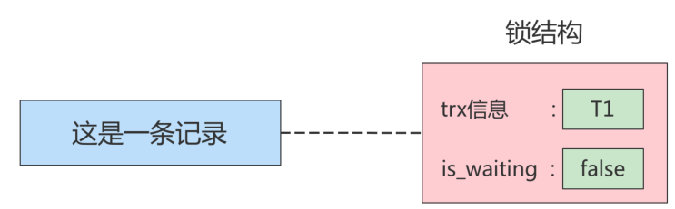

# 1. 概述
## 🔐 一、什麼是「鎖」？

在 **MySQL 中的鎖（Lock）**，本質上就是為了處理「**多個使用者或程式同時存取或修改相同資料時，如何避免衝突**」的機制。

這跟多執行緒編程中的鎖類似，目的是為了**保護資源的一致性與完整性**。

---

## 🧠 二、簡單比喻

想像你跟朋友都在同一時間打開一份 Excel 檔案來改內容：

- 如果沒有鎖，你們兩個人可能會**同時改同一格資料**，結果造成混亂。
- 如果系統有鎖，它會讓 **一個人先修改，另一個人等前一個人修改完後才能動作**，這樣就能避免錯誤。

---

## 🔄 三、在 MySQL 中鎖的實際例子

假設我們有一個銀行帳戶的表 `accounts`：

```sql
CREATE TABLE accounts (
    id INT PRIMARY KEY,
    name VARCHAR(100),
    balance DECIMAL(10,2)
);
```

有兩筆資料：

| id | name   | balance |
|----|--------|---------|
| 1  | Alice  | 1000.00 |
| 2  | Bob    | 1500.00 |

### ✅ 範例一：轉帳時使用鎖（模擬轉帳）

轉帳會同時修改兩筆資料：

```sql
START TRANSACTION;

-- 查詢 Alice 餘額
SELECT balance FROM accounts WHERE name = 'Alice' FOR UPDATE;

-- 查詢 Bob 餘額
SELECT balance FROM accounts WHERE name = 'Bob' FOR UPDATE;

-- 更新餘額
UPDATE accounts SET balance = balance - 100 WHERE name = 'Alice';
UPDATE accounts SET balance = balance + 100 WHERE name = 'Bob';

COMMIT;
```

### 🚨 說明：
- `SELECT ... FOR UPDATE`：這是 **加上排他鎖（Exclusive Lock）**，意思是「我查這筆資料，同時鎖住它，別人不能改」。
- 在 `COMMIT` 前，其他人若也想查或改這兩筆資料（也用 `FOR UPDATE`），就會被 **block 住（等待）**，直到這筆交易完成。

---

## 📚 四、MySQL 常見的鎖種類（簡述）

| 鎖類型 | 說明 |
|--------|------|
| 表鎖（Table Lock） | 鎖整張表，簡單但粗糙，效率低。 |
| 行鎖（Row Lock） | 精細鎖定特定資料列，InnoDB 引擎支援，並發效率高。 |
| 意向鎖（Intention Lock） | InnoDB 自動加，用來表示「我打算鎖這些行」，配合表鎖協作。 |
| 共享鎖（Shared Lock） | 允許讀，不允許寫（多個人可以同時讀）。 |
| 排他鎖（Exclusive Lock） | 讀寫都禁止，只有一人可以操作。 |

---

## 🛠 五、鎖的應用場景舉例

1. **訂單付款校驗**：
   - 同一張訂單只允許一次付款，避免雙扣。
   - 使用排他鎖鎖住該筆訂單記錄。

2. **庫存扣減**：
   - 熱賣商品購買時同時多人下單，庫存可能出現負數。
   - 使用 `SELECT ... FOR UPDATE` 鎖住商品庫存欄位，避免同時扣除。

---

# 2. MySQL并发事务访问相同记录
> 并发事务访问相同记录的情况大致可以划分为3种：

## 2.1 读-读情况
### 🧠 一、什麼是「讀-讀情況」？

> 指的是兩個或多個 **併發中的事務（Transactions）**，**只進行 SELECT 查詢操作**，而且查的是同一筆資料。

✅ 因為只是查資料，不會改變資料內容，所以彼此不會互相干擾，也就不會發生鎖衝突。

---

### 🎯 二、舉例說明

#### 假設有一張 `products` 資料表：

```sql
CREATE TABLE products (
    id INT PRIMARY KEY,
    name VARCHAR(100),
    stock INT
);
```

資料如下：

| id | name       | stock |
|----|------------|-------|
| 1  | iPhone 15  | 100   |

---

#### 👥 同時有兩個事務進行「讀」操作

###### ✅ 事務 A：

```sql
START TRANSACTION;
SELECT stock FROM products WHERE id = 1;
-- A 看到 stock 是 100
```

###### ✅ 事務 B：

```sql
START TRANSACTION;
SELECT stock FROM products WHERE id = 1;
-- B 也看到 stock 是 100
```

因為只是單純「讀」，不會加鎖（除非你用 `SELECT ... LOCK IN SHARE MODE` 或 `FOR UPDATE`），所以兩者**可以並發進行，不會互相阻塞**。

---

### 🔒 三、MySQL 背後怎麼處理？

如果使用的是 **InnoDB 儲存引擎** 並且使用預設的 **可重複讀（REPEATABLE READ）隔離級別**：

- MySQL 會使用 **MVCC（多版本併發控制）** 技術；
- 每個事務在「讀」的時候，其實是看到 **自己啟動時的資料快照版本**，這樣即使其他事務更新了資料，也不會影響本事務讀取的內容。

---

### 📌 四、延伸補充：會不會加鎖？

在一般情況下（不加鎖查詢）：

| 查詢方式 | 是否加鎖 | 是否允許並發 |
|-----------|-----------|----------------|
| `SELECT` | ❌ 不加鎖 | ✅ 允許 |
| `SELECT ... LOCK IN SHARE MODE` | ✅ 加共享鎖 | ⛔ 不允許同時改寫 |
| `SELECT ... FOR UPDATE` | ✅ 加排他鎖 | ⛔ 其他事務不能讀寫 |

---

### 🧾 五、重點總結

| 項目 | 說明 |
|------|------|
| 讀-讀場景 | 指的是多個事務同時查詢同一筆資料 |
| 是否會衝突？ | 不會，因為純粹查詢不會加鎖 |
| 背後機制 | InnoDB 使用 MVCC 保證一致性 |
| 實際用途 | 報表查詢、查庫存、讀訂單狀態等都屬此類 |

---

## 2.2 写-写情况
### 🔄 一、什麼是「寫-寫情況」？

> 多個事務同時**對同一筆資料進行寫入（UPDATE/DELETE/INSERT）**，此時如果不做控制，就會出現資料錯亂，這種現象叫做「**髒寫（Dirty Write）**」。

#### ⚠️ 髒寫例子（不允許發生）：
1. 事務 A 把產品價格改成 100 元，還沒提交。
2. 事務 B 同時把同一產品價格改成 50 元，也沒提交。
3. 最後只有一個會生效，但沒人知道最終資料是否正確。

👉 所以，MySQL **所有隔離級別**都不允許「髒寫」，必須讓這些寫操作「排隊」透過 **鎖機制** 控制。

---

### 🛠️ 鎖機制的工作原理
这个所谓的锁其实是一个 **内存中的结构** ，在事务执行前本来是没有锁的，也就是说一开始是没有 **锁结构** 和记录进行关联的，如图所示：


当一个事务想对这条记录做改动时，首先会看看内存中有没有与这条记录关联的 **锁结构** ，当没有的时候就会在内存中生成一个 **锁结构** 与之关联。比如，事务 T1 要对这条记录做改动，就需要生成一个 锁结构与之关联：



在 **锁结构** 里有很多信息，为了简化理解，只把两个比较重要的属性拿了出来：

1. trx 信息：代表这个锁结构是哪个事务生成的。
2. is_waiting ：代表当前事务是否在等待。

当事务 T1 改动了这条记录后，就生成了一个锁结构与该记录关联，因为之前没有别的事务为这条记录加锁，所以 `is_waiting` 属性就是 false ，我们把这个场景就称之为 **获取锁成功**，或者 **加锁成功**，然后就可以继续执行操作了。

在事务 T1 提交之前，另一个事务 T2 也想对该记录做改动，那么先看看有没有锁结构与这条记录关联，发现有一个锁结构与之关联后，然后也生成了一个锁结构与这条记录关联，不过锁结构的 `is_waiting` 属性值为 true ，表示当前事务需要等待，我们把这个场景就称之为 **获取锁失败**，或者 **加锁失败**，图示：


在事务T1提交之后，就会把该事务生成的 **锁结构释放掉**，然后看看还有没有别的事务在等待获取锁，发现了事务T2还在等待获取锁，所以把事务T2对应的锁结构的 `is_waiting` 属性设置为 false，然后把该事务对应的线程唤醒，让它继续执行，此时事务T2就算获取到锁了。效果图就是这样:


### 🔧 二、實際範例說明（用表格 + SQL）

假設你有一張 `products` 表：

```sql
CREATE TABLE products (
    id INT PRIMARY KEY,
    name VARCHAR(100),
    price DECIMAL(10, 2)
);
```

資料如下：

| id | name    | price |
|----|---------|-------|
| 1  | iPhone  | 999.00 |

---

#### 🚦 併發寫入流程模擬

###### ✅ 事務 T1 開始：

```sql
START TRANSACTION;
UPDATE products SET price = 899.00 WHERE id = 1;
```

這時：
- MySQL 發現該記錄沒有人加鎖
- 就會建立一個**內存中的鎖結構**（Lock Structure）
- 把 `T1` 的資訊記錄進去：`trx = T1, is_waiting = false`
- ✅ `T1` 成功獲得鎖，可繼續執行

---

###### ⛔ 事務 T2 開始（此時 T1 還沒提交）：

```sql
START TRANSACTION;
UPDATE products SET price = 799.00 WHERE id = 1;
```

這時：
- MySQL 發現該記錄**已經有 T1 的鎖結構**
- 所以 T2 也建立一個鎖結構，但是：
  - `trx = T2`
  - `is_waiting = true`（表示要等）
- ⛔ T2 被**掛起（等待）**，暫時不能動作

---

#### ✅ T1 提交

```sql
COMMIT;
```

這時 MySQL：
- 把 T1 的鎖結構**釋放**
- 發現 T2 還在等待
- 把 T2 的 `is_waiting` 改成 `false`，並**喚醒 T2**
- ✅ T2 獲得鎖，繼續執行

---

### 🧠 三、小結說法對應說明

| 說法 | 含義 | 結果 |
|------|------|------|
| 不加鎖 | 該操作不會建立鎖結構，可以直接操作 | 例如純讀操作 `SELECT` |
| 加鎖成功（獲取鎖成功） | 建立鎖結構，且 `is_waiting = false` | 事務可以立刻執行 |
| 加鎖失敗（獲取鎖失敗） | 建立鎖結構，`is_waiting = true` | 被 block 掛起，等待前一個釋放 |

---

### 🧩 四、圖解鎖狀態變化流程

```
T1 執行 UPDATE
 ↓
[鎖結構] 建立 → trx = T1, is_waiting = false（加鎖成功）

T2 執行 UPDATE
 ↓
[鎖結構] 建立 → trx = T2, is_waiting = true（等待 T1）

T1 COMMIT
 ↓
釋放 T1 的鎖 → 將 T2 的 is_waiting = false → 喚醒 T2
```

---

### ✅ 五、重點總結

| 重點 | 說明 |
|------|------|
| 寫-寫場景 | 多個事務對相同資料進行寫操作 |
| 鎖用途 | 保證「資料一致性」並避免「髒寫」 |
| MVCC 沒辦法處理寫寫場景 | 因為每個寫都會修改資料，無法用版本快照來處理，只能靠行鎖處理 |
| 最終效果 | 排隊執行，先來先服務，後來的等前面的完成 |

---

## 2.3 读-写或写-读情况
### 🧠 一、什麼是「讀-寫／寫-讀」情況？

指的是：
- 一個事務在「讀取」某筆資料
- 同時另一個事務在「修改」那筆資料

這種情況會涉及多種資料一致性的問題，可能出現：

| 問題類型 | 定義 |
|----------|------|
| **髒讀（Dirty Read）** | A 讀到 B 尚未提交的修改 |
| **不可重複讀（Non-repeatable Read）** | A 兩次讀同一筆資料，B 中途改變了它 |
| **幻讀（Phantom Read）** | A 兩次查詢滿足條件的資料筆數不同，因為 B 新增或刪除了符合條件的資料列 |

---

### 🔍 二、範例說明三種問題

我們以一張 `orders` 資料表為例：

```sql
CREATE TABLE orders (
    id INT PRIMARY KEY,
    user_id INT,
    amount DECIMAL(10,2)
);
```

初始資料只有一筆：

| id | user_id | amount |
|----|---------|--------|
| 1  | 1001    | 100.00 |

---

#### ✴️ 髒讀（Dirty Read）— MySQL 預設不允許（因為不支援 READ UNCOMMITTED）

###### 事務 B：

```sql
START TRANSACTION;
UPDATE orders SET amount = 200 WHERE id = 1;
-- 尚未 COMMIT
```

###### 事務 A（READ UNCOMMITTED 隔離級別）：

```sql
SELECT amount FROM orders WHERE id = 1;
-- 讀到 200（尚未提交的值） → 髒讀
```

✅ **MySQL InnoDB 預設不允許髒讀**，所以即使 B 還沒提交，A 也讀不到修改的資料（MVCC 生效）

---

#### ✴️ 不可重複讀（Non-repeatable Read）

###### 事務 A（REPEATABLE READ）：

```sql
START TRANSACTION;
SELECT amount FROM orders WHERE id = 1; -- 得到 100
...此時 B 修改...

SELECT amount FROM orders WHERE id = 1; -- 還是 100（快照讀）
```

###### 事務 B：

```sql
START TRANSACTION;
UPDATE orders SET amount = 300 WHERE id = 1;
COMMIT;
```

💡 **InnoDB 的 MVCC（多版本並發控制）會保證事務 A 在整個事務期間都看到相同快照的資料** → 不可重複讀被解決。

---

#### ✴️ 幻讀（Phantom Read）

###### 事務 A：

```sql
START TRANSACTION;
SELECT * FROM orders WHERE user_id = 1001; -- 查出 1 筆

...此時事務 B 插入資料...

SELECT * FROM orders WHERE user_id = 1001; -- 還是只有 1 筆（REPEATABLE READ 下可解決幻讀）
```

###### 事務 B：

```sql
START TRANSACTION;
INSERT INTO orders VALUES (2, 1001, 50);
COMMIT;
```

✅ 在 MySQL 的 `REPEATABLE READ` 隔離級別下，**使用 next-key lock 組合行鎖與間隙鎖，可以防止幻讀**。

---

### 🛠 三、MySQL 解決方式：MVCC + 鎖

| 問題類型 | MySQL 解法 | 是否預設解決 |
|----------|-------------|----------------|
| 髒讀     | 不允許 → 不使用 READ UNCOMMITTED | ✅ 預設安全 |
| 不可重複讀 | MVCC 快照一致性讀 | ✅ 預設安全 |
| 幻讀     | Next-Key Lock（行鎖 + 間隙鎖） | ✅ 在 REPEATABLE READ 下防止 |

---

### 🧾 四、小結

| 類型 | 問題範例 | MySQL 的預設防護方式（REPEATABLE READ） |
|------|----------|-----------------------------------|
| 讀-讀 | 不會有問題 | ✅ 允許並發 |
| 寫-寫 | 行鎖排隊，避免髒寫 | ✅ 使用行鎖 |
| 讀-寫／寫-讀 | 髒讀／不可重複讀／幻讀 | ✅ MVCC + Next-Key Lock 解決 |

---

## 2.4 并发问题的解决方案
> 怎么解决脏读、不可重复读、幻读这些问题呢？其实有两种可选的解决方案：

### 方案一：读操作利用多版本并发控制（MVCC，下章讲解），写操作进行加锁。
#### 🧠 一、為什麼會有這些「併發讀寫問題」？

| 問題 | 原因 |
|------|------|
| 髒讀 | A 讀到 B 還沒提交的寫入 |
| 不可重複讀 | A 第一次讀到 X 的值是 100，B 修改 X 為 200，A 第二次再讀時變了 |
| 幻讀 | A 查詢符合條件的資料列有 3 筆，B 新增一筆後，A 再查有 4 筆 |

這些問題是「讀寫操作互相干擾」造成的。

---

#### 🧩 二、MySQL 解法 = MVCC + 鎖

| 操作 | 解決方式 |
|------|------------|
| **讀** | 使用 **MVCC**：只讀快照，不加鎖 |
| **寫** | 使用 **行鎖（row lock）**：加鎖保護一致性 |

---

#### 📌 三、什麼是 MVCC？（多版本併發控制）

> MVCC 是一種用來支援「**非鎖式讀取（Non-locking Read）**」的技術。

##### ✅ 核心概念：

- 每條資料都有多個「版本」。
- 每個事務查詢時，會建立一個 **ReadView（讀視圖）**，只會讀到：
  - 在 **建立 ReadView 時，已經提交的版本**
- 尚未提交的或晚於該視圖建立的資料都 **不可見**

---

#### 🧪 四、舉例：MVCC 是怎麼保證一致性讀的

假設你有一筆資料：

| id | amount |
|----|--------|
| 1  | 100    |

##### ✅ 事務 A：

```sql
START TRANSACTION;
SELECT amount FROM orders WHERE id = 1; -- 看到 100
```

此時 MySQL 會為這筆查詢生成一個 **ReadView-A**

---

##### 🚨 事務 B（同時進行）：

```sql
START TRANSACTION;
UPDATE orders SET amount = 200 WHERE id = 1;
COMMIT;
```

######## ✅ 若 A 在 `READ COMMITTED` 隔離級別：

- A 再次執行 `SELECT` → **新的 ReadView 會看到最新提交的 200**
- 避免「髒讀」，但會發生「不可重複讀」

######## ✅ 若 A 在 `REPEATABLE READ` 隔離級別：

- A 所有查詢都使用 **同一個 ReadView-A**
- 所以 A 無論查幾次都只看到 100（即使 B 改為 200）

---

#### 🔁 五、ReadView 的產生時機比較

| 隔離級別 | ReadView 產生時機 | 影響 |
|----------|------------------|------|
| READ COMMITTED | 每次 `SELECT` 生成一次新的 ReadView | 可以避免髒讀，但可能產生不可重複讀 |
| REPEATABLE READ | 只在第一次 `SELECT` 時生成，後面都共用 | 可避免髒讀、不可重複讀、幻讀 |

---

#### 🔒 六、寫操作仍需鎖：MVCC 不能解決「寫-寫」衝突

雖然 MVCC 解決了「讀-寫衝突」，但：
- 若兩個事務同時寫一筆資料（UPDATE/DELETE）：
- **仍然必須用排他鎖（行鎖）來保護資料一致性**

---

#### ✅ 七、小結與應用場景整理

| 情境 | MySQL 解法 | 技術 |
|------|-------------|--------|
| 避免髒讀 | `READ COMMITTED` + MVCC | 多版本視圖 |
| 避免不可重複讀 | `REPEATABLE READ` + 單一 ReadView | 快照一致性 |
| 避免幻讀 | `REPEATABLE READ` + next-key lock | MVCC + 鎖結構 |
| 寫操作衝突 | 寫時加行鎖（排他鎖） | 鎖結構 |

---

### 方案二：读、写操作都采用加锁的方式。
> MySQL 解決併發問題的第二種方式：**讀與寫操作都「加鎖」處理**，以避免髒讀、不可重複讀與幻讀的產生。這種做法屬於**悲觀鎖（Pessimistic Locking）**策略。

---

#### 🔐 一、什麼是「讀寫都加鎖」？

> 當你在「讀取」資料時，也一併**鎖住這筆資料**，讓其他事務在你「提交或回滾前**不能讀不能寫**這筆資料」。

這種策略是用來處理「對資料敏感」的業務，比如：銀行餘額、訂單扣庫存、用戶積分變更等。

---

#### 📌 二、讀與寫都加鎖是怎麼運作的？

##### ✅ 加鎖方式：`SELECT ... FOR UPDATE` 或 `SELECT ... LOCK IN SHARE MODE`

- `FOR UPDATE`：排他鎖（Exclusive Lock），**只允許自己寫，別人不能讀也不能寫**
- `LOCK IN SHARE MODE`：共享鎖（Shared Lock），**允許讀，不允許寫**

---

#### 🧪 三、實例說明：逐一解決併發問題

##### ✴️ 1. 髒讀（Dirty Read）

**❌ 錯誤情境：**

1. 事務 A 寫入帳戶餘額 `UPDATE balance SET amount = 200 WHERE id = 1`（未提交）
2. 事務 B 查詢帳戶餘額 `SELECT amount FROM balance WHERE id = 1`
3. A 回滾 → B 讀到錯誤數據

**✅ 解決方式：**

```sql
-- A 寫時就加鎖（InnoDB 自動對寫操作加排他鎖）

-- B 要讀取時，也用 SELECT ... FOR UPDATE
SELECT amount FROM balance WHERE id = 1 FOR UPDATE;
```

👉 這樣，**B 的查詢會被阻塞，直到 A 釋放鎖為止**，自然無法髒讀。

---

##### ✴️ 2. 不可重複讀（Non-repeatable Read）

**❌ 錯誤情境：**

1. A 查詢 `SELECT amount FROM balance WHERE id = 1` 得到 100
2. B 更新為 150 並提交
3. A 再查一次，變成 150 → 數據變了

**✅ 解決方式：**

```sql
START TRANSACTION;
SELECT amount FROM balance WHERE id = 1 FOR UPDATE;
-- 此時鎖住該筆資料，B 無法修改
```

👉 這樣就保證：**只要 A 不提交，其他人不能改**，A 無論查幾次都會一致。

---

##### ✴️ 3. 幻讀（Phantom Read）

**❌ 錯誤情境：**

1. A 查詢 `SELECT * FROM orders WHERE amount > 100`
2. B 插入一筆 `amount = 150` 並提交
3. A 再查一次 → 發現多一筆資料，這就是幻讀

**✅ 解決方式（加「範圍鎖」／間隙鎖）：**

```sql
START TRANSACTION;
SELECT * FROM orders WHERE amount > 100 FOR UPDATE;
```

- InnoDB 會使用 **next-key lock**（行鎖 + 間隙鎖）來鎖住這個條件範圍
- **這不僅鎖住已存在的記錄，也鎖住“這段範圍內可以插入的地方”**
- 所以 **B 無法在 amount > 100 的區間插入新資料**

---

#### 🔁 四、讀操作加鎖的效果圖解

```text
T1: SELECT amount FROM balance WHERE id = 1 FOR UPDATE
       ↓ 鎖定該筆資料
       ↓ 其他事務（T2）無法讀或寫
       ↓ T1 完成後 COMMIT
       ↓ 鎖釋放，T2 才能執行
```

---

#### 🧾 五、小結比較：MVCC vs 加鎖策略

| 比較項目 | MVCC | 讀寫都加鎖 |
|----------|------|--------------|
| 適用場景 | 查詢為主、容忍快照資料 | 對數據一致性要求極高 |
| 是否加鎖 | 不加鎖（快照讀） | 明確加鎖（阻止他人操作） |
| 可否讀舊版本 | ✅ 是 | ❌ 否，只能讀最新且加鎖 |
| 效能 | 高（並發性強） | 低（容易阻塞） |
| 舉例 | 報表查詢、用戶列表 | 銀行轉帳、訂單支付 |

---

#### ✅ 六、適合使用「加鎖讀寫」的場景

- 銀行帳戶轉帳（查出餘額後鎖定）
- 線上購物扣庫存（防止超賣）
- 搶紅包／秒殺活動（保證唯一性）
- 多人同時編輯同一筆關鍵資料（防止覆寫）

---

如果你想看某一類情境（例如搶紅包、轉帳）完整的 SQL 實作流程，我可以幫你模擬範例。需要嗎？

### 小結對比
#### 🧠 一、MVCC vs 加鎖：核心對比表

| 項目 | MVCC（多版本併發控制） | 加鎖（悲觀鎖） |
|------|------------------------|----------------|
| 是否加鎖 | ❌ 不加鎖（快照讀） | ✅ 讀寫都加鎖 |
| 讀-寫是否衝突 | ✅ 不衝突，可以並發執行 | ❌ 衝突，需等待排隊 |
| 效能 | 🚀 高效，適合大量查詢 | 🐢 效能較低，容易阻塞 |
| 避免問題 | 髒讀、不可重複讀、幻讀 | 同上，但透過鎖來保證 |
| 原理 | 用 ReadView + undo log 回溯歷史版本 | 實體加行鎖或表鎖，限制其他操作 |
| 適合場景 | 通用查詢、報表、非強一致性業務 | 銀行、庫存、轉帳等關鍵操作 |

---

#### 🧪 二、例子對比：同樣是查詢帳戶金額

##### ✅ 使用 MVCC（快照讀，效率高）

```sql
-- InnoDB 自動使用快照讀（非鎖式讀）
SELECT amount FROM account WHERE id = 1;
```

- 查詢時會看到**事務開始時提交的版本**
- 數據穩定、無鎖競爭
- 適合報表分析、查詢用戶列表等

---

##### ⛔ 使用加鎖方式（確保一致性，會阻塞）

```sql
-- 要求查出餘額後立即鎖定該行，不讓其他人操作
START TRANSACTION;
SELECT amount FROM account WHERE id = 1 FOR UPDATE;
```

- 一旦讀取，就鎖住該行
- **其他事務無法修改或查詢該行資料（若也用 FOR UPDATE）**
- 適合：**轉帳、訂單支付、競標保證金等精確交易流程**

---

#### 🎯 三、實務建議

| 情境 | 建議用法 | 原因 |
|------|-----------|------|
| 一般查詢 / 報表 | ✅ MVCC | 提高性能，讀操作多 |
| 銀行帳戶轉帳 | ✅ 加鎖讀寫 | 要求絕對一致性 |
| 購物車查庫存 | MVCC 或 加鎖（視情況） | 若有「庫存不足」風險，建議加鎖 |
| 查詢用戶資訊（非資安） | MVCC | 沒有衝突風險，不需加鎖 |
| 編輯設定資料 | 加鎖 | 防止多人同時更改相同設定產生衝突 |

---

#### 📌 四、總結

> 「讀寫是否加鎖」是一種權衡：

- ✅ **MVCC 效能高，但不是所有場景都保證一致性**
- ✅ **加鎖雖然慢，但在需要**「強一致性」**的場景是必要的**

MySQL 運行時會根據你寫的 SQL 和隔離級別自動選擇是否用 MVCC 或鎖，不過你也可以手動控制（如用 `FOR UPDATE` 加強保護）。

---

# 3. 锁的不同角度分类
锁的分类图，如下：


## 3.1 对数据操作的类型划分：读锁、写锁
### 3.1.1 概述
當我們談到 MySQL 的「**讀鎖（S Lock）**」與「**寫鎖（X Lock）**」時，是從**對資料操作的角度**來分類的，主要目的是為了解決**資料在併發訪問時可能產生的衝突問題**。

以下是詳細解釋與實際例子：

---

#### 🔒 鎖的基本定義與差異

| 鎖類型   | 又稱     | 縮寫 | 功能特色                                                                 |
|----------|----------|------|--------------------------------------------------------------------------|
| 讀鎖     | 共享鎖   | S    | 多個讀操作可以共享同一份資料，不會互相阻塞。                           |
| 寫鎖     | 排他鎖   | X    | 寫操作會阻塞其他讀/寫操作，以保證資料的正確性與一致性。               |

---

#### 🧠 為什麼要這樣設計？

因為：
- **讀讀之間**互不影響（大家只是「看資料」而已）。
- 但 **寫寫、讀寫、寫讀之間**會有問題（可能有人改了資料，另一個人讀到錯誤值，或同時寫入導致衝突）。

所以設計成：
- 「讀鎖」讓大家可以一起讀。
- 「寫鎖」則要保證「自己專用」，任何讀或寫都要等它結束。

---

#### ✅ 舉例說明（行級鎖）

我們以 InnoDB 引擎為例，它支援**行級鎖（row-level lock）**，下面是一個具體案例：

##### 初始狀況：
資料表 `account` 中某筆記錄為：

```sql
id: 1, name: 'Tom', balance: 1000
```

##### 步驟 1：T1 事務獲得 `id=1` 行的**讀鎖**

```sql
START TRANSACTION;
SELECT * FROM account WHERE id = 1 LOCK IN SHARE MODE;
-- T1 獲得 id=1 的讀鎖
```

此時 **其他事務可以繼續讀**這一筆資料：

##### 步驟 2：T2 也讀取 `id=1`

```sql
START TRANSACTION;
SELECT * FROM account WHERE id = 1 LOCK IN SHARE MODE;
-- T2 成功獲得讀鎖
```

因為兩者都是「讀操作」，所以不會互相阻塞。

##### 步驟 3：T3 嘗試寫入 `id=1`

```sql
START TRANSACTION;
UPDATE account SET balance = 800 WHERE id = 1;
-- ⚠️ T3 被阻塞！必須等 T1、T2 釋放讀鎖後才能加上寫鎖。
```

這是因為寫鎖是排他的，不能和任何其他讀/寫鎖共存。

---

#### 📝 小結

| 操作組合        | 是否允許並發 | 說明                     |
|-----------------|--------------|--------------------------|
| 讀 + 讀         | ✅ 是         | 皆為共享鎖，不會衝突     |
| 寫 + 寫         | ❌ 否         | 都需要排他鎖，需互相等待 |
| 讀 + 寫 / 寫 + 讀 | ❌ 否         | 寫鎖排他，會阻塞其他操作 |

---

若你有興趣，我也可以幫你用 SQL 實作一個測試場景來實驗看看行級讀鎖與寫鎖的行為，會更容易理解。要幫你設計嗎？

### 3.1.2 锁定读
> MySQL 的「**锁定读（Locking Read）**」，這是針對資料讀取過程中為了避免併發衝突而主動**加鎖**的一種策略。這在高併發場景下非常重要，特別是當你要保證讀到的資料在整個事務期間不會被別人改變時。

---

#### 🔍 一、為什麼要「鎖定讀」？

普通的 `SELECT` 是「非鎖定讀」，它不會加任何鎖，也不會阻塞其他操作，速度快，但無法避免：

- **不可重複讀**：同一條記錄在同一事務中讀兩次，值卻變了。
- **幻讀**：第一次查不到某些記錄，第二次卻查到了（例如 WHERE 條件的 insert）。

為了解決這些問題，可以使用「**加鎖讀取**」來提升一致性。

---

#### 🔒 二、兩種鎖定讀的語法與行為比較

| 語法                            | 鎖類型  | 允許別人讀嗎 | 允許別人改嗎 | 使用場景 |
|---------------------------------|---------|---------------|---------------|-----------|
| `SELECT ... LOCK IN SHARE MODE`<br>或 `SELECT ... FOR SHARE` | **共享鎖（S鎖）** | ✅ 只能加S鎖 | ❌ 禁止加X鎖 | 想讀資料且防止別人寫 |
| `SELECT ... FOR UPDATE`         | **排他鎖（X鎖）** | ❌ 不能加任何鎖 | ❌ 禁止讀/寫 | 想讀資料且後續要修改 |

---

#### ✅ 三、具體實例說明（使用 InnoDB）

假設有一張帳戶表：

```sql
CREATE TABLE account (
  id INT PRIMARY KEY,
  name VARCHAR(50),
  balance DECIMAL(10,2)
) ENGINE=InnoDB;

INSERT INTO account VALUES (1, 'Tom', 1000.00);
```

---

##### 🧪 範例 1：共享鎖（`LOCK IN SHARE MODE`）

###### T1 事務執行：

```sql
START TRANSACTION;
SELECT * FROM account WHERE id = 1 LOCK IN SHARE MODE;
```

- 此時 `id = 1` 的這筆資料被加上 **S鎖**
- 其他事務 **可以再加 S鎖**，也就是可以「也用 SHARE 模式讀」
- 但 **不能加 X鎖**，也就是「不能更新這筆資料」

###### 若 T2 嘗試修改：

```sql
START TRANSACTION;
UPDATE account SET balance = 800 WHERE id = 1;
-- ⚠️ 阻塞！因為 T1 尚未釋放 S 鎖
```

---

##### 🧪 範例 2：排他鎖（`FOR UPDATE`）

###### T1 事務執行：

```sql
START TRANSACTION;
SELECT * FROM account WHERE id = 1 FOR UPDATE;
```

- 此時 `id = 1` 的這筆資料被加上 **X鎖**
- 其他事務 **不能加 S鎖 或 X鎖**
- 所以無法**讀取或修改**這筆資料（除非是快照讀）

###### 若 T2 嘗試讀取：

```sql
START TRANSACTION;
SELECT * FROM account WHERE id = 1 LOCK IN SHARE MODE;
-- ⚠️ 阻塞！因為 T1 持有 X 鎖
```

---

#### 📌 四、使用時機總結

| 操作目的                        | 建議使用語法                   |
|---------------------------------|--------------------------------|
| 查資料，但不希望別人更新它       | `LOCK IN SHARE MODE` 或 `FOR SHARE` |
| 查資料後馬上就要更新            | `FOR UPDATE`                   |
| 查資料且不在乎別人是否更動       | 普通 `SELECT`（快照讀）        |

---

#### MySQL8.0新特性：
> 在 **5.7及之前** 的版本，`SELECT ... FOR UPDATE`，如果获取不到锁，会一直等待，直到 `innodb_lock_wait_timeout` 超时。在 `8.0` 版本中，`SELECT ... FOR UPDATE`、`SELECT ... FOR SHARE` 添加 `NOWAIT` 、 `SKIP LOCKED`语法，跳过锁等待，或者跳过锁定。

1. NOWAIT：如果查询的行已经加锁，会立即报错返回

2. SKIP LOCKED：如果查询的行已经加锁，只返回结果中不包含被锁定的行


### 3.1.2 写操作
#### 🔨 1. DELETE 操作與鎖

##### 🧠 操作流程：
- 在 B+ 樹中找到目標資料的位置。
- **加 X 鎖（排他鎖）**保護這筆資料。
- 並不是真的「立即刪除」，而是執行所謂的 `**delete mark**`（打上刪除標記），實際刪除交由 `purge thread` 之後處理。

##### ✅ 範例：

```sql
START TRANSACTION;
DELETE FROM account WHERE id = 1;
-- 會對 id = 1 的資料加上 X 鎖，打上 delete mark
```

此時其他事務如果想要讀取或更新這筆記錄，會被阻塞。

---

#### 🔁 2. UPDATE 操作與鎖（分三種情況）

##### 情況 1：**沒改主鍵，也沒變動欄位大小**
- 只需要加 **X 鎖**，直接在原位置更新資料即可。

**✅ 例子：**

```sql
-- balance 是 DECIMAL(10,2)，欄位長度沒變
UPDATE account SET balance = 800.00 WHERE id = 1;
```

##### 情況 2：**沒改主鍵，但有欄位長度變動**
- 例如 `VARCHAR` 欄位內容變長或變短。
- 這時會：
  1. 加 X 鎖
  2. **物理刪除**舊記錄（放入垃圾鏈表）
  3. 插入新記錄（會用隱式鎖保護）

**✅ 例子：**

```sql
-- name 是 VARCHAR(10)
UPDATE account SET name = 'Thomas' WHERE id = 1;
-- 舊記錄會被刪除並插入一筆新記錄
```

##### 情況 3：**修改了主鍵（或唯一索引欄位）**
- 被視為一個 **DELETE + INSERT** 組合操作。
- 所以也會經歷 DELETE 加 X 鎖、再由 INSERT 使用隱式鎖。

**✅ 例子：**

```sql
-- 假設 id 是主鍵
UPDATE account SET id = 100 WHERE id = 1;
-- 等同於：DELETE id = 1 → INSERT id = 100
```

---

#### ➕ 3. INSERT 操作與鎖

- 插入新資料通常**不顯式加鎖**，而是使用「**隱式鎖（Implicit Lock）**」來保護這筆資料，讓它在本事務未提交前，不會被其他事務查詢或修改。

##### ✅ 範例：

```sql
START TRANSACTION;
INSERT INTO account (id, name, balance) VALUES (2, 'Amy', 1000);
-- 不加顯式鎖，但這筆資料有隱式鎖保護，其他人看不到
```

若你用別的事務查詢 `id = 2`，是查不到的，直到這個事務 `COMMIT`。

---

#### 🧠 小結：三種操作與鎖的對照

| 操作   | 鎖的類型        | 說明                                                                 |
|--------|------------------|----------------------------------------------------------------------|
| DELETE | 顯式 X 鎖        | 對記錄加排他鎖，標記為刪除                                           |
| UPDATE | 視情況而定       | - 不改鍵、長度不變：原地修改，加 X 鎖<br> - 長度變：刪除+插入<br> - 改鍵值：等同 DELETE + INSERT |
| INSERT | **隱式鎖**       | 只要還沒 COMMIT，其他人就查不到該筆資料                             |

---

## 3.2 从数据操作的粒度划分：表级锁、页级锁、行锁
### 1. 概述
MySQL 中根據「**鎖的粒度（Lock Granularity）**」所做的分類，包括：

- 表級鎖（**Table-Level Lock**）
- 頁級鎖（**Page-Level Lock**）
- 行級鎖（**Row-Level Lock**）

這些是**從資料操作「範圍大小」的角度**出發來分類的鎖。下面我用簡單比喻 + 範例來解釋，幫你建立清晰概念。

---

#### 🔒 什麼是鎖的粒度？

> **鎖粒度 = 鎖住資料的範圍大小**

- 鎖範圍越大，管理成本低，但併發度差（大家都卡住）
- 鎖範圍越小，併發度高，但管理成本高（系統要記很多鎖）

所以 **MySQL 根據存儲引擎和需求選擇不同的鎖粒度**，來在「效能」與「並發」間做平衡。

---

#### 1️⃣ 表級鎖（Table-Level Lock）

##### ✅ 概念：
- 一次 **鎖整張表**
- 誰鎖了，其他人就不能對這張表做任何操作（讀或寫）

##### ✅ 優點：
- 快速、省資源

##### ❌ 缺點：
- 併發性最差，一個人操作，全場等

##### 📦 使用者範例：

```sql
LOCK TABLES account WRITE;
-- 全表加寫鎖，只有這個 session 能操作這張表
```

或 MyISAM 引擎就只支援表級鎖。

---

#### 2️⃣ 頁級鎖（Page-Level Lock）

##### ✅ 概念：
- 鎖住 **一個頁面（資料塊）**
- 每頁包含多筆記錄，通常一頁大小為 16KB

##### 📦 比喻：
像是圖書館把「同一排書架」鎖起來，而不是鎖整間圖書館（表），也不是鎖特定書（行）

##### ✅ 優點：
- 併發度比表級高
- 鎖數量比行級少，管理開銷也不大

##### ❌ 缺點：
- 可能會有**間隙鎖（gap lock）**導致 **死鎖**
- MySQL InnoDB **不使用頁級鎖**，這是某些 NoSQL 或老系統（如 BDB）的鎖法

---

#### 3️⃣ 行級鎖（Row-Level Lock）

##### ✅ 概念：
- **只鎖正在操作的那一行**
- 是 InnoDB 的核心特性（InnoDB 是 MySQL 的預設引擎）

##### 📦 比喻：
你只鎖住你看的那本書，別人還能自由翻其他書

##### ✅ 優點：
- **最大併發度**，適合 OLTP（大量即時交易）

##### ❌ 缺點：
- 鎖數量多，系統開銷大
- 實作較複雜

##### 📦 使用者範例：

```sql
START TRANSACTION;
UPDATE account SET balance = 800 WHERE id = 1;
-- InnoDB 自動對 id = 1 這一行加行鎖
```

---

#### 🧠 小結：三種鎖粒度比較

| 粒度     | 鎖住範圍     | 併發度 | 系統開銷 | 常見於       |
|----------|--------------|--------|-----------|--------------|
| 表級鎖   | 整張表       | ❌ 最差 | ✅ 最小    | MyISAM       |
| 頁級鎖   | 一個資料頁   | ⚠ 中等 | ⚠ 中等    | 一些老式引擎 |
| 行級鎖   | 單一資料行   | ✅ 最佳 | ❌ 最大    | ✅ InnoDB     |

---

#### ✅ 實務建議：

- 預設使用 InnoDB（行級鎖 + MVCC），適合多用戶、高併發場景
- 表級鎖通常用於小工具、低併發或特殊批次需求
- 不用刻意調整粒度，選對引擎 + 設計好索引即可

---

### 2. 表锁（Table Lock）
> 该锁会锁定整张表，它是MySQL中最基本的锁策略，并 **不依赖于存储引擎**，并且表锁是 **开销最少** 的策略。由于表级锁一次会将整个表锁定，所以可以很好的避免死锁的问题。当然，锁的粒度大所带来最大的负面影响就是出现锁资源争用的概率也会最高，导致 **并发率大打折扣**。

#### ① 表级别的S锁、X锁
##### InnoDB存储引擎
> **重點說明：**
> 1. **InnoDB 一般不會主動使用「表級鎖」來保護 SQL 操作（SELECT、INSERT、UPDATE、DELETE）**  
> 2. **只有在執行 DDL（例如 ALTER、DROP）時，才會使用「元資料鎖（MDL）」**  
> 3. **手動使用 `LOCK TABLES` 在 InnoDB 中不建議**，因為會降低並發性

###### 🔍 一、InnoDB 不會在 DML 操作時加表鎖（而是行鎖）

**📘 說明：**

當你在執行：`SELECT`、`INSERT`、`DELETE`、`UPDATE`

> - InnoDB 是**行級鎖引擎**，會加**行鎖（Row-Level Lock）**，不會對整張表加表鎖。

**✅ 舉例：**

```sql
START TRANSACTION;
UPDATE account SET balance = 500 WHERE id = 1;
```

> 此語句會加「行鎖」在 `id = 1` 這筆資料上，不會鎖整張 `account` 表。

---

###### 🔐 二、執行 DDL（例如 ALTER、DROP）時使用 Metadata Lock（MDL）

**📘 說明：**
- 當你要「改變資料表結構」的時候（例如：`ALTER TABLE`、`DROP TABLE`），系統會加一種叫做「**元資料鎖（MDL）**」。
- 目的：**保護資料結構不被中斷或改變**

**📌 關鍵點：**
- **DML 等操作（SELECT、UPDATE）也會自動加 MDL（讀鎖）**
- **DDL 操作會加 MDL（寫鎖）**
- **讀鎖和寫鎖會互相阻塞**

**✅ 舉例說明：**

假設有兩個工作階段：

Session 1：

```sql
START TRANSACTION;
SELECT * FROM account WHERE id = 1;
-- 執行後會自動加 MDL「讀鎖」
```

Session 2：

```sql
ALTER TABLE account ADD COLUMN email VARCHAR(100);
-- ⚠️ 被阻塞！因為 Session 1 還沒結束（還持有 MDL 讀鎖）
```

> 這就是為什麼即使只是查資料，也會阻塞「資料表結構的更改」。

---

###### 📌 三、LOCK TABLES：InnoDB 不建議用

你也可以手動為 InnoDB 表加表級鎖，但這是 **舊式做法，不推薦使用**。

**✅ 語法範例：**

```sql
LOCK TABLES account READ;
-- 加表級S鎖，只能讀，不能寫

LOCK TABLES account WRITE;
-- 加表級X鎖，只允許自己寫，其他人全部阻塞
```

**⚠️ 缺點：**
- **降低並發性能**
- 不適用於 InnoDB 設計哲學（行鎖 + MVCC）
- 有 autocommit 問題（使用 LOCK TABLES 後自動關閉 autocommit）

**✅ 適用場景（很罕見）：**
- 你想完全控制鎖（例如：某些資料匯入、修復腳本）
- 某些特殊崩潰恢復狀況（如官方說明中提及）

---

###### 🧠 小結比較表

| 類型             | 鎖住什麼？ | 誰會用？                     | 是否推薦使用？ |
|------------------|-------------|-------------------------------|----------------|
| **行鎖**（Row Lock） | 單一行資料    | InnoDB 在 DML 操作時自動使用      | ✅ 推薦（預設）     |
| **表鎖**（Table Lock）| 整張表        | `LOCK TABLES` 手動加鎖         | ❌ 不推薦          |
| **元資料鎖（MDL）** | 表的結構       | 所有 DML/DDL 自動觸發            | ✅ 系統自動處理     |

---

##### MylSAM存储引擎
步骤1：创建表并添加数据


步骤2:查看表上加过的锁

```sql
SHOW OPEN TABLES；
--或者
SHOW OPEN TABLES WHERE In_use > 0;
```

步骤3:手动增加表锁命令


比如：


步骤4：释放表锁

```sql
unlock tables; --使用此命令解锁当前加锁的表
```

比如：


###### 加读锁

我们为mylock表加read锁(读阻塞写)，观察阻塞的情况，流程如下:


###### 加写锁

为mylock表加write锁，观察阻塞的情况，流程如下:


#### ② 意向锁 （intention lock）
##### 概述
**InnoDB 的「意向鎖（Intention Locks）」**，這是一種為了支援 **「多粒度鎖（Multiple Granularity Locking）」** 所設計的**表級鎖**，用來協調「行鎖」與「表鎖」之間的關係。

我會幫你分 4 步驟來講清楚它：

---

###### 🔍 一、什麼是意向鎖？

> 意向鎖不是鎖某一筆資料，而是**告訴系統「我要鎖哪幾筆資料」的意圖宣告**。

這樣設計的目的，是為了讓資料庫能快速判斷：

>「是否允許其他事務對這張表加表級鎖？」

舉例來說：
- 我只鎖了一行資料，如果別人要對整張表加鎖，你總不能每行都去檢查吧？所以我在表上設個「標記」，表示：「**我已經有行鎖喔**」，這就是「**意向鎖**」。

---

###### 🧩 二、意向鎖的種類與觸發條件

| 意向鎖類型 | 鎖用途           | 如何觸發？                                          |
|------------|------------------|------------------------------------------------------|
| IS（意向共享鎖） | 表示「我要對某些行加 **共享鎖 S 鎖**」 | 使用 `SELECT ... LOCK IN SHARE MODE` 時自動加在表上 |
| IX（意向排他鎖） | 表示「我要對某些行加 **排他鎖 X 鎖**」 | 使用 `SELECT ... FOR UPDATE` 或 `UPDATE/DELETE` 時加在表上 |

👉 **這些鎖都是 InnoDB 自動加的，用戶無需手動加。**

---

###### ✅ 三、具體操作與例子

**🎯 範例 1：查詢一行並加共享鎖（IS 鎖）**

```sql
START TRANSACTION;
SELECT * FROM account WHERE id = 1 LOCK IN SHARE MODE;
```

➡ InnoDB 行為：
- 對 `account` 表加 **IS（意向共享）鎖**
- 對 `id = 1` 這筆資料加 **S（共享）鎖**

---

**🎯 範例 2：查詢一行並加排他鎖（IX 鎖）**

```sql
START TRANSACTION;
SELECT * FROM account WHERE id = 1 FOR UPDATE;
```

➡ InnoDB 行為：
- 對 `account` 表加 **IX（意向排他）鎖**
- 對 `id = 1` 這筆資料加 **X（排他）鎖**

---

###### 🧠 四、為什麼意向鎖重要？

它解決了一個**效率問題**：

假設某事務 T1 對表 `account` 某幾行加了行鎖。此時另一事務 T2 想要對 `account` 加表級 X 鎖（鎖整張表）。

若沒有意向鎖：
- 系統必須一行行去檢查：有沒有被鎖？誰鎖的？

有了意向鎖：
- 只需看表上的「意向鎖」就知道：「喔～這張表有行被上鎖了，不能加表鎖。」

---

###### 🧱 五、意向鎖與其他鎖的關係（鎖兼容矩陣）

|          | IS   | IX   | S    | X    |
|----------|------|------|------|------|
| **IS**   | ✅   | ✅   | ✅   | ❌   |
| **IX**   | ✅   | ✅   | ❌   | ❌   |
| **S**    | ✅   | ❌   | ✅   | ❌   |
| **X**    | ❌   | ❌   | ❌   | ❌   |

👉 你可以看到：IS 與 IS / IX 可以共存，但 **任何一方要加 X 鎖時，幾乎都會衝突。**

---

###### 📝 小結

| 名稱 | 類型     | 作用                                                  | 使用情境                        |
|------|----------|---------------------------------------------------------|----------------------------------|
| IS   | 意向共享 | 表示我要對某些行加 S 鎖                                  | `SELECT ... LOCK IN SHARE MODE` |
| IX   | 意向排他 | 表示我要對某些行加 X 鎖                                  | `UPDATE`、`DELETE`、`FOR UPDATE`|
| S/X  | 行/表鎖  | 真正鎖住的對象，用來保證資料一致性                         | 實際操作時加在資料行或表上的鎖 |

---

##### 意向锁要解决的问题
「**MySQL 中意向鎖的用途與解決的問題**」，這個問題的核心在於：

> **當多個事務同時存取資料時，如何讓資料庫快速判斷是否能對整張表加鎖，而不用逐行檢查？**

這就是 **意向鎖（Intention Lock）** 存在的意義。

---

###### 🔐 一、意向鎖要解決的問題：高效判斷加鎖衝突

**❓ 問題背景**

假設：

- 一個事務 T1 對表 `teacher` 的某一行資料加了行級的 **排他鎖（X 鎖）**
- 另一個事務 T2 想要對整張 `teacher` 表加一把 **表級共享鎖（S 鎖）**

此時，若 **沒有意向鎖**，T2 必須：

> 🔍「去掃描整張表的每一行，看是不是有哪一行被上 X 鎖了？」

這樣做效率非常低！尤其是幾萬筆資料時。

---

###### ✅ 二、意向鎖的解決方案：快速提示表中是否有人上行鎖

當 T1 對某一行加排他鎖時，**InnoDB 會自動在表上加一個意向排他鎖（IX 鎖）**。

這樣其他事務（例如 T2）就可以透過看「表鎖」的狀況，就知道是否有人鎖了表中的某些行。

---

###### 🧪 三、實際範例解析

**✅ 建表與插入資料：**

```sql
CREATE TABLE teacher (
  id INT PRIMARY KEY,
  name VARCHAR(50)
);

INSERT INTO teacher VALUES (1, 'Tom'), (2, 'Jack'), (3, 'Ann'), (4, 'Lisa'), (5, 'Amy'), (6, 'John');
```

---

**🎯 交易流程：**

**🧩 1. 事務 A 對某行加行級鎖（加 X 鎖）**

```sql
-- Session A
BEGIN;
SELECT * FROM teacher WHERE id = 6 FOR UPDATE;
```

🔒 這時會自動：
- 對 `teacher` 表加 **IX（意向排他鎖）**
- 對 id = 6 的這筆資料加 **X 鎖**

---

**🧩 2. 事務 B 嘗試加整張表的共享鎖（S 鎖）**

```sql
-- Session B
BEGIN;
LOCK TABLES teacher READ;
```

🔒 這會嘗試對 `teacher` 表加一把 **S 鎖（表級共享鎖）**

---

**🔄 此時會發生什麼？**
- 表上的 **IX 鎖（T1 的）** 與 **S 鎖（T2 嘗試的）** 衝突 ❌
- T2 被阻塞，因為 **IX 和 S 不相容**
- MySQL 不需要去檢查表中的每一行資料，就可以知道：「有人已經在鎖這張表的某些行」

---

###### 📌 四、為什麼這樣效率高？

有了意向鎖之後：
- 要加 **表鎖** 的事務，只需檢查 **表上是否已有 IX 鎖 / IS 鎖**
- 不用再去一行一行查有沒有被加行鎖

這就是 **多粒度鎖（Multiple Granularity Locking）架構下的高效鎖管理策略**

---

###### 🔄 五、意向鎖互斥關係簡表（常考）

|        | IS  | IX  | S   | X   |
|--------|-----|-----|-----|-----|
| **IS** | ✅  | ✅  | ✅  | ❌  |
| **IX** | ✅  | ✅  | ❌  | ❌  |
| **S**  | ✅  | ❌  | ✅  | ❌  |
| **X**  | ❌  | ❌  | ❌  | ❌  |

- ✅ 表示鎖之間 **可以共存**
- ❌ 表示鎖之間 **衝突，需等待釋放**

---

###### 📝 小結

| 觀念              | 解釋                                                                 |
|-------------------|----------------------------------------------------------------------|
| 意向共享鎖（IS）   | 表示：「我**想**對某些行加 S 鎖」                                     |
| 意向排他鎖（IX）   | 表示：「我**想**對某些行加 X 鎖」                                     |
| 為何有意向鎖       | 讓系統能快速知道「有沒有人對這張表中的行上鎖」                        |
| 如何產生意向鎖     | **自動產生**，例如你用 `SELECT ... FOR UPDATE` 或 `LOCK IN SHARE MODE` |
| 是否可手動加鎖？   | ❌ 不能，MySQL 自動控制                                               |

---

如果你想觀察意向鎖真實情況，也可以用以下方式查詢：

```sql
SELECT * FROM information_schema.innodb_locks;
SELECT * FROM performance_schema.data_locks;
```

##### 意向锁的并发性
>「**意向鎖的並發性**」──這是意向鎖設計中最關鍵的優點之一：**它在保障正確加鎖的前提下，仍能讓多個事務高效併發執行**。

---

###### 🔍 一、意向鎖不會影響行鎖之間的併發性

**❓為什麼要有意向鎖？**

👉 如果我們沒有意向鎖，每次要加表鎖（READ / WRITE）時，就要一行一行檢查該表內有沒有行被鎖，這在大表下是災難性的低效。

👉 但如果全部都用表鎖，也會阻塞掉其他人對不同行的操作，並發性就低了。

> **✅ 意向鎖正好解決這個矛盾：**
> - 「我只鎖某一行，但我會在表上做個標記（意向鎖），讓你知道我在裡面鎖了行，不用你去查每一行。」

---


###### 🧪 二、經典例子：teacher 表三個事務並發鎖定行 + 表

假設我們有以下資料表與資料：

```sql
CREATE TABLE teacher (
  id INT PRIMARY KEY,
  name VARCHAR(50)
);

INSERT INTO teacher VALUES
  (1, 'Tom'),
  (2, 'Ann'),
  (3, 'Lisa'),
  (4, 'Jack'),
  (5, 'Amy'),
  (6, 'John');
```

---

**👨‍🏫 事務 A：鎖住 id = 6（加行級 X 鎖 + 表級 IX 鎖）**

```sql
-- Session A
BEGIN;
SELECT * FROM teacher WHERE id = 6 FOR UPDATE;
```

🔒 InnoDB 行為：
- 自動在表 `teacher` 加 **IX（意向排他鎖）**
- 並對 id = 6 這一行加 **X 鎖（排他鎖）**

---

**👨‍🏫 事務 B：想對整張表加共享鎖（S 鎖）**

```sql
-- Session B
BEGIN;
LOCK TABLES teacher READ;
```

🔒 行為：
- 試圖加 **S 鎖（表級共享鎖）**
- 但是發現表上已經有 T1 的 **IX 鎖** → 與 S 鎖 **不兼容**
- ❌ 被 **阻塞**

✅ 結論：**IX 鎖 + S 鎖 = 衝突**，所以鎖失敗

---

**👨‍🏫 事務 C：想對另一行 id = 5 加排他鎖（FOR UPDATE）**

```sql
-- Session C
BEGIN;
SELECT * FROM teacher WHERE id = 5 FOR UPDATE;
```

🔒 行為：
- InnoDB 對表加一把 **IX 鎖**
- 這時表上已經有一把來自事務 A 的 IX 鎖 → 這兩把 IX 鎖可以共存 ✅
- 然後對 id = 5 這一行加 **X 鎖** → 成功（因為沒人鎖這行）

✅ 結論：**IX 鎖與 IX 鎖不互斥，行鎖之間也不衝突**，所以操作成功。

---

###### ✅ 三、意向鎖的並發特性總結

| 比較對象        | 是否互斥 | 說明 |
|-----------------|----------|------|
| IX vs IX        | ❌ 否     | 多個事務可同時在不同行上加 X 鎖，並發高 |
| IX vs IS        | ❌ 否     | 多個事務加 S/X 鎖也可並存 |
| IX / IS vs S/X（表鎖） | ✅ 是     | 表級意向鎖會阻擋整表級的 S/X 鎖，保障資料一致性 |
| 行鎖 vs 意向鎖  | ❌ 否     | 行鎖與意向鎖位於不同粒度，彼此不衝突 |

---

###### 🧠 四、你要記住的關鍵觀念

- **意向鎖是表鎖，但不阻擋其他行鎖操作**
- **意向鎖之間可以共存（多個事務可以同時加 IX）**
- **意向鎖主要用來加速「表鎖是否允許」的判斷，而不會干擾行級操作**
- **這就是 InnoDB 在支援「行鎖」和「表鎖」共存時，保有高併發能力的秘密武器！**

---


#### ③ 自增锁（AUTO-INC锁）
> **MySQL 的自增鎖（AUTO-INC 鎖）**，這是一種 **特殊的表級鎖**，專門用來保證在使用 `AUTO_INCREMENT` 欄位時，自動生成的值能夠 **正確、連續、不重複**。

---

##### 🔐 一、什麼是自增鎖（AUTO-INC Lock）？

當你向一個有 `AUTO_INCREMENT` 欄位的表插入資料時（沒有指定主鍵值），InnoDB 需要幫你「**產生連續的遞增值**」。

為了避免在高併發情況下產生：
- 重複的自增值
- 間斷的自增值
- 混亂的順序

InnoDB 會對整個表加一把「**自增鎖（AUTO-INC 鎖）**」來保護這個遞增操作。

---

##### 🔎 二、簡單例子說明

```sql
CREATE TABLE teacher (
  id INT NOT NULL AUTO_INCREMENT,
  name VARCHAR(255) NOT NULL,
  PRIMARY KEY (id)
);
```

###### 然後我們這樣插入：

```sql
INSERT INTO teacher (name) VALUES ('zhangsan'), ('lisi');
```

🔒 MySQL 在這個過程中會：
- 對整張 `teacher` 表加一個「**自增鎖**」
- 幫你分配 id = 1、2
- 插入完成後，才會釋放這個自增鎖

⚠️ 所以在「**這條 INSERT 完成前**」，其他人是不能插入這個表的！

---

##### ⚠️ 三、為什麼這個鎖會導致**並發性低下**？

假設你有兩個使用者同時要插入資料：

###### 🔁 Session A：

```sql
INSERT INTO teacher (name) VALUES ('Amy'), ('Betty');
```

###### 🔁 Session B：

```sql
INSERT INTO teacher (name) VALUES ('Cindy');
```

- 只要 Session A 拿到自增鎖，**Session B 就會被阻塞等待**
- 等到 Session A 的整條語句執行完畢（兩筆資料都插完），Session B 才能分配自增值並插入資料

👉 **這樣對高併發場景是不利的！**

---

##### 🔢 四、不同類型的 INSERT 語句 會以不同方式觸發「自增鎖（AUTO-INC 鎖）」
> 在含有 `AUTO_INCREMENT` 欄位的 InnoDB 表中，**不同類型的 INSERT 語句** 會以不同方式觸發「自增鎖（AUTO-INC 鎖）」，對**性能與自增值分配方式造成影響**。

---

###### 🔢 三種類型插入語句的區分與對應行為

| 類型名稱              | 說明 | 是否提前知道插入筆數？ | 是否會使用 AUTO-INC 鎖？（mode 1） | 範例 |
|-----------------------|------|-------------------------|--------------------------------------|------|
| ① Simple Inserts（簡單插入） | 插入筆數在語句分析時已知（VALUES） | ✅ 是 | ❌ 不會（除非被其他語句鎖住） | `INSERT INTO ... VALUES` |
| ② Bulk Inserts（批量插入）   | 插入筆數不確定，如來自 SELECT | ❌ 否 | ✅ 一定會使用 AUTO-INC 鎖 | `INSERT INTO ... SELECT`<br>`LOAD DATA` |
| ③ Mixed-mode Inserts（混合插入） | 只部分使用 NULL 或未指定 ID | ✅ 是 | ✅ 會使用 AUTO-INC 鎖 | `INSERT INTO t (id,name) VALUES (1,'a'),(NULL,'b')`<br>`ON DUPLICATE KEY UPDATE` |

---

###### ① Simple Inserts：**簡單插入**

**✅ 說明：**
- 插入語句中，所有要插入的筆數與欄位值在執行前就「確定」
- MySQL 可一次性分配所需自增值（例如：插入三筆資料，自增分配 1、2、3）

**📌 特性：**
- 在 `innodb_autoinc_lock_mode = 1` 時，不加表級鎖，**效能佳**
- 最推薦的插入方式！

**✅ 範例：**
```sql
INSERT INTO teacher (name) VALUES ('Tom'), ('Amy'), ('Lisa');
-- 每筆插入前就知道，共三筆，分配 ID 1,2,3
```

---

###### ② Bulk Inserts：**批量插入**

**❗ 說明：**
- 無法在解析語句時知道會插入多少行（來源於 SELECT、檔案等）
- 每一筆都要**逐一分配自增值**
- 為保證序列性與一致性，**整條語句會加 AUTO-INC 表級鎖**

**📌 特性：**
- 整個插入期間鎖表，**並發性低**
- 不適合高併發情境，需特別注意！

**✅ 範例：**
```sql
-- INSERT SELECT：來源表不確定有幾筆
INSERT INTO teacher (name)
SELECT name FROM temp_teacher;
```

```sql
-- 透過檔案載入
LOAD DATA INFILE '/tmp/data.csv' INTO TABLE teacher;
```

---

###### ③ Mixed-mode Inserts：**混合模式插入**

**❓ 說明：**
- 一部分資料顯式指定 `id`，一部分資料使用 `AUTO_INCREMENT`（NULL 或未指定）
- MySQL 不能一次分配所有值，需一筆一筆處理，所以 **仍需加 AUTO-INC 鎖**

**📌 特性：**
- 容易誤用，性能類似 Bulk Insert（加鎖）
- 推薦拆分成「明確指定 ID」與「使用自增值」兩次 INSERT

**✅ 範例：**
```sql
-- 部分手動指定 ID，部分使用 NULL
INSERT INTO teacher (id, name)
VALUES (1, 'a'), (NULL, 'b'), (5, 'c'), (NULL, 'd');
```

```sql
-- 使用 ON DUPLICATE 會觸發 "mixed-mode"
INSERT INTO teacher (name)
VALUES ('Amy')
ON DUPLICATE KEY UPDATE name = VALUES(name);
```

---

###### 🔐 自增鎖使用與性能對比

| 類型          | 加 AUTO-INC 鎖？ | 效能 | 是否保證值連續？ | 建議用法                         |
|---------------|------------------|------|-------------------|----------------------------------|
| Simple        | ❌（mode=1）     | ✅ 高 | ✅ 是               | ✔ 推薦，多筆 values 插入        |
| Bulk          | ✅               | ❌ 慢 | ✅ 是               | ✖ 高併發場景下盡量避免使用       |
| Mixed-mode    | ✅               | ⚠ 中 | ✅ 是               | ✖ 盡量拆解為純 Simple 或分開插入 |

---

###### 🧠 總結建議

| 你在做什麼？                        | 用什麼語句 | 使用建議             |
|-------------------------------------|------------|----------------------|
| 高效能插入                          | `INSERT ... VALUES` | ✔ 簡單插入最佳選擇    |
| 複製其他表資料                      | `INSERT ... SELECT` | ❗ 避免在高併發環境使用 |
| 插入有些指定 ID、有些自增 ID        | `Mixed-mode`        | ✖ 建議拆成兩次語句     |

---

#### ④ 元数据锁（MDL锁）
> **MySQL 中的「元数据锁（MDL，Metadata Lock）」**，這是很多開發者在高併發或線上修改表結構時容易踩到的地雷，但也是 **保證資料與表結構一致性** 的核心機制之一。

---

##### 🧠 一、什麼是「元数据锁（MDL）」？

> **MDL（Metadata Lock）是 MySQL 為保證表結構與數據操作一致性所使用的一種表級鎖。**

它是**自動加鎖、不可手動控制的表鎖**，在你對某張表做任何操作（查詢、更新、修改表結構）時都會發生。

---

##### 🧱 二、為什麼需要 MDL 鎖？

假設你有以下場景：

- Session A 正在查詢 `teacher` 表
- 同時 Session B 把 `teacher` 表新增一個欄位
- 這時，**Session A 查到的資料就會和實際的表結構不一致**，產生「資料錯位」的風險！

👉 為了解決這種問題，**MySQL 引入了 MDL 鎖來保護表結構**

---

##### 🔒 三、MDL 鎖的兩種形式

| 鎖類型 | 加在哪些操作 | 舉例 | 說明 |
|--------|----------------|------|------|
| **MDL 讀鎖（共享鎖）** | SELECT、INSERT、UPDATE、DELETE | `SELECT * FROM teacher` | 多個 session 可同時存在 |
| **MDL 寫鎖（排他鎖）** | ALTER、DROP、RENAME（DDL） | `ALTER TABLE teacher ADD COLUMN age INT` | 必須等所有讀鎖釋放才可加鎖 |

---

##### 🧪 四、MDL 鎖阻塞的實際例子

###### 🔁 Session A：查詢資料

```sql
BEGIN;
SELECT * FROM teacher;
-- 對表 teacher 加 MDL 讀鎖（自動）
```

> ❗ 注意：這個鎖**直到這個事務結束前都不會釋放**

---

###### 🔁 Session B：嘗試修改表結構（DDL）

```sql
ALTER TABLE teacher ADD COLUMN email VARCHAR(100);
-- 想加 MDL 寫鎖，但會被阻塞！
```

> 因為 Session A 還沒釋放 MDL 讀鎖 → DDL 操作不能執行 → **被卡住！**

---

###### 🔁 Session C：其他人想查資料

```sql
SELECT * FROM teacher;
-- ⚠️ 也被阻塞了！
-- 因為這時 Session B 在等待 MDL 寫鎖，新的 MDL 讀鎖申請也會被排在 B 之後
```

這就導致了一個**經典死鎖場景**：

1. A 鎖住表 → B 想加寫鎖 → C 想加讀鎖
2. 因為 B 正在排他鎖等待 → 所有後續的讀也都被卡住

---

##### ⚠️ 五、常見問題：MDL 鎖未釋放導致整庫卡死

這種現象常發生在：

- 使用者開了長事務但沒 `COMMIT`（或沒結束）
- 再有人執行 `ALTER TABLE` → 被鎖住
- 整張表的其他操作全部停擺

---

##### ✅ 六、如何查詢誰拿了 MDL 鎖？

```sql
-- 查看目前正在等待的鎖
SELECT * FROM performance_schema.metadata_locks WHERE LOCK_STATUS = 'PENDING';

-- 查看鎖的持有者與等待者
SHOW PROCESSLIST;
```

---

##### 🔚 七、小結表

| 項目              | 說明 |
|-------------------|------|
| MDL 鎖自動加鎖     | 所有 DML（查、增、改、刪）會加「讀鎖」，DDL（ALTER、DROP）會加「寫鎖」 |
| 讀鎖之間不互斥     | 多個查詢可以並存                     |
| 讀寫鎖、寫寫鎖互斥 | ALTER 必須等所有 SELECT 結束，否則會阻塞 |
| DDL 操作易被卡死   | 長查詢或長事務未結束會卡住 DDL 操作     |
| 鎖無法手動控制     | 只能靠事務結束、語句執行完釋放          |

---

### 3. InnoDB 中的行鎖
行锁（Row Lock）也称为记录锁，顾名思义，就是锁住某一行（某条记录row）。需要注意的是，MySQL服务器层并没有实现行锁机制，行级锁只在存储引擎层实现。

优点：锁定力度小，发生锁冲突概率低，可以实现的并发度高

缺点：对于锁的开销比较大，加锁会比较慢，容易出现死锁情况

InnoDB与MyISAM的最大不同有两点：一是支持事务；二是采用了行级锁。

首先我们创建表如下：

```sql
create table student(
	id int,
    name varchar(20),
    class varchar(10),
    primary key (id)
)engine=innodb charset=utf8;
```

向这个表里插入几条记录：

```sql
INSERT INTO student VALUES
(1,'张三','一班'),
(3,'李四','一班'),
(8,'王五','二班'),
(15,'赵六','二班'),
(20,'钱七','三班');
```

student表中的聚簇索引的简图如下所示。


> 这里把B+树的索引结构做了一个超级简化，只把索引中的记录给拿了出来，下面看看都有哪些常用的行锁类型。

#### ① 记录锁（Record Locks）
##### 🔒 什麼是「記錄鎖（Record Locks）」？
記錄鎖是 InnoDB 在 **行級別的鎖**，意思是「只針對特定某一筆資料加鎖」，不會影響其他行。這個鎖的技術名稱是 `LOCK_REC_NOT_GAP`。

比如我们把id值为8的那条记录加一个记录锁的示意图如图所示。仅仅是锁住了id值为8的记录，对周围的数据没有影响。


---

###### 📌 例子：用 `id = 8` 為例

假設有一張資料表 `users`：

```sql
+----+--------+
| id | name   |
+----+--------+
|  6 | Amy    |
|  7 | Bob    |
|  8 | Carol  |
|  9 | David  |
+----+--------+
```

###### ✅ 交易 A：加 X 型記錄鎖
```sql
BEGIN;
SELECT * FROM users WHERE id = 8 FOR UPDATE;
```

這裡 `FOR UPDATE` 會對 `id = 8` 這筆資料加「**排他鎖（X型記錄鎖）**」。

🧠 意思是：
- 其他交易 **不能讀這筆資料（加 S 鎖）**
- 也 **不能更新這筆資料（加 X 鎖）**

###### ⛔ 交易 B：想加 S 型記錄鎖
```sql
SELECT * FROM users WHERE id = 8 LOCK IN SHARE MODE;
```

這會失敗或等待，因為交易 A 已經鎖住這筆資料了，不能再加 S 鎖。

---

##### 🔄 換成 S 鎖會怎樣？

###### ✅ 交易 A：
```sql
BEGIN;
SELECT * FROM users WHERE id = 8 LOCK IN SHARE MODE;
```

這會對 `id = 8` 加 **共享鎖（S型記錄鎖）**。

###### ✅ 交易 B：
```sql
SELECT * FROM users WHERE id = 8 LOCK IN SHARE MODE;
```

這是 **允許的**，因為多個 S 鎖是可以共存的。

###### ⛔ 但此時交易 C 想執行這樣：
```sql
SELECT * FROM users WHERE id = 8 FOR UPDATE;
```

這會被 **阻塞或等待**，因為不能在已有 S 鎖的情況下再加 X 鎖。

---

##### 🧩 總結

| 狀況 | 可否加鎖？ |
|------|------------|
| 有人加了 S 鎖 → 想再加 S 鎖 | ✅ 可以 |
| 有人加了 S 鎖 → 想加 X 鎖 | ⛔ 不行 |
| 有人加了 X 鎖 → 想加 S 或 X 鎖 | ⛔ 不行 |
| X 鎖是最強，誰來都不行 | ✅ 是的！ |

---

#### ② 间隙锁（Gap Locks）
##### 🔍 一、什麼是「Gap Lock（間隙鎖）」？

間隙鎖（`LOCK_GAP`）並不是鎖在「**現有的記錄上**」，而是鎖在「**兩條記錄之間的空隙**」上。目的是：**阻止其他事務在這個區間內新增記錄**，以解決幻讀（phantom read）問題。

---

##### 🧪 二、實例說明

假設資料表 `student` 如下：

```sql
+----+-----------+--------+
| id | name      | class  |
+----+-----------+--------+
| 3  | 小明      | 一班   |
| 8  | 小華      | 一班   |
| 20 | 小美      | 二班   |
+----+-----------+--------+
```

###### 🎯【操作背景】
隔離級別為 `REPEATABLE READ`。

###### 🧵 Session 1：
```sql
BEGIN;
SELECT * FROM student WHERE id = 5 FOR UPDATE;
```

- 因為 `id = 5` 不存在，但此查詢會向後查找，發現最接近的是 `id = 8`。
- InnoDB 為了防止別人插入 `id = 5`，會對區間 `(3, 8)` 加上間隙鎖。

---

###### 🧵 Session 2：
```sql
BEGIN;
SELECT * FROM student WHERE id = 6 FOR UPDATE;
```

- 同樣也在查找 `(3, 8)` 區間，因此也會加相同的間隙鎖。
- ✅ 這是允許的，因為 **間隙鎖與間隙鎖之間是非互斥的**。

---

###### 🧵 接著 Session 2 想插入新記錄：
```sql
INSERT INTO student(id, name, class) VALUES (5, '宋红康', '二班');
```

- ❌ 此操作會 **被 Session 1 的間隙鎖阻塞**。
- 因為 Session 1 鎖定了 `(3, 8)` 的間隙，而 `5` 就在這個區間內。

---

##### 💡 三、為什麼要加「Gap Lock」？

為了解決 **幻讀問題**，舉個例子說明：

> 在事務執行期間，你不希望有其他事務偷偷插入新的資料導致你查詢的結果「變多了」，就像幻影一樣。

例如：

```sql
-- 第一次查詢：0 筆
SELECT * FROM student WHERE class = '三班';

-- 另一個事務在這之後插入一筆 class = '三班' 的資料

-- 第二次查詢：出現 1 筆
SELECT * FROM student WHERE class = '三班';
```

如果加上了間隙鎖，這類插入操作就會被阻止，避免出現第二次查詢結果變化的「幻影記錄」。

---

##### 🚧 四、補充：Supremum 的間隙

###### 如果你想鎖住 `(20, +∞)` 呢？

```sql
SELECT * FROM student WHERE id > 20 LOCK IN SHARE MODE;
```

這會在 **最後一筆記錄之後的「Supremum 偽記錄」上加 gap lock**，防止其他人插入 `id > 20` 的新紀錄。

---

##### ⚠️ 五、Gap Lock 的特性小結

| 特性 | 說明 |
|------|------|
| ✅ 用於防止幻讀 | 保證相同條件下查詢結果不變 |
| ✅ 鎖的是記錄之間的「區間」 | 不是具體的資料行 |
| ✅ 間隙鎖彼此不互斥 | 多個事務可以對同一區間加 gap lock |
| ❌ 不能阻止更新現有行 | 只對插入有效 |
| ❌ 會降低並發性 | 因為封鎖了插入操作的範圍 |
| ⚠️ 可能導致死鎖 | 多個事務加鎖順序不一致時會互相等待 |

---

##### 📌 六、圖解總結

```text
數據表:             id:     3      8      20
                          |------|------|------|
                          ↑             ↑
                        Gap(3,8)     Gap(20,∞)

Session1 SELECT ... WHERE id=5 FOR UPDATE;
→ 加鎖區間 (3,8)

Session2 INSERT INTO id=5
→ 被 Gap Lock 阻擋
```


---

#### ③ 临键锁（Next-Key Locks）
##### 🧠 一、什麼是「Next-Key Lock（臨鍵鎖）」？

**Next-Key Lock = 記錄鎖（Record Lock）+ 間隙鎖（Gap Lock）**

作用是：  
✅ 鎖住當前記錄  
✅ 鎖住這筆記錄「前面的間隙」，防止新資料插入

這是 **InnoDB 在可重複讀隔離級別（REPEATABLE READ）下的預設鎖模式**。

---

##### 📌 二、例子來說明

假設資料表 `student`：

```sql
+----+--------+
| id | name   |
+----+--------+
| 3  | Amy    |
| 8  | Bob    |
| 20 | Carl   |
+----+--------+
```

---

###### 🧵 Session 1：

```sql
BEGIN;
SELECT * FROM student WHERE id <= 8 AND id > 3 FOR UPDATE;
```

這條語句會觸發 **Next-Key Lock**，加鎖範圍如下：

| 鎖定類型 | 鎖定範圍 | 備註 |
|----------|----------|------|
| 間隙鎖 | `(3, 8)` | 阻止插入 id=4~7 的新記錄 |
| 記錄鎖 | `id=8` | 鎖定 Bob 這筆資料 |

> ✅ 所以你會發現：「**不只鎖住 id=8，那個前面空隙 (3,8) 也被鎖了！**」

---

###### 🧵 Session 2：想做這些事會怎樣？

1. 插入新記錄：
```sql
INSERT INTO student(id, name) VALUES (5, 'Daisy');
```
❌ 被擋住（因為 5 ∈ (3,8)，被 Session 1 的 Next-Key Lock 擋住）

2. 查詢或更新 `id=8`：
```sql
UPDATE student SET name='Ken' WHERE id = 8;
```
❌ 也會被擋住（因為記錄鎖鎖住了 id=8）

---

##### 🔒 三、鎖定邏輯與圖解

```text
原始資料：      id:    3        8        20
                          |<--Next-Key-->|
                                ↑
                       鎖住了：(3,8)  +  id=8

        ↓ 無法插入 ↓
           id=4、5、6、7 ← 被 Gap 鎖擋住
           id=8         ← 被 Record 鎖擋住
```

---

##### ⚖️ 四、與其他鎖的比較

| 鎖類型      | 鎖定範圍           | 目的                     |
|-------------|--------------------|--------------------------|
| 記錄鎖      | 單一資料行         | 鎖定資料行內容           |
| 間隙鎖      | 兩筆記錄之間的區間 | 防止在區間內插入新記錄   |
| **Next-Key 鎖** | 記錄 + 前間隙        | 同時鎖定資料與前方插入空間 |

---

##### 🛑 五、注意：這會影響並發度

因為「一查詢就鎖整個區間」，所以有時會產生：
- ❌ 死鎖（兩個事務交叉加鎖）
- ❌ 插入被阻塞（明明沒有資料卻不能插）

如果你在某些情境希望提升並發性能，可以考慮：
- 使用更低的隔離級別：如 `READ COMMITTED`
- 或使用索引優化查詢條件（縮小鎖定範圍）

---

##### 🧪 六、補充實驗 SQL 操作（你可以在 MySQL 測試）

###### 建表 & 資料
```sql
CREATE TABLE student (
  id INT PRIMARY KEY,
  name VARCHAR(20)
) ENGINE=InnoDB;

INSERT INTO student VALUES (3, 'Amy'), (8, 'Bob'), (20, 'Carl');
```

###### Session 1：
```sql
BEGIN;
SELECT * FROM student WHERE id <= 8 AND id > 3 FOR UPDATE;
```

###### Session 2：
```sql
-- 測試插入新紀錄，被擋住
INSERT INTO student VALUES (5, 'Daisy');

-- 測試更新 id=8，也被擋住
UPDATE student SET name='Ken' WHERE id = 8;
```

---

##### ✅ 小結

| 要點 | 說明 |
|------|------|
| 本質 | Record Lock + Gap Lock 的組合 |
| 使用條件 | InnoDB + REPEATABLE READ |
| 解決問題 | 幻讀、插入衝突 |
| 鎖住什麼 | 特定資料行 + 前面間隙 |
| 預設行為 | `SELECT ... FOR UPDATE`、`LOCK IN SHARE MODE` 都可能觸發 |

---

#### ④ 插入意向锁（Insert Intention Locks）
> 「**插入意向鎖（Insert Intention Locks）**」其實是 InnoDB 鎖設計中 **最容易被忽略但又非常關鍵** 的一種鎖。它的主要用途是：**讓多個事務能夠「友善地共享間隙」，避免無謂的等待。**

---

##### 🔍 一、什麼是插入意向鎖（Insert Intention Lock）？

- 是一種「**特殊的間隙鎖（gap lock）**」。
- 是 **INSERT 操作主動產生的**，用來說明：「我想在某個間隙插入資料」。
- 鎖定的不是一筆具體資料，而是「記錄之間的空隙」。
- 官方名稱：`LOCK_INSERT_INTENTION`

⚠️ **注意：**
雖然名字裡有「意向」，但它**不是**表級的「意向鎖（Intention Lock）」，它是**行級鎖**！

---

##### 🧪 二、實例說明

假設你的表如下：

```sql
+----+--------+
| id | name   |
+----+--------+
| 4  | Alice  |
| 7  | Bob    |
+----+--------+
```

###### 🎯 目標區間： `(4,7)` 是個「間隙」

---

###### 🧵 Session 1：
```sql
BEGIN;
INSERT INTO student(id, name) VALUES (5, 'Charlie');
```

這時，MySQL 會：
- 給 `id=5` 這筆資料 **加上排他鎖（X 鎖）**
- 並對間隙 `(4,7)` **加上插入意向鎖**

---

###### 🧵 同時，Session 2：
```sql
BEGIN;
INSERT INTO student(id, name) VALUES (6, 'Daisy');
```

也一樣地：
- 加 X 鎖在 `id=6`
- 加 插入意向鎖在 `(4,7)`

---

###### ❗ 為什麼不會互相等待？

- 插入意向鎖之間**不會互相阻塞**
- 它們的意圖是：「我都只想在 `(4,7)` 插入資料，而且位置不同」
- 所以 **只要不違反唯一性（主鍵、唯一索引），都可以插入成功！**

---

##### 🔄 三、和 Gap Lock 的互動

若另一個 Session 加了 **Gap Lock**（例如用 `SELECT ... FOR UPDATE` 鎖住了 `(4,7)` 間隙）：

###### 🧵 Session 3：
```sql
BEGIN;
SELECT * FROM student WHERE id > 4 AND id < 7 FOR UPDATE;
```

這會對 `(4,7)` 加上 Next-Key Lock（含 Gap）。

此時，如果 **Session 1 或 2** 想插入 `id=5` 或 `id=6`：

👉 就會因為被 Gap 鎖擋住，而「阻塞等待」！

---

##### 📌 四、插入意向鎖 vs. 其他鎖對比

| 鎖類型           | 鎖定層級 | 用於         | 是否互斥     |
|------------------|----------|--------------|--------------|
| **Insert Intention Lock** | 行級鎖 | 插入前表示插入意圖 | ❌ 多個事務可以共享 |
| Gap Lock         | 行級鎖 | 防止插入新資料 | ✅ 跟插入意向鎖會互斥 |
| Record Lock      | 行級鎖 | 鎖定現有資料行 | ✅ |
| Intention Lock   | **表級鎖** | 與表級鎖配合使用 | ✅ |

---

##### 📚 五、總結特性

| 特性 | 說明 |
|------|------|
| ✅ 是插入操作自動加的 |
| ✅ 屬於間隙鎖，不是意向鎖 |
| ✅ 多個事務在同一區間插入時互不阻塞 |
| ❌ 若該區間已有 gap 鎖，插入會阻塞 |
| ✅ 幫助提升並發能力 |

---

##### 🧠 結語

插入意向鎖就是 InnoDB **優雅處理「多人同時插入不同位置」**的一種方式，防止不必要的鎖等待，提升並發效率。

---

### 4. 页锁
#### ✅ 一、什麼是「頁」？

在 MySQL（特別是 InnoDB）中，**資料是以「頁（Page）」為單位管理與存儲的**。一個頁的大小固定為 **16KB**，可以存放多筆資料列（Row）。例如：

```text
一個 Page 裡可能包含：
id=1, id=2, id=3, id=4 ... 這幾筆資料
```

---

#### 🔒 二、什麼是「頁鎖（Page Lock）」？

- **頁鎖** 是鎖住一整個頁面（Page）上的資料記錄。
- 相較於行鎖，它會一次鎖住「多筆資料」。
- 粒度介於：
  - ✅ 表鎖（鎖整個資料表） → 粗
  - ✅ 行鎖（只鎖單筆記錄） → 細
  - ✅ **頁鎖（一次鎖住多行）** → 中等

---

#### 📌 三、頁鎖的例子

假設你有如下資料：

```sql
+----+--------+
| id | name   |
+----+--------+
| 1  | Amy    |
| 2  | Bob    |
| 3  | Carl   |
| 4  | Daisy  |
| 5  | Eva    |
| ...         |
| 50 | Zack   |
+----+--------+
```

假設 `id=1 ~ id=10` 存放在同一個頁（Page A）中，當某個事務針對某一筆記錄（例如 id=3）加了**頁鎖**：

```sql
-- 假設某種特殊情況下使用頁鎖（比如一些老式引擎或內部操作）
```

那麼該頁內所有資料（id=1~10）都會被鎖住，即使你只想更新 id=3，也無法避免其他資料一起被鎖。

---

#### 🚦 四、頁鎖的特點

| 特性 | 說明 |
|------|------|
| 粒度中等 | 比行鎖大、比表鎖小 |
| 並發性一般 | 多個人操作同一頁會有衝突 |
| 開銷中等 | 鎖資訊不如表鎖簡單，但比行鎖省空間 |
| 可能死鎖 | 若兩個交易鎖住不同頁、又想交叉訪問，就會死鎖 |
| 鎖升級 | 系統為了節省資源，可能自動把多個行鎖升級成頁鎖或表鎖 |

---

#### 💡 五、什麼是鎖升級（Lock Escalation）？

你可以想像這個情境：

> 一個事務對數百筆資料加了行鎖（例如 id=1~100），這時候佔用了大量內存管理鎖資訊。為了省資源，InnoDB 可能會把「多個行鎖 → 升級為表鎖」。

| 鎖類型 | 優點 | 缺點 |
|--------|------|------|
| 行鎖   | 並發高，資源耗多 | 管理複雜，容易死鎖 |
| 頁鎖   | 折衷方案 | 多筆記錄互相影響 |
| 表鎖   | 管理簡單 | 並發最低，封鎖整張表 |

---

#### 🔍 六、InnoDB 中有頁鎖嗎？

InnoDB **主要使用行鎖和間隙鎖**，不主動使用頁鎖。但在某些以下情況，**「鎖升級」行為會讓效果類似頁鎖或表鎖**：

- 一個事務加太多行鎖 → 升級為表鎖
- 內部算法或恢復過程中 → 使用頁級鎖定位範圍

**例外情況：** 如果使用的是非 InnoDB 的老引擎（如 BDB 或 MEMORY），可能直接使用頁鎖。

---

#### 🧠 七、總結

| 項目 | 行鎖 | 頁鎖 | 表鎖 |
|------|------|------|------|
| 鎖粒度 | 最細 | 中等 | 最粗 |
| 並發性 | 高 | 一般 | 低 |
| 管理成本 | 高 | 中 | 低 |
| 死鎖機率 | 高 | 中 | 最低 |
| 使用場景 | InnoDB 標準 | 特定引擎或系統優化 | 快速維護整張表 |

---

## 3.3 从对待锁的态度划分:乐观锁、悲观锁
> 从对待锁的态度来看锁的话，可以将锁分成乐观锁和悲观锁，从名字中也可以看出这两种锁是两种看待数据并发的思维方式。需要注意的是，乐观锁和悲观锁并不是锁，而是锁的设计思想。

### 3.3.1 🔐 MySQL 悲觀鎖（Pessimistic Locking）
#### ✅ 什麼是悲觀鎖？

悲觀鎖是一種預設最壞情況的併發控制策略。它認為每次存取資料時都可能發生衝突，因此「**在操作資料前就加鎖**」，阻止其他事務同時對相同資料進行修改。

- 加鎖類型：行鎖、表鎖、讀鎖（共享鎖）、寫鎖（排他鎖）
- 目的：避免資料在併發環境下被其他事務修改
- 類似概念：Java 中的 `synchronized`、`ReentrantLock`

---

#### 📦 秒殺場景：避免「超賣」

##### 商品資訊：
- 商品：華為 Mate40
- 商品ID：1001
- 庫存（quantity）：假設為 `1`（這是測試超賣的關鍵）

---

##### ❌ 不使用悲觀鎖時（可能會超賣）

**假設用戶 A 與用戶 B 同時購買：**

```sql
-- 查詢當前庫存
SELECT quantity FROM items WHERE id = 1001;

-- 如果庫存大於 0，則扣減
UPDATE items SET quantity = quantity - 1 WHERE id = 1001;
```

###### ⚠️ 問題出現點：

1. A 查到庫存 = 1，B 也查到庫存 = 1（幾乎同時）
2. A 與 B 都認為可以購買，進行扣減
3. 最終庫存變成 `-1`，實際賣出 2 件 → 「**超賣**」

---

##### ✅ 使用悲觀鎖解法（`SELECT ... FOR UPDATE`）

將查詢與更新操作包在同一個事務中，加鎖保護操作過程：

```sql
START TRANSACTION;

-- 查詢並鎖定行，避免其他事務修改
SELECT quantity FROM items WHERE id = 1001 FOR UPDATE;

-- 庫存夠則扣減
UPDATE items SET quantity = quantity - 1 WHERE id = 1001;

COMMIT;
```

###### 🧩 效果：

- 當 A 執行 `SELECT ... FOR UPDATE`，會鎖住該行
- B 執行相同操作時會**被阻塞等待**，直到 A 完成並釋放鎖
- 避免兩人同時扣減 → 解決「超賣」問題

---

#### 💡 注意事項

1. `FOR UPDATE` **只能在事務中使用**，否則不會加鎖
2. 必須命中索引，否則可能會**全表加鎖** → 嚴重影響性能
3. 其他事務仍然可以執行普通的 `SELECT` 查詢，不會被阻塞（因為沒有加鎖）

---

#### ⚠️ 使用悲觀鎖的限制

| 問題 | 描述 |
|------|------|
| 效能負擔 | 頻繁加鎖與解鎖會增加資料庫負擔 |
| 不利於高併發 | 因為阻塞與等待，會降低併發效率 |
| 不適合長事務 | 鎖持續時間過長可能導致死鎖或資源耗盡 |

---

#### ✅ 適合使用悲觀鎖的場景

- 銀行轉帳（避免雙方同時修改餘額）
- 秒殺/搶購（保證不會超賣）
- 資料一致性高要求的業務邏輯

---

### 3.3.2 🔓 MySQL 樂觀鎖（Optimistic Locking）
#### 概述
##### ✅ 什麼是樂觀鎖？

樂觀鎖是一種 **不加鎖的併發控制策略**，它假設「大多數情況下不會發生併發衝突」，所以在讀取資料時不加鎖，在更新時再進行衝突檢查。

如果在更新時發現資料已被其他事務修改，**就放棄當前操作或重試**。

---

##### 📌 樂觀鎖常見實作方式

###### 1. ✅ **版本號（version）機制**：  
- 在資料表中新增一個 `version` 欄位，每次更新成功後 `version + 1`。
- 更新時檢查當前版本號是否與資料庫中的一致，若不一致表示資料被其他人改過。

###### 2. ✅ **CAS（Compare And Swap）機制**：
- 這是更底層的機制，Java 中的 `AtomicInteger` 等類都是以此為基礎。
- 在資料庫中不常直接使用，但原理與版本號類似。

---

#### 🔄 樂觀鎖的版本號機制
##### 🔄 什麼是版本號機制（Versioning Mechanism）？

樂觀鎖的核心思想是不在資料操作**之前**加鎖，而是在資料更新時檢查「**資料有沒有被別人改過**」。

為了實現這件事，我們在資料表中加上一個「`version`」欄位，這個欄位就像是資料的版本編號。

---

##### 🔧 原理說明

###### 運作流程如下：

1. 第一次查詢資料 → 同時獲取 `version`
2. 執行更新操作時 → 加上 `WHERE version = ?`
3. 更新時條件不符 → 表示資料已被改過 → 更新失敗
4. 更新時條件符合 → 執行成功，同時將 version + 1

---

##### 📦 實際案例：避免超賣或資料衝突

###### 資料表結構
```sql
CREATE TABLE items (
    id INT PRIMARY KEY,
    name VARCHAR(100),
    quantity INT,
    version INT
);
```

目前資料如下：
| id | name        | quantity | version |
|----|-------------|----------|---------|
| 1  | Huawei Mate40 | 1        | 1       |

---

###### 🚶 用戶 A 操作流程
1. 查詢資料：
   ```sql
   SELECT quantity, version FROM items WHERE id = 1;
   -- 回傳：quantity = 1, version = 1
   ```
2. 修改庫存，條件判斷 version 是否為 1：
   ```sql
   UPDATE items
   SET quantity = quantity - 1,
       version = version + 1
   WHERE id = 1 AND version = 1;
   -- 更新成功，version 更新為 2
   ```

---

###### 🚶 用戶 B 同時操作（延遲更新）

1. 也查詢資料（同時期）：
   ```sql
   SELECT quantity, version FROM items WHERE id = 1;
   -- 同樣取得 version = 1
   ```
2. 嘗試更新：
   ```sql
   UPDATE items
   SET quantity = quantity - 1,
       version = version + 1
   WHERE id = 1 AND version = 1;
   -- 更新失敗，因為 version 已被用戶 A 更新為 2
   ```

---

##### 📌 類比：像 SVN/Git 的版本檢查

- 每個人 checkout 資料（取得 version）
- 修改並嘗試提交（更新資料時驗證版本）
- 如果 server 上的 version 與你手上不同，會被拒絕（更新失敗）
- 必須重新獲取新版本後再提交（重試）

---

##### ✅ 優點

| 優點 | 說明 |
|------|------|
| 高效能 | 不加鎖，提高併發處理能力 |
| 防止髒寫 | 確保資料只被一人成功修改 |
| 適合讀多寫少場景 | 如用戶資料、商品資訊 |

---

##### ⚠️ 注意事項

- 必須在 `UPDATE` 語句中加入 `WHERE version = ?`
- 若 `UPDATE` 執行失敗，需提供**錯誤提示或重試機制**
- 實作時應考慮**異常處理與併發重試邏輯**

---

#### 🕓 樂觀鎖的時間戳機制（Timestamp-based Optimistic Locking）
##### ✅ 概念：

樂觀鎖的「時間戳機制」與版本號機制類似，不同的是，它使用的是一個表示**最後更新時間**的 `timestamp` 欄位來進行版本控制。

更新流程如下：

1. 查詢資料時，拿到資料的 `timestamp`（例如：2024-04-23 15:30:12）
2. 更新時條件中加入 `WHERE timestamp = 查詢時的值`
3. 若資料期間未被改動 → 更新成功
4. 若資料已被其他人改動（timestamp 被改變）→ 更新失敗

---

##### 📦 實戰範例：秒殺案例 2（用時間戳防止超賣）

###### 資料表設計：
```sql
CREATE TABLE items (
    id INT PRIMARY KEY,
    name VARCHAR(100),
    quantity INT,
    updated_at TIMESTAMP   -- 時間戳字段
);
```

###### 初始資料：
| id | name         | quantity | updated_at           |
|----|--------------|----------|----------------------|
| 1  | Huawei Mate40 | 1        | 2024-04-23 15:30:00  |

---

###### ✨ 樂觀鎖更新流程：

**1. 用戶 A 查詢商品資訊：**
```sql
SELECT quantity, updated_at FROM items WHERE id = 1;
-- 得到 quantity = 1, updated_at = '2024-04-23 15:30:00'
```

**2. 用戶 A 嘗試更新資料：**
```sql
UPDATE items
SET quantity = quantity - 1,
    updated_at = NOW()
WHERE id = 1
  AND updated_at = '2024-04-23 15:30:00';
```

**3. 可能結果：**
- ✅ 成功 → 表示在這段時間沒人動過資料
- ❌ 失敗 → 表示 updated_at 已被其他人修改 → 表示 **資料版本已過期**

---

##### 🔄 秒殺中的關鍵點：「避免超賣」

和版本號一樣，**只會有一個人更新成功**，其他人根據 `updated_at` 不一致而失敗，這樣就可以防止超賣。

---

##### 🧠 小結

| 項目 | 說明 |
|------|------|
| 核心思想 | 不加鎖，靠比對時間戳防止併發修改 |
| 優點 | 無需 DB 鎖機制、提升併發性能 |
| 缺點 | 更新失敗率高時需重試、需注意主從同步延遲 |
| 適用場景 | 多讀少寫、可接受更新失敗重試的業務 |

---

#### 两种锁的适用场景
##### 🔄 樂觀鎖（Optimistic Lock） vs. 悲觀鎖（Pessimistic Lock）適用場景總結

| 比較項目 | 樂觀鎖（Optimistic Lock） | 悲觀鎖（Pessimistic Lock） |
|----------|----------------------------|------------------------------|
| 核心思想 | 大多數情況下不會衝突，不先加鎖，只在更新時檢查 | 資料很可能被修改，操作前就加鎖 |
| 加鎖位置 | **應用層控制**（如版本號、時間戳） | **資料庫層控制**（如 `SELECT ... FOR UPDATE`） |
| 適合場景 | **讀多寫少**，低衝突，如查詢為主的系統 | **寫多或高度衝突**，如交易、庫存系統 |
| 優點 | 不阻塞、高併發、效能好、無死鎖 | 資料一致性高，可完全防止髒寫 |
| 缺點 | 衝突時需要重試、重試代價高 | 阻塞資源、併發能力差、可能死鎖 |
| 常見用途 | 使用者資料修改、社群文章更新等 | 秒殺、轉帳、庫存扣減等敏感操作 |

---

##### 📦 舉例比較

###### 🟢 樂觀鎖適合場景：使用者個人資料修改

假設一個會員系統中，每個用戶偶爾會修改自己的暱稱、Email 等資料，這些資料通常只會被該用戶自己修改，幾乎沒有併發修改風險。

使用樂觀鎖邏輯如下：

```sql
UPDATE users
SET nickname = '新的暱稱',
    version = version + 1
WHERE id = 123
  AND version = 5;
```

> ✅ 高併發效能好、衝突機率低、無需加鎖

---

###### 🔴 悲觀鎖適合場景：商品秒殺 / 銀行轉帳

**情境 1：商品秒殺系統**

```sql
START TRANSACTION;
SELECT quantity FROM items WHERE id = 1001 FOR UPDATE;

-- 庫存夠則扣除
UPDATE items SET quantity = quantity - 1 WHERE id = 1001;
COMMIT;
```

**情境 2：銀行帳戶轉帳**

```sql
START TRANSACTION;

-- 鎖定兩筆帳戶資料
SELECT balance FROM accounts WHERE id = 1 FOR UPDATE;
SELECT balance FROM accounts WHERE id = 2 FOR UPDATE;

-- 執行扣款與加款
UPDATE accounts SET balance = balance - 1000 WHERE id = 1;
UPDATE accounts SET balance = balance + 1000 WHERE id = 2;

COMMIT;
```

> ✅ 需要極度資料一致性，不能容忍任何超扣或錯帳

---

##### 🧠 補充：為什麼樂觀鎖無法完全取代悲觀鎖？

樂觀鎖靠程式碼控制，而資料庫中還可能存在：

- **資料庫外的操作**（如手動 SQL 更新、資料同步程式）
- **未遵守版本邏輯的寫入行為**

因此：  
> 「樂觀鎖適用於程式控制範圍內的衝突避免，而悲觀鎖適用於需從根本防止資料變更的場景。」

---

##### ✅ 小結

| 鎖型     | 使用時機                                               |
|----------|--------------------------------------------------------|
| 樂觀鎖   | 用戶更新自身資料、文章點讚、個人偏好設定等低衝突情境 |
| 悲觀鎖   | 秒殺搶購、轉帳、訂單扣庫、帳務系統等嚴格一致性場景   |

---

## 3.4 按加锁的方式划分：显式锁、隐式锁

### 3.4.1 隐式锁
#### 🔍 什麼是隐式锁？

**隱式鎖 = InnoDB 對新插入記錄暫時不建立正式鎖結構的做法。**

它依靠記錄上的 **`trx_id`**（事務ID）來做識別，而不是一開始就加上顯式的行鎖（像 S鎖、X鎖），只有等「**有其他事務也想加鎖且發生衝突時**」，才會把這個「隱式鎖」轉換成一個真正的顯式鎖（建立鎖結構）。

---

#### 🔧 情境一：聚簇索引記錄

##### ✅ 情況說明

假設你有這張表：

```sql
CREATE TABLE users (
  id INT PRIMARY KEY,
  name VARCHAR(100)
) ENGINE=InnoDB;
```

InnoDB 的聚簇索引會在每一筆記錄中「隱藏地加上一個欄位 `trx_id`」，記錄這筆資料最後是由哪個事務修改的。

##### 👇 操作模擬

```sql
-- 會話 A
START TRANSACTION;
INSERT INTO users VALUES (1, 'Alice');  -- 此記錄的 trx_id = A
```

這筆記錄目前還沒提交，對其他事務來說是**未提交資料**。

---

##### 🤔 那如果「會話 B」馬上也來操作這筆資料呢？

```sql
-- 會話 B
START TRANSACTION;
SELECT * FROM users WHERE id = 1 FOR UPDATE;
```

MySQL 發現這筆資料是由**活躍的事務 A 插入的（因為 trx_id=A 還沒結束）**，所以會：

1. 幫 A 建立一個 X 鎖（但 A 當初其實沒有加鎖）
2. 然後 B 創建一個自己的 X 鎖結構，**進入等待狀態**

> ✅這就是「隐式锁轉显式锁」的過程！

---

#### 📘 情境二：二級索引記錄

##### 📌 二級索引沒有 trx_id，怎麼辦？

假設你再加一個索引：

```sql
ALTER TABLE users ADD INDEX idx_name (name);
```

對於 `idx_name` 這個索引來說，**索引記錄本身沒有 trx_id 欄位**，但每個索引頁（Page）上有個 `PAGE_MAX_TRX_ID`：

- 它紀錄著：**這頁最後一次被誰（哪個 trx_id）改動過**

---

##### 💡 操作流程（遇到二級索引記錄）：

1. 會話 B 讀到 `name = 'Alice'`，想加鎖
2. 發現這筆資料在 `idx_name` 中，但沒有 trx_id
3. 查看索引頁的 `PAGE_MAX_TRX_ID`
4. 如果這個值 < 所有活躍事務的最小值 → 代表已提交，可加鎖 ✅
5. 否則就回表查主鍵記錄 → 看 `trx_id` → 進行「情境一」的處理

---

#### 🎯 為什麼這樣做？

傳統做法是每插入一筆資料就建一把鎖，但：

- 在高併發的寫入下會產生「太多的鎖結構」，耗記憶體又慢
- InnoDB 用「延遲加鎖」的隱式機制，可以**只在發生衝突時才加鎖**
- **提高效能，減少不必要的鎖管理**

---

#### 🔁 小結

| 類型 | 是否有 trx_id | 是否隱式加鎖 | 發生鎖等待時 |
|------|---------------|---------------|---------------|
| 聚簇索引記錄 | ✅ 有 trx_id | 是 | 幫原事務生成 X 鎖，自己等待 |
| 二級索引記錄 | ❌ 無 trx_id | 是 | 查看 `PAGE_MAX_TRX_ID` → 若需要，回表找聚簇索引記錄 |

---

#### ✅ 問題場景

##### session 1：
```sql
BEGIN;
INSERT INTO student VALUES(34,"周八","二班");
```

這條 `INSERT` **並不會主動加鎖**，因為這是一筆新插入的資料，理論上沒人持有，所以 **InnoDB 採用「隱式鎖」策略**，不會立即建立鎖結構。

這時候：
- 這筆記錄的 **`trx_id` = session1 的 trx_id**
- 此 `trx_id` 存在聚簇索引（即主鍵索引）記錄中

---

##### session 2：

```sql
BEGIN;
SELECT * FROM student LOCK IN SHARE MODE;
```

這是一個「**當前讀（current read）+ 加 S 鎖**」的操作，表示它想要在該筆資料上加一把共享鎖（S Lock）。

---

##### 🧠 重點來了：為什麼會阻塞？

InnoDB 發現要加鎖的這條記錄的 `trx_id` 是「**尚未提交的活躍事務**（就是 session 1）」，所以它會啟動這一段隱式轉顯式的流程：

---

##### 🔁 隱式鎖轉顯式鎖的完整過程

| 步驟 | 描述 |
|------|------|
| A. | 發現該筆資料的 `trx_id = session1`，且 session1 是活躍事務（未 commit） |
| B. | 幫 **session1 建立一個 X 鎖鎖結構**（原本它插入的時候沒加鎖，現在幫它加） |
| C. | 為 **session2 建立一個 S 鎖鎖結構**，進行鎖相容性判斷，發現 X 與 S 衝突 |
| D. | session2 鎖被標記為 `is_waiting=true`，等待 session1 的 X 鎖釋放 |
| E. | session1 commit 或 rollback，session2 才能被喚醒繼續執行查詢 |

---

##### 📊 真實鎖等待觀察

執行：

```sql
SELECT * FROM performance_schema.data_lock_waits\G;
```

這裡你會看到：

- **`BLOCKING_ENGINE_TRANSACTION_ID`** 是 session1 的 trx_id
- **`REQUESTING_ENGINE_TRANSACTION_ID`** 是 session2 的 trx_id
- session2 正在等待 session1 釋放 X 鎖（其實這個 X 鎖剛剛才被 InnoDB 幫忙加上）

---

##### 🎯 重點解析（學術版）

| 元素 | 說明 |
|------|------|
| `trx_id` | 每一筆聚簇索引記錄都含有隱藏欄位 `trx_id`，代表最後修改者是誰 |
| 隱式鎖 | InnoDB 執行 `insert` 時，**不立即加鎖**，但記錄上含有 `trx_id` |
| 顯式鎖 | 發生鎖衝突時，由系統**自動將隱式鎖轉為顯式鎖**，加入鎖結構 |
| current read | `SELECT ... LOCK IN SHARE MODE` 是 current read，需要加 S 鎖，觸發鎖判斷 |
| 鎖等待 | 如果原本資料持有的是 X 鎖，另一個 S 鎖或 X 鎖會等待，變為 `is_waiting=true` |

---

##### ✅ 小結

| 問題 | 解法 |
|------|------|
| INSERT 不加鎖，那 SELECT 怎麼知道要等它？ | 透過 `trx_id`，判斷它是未提交的活躍事務，幫它轉為顯式鎖 |
| 隱式鎖怎麼轉顯式鎖？ | 發生鎖衝突（另一事務來加鎖）時，由 InnoDB 自動生成鎖結構 |
| 怎麼觀察這些行為？ | 用 `performance_schema.data_lock_waits` 觀察當前鎖等待情形 |

---

### 3.4.2 显式锁
#### 🔐 什麼是「顯式鎖」？

> 「顯式鎖」是指你透過 SQL 語句**主動加鎖**的方式（非自動加鎖），常見用法如下：

- **共享鎖（S 鎖）**：`SELECT ... LOCK IN SHARE MODE`
- **排他鎖（X 鎖）**：`SELECT ... FOR UPDATE`

這兩種鎖是 **對讀操作加鎖**，不是 `INSERT` 或 `UPDATE` 本身。

---

#### 🔗 顯式鎖詳細說明與舉例

##### 1️⃣ `SELECT ... LOCK IN SHARE MODE`（共享鎖）

- 表示：你只讀資料，不修改，但你希望**別人也不能改**
- 鎖類型：共享鎖（S 鎖）
- 多個事務可以同時加 S 鎖，但不能同時有 X 鎖

###### 📘 範例：

```sql
-- 會話 A
BEGIN;
SELECT * FROM products WHERE id = 1 LOCK IN SHARE MODE;
```

此時，如果：

```sql
-- 會話 B
BEGIN;
UPDATE products SET stock = stock - 1 WHERE id = 1;
```

🛑 會話 B 的 `UPDATE` **會被阻塞**，直到會話 A 提交。

這可以防止讀資料時資料被修改（避免**不可重複讀**）。

---

##### 2️⃣ `SELECT ... FOR UPDATE`（排他鎖）

- 表示：你要讀資料，也**準備要改這筆資料**
- 鎖類型：排他鎖（X 鎖）
- 排他鎖會阻止其他事務讀寫這筆資料（S 鎖與 X 鎖都不允許）

###### 📘 範例：

```sql
-- 會話 A
BEGIN;
SELECT * FROM products WHERE id = 1 FOR UPDATE;
```

這條語句會在 `id = 1` 上加 X 鎖。

此時，如果：

```sql
-- 會話 B
BEGIN;
SELECT * FROM products WHERE id = 1 FOR UPDATE;
```

🛑 會話 B **會被阻塞**，因為這筆資料已經被 X 鎖鎖住了。

這種操作常用在「**扣庫存、下訂單、秒殺系統**」中，避免超賣。

---

#### 📌 顯式鎖 vs 隱式鎖

| 類型 | 加鎖方式 | 誰決定要加鎖 | 典型語句 |
|------|----------|----------------|-----------|
| 顯式鎖 | 手動加鎖 | 開發者透過 SQL 控制 | `SELECT ... FOR UPDATE` |
| 隱式鎖 | 自動加鎖 | InnoDB 根據操作自動處理 | `INSERT / UPDATE / DELETE` |

---

#### 🧠 額外補充：使用條件

1. 必須在 **事務中使用（`BEGIN` 或 `START TRANSACTION`）**
2. 資料表必須是 **InnoDB 引擎**
3. 必須是 **可被索引（WHERE 條件）定位的記錄**，否則可能升級為「表鎖」

---

#### 🔄 應用場景總結

| 操作目的 | 使用鎖類型 | 用途說明 |
|----------|-------------|-----------|
| 查詢並防止其他人更新 | `LOCK IN SHARE MODE` | 閱讀資料但禁止別人改 |
| 查詢並準備更新 | `FOR UPDATE` | 查詢後要改，防止同時修改衝突 |
| 保護下單扣庫存流程 | `FOR UPDATE` | 防止多個事務搶購同一庫存產生錯誤 |

---

## 3.5 其它锁之：全局锁
> 全局锁就是对整个数据库实例加锁。当你需要让整个库处于只读状态的时候，可以使用这个命令，之后其他线程的以下语句会被阻塞：数据更新语句（数据的增删改）、数据定义语句（包括建表、修改表结构等）和更新类事务的提交语句。全局锁的典型使用场景是：做全库逻辑备份。

**全局锁的命令：**

```sql
Flush tables with read lock
```

## 3.6 其它锁之：死锁
### 3.6.1 概念
> 死锁是指两个或多个事务在同一资源上相互占用，并请求锁定对方占用的资源，从而导致恶性循环。

#### 舉例 1


#### 舉例 2
> 用户A给用户B转账100，在此同时，用户B也给用户A转账100。这个过程，可能导致死锁。


### 3.6.2 产生死锁的必要条件
1. 两个或者两个以上事务

2. 每个事务都已经持有锁并且申请新的锁

3. 锁资源同时只能被同一个事务持有或者不兼容

4. 事务之间因为持有锁和申请锁导致彼此循环等待

> 死锁的关键在于: 两个(或以上)的Session加锁的顺序不一致。

### 3.6.3 如何处理死锁
#### 方式1：等待，直到超时（innodb_lock_wait_timeout=50s）
> 當 MySQL 中出現**死鎖（Deadlock）**時，表示兩個或多個事務互相等待對方釋放資源，造成彼此無法繼續執行。MySQL 的 InnoDB 存儲引擎會自動偵測死鎖，並採取措施來解決它。

---

##### 🔁 死鎖處理方式1：等待直到超時

MySQL 提供參數：
```ini
innodb_lock_wait_timeout = 50
```
這個參數表示當一個事務在等待鎖時，最多可以等待 50 秒。如果超過這個時間，這個事務就會被回滾（rollback），釋放資源，讓其他事務得以繼續。

---

##### ❌ 缺點說明

如果你將這個時間設得太短（例如 `1s` 或 `0.1s`）：

- 可能導致**非死鎖的正常鎖等待**也被誤判為死鎖而提早回滾，造成不必要的錯誤。
- 線上服務中，可能有些事務確實需要等個幾秒才能完成，如果你設太短，會對整體穩定性產生影響。

---

##### 🧪 範例說明（模擬死鎖情境）

```sql
-- Session A
BEGIN;
UPDATE account SET balance = balance - 100 WHERE id = 1;

-- Session B
BEGIN;
UPDATE account SET balance = balance - 100 WHERE id = 2;

-- 然後兩邊互相鎖住對方正在操作的行

-- Session A 接著操作 Session B 鎖住的資料
UPDATE account SET balance = balance + 100 WHERE id = 2;

-- Session B 操作 Session A 鎖住的資料
UPDATE account SET balance = balance + 100 WHERE id = 1;
```

這時候就形成死鎖：
- Session A 等待 Session B 釋放 id=2 的行鎖
- Session B 等待 Session A 釋放 id=1 的行鎖

MySQL 偵測到這是**無法解決的等待循環（deadlock cycle）**，會自動選擇**回滾其中一個事務**（通常是成本較小的那個），釋放資源。

---

##### ✅ 更好的做法（補充）

除了調整 `innodb_lock_wait_timeout`，以下方法也能降低死鎖風險：

1. **固定的鎖順序**：讓所有事務都按照固定順序鎖定資源。
2. **減少鎖定範圍**：縮小事務處理的範圍，盡早提交。
3. **索引設計良好**：避免全表掃描導致大量行鎖。
4. **使用顯式鎖管理策略**：比如 select ... for update 控制鎖定時機。

---

#### 方式2：使用死锁检测进行死锁处理
> 方式1 检测死锁太过被动，InnoDB 还提供了 `wait-for graph` 算法来主动进行死锁检测，每当加锁请求无法立即满足需要并进入等待时，`wait-for graph` 算法都会被触发。

这是一种较为 **主动的死锁检测机制** ，要求数据库保存 **锁的信息链表** 和 **事务等待链表** 两部分信息。

##### 🔍 實際範例說明（模擬死鎖 + Wait-for Graph）

###### ✅ 表結構：

```sql
CREATE TABLE account (
  id INT PRIMARY KEY,
  balance INT
);
INSERT INTO account VALUES (1, 1000), (2, 1000);
```

###### 🧪 模擬死鎖場景：

**Session A**:
```sql
BEGIN;
UPDATE account SET balance = balance - 100 WHERE id = 1;
-- 持有 id=1 的行鎖
```

**Session B**:
```sql
BEGIN;
UPDATE account SET balance = balance - 200 WHERE id = 2;
-- 持有 id=2 的行鎖
```

然後互相鎖住對方：

**Session A**:
```sql
UPDATE account SET balance = balance + 100 WHERE id = 2;
-- 嘗試鎖 id=2，等待 B 釋放 → 加入等待隊列
```

**Session B**:
```sql
UPDATE account SET balance = balance + 200 WHERE id = 1;
-- 嘗試鎖 id=1，等待 A 釋放 → 加入等待隊列
```

此時形成等待圖如下：

```
A 等待 B
B 等待 A
=> 形成環路，死鎖成立
```

---

##### ⚙️ InnoDB 如何處理？

- InnoDB **自動偵測到環路**（需 `innodb_deadlock_detect = ON`）
- 評估各事務的「回滾代價」：誰產生的 undo log 少
- 自動 **回滾一個事務**，另個事務繼續執行

> ✅ 通常你會在執行語句中收到錯誤訊息：
```txt
ERROR 1213 (40001): Deadlock found when trying to get lock; try restarting transaction
```

---

##### ⚠️ 缺點：效能成本

每次有事務被阻塞 → InnoDB 都會啟動一次死鎖檢測（構建圖 + 檢查是否成環）

若同時有大量事務被阻塞，例如 1000 個並發事務競爭同一資源：
- InnoDB 要做 1000 × 1000 = **100 萬次檢查**！
- 時間複雜度為 **O(n²)**，會造成嚴重效能下降

> 因此 **高併發寫入場景中（如秒殺活動）**，會考慮關閉 `innodb_deadlock_detect`，轉為方式1（設定 `innodb_lock_wait_timeout`）來主動控制。

---

##### 如何解决主动的死锁检测机制带来的问题?
MySQL 的 `innodb_deadlock_detect = ON` 會主動構建 wait-for graph 檢查死鎖。  
如果很多線程一起更新同一行，會造成死鎖偵測檢查次數為 O(n²)。

例如：

> 有 1,000 個請求同時更新某一筆熱門資料（如熱銷商品庫存），可能導致 InnoDB 要檢查 100 萬次 → **系統卡死**。

---

###### 🧠 解法 1：關閉死鎖偵測（`innodb_deadlock_detect = OFF`）

**✅ 原理：**

InnoDB 偵測死鎖 → 關掉這功能。改用 **等待超時回滾**（如 `innodb_lock_wait_timeout=1`）。

**🧪 範例：**

```ini
SET GLOBAL innodb_deadlock_detect = OFF;
SET innodb_lock_wait_timeout = 1;
```

**⚠️ 風險：**

- 若程式沒設計 retry（重試），**用戶會直接看到錯誤訊息或業務失敗（有損）**
- 適合確信「這段業務不會產生死鎖」或「所有錯誤都能 retry 的場景」

**📌 實務建議：**

- 一般不建議隨便關，除非對併發控制和資料流程有極強信心
- 關閉死鎖偵測後，請務必加上**自動重試機制**！

---

###### 🧠 解法 2：降低併發度（入口排隊）

**✅ 原理：**

不是讓 1000 個人一起搶資料庫，而是讓他們「**有秩序地排隊進入**」。

> 一次只允許 10 個線程對同一條記錄進行更新，降低 InnoDB 的鎖等待壓力。

**🧪 實作策略：**

1. **中間件排隊**（如 Redis + Lua + 排隊隊列）
2. **資料庫 proxy 控制流量**
3. **修改 MySQL 源碼做 queue（進階）**

**🔄 例子：**

你可以在中間件層面設一個控制邏輯：

```lua
-- Redis Lua Script: 對 account:1 排隊最大同時10人
if redis.call('get', 'lock:account:1') >= 10 then
  return "BLOCK"
else
  redis.call('incr', 'lock:account:1')
end
```

配合更新完後再 `decr`，實現進入更新環節前的「流控」效果。

---

###### 🧠 解法 3：將「一行」資料邏輯拆分成「多行」

**✅ 原理：**

> 一筆熱門資料（如「總餘額」）可能同時被很多人更新，不如改成「多筆資料彙總」降低鎖衝突。

**🧪 範例：**

你原本這樣設計：

```sql
UPDATE account SET total_amount = total_amount + 10 WHERE id = 1;
```

這會對 `id=1` 加行鎖，大家都搶這一筆。

現在改為這樣設計：

```sql
-- 設計為10個分片行
UPDATE account_split SET amount = amount + 10 WHERE account_id = 1 AND shard = FLOOR(RAND() * 10);
```

- 實際的總金額由 10 筆資料組成
- 查詢時用 `SUM(amount)` 聚合
- 更新時隨機挑其中一筆操作

這樣能極大降低鎖衝突與死鎖發生機率。

---

###### ✅ 總結

| 方法 | 原理 | 優點 | 缺點 |
|------|------|------|------|
| 關閉死鎖偵測 | 改靠 timeout 回滾 | 節省資源 | 要自己實作 retry，否則業務「有損」 |
| 控制併發度 | 排隊進引擎前處理 | 最有效，系統穩定 | 需額外中間件或 Proxy |
| 分拆一行成多行 | 分散鎖爭用 | 適合高併發 | 實作複雜，需改數據結構 |

---


### 3.6.4 如何避免死锁
#### ✅ 1. 合理設計索引，減少鎖競爭

##### 原理：
索引可以讓 SQL 精準定位資料列，避免無謂的**行鎖（Row Lock）範圍擴大**，也減少掃描時造成的鎖衝突。

##### 範例（錯誤示範）：

```sql
-- 假設沒有針對 name 建立索引，會導致全表掃描 + 行鎖衝突
SELECT * FROM user WHERE name = 'Alice' FOR UPDATE;
```

若同時有很多人查不同 name，但都掃全表，就會大量競爭行鎖。

##### 改進：

```sql
-- 為 name 加上索引，提高查找效率，行鎖覆蓋範圍變小
CREATE INDEX idx_name ON user(name);
```

這樣 InnoDB 就能**精確鎖定符合條件的行**，而不是整頁。

---

#### ✅ 2. 調整 SQL 執行順序，避免長時間持鎖

##### 原理：
若你在一個事務中先做耗時操作（如 update），之後才查別的行，會導致你在長時間持有鎖的同時等待其他資源 → 更易導致死鎖。

##### 錯誤示範：

```sql
-- 持有 id=1 的行鎖時間長，容易被其他事務交叉等待
BEGIN;
UPDATE user SET score = score + 1 WHERE id = 1;  -- ⬅️ 持鎖操作
SELECT * FROM log WHERE user_id = 1;            -- ⬅️ 不加鎖
COMMIT;
```

##### 改進建議：

把容易持鎖的操作盡量往後放，或者重構為不在事務中執行非必要查詢。

---

#### ✅ 3. 避免大事務，拆分為多個小事務

##### 原理：
大事務執行時間久、佔用鎖資源長，越容易與其他事務產生衝突。

##### 錯誤示範：

```sql
BEGIN;
-- 一次性更新幾千筆資料，行鎖時間長
UPDATE order SET status = 'complete' WHERE status = 'processing';
COMMIT;
```

##### 改進建議：

使用分批提交：

```sql
-- 每次更新 100 筆
UPDATE order SET status = 'complete' WHERE status = 'processing' LIMIT 100;
-- 重複此操作
```

這樣就算有鎖競爭，也能儘快釋放資源。

---

#### ✅ 4. 避免顯式加鎖（如 `SELECT ... FOR UPDATE`）

##### 原理：
`SELECT ... FOR UPDATE` 會對命中的資料行加鎖，如果加在長交易中，非常容易導致死鎖。

##### 錯誤示範：

```sql
BEGIN;
SELECT * FROM product WHERE id = 1 FOR UPDATE; -- ⬅️ 加鎖
-- 接著處理邏輯、更新操作
COMMIT;
```

##### 改進建議：

除非你確定非加鎖不可（如扣庫存），**儘量用樂觀鎖**或「先更新再查詢」的寫法，避免加鎖操作在交易中拖太久。

---

#### ✅ 5. 降低隔離級別（如從 RR ➝ RC）

##### 原理：
MySQL 的 **Repeatable Read（RR）** 隔離級別會使用「間隙鎖（Gap Lock）」來防止幻讀，這會導致非預期的鎖等待 → 死鎖。

##### 範例說明：

```sql
-- RR 隔離級別下，會對 `id < 100` 區間加 Gap Lock
DELETE FROM user WHERE id < 100;
```

若另一個事務要插入 `id=50`，也會被卡住。

##### 改進建議：

如果業務不需要那麼嚴格的隔離性，可以改為 RC：

```sql
SET SESSION TRANSACTION ISOLATION LEVEL READ COMMITTED;
```

這樣不會加 Gap Lock，自然就不容易死鎖。

---

#### 🧠 小總結：避免死鎖的 5 大實戰原則

| 方法 | 說明 |
|------|------|
| ✅ 用好索引 | 精確定位資料行，減少無謂鎖 |
| ✅ SQL順序優化 | 鎖操作晚一點做，避開互等 |
| ✅ 小事務分批做 | 快速執行快釋鎖，衝突少 |
| ✅ 謹慎用加鎖語句 | `SELECT ... FOR UPDATE` 只在必要時用 |
| ✅ 降低隔離級別 | 能接受 RC 的場景，就別用 RR |

---

# 4. 锁的内存结构
> 我们前边说对一条记录加锁的本质就是在内存中创建一个锁结构与之关联，那么是不是一个事务对多条记录加锁，就要创建多个锁结构呢?

比如：

```sql
-- 事务T1
select * from user LOCK IN SHARE MODE;
```

理论上创建多个锁结构没问题，但是如果一个事务要获取10000条记录的锁，生成10000个锁结构也太崩溃了!所以决定在对不同记录加锁时，如果符合下边这些条件的记录会放到一个 **锁结构 ** 中。

1. 在同一个事务中进行加锁操作
2. 被加锁的记录在同一个页面中
3. 加锁的类型是一样的
4. 等待状态是一样的

InnoDB 存储引擎中的 锁结构 如下：


## 4.2 结构解析：

### 1. 锁所在的事务信息：

不论是表锁还是行锁，都是在事务执行过程中生成的，哪个事务生成了这个 **锁结构** ，这里就记录这个事务的信息。

此锁所在的事务信息在内存结构中只是一个指针，通过指针可以找到内存中关于该事务的更多信息，比方说事务id等。

### 2. 索引信息：

对于行锁来说，需要记录一下加锁的记录是属于哪个索引的。这里也是一个指针。

### 3. 表锁／行锁信息：

表锁结构和行锁结构在这个位置的内容是不同的：

1. 表锁：记载着是对哪个表加的锁，还有其他的一些信息。

2. 行锁：记载了三个重要的信息：
  - **Space ID：** 记录所在表空间。
  - **Page Number：** 记录所在页号。
  - **n_bits：** 对于行锁来说，一条记录就对应着一个比特位，一个页面中包含很多记录，用不同的比特位来区分到底是哪一条记录加了锁。为此在行锁结构的末尾放置了一堆比特位，这个 `n_bits` 属性代表使用了多少比特位。

> `n_bits` 的值一般都比页面中记录条数多一些。主要是为了之后在页面中插入了新记录后也不至于重新分配锁结构

### 4. type_mode：

这是一个 32 位的数，被分成了 **lock_mode**、**lock_type** 和 **rec_lock_type** 三个部分，如图所示：


#### 锁的模式（lock_mode），占用低4位，可选的值如下：
- LOCK_IS（十进制的0）：表示共享意向锁，也就是IS锁。
- LOCK_IX（十进制的1）：表示独占意向锁，也就是IX锁。
- LOCK_S（十进制的2）：表示共享锁，也就是S锁。
- LOCK_X（十进制的3）：表示独占锁，也就是X锁。
- LOCK_AUTO_INC（十进制的4）：表示AUTO-INC锁。

> 在 InnoDB 存储引擎中，**LOCK_IS**，**LOCK_IX**，**LOCK_AUTO_INC** 都算是表级锁的模式，**LOCK_S**和 LOCK_X既可以算是表级锁的模式，也可以是行级锁的模式。

#### 锁的类型（lock_type），占用第5～8位，不过现阶段只有第5位和第6位被使用：
- LOCK_TABLE（十进制的16），也就是当第5个比特位置为1时，表示表级锁。
- LOCK_REC（十进制的32），也就是当第6个比特位置为1时，表示行级锁。

#### 行锁的具体类型（rec_lock_type），使用其余的位来表示。只有在 lock_type的值为LOCK_REC时，也就是只有在该锁为行级锁时，才会被细分为更多的类型：
- LOCK_ORDINARY（十进制的0）：表示next-key锁。
- LOCK_GAP（十进制的512）：也就是当第10个比特位置为1时，表示gap锁。
- LOCK_REC_NOT_GAP（十进制的1024）：也就是当第11个比特位置为1时，表示正经记录锁。
- LOCK_INSERT_INTENTION（十进制的2048）：也就是当第12个比特位置为1时，表示插入意向锁。其他的类型：还有一些不常用的类型我们就不多说了。

#### is_waiting属性
> 基于内存空间的节省，所以把 is_waiting 属性放到了 type_mode 这个32位的数字中：

LOCK_WAIT（十进制的256） ：当第9个比特位置为1时，表示is_waiting为true，也就是当前事务尚未获取到锁，处在等待状态；当这个比特位为0时，表示is_waiting为false，也就是当前事务获取锁成功。

### 5. 其他信息：
> 为了更好的管理系统运行过程中生成的各种锁结构而设计了各种哈希表和链表。

### 6. 一堆比特位：
如果是行锁结构的话，在该结构末尾还放置了一堆比特位，比特位的数量是由上边提到的 `n_bits` 属性表示的。InnoDB数据页中的每条记录在记录头信息中都包含一个 `heap_no` 属性，伪记录 `Infimum` 的 `heap_no` 值为 0，`Supremum` 的 `heap_no` 值为1，之后每插入一条记录，heap_no值就增1。锁结构最后的一堆比特位就对应着一个页面中的记录，一个比特位映射一个heap_no，即一个比特位映射到页内的一条记录。

# 5. 锁监控
> 关于MySQL锁的监控，我们一般可以通过检查 InnoDB_row_lock 等状态变量来分析系统上的行锁的争夺情况

## 🔍 一、為何需要監控行鎖？
在高併發系統中，若發生大量**行鎖爭奪**，就會導致：
- 查詢延遲
- 死鎖機率上升
- 用戶體驗下降

因此透過行鎖的監控變數，可以找出是否有嚴重的鎖競爭問題。

---

## 🧩 二、狀態變數說明（以例子解釋）

你可以透過以下指令觀察目前 InnoDB 鎖的情況：
```sql
SHOW STATUS LIKE 'innodb_row_lock%';
```

假設查詢結果如下：
```
Innodb_row_lock_current_waits  = 3
Innodb_row_lock_time           = 25000 (毫秒)
Innodb_row_lock_time_avg       = 5000
Innodb_row_lock_time_max       = 12000
Innodb_row_lock_waits          = 5
```

對應解釋如下：

| 變數名稱 | 解釋 | 實例說明 |
|----------|------|----------|
| `Innodb_row_lock_current_waits` | 目前正在等待鎖的行數 | 有 3 條語句正在等待被其他語句釋放鎖，可能表示競爭激烈或有慢查詢卡住鎖 |
| `Innodb_row_lock_time` | 累計等待行鎖的總時長（毫秒）| 自系統啟動以來，總共等了 25 秒，這可能會影響效能 |
| `Innodb_row_lock_time_avg` | 每次等待的平均時間 | 每次等待平均 5 秒，屬於偏高情況（通常建議 <100ms）|
| `Innodb_row_lock_time_max` | 單次等待的最長時間 | 曾有一次等了 12 秒，可能是某次死鎖或慢查詢導致 |
| `Innodb_row_lock_waits` | 累計等待的次數 | 總共有 5 次行鎖等待，次數偏少或偏多，要結合其他數據來判斷 |

---

## 🛠 三、實際應用場景舉例

假設你有一個搶購活動：

```sql
UPDATE items SET stock = stock - 1 WHERE id = 1 AND stock > 0;
```

如果很多人同時執行這條語句，且資料未加好索引或交易未即時提交，就會出現很多行鎖等待，這時你透過 `SHOW STATUS LIKE 'innodb_row_lock%'` 發現：

- `Innodb_row_lock_current_waits` = 10
- `Innodb_row_lock_time_avg` = 3000

代表你應該：
1. 優化 SQL（加索引）
2. 優化業務流程（減少大交易）
3. 考慮用 Redis、隊列等方式削峰

---

## ✅ 小結

| 狀態變數 | 用途 |
|----------|------|
| `Innodb_row_lock_current_waits` | **觀察即時鎖等待**情況 |
| `Innodb_row_lock_time_avg` | **評估平均等待時間**，高則代表壅塞 |
| `Innodb_row_lock_time_max` | 排查是否發生**嚴重卡鎖** |
| `Innodb_row_lock_time` / `Innodb_row_lock_waits` | 評估整體的**系統鎖衝突頻率與累積時長** |

如你想進一步查看是哪一條語句卡鎖，可以搭配：

```sql
SELECT * FROM information_schema.INNODB_LOCKS;
SELECT * FROM information_schema.INNODB_LOCK_WAITS;
```

---

## 其他监控方法：
### 🔍 一、背景知識：為何要用 `information_schema` / `performance_schema` 查鎖？
使用 `SHOW STATUS` 可以觀察整體行鎖的數據，但 **無法定位是哪個 SQL 或哪個 session 卡住了誰**。

當發生死鎖或長時間卡鎖時，就要用這些系統表來：
- 找出 **誰擁有鎖**
- 找出 **誰被誰阻塞**
- 找出 **是哪條 SQL、哪張表、哪筆資料**

---

### 🗂 二、相關表格概述（不同版本）

| MySQL 版本 | 表格名稱 | 說明 |
|------------|-----------|------|
| MySQL 5.7↓ | `INNODB_TRX`、`INNODB_LOCKS`、`INNODB_LOCK_WAITS` | 只能看到**被阻塞的鎖** |
| MySQL 8.0↑ | `performance_schema.data_locks`、`data_lock_waits`、`events_transactions_current` | 能看**全部的鎖持有與等待情況**，功能更完整 |

---

### 🧪 三、模擬案例與查詢說明

#### 📌 1. 查詢正在執行或等待中的**事務**
```sql
SELECT * FROM information_schema.INNODB_TRX\G;
```
這張表會列出目前所有 **未提交的事務**，包含：
- `trx_id`: 事務 ID
- `trx_state`: 執行中或等待中
- `trx_started`: 開始時間（可用來找長事務）
- `trx_query`: 正在執行的 SQL（例如 `UPDATE user SET ... WHERE id=1`）

🔎 用來發現「是否有異常長事務」或「被卡住的事務」。

---

#### 📌 2. 查詢**等待關係**
```sql
SELECT * FROM performance_schema.data_lock_waits\G;
```
這張表是關鍵，能查出：

| 欄位名稱 | 說明 |
|----------|------|
| `REQUESTING_ENGINE_TRANSACTION_ID` | 等待鎖的事務 ID（被卡住的） |
| `BLOCKING_ENGINE_TRANSACTION_ID` | 目前持有鎖的事務 ID（卡別人的） |

🔍 能幫助你快速查出「誰卡住了誰」。

**例子**：
```text
REQUESTING_ENGINE_TRANSACTION_ID: 13845
BLOCKING_ENGINE_TRANSACTION_ID: 13844
```
→ 表示事務 13845 被 13844 卡住了。

---

#### 📌 3. 查詢所有的**鎖持有與等待情況**
```sql
SELECT * FROM performance_schema.data_locks\G;
```
這張表提供鎖的詳細資訊：

| 欄位名稱 | 說明 |
|----------|------|
| `LOCK_TYPE`: RECORD or TABLE | 鎖是行級鎖還是表鎖 |
| `LOCK_MODE`: X, IX, S 等 | 是排他鎖還是共享鎖 |
| `LOCK_STATUS`: GRANTED / WAITING | 是持有鎖還是正在等待 |
| `OBJECT_SCHEMA`, `OBJECT_NAME` | 鎖在哪個 schema、table |
| `LOCK_DATA` | 行鎖的主鍵值，例如 `1` |

🔍 可查出鎖在哪張表、哪個索引、哪一行資料。

---

### ✅ 四、應用實例流程（處理卡鎖）

1. 查詢鎖等待關係：
   ```sql
   SELECT * FROM performance_schema.data_lock_waits;
   ```
2. 查出 `BLOCKING_ENGINE_TRANSACTION_ID` 是誰（阻塞者）。
3. 再查：
   ```sql
   SELECT * FROM information_schema.INNODB_TRX WHERE trx_id = '13844';
   ```
   看看它是誰執行的、多久沒提交了。
4. 若是異常事務，可使用：
   ```sql
   KILL <thread_id>;
   ```

---

### 🧩 補充：IX 鎖不會互相阻塞

在你的案例中：
- 兩個事務對 `user` 表都持有 IX（意向排他鎖）：**互相兼容**
- 但它們都要取得 **第1行的 X 鎖（排他鎖）**
  → **X 和 X 不兼容**
  → 導致事務 2 卡住

---

### 🔚 小結

| 工具 | 說明 |
|------|------|
| `INNODB_TRX` | 查事務本身 |
| `data_lock_waits` | 查阻塞關係 |
| `data_locks` | 查每一筆鎖資訊 |

這三張表配合使用，可以完整地重建「誰卡住誰、鎖在哪裡、卡多久了」的真相。

---