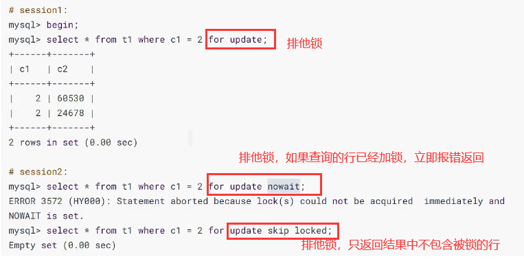

# 1. 概述
## 🔐 一、什麼是「鎖」？

在 **MySQL 中的鎖（Lock）**，本質上就是為了處理「**多個使用者或程式同時存取或修改相同資料時，如何避免衝突**」的機制。

這跟多執行緒編程中的鎖類似，目的是為了**保護資源的一致性與完整性**。

---

## 🧠 二、簡單比喻

想像你跟朋友都在同一時間打開一份 Excel 檔案來改內容：

- 如果沒有鎖，你們兩個人可能會**同時改同一格資料**，結果造成混亂。
- 如果系統有鎖，它會讓 **一個人先修改，另一個人等前一個人修改完後才能動作**，這樣就能避免錯誤。

---

## 🔄 三、在 MySQL 中鎖的實際例子

假設我們有一個銀行帳戶的表 `accounts`：

```sql
CREATE TABLE accounts (
    id INT PRIMARY KEY,
    name VARCHAR(100),
    balance DECIMAL(10,2)
);
```

有兩筆資料：

| id | name   | balance |
|----|--------|---------|
| 1  | Alice  | 1000.00 |
| 2  | Bob    | 1500.00 |

### ✅ 範例一：轉帳時使用鎖（模擬轉帳）

轉帳會同時修改兩筆資料：

```sql
START TRANSACTION;

-- 查詢 Alice 餘額
SELECT balance FROM accounts WHERE name = 'Alice' FOR UPDATE;

-- 查詢 Bob 餘額
SELECT balance FROM accounts WHERE name = 'Bob' FOR UPDATE;

-- 更新餘額
UPDATE accounts SET balance = balance - 100 WHERE name = 'Alice';
UPDATE accounts SET balance = balance + 100 WHERE name = 'Bob';

COMMIT;
```

### 🚨 說明：
- `SELECT ... FOR UPDATE`：這是 **加上排他鎖（Exclusive Lock）**，意思是「我查這筆資料，同時鎖住它，別人不能改」。
- 在 `COMMIT` 前，其他人若也想查或改這兩筆資料（也用 `FOR UPDATE`），就會被 **block 住（等待）**，直到這筆交易完成。

---

## 📚 四、MySQL 常見的鎖種類（簡述）

| 鎖類型 | 說明 |
|--------|------|
| 表鎖（Table Lock） | 鎖整張表，簡單但粗糙，效率低。 |
| 行鎖（Row Lock） | 精細鎖定特定資料列，InnoDB 引擎支援，並發效率高。 |
| 意向鎖（Intention Lock） | InnoDB 自動加，用來表示「我打算鎖這些行」，配合表鎖協作。 |
| 共享鎖（Shared Lock） | 允許讀，不允許寫（多個人可以同時讀）。 |
| 排他鎖（Exclusive Lock） | 讀寫都禁止，只有一人可以操作。 |

---

## 🛠 五、鎖的應用場景舉例

1. **訂單付款校驗**：
   - 同一張訂單只允許一次付款，避免雙扣。
   - 使用排他鎖鎖住該筆訂單記錄。

2. **庫存扣減**：
   - 熱賣商品購買時同時多人下單，庫存可能出現負數。
   - 使用 `SELECT ... FOR UPDATE` 鎖住商品庫存欄位，避免同時扣除。

---

# 2. MySQL并发事务访问相同记录
> 并发事务访问相同记录的情况大致可以划分为3种：

## 2.1 读-读情况
### 🧠 一、什麼是「讀-讀情況」？

> 指的是兩個或多個 **併發中的事務（Transactions）**，**只進行 SELECT 查詢操作**，而且查的是同一筆資料。

✅ 因為只是查資料，不會改變資料內容，所以彼此不會互相干擾，也就不會發生鎖衝突。

---

### 🎯 二、舉例說明

#### 假設有一張 `products` 資料表：

```sql
CREATE TABLE products (
    id INT PRIMARY KEY,
    name VARCHAR(100),
    stock INT
);
```

資料如下：

| id | name       | stock |
|----|------------|-------|
| 1  | iPhone 15  | 100   |

---

#### 👥 同時有兩個事務進行「讀」操作

###### ✅ 事務 A：

```sql
START TRANSACTION;
SELECT stock FROM products WHERE id = 1;
-- A 看到 stock 是 100
```

###### ✅ 事務 B：

```sql
START TRANSACTION;
SELECT stock FROM products WHERE id = 1;
-- B 也看到 stock 是 100
```

因為只是單純「讀」，不會加鎖（除非你用 `SELECT ... LOCK IN SHARE MODE` 或 `FOR UPDATE`），所以兩者**可以並發進行，不會互相阻塞**。

---

### 🔒 三、MySQL 背後怎麼處理？

如果使用的是 **InnoDB 儲存引擎** 並且使用預設的 **可重複讀（REPEATABLE READ）隔離級別**：

- MySQL 會使用 **MVCC（多版本併發控制）** 技術；
- 每個事務在「讀」的時候，其實是看到 **自己啟動時的資料快照版本**，這樣即使其他事務更新了資料，也不會影響本事務讀取的內容。

---

### 📌 四、延伸補充：會不會加鎖？

在一般情況下（不加鎖查詢）：

| 查詢方式 | 是否加鎖 | 是否允許並發 |
|-----------|-----------|----------------|
| `SELECT` | ❌ 不加鎖 | ✅ 允許 |
| `SELECT ... LOCK IN SHARE MODE` | ✅ 加共享鎖 | ⛔ 不允許同時改寫 |
| `SELECT ... FOR UPDATE` | ✅ 加排他鎖 | ⛔ 其他事務不能讀寫 |

---

### 🧾 五、重點總結

| 項目 | 說明 |
|------|------|
| 讀-讀場景 | 指的是多個事務同時查詢同一筆資料 |
| 是否會衝突？ | 不會，因為純粹查詢不會加鎖 |
| 背後機制 | InnoDB 使用 MVCC 保證一致性 |
| 實際用途 | 報表查詢、查庫存、讀訂單狀態等都屬此類 |

---

## 2.2 写-写情况
### 🔄 一、什麼是「寫-寫情況」？

> 多個事務同時**對同一筆資料進行寫入（UPDATE/DELETE/INSERT）**，此時如果不做控制，就會出現資料錯亂，這種現象叫做「**髒寫（Dirty Write）**」。

#### ⚠️ 髒寫例子（不允許發生）：
1. 事務 A 把產品價格改成 100 元，還沒提交。
2. 事務 B 同時把同一產品價格改成 50 元，也沒提交。
3. 最後只有一個會生效，但沒人知道最終資料是否正確。

👉 所以，MySQL **所有隔離級別**都不允許「髒寫」，必須讓這些寫操作「排隊」透過 **鎖機制** 控制。

---

### 🛠️ 鎖機制的工作原理
这个所谓的锁其实是一个 **内存中的结构** ，在事务执行前本来是没有锁的，也就是说一开始是没有 **锁结构** 和记录进行关联的，如图所示：


当一个事务想对这条记录做改动时，首先会看看内存中有没有与这条记录关联的 **锁结构** ，当没有的时候就会在内存中生成一个 **锁结构** 与之关联。比如，事务 T1 要对这条记录做改动，就需要生成一个 锁结构与之关联：


在 **锁结构** 里有很多信息，为了简化理解，只把两个比较重要的属性拿了出来：

1. trx 信息：代表这个锁结构是哪个事务生成的。
2. is_waiting ：代表当前事务是否在等待。

当事务 T1 改动了这条记录后，就生成了一个锁结构与该记录关联，因为之前没有别的事务为这条记录加锁，所以 `is_waiting` 属性就是 false ，我们把这个场景就称之为 **获取锁成功**，或者 **加锁成功**，然后就可以继续执行操作了。

在事务 T1 提交之前，另一个事务 T2 也想对该记录做改动，那么先看看有没有锁结构与这条记录关联，发现有一个锁结构与之关联后，然后也生成了一个锁结构与这条记录关联，不过锁结构的 `is_waiting` 属性值为 true ，表示当前事务需要等待，我们把这个场景就称之为 **获取锁失败**，或者 **加锁失败**，图示：


在事务T1提交之后，就会把该事务生成的 **锁结构释放掉**，然后看看还有没有别的事务在等待获取锁，发现了事务T2还在等待获取锁，所以把事务T2对应的锁结构的 `is_waiting` 属性设置为 false，然后把该事务对应的线程唤醒，让它继续执行，此时事务T2就算获取到锁了。效果图就是这样:


### 🔧 二、實際範例說明（用表格 + SQL）

假設你有一張 `products` 表：

```sql
CREATE TABLE products (
    id INT PRIMARY KEY,
    name VARCHAR(100),
    price DECIMAL(10, 2)
);
```

資料如下：

| id | name    | price |
|----|---------|-------|
| 1  | iPhone  | 999.00 |

---

#### 🚦 併發寫入流程模擬

###### ✅ 事務 T1 開始：

```sql
START TRANSACTION;
UPDATE products SET price = 899.00 WHERE id = 1;
```

這時：
- MySQL 發現該記錄沒有人加鎖
- 就會建立一個**內存中的鎖結構**（Lock Structure）
- 把 `T1` 的資訊記錄進去：`trx = T1, is_waiting = false`
- ✅ `T1` 成功獲得鎖，可繼續執行

---

###### ⛔ 事務 T2 開始（此時 T1 還沒提交）：

```sql
START TRANSACTION;
UPDATE products SET price = 799.00 WHERE id = 1;
```

這時：
- MySQL 發現該記錄**已經有 T1 的鎖結構**
- 所以 T2 也建立一個鎖結構，但是：
  - `trx = T2`
  - `is_waiting = true`（表示要等）
- ⛔ T2 被**掛起（等待）**，暫時不能動作

---

#### ✅ T1 提交

```sql
COMMIT;
```

這時 MySQL：
- 把 T1 的鎖結構**釋放**
- 發現 T2 還在等待
- 把 T2 的 `is_waiting` 改成 `false`，並**喚醒 T2**
- ✅ T2 獲得鎖，繼續執行

---

### 🧠 三、小結說法對應說明

| 說法 | 含義 | 結果 |
|------|------|------|
| 不加鎖 | 該操作不會建立鎖結構，可以直接操作 | 例如純讀操作 `SELECT` |
| 加鎖成功（獲取鎖成功） | 建立鎖結構，且 `is_waiting = false` | 事務可以立刻執行 |
| 加鎖失敗（獲取鎖失敗） | 建立鎖結構，`is_waiting = true` | 被 block 掛起，等待前一個釋放 |

---

### 🧩 四、圖解鎖狀態變化流程

```
T1 執行 UPDATE
 ↓
[鎖結構] 建立 → trx = T1, is_waiting = false（加鎖成功）

T2 執行 UPDATE
 ↓
[鎖結構] 建立 → trx = T2, is_waiting = true（等待 T1）

T1 COMMIT
 ↓
釋放 T1 的鎖 → 將 T2 的 is_waiting = false → 喚醒 T2
```

---

### ✅ 五、重點總結

| 重點 | 說明 |
|------|------|
| 寫-寫場景 | 多個事務對相同資料進行寫操作 |
| 鎖用途 | 保證「資料一致性」並避免「髒寫」 |
| MVCC 沒辦法處理寫寫場景 | 因為每個寫都會修改資料，無法用版本快照來處理，只能靠行鎖處理 |
| 最終效果 | 排隊執行，先來先服務，後來的等前面的完成 |

---

## 2.3 读-写或写-读情况
### 🧠 一、什麼是「讀-寫／寫-讀」情況？

指的是：
- 一個事務在「讀取」某筆資料
- 同時另一個事務在「修改」那筆資料

這種情況會涉及多種資料一致性的問題，可能出現：

| 問題類型 | 定義 |
|----------|------|
| **髒讀（Dirty Read）** | A 讀到 B 尚未提交的修改 |
| **不可重複讀（Non-repeatable Read）** | A 兩次讀同一筆資料，B 中途改變了它 |
| **幻讀（Phantom Read）** | A 兩次查詢滿足條件的資料筆數不同，因為 B 新增或刪除了符合條件的資料列 |

---

### 🔍 二、範例說明三種問題

我們以一張 `orders` 資料表為例：

```sql
CREATE TABLE orders (
    id INT PRIMARY KEY,
    user_id INT,
    amount DECIMAL(10,2)
);
```

初始資料只有一筆：

| id | user_id | amount |
|----|---------|--------|
| 1  | 1001    | 100.00 |

---

#### ✴️ 髒讀（Dirty Read）— MySQL 預設不允許（因為不支援 READ UNCOMMITTED）

###### 事務 B：

```sql
START TRANSACTION;
UPDATE orders SET amount = 200 WHERE id = 1;
-- 尚未 COMMIT
```

###### 事務 A（READ UNCOMMITTED 隔離級別）：

```sql
SELECT amount FROM orders WHERE id = 1;
-- 讀到 200（尚未提交的值） → 髒讀
```

✅ **MySQL InnoDB 預設不允許髒讀**，所以即使 B 還沒提交，A 也讀不到修改的資料（MVCC 生效）

---

#### ✴️ 不可重複讀（Non-repeatable Read）

###### 事務 A（REPEATABLE READ）：

```sql
START TRANSACTION;
SELECT amount FROM orders WHERE id = 1; -- 得到 100
...此時 B 修改...

SELECT amount FROM orders WHERE id = 1; -- 還是 100（快照讀）
```

###### 事務 B：

```sql
START TRANSACTION;
UPDATE orders SET amount = 300 WHERE id = 1;
COMMIT;
```

💡 **InnoDB 的 MVCC（多版本並發控制）會保證事務 A 在整個事務期間都看到相同快照的資料** → 不可重複讀被解決。

---

#### ✴️ 幻讀（Phantom Read）

###### 事務 A：

```sql
START TRANSACTION;
SELECT * FROM orders WHERE user_id = 1001; -- 查出 1 筆

...此時事務 B 插入資料...

SELECT * FROM orders WHERE user_id = 1001; -- 還是只有 1 筆（REPEATABLE READ 下可解決幻讀）
```

###### 事務 B：

```sql
START TRANSACTION;
INSERT INTO orders VALUES (2, 1001, 50);
COMMIT;
```

✅ 在 MySQL 的 `REPEATABLE READ` 隔離級別下，**使用 next-key lock 組合行鎖與間隙鎖，可以防止幻讀**。

---

### 🛠 三、MySQL 解決方式：MVCC + 鎖

| 問題類型 | MySQL 解法 | 是否預設解決 |
|----------|-------------|----------------|
| 髒讀     | 不允許 → 不使用 READ UNCOMMITTED | ✅ 預設安全 |
| 不可重複讀 | MVCC 快照一致性讀 | ✅ 預設安全 |
| 幻讀     | Next-Key Lock（行鎖 + 間隙鎖） | ✅ 在 REPEATABLE READ 下防止 |

---

### 🧾 四、小結

| 類型 | 問題範例 | MySQL 的預設防護方式（REPEATABLE READ） |
|------|----------|-----------------------------------|
| 讀-讀 | 不會有問題 | ✅ 允許並發 |
| 寫-寫 | 行鎖排隊，避免髒寫 | ✅ 使用行鎖 |
| 讀-寫／寫-讀 | 髒讀／不可重複讀／幻讀 | ✅ MVCC + Next-Key Lock 解決 |

---

## 2.4 并发问题的解决方案
> 怎么解决脏读、不可重复读、幻读这些问题呢？其实有两种可选的解决方案：

### 方案一：读操作利用多版本并发控制（MVCC，下章讲解），写操作进行加锁。
#### 🧠 一、為什麼會有這些「併發讀寫問題」？

| 問題 | 原因 |
|------|------|
| 髒讀 | A 讀到 B 還沒提交的寫入 |
| 不可重複讀 | A 第一次讀到 X 的值是 100，B 修改 X 為 200，A 第二次再讀時變了 |
| 幻讀 | A 查詢符合條件的資料列有 3 筆，B 新增一筆後，A 再查有 4 筆 |

這些問題是「讀寫操作互相干擾」造成的。

---

#### 🧩 二、MySQL 解法 = MVCC + 鎖

| 操作 | 解決方式 |
|------|------------|
| **讀** | 使用 **MVCC**：只讀快照，不加鎖 |
| **寫** | 使用 **行鎖（row lock）**：加鎖保護一致性 |

---

#### 📌 三、什麼是 MVCC？（多版本併發控制）

> MVCC 是一種用來支援「**非鎖式讀取（Non-locking Read）**」的技術。

##### ✅ 核心概念：

- 每條資料都有多個「版本」。
- 每個事務查詢時，會建立一個 **ReadView（讀視圖）**，只會讀到：
  - 在 **建立 ReadView 時，已經提交的版本**
- 尚未提交的或晚於該視圖建立的資料都 **不可見**

---

#### 🧪 四、舉例：MVCC 是怎麼保證一致性讀的

假設你有一筆資料：

| id | amount |
|----|--------|
| 1  | 100    |

##### ✅ 事務 A：

```sql
START TRANSACTION;
SELECT amount FROM orders WHERE id = 1; -- 看到 100
```

此時 MySQL 會為這筆查詢生成一個 **ReadView-A**

---

##### 🚨 事務 B（同時進行）：

```sql
START TRANSACTION;
UPDATE orders SET amount = 200 WHERE id = 1;
COMMIT;
```

######## ✅ 若 A 在 `READ COMMITTED` 隔離級別：

- A 再次執行 `SELECT` → **新的 ReadView 會看到最新提交的 200**
- 避免「髒讀」，但會發生「不可重複讀」

######## ✅ 若 A 在 `REPEATABLE READ` 隔離級別：

- A 所有查詢都使用 **同一個 ReadView-A**
- 所以 A 無論查幾次都只看到 100（即使 B 改為 200）

---

#### 🔁 五、ReadView 的產生時機比較

| 隔離級別 | ReadView 產生時機 | 影響 |
|----------|------------------|------|
| READ COMMITTED | 每次 `SELECT` 生成一次新的 ReadView | 可以避免髒讀，但可能產生不可重複讀 |
| REPEATABLE READ | 只在第一次 `SELECT` 時生成，後面都共用 | 可避免髒讀、不可重複讀、幻讀 |

---

#### 🔒 六、寫操作仍需鎖：MVCC 不能解決「寫-寫」衝突

雖然 MVCC 解決了「讀-寫衝突」，但：
- 若兩個事務同時寫一筆資料（UPDATE/DELETE）：
- **仍然必須用排他鎖（行鎖）來保護資料一致性**

---

#### ✅ 七、小結與應用場景整理

| 情境 | MySQL 解法 | 技術 |
|------|-------------|--------|
| 避免髒讀 | `READ COMMITTED` + MVCC | 多版本視圖 |
| 避免不可重複讀 | `REPEATABLE READ` + 單一 ReadView | 快照一致性 |
| 避免幻讀 | `REPEATABLE READ` + next-key lock | MVCC + 鎖結構 |
| 寫操作衝突 | 寫時加行鎖（排他鎖） | 鎖結構 |

---

### 方案二：读、写操作都采用加锁的方式。
> MySQL 解決併發問題的第二種方式：**讀與寫操作都「加鎖」處理**，以避免髒讀、不可重複讀與幻讀的產生。這種做法屬於**悲觀鎖（Pessimistic Locking）**策略。

---

#### 🔐 一、什麼是「讀寫都加鎖」？

> 當你在「讀取」資料時，也一併**鎖住這筆資料**，讓其他事務在你「提交或回滾前**不能讀不能寫**這筆資料」。

這種策略是用來處理「對資料敏感」的業務，比如：銀行餘額、訂單扣庫存、用戶積分變更等。

---

#### 📌 二、讀與寫都加鎖是怎麼運作的？

##### ✅ 加鎖方式：`SELECT ... FOR UPDATE` 或 `SELECT ... LOCK IN SHARE MODE`

- `FOR UPDATE`：排他鎖（Exclusive Lock），**只允許自己寫，別人不能讀也不能寫**
- `LOCK IN SHARE MODE`：共享鎖（Shared Lock），**允許讀，不允許寫**

---

#### 🧪 三、實例說明：逐一解決併發問題

##### ✴️ 1. 髒讀（Dirty Read）

**❌ 錯誤情境：**

1. 事務 A 寫入帳戶餘額 `UPDATE balance SET amount = 200 WHERE id = 1`（未提交）
2. 事務 B 查詢帳戶餘額 `SELECT amount FROM balance WHERE id = 1`
3. A 回滾 → B 讀到錯誤數據

**✅ 解決方式：**

```sql
-- A 寫時就加鎖（InnoDB 自動對寫操作加排他鎖）

-- B 要讀取時，也用 SELECT ... FOR UPDATE
SELECT amount FROM balance WHERE id = 1 FOR UPDATE;
```

👉 這樣，**B 的查詢會被阻塞，直到 A 釋放鎖為止**，自然無法髒讀。

---

##### ✴️ 2. 不可重複讀（Non-repeatable Read）

**❌ 錯誤情境：**

1. A 查詢 `SELECT amount FROM balance WHERE id = 1` 得到 100
2. B 更新為 150 並提交
3. A 再查一次，變成 150 → 數據變了

**✅ 解決方式：**

```sql
START TRANSACTION;
SELECT amount FROM balance WHERE id = 1 FOR UPDATE;
-- 此時鎖住該筆資料，B 無法修改
```

👉 這樣就保證：**只要 A 不提交，其他人不能改**，A 無論查幾次都會一致。

---

##### ✴️ 3. 幻讀（Phantom Read）

**❌ 錯誤情境：**

1. A 查詢 `SELECT * FROM orders WHERE amount > 100`
2. B 插入一筆 `amount = 150` 並提交
3. A 再查一次 → 發現多一筆資料，這就是幻讀

**✅ 解決方式（加「範圍鎖」／間隙鎖）：**

```sql
START TRANSACTION;
SELECT * FROM orders WHERE amount > 100 FOR UPDATE;
```

- InnoDB 會使用 **next-key lock**（行鎖 + 間隙鎖）來鎖住這個條件範圍
- **這不僅鎖住已存在的記錄，也鎖住“這段範圍內可以插入的地方”**
- 所以 **B 無法在 amount > 100 的區間插入新資料**

---

#### 🔁 四、讀操作加鎖的效果圖解

```text
T1: SELECT amount FROM balance WHERE id = 1 FOR UPDATE
       ↓ 鎖定該筆資料
       ↓ 其他事務（T2）無法讀或寫
       ↓ T1 完成後 COMMIT
       ↓ 鎖釋放，T2 才能執行
```

---

#### 🧾 五、小結比較：MVCC vs 加鎖策略

| 比較項目 | MVCC | 讀寫都加鎖 |
|----------|------|--------------|
| 適用場景 | 查詢為主、容忍快照資料 | 對數據一致性要求極高 |
| 是否加鎖 | 不加鎖（快照讀） | 明確加鎖（阻止他人操作） |
| 可否讀舊版本 | ✅ 是 | ❌ 否，只能讀最新且加鎖 |
| 效能 | 高（並發性強） | 低（容易阻塞） |
| 舉例 | 報表查詢、用戶列表 | 銀行轉帳、訂單支付 |

---

#### ✅ 六、適合使用「加鎖讀寫」的場景

- 銀行帳戶轉帳（查出餘額後鎖定）
- 線上購物扣庫存（防止超賣）
- 搶紅包／秒殺活動（保證唯一性）
- 多人同時編輯同一筆關鍵資料（防止覆寫）

---

如果你想看某一類情境（例如搶紅包、轉帳）完整的 SQL 實作流程，我可以幫你模擬範例。需要嗎？

### 小結對比
#### 🧠 一、MVCC vs 加鎖：核心對比表

| 項目 | MVCC（多版本併發控制） | 加鎖（悲觀鎖） |
|------|------------------------|----------------|
| 是否加鎖 | ❌ 不加鎖（快照讀） | ✅ 讀寫都加鎖 |
| 讀-寫是否衝突 | ✅ 不衝突，可以並發執行 | ❌ 衝突，需等待排隊 |
| 效能 | 🚀 高效，適合大量查詢 | 🐢 效能較低，容易阻塞 |
| 避免問題 | 髒讀、不可重複讀、幻讀 | 同上，但透過鎖來保證 |
| 原理 | 用 ReadView + undo log 回溯歷史版本 | 實體加行鎖或表鎖，限制其他操作 |
| 適合場景 | 通用查詢、報表、非強一致性業務 | 銀行、庫存、轉帳等關鍵操作 |

---

#### 🧪 二、例子對比：同樣是查詢帳戶金額

##### ✅ 使用 MVCC（快照讀，效率高）

```sql
-- InnoDB 自動使用快照讀（非鎖式讀）
SELECT amount FROM account WHERE id = 1;
```

- 查詢時會看到**事務開始時提交的版本**
- 數據穩定、無鎖競爭
- 適合報表分析、查詢用戶列表等

---

##### ⛔ 使用加鎖方式（確保一致性，會阻塞）

```sql
-- 要求查出餘額後立即鎖定該行，不讓其他人操作
START TRANSACTION;
SELECT amount FROM account WHERE id = 1 FOR UPDATE;
```

- 一旦讀取，就鎖住該行
- **其他事務無法修改或查詢該行資料（若也用 FOR UPDATE）**
- 適合：**轉帳、訂單支付、競標保證金等精確交易流程**

---

#### 🎯 三、實務建議

| 情境 | 建議用法 | 原因 |
|------|-----------|------|
| 一般查詢 / 報表 | ✅ MVCC | 提高性能，讀操作多 |
| 銀行帳戶轉帳 | ✅ 加鎖讀寫 | 要求絕對一致性 |
| 購物車查庫存 | MVCC 或 加鎖（視情況） | 若有「庫存不足」風險，建議加鎖 |
| 查詢用戶資訊（非資安） | MVCC | 沒有衝突風險，不需加鎖 |
| 編輯設定資料 | 加鎖 | 防止多人同時更改相同設定產生衝突 |

---

#### 📌 四、總結

> 「讀寫是否加鎖」是一種權衡：

- ✅ **MVCC 效能高，但不是所有場景都保證一致性**
- ✅ **加鎖雖然慢，但在需要**「強一致性」**的場景是必要的**

MySQL 運行時會根據你寫的 SQL 和隔離級別自動選擇是否用 MVCC 或鎖，不過你也可以手動控制（如用 `FOR UPDATE` 加強保護）。

---

# 3. 锁的不同角度分类
锁的分类图，如下：


## 3.1 对数据操作的类型划分：读锁、写锁
### 3.1.1 概述
當我們談到 MySQL 的「**讀鎖（S Lock）**」與「**寫鎖（X Lock）**」時，是從**對資料操作的角度**來分類的，主要目的是為了解決**資料在併發訪問時可能產生的衝突問題**。

以下是詳細解釋與實際例子：

---

#### 🔒 鎖的基本定義與差異

| 鎖類型   | 又稱     | 縮寫 | 功能特色                                                                 |
|----------|----------|------|--------------------------------------------------------------------------|
| 讀鎖     | 共享鎖   | S    | 多個讀操作可以共享同一份資料，不會互相阻塞。                           |
| 寫鎖     | 排他鎖   | X    | 寫操作會阻塞其他讀/寫操作，以保證資料的正確性與一致性。               |

---

#### 🧠 為什麼要這樣設計？

因為：
- **讀讀之間**互不影響（大家只是「看資料」而已）。
- 但 **寫寫、讀寫、寫讀之間**會有問題（可能有人改了資料，另一個人讀到錯誤值，或同時寫入導致衝突）。

所以設計成：
- 「讀鎖」讓大家可以一起讀。
- 「寫鎖」則要保證「自己專用」，任何讀或寫都要等它結束。

---

#### ✅ 舉例說明（行級鎖）

我們以 InnoDB 引擎為例，它支援**行級鎖（row-level lock）**，下面是一個具體案例：

##### 初始狀況：
資料表 `account` 中某筆記錄為：

```sql
id: 1, name: 'Tom', balance: 1000
```

##### 步驟 1：T1 事務獲得 `id=1` 行的**讀鎖**

```sql
START TRANSACTION;
SELECT * FROM account WHERE id = 1 LOCK IN SHARE MODE;
-- T1 獲得 id=1 的讀鎖
```

此時 **其他事務可以繼續讀**這一筆資料：

##### 步驟 2：T2 也讀取 `id=1`

```sql
START TRANSACTION;
SELECT * FROM account WHERE id = 1 LOCK IN SHARE MODE;
-- T2 成功獲得讀鎖
```

因為兩者都是「讀操作」，所以不會互相阻塞。

##### 步驟 3：T3 嘗試寫入 `id=1`

```sql
START TRANSACTION;
UPDATE account SET balance = 800 WHERE id = 1;
-- ⚠️ T3 被阻塞！必須等 T1、T2 釋放讀鎖後才能加上寫鎖。
```

這是因為寫鎖是排他的，不能和任何其他讀/寫鎖共存。

---

#### 📝 小結

| 操作組合        | 是否允許並發 | 說明                     |
|-----------------|--------------|--------------------------|
| 讀 + 讀         | ✅ 是         | 皆為共享鎖，不會衝突     |
| 寫 + 寫         | ❌ 否         | 都需要排他鎖，需互相等待 |
| 讀 + 寫 / 寫 + 讀 | ❌ 否         | 寫鎖排他，會阻塞其他操作 |

---

若你有興趣，我也可以幫你用 SQL 實作一個測試場景來實驗看看行級讀鎖與寫鎖的行為，會更容易理解。要幫你設計嗎？

### 3.1.2 锁定读
> MySQL 的「**锁定读（Locking Read）**」，這是針對資料讀取過程中為了避免併發衝突而主動**加鎖**的一種策略。這在高併發場景下非常重要，特別是當你要保證讀到的資料在整個事務期間不會被別人改變時。

---

#### 🔍 一、為什麼要「鎖定讀」？

普通的 `SELECT` 是「非鎖定讀」，它不會加任何鎖，也不會阻塞其他操作，速度快，但無法避免：

- **不可重複讀**：同一條記錄在同一事務中讀兩次，值卻變了。
- **幻讀**：第一次查不到某些記錄，第二次卻查到了（例如 WHERE 條件的 insert）。

為了解決這些問題，可以使用「**加鎖讀取**」來提升一致性。

---

#### 🔒 二、兩種鎖定讀的語法與行為比較

| 語法                            | 鎖類型  | 允許別人讀嗎 | 允許別人改嗎 | 使用場景 |
|---------------------------------|---------|---------------|---------------|-----------|
| `SELECT ... LOCK IN SHARE MODE`<br>或 `SELECT ... FOR SHARE` | **共享鎖（S鎖）** | ✅ 只能加S鎖 | ❌ 禁止加X鎖 | 想讀資料且防止別人寫 |
| `SELECT ... FOR UPDATE`         | **排他鎖（X鎖）** | ❌ 不能加任何鎖 | ❌ 禁止讀/寫 | 想讀資料且後續要修改 |

---

#### ✅ 三、具體實例說明（使用 InnoDB）

假設有一張帳戶表：

```sql
CREATE TABLE account (
  id INT PRIMARY KEY,
  name VARCHAR(50),
  balance DECIMAL(10,2)
) ENGINE=InnoDB;

INSERT INTO account VALUES (1, 'Tom', 1000.00);
```

---

##### 🧪 範例 1：共享鎖（`LOCK IN SHARE MODE`）

###### T1 事務執行：

```sql
START TRANSACTION;
SELECT * FROM account WHERE id = 1 LOCK IN SHARE MODE;
```

- 此時 `id = 1` 的這筆資料被加上 **S鎖**
- 其他事務 **可以再加 S鎖**，也就是可以「也用 SHARE 模式讀」
- 但 **不能加 X鎖**，也就是「不能更新這筆資料」

###### 若 T2 嘗試修改：

```sql
START TRANSACTION;
UPDATE account SET balance = 800 WHERE id = 1;
-- ⚠️ 阻塞！因為 T1 尚未釋放 S 鎖
```

---

##### 🧪 範例 2：排他鎖（`FOR UPDATE`）

###### T1 事務執行：

```sql
START TRANSACTION;
SELECT * FROM account WHERE id = 1 FOR UPDATE;
```

- 此時 `id = 1` 的這筆資料被加上 **X鎖**
- 其他事務 **不能加 S鎖 或 X鎖**
- 所以無法**讀取或修改**這筆資料（除非是快照讀）

###### 若 T2 嘗試讀取：

```sql
START TRANSACTION;
SELECT * FROM account WHERE id = 1 LOCK IN SHARE MODE;
-- ⚠️ 阻塞！因為 T1 持有 X 鎖
```

---

#### 📌 四、使用時機總結

| 操作目的                        | 建議使用語法                   |
|---------------------------------|--------------------------------|
| 查資料，但不希望別人更新它       | `LOCK IN SHARE MODE` 或 `FOR SHARE` |
| 查資料後馬上就要更新            | `FOR UPDATE`                   |
| 查資料且不在乎別人是否更動       | 普通 `SELECT`（快照讀）        |

---

#### MySQL8.0新特性：
> 在 **5.7及之前** 的版本，`SELECT ... FOR UPDATE`，如果获取不到锁，会一直等待，直到 `innodb_lock_wait_timeout` 超时。在 `8.0` 版本中，`SELECT ... FOR UPDATE`、`SELECT ... FOR SHARE` 添加 `NOWAIT` 、 `SKIP LOCKED`语法，跳过锁等待，或者跳过锁定。

1. NOWAIT：如果查询的行已经加锁，会立即报错返回

2. SKIP LOCKED：如果查询的行已经加锁，只返回结果中不包含被锁定的行



### 3.1.2 写操作
#### 🔨 1. DELETE 操作與鎖

##### 🧠 操作流程：
- 在 B+ 樹中找到目標資料的位置。
- **加 X 鎖（排他鎖）**保護這筆資料。
- 並不是真的「立即刪除」，而是執行所謂的 `**delete mark**`（打上刪除標記），實際刪除交由 `purge thread` 之後處理。

##### ✅ 範例：

```sql
START TRANSACTION;
DELETE FROM account WHERE id = 1;
-- 會對 id = 1 的資料加上 X 鎖，打上 delete mark
```

此時其他事務如果想要讀取或更新這筆記錄，會被阻塞。

---

#### 🔁 2. UPDATE 操作與鎖（分三種情況）

##### 情況 1：**沒改主鍵，也沒變動欄位大小**
- 只需要加 **X 鎖**，直接在原位置更新資料即可。

**✅ 例子：**

```sql
-- balance 是 DECIMAL(10,2)，欄位長度沒變
UPDATE account SET balance = 800.00 WHERE id = 1;
```

##### 情況 2：**沒改主鍵，但有欄位長度變動**
- 例如 `VARCHAR` 欄位內容變長或變短。
- 這時會：
  1. 加 X 鎖
  2. **物理刪除**舊記錄（放入垃圾鏈表）
  3. 插入新記錄（會用隱式鎖保護）

**✅ 例子：**

```sql
-- name 是 VARCHAR(10)
UPDATE account SET name = 'Thomas' WHERE id = 1;
-- 舊記錄會被刪除並插入一筆新記錄
```

##### 情況 3：**修改了主鍵（或唯一索引欄位）**
- 被視為一個 **DELETE + INSERT** 組合操作。
- 所以也會經歷 DELETE 加 X 鎖、再由 INSERT 使用隱式鎖。

**✅ 例子：**

```sql
-- 假設 id 是主鍵
UPDATE account SET id = 100 WHERE id = 1;
-- 等同於：DELETE id = 1 → INSERT id = 100
```

---

#### ➕ 3. INSERT 操作與鎖

- 插入新資料通常**不顯式加鎖**，而是使用「**隱式鎖（Implicit Lock）**」來保護這筆資料，讓它在本事務未提交前，不會被其他事務查詢或修改。

##### ✅ 範例：

```sql
START TRANSACTION;
INSERT INTO account (id, name, balance) VALUES (2, 'Amy', 1000);
-- 不加顯式鎖，但這筆資料有隱式鎖保護，其他人看不到
```

若你用別的事務查詢 `id = 2`，是查不到的，直到這個事務 `COMMIT`。

---

#### 🧠 小結：三種操作與鎖的對照

| 操作   | 鎖的類型        | 說明                                                                 |
|--------|------------------|----------------------------------------------------------------------|
| DELETE | 顯式 X 鎖        | 對記錄加排他鎖，標記為刪除                                           |
| UPDATE | 視情況而定       | - 不改鍵、長度不變：原地修改，加 X 鎖<br> - 長度變：刪除+插入<br> - 改鍵值：等同 DELETE + INSERT |
| INSERT | **隱式鎖**       | 只要還沒 COMMIT，其他人就查不到該筆資料                             |

---

## 3.2 从数据操作的粒度划分：表级锁、页级锁、行锁
### 1. 概述
MySQL 中根據「**鎖的粒度（Lock Granularity）**」所做的分類，包括：

- 表級鎖（**Table-Level Lock**）
- 頁級鎖（**Page-Level Lock**）
- 行級鎖（**Row-Level Lock**）

這些是**從資料操作「範圍大小」的角度**出發來分類的鎖。下面我用簡單比喻 + 範例來解釋，幫你建立清晰概念。

---

#### 🔒 什麼是鎖的粒度？

> **鎖粒度 = 鎖住資料的範圍大小**

- 鎖範圍越大，管理成本低，但併發度差（大家都卡住）
- 鎖範圍越小，併發度高，但管理成本高（系統要記很多鎖）

所以 **MySQL 根據存儲引擎和需求選擇不同的鎖粒度**，來在「效能」與「並發」間做平衡。

---

#### 1️⃣ 表級鎖（Table-Level Lock）

##### ✅ 概念：
- 一次 **鎖整張表**
- 誰鎖了，其他人就不能對這張表做任何操作（讀或寫）

##### ✅ 優點：
- 快速、省資源

##### ❌ 缺點：
- 併發性最差，一個人操作，全場等

##### 📦 使用者範例：

```sql
LOCK TABLES account WRITE;
-- 全表加寫鎖，只有這個 session 能操作這張表
```

或 MyISAM 引擎就只支援表級鎖。

---

#### 2️⃣ 頁級鎖（Page-Level Lock）

##### ✅ 概念：
- 鎖住 **一個頁面（資料塊）**
- 每頁包含多筆記錄，通常一頁大小為 16KB

##### 📦 比喻：
像是圖書館把「同一排書架」鎖起來，而不是鎖整間圖書館（表），也不是鎖特定書（行）

##### ✅ 優點：
- 併發度比表級高
- 鎖數量比行級少，管理開銷也不大

##### ❌ 缺點：
- 可能會有**間隙鎖（gap lock）**導致 **死鎖**
- MySQL InnoDB **不使用頁級鎖**，這是某些 NoSQL 或老系統（如 BDB）的鎖法

---

#### 3️⃣ 行級鎖（Row-Level Lock）

##### ✅ 概念：
- **只鎖正在操作的那一行**
- 是 InnoDB 的核心特性（InnoDB 是 MySQL 的預設引擎）

##### 📦 比喻：
你只鎖住你看的那本書，別人還能自由翻其他書

##### ✅ 優點：
- **最大併發度**，適合 OLTP（大量即時交易）

##### ❌ 缺點：
- 鎖數量多，系統開銷大
- 實作較複雜

##### 📦 使用者範例：

```sql
START TRANSACTION;
UPDATE account SET balance = 800 WHERE id = 1;
-- InnoDB 自動對 id = 1 這一行加行鎖
```

---

#### 🧠 小結：三種鎖粒度比較

| 粒度     | 鎖住範圍     | 併發度 | 系統開銷 | 常見於       |
|----------|--------------|--------|-----------|--------------|
| 表級鎖   | 整張表       | ❌ 最差 | ✅ 最小    | MyISAM       |
| 頁級鎖   | 一個資料頁   | ⚠ 中等 | ⚠ 中等    | 一些老式引擎 |
| 行級鎖   | 單一資料行   | ✅ 最佳 | ❌ 最大    | ✅ InnoDB     |

---

#### ✅ 實務建議：

- 預設使用 InnoDB（行級鎖 + MVCC），適合多用戶、高併發場景
- 表級鎖通常用於小工具、低併發或特殊批次需求
- 不用刻意調整粒度，選對引擎 + 設計好索引即可

---

### 2. 表锁（Table Lock）
