# 1. 什么是MVCC
## 🔍 一、MVCC 是什麼？

MVCC 是 *Multiversion Concurrency Control* 的縮寫，中文叫做「多版本併發控制」，它的核心目的是：

> **讓讀操作不用等待寫操作釋放鎖**，也就是實現「非鎖定讀」（snapshot read）。

這可以大幅提升併發效率，避免大家搶鎖、等鎖造成的性能瓶頸。

---

## 🧠 二、MVCC 背後的原理

MVCC 主要依賴於以下兩種特殊欄位（MySQL 自動維護，不會出現在表結構中）：

| 欄位 | 說明 |
|------|------|
| `trx_id` | 該行資料最後一次被哪個事務修改 |
| `roll_pointer` | 指向 Undo Log，記錄該行資料被修改前的版本 |

這樣每一筆資料都可以「追溯」它的歷史版本。

---

## 📘 三、MVCC 讀寫規則

MySQL 會根據你執行 SQL 的方式區分兩種讀取模式：

| 模式名稱 | 指令舉例 | 是否用 MVCC？ | 會加鎖嗎？ |
|----------|----------|----------------|-------------|
| 快照讀（Snapshot Read） | `SELECT * FROM table ...` | ✅ 會用 MVCC | ❌ 不加鎖 |
| 當前讀（Current Read） | `SELECT ... FOR UPDATE`、`UPDATE`、`DELETE` | ❌ 不用 MVCC | ✅ 加鎖 |

---

## 🧪 四、舉個例子：模擬兩個事務併發查詢與修改

假設有一個 `user` 表：

```sql
CREATE TABLE user (
  id INT PRIMARY KEY,
  name VARCHAR(50),
  age INT
);
```

表中已有資料：

```sql
(1, 'Alice', 20)
```

### 🧵 Session A：

```sql
BEGIN;
UPDATE user SET age = 21 WHERE id = 1;
-- 尚未 COMMIT
```

這時候 `Alice` 的 `age` 已經被改為 `21`，但只對 Session A 可見。

---

### 🧵 Session B（在 Session A COMMIT 前）：

```sql
BEGIN;
SELECT * FROM user WHERE id = 1;
```

這裡因為是普通查詢，走的是「快照讀」，會觸發 MVCC：

- Session B 會讀取 **舊版本（age = 20）**
- 不需要等待 Session A
- 效率非常高！

---

### 如果 Session B 改用鎖查詢：

```sql
SELECT * FROM user WHERE id = 1 FOR UPDATE;
```

這就是「當前讀」，不走 MVCC，會 **等待 Session A COMMIT 或 ROLLBACK**，否則會阻塞。

---

## ✅ 五、小結

| 特點 | MVCC（快照讀） |
|------|-----------------|
| 是否加鎖 | ❌ 不加鎖 |
| 是否看到舊版本 | ✅ 是 |
| 避免死鎖 | ✅ 是 |
| 適用操作 | 查詢為主，寫操作不用 MVCC |
| 提升效能 | ✅ 因為讀不阻塞寫，寫也不阻塞讀 |

---

如果你還想知道 **MVCC 是怎麼配合 Undo Log 和隔離級別（RC / RR）運作的**，我也可以再深入講解，讓你完整掌握這套機制。需要嗎？

# 2. 快照读与当前读

## 2.1 概述
### 🔍 一、關鍵詞釋義

| 名稱 | 說明 | 是否加鎖 | 是否使用 MVCC |
|------|------|-----------|----------------|
| 快照讀（Snapshot Read） | 讀的是資料在**開始查詢時的版本**，使用 **Undo Log** 找舊版本 | ❌ 不加鎖 | ✅ 是 |
| 當前讀（Current Read） | 讀的是**目前最新的版本**，需要等待其他事務釋放鎖 | ✅ 加鎖 | ❌ 否（使用悲觀鎖） |

---

### 💡 二、為什麼需要快照讀？

為了提升「查詢」的效能，如果每次查資料都要等其他人釋放寫鎖（例如一個人還在 `UPDATE`），就會很慢。

MVCC 的解法是 —— 📸「拍一張資料的快照」，這樣你就可以查舊版本，而不用卡在鎖上。

---

### 🧪 三、實際例子：用快照讀 vs 當前讀

假設有一個 `user` 資料表：

```sql
+----+--------+-----+
| id | name   | age |
+----+--------+-----+
| 1  | Alice  | 20  |
+----+--------+-----+
```

#### ✅ 快照讀（SELECT）

###### 🧵 Session A：

```sql
BEGIN;
UPDATE user SET age = 21 WHERE id = 1;
-- 尚未 COMMIT
```

###### 🧵 Session B：

```sql
BEGIN;
SELECT * FROM user WHERE id = 1;
```

- 因為是 `SELECT`，所以是「快照讀」
- 雖然 Session A 還沒提交，但 Session B **可以讀到 `age = 20`**
- 就是透過 `Undo Log` 查找舊資料版本實現的
- 🧠 **這就是 MVCC 的威力 → 讀寫不互相阻塞**

---

#### 🔒 當前讀（SELECT ... FOR UPDATE）

###### 🧵 Session B 改查：

```sql
SELECT * FROM user WHERE id = 1 FOR UPDATE;
```

- 這是「當前讀」，會等 Session A 提交
- 因為這樣查是為了後續更新做準備，要保證資料**不能被其他人動**
- ✅ 所以會加鎖
- 🚫 不走 MVCC

---

### 📌 四、MVCC 與悲觀/樂觀鎖的關係

- MVCC ≈ **樂觀鎖**：我相信資料不會變，所以直接讀快照，不加鎖。
- 當前讀 ≈ **悲觀鎖**：我怕資料會被別人改，所以直接上鎖保護。

---

### 🧠 五、圖像化理解（流程）

```text
時間軸 →
 ┌────────────┬──────────────┬────────────┐
 │            │ Session A    │ Session B  │
 ├────────────┼──────────────┼────────────┤
 │ Step1      │ BEGIN        │            │
 │ Step2      │ UPDATE age=21│            │
 │ Step3      │ (未 COMMIT)  │ BEGIN      │
 │ Step4      │              │ SELECT *   │ ← 快照讀 → age=20
 │ Step5      │ COMMIT       │            │
```

---

### ✅ 六、小結

| 類型 | 讀的是誰？ | 是否加鎖 | 是否使用 MVCC |
|------|------------|-----------|----------------|
| 快照讀 | 舊版本（拍快照） | ❌ 否 | ✅ 是 |
| 當前讀 | 最新版本（當前資料） | ✅ 是 | ❌ 否 |

---

如果你有興趣我也可以延伸解釋：

- 快照是怎麼用「隱藏欄位 + Undo Log」記錄的
- 不同隔離級別（RC、RR）對 MVCC 的影響

要嗎？我可以幫你圖解。

## 2.2 快照读
### 🧠 一、什麼是「快照讀」？

快照讀是 MVCC 提供的一種**一致性讀取**方式，指的是：

> 在查資料時，讀到的是某個「時間點」的版本（快照），**而不是最新版本**。

這樣做的好處是：**查詢時不會被寫鎖阻塞，也不會阻塞別人寫入**。

---

### 💡 二、快照讀的典型 SQL 語句（不加鎖）

```sql
SELECT * FROM player WHERE level > 10;
```

這類「單純查資料」的 SQL，就是 **快照讀**：

- ✅ 不會加鎖
- ✅ 非阻塞
- ✅ 使用 Undo Log 找出當時的版本

---

### 🧪 三、實際範例（模擬多版本場景）

#### 假設表格 `player` 內容如下：

```sql
+----+--------+-------+
| id | name   | level |
+----+--------+-------+
| 1  | Alice  | 10    |
+----+--------+-------+
```

---

#### 🧵 Session A（修改資料但尚未提交）

```sql
BEGIN;
UPDATE player SET level = 15 WHERE id = 1;
-- 尚未 COMMIT，Alice 的 level = 15 只是暫存在記憶體中
```

此時資料的兩個版本如下：

| 版本 | level 值 | 可見性說明 |
|------|----------|------------|
| 舊版本（Undo Log） | 10 | 其他事務可見 |
| 新版本（trx_id=A） | 15 | 只有 Session A 可見 |

---

#### 🧵 Session B（查資料時觸發快照讀）

```sql
SELECT * FROM player WHERE id = 1;
```

- Session B 執行的是「快照讀」
- 不會等 Session A
- 會根據 `ReadView` 判斷：資料是由其他未提交事務寫入 ➜ **看不到**
- 所以 B 會看到 `level = 10`

> ✅ 這樣 B 查資料不卡住，A 也可以放心修改資料！

---

### ⚠️ 四、「快照讀」的限制：隔離級別

快照讀只有在 **非串行化（非 SERIALIZABLE）** 隔離級別才會啟用。

| 隔離級別 | 是否支援快照讀？ | 說明 |
|----------|------------------|------|
| READ COMMITTED | ✅ 有 | 每次查都是新快照 |
| REPEATABLE READ | ✅ 有 | 整個事務期間用同一快照 |
| SERIALIZABLE | ❌ 無 | 會變成加鎖查詢（當前讀）|

---

### 🔄 五、為什麼快照讀能提高效能？

| 對比 | 傳統加鎖方式（悲觀） | 快照讀（MVCC 樂觀） |
|------|----------------------|------------------------|
| 查資料會不會被卡住？ | ✅ 會等別人釋放寫鎖 | ❌ 不會卡住 |
| 讀的是最新版本嗎？ | ✅ 是 | ❌ 不是，讀的是歷史版本 |
| 效能 | ❌ 查詢慢、易死鎖 | ✅ 高併發環境下表現好 |

---

## 2.3 当前读
### 🧠 一、什麼是「當前讀（Current Read）」？

**當前讀**指的是：

> 讀取「目前最新版本」的資料，並且會 **加鎖以防止其他事務修改它**。

也可以說，當前讀是一種「**加鎖讀**」或「**悲觀讀**」。

---

### 🔐 二、哪些操作會觸發當前讀？

| 語句 | 說明 | 鎖型 |
|------|------|------|
| `SELECT ... FOR UPDATE` | 排他鎖（X鎖） | 🔒 鎖住其他人不能修改 |
| `SELECT ... LOCK IN SHARE MODE` | 共享鎖（S鎖） | 🔒 其他人不能更新/刪除 |
| `INSERT`、`UPDATE`、`DELETE` | 寫操作 | 🔒 排他鎖（X鎖） |

這些語句不是查歷史版本，而是查「目前最新版本」並鎖定 ➜ 確保資料一致性。

---

### 🧪 三、實際例子來說明當前讀行為

假設有一個表 `student`：

```sql
+----+--------+------+
| id | name   | age  |
+----+--------+------+
| 1  | Alice  | 20   |
+----+--------+------+
```

---

#### 🧵 Session A（啟動更新）

```sql
BEGIN;
UPDATE student SET age = 21 WHERE id = 1;
-- 尚未 COMMIT，已上排他鎖
```

---

#### 🧵 Session B（使用當前讀）

```sql
SELECT * FROM student WHERE id = 1 FOR UPDATE;
```

這是當前讀：

- 查的是最新版本資料
- 因為 Session A 對資料加了鎖，Session B **必須等 A 提交或回滾**
- ❌ 無法馬上查到資料（會被阻塞）

這就是 **當前讀與快照讀的最大差異**：

| 類型 | 資料來源 | 是否加鎖 | 是否被阻塞 |
|------|----------|-----------|-------------|
| 快照讀 | 舊版本（透過 Undo Log） | ❌ 不會加鎖 | ❌ 不會阻塞 |
| 當前讀 | 最新版本 | ✅ 會加鎖 | ✅ 有可能阻塞 |

---

### 📘 四、加鎖讀類型補充

#### ✅ `FOR UPDATE`（排他鎖）
只能自己讀，其他事務不能讀也不能寫這筆資料 → 用來保證下一步更新是安全的。

```sql
SELECT * FROM student WHERE id = 1 FOR UPDATE;
```

---

#### ✅ `LOCK IN SHARE MODE`（共享鎖）
允許別人也用共享鎖讀取，但不允許更新或刪除 → 常用於「查資料+校驗」的情境。

```sql
SELECT * FROM student WHERE id = 1 LOCK IN SHARE MODE;
```

---

#### ✅ `INSERT / DELETE / UPDATE` 本質上也屬於「當前讀」
因為這些操作會讀取最新資料，並鎖住它（X 鎖），避免其他人同時修改。

---

### 💡 五、小結對比

| 行為 | 快照讀（Snapshot Read） | 當前讀（Current Read） |
|------|--------------------------|--------------------------|
| 是否加鎖 | ❌ 否 | ✅ 是 |
| 資料來源 | 歷史版本（Undo Log） | 最新版本 |
| 是否被阻塞 | ❌ 不會 | ✅ 可能會被阻塞 |
| 使用情境 | 單純查詢 | 查完後要更新、刪除，或查資料要加強一致性控制 |
| 實例語句 | `SELECT ...` | `SELECT ... FOR UPDATE` / `UPDATE` 等 |

---

### 🧠 額外提示：選用建議

- **快照讀** 👉 適合「查資料就好，不修改」的高併發場景
- **當前讀** 👉 適合「查完要改」、「做數據校驗」等強一致性需求

---

# 3. 复习
## 3.1 再谈隔离级别
### 🔐 一、MySQL 的四種隔離級別（Isolation Levels）

| 隔離級別             | 可避免的問題                   |
|----------------------|-------------------------------|
| 讀未提交（Read Uncommitted） | ❌ 無法避免 脏读、不可重复读、幻读 |
| 讀已提交（Read Committed）   | ✅ 避免脏读 ❌ 無法避免不可重复讀、幻读 |
| 可重複讀（Repeatable Read） | ✅ 避免脏读與不可重复讀 ❌ 仍可能幻讀 |
| 串行化（Serializable）     | ✅ 完全避免三種問題（最嚴格） |

MySQL 預設使用的是 **可重複讀 Repeatable Read**。

---

### ⚠️ 二、三種常見併發問題說明

#### 1. 脏读（Dirty Read）
讀取了**尚未提交的事務**所修改的數據。
###### 例子：
- T1：`UPDATE account SET balance = 0 WHERE id = 1;`（未提交）
- T2：`SELECT balance FROM account WHERE id = 1;` → 得到 `0`（其實還沒提交）

#### 2. 不可重複讀（Non-repeatable Read）
同一查詢在一個事務中，**第一次和第二次讀到的數據不一致**。
###### 例子：
- T1：`SELECT balance FROM account WHERE id = 1;` → 得到 `100`
- T2：`UPDATE account SET balance = 50 WHERE id = 1; COMMIT`
- T1：`SELECT balance FROM account WHERE id = 1;` → 得到 `50`

#### 3. 幻讀（Phantom Read）
**某筆資料在第一次查詢中不存在，但在之後出現了**。
###### 例子：
- T1：`SELECT * FROM orders WHERE user_id = 1;` → 返回 2 筆
- T2：`INSERT INTO orders (user_id, ...) VALUES (1, ...); COMMIT`
- T1：`SELECT * FROM orders WHERE user_id = 1;` → 返回 3 筆（多出來的被稱為「幻影」）

---

### 🔍 三、可重複讀與幻讀的區別

- 「**不可重複讀**」是針對**單筆記錄**更新導致的讀值不一致。
- 「**幻讀**」則是針對**整體結果集**（多筆記錄）的變化。

---

### 🔄 四、MVCC（多版本併發控制）如何解決問題？

MVCC 是 InnoDB 引擎內部的一種優化方式，不使用鎖，而是讓每個查詢根據事務開始的「時間點」來看到資料的版本。

#### MVCC 解決：
- ✅ 脏读
- ✅ 不可重复读
- ✅ **幻读（部分情況下）**

> 例如：你查詢 `WHERE age > 20` 時，即使其他人插入了一筆符合條件的新資料，你也看不到，因為 MVCC 提供的是「一致性快照」視圖。

---

### 📌 串行化 VS MVCC

| 解決幻讀方式        | 優點             | 缺點                        |
|---------------------|------------------|-----------------------------|
| 串行化（Serializable） | 絕對安全            | 效率極低（加大鎖粒度、排隊） |
| MVCC（快照）         | 非鎖方式效率高        | 有些極端情況仍需鎖（如 `SELECT FOR UPDATE`） |

---

### ✅ 小結

| 你要防止的問題 | 可用隔離級別      | 是否需要 MVCC 輔助 |
|----------------|-------------------|--------------------|
| 脏读          | 讀已提交或以上     | 否                 |
| 不可重複讀     | 可重複讀或以上     | 是（MVCC 解決）    |
| 幻讀          | 串行化             | 是（MVCC 可解一部分，複雜查詢仍需鎖）|

---

如果你還想了解 MVCC 如何利用「undo log」實現這些版本控制，我也可以幫你畫出內部流程圖來說明。你有需要的話可以告訴我 👍

## 3.2 隐藏字段、Undo Log版本链
### 🧱 一、InnoDB 的「隱藏欄位」

每一筆記錄，在 InnoDB 中實際上**都會多兩個隱藏欄位**：

| 隱藏欄位     | 說明 |
|--------------|------|
| `trx_id`     | 表示**最後一次修改這筆資料**的事務 ID（Transaction ID） |
| `roll_pointer` | 指向**該筆記錄上一版本的 Undo Log 位址**（像是「上個版本」的指針） |

---

### 📘 二、舉例說明：如何產生版本鏈
> **這些 Undo Log 組成一條「版本鏈」，讓系統可以根據每個事務的快照時間點，看到對應的版本。**

举例：student表数据如下

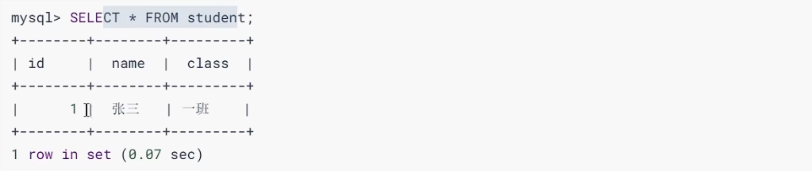

假设插入该记录的事务id为8，那么此刻该条记录的示意图如下所示:

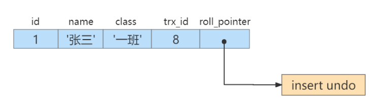

假设之后两个事务id分别为 10 、 20 的事务对这条记录进行 UPDATE 操作，操作流程如下：

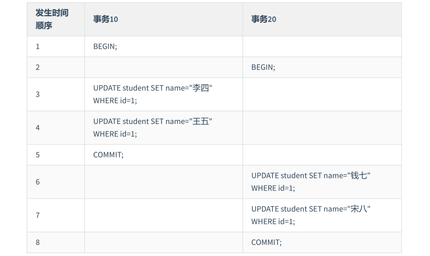

每次对记录进行UPDATE操作，都会记录一条undo日志，每条undo日志也都有一个 roll_pointer 属性（ INSERT 操作对应的undo日志没有该属性，因为该记录并没有更早的版本），可以将这些 undo日志都连起来，串成一个链表：

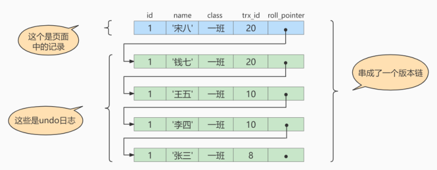

对该记录每次更新后，都会将旧值放到一条 **undo日志** 中，就算是该记录的一个旧版本，随着更新次数的增多，所有的版本都会被 `roll_pointer` 属性连接成一个链表，我们把这个链表称之为 **版本链** ，版本链的头节点就是当前记录最新的值。

每个版本中还包含生成该版本时对应的 **事务id** 。

---

### 🔄 三、這條版本鏈是做什麼用的？

MVCC 機制中，**不同的事務只能看到它們啟動時「可見的版本」**。舉例：

- 若你用事務 ID = 15 查詢資料，則你應該看到的是：
  - 年齡為 19（來自事務 #10 更新的版本），因為事務 #20 還沒提交或尚未可見。

系統就是根據你事務開始時的 snapshot 與版本鏈上每個 `trx_id` 來判斷「哪個版本是對你可見的」。

---

### 🚫 四、為何不允許兩個事務同時更新一筆資料？（防止脏寫）

在 InnoDB 中，當一筆記錄被某個事務更新，該記錄就會加上「行鎖」。其他事務想要修改這筆資料，**必須等待該事務提交並釋放鎖後**才能繼續。

#### 🔒 舉例

- 事務 A（trx_id = 10）對 id = 1 的資料做 `UPDATE`
- 系統會加行鎖在該筆資料上
- 此時事務 B（trx_id = 20）想更新同一筆記錄，會被阻塞
- 直到 A commit，B 才能進行修改

這樣就**避免了「脏寫（dirty write）」**，也就是「寫入未提交資料的狀況」。

---

### 🧾 五、Undo Log 何時會被釋放？

- `INSERT` 的 undo log：只在事務**回滾時**會用到，一旦提交就沒用了，系統會自動回收
- `UPDATE/DELETE` 的 undo log：會保留一段時間供 **其他快照事務** 使用（實現 MVCC），過一段時間後再由 **purge 線程** 回收

---

### ✅ 總結

| 元素         | 說明 |
|--------------|------|
| `trx_id`     | 標記是哪個事務最後修改了資料 |
| `roll_pointer` | 指向前一版本的 Undo Log，形成版本鏈 |
| 版本鏈       | 讓每個事務看到屬於自己的歷史版本（實現快照讀） |
| 脏寫避免機制  | 使用行鎖保護資料修改，不允許未提交資料被寫入 |
| Undo Log 回收 | `INSERT` 立即釋放，`UPDATE` 延遲回收以支援快照 |

---

# 4. MVCC实现原理之ReadView
> MVCC 的实现依赖于：隐藏字段(trx_id、roll_pointer)、Undo Log、ReadView 。

## 4.1 什么是ReadView
### ✅ 什麼是 ReadView？

**ReadView** 是在使用 **MVCC（多版本並發控制）** 時，為了實現「快照讀（snapshot read）」所建立的一個「讀視圖」。

它的作用是：

> 幫助當前查詢的事務，判斷某條記錄的某個版本是否**對當前事務可見**（也就是：該版本的數據是不是我應該讀到的那個？）。

ReadView 會在快照讀發生時生成，記錄「當前有哪些活躍的事務」資訊，用來幫你決定該走到 Undo Log 中哪一版數據。

---

### 💡 舉個例子說明 ReadView 的作用

#### 假設場景：

有一張表 `student`，有一條紀錄：

```sql
id = 1, name = 'Tom'
```

#### 發生以下操作：

1. **T1 事務開始** → 更新 `name = 'Tom' → 'Tom_v1'`，但還沒提交。
2. **T2 事務開始** → 發起一次「查詢操作」想讀取 `id = 1` 的資料。
3. T2 發現這條記錄已被改動過，那該讀哪個版本呢？這時就需要 **ReadView** 來幫忙判斷。

---

#### 🔍 T2 查詢時會生成一個 ReadView，其中包含以下資訊：

- `up_limit_id`: 所有活躍事務中最小的事務ID。
- `low_limit_id`: 下次要分配給新事務的ID（也可理解為當前最大的事務ID）。
- `trx_ids`: 此刻資料庫中所有還**沒提交**的事務ID（例如：T1 的 ID）。

#### ❓ ReadView 判斷規則（簡化版）：

ReadView 會拿每一筆紀錄的 `trx_id`（記錄是誰寫的）與上述資訊比對，來決定該版本是否對當前事務可見。

- 如果該版本是自己寫的（T2 自己），可見。
- 如果該版本是來自**已經提交的事務**，可見。
- 如果該版本是來自 **活躍事務清單中的事務（尚未提交）**，不可見，要往 Undo Log 裡找上個版本。

---

#### 🎯 回到剛剛的例子：

- T1 更新了資料，但還沒提交。
- T2 查詢時，ReadView 發現 T1 是活躍事務。
- 所以 T2 **看不到 T1 更新後的值** → 會透過 `roll_pointer` 去 Undo Log 中找到舊版本（`Tom`）來讀取。

---

### 🧠 總結一下

| 元素            | 說明 |
|----------------|------|
| `ReadView`     | 一個「事務快照」，記錄目前有哪些事務是活躍的（未提交） |
| `trx_id`       | 每筆記錄的「最後修改者」是哪個事務 |
| `Undo Log`     | 儲存記錄的「歷史版本」鏈條 |
| 可見性判斷規則 | 根據 ReadView 與 trx_id 的比對結果，決定是否該讀這一版資料 |

---

## 4.2 设计思路
### ✅ 基本概念說明

ReadView 其實是一個「**快照讀取的視圖**」，它幫助 MySQL 判斷某筆資料是否對目前的事務可見。主要包含以下資訊：

| 參數 | 說明 |
|------|------|
| `creator_trx_id` | 建立這個 ReadView 的事務ID。<br>僅當事務有**修改操作**（INSERT/DELETE/UPDATE）時才會有非0 ID，否則為0。 |
| `trx_ids` | **生成 ReadView 時活躍（尚未提交）的所有事務ID集合**。 |
| `up_limit_id` | `trx_ids` 中最小的事務ID。 |
| `low_limit_id` | 系統中下一個即將被分配的事務ID，也就是目前最大的事務ID + 1。<br>注意它不等於 `trx_ids` 中的最大值。 |

---

### 📌 舉例說明

#### 假設當前資料庫的事務如下：

| 事務ID | 狀態     |
|--------|----------|
| trx1   | 已提交   |
| trx2   | 執行中（活躍） |
| trx3   | 執行中（活躍） |
| trx4   | 已提交   |
| trx5   | 執行中（活躍） |
| trx6   | 已提交   |
| trx7   | 已提交   |
| trx8   | 執行中（活躍） |

這時候你啟動了一個新的查詢事務 `trx9`，要做「快照讀」，所以會生成一個 `ReadView`，此時會出現以下數值：

| 名稱 | 值 | 說明 |
|------|----|------|
| `creator_trx_id` | trx9 | 表示目前這個 ReadView 是由 `trx9` 創建的 |
| `trx_ids` | [trx2, trx3, trx5, trx8] | 目前還沒提交的事務清單 |
| `up_limit_id` | trx2 | trx_ids 中最小的 ID |
| `low_limit_id` | trx10 | 系統目前下一個要分配的 ID（假設 trx9 是最新分配的） |

---

### 🧠 如何用 ReadView 判斷可見性？

ReadView 最重要的功能，就是在你查詢資料時，幫你判斷「某筆資料版本是由哪個事務產生的，是否可見？」

舉例來說：

資料表中某筆記錄的 `trx_id = trx4`（表示這筆資料是由 trx4 修改過的）

那麼 ReadView 判斷邏輯如下：

1. **如果 trx_id < up_limit_id** → 資料可見（代表修改它的事務已提交） ✅
2. **如果 trx_id ≥ low_limit_id** → 資料不可見（未來的事務）❌
3. **如果 trx_id ∈ trx_ids** → 資料不可見（尚未提交）❌
4. **其他情況** → 資料可見 ✅

---

### 📝 總結比喻

你可以把 `ReadView` 想像成是「一張快照照片」，記錄了當前有哪些人在餐廳（活躍事務），哪些人已經離開（已提交）。你（事務）依據這張照片來決定你能看到哪些人的改動。

---

## 4.3 ReadView的规则
### 🔧 ReadView 判斷規則總結（簡化成 5 條）

假設你查詢的那筆資料有個 `trx_id`（表示它是由哪個事務產生的版本），系統會依照以下規則逐條比對：

---

| 規則編號 | 條件 | 解釋 | 是否可見 |
|----------|------|------|-----------|
| R1 | `trx_id == creator_trx_id` | 是自己產生的版本 | ✅ 可見 |
| R2 | `trx_id < up_limit_id` | 產生它的事務已經提交了 | ✅ 可見 |
| R3 | `trx_id ≥ low_limit_id` | 產生它的事務還沒開始（未來的事務） | ❌ 不可見 |
| R4 | `trx_id ∈ trx_ids` | 是活躍事務產生的版本（未提交） | ❌ 不可見 |
| R5 | 介於 up_limit_id 和 low_limit_id 且 **不在 trx_ids 中** | 雖然是在範圍內，但事務已提交 | ✅ 可見 |

---

### 📘 舉例說明

假設目前有以下活躍狀態的事務：

| 事務 | 狀態     |
|------|----------|
| trx1 | 已提交   |
| trx2 | 活躍中   |
| trx3 | 活躍中   |
| trx4 | 已提交   |
| trx5 | 活躍中   |
| trx6 | 已提交   |
| trx7 | 活躍中   |

現在你啟動了一個新的事務 `trx8`，執行 `SELECT` 查詢產生了 ReadView，如下：

| 欄位名稱 | 數值 | 說明 |
|----------|------|------|
| creator_trx_id | trx8 | 建立這個 ReadView 的事務 ID |
| trx_ids | [trx2, trx3, trx5, trx7] | 活躍中（未提交）的事務 |
| up_limit_id | trx2 | 活躍事務中最小的 trx_id |
| low_limit_id | trx9 | 系統下一個要分配的 trx_id |

---

### 🔍 來試著判斷以下版本是否可見

#### 1️⃣ 資料的 `trx_id = trx8`
- 符合 R1（自己修改的）✅ → **可見**

#### 2️⃣ 資料的 `trx_id = trx1`
- `trx_id < up_limit_id (trx2)` ✅ → **可見（已提交）**

#### 3️⃣ 資料的 `trx_id = trx9`
- `trx_id ≥ low_limit_id` ✅ → **不可見（未來事務）**

#### 4️⃣ 資料的 `trx_id = trx3`
- `trx3` 介於 up_limit_id 和 low_limit_id，**而且在 trx_ids 中** ❌ → **不可見（未提交）**

#### 5️⃣ 資料的 `trx_id = trx4`
- `trx4` 介於 trx2 和 trx9，但不在 trx_ids ✅ → **可見（已提交）**

---

### 🧠 視覺記憶小技巧

你可以這樣畫個數線來輔助記憶：

```plaintext
  trx_id:        1   2   3   4   5   6   7       8       9
狀態 (例子):       ✓   活  活  ✓   活  ✓   活     <-你->    (未來)
                                               ↑creator   ↑low
                     trx_ids=[2,3,5,7]
```

只要你查到一筆記錄，它的 `trx_id` 在這條線上，你就能對照 ReadView 的規則一條條去判斷「是否可見」。

---

### ✅ 總結成一句話

> **ReadView 是讓事務在查詢資料時，知道哪些資料版本是自己應該「看得見的」，哪些是「看不見的」。**

## 4.4 MVCC整体操作流程
「**MySQL InnoDB 如何利用 MVCC 機制進行查詢操作的整體流程說明**」，核心關鍵在於：

> **MVCC = Undo Log + ReadView**  
ReadView 判斷是否可見，Undo Log 提供舊版本資料。

---

### ✅ MVCC 查詢流程（一步步拆解）

當你執行一條 `SELECT` 查詢時，InnoDB 是這樣做的：

1. **步驟 1：取得當前事務 ID**
    - 每個事務都有唯一的 `trx_id`，用來識別資料是由哪個事務產生的。

2. **步驟 2：生成 ReadView（讀視圖）**
    - 用來記錄目前「活躍中的事務」有哪些，幫你判斷「哪些資料版本可見」。

3. **步驟 3：讀取當前資料（最新版本）**
    - 資料頁中可能有多個版本（不同事務的修改），會先看**當前最新版本（最上層版本）**的 `trx_id`。

4. **步驟 4：依照 ReadView 規則判斷是否可見**
    - 這裡會套用你剛剛學到的 ReadView 判斷邏輯（R1~R5）來判斷目前這個版本你能不能看到。

5. *8步驟 5：若不可見 ➜ 使用 Undo Log 找「前一個版本」**
    - 因為資料的舊版本會被存在 Undo Log 裡（透過 roll_pointer 連結），會往下找上一個版本，繼續 Step 4。

6. **步驟 6：直到找到可見版本，或版本鏈到底都不可見**
    - 若有可見版本，就返回該版本資料；
    - 如果整條版本鏈都不可見，那這筆記錄就「對你不可見」，查詢結果就不包含它。

---

### 📘 舉例說明

#### 假設資料表 student 有一筆記錄：

```sql
id=1, name='Alice', age=20
```

#### 操作歷程如下：

1. `trx1` 插入資料，提交（`trx_id=1`）
2. `trx2` 把 age 改為 21，未提交（`trx_id=2`）
3. `你現在啟動 trx3`，執行查詢：

```sql
SELECT * FROM student WHERE id = 1;
```

---

#### 系統處理流程：

- **Step 1：取得你的 trx_id** ➜ `trx3`
- **Step 2：產生 ReadView** ➜ 記錄活躍中的事務（`trx2` 還沒提交）
- **Step 3：讀到資料頁中最新版本：age=21，trx_id=2**
- **Step 4：ReadView 判斷 trx2 在 trx_ids 裡 ➜ 不可見**
- **Step 5：找 Undo Log ➜ 發現前一版本：age=20，trx_id=1**
- **Step 6：ReadView 判斷 trx1 已提交 ➜ 可見 ✅**

✅ **所以你查到的結果是：age = 20**（雖然資料頁最新是 21）

---

### 🧠 總結關鍵點

- **查詢是從資料頁最上層開始讀**（最新版本）
- **不可見 ➜ 就去找 Undo Log 的前一個版本**
- **不斷比對可見性，直到找到可見版本或整條都不可見**

---

### 隔离级别为读已提交（Read Committed）
> 在隔离级别为读已提交（Read Committed）时，一个事务中的每一次 SELECT 查询都会重新获取一次Read View。

如表所示：

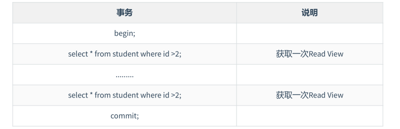

> 注意，此时同样的查询语句都会重新获取一次 Read View，这时如果 Read View 不同，就可能产生不可重复读或者幻读的情况。

### 隔离级别为可重复读
> 当隔离级别为可重复读的时候，就避免了不可重复读，这是因为一个事务只在第一次 SELECT 的时候会获取一次 Read View，而后面所有的 SELECT 都会复用这个 Read View，如下表所示：

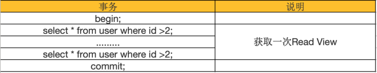

# 5. 举例说明
假设现在 student 表中只有一条由事务id为8的事务插入的一条记录:

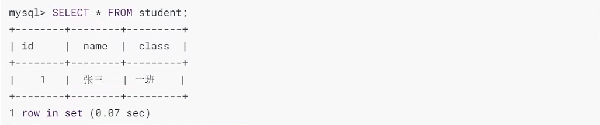

> `MVCC` 只能在 `READ COMMTTED` 和 `REPEATABLE READ` 两个隔离级别下工作。接下来看一下 `READ COMMITTED` 和 `REPEATABLE READ` 所谓的生成 `ReadView` 的时机不同到底不同在哪里。

## 5.1 READ COMMITTED隔离级别下
> READ COMMITTED：每次读取数据前都生成一个ReadView。

现在有 **两个事务id 分别为 10 、 20** 的事务在执行：

```sql
-- Transaction 10
BEGIN;
UPDATE student SET name="李四" WHERE id=1;
UPDATE student SET name="王五" WHERE id=1;
 
-- Transaction 20
BEGIN;
-- 更新了一些别的表的记录 ...
```

> **说明:**
> - 事务执行过程中，只有在 **第一次真正修改记录** 时(比如使用INSERT、DELETE、UPDATE语句)，才会被分配一个单独的事务id，这个事务id是递增的。所以我们才在事务20中更新一些别的表的记录，目的是让它分配事务id。

此刻，表student 中 id 为 1 的记录得到的版本链表如下所示：


假设现在有一个使用 READ COMMITTED 隔离级别的事务开始执行：

```sql
-- 使用READ COMMITTED隔离级别的事务
BEGIN;
 
-- SELECT1：Transaction 10、20未提交
SELECT * FROM student WHERE id = 1; -- 得到的列name的值为'张三'
```

### 这个 SELECT1 的执行过程如下:

1. **步骤1：** 在执行 SELECT 语句时会先生成一个 ReadView，ReadView 的 `trx_ids` 列表的内容就是 **[10, 20]**，`up_limit_id` 为 10, `low_limit_id` 为 21, `creator_trx_id` 为 0。

2. **步骤2：** 从版本链中挑选可见的记录，从图中看出，最新版本的列 name 的内容是 '王五'，该版本的 `trx_id` 值为 10，在 `trx_ids` 列表内，所以不符合可见性要求，根据 `roll_pointer` 跳到下一个版本。

3. **步骤3：** 下一个版本的列 name 的内容是 '李四'，该版本的 `trx_id` 值也为 10，也在 `trx_ids` 列表内，所以也不符合要求。继续跳到下一个版本。

4. **步骤4：** 下一个版本的列 name 的内容是 '张三'，该版本的 `trx_id` 值为 8，小于 ReadView 中的 `up_limit_id` 值 10，所以这个版本是符合要求的，最后返回给用户的版本就是这条列name为‘张三'的记录。

### 之后，我们把 `事务id` 为 `10` 的事务提交一下：
```sql
-- Transaction 10
BEGIN;
UPDATE student SET name="李四" WHERE id=1;
UPDATE student SET name="王五" WHERE id=1;
COMMIT;
```

### 然后再到 `事务id` 为 `20` 的事务中更新一下表 student 中 id 为 1 的记录：
```sql
-- Transaction 20
BEGIN;
-- 更新了一些别的表的记录 ...
UPDATE student SET name="钱七" WHERE id=1;
UPDATE student SET name="宋八" WHERE id=1;
```

此刻，表student中 id 为 1 的记录的版本链就长这样：

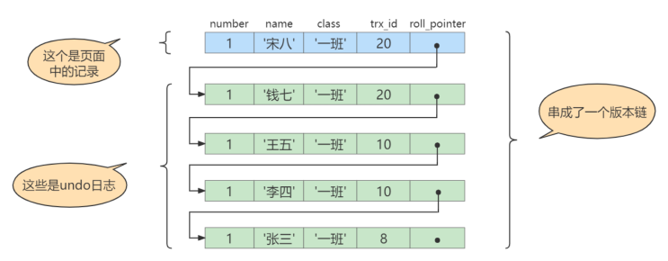 

然后再到刚才使用 READ COMMITTED 隔离级别的事务中继续查找这个 id 为 1 的记录，如下：

```sql
-- 使用READ COMMITTED隔离级别的事务
BEGIN;
 
-- SELECT1：Transaction 10、20均未提交
SELECT * FROM student WHERE id = 1; -- 得到的列name的值为'张三'
 
-- SELECT2：Transaction 10提交，Transaction 20未提交
SELECT * FROM student WHERE id = 1; -- 得到的列name的值为'王五'
```

### 这个SELECT2的执行过程如下：

1. **步骤1：** 在执行SELECT语句时会又会单独生成一个 ReadView，该 ReadView 的`trx_ids` 列表的内容就是 **[20]**，`up_limit_id` 为 `20`, `low_limit_id` 为 21, `creator_trx_id` 为 0。

2. **步骤2：** 从版本链中挑选可见的记录，从图中看出，最新版本的列name的内容是'宋八'，该版本的 `trx_id` 值为20，在 `trx_ids` 列表内，所以不符合可见性要求，根据`roll_pointer` 跳到下一个版本。

3. **步骤3：** 下一个版本的列name的内容是'钱七'，该版本的 `trx_id` 值为 20，也在`trx_ids` 列表内，所以也不符合要求，继续跳到下一个版本。

4. **步骤4：** 下一个版本的列name的内容是'王五'，该版本的 `trx_id` 值为10，小于ReadView中的 `up_limit_id` 值20，所以这个版本是符合要求的，最后返回给用户的版本就是这条列name为'王五'的记录。

> 强调:使用READ COMMITTED隔离级别的事务在每次查询开始时都会生成一个独立的ReadView

## 5.2 REPEATABLE READ隔离级别下
> 使用 **REPEATABLE READ隔离级别** 的事务来说，只会在第一次执行查询语句时生成一个 ReadView ，之后的查询就不会重复生成了。

比如，系统里有两个 `事务id 分别为 10 、 20` 的事务在执行：

```sql
-- Transaction 10
BEGIN;
UPDATE student SET name="李四" WHERE id=1;
UPDATE student SET name="王五" WHERE id=1;
 
 
-- Transaction 20
BEGIN;
-- 更新了一些别的表的记录...
```

此刻，表student 中 id 为 1 的记录得到的版本链表如下所示：

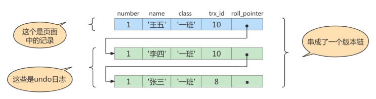

假设现在有一个使用 REPEATABLE READ 隔离级别的事务开始执行：

```sql
-- 使用REPEATABLE READ隔离级别的事务
BEGIN;
-- SELECT1：Transaction 10、20未提交
SELECT * FROM student WHERE id = 1; -- 得到的列name的值为'张三'
```

### 这个SELECT1的执行过程如下：

1. **步骤1：** 在执行SELECT语句时会先生成一个ReadView ，ReadView的 `trx_ids` 列表的内容就是 `[10，20 ]`，`up_limit_id` 为10, `low_limit_id` 为 21, `creator_trx_id` 为 0。

2. **步骤2：** 然后从版本链中挑选可见的记录，从图中看出，最新版本的列name的内容是'王五'，该版本的 `trx_id` 值为10，在 `trx_ids` 列表内，所以不符合可见性要求，根据 `roll_pointer` 跳到下一个版本。

3. **步骤3：** 下一个版本的列name的内容是'李四'，该版本的 `trx_id` 值也为10，也在 `trx_ids` 列表内，所以也不符合要求，继续跳到下一个版本。

4. **步骤4：** 下一个版本的列name的内容是'张三'，该版本的 `trx_id` 值为8，小于ReadView中的 `up_limit_id` 值10，所以这个版本是符合要求的，最后返回给用户的版本就是这条列name为'张三'的记录。

### 之后，我们把 事务id 为 10 的事务提交一下，就像这样：
```sql
-- Transaction 10
BEGIN;
UPDATE student SET name="李四" WHERE id=1;
UPDATE student SET name="王五" WHERE id=1;
COMMIT;
```

### 然后再到 事务id 为 20 的事务中更新一下表 student 中 id 为 1 的记录：
```sql
-- Transaction 20
BEGIN;

-- 更新了一些别的表的记录...
UPDATE student SET name="钱七" WHERE id=1;
UPDATE student SET name="宋八" WHERE id=1;
```

此刻，表student 中 id 为 1 的记录的版本链长这样：


然后再到刚才使用 REPEATABLE READ 隔离级别的事务中继续查找这个 id 为 1 的记录，如下：

```sql
-- 使用REPEATABLE READ隔离级别的事务
BEGIN;
-- SELECT1：Transaction 10、20均未提交
-- SELECT * FROM student WHERE id = 1; -- 得到的列name的值为'张三'
 
-- SELECT2：Transaction 10提交，Transaction 20未提交
SELECT * FROM student WHERE id = 1; -- 得到的列name的值仍为'张三'
```

### SELECT2的执行过程如下：

1. **步骤1：** 因为当前事务的隔离级别为REPEATABLE READ，而之前在执行SELECT时已经生成过ReadView了，所以此时直接复用之前的ReadView，之前的ReadView的 `trx_ids` 列表的内容就是 `[10，20]`,`up_limit_id` 为10, `low_limit_id` 为 21, `creator_trx_id` 为 0。

2. **步骤2：** 然后从版本链中挑选可见的记录，从图中可以看出，最新版本的列name的内容是'宋八'，该版本的 `trx_id` 值为20，在 `trx_ids` 列表内，所以不符合可见性要求，根据 `roll_pointer` 跳到下一个版本。

3. **步骤3：** 下一个版本的列name的内容是'钱七'，该版本的 `trx_id` 值为20，也在 `trx_ids` 列表内，所以也不符合要求，继续跳到下一个版本。

4. **步骤4：** 下一个版本的列name的内容是'王五’，该版本的 `trx_id` 值为10，而 `trx_ids` 列表中是包含值为10的事务id的，所以该版本也不符合要求，同理下一个列name的内容是'李四’的版本也不符合要求。继续跳到下一个版本。

5. **步骤5：** 下一个版本的列name的内容是‘张三'，该版本的 `trx_id` 值为 8，小于ReadView中的 `up_limit_id` 值10，所以这个版本是符合要求的，最后返回给用户的版本就是这条列name为‘张三'的记录。

> 两次SELECT查询得到的结果是重复的，记录的列name值都是‘张三’，这就是可重复读的含义。如果我们之后再把事务id为20的记录提交了，然后再到刚才使用 REPEATABLE READ 隔离级别的事务中继续查找这个id为1的记录，得到的结果还是‘张三’，具体执行过程大家可以自己分析一下。

## 5.3 如何解决幻读
> 接下来说明InnoDB 是如何解决幻读的。

假设现在表 student 中只有一条数据，数据内容中，主键 id=1，隐藏的 `trx_id=10`，它的 undo log 如下图所示。

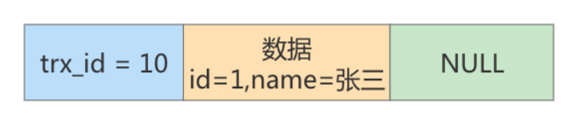

假设现在有事务 A 和事务 B 并发执行，事务 A的事务 id 为20，事务 B的事务 id 为30。

### 步骤1：事务 A 开始第一次查询数据，查询的 SQL 语句如下。

```sql
select * from student where id >= 1;
```

在开始查询之前，MySQL 会为事务 A 产生一个 ReadView，此时 ReadView 的内容如下：`trx_ids= [20,30]`，`up_limit_id=20`，`low_limit_id=31`，`creator_trx_id=20`。

由于此时表 student 中只有一条数据，且符合 `where id >= 1` 条件，因此会查询出来。然后根据 ReadView 机制，发现该行数据的 `trx_id=10`，小于事务 A 的 ReadView 里 `up_limit_id`，这表示这条数据是事务 A 开启之前，其他事务就已经提交了的数据，因此事务 A 可以读取到。

结论：事务 A 的第一次查询，能读取到一条数据，id=1。

### 步骤2：接着事务 B(trx_id=30)，往表 student 中新插入两条数据，并提交事务。
```sql
insert into student(id,name) values(2,'李四'); 
insert into student(id,name) values(3,'王五');
```

此时表student 中就有三条数据了，对应的 undo 如下图所示：

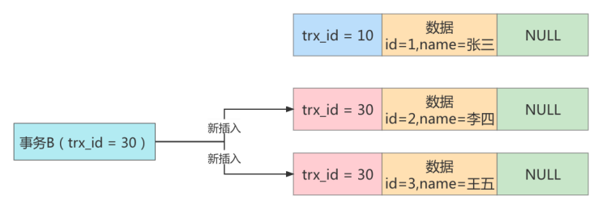

### 步骤3：接着事务 A 开启第二次查询，根据可重复读隔离级别的规则，此时事务 A 并不会再重新生成ReadView。
> 此时表 student 中的 3 条数据都满足 `where id >= 1` 的条件，因此会先查出来。然后根据 ReadView 机制，判断每条数据是不是都可以被事务 A 看到。

1）首先 id=1 的这条数据，前面已经说过了，可以被事务 A 看到。

2）然后是 id=2 的数据，它的 `trx_id=30`，此时事务 A 发现，这个值处于 `up_limit_id` 和 `low_limit_id` 之间，因此还需要再判断 30 是否处于 `trx_ids` 数组内。由于事务 A 的 `trx_ids=[20,30]`，因此在数组内，这表示 id=2 的这条数据是与事务 A 在同一时刻启动的其他事务提交的，所以这条数据不能让事务 A 看到。

3）同理，id=3 的这条数据，trx_id 也为 30，因此也不能被事务 A 看见。

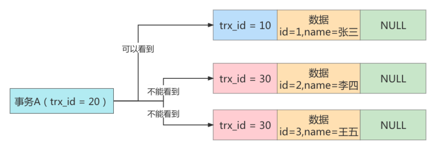

> 结论：最终事务 A 的第二次查询，只能查询出 id=1 的这条数据。这和事务 A 的第一次查询的结果是一样的，因此没有出现幻读现象，所以说在 MySQL 的可重复读隔离级别下，不存在幻读问题。

# 6. 总结
## ✅ 一、核心原理：MVCC + ReadView + Undo Log

### 🧠 MVCC 解決什麼問題？

> 傳統的鎖機制（悲觀鎖）會讓讀寫互相阻塞，降低性能。  
> MVCC（Multi-Version Concurrency Control）允許 **多個版本共存**，讓讀和寫彼此不干擾。

MVCC 的實現依靠兩個核心：

| 元件 | 說明 |
|------|------|
| **Undo Log** | 保存歷史版本資料（用來往回找） |
| **ReadView** | 快照讀期間的視圖，幫你判斷版本是否可見 |

---

## ✅ 二、隔離級別與 ReadView 行為差異

| 隔離級別 | ReadView 建立時機 | 結果 |
|----------|------------------|------|
| `READ COMMITTED` | **每次查詢都建立新的 ReadView** | ➤ 可看到最新已提交資料（容易產生不可重複讀） |
| `REPEATABLE READ` | **第一次查詢時建立一次 ReadView，後續共用** | ➤ 快照固定，不可重複讀被避免（MySQL預設） |

---

## ✅ 三、舉例說明：同一事務內查詢兩次資料

假設資料表 `user` 有一筆記錄：

```sql
id = 1, name = 'Tom'
```

此時，事務 A 和事務 B 的操作如下：

### 🎯 使用 `READ COMMITTED` 的情況

```sql
-- 事務 A（使用 READ COMMITTED）

START TRANSACTION;
SELECT name FROM user WHERE id = 1; -- 得到 "Tom"

-- 事務 B 在此時更新並提交
UPDATE user SET name = 'Jerry' WHERE id = 1;
COMMIT;

-- 事務 A 再次查詢
SELECT name FROM user WHERE id = 1; -- 得到 "Jerry"（新的 ReadView）
```

➡️ 因為每次查詢都生成新的 ReadView，所以兩次結果不同 → 不可重複讀

---

### 🛡️ 使用 `REPEATABLE READ` 的情況

```sql
-- 事務 A（使用 REPEATABLE READ）

START TRANSACTION;
SELECT name FROM user WHERE id = 1; -- 得到 "Tom"（建立 ReadView）

-- 事務 B 更新並提交
UPDATE user SET name = 'Jerry' WHERE id = 1;
COMMIT;

-- 事務 A 再次查詢
SELECT name FROM user WHERE id = 1; -- 仍然得到 "Tom"（使用舊 ReadView）
```

➡️ 查詢都使用同一個快照，所以結果一致 → 保證重複讀一致性

---

## ✅ 四、「打上刪除標記」是怎麼回事？

> InnoDB 在刪除資料時並不立即真正刪除，而是：

- **將資料打上「delete mark」刪除標記**
- 保留該版本在 Undo Log 中，以便尚未提交的事務仍然可以透過版本鏈查到這筆資料（如果對它可見）

🧪 舉例說明：
```sql
-- 事務 A 查到 id = 1 的資料
SELECT * FROM user WHERE id = 1;

-- 事務 B DELETE 該筆資料，但尚未提交
DELETE FROM user WHERE id = 1;

-- 事務 A 繼續查詢，仍能看到該筆資料
-- 因為透過 Undo Log + ReadView，判斷該版本可見
```

---

## ✅ 五、MVCC 的三大優勢總結

| 問題 | MVCC 解法 |
|------|-----------|
| 讀寫互相阻塞？ | ✅ 不會，讀操作不加鎖，寫操作行鎖，彼此不干擾 |
| 容易死鎖？ | ✅ 機率降低，因為讀取不加鎖（樂觀鎖實現） |
| 快照查詢不一致？ | ✅ 可根據隔離級別精準控制可見快照版本 |

---

## ✅ 六、總結圖（簡化）

```
               ┌──────────────┐
               │  查詢記錄     ｜
               └─────┬────────┘
                     ↓
              檢查版本 trx_id
                     ↓
              ┌───────────────┐
              │ 符合 ReadView? │── Yes ──→ 返回資料
              └───────┬───────┘
                      ↓ No
              查 Undo Log 前一版本
                      ↓
        若整條版本鏈皆不可見 → 該筆資料對你隱藏
```

---